# 一、高级基础设施渗透测试简介

安全性是所有行业中各种规模的企业和组织的关键问题。信息安全是一组过程、工具、策略和系统，用于防止可能损坏或破坏信息资产的内部和外部威胁。本书是实践性的，旨在引导您了解真实世界的技术，以便您能够获得所需的和高度要求的技能，从而使您能够跨入渗透测试职业的新水平。每一章都是专门设计的，不仅是为了让你学习模拟黑客攻击的方法、工具和技术，还为了让你有一种新的思维方式。在本章中，您将了解最新的渗透测试策略和技术。它将带领您详细完成每一个必要步骤，以执行有效的渗透测试，并且能够根据行业公认的指标评估 pentesting 报告。完成本章后，您将拥有提供高标准且有良好文档记录的渗透测试报告的技能，在练习收集任何目标（即使是在 DeepWeb 中）的信息并超越自动化工具之后。

# 信息安全概述

在深入渗透测试之前，让我们先了解一些信息安全方面的重要术语。信息安全的核心原则是机密性、可用性和完整性。这些原则构成了我们所谓的中情局三合会。

# 保密性

保密性声明，所有信息和数据只能由有权访问的人员访问。重要的是确保信息不会被未经授权的方披露。**个人身份信息**（**PII**的盗窃就是保密攻击的一个例子。

# 诚实正直

完整性的目的是保护信息不受未经授权的修改；换句话说，就是数据的可信度。这意味着在每个信息处理过程中，数据都必须是一致的、准确的和可信的。某些保护方法必须到位并可用，以检测数据中的任何更改。

# 可利用性

可用性旨在确保授权用户在需要时可以使用信息。**拒绝服务**（**DoS**是可用性攻击的一个示例。高可用性群集和备份副本是用于抵御可用性攻击的一些缓解系统。

目前有许多信息安全定义可用。先前的定义基于 ISO/IEC 27001 信息安全管理标准。

# 最少的特权和需要知道

*最小权限和需要知道*描述了授权用户在其工作期间应被授予最小访问和授权量的事实。*需要知道*意味着用户必须有合法的理由访问信息。

# 纵深防御

纵深防御，或分层安全，是一种使用多层安全线的安全方法，并控制使用来自不同供应商的多个防火墙的*纵深防御*方法的示例，以提高系统的安全性。

# 风险分析

信息安全专业人员的主要职责是评估企业资产（需要保护的资源）的风险，并实施安全控制以防范这些风险。分析风险是一项非常重要的技能，因为良好的判断将使我们选择最佳的安全控制和保护机制，包括部署这些保障措施所需的财政资源量。换句话说，一个错误的决策将给企业带来巨大的成本，甚至更糟糕的是，客户数据的丢失。在不了解威胁和漏洞的情况下，我们无法定量计算风险。威胁是对我们资产的潜在危险，可能会损害系统。漏洞是允许威胁采取负面行动的弱点。这两个术语以及它们之间的联系由公式`Risk = Threat*Vulnerability`描述。

要评估威胁和漏洞，您需要分配一个范围为 1 到 5 的数字，例如。使用另一个范围是可能的。有时，我们可以添加另一个名为“影响”的因素，该因素描述了造成损害的影响。在其他情况下，它表示为一个金额来描述该影响的成本，因此公式可以表示为`Risk = Threat*Vulnerability*Impact`。

为了进行定性和定量风险分析，我们可以根据**澳大利亚/新西兰 4360 标准**（**AS/NZS 4360**的风险管理使用风险分析矩阵。

信息安全专业人员需要根据两个指标对风险进行分类：发生频率和事故严重程度。这一分类的结果将决定下一个行动计划。因此，如果风险很高，他们必须通知高级管理层。下一步是创建一个路线图，尽可能将每个风险降低到较低水平，如下所示：


# 信息保障

**信息保证**（**IA**是指保证信息的机密性、完整性和可用性，并确保所有系统在信息处理的不同阶段得到保护。政策、指导方针、确定资源需求、确定漏洞和培训是信息保证的形式。

# 信息安全管理计划

信息安全管理计划的主要目的是确保企业在风险降低的环境中运营。这意味着在整个过程中，组织方和运营方之间会发生协同工作。**信息安全管理框架**（**ISMF**是业务驱动框架（策略、程序、标准和指南）的一个示例，可帮助信息安全专业人员建立良好的安全级别。

# 黑客概念和阶段

黑客攻击是指利用信息系统中的漏洞获得对系统的未经授权访问以披露数据。在本节中，我们将讨论黑客的类型和黑客攻击阶段。

# 黑客类型

我们可以根据黑客的意图将其分类。如果黑客的目的是破坏或窃取信息，那么他们被归类为**黑帽黑客**。如果是以保护系统安全为目标的安全专业人员，那么他们被归类为**白帽黑客**。说明如下：

*   **黑帽黑客**：这些个人或团体利用他们的计算机技能，利用恶意技术获取信息，其原因多种多样，例如经济利益。
*   **白帽黑客**：他们是信息安全专业人士。他们的主要任务是保护信息系统免受黑帽黑客的攻击。
*   **灰帽黑客**：这些黑客在攻击和防御两方面都有效。
*   **脚本小子**：通常，这些人都是不熟练的人，他们使用工具和脚本，却不知道它们是如何工作的。
*   **黑客行动主义者**：他们是有政治目的的黑客，或者是某种事业的捍卫者。

# 黑客攻击阶段

要使黑客攻击成功，操作必须遵循一系列阶段。

# 侦察

在第一阶段，在采取任何行动之前，攻击者必须做好准备，对目标进行信息收集练习。攻击者从许多来源收集每一条公开可用的敏感信息，如目标客户机、员工和网络信息。在该阶段结束时，黑客将清楚地了解网络（域名、IP 范围、TCP/UDP 服务和身份验证机制）、系统（用户名/组名、系统横幅和系统架构）和组织信息（员工详细信息、新闻发布和位置）。有两种类型的侦察或足迹。

# 被动侦察

被动侦察包括在不直接与目标交互的情况下获取有关目标的信息，例如搜索公共信息。

# 主动侦察

主动侦察涉及与目标的交互，例如，呼叫技术支持以获取一些敏感信息。

侦察不仅仅是技术性的。它也是竞争情报的重要武器。了解目标的某些财务方面可能意味着攻击成功。

# 扫描

在收集了大量有关目标的信息后，攻击者必须对其进行扫描，以显示有关系统的有用信息，并将此信息用于下一阶段（*获取访问*阶段）。在此过程中，攻击者将查找不同类型的信息，为此，他将使用不同类型的扫描。

# 端口扫描

端口扫描是向目标发送数据包的过程，目的是通过已知端口号了解更多信息。端口扫描分为两类：TCP 扫描和 UDP 扫描。要尝试端口扫描，建议您使用 Nmap，它是一种开源端口扫描和网络探索工具。

# 网络扫描

网络扫描描述了定位网络上所有活动主机的过程。扫描一系列 IP 是一种网络扫描。发现活动主机的基本技术是 ping 扫描。它只是从一系列 IP 地址向多个主机发送 ICMP 回显请求。`Hping2`是一款简单的 TCP/IP 协议命令行网络扫描器。

# 漏洞扫描

在此子阶段，攻击者试图识别目标中的弱点。这种类型扫描的主要目的是找到一种利用该系统的潜在方法。有多种用于漏洞扫描的工具，如 Nessus、Nexpose 和许多其他扫描仪。

# 获取访问权限

在这一阶段，攻击者已经具备了发起攻击所需的条件，包括 IP 范围、已识别的系统、服务、用户列表、安全漏洞和流量。现在，他们只需绕过安全控制即可访问系统，使用密码破解、社会工程或权限提升等多种技术，并获得其他用户权限。

# 维护访问权限

大多数情况下，黑客攻击的目的不仅是通过未经授权的访问获取信息，还包括维护这种访问。每天，攻击者都会想出新的方法来维护访问。最著名的技术是对系统所有者和用户隐藏文件以避免被捕获。

# 清除轨道

每一次成功的黑客攻击的最后阶段都是清除痕迹。在获得访问权并误用网络后，攻击者必须掩盖痕迹以避免被追踪和抓获，这一点非常重要。为此，攻击者会清除与攻击相关的各种日志和恶意软件。在此阶段，攻击者将禁用审核并清除和操作日志。黑客攻击阶段的顺序如下所示：

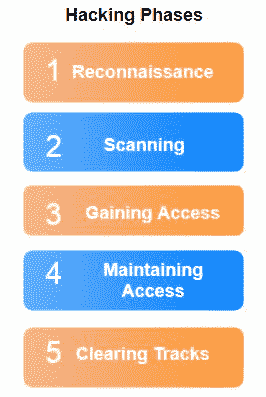

# 渗透测试概述

根据定义，渗透测试是模拟外部和内部攻击。渗透测试的主要目标是增强组织的安全地位。

# 渗透测试类型

渗透测试分为三类：

*   白盒五重测试
*   黑盒测试
*   灰盒测试

# 白盒五重测试

在白盒测试期间，或者有时被称为完全知识测试的过程中，组织会向测试人员提供所有必需的信息。当组织希望对其安全性执行全面审核并最大限度地延长测试时间时，将使用这种类型的 pentesting。可以在任何时候检查其安全位置。在执行测试前提供的信息可能是，但不限于以下内容：

*   **网络信息**：网络类型和图表、IP 地址、入侵检测系统、防火墙和访问信息
*   **基础设施**：硬件和软件信息均提供给客户
*   **政策**：这非常重要，因为每个 pentester 都必须确保 pentesting 方法与组织的政策一致
*   当前安全状态，包括以前的 pentesting 报告

# 黑盒测试

在黑盒 pentesting 会话中，pentester 模拟真实世界的攻击，以获得对系统或 IT 基础设施的访问。因此，他选择了 pentesting 方法，没有关于组织的信息，也没有关于基础设施的先验知识。这种类型的 pentesting 非常有效，因为 pentester 戴着一顶黑帽子，使用黑帽子黑客的技术绕过组织的安全警卫。这是从黑帽黑客的角度进行的。因此，他们使用指纹技术来发现组织的一切。

# 灰盒测试

灰盒测试包括模拟内部人员的攻击。像任何普通用户一样，pentester 提供了部分和有限的信息。这种测试介于黑盒测试和白盒测试之间。

# 渗透测试团队

“红队”和“蓝队”这两个概念的灵感来自于军队中使用的战略。

# 红队

红队的作用是明确的。他们通常有一个特定的任务，即测试组织的物理和数字安全的当前状态。红队的队员有一种进攻心态。他们试图攻击一个特定的地区。

# 蓝队

蓝队是防守层。他们的任务是防守红队。一般来说，他们是内部安全团队。

# 紫色团队

为了确保有效的渗透测试，创建了一个名为紫色团队的新团队。该团队有一种有效的方法，可以使红队和蓝队之间的沟通更加清晰，如下图所示：


渗透测试和红队之间存在差异。红队评估类似于渗透测试，但其范围更大，在红队任务中，目标不是发现所有漏洞，而是找到让他们实现目标的正确漏洞

# 测试标准和指南

在深入探讨 pentesting 标准和指南之前，我们需要定义一些重要的术语，以避免对四个不同术语的混淆或误解：政策、标准、程序和指南。所有这些术语在信息安全管理中都发挥着重要作用，但清楚地理解它们之间的区别对于避免错误地使用它们至关重要。

# 政策

政策是由高级管理层成员编写的书面文件，规定了组织中每个人的责任和所需的行为。一般来说，策略很短，没有指定技术方面，例如操作系统和供应商。如果组织规模较大，则可以将策略分为子策略。众所周知的信息安全策略之一是**COBIT 5 信息安全策略集**，如下所示：

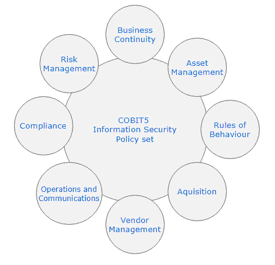

# 标准

标准是对组织将如何实施策略的低级描述。换句话说，它们被用来维持最低水平的有效网络安全。它们也是强制性的。

# 程序

过程是详细的文档，描述了特定任务（如创建新用户或密码重置）中所需的每个步骤。每一步都是强制性的。这些程序必须符合组织的政策。

# 指导

指导或指南是一组推荐的技巧和有用的建议，来自实践经验丰富的人员和机构。渗透测试人员遵循许多标准和指南。以下是一些众所周知的标准，以及每个标准或指南所需的步骤。

# 开源安全测试方法手册

**开源安全测试方法手册**（**OSSTMM**）是由 Pete Herzog 发布的综合性文件，由**安全与开放方法研究所**（**ISECOM**发布。OSSTMM 认为，每项渗透测试都应包括信息、流程、互联网技术（端口扫描、防火墙等）、通信、无线和物理环境的安全测试。

# 信息系统安全评估框架

**信息系统安全评估框架**（**ISSAF**）是一种方法，渗透测试人员通过一些附加阶段模拟黑客攻击步骤。它经历了以下几个阶段：

*   信息收集
*   网络映射
*   脆弱性识别
*   穿透
*   获取访问权限和权限提升
*   进一步列举
*   损害远程用户/站点
*   维护访问权限
*   覆盖轨道

# 渗透测试执行标准

**渗透测试执行标准**（**PTES**是一套技术章节。通过浏览以下七个部分，它有助于渗透测试人员提供有效的测试报告：

*   参与前互动
*   情报收集
*   威胁建模
*   脆弱性分析
*   利用
*   利用后
*   报告

# 支付卡行业数据安全标准

**支付卡行业数据安全标准**（**PCI DSS**）是计划使用主要品牌信用卡的组织的重要参考。它于 2014 年发布。它用于确保信用卡持有人数据的安全并避免欺诈。合规性每年由合格的安全评估师执行一次，该评估师由 PCI 安全标准委员会提供，或在内部针对小数据量案例提供。PCI DSS 经历以下四个阶段：

*   订婚前
*   参与：渗透测试
*   婚后
*   报告和文件

# 渗透测试步骤

渗透测试基本上要根据所选择的方法经历多个步骤。在我们的案例中，我们将根据 PTE 研究每个阶段。

# 订婚前

在进行渗透测试之前，应确定 pentester 和客户之间的参与前互动。这是一个非常重要的阶段，因为您可以将 pentesting 视为一个信息技术项目。与任何 IT 项目一样，它需要强大的规划能力。Pentesting 不是一套技术步骤，而是需要许多管理和组织技能。有效的五分钟测试将从与客户会面开始，以明确了解客户的所有需求和愿景。作为会议的结果，将制定测试计划。它将详细描述如何进行 pentest。在交战前阶段，许多重要事项需要得到处理。

# 目标和范围

它以非常详细的方式指定 pentesting 的目标，包括作用域（IP 地址和主机）。通常，它还包含要测试的资产和超出范围的资产。交战前还必须包括渗透测试任务的时间段。

# 免出狱卡

黑客是一种非法行为，所以你需要确保你的所有工作都将以合法的方式进行。一张通常由高级经理签署的*出狱卡*就足以让你摆脱困境。这里的“卡”一词是双方之间的合同，如果有法律问题，应该解决。

# 紧急联络信息

为了避免在发现严重问题时出现恐慌情况，预定义的联系人信息列表是一个好主意，可以在需要时确保快速有效的沟通渠道。例如，如果由于密集的自动化工具，您遇到了严重的网络流量问题，则需要联系网络工程师。

为了避免这种不便，最好在进行渗透测试之前与利益相关者讨论在这种情况下支持的可用性。

# 付款信息

付款信息表示渗透测试的付款条件。在讨论测试时间表时，pentester 还应讨论付款安排。在谈判过程中，您可以讨论付款结构，例如，在提交最终报告后获得付款，在进行测试前提前支付一半金额，或者根据付款计划。此外，还可以在协议中增加不付款罚款。

# 保密协议

签署的**保密协议**（**保密协议**的目的是使 pentester 承诺保护所有保密信息和调查结果的安全。在渗透测试期间，您将接触到具有不同分类等级的一定数量的数据。这就是为什么，签署一份文件以向上级管理层保证所有收集的信息都受到保护是明智的决定。

# 情报收集

情报收集阶段是 pentester 从公共来源搜索有关组织的所有可用信息的阶段。在该阶段结束时，他将清楚地了解网络（域名、IP 范围、TCP/UDP 服务和身份验证机制）、系统（用户名/组名、系统横幅和系统架构）和组织信息（员工详细信息、新闻稿和位置）。这取决于 pentesting 的类型（黑色、白色或灰色）。实施良好的情报收集方法将有助于以后的工作。

情报收集的燃料是从不同来源获得公开的信息。情报收集在信息安全和渗透测试中并不重要，但对国家安全至关重要。由于许多概念受到军事战略的启发，在网络安全领域，情报收集也受到战场的启发。但是在渗透测试环境中，这一阶段的所有技术都应该是合法的，因为良好的意图并不意味着违法，这就是为什么我们在公开可用信息时说**。否则，该案将被视为工业间谍。据国际贸易委员会估计，目前美国工业每年因企业间谍活动而遭受的损失将超过 700 亿美元。**

情报收集不仅有助于提高组织的安全地位，而且使管理者能够敏锐地观察竞争，从而做出更好的业务决策。基本上，每项情报收集工作都是按照结构化方法进行的。

# 公共情报

公共情报是利用公开来源收集有关目标的所有可能信息的过程，不仅要对其进行搜索，还要对其进行存档。该术语通常由政府机构用于国家安全行动。渗透测试人员也应采用这种心态，并获得收集和分类信息所需的技能。在数据量巨大的时代，必须具备从中提取有用信息的能力。

# 社会工程攻击

社会工程攻击是指员工或其他人在心理上被欺骗而提供敏感信息。社会工程是操纵人们获取用户信息以确定敏感信息（如登录凭证或机密信息）的艺术。以欺骗的方式使用信任这样的人的素质总是表明人是信息安全中最薄弱的一层。网络钓鱼是社会工程的一种技术手段。众所周知，网络钓鱼是发送一封看似来自合法机构的电子邮件或短信，并诱骗用户键入其登录凭据。鱼叉式网络钓鱼是同样的技术，但在更具体的范围内，例如向知名联系人的短名单发送网络钓鱼电子邮件

# 物理分析

在信息安全领域，物理安全确实至关重要。识别物理设备在情报收集中起着巨大的作用。

# 信息系统与网络分析

该技术搜索有关目标的信息，包括网络服务、设备、域和信息系统信息。

有许多情报收集类别：人类情报、信号情报、开源情报、图像情报和地理空间情报。

# 人类智力

**人类智能**（**HUMINT**）是使用多种技术（如拍照和录像）收集人类目标信息的过程，无论是否与目标交互。人类智力有三种模式：

*   **定向采集**：这是一种特定的定向操作。通常，所有资源都用于收集关于唯一目标的信息
*   **主动情报收集**：该过程更具体，投资少，针对特定环境。
*   被动智力收集胡：这是人类智力的基础。这些信息是以机会主义的方式收集的，例如通过走进或转介。因此，除了收集信息和试图找到一些东西外，没有特定的目标。

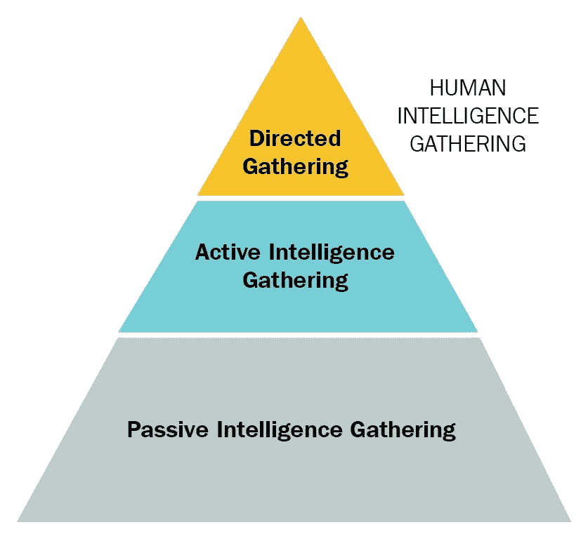

# 信号智能

**信号情报**（**信号情报**）是通过截获电子信号和通信来收集信息的操作。它可以分为两个子类：**通信情报**（**通信情报**）和**电子情报**（**电子情报**）。

# 开源智能

**开源智能**（**OSIT**）顾名思义，包括使用在线可用资源查找有关已定义目标的信息。可以使用多种技术来完成：

*   在许多搜索引擎中执行搜索查询
*   从社交媒体网络获取信息
*   在*深网*目录和隐藏的 wiki 中搜索
*   使用论坛和讨论板

例如，如果您想搜索某个特定的员工，可以使用 theHarvester 工具，它将帮助您查找有关该员工的所有公共信息。

您可以从控制台使用以下命令从其 GitHub 存储库获取 Harvester：

```
git clone https://github.com/laramies/theHarvester 
```

然后，键入`./theHarvester`以运行脚本。

例如，如果您想使用 Google search 收集关于`targetwebsite`的信息，只需运行以下命令：

```
theharvester -d   targetwebsite.org  -l 100 -b google 
```

这里，`-l`选项是有限数量的结果，`-b` 表示搜索引擎。在我们的案例中，我们使用了谷歌搜索引擎：

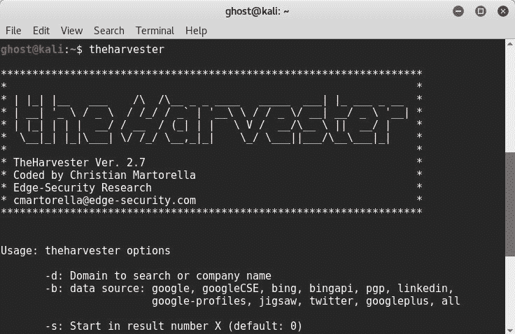

你知道吗，已知的网络只占互联网的 4%。还有一个空间叫做**深网**。它包含 7500 TB 的信息，意味着超过 5000 亿页。

从隐藏的网络收集信息是一种优势，不仅用于侦察目的，而且用于竞争情报。要访问 DeepWeb，您只需通过其官方网站[下载 Tor 浏览器即可 https://www.torproject.org/](https://www.torproject.org/) 并安装它。打开浏览器并点击 Connect 以访问网络：

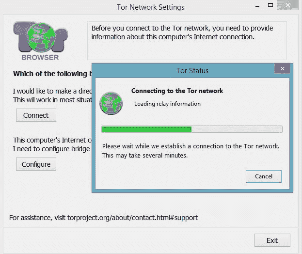

现在，您正在浏览*隐藏网页*。您可以通过此链接[使用 Tor 网站的隐藏 wikihttp://wiki5kauuihowqi5.onion](http://wiki5kauuihowqi5.onion) （表示为`DomainName.onion`），或简单使用 DuckDuckGo 搜索引擎：

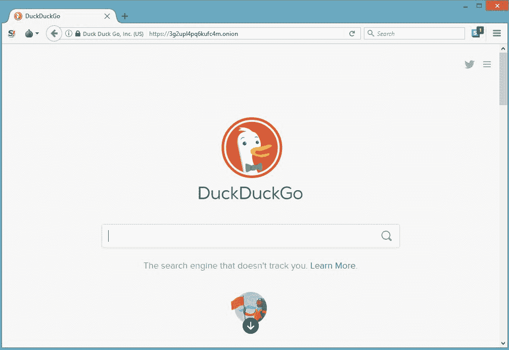

您不仅可以搜索个人身份信息，还可以搜索在线设备甚至工业控制系统。例如，您可以查看[www.shodan.io。](http://www.shodan.io)此搜索引擎将帮助您在线查找设备。以下截图是[Shodan.io](https://shodan.io/)搜索到的关于风力涡轮机的公开信息：

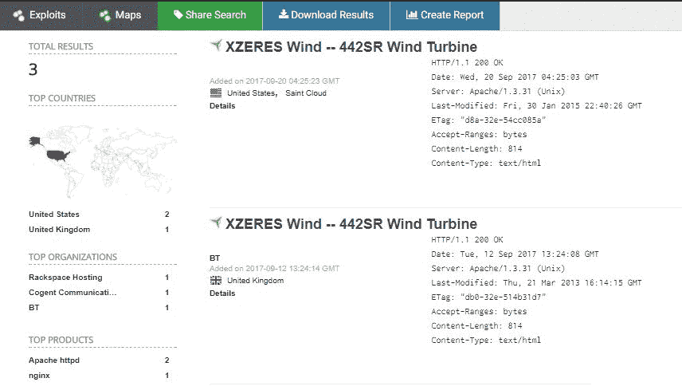

为了发现 SUDAND 搜索引擎的巨大潜力，让我们来看看这个巨人的力量。首先，进入[www.shodan.io](http://www.shodan.io)并创建一个新帐户：

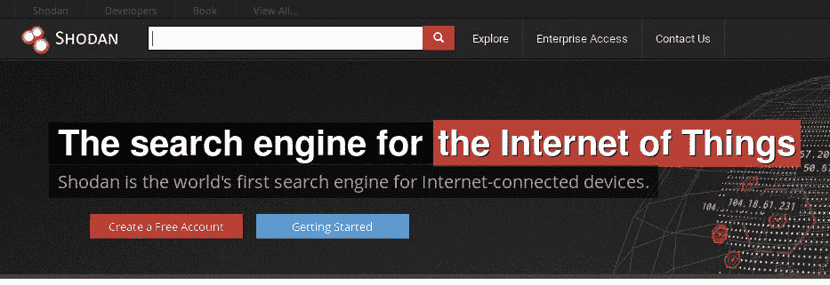

使用搜索栏输入搜索查询，或者只需点击预定义的类别：Netcams、默认密码、dreambox、工业控制系统等。这是最流行的搜索标记的一个片段：


让我们点击 Netcams 作为演示。根据下面列出的屏幕截图，搜索引擎找到了至少 8632 个 Netcam 信息的公开来源，包括其 IP 地址和详细描述：


此外，您还可以使用实时地图搜索路由器等在线设备：

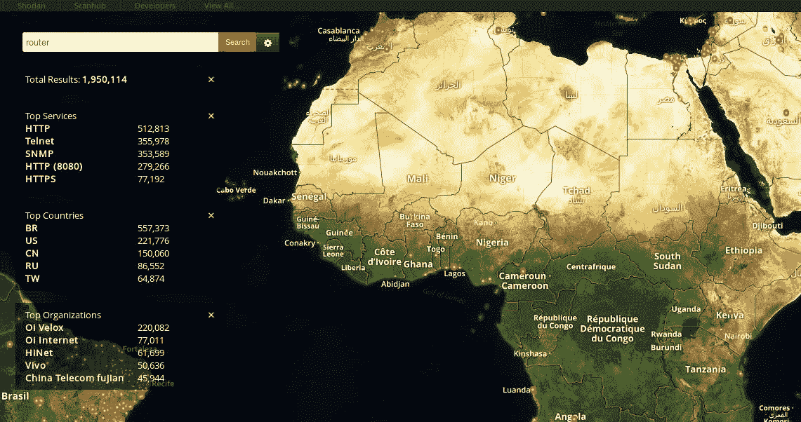

# 意象智能

在战场上，**图像情报**（**IMINT**是分析来自不同来源和设备的图像和视频的过程，如电子显示图像和红外摄像机。在渗透测试中，图像智能也以同样的方式工作，它是使用不同公共资源的不同照片和视频识别目标信息的操作，如下所示：

*   社交媒体（Facebook、LinkedIn 等）视频
*   反向搜索其他版本的照片
*   直播

有许多图像分析工具可用于从图像中提取数据。其中之一是 ExifTool。它是一个小型工具，用于提取有关已定义图像的丰富信息。如下图所示，只需从这个链接下载 ExifTool，[https://www.sno.phy.queensu.ca/~phil/exiftool/](https://www.sno.phy.queensu.ca/~phil/exiftool/)，并键入`./exiftool image.png`：

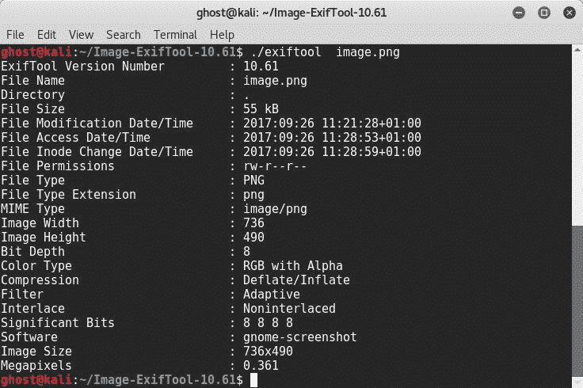

# 地理空间情报

**地理空间智能**（**GEOINT**）是对图像和地理空间信息的利用和分析，以描述、评估和可视化定义的区域。GEOINT 一词与信息安全和渗透测试有关。识别和收集有关组织的信息将使渗透测试人员能够预测组织的物理入侵。因此，渗透测试人员的角色是确保数据和敏感信息不受外部威胁。
检查地理空间信息的来源很多。谷歌地图是谷歌提供的免费地理空间服务。以下是使用 Google 地图查询进行搜索的结果：


# 威胁建模

威胁建模是一种安全方法，用于识别针对组织基础架构的威胁。在信息安全中，尤其是在渗透测试中，建模和量化始终是明智的决策。以现实的方式测量威胁将有助于渗透测试人员以后做出正确的决策。这种结构化方法的目的是使用与组织的业务需求相一致的方法来识别威胁和资产并对其进行排序，然后对其进行映射。

为了进行有效的威胁建模，渗透测试人员要经过五个分析步骤。

# 企业资产分析

在业务资产分析过程中，pentester 通过收集有关资产的任何相关文件来关注资产，在其他情况下，在组织内进行访谈。它可以包括以下信息：

*   基础设施设计
*   系统配置
*   用户帐户凭据
*   特权用户帐户凭据

有关技术资产的信息不足以获得有效的建模。渗透测试人员应收集有关组织的所有政策和程序的信息，有时还应收集组织计划的信息（如果需要）。

# 业务流程分析

业务是信息安全的中心点。明智的信息安全分析肯定会确保组织以正确的方式工作并产生收入。需要从最关键的资产开始，映射和分析与业务流程相关的所有资产。以下为资产：

*   信息资产
*   人力资产
*   第三方资产

# 威胁因素分析

在这种类型的分析过程中，将映射基于位置度量的所有威胁。我们可以将威胁分为两类：内部威胁和外部威胁。组织的员工，包括高层管理人员，也属于这一类别，因为在信息安全方面，人是最薄弱的一层。

# 威胁能力分析

在对威胁代理有了清晰的了解之后，现在除了分析可能的通信机制外，还应该检查当前存在的任何可用工具、漏洞和有效负载，这些工具、漏洞和有效负载可用于组织基础设施。

# 动机建模

渗透测试人员可以模拟攻击背后的动机。在竞争激烈的环境和多变的业务中，应将激励建模添加到 pentester 清单中。

# 脆弱性分析

威胁是个人和组织面临的严重问题。对脆弱性分析的清晰理解对于确保作出明智的管理决策以及通过正确识别和缓解此类潜在威胁而建立安全环境非常重要。不幸的是，这对信息专业人员来说仍然是一个具有挑战性的领域，因为威胁每天都在变得越来越复杂和难以检测。脆弱性评估是识别、测量和分类信息系统中脆弱性的过程。脆弱性分析是每个人的关键技能。

在脆弱性评估方面存在着很大的误解。许多渗透测试人员将漏洞分析与渗透测试混为一谈。事实上，渗透测试是模拟攻击，而漏洞评估旨在识别特定区域的漏洞。您可以将其视为扫描操作。

漏洞管理生命周期经历以下六个主要阶段：

*   **识别和发现**：在此阶段，pentester 尝试识别讨论范围内的所有资产，包括开放服务和操作系统，并尝试检测信息系统中常见的潜在漏洞，通常使用自动化工具和漏洞扫描工具。
*   **优先级和分类**：渗透测试人员根据敏感性标准或类别对资产进行优先级排序。您还可以使用排名系统对漏洞进行优先级排序，例如，对**常见漏洞和暴露**（**CVE**漏洞使用**常见漏洞评分系统**（**CVSS**）。
*   **评估**：这涉及记录分析的风险。pentester 必须在评估过程后就风险接受作出决定。进行漏洞评估时，需要验证发现的每个漏洞。使用漏洞扫描器对检测潜在漏洞很重要，但渗透测试人员需要验证每一个漏洞，以避免误报和错误标志。
*   **报告**：在此阶段，pentester 显示了进行的漏洞评估的结果，包括问题和趋势的数量，以及获得的工件的图形表示。
*   **补救**：这是一个详细的路线图，其中包括补救和修复漏洞所需的建议和步骤，不仅在技术上，还可能包括预算、时间段、清理等。
*   **验证**：最后一步是对后续检查后的固定漏洞进行验证：

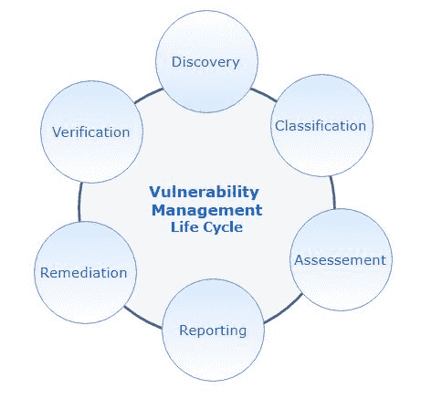

# 基于 Nexpose 的脆弱性评估

目前有许多可用的漏洞管理工具可以在漏洞评估任务期间帮助渗透测试人员，例如我们的 Beyond Security、Qualys、Core Security 和许多其他工具。最著名的漏洞管理工具之一是 Rapid7 的 Nexpose。Nexpose 评估已定义基础设施中的漏洞。

# 安装 Nexpose

您可以按照以下步骤安装 Nexpose：

*   从官方网站[下载社区版 https://www.rapid7.com/products/nexpose/](https://www.rapid7.com/products/nexpose/) [。](https://www.rapid7.com/products/nexpose/)
*   为了演示，我们安装了适用于 Windows 64 版本的 Nexpose。您也可以使用 Linux 版本：

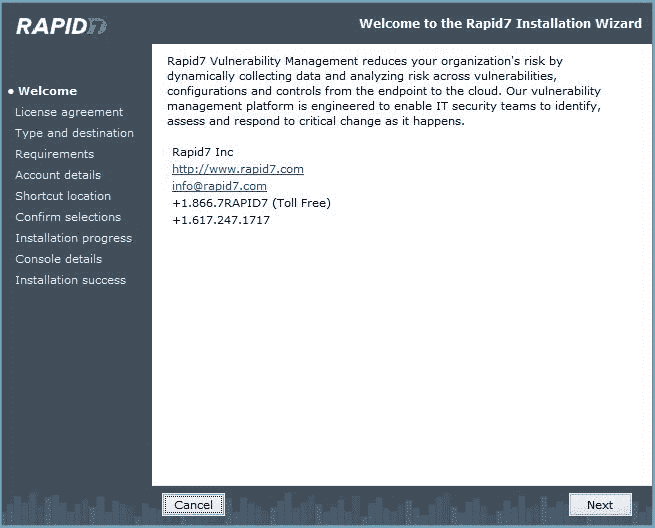

*   填写所需信息，然后进入下一步：

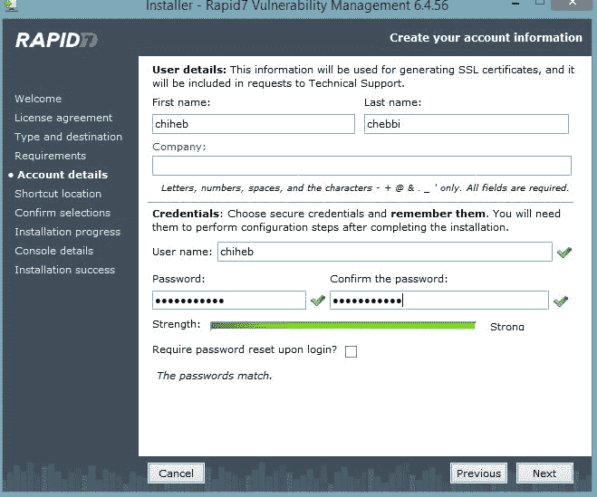

# 下一步开始

要使用 Nexpose，您只需导航到`http://localhost:3780`并输入您的凭据。

# 开始扫描

要开始下一步扫描，请打开一个项目，例如，单击“创建”并选择“站点”。然后，输入目标 IP 或 IP 范围以开始扫描：


扫描完成后，您可以生成扫描报告：

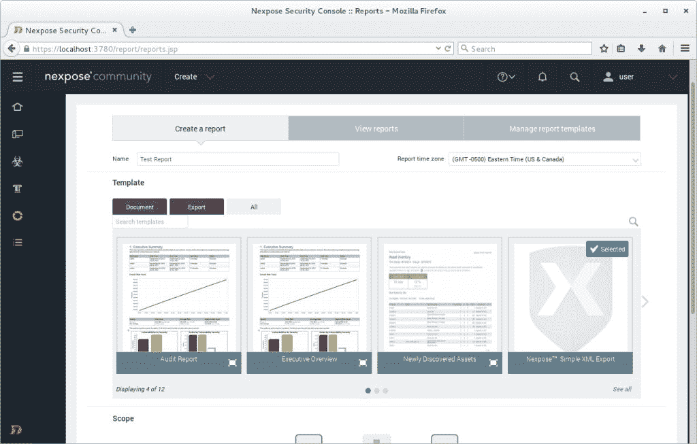

# 利用

到了这个阶段，渗透测试人员已经具备了发起攻击所需的条件。现在他只需要绕过安全控制就可以访问基础设施系统。在此阶段，渗透测试人员戴着黑帽子，试图从恶意黑客的角度访问基础设施。在进行了良好的威胁分析之后，现在是利用每个漏洞的时候了。为了利用这些漏洞，您可以使用各种自动化工具和手动测试。最著名的利用工具是 Metasploit，它是每个渗透测试人员的必备工具。

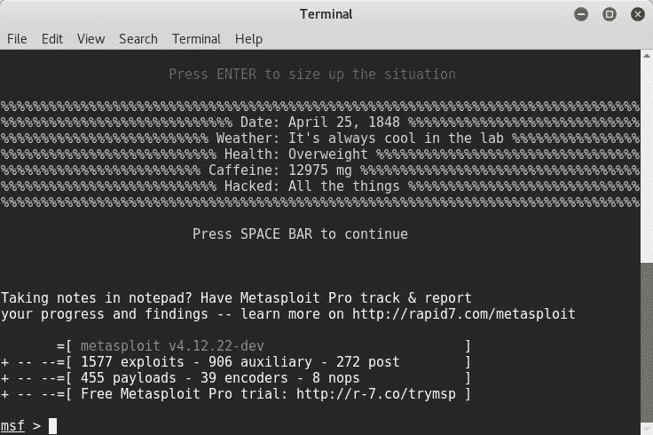

要探索漏洞，用户可以使用`show exploits`命令。

# 利用后

获得 root 权限并不是终点。正如前面所讨论的，维护访问是黑客攻击方法中的一个重要阶段，因此，后利用不仅需要维护访问，还需要扩展到基础设施中，从而进一步危害系统。这一阶段至关重要；渗透测试仪模拟高级攻击；这就是为什么在进行利用后评估之前，应该商定接触规则。这表明并支持了第一个五旬期（预约前）的重要性，以保护您的客户，当然也保护您自己。

根据渗透测试执行标准，利用后阶段应经历六个部分。

# 基础设施分析

网络是每一个现代组织和机构的支柱。因此，基础设施分析将首先确定以下内容：

*   范围内的每个网络接口
*   路由信息
*   DNS 服务器和兑现的 DNS 查询
*   代理服务器
*   ARP 条目

不仅网络信息，而且识别网络服务都是至关重要的。这些措施包括：

*   听力服务
*   VPN 连接
*   使用 Cisco 发现协议和链路层发现协议等协议映射邻居设备

# 掠夺

根据定义，掠夺是从系统收集所有可能的信息。例如，知道数据所在的位置有助于预测旋转技术。要执行有效的渗透测试，您需要收集所有（但不限于）以下信息、已安装的软件和服务：

*   打印机共享和安全服务
*   数据库服务器
*   目录服务器
*   证书颁发机构服务
*   代码管理服务器
*   虚拟化服务

大多数这些服务的利用将在后面的章节中详细讨论。

# 引人注目的目标

从黑客的角度来看，高姿态是非常可取的。作为一名渗透测试人员，你的工作是让他们成为你的目标清单的首位，因为损害高知名度可能会导致损害业务部门。不要忘记好奇心和挑战精神是黑帽黑客的动机。这就是为什么 C 级配置文件具有高度的针对性。

# 数据外泄

在数据过滤期间，pentester 映射所有过滤路径。此步骤的目的是确保没有数据以偷偷摸摸的方式离开组织。分析数据流具有高优先级，而数据是黑客关注的中心。

# 坚持不懈

后门和流量计是确保持久性的常用技术，即使在重新启动系统后也是如此。此外，创建具有复杂密码的新帐户将为您赢得一些存在时间。

# 进一步深入基础设施

好奇心是一把双刃剑。这是我们作为人类的一部分。持续的攻击对于饥饿的黑客来说是不够的。因此，渗透测试人员将寻找进一步的技术来破坏基础设施中的更多系统和网络，以获得更多的访问。其中一些技术包括：

*   平扫
*   内部 DNS 枚举
*   安装上载程序
*   服务枚举
*   通讯埠转送
*   VPN 到内部网络的数据透视

# 清理

最后，渗透测试人员必须在先前的攻击后步骤中清除受损系统中使用的任何脚本、二进制文件、新帐户和配置。

# 报告

pentesting 的最后一个阶段是报告。这是一份可交付文件，包括 pentest 任务期间进行的所有发现和过程。这一步非常重要，原因很多。pentester 需要写一份清晰的报告，这样每一个细节都可以在下次重新测试。此外，管理委员会也应理解这一点。每一份报告必须对技术和非技术方面都非常清楚和有意义。为了为不同类型的人提供一份好的 pentesting 报告，它应该包含以下部分。

# 执行摘要

本节简要介绍了调查结果，并规定了渗透测试的主要目标。本节的目标受众是高层管理人员，因为他们关心的是组织的安全，而不是技术细节。因此，在执行摘要中，不建议您提及调查结果的技术规格。执行摘要包括以下内容：

*   **背景**解释了渗透测试的目的，并在必要时为执行人员解释了一些技术术语。高层管理人员在阅读了背景知识后，将对渗透测试的目标和预期结果有一个清晰的概念。
*   与测试有效性相关的**总体立场**强调了一些安全问题，例如根据 PTES 标准，业务缺乏有效的补丁管理流程。
*   **风险评分**是根据预先定义的评分系统，在参与前阶段对风险排名的总体概述。通常，我们使用高/低评分标准或数字量表。
*   **建议摘要**规定了纠正前一点讨论的安全问题所需的步骤和方法。
*   **战略路线图**表示基于有序目标的详细短期至长期路线图，以增强组织的安全性。

# 技术报告

本节面向技术经理和信息技术人员。它包括所有执行步骤和操作的详细信息。其结构如下所示：

*   导言
*   信息收集
*   脆弱性评估
*   漏洞确认
*   利用后
*   风险/暴露
*   结论：给出测试的最终概述

# 渗透测试的局限性和挑战

渗透测试在信息安全领域面临许多挑战。具有时空边界的渗透测试的有限范围使其成为一项艰巨的任务，特别是当您在生产环境中工作时。缺乏与客户的沟通可能会使事情变得更加困难。在进行 pentesting 时，可能会出现一些常见问题和挑战：

*   测试时的计时受时间段限制
*   在测试期间，您无法覆盖所有漏洞和威胁
*   限制区的存在
*   由于重型扫描和自动化工具导致的突发和意外技术事件

在进行 pentesting 时，范围模糊可能是一个问题。所以，试着在一个方便的范围内工作。

# 五测试成熟度与评分模型

渗透测试与任何系统方法一样，需要进行评估，以提供有关所用方法可靠性的有用见解。设计良好的测试方法和良好的评估策略应基于经批准的量化标准，以快速确定测试的深度和质量。行业领导者了解所有著名的渗透测试方法，但由于理解上的困难，许多公司都在使用自己的方法。有效的渗透测试计划确保在不产生误解、误解或错误预期的情况下实现渗透测试计划的目标。需要一个成熟度模型来确保 pentesting 方法满足组织需求；您可以为您的组织需求构建最合适的成熟度模型。你可以从伏都教安全的渗透测试模型中得到启发。它是为了给这样的模型一个想法。

渗透测试成熟度模型基于三个主要标准。每个标准有五个问题需要回答“是”或“否”。如果回答“是”，则总分数将增加一分，否则将不增加任何分数。根据您对所有问题的回答，总分将确定渗透测试的评估。

# 现实主义

该指标用于评估渗透测试是否真实，并用于模拟真实世界的攻击。用是或否回答以下问题：

*   你使用黑盒方法了吗？
*   你没有被发现吗？
*   你用过社会工程学吗？
*   您是否使用了过滤后的数据？
*   你模仿恶意软件了吗？

# 方法论

该指标基于方法本身，在进行渗透测试时，在每个步骤中都会使用工具。用是或否回答以下问题：

*   所使用的方法是否已经存在或是定制的？
*   所有步骤都是以连接的方式完成的吗？
*   您是否同时使用手动和自动工具？
*   你真的利用了目标吗？
*   允许旋转吗？

# 报告

此指标评估生成的报告，因为它是渗透测试中的一个重要步骤，而它是为多个受众编写的。用是或否回答以下问题：

*   你去除假阳性了吗？
*   你的步骤可以重复吗？
*   评估的漏洞是否用于环境风险？
*   结果是否与业务需求一致？
*   补救计划是否适合组织？

根据获得的分数，您可以评估渗透测试，并使用以下量表对其进行排名：

*   **0-5**：低成熟度
*   **6-10**：中等成熟度
*   **11-15**：高成熟度

为了更好地演示，您可以使用图形图表：

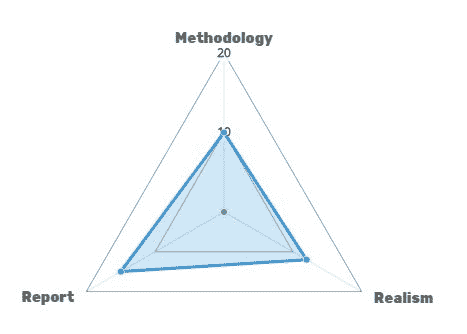

# 总结

在本章中，我们介绍了不同的渗透测试方法和进行全面、高价值和可重复的渗透测试所需的步骤，以及获得评估渗透测试所需的技能。此外，在下一章中，旅程将继续。您将暴露 Linux 基础设施中的弱点，您不仅将学习如何保护 Linux 机器，还将在内核级别检测漏洞并加以利用。