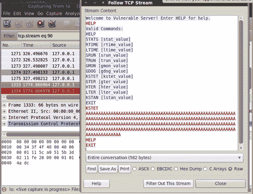
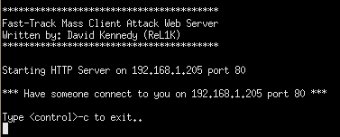
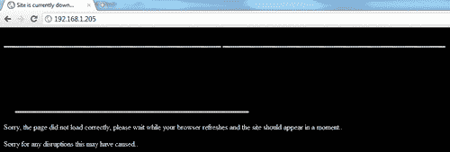
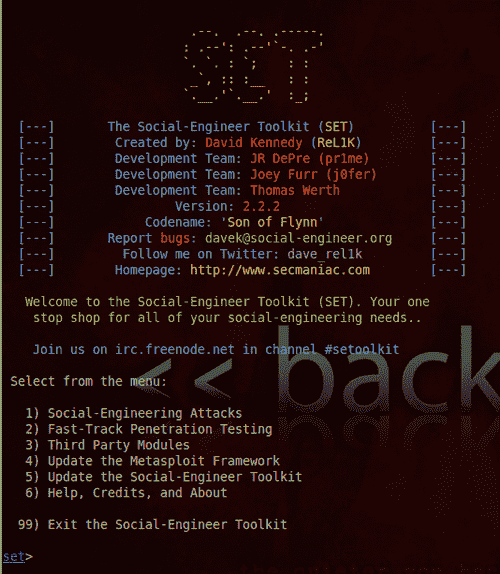
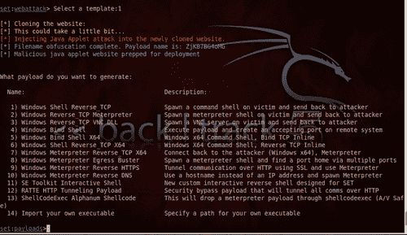
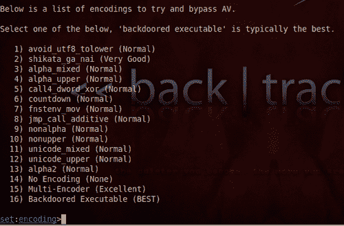
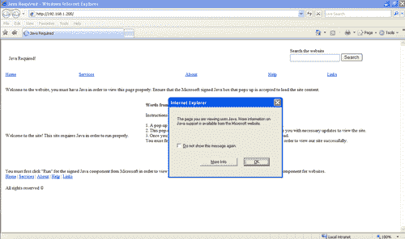

# 六、漏洞利用和客户端攻击

客户端攻击通常需要用户交互。不小心访问一个网站会导致破坏。一般来说，客户端攻击将集中在个人在家或办公室使用的“客户端”计算机上。在适当安全的环境中，这些主机将使用安全机制和实践相结合的方式进行保护，如白名单、网络分段、基于主机的防火墙、文件完整性监视器、系统配置强化和防病毒。

通过适当的培训，用户很清楚单击未知链接、打开电子邮件附件，甚至插入不受信任的设备都可能有害。不幸的是，便利往往取代常识，因此，用户将继续重复旧的错误。毕竟，难道管理员安装的所有这些保护机制都不应该保护用户免受一切伤害吗？

在大型环境中，台式机、工作站甚至打印机通常被视为非关键设备。重点是昂贵的服务器和系统，这对保持业务运行至关重要。熟练的攻击者会很清楚这种心态。如果攻击者无法轻松地利用 web 应用程序漏洞穿透网络，则攻击者通常会使用社会工程和客户端攻击的混合方式。如果成功的话，这些攻击将像一把热刀切黄油一样迅速地切断周边地区。此外，完全受损的客户端计算机可以设置为进入其他安全网络的网关。

在本章中，我们将研究帮助我们测试公司安全意识培训和客户端保护机制有效性的方法。在测试的信息收集阶段进行的研究最终将得到最大程度的利用。此外，我们还研究了安全研究人员和狡猾的攻击者使用的一些技术和工具，这些技术和工具甚至可以绕过那些乍一看似乎理论上合理的系统控制。

# 缓冲区溢出-刷新器

缓冲区溢出是野外攻击者的生计。当这种类型的漏洞被正确利用时，攻击可能会在几秒钟内导致整个系统受损。理想情况下，通过安全利用生命周期的正确实现，可以防止许多此类漏洞。如果您的客户没有此类实践，您可能需要执行标准渗透测试以外的步骤，并证明在整个企业部署的（通常是内部利用的）应用程序中存在缺陷。

### 注

并非所有缓冲区溢出漏洞都可用于创建远程攻击。另外值得注意的是，并非所有缓冲区溢出都是可利用的。

通常，允许缓冲区溢出的编程错误不是故意的，或者是由于懒惰的利用人员造成的。通常，在应用程序利用阶段，由于应用程序的复杂性，或者由于原始代码库已有几十年历史，但仍在构建中，缓冲区溢出漏洞会丢失。考虑到软件利用人员经常面临不合理的截止日期和来自其管理链的要求，在软件利用生命周期中，有时安全缺陷会被忽略或遗漏，这一点我们不应感到惊讶。对于利用人员来说，基于最后一刻的决定来接收需求并不令人震惊。从逻辑上讲，这对确保正在利用的应用程序的安全性是不利的。与任何其他技术一样，安全性需要构建到整个过程中，而不是事后添加。利用人员的首要任务是大量修改代码，而不是同时关注稳定性和安全性。

为了解决这些类型的错误，代码编译器和操作系统将包括旨在防止利用此类代码的机制。为了完全理解如何绕过这些机制，您至少需要基本了解缓冲区溢出是什么，以及如何验证您的客户机是否受到了此类攻击的充分保护。

## “C”ing 相信-创建易受攻击的程序

为了充分理解忽略这些错误是多么简单，我们将生成我们自己的易受攻击的程序。打开一个 32 位回溯虚拟系统，并借此机会连接到 Internet 并执行更新。更新后，您很可能需要下载我们将使用的调试器。到目前为止，它不包括在回溯 5 R1 中。

我们将使用 GNU 调试器。有关此工具的更多信息，请访问：[http://www.gnu.org/s/gdb/](http://www.gnu.org/s/gdb/) 。

### 注

以下示例使用 32 位版本的 BackTrack。

要获取 GNU 调试器，您需要使用 `apt-get`install 命令安装它：

```
# apt-get install gdb

```

安装 `gdb`后，再次断开回溯虚拟机的 Internet 连接。

首要任务是编译一个小程序，用于演示缓冲区溢出的情况。为此，我们利用了 `scanf`函数中的一个众所周知的缺陷。在 BackTrack 中打开一个终端会话，并在 nano 中创建一个名为 `bovrflow.c`的文件。

```
# nano bovrflow.c

```

```
/* This program contains an intentional vulnerability for learning purposes. */
#include <stdio.h>
#include <string.h>
int main()
{
char lstring[10];
/* ask for the user to enter a long string */
printf("Enter a long string:");
/* scanf is known to be susceptible to buffer overflow when %s conversion is used*/
scanf("%s", lstring);
/*Print out the string that was typed*/
printf("You entered: %s\n",lstring);
return 0;
}

```

在退出到终端之前，请确保保存您的工作。在这个程序中，我们有意将 `scanf()`与 `%s`转换一起使用，因为 `scanf()`没有对输入进行消毒，以确保其不超过指定缓冲区的大小。有关此漏洞的更多信息，请访问：[https://buildsecurityin.us-cert.gov/bsi/articles/knowledge/coding/816-BSI.html](http://https://buildsecurityin.us-cert.gov/bsi/articles/knowledge/coding/816-BSI.html) 。

由于**GCC**编译器内置的安全限制，我们必须使用 `-fno-stack-protector`来编译此代码。在命令提示下，发出以下命令：

```
# gcc -o bovrflow -fno-stack-protector bovrflow.c

```

在前面的命令中，我们调用了 `gcc`编译器，将输出文件名选择为 `bovrflow`，禁用了编译器的堆栈保护器功能，并以 `bovrflow.c`源代码为目标。

### 注

因为我们在 BackTrack 中以 root 用户身份运行，所以在尝试运行它之前，不必担心将文件权限更改为可执行文件。

## 在回程中打开和关闭 ASLR

默认情况下，Linux 使用地址空间布局随机化（ASLR）。您应该了解如何检查是否启用了该功能，以及如何打开和关闭该功能。让我们看一看 Apple T0.命令。此命令将列出程序的共享库依赖项。如果已启用 ASLR，则每次调用内存地址时，内存地址都会更改：

```
# root@bt:~ # ldd bovrflow 

```

```
linux-gate.so.1 => (0xb786e000)
libc.so.6 => /lib/tls/i686/cmov/libc.so.6 (0xb7701000)
/lib/ld-linux.so.2 (0xb786f000)

```

```
# root@bt:~ # ldd bovrflow 

```

```
linux-gate.so.1 => (0xb780a000)
libc.so.6 => /lib/tls/i686/cmov/libc.so.6 (0xb769d000)
/lib/ld-linux.so.2 (0xb780b000)

```

```
# root@bt:~ # ldd bovrflow 

```

```
linux-gate.so.1 => (0xb78b5000)
libc.so.6 => /lib/tls/i686/cmov/libc.so.6 (0xb7748000)
/lib/ld-linux.so.2 (0xb78b6000)

```

仔细检查后，很明显内存地址每次都在变化。现在，我们通过更改 `randomize_va_space`值来关闭 ASLR（off 为 0，on 为 2），并比较结果：

```
# echo 0 > /proc/sys/kernel/randomize_va_space 

```

### 注

对于 BackTrack 以外的 Linux 发行版，可以以相同的方式启用和禁用 Exec Shield。示例： `echo 0 > /proc/sys/kernel/exec-shield`。

```
# root@bt:~ # ldd bovrflow 

```

```
linux-gate.so.1 => (0xb7fe4000)
libc.so.6 => /lib/tls/i686/cmov/libc.so.6 (0xb7e77000)
/lib/ld-linux.so.2 (0xb7fe5000)

```

```
# root@bt:~ # ldd bovrflow 

```

```
linux-gate.so.1 => (0xb7fe4000)
libc.so.6 => /lib/tls/i686/cmov/libc.so.6 (0xb7e77000)
/lib/ld-linux.so.2 (0xb7fe5000)

```

```
# root@bt:~ # ldd bovrflow 

```

```
linux-gate.so.1 => (0xb7fe4000)
libc.so.6 => /lib/tls/i686/cmov/libc.so.6 (0xb7e77000)
/lib/ld-linux.so.2 (0xb7fe5000)

```

无论您尝试运行该命令多少次，内存地址都是相同的。这表示您已关闭 ASLR 生成的随机化。

## 了解缓冲区溢出的基础知识

假设 `boverflow.c`已正确编译且 ASLR 已关闭，我们现在可以执行故意易受攻击的程序：

```
# ./bovrflow 

```

您的输出应如下所示：

```
Enter a long string:

```

在此提示下，键入 21 个字符的序列，如 `AAAA`并按*键输入：*

```
Enter a long string:AAAAAAAAAAAAAAAAAAAAA
You entered: AAAAAAAAAAAAAAAAAAAAA

```

通过只输入四个字符，程序执行指令，并在显示您键入的字符后正确退出。现在让我们溢出缓冲区来分析结果。这次运行程序，但键入的字符数超过 21 个。

```
root@bt:~/overflow# ./bovrflow 

```

```
Enter a long string:AAAAAAAAAAAAAAAAAAAAAA
You entered: AAAAAAAAAAAAAAAAAAAAAA
Segmentation fault 

```

通过输入超出缓冲区处理能力的数据，我们产生了一个**分段错误**。这正是我们正在寻找的。让我们来看看这个程序运行时内存空间中发生了什么。在提示下调用 `gdb`调试器。

```
# gdb bovrflow 

```

```
GNU gdb (GDB) 7.1-ubuntu
Copyright (C) 2010 Free Software Foundation, Inc.
License GPLv3+: GNU GPL version 3 or later <http://gnu.org/licenses/gpl.html>
This is free software: you are free to change and redistribute it.
There is NO WARRANTY, to the extent permitted by law. Type "show copying"
and "show warranty" for details.
This GDB was configured as "i486-linux-gnu".
For bug reporting instructions, please see:
<http://www.gnu.org/software/gdb/bugs/>...
Reading symbols from /root/overload/bovrflow...(no debugging symbols found)...done.
(gdb)

```

调试器将为我们提供有关 `bovrflow`程序的详细内存信息。让我们来看看当我们在 Opjt1 中运行程序时会发生什么，而不会溢出缓冲区。我们在 gdb 提示符下键入*r*以**运行**程序：

```
(gdb) r 

```

```
Starting program: /root/bovrflow
Enter a long string:AAAAAA
You entered: AAAAAA
Program exited normally.
(gdb)

```

这里没有什么有趣的东西，但这个测试是一个很好的健全检查，以确保一切正常工作。现在，我们需要看看当我们导致分段错误时会发生什么：

```
(gdb) r 

```

```
Starting program: /root/bovrflow
Enter a long string:AAAAAAAAAAAAAAAAAAAAAA
You entered: AAAAAAAAAAAAAAAAAAAAAA
Program received signal SIGSEGV, Segmentation fault.
0xb7e8bb00 in __libc_start_main () from /lib/tls/i686/cmov/libc.so.6

```

我们再次运行程序；然而，这次我们使用了 22 个字符的序列，故意造成分割错误。当回顾结果时，很明显有些地方不太对劲。注意对 `SIGSEGV`的引用，分段故障。我们需要利用这个错误并利用明显的漏洞。不幸的是，在继续创建外壳代码之前，我们还需要了解更多。毕竟，到目前为止，我们所知道的是，我们可能导致应用程序崩溃。为了取得进展，我们必须查看寄存器地址，以进一步了解崩溃期间内存空间中发生了什么。在提示下键入*i r*：

```
(gdb) i r 

```

```
eax 0x0 0
ecx 0xbffff4f8 -1073744648
edx 0xb7fcc360 -1208171680
ebx 0xb7fcaff4 -1208176652
esp 0xbffff540 0xbffff540
ebp 0x41414141 0x41414141
esi 0x0 0
edi 0x0 0
eip 0xb7e8bb00 0xb7e8bb00 <__libc_start_main+16>
eflags 0x10292 [ AF SF IF RF ]
cs 0x73 115
ss 0x7b 123
ds 0x7b 123
es 0x7b 123
fs 0x0 0
gs 0x33 51

```

我们可以将我们在 `ebp`的输入视为 `0x41414141`。让我们再次运行程序，再添加几个 a，看看会发生什么。

### 注

当我们看到 `0x41414141`时，如果您不明白我们在看什么，请在 `google.com`上快速搜索“ASCII 转换图”，找到您熟悉的转换图并打印出来。

```
(gdb) r 

```

按*r*重新启动调试器中的程序。

```
The program being debugged has been started already.
Start it from the beginning? (y or n) y

```

按*y*让调试器知道您想完全重新启动。

```
Starting program: /root/overload/bovrflow
Enter a long string:AAAAAAAAAAAAAAAAAAAAAAAA

```

这一次我们需要输入 24*A 的*并按*回车*。

```
You entered: AAAAAAAAAAAAAAAAAAAAAAAA
Program received signal SIGSEGV, Segmentation fault.
0xb7004141 in ?? ()

```

我们的分段错误现在返回了一些奇怪的东西……当我们之前只键入 12 个字符时，我们的输出指示来自 `/lib/tls/i686/cmov/libc.so.6`的 `0xb7e8bb00 in __libc_start_main ()`，但现在我们返回 `0xb7004141 in ?? ()`。我们甚至可以看到一些我们的*A*正在通过。再次查看我们的信息登记册：

```
(gdb) info registers 

```

```
eax 0x0 0
ecx 0xbffff4f8 -1073744648
edx 0xb7fcc360 -1208171680
ebx 0xb7fcaff4 -1208176652
esp 0xbffff540 0xbffff540
ebp 0x41414141 0x41414141
esi 0x0 0
edi 0x0 0
eip 0xb7004141 0xb7004141
eflags 0x10292 [ AF SF IF RF ]
cs 0x73 115
ss 0x7b 123
ds 0x7b 123
es 0x7b 123
fs 0x0 0
gs 0x33 51

```

请看 `eip`。我们可以看到，有 24 个字符的地址是 `0xb7004141`，而只有 12 个 A 的地址是 `0xb7e8bb00`。这意义重大。我们还需要再做一件事，让这一点变得更加明显。再次从调试器中运行该程序。这次总共使用 26 个 a，完全覆盖 EIP。

```
(gdb) r 

```

```
The program being debugged has been started already.
Start it from the beginning? (y or n) y
Starting program: /root/overload/bovrflow

```

```
Enter a long string:AAAAAAAAAAAAAAAAAAAAAAAAAA 

```

```
You entered: AAAAAAAAAAAAAAAAAAAAAAAAAA
Program received signal SIGSEGV, Segmentation fault.
0x41414141 in ?? ()

```

```
(gdb) i r 

```

```
eax 0x0 0
ecx 0xbffff4f8 -1073744648
edx 0xb7fcc360 -1208171680
ebx 0xb7fcaff4 -1208176652
esp 0xbffff540 0xbffff540
ebp 0x41414141 0x41414141
esi 0x0 0
edi 0x0 0
eip 0x41414141 0x41414141
eflags 0x10292 [ AF SF IF RF ]
cs 0x73 115
ss 0x7b 123
ds 0x7b 123
es 0x7b 123
fs 0x0 0
gs 0x33 51

```

现在，EIP 被 A 完全覆盖。我们已经演示了用户如何操作堆栈。在下一节中，我们将回顾并利用一个小示例程序。

### 注

如果你准备迎接挑战，进行额外的研究，并尝试利用 `bovrflow`获得一个根壳或打开 nano。

此时，我们已经介绍了如何操作堆栈的基本概念。高级攻击者将尽可能理解并利用这些缺陷。在许多情况下，您将没有时间全面检查每个应用程序是否存在漏洞，例如缓冲区溢出，但随着本章的深入，最好了解我们将使用的攻击的基本前提。如果您发现您可能喜欢漏洞研究，我强烈建议您查看以下资源：

<colgroup><col style="text-align: left"> <col style="text-align: left"></colgroup> 
| 

**了解更多缓冲区溢出漏洞及更多信息的优秀资源：**

 |   |
| --- | --- |
| *为了乐趣和利润*Aleph One | [http://insecure.org/stf/smashstack.html](http://insecure.org/stf/smashstack.html) |
| Mudge 的*缓冲区溢出教程* | [http://insecure.org/stf/mudge_buffer_overflow_tutorial.html](http://insecure.org/stf/mudge_buffer_overflow_tutorial.html) |
| Corelan 团队的网站。这支球队太棒了。查看他们的教程和论坛！ | [http://www.corelan.be/](http://www.corelan.be/) |
| IHASOMGSECURITYSKILLS 博客由“sickn3ss”撰写，内容令人印象深刻，易于理解。查看教程。 | [http://sickness.tor.hu/](http://sickness.tor.hu/) |

# 模糊化简介

当应用程序允许输入时，无论是直接来自用户，例如输入凭据、打开文件，甚至是更改 RAM 中的数据，都有可能使用输入造成严重破坏。攻击者不会花费数小时或数天的时间在用户名和密码提示或到不明端口的未知连接上键入（当然，有些可能！）。相反，他们将利用专注于此任务的工具欢迎来到 Fuzzer 世界。

模糊器通常用于生成和输出数据；这些数据可以以各种方式进行操作和格式化，并且有一些已发布的算法可以帮助简化这项工作。

### 注

请记住，**输入**是一个非常宽泛的术语。当考虑输入向量时，一定要考虑对被测试的应用程序可用的每种输入方法。一些看似微不足道的事情，比如播放歌曲，甚至读取文件名，都可能提供可能的攻击向量。

每当出现程序允许不受控输入的情况时，可能会有一个模糊程序等待处理任务。让我们创建一个小程序，看看 fuzzer 可以做些什么来帮助查找应用程序中的漏洞或异常。我们将在 `strcpy()`函数中使用一个众所周知且经常被证明的漏洞。打开回溯实例，创建以下程序：

```
# nano fuzzme.c 
#include <stdio.h>
#include <string.h>
int main(int argc, char** argv)
{
bdcode(argv[1]);
return 0;
}
int bdcode(char *bdinput)
{
char stuff[200];
strcpy(stuff, bdinput);
printf("You passed the following data to fuzzme: %s\n",stuff);
return 0;
}

```

如前所述，我们正在创建一个可以重载 `stuff`字符缓冲区的场景。 `int main(int argc, char** argv)`指示程序在调用文件后和按下*Enter*之前接受输入，并将其分配给 `argv`，然后我们可以将其复制到 `stuff`变量。如果 `stuff`无法包含所显示的数据量或数据类型，则会出现分段错误。

确保使用 `-fno-stack-protector`参数编译它。

```
# gcc -o fuzzme -fno-stack-protector fuzzme.c 

```

对程序进行一次尝试，尝试和不尝试导致分段错误：

```
# ./fuzzme AAAAAAAAAA 

```

```
You passed the following data to fuzzme: AAAAAAAAAA

```

现在，我们需要用足够的输入进行尝试，以导致崩溃：

```
root@bt:~# ./fuzzme AAAAAAAAAAAAAAAAAAAAAAAAAAAAAAAAAAAAAAAAAAAAAAAAAAAAAAAAAAAAAAAAAAAAAAAAAAAAAAAAAAAAAAAAAAAAAAAAAAAAAAAAAAAAAAAAAAAAAAAAAAAAAAAAAAAAAAAAAAAAAAAAAAAAAAAAAAAAAAAAAAAAAAAAAAAAAAAAAAAAAAAAAAAAAAAAAAAAAAAAAAAAAAAA 

```

```
You passed the following data to fuzzme: AAAAAAAAAAAAAAAAAAAAAAAAAAAAAAAAAAAAAAAAAAAAAAAAAAAAAAAAAAAAAAAAAAAAAAAAAAAAAAAAAAAAAAAAAAAAAAAAAAAAAAAAAAAAAAAAAAAAAAAAAAAAAAAAAAAAAAAAAAAAAAAAAAAAAAAAAAAAAAAAAAAAAAAAAAAAAAAAAAAAAAAAAAAAAAAAAAAAAAAAAAAAAAAA
Segmentation fault

```

正如预期的那样，在 208 个字符时，我们生成了一个有意的分段错误。现在假设您事先不知道这一点，可能需要数百或数千个字符才能使该程序崩溃。这就是为什么我们希望使用模糊器来自动执行攻击。让我们使用 shell 脚本编写一个非常基本的概念证明：

```
# nano myfuzzr.sh 

```

```
# !/bin/bash
COUNTER=1
FUZZY=A
FUZZIER=A
echo "How many A's would you like to try?"
read COUNTER
while [ $COUNTER -ge 1 ]; do
let COUNTER=COUNTER-1
FUZZY="$FUZZY$FUZZIER"
echo `./fuzzme $FUZZY`
done

```

在这个模糊器的简单表示中，我们要求根据程序测试字母 a 的数量。然后，我们运行一个循环，循环遍历每个项，直到计数器再次返回到 1。如果我们运行程序并选择 10，我们将收到以下输出：

```
# ./myfuzzr.sh 

```

```
How many A's would you like to try?

```

```
10

```

```
You passed the following data to fuzzme: AA
You passed the following data to fuzzme: AAA
You passed the following data to fuzzme: AAAA
You passed the following data to fuzzme: AAAAA
You passed the following data to fuzzme: AAAAAA
You passed the following data to fuzzme: AAAAAAA
You passed the following data to fuzzme: AAAAAAAA
You passed the following data to fuzzme: AAAAAAAAA
You passed the following data to fuzzme: AAAAAAAAAA

```

试着看看当你选择 208 A 时会发生什么。该程序并不复杂，不会干净地退出。对于发生了什么，或者为什么 207 之后的 A 没有显示，您也不会有任何指示器。

### 注

挑战自己修改这个简单的程序，或者用更合适的脚本或编程语言（如 Python 或 Ruby）重新创建它。

在这些练习之后，模糊化的基本概念应该是显而易见的。有专门针对这一主题的书籍，因此我们只能触及模糊化所能触及的真正艺术形式的表面。

# 推出 vulnserver

我们将使用 vulnserver（[http://grey-corner.blogspot.com/2010/12/introducing-vulnserver.html](http://grey-corner.blogspot.com/2010/12/introducing-vulnserver.html) 作为我们在以下几次演习中的目标。这个故意易受攻击的应用程序是由 Stephen Bradshaw 创建的，目的是为自己和安全社区提供一个可用于执行各种安全相关任务的应用程序。

理想情况下，程序将在基于 Windows 的机器上运行；当我们试图让这本书关注开源和免费可用的程序时，我们将在回溯机器上运行服务器。这将足以了解回溯中可用的模糊化工具的更多信息。

将 vulnserver 应用程序下载到回溯计算机上，解压缩，仔细查看许可证和自述文件，再次从 Internet 断开回溯实例后，使用以下命令启动 `vulnserver.exe`：

```
# wine vulnserver.exe 4444 

```

```
Starting vulnserver version 1.00
Called essential function dll version 1.00
This is vulnerable software!
Do not allow access from untrusted systems or networks!
Waiting for client connections...

```

此命令将使用 `wine`在端口 4444 上运行 `vulnserver.exe`应用程序。要测试服务器是否正常工作，请打开一个终端会话，并使用 `netcat`连接到服务器，如下所示：

```
# nc 127.0.0.1 4444 

```

您将看到 vulnserver 的介绍屏幕：

```
Welcome to Vulnerable Server! Enter HELP for help.

```

如提示所述，您可以输入帮助以接收有关可用输入的信息：

```
HELP 

```

```
Valid Commands:
HELP
STATS [stat_value]
RTIME [rtime_value]
LTIME [ltime_value]
SRUN [srun_value]
TRUN [trun_value]
GMON [gmon_value]
GDOG [gdog_value]
KSTET [kstet_value]
GTER [gter_value]
HTER [hter_value]
LTER [lter_value]
KSTAN [lstan_value]
EXIT

```

我们将使用预装在 BackTrack 5 R1 上的不同模糊器向这些输入中注入格式错误、随机或变异的数据。要更熟悉服务器，请随意浏览。以下是一个有效输入的示例：

```
LTER AAAAAA 

```

```
LTER COMPLETE

```

应用程序需要一个我们作为 LTER AAAAA 提供的输入。由于此输入没有问题，应用程序将返回正常状态。

### 注

有关 vulnserver 应用程序的详细信息，请访问 Stephen Bradshaw 的博客。在那里，您还将发现，它包含了几篇与他的 vulnserver 应用程序相关的优秀教程，以及更多编写良好且易于理解的教程。

# 回溯中包含的起毛工具

幸运的是，对于我们来说，典型的渗透测试仪不需要花费数月或数年的时间来准备完美的模糊器。社区已经为我们提供了大量这些奇妙的工具，与编写它们相比，它们的使用简直是轻而易举！

## 暴力攻击探测器（BED）

**暴力攻击检测器（BED）**的功能与名称完全相同。该程序将允许您向目标应用程序发送数据，以期发生崩溃。虽然这种方法在某些情况下确实有效，但有时在尝试查找易受攻击的应用程序时需要更多的控制。回溯轨道 5 R1 在 `/pentest/fuzzers/bed`处预装了底座。BED 提供了在不修改的情况下模糊几个常用协议的能力。

```
/pentest/fuzzers/bed# ./bed.pl 

```

```
BED 0.5 by mjm ( www.codito.de ) & eric ( www.snake-basket.de )
Usage:
./bed.pl -s <plugin> -t <target> -p <port> -o <timeout> [ depends on the plugin ]
<plugin> = FTP/SMTP/POP/HTTP/IRC/IMAP/PJL/LPD/FINGER/SOCKS4/SOCKS5
<target> = Host to check (default: localhost)
<port> = Port to connect to (default: standard port)
<timeout> = seconds to wait after each test (default: 2 seconds)
use "./bed.pl -s <plugin>" to obtain the parameters you need for the plugin.
Only -s is a mandatory switch.

```

除了 Bruteforce 漏洞检测器的利用人员提供的插件外，您还可以轻松创建自己的插件。看看 `/pentest/fuzzers/bed/docs`目录 `dummy.pm`文件。此框架为您提供了一个可以修改以满足我们需要的框架。将目录更改为 `/pentesting/fuzzers/bed/bedmod`和 `cat`您看到的两个文件，例如 `ftp.pm`，以便更好地了解功能齐全的插件的外观。当您对格式感到满意时，在 `bedmod`文件夹中创建一个新文件，并将其命名为 `vserver.pm`。以下代码是使用 `dummy.pm`示例模板创建的。在 `vserver.pm:`中输入此代码

```
package bedmod::vserver;
use Socket;
sub new{
my $this = {};
# define everything you might need
bless $this;
return $this;
}
sub init{
my $this = shift;
%special_cfg=@_;
$this->{proto} = "tcp";
if ($special_cfg{'p'} eq "") { $this->{port}='4444'; }
else { $this->{port} = $special_cfg{'p'}; }
$iaddr = inet_aton($this->{target}) || die "Unknown host: $host\n";
$paddr = sockaddr_in($this->{port}, $iaddr) || die "getprotobyname: $!\n";
$proto = getprotobyname('tcp') || die "getprotobyname: $!\n";
socket(SOCKET, PF_INET, SOCK_STREAM, $proto) || die "socket: $!\n";
connect(SOCKET, $paddr) || die "connection attempt failed: $!\n";
send(SOCKET, "HELP", 0) || die "HELP request failed: $!\n";
$this->{vrfy} = "HELP\r\n";
}
sub getQuit{
return("EXIT\r\n");
}
# what to test without doing a login before
sub getLoginarray{
my $this = shift;
@login = ("");
return(@login);
}
# which commands does this protocol know ?
sub getCommandarray {
my $this = shift;
# the XAXAX will be replaced with the buffer overflow / format string data
# place every command in this array you want to test
@cmdArray = (
"XAXAX\r\n",
"STATS XAXAX\r\n",
"RTIME XAXAX\r\n",
"LTIME XAXAX\r\n",
"SRUN XAXAX\r\n",
"TRUN XAXAX\r\n",
"GMON XAXAX\r\n",
"GDOG XAXAX\r\n",
"KSTET XAXAX\r\n",
"GTER XAXAX\r\n",
"HTER XAXAX\r\n",
"LTER XAXAX\r\n",
"KSTAN XAXAX\r\n"
);
return(@cmdArray);
}
# How to respond to login prompt:
sub getLogin{ # login procedure
my $this = shift;
@login = ("HELP\r\n");
return(@login);
}
# Test anything else you would like to
sub testMisc{
return();
}
1;

```

乍一看，这段代码似乎很复杂。如果你看一下突出显示的代码，你会看到我们特定插件最重要的方面。我们已指示 BED 向 HELP 命令提供给我们的每个输入发送数据。默认端口设置为 4444，登录为空，因为此类型的应用程序不需要此端口。在我们使用 `vserver.pm`插件之前，还需要进行一次修改。打开 `/pentest/fuzzers/bed/bed.pl`文件进行编辑，并将 `vserver`添加到第 14 行的 `@plugins`变量中

```
@plugins = ( "ftp", "smtp", "pop", "http", "irc", "imap", "pjl", "lpd", "finger", "socks4", "socks5", "vserver" );

```

保存您对 `bed.pl`所做的更改并退出编辑器。假设您已经在端口 4444 上启动了 `vulnserver.exe`，让我们尝试一下我们的新插件：

```
# ./bed.pl -s vserver -t 127.0.0.1 

```

```
BED 0.5 by mjm ( www.codito.de ) & eric ( www.snake-basket.de )
* Normal tests
+ Buffer overflow testing:
testing: 1 XAXAX ...........
testing: 2 STATS XAXAX ...........
testing: 3 RTIME XAXAX ...........
testing: 4 LTIME XAXAX ...........
testing: 5 SRUN XAXAX ...........
testing: 6 TRUN XAXAX ...........
testing: 7 GMON XAXAX ...........
testing: 8 GDOG XAXAX ...........
testing: 9 KSTET XAXAX ...

```

`Bed.pl`确实在做一些事情，但我们并没有得到任何关于具体发生了什么的反馈。如果您等待的时间足够长，您将收到撞车通知。


不幸的是，vulnserver 应用程序仍在接收连接，因此 `bed.pl`将继续暴力强制过程。此外，目前我们还不知道是什么导致了这次事故。当我们点击**关闭**时，我们会从 vulnserver 控制台获得一些调试信息，但在处理客户端修改或创建的应用程序时，不应该总是出现这种行为。通常会禁用生产应用程序上的调试，以避免向潜在攻击者提供太多信息。

### 注

如果 `EXIT`命令启动后某些语句（如再见）没有出现，我们没有编写任何会停止程序的代码。因此，Bruteforce 漏洞检测器没有检测到存在问题！挑战自己将此功能添加到插件中！

让我们来看一下终端，它提供了从

```
Waiting for client connections...
Unhandled exception: page fault on read access to 0x41414141 in 32-bit code (0x41414141).
Register dump:
CS:0073 SS:007b DS:007b ES:007b FS:0033 GS:003b
EIP:41414141 ESP:00c0e4c0 EBP:41414141 EFLAGS:00210202( R- -- I - - - ) 
EAX:00c0e470 EBX:7bc9cff4 ECX:00000000 EDX:00000065
ESI:7ffccf10 EDI:00401848
Stack dump:
0x00c0e4c0: 41414141 41414141 41414141 41414141
0x00c0e4d0: 41414141 00000000 00000000 00000000
0x00c0e4e0: 00000000 00000000 00000000 00000000
0x00c0e4f0: 00000000 00000000 00000000 00000000
0x00c0e500: 00000000 00000000 00000000 0018ff48
0x00c0e510: 696c6156 6f432064 6e616d6d 0a3a7364
Backtrace:
0x41414141: -- no code accessible --
Modules:
Module Address Debug info Name (22 modules)
PE 400000- 407000 Deferred vulnserver
PE 62500000-62508000 Deferred essfunc
ELF 7b800000-7b97d000 Deferred kernel32<elf>
\-PE 7b810000-7b97d000 \ kernel32
ELF 7bc00000-7bcb9000 Deferred ntdll<elf>
\-PE 7bc10000-7bcb9000 \ ntdll
ELF 7bf00000-7bf04000 Deferred <wine-loader>
ELF 7ed60000-7ed7f000 Deferred libgcc_s.so.1
ELF 7ed90000-7edbd000 Deferred ws2_32<elf>
\-PE 7eda0000-7edbd000 \ ws2_32
ELF 7edbd000-7ee3f000 Deferred msvcrt<elf>
\-PE 7edd0000-7ee3f000 \ msvcrt
ELF 7ef9c000-7efa8000 Deferred libnss_files.so.2
ELF 7efa8000-7efb2000 Deferred libnss_nis.so.2
ELF 7efb2000-7efc9000 Deferred libnsl.so.1
ELF 7efc9000-7efef000 Deferred libm.so.6
ELF 7eff8000-7f000000 Deferred libnss_compat.so.2
ELF b7593000-b7597000 Deferred libdl.so.2
ELF b7597000-b76f1000 Deferred libc.so.6
ELF b76f2000-b770b000 Deferred libpthread.so.0
ELF b771c000-b785c000 Deferred libwine.so.1
ELF b785e000-b787b000 Deferred ld-linux.so.2
Threads:
process tid prio (all id:s are in hex)
0000000e services.exe
00000014 0
00000010 0
0000000f 0
00000011 winedevice.exe
00000018 0
00000017 0
00000013 0
00000012 0
00000074 (D) Z:\root\vulnserver.exe
0000004d 0
00000048 0 <==
00000076 0
00000075 0
0000004b explorer.exe
0000004c 0
Backtrace:
Send failed with error: 10054
Received a client connection from 127.0.0.1:41190
Waiting for client connections...

```

需要注意的是，EIP 已被 `41414141`覆盖。这是一个很好的指示器，表明可能利用此堆栈溢出进行攻击。还要注意，服务器输出指示正在发生连接请求。服务器没有完全崩溃，只有这个连接。如果您以后需要创建自己的漏洞，可以利用此漏洞。

现在我们知道应用程序存在问题，我们需要了解导致崩溃的原因。通常你的 fuzzer 会为你提供这些信息，但在这种情况下， `bed.pl`只是继续发出刺耳的声音。

```
# wireshark 

```

等待 Wireshark GUI 完全加载，然后选择从屏幕中间捕获 `lo`（这将允许您见证本地流量）的选项。


让我们重现错误，但这次我们将观察**Wireshark**中的数据包，因为它们穿过本地环回接口。重新启动 `vulnserver`，然后使用 `vserver`插件再次启动 `bed.pl`。一旦一切开始，点击 Wireshark 并查看正在传递的数据包。您可以右键单击 Wireshark 中的任何消息，然后选择**跟随 TCP 流**，以易于阅读的格式查看消息。

如果等到崩溃发生，可以在 Wireshark 中搜索最明显的崩溃原因。请记住，我们在代码中没有任何延迟，因此最后建立的连接不一定是导致错误发生的连接。在这种特殊情况下，在 `vulnserver`控制台中注意到，碰撞前的最后一次连接是：

```
Received a client connection from 127.0.0.1:41041 
Waiting for client connections...
wine: Unhandled page fault on read access to 0x41414141 at address 0x41414141 (thread 0048), starting debugger...

```

如果您转到 Wireshark 并在**过滤器**菜单中输入 `tcp.stream eq 41041`，您将只看到构成我们感兴趣的消息的那些数据包。选择一条经过过滤的消息，右键单击它，然后查看 TCP 流。



看起来要发送到 vulnserver 的最后一条消息是：

```
KSTET AAAAAAAAAAAAAAAAAAAAAAAAAAAAAAAAAAAAAAAAAAAAAAAAAAAAAAAAAAAAAAAAAAAAAAAAAAAAAAAAAAAAAAAAAAAAAAAAAAAAAAAAAAAAAAAAAAAAAAAAAAAAAAAAAAAAAAAAAAAAAAAAAAAAAAAAAAAAAAAAAAAAAAAAAAAAAAAAAAAAAAAAAAAAAAAAAAAAAAAAAAAAAAAAAAAAAAAAAAAAAAAAAAAAAAAAAAAAAAAAAAAAAAAAAAAAAAA

```

在不使用过滤器的情况下查看之前的消息，我们可以确定 `KSTET`通常在成功接受输入后发送响应**（KSTET** `SUCCESSFUL)`：

```
EXIT
KSTET AAAAAAAAAAAAAAAAAAAAAAAAAAAAAAAAA
HELP
EXIT
KSTET SUCCESSFUL

```

我们可以测试这个输入，看看是否可以手动复制错误。停止并重新启动 vulnserver，并手动 `netcat`至 `127.0.0.1`端口 4444。

```
# nc 127.0.0.1 4444 

```

```
Welcome to Vulnerable Server! Enter HELP for help.

```

```
KSTET AAAAAAAAAAAAAAAAAAAAAAAAAAAAAAAAA 

```

```
KSTET SUCCESSFUL

```

```
KSTET AAAAAAAAAAAAAAAAAAAAAAAAAAAAAAAAAAAAAAAAAAAAAAAAAAAAAAAAAAAAAAAAAAAAAAAAAAAAAAAAAAAAAAAAAAAAAAAAAAAAAAAAAAAAAAAAAAAAAAAAAAAAAAAAAAAAAAAAAAAAAAAAAAAAAAAAAAAAAAAAAAAAAAAAAAAAAAAAAAAAAAAAAAAAAAAAAAAAAAAAAAAAAAAAAAAAAAAAAAAAAAAAAAAAAAAAAAAAAAAAAAAAAAAAAAAAAAA 

```

此时应用程序将崩溃，**程序错误**弹出窗口将再次出现。点击**程序错误**窗口中的**关闭**。我们可以再次查看调试器的输出，并注意到 EIP（正在处理的当前指令）已被 4141 覆盖。

### 提示

这些是我们在尝试确保测试环境的安全状态时应该寻找的可重复错误类型。根据测试的范围，此时业务可能只需要潜在漏洞的详细信息。如果范围允许，可以创建应用程序漏洞，以证明该漏洞可能导致重要数据、资产或收入的损失。

## SFUZZ：简单模糊器

如果您想开始认真对待模糊化业务，Aaron Conole 创建的名为 SFUZZ 的简单模糊器是一个很好的工具。SFUZZ 对于那些没有准备好花费时间来正确学习如何充分使用 SPIKE 的人来说是强大而有用的。此外，有时使用更小、更简单的工具更有效。

如果您仍在学习利用利用，那么 SFUZZ 将是一个伟大的垫脚石，在未来的岁月中，它必将继续成为您渗透测试知识库的一个有价值的补充；有时，拥有快速且易于配置的工具非常方便！

浏览 `/pentest/fuzzers/sfuzz`目录，熟悉目录结构。如果在没有参数的情况下调用 sfuzz，您将看到可用的启动开关：

```
/pentest/fuzzers/sfuzz# ./sfuzz 

```

```
[23:11:45] error: must specify an output type.
Simple Fuzzer
By: Aaron Conole
version: 0.6.4
url: http://aconole.brad-x.com/programs/sfuzz.html
EMAIL: apconole@yahoo.com
Build-prefix: /usr/local
-h This message.
-V Version information.
networking / output:
-v Verbose output
-q Silent output mode (generally for CLI fuzzing)
-X prints the output in hex
-b Begin fuzzing at the test specified.
-e End testing on failure.
-t Wait time for reading the socket
-S Remote host
-p Port
-T|-U|-O TCP|UDP|Output mode
-R Refrain from closing connections (ie: "leak" them)
-f Config File
-L Log file
-n Create a new logfile after each fuzz
-r Trim the tailing newline
-D Define a symbol and value (X=y).
-l Only perform literal fuzzing
-s Only perform sequence fuzzing

```

尽管有可用的示例脚本，但如果我们希望能够模糊 vulnserver 应用程序，我们需要创建自己的脚本。在 `sfuzz-sample`目录中创建以下名为 `basic.verserver`的脚本：

```
include basic-fuzz-strings.list
reqwait=800
maxseqlen=2010
endcfg
KSTET FUZZ
--
FUZZ
--
LHLO FUZZ
--

```

在这个脚本中，我们指示 sfuzz 在执行模糊化活动时使用 `basic-fuzz-strings.list`。然后添加 200 毫秒的延迟，并将序列长度限制为 2010 年。这个 fuzzer 非常简单，因此我们列出了要发送的命令，后面是 FUZZ 变量，该变量由具有 fuzzed 输出的应用程序替换。我们必须保存文件，确保 vulnserver 在端口 4444 上运行，然后继续启动 sfuzz 脚本：

```
# ./sfuzz -e -S 127.0.0.1 -p 4444 -TO -f /sfuzz-sample/basic.vserver 

```

这将启动模糊化过程，并让您看到正在传递的数据。可以使用的一种技术是执行非常快速的扫描，以查看是否发生任何崩溃，然后使用更精确的参数以较慢的速度重新运行扫描。这将确保很容易捕获异常。

正如所料，我们的 fuzzer 脚本能够通过以下输出使 vulnserver 崩溃：

```
==============================================================
[23:58:30] attempting fuzz - 31.
KSTET AAAAAAAAAAAAAAAAAAAAAAAAAAAAAAAAAAAAAAAAAAAAAAAAAAAAAAAAAAAAAAAAAAAAAAAAAAAAAAAAAAAAAAAAAAAAAAAAAAAAAAAAAAAAAAAAAAAAAAAAAAAAAAAAAAAAAAAAAAAAAAAAAAAAAAAAAAAAAAAAAAAAAAAAAAAAAAAAAAAAAAAAAAAAAAAAAAAAAAAAAAAAAAAAAAAAAAAAAAAAAAAAAAAAAAAAAAAAAAAAAAAAAAAAAAAAAAAAAAAAAAAAAAAAAAAAAAAAAAAAAAAAAAAAAAAAAAAAAAAAAAAAAAAAAAAAAAAAAAAAAAAAAAAAAAAAAAAAAAAAAAAAAAAAAAAAAAAAAAAAAAAAAAAAAAAAAAAAAAAAAAAAAAAAAAAAAAAAAAAAAAAAAAAAAAAAAAAAAAAAAAAAAAAAAAAAAAAAAAAAAAAAAAAAAAAAAAAAAAAAAAAAAAAAAAAAAAAAAAAAAAAAAAAAAAAAAAAAAAAAAAAAAAAAAAAAAAAAAAAAAAAAAAAAAAAAAAAAAAAAAAAAAAAAAAAAAAAAAAAAAAAAAAAAAAAAAAAAAAAAAAAAAAAAAAAAAAAAAAAAAAAAAAAAAAAAAAAAAAAAAAAAAAAAAAAAAAAAAAAAAAAAAAAAAAAAAAAAAAAAAAAAAAAAAAAAAAAAAAAAAAAAAAAAAAAAA
AAAAAAAAAAAAAAAAAAAAAAAAAAAAAAAAAAAAAAAAAAAAAAAAAAAAAAAAAAAAAAAAAAAAAAAAAAAAAAAAAAAAAAAAAAAAAAAAAAAAAAAAAAAAAAAAAAAAAAAAAAAAAAAAAAAAAAAAAAAAAAAAAAAAAAAAAAAAAAAAAAAAAAAAAAAAAAAAAAAAAAAAAAAAAAAAAAAAAAAAAAAAAAAAAAAAAAAAAAAAAAAAAAAAAAAAAAAAAAAAAAAAAAAAAAAAAAAAAAAAAAAAAAAAAAAAAAAAAAAAAAAAAAAAAAAAAAAAAAAAAAAAAAAAAAAAAAAAAAAAAAAAAAAAAAAAAAAAAAAAAAAAAAAAAAAAAAAAAAAAAAAAAAAAAAAAAAAAAAAAAAAAAAAAAAAAAAAAAAAAAAAAAAAAAAAAAAAAAAAAAAAAAAAAAAAAAAAAAAAAAAAAAAAAAAAAAAAAAAAAAAAAAAAAAAAAAAAAAAAAAAAAAAAAAAAAAAAAAAAAAAAAAAAAAAAAAAAAAAAAAAAAAAAAAAAAAAAAAAAAAAAAAAAAAAAAAAAAAAAAAAAAAAAAAAAAAAAAAAAAAAAAAAAAAAAAAAAAAAAAAAAAAAAAAAAAAAAAAAAAAAAAAAAAAAAAAAAAAAAAAAAAAAAAAAAAAAAAAAAAAAAAAAAAAAAAAAAAAAAAAAAAAAAAAAAAAAAAAAAAAAAAAAAAAAAAAAAAAAAAAAAAAAAAAAAAAAAAAAAAAAAAAAAAAAAAAAAAAAAAAAAAAAAAAAAAAAAAAAAAAAAAAAAAAAAAAAAAAAAAAAAAAAAAAAAAAAAAAAAAAAAAAAAAAAAAAAAAAAAAAAAAAAAAAAAAAAAAAAAAAAAAAAAAAAAAAAAAAAAAAAAAAAAAAAAAAAAAAAAAAAAAAAAAAAAAAAAAAAAAAAAAAAAAAAAAAAAAAAAAAAAAAAAAAAAAAAAAAAAAAAAAAAAAAAAAAAAAAAAAAAAAAAAAAAAAAAAAAAAAAAAAAAAAAAAAAAAAAAAAAAAAAAAAAAAAAAAAAAAAAAAAAAAAAAAAAAAAAAAAAAAAAAAAAAAAAAAAAAAAAAAAAAAAAAAAAAAAAAAAAAAAAAAAAAAAAAAAAAAAAAAAAAAAAAAAAAAAAAAAAAAAAAAAAAAAAAAAAAAAAAAAAAAAAAAAAAAAAAAAAAAAAAAAAAAAAAAAAAAAAAAAAAAAAAAAAAAAAAAAAAAAAAAAAAAAAAAAAAAAAAAAAAAAAAAAAAAAAAAAAAAAAAAAAAAAAAAAAAAAAAAAAAAAAAAAAAAAAAAAAAAAAAAAAAAAAAAAA
[23:58:30] info: tx fuzz - (2017 bytes) - scanning for reply.
[23:58:31] read:
Welcome to Vulnerable Server! Enter HELP for help.

```

再一次，测试没有捕捉到失败，sfuzz 继续向应用程序发送数据。

### 注

还记得我们在本章前面编写的可利用程序“fuzzme”吗？挑战自己使用 sfuzz 模糊 fuzzme 程序！提示：使用 `basic.cmd`作为编写脚本的指南。

如前所述，模糊化的艺术可能非常有用，但掌握它的道路需要奉献精神和不断的实践。

# 快车道

渗透测试通常仅限于特定的时间范围。这是许多渗透测试人员的主要抱怨，因为毕竟，野外的攻击者根本不受这些业务强加的时间限制。谢天谢地，我们可以依靠 Metasploit、SET 或 Fast Track 等工具帮助我们尽快覆盖地面。Fast Track 由 David Kennedy（又名 ReL1K）和 Joey Fur（又名 j0fer）利用，用于自动化渗透测试人员需要频繁执行的许多攻击。

菜单驱动，设计时尚，Fast Track 使您能够快速执行任务，例如生成有效负载，快速设置客户端攻击，甚至将有效负载从二进制转换为十六进制。

### 注

通过在调用程序时添加适当的参数，可以从命令行（-c）、浏览器 GUI（-g）或交互式菜单驱动控制台（-i）使用 Fast Track。与任何渗透测试工具一样，请在使用 Fast Track 之前阅读许可证文件和警告。渗透测试工具只能用于您有适当和合法权限测试的系统。

我们将只使用这个伟大工具的一部分，但是了解它的所有特性对于任何人的渗透测试都是一个有价值的补充。

快车道可在 `/pentesting/exploits/fastrack`处的回溯道 5 R1 中找到。要在 web GUI 模式下启动程序，只需键入：

```
# ./fast-track.py -g 

```

```
----------------------------------------------------------------
Fast-Track - A new beginning...
Automated Penetration Testing
Written by David Kennedy (ReL1K)
Please read the README and LICENSE before using
this tool for acceptable use and modifications.
-------------------------------------------------------------
Modes:
Interactive Menu Driven Mode: -i
Command Line Mode: -c
Web GUI Mode -g
Examples: ./fast-track.py -i
./fast-track.py -c
./fast-track.py -g
./fast-track.py -g <portnum>
Usage: ./fast-track.py <mode>
***********************************************
******* Performing dependency checks... *******
***********************************************
*** FreeTDS and PYMMSQL are installed. (Check) ***
*** PExpect is installed. (Check) ***
*** ClientForm is installed. (Check) ***
*** Psyco is installed. (Check) ***
*** Beautiful Soup is installed. (Check) ***
Also ensure ProFTP, WinEXE, and SQLite3 is installed from
the Updates/Installation menu.
Your system has all requirements needed to run Fast-Track!
****************************************
Fast-Track Web GUI Front-End
Written by: David Kennedy (ReL1K)
****************************************
Starting HTTP Server on 127.0.0.1 port 44444
*** Open a browser and go to http://127.0.0.1:44444 ***
Type <control>-c to exit..

```

此命令启动了 David Kennedy 编写的快速 Web GUI。打开 Firefox 并按说明浏览至 `http://127.0.0.1:44444`。

边栏菜单包括我们将在使用菜单驱动的用户界面时讨论的许多选项。浏览菜单并熟悉应用程序。

### 注

确保不要发动任何攻击，除非您完全了解自己在做什么，并且回溯机器是分段的，而不是在互联网或生产环境中。

退出浏览器，取消快速通道。在命令行中键入以下命令以打开菜单驱动的快速跟踪界面：

```
# ./fast-track.py -i 

```

```
***********************************************
******* Performing dependency checks... *******
***********************************************
*** FreeTDS and PYMMSQL are installed. (Check) ***
*** PExpect is installed. (Check) ***
*** ClientForm is installed. (Check) ***
*** Psyco is installed. (Check) ***
*** Beautiful Soup is installed. (Check) ***
Also ensure ProFTP, WinEXE, and SQLite3 is installed from
the Updates/Installation menu.
Your system has all requirements needed to run Fast-Track!
[---] [---]
[---] Fast Track: A new beginning [---]
[---] Written by: David Kennedy (ReL1K) [---]
[---] Lead Developer: Joey Furr (j0fer) [---]
[---] Version: 4.0.1 [---]
[---] Homepage: http://www.secmaniac.com [---]
[---] [---]
Fast-Track Main Menu:
1\. Fast-Track Updates
2\. Autopwn Automation
3\. Nmap Scripting Engine
4\. Microsoft SQL Tools
5\. Mass Client-Side Attack
6\. Exploits
7\. Binary to Hex Payload Converter
8\. Payload Generator
9\. Fast-Track Tutorials
10\. Fast-Track Changelog
11\. Fast-Track Credits
12\. Exit Fast-Track
Enter the number:

```

## 更新快车道

与任何其他工具一样，我们应该在开始之前更新所有内容。键入*1*选择快速通道更新，然后按*输入：*

```
Enter the number: 1 

```

```
Fast-Track Update Menu:
1\. Update Fast-Track
2\. Metasploit 3 Update
3\. Update Exploit-DB Exploits
4\. Update Gerix Wifi Cracker NG
5\. Update Social-Engineer Toolkt
(q)uit
Enter number:

```

按 1-3 的顺序使用更新快车道、Metasploit 3 更新和利用 DB 漏洞。更新完成后，使用*q*退出主菜单。

## 具有快速通道的客户端攻击

Fast Track 包括一个设置网页的选项，该网页将利用客户端计算机易受攻击的任何已知漏洞。所有的工作都是为您完成的，除了让某人访问您的机器。如果您的测试范围包括网络钓鱼，您可以在电子邮件中创建一条特定的消息，并让用户通过链接返回到 Fast Track 将为您设置的页面。

选择选项**5。从菜单中选择批量客户端攻击**并按*键进入*。

您需要键入要侦听的 IP 地址。我正在使用的回溯机正在 `192.168.1.205`收听 `VLAN1`。你需要知道你的 IP 地址是什么，然后在这里输入。

```
Enter the IP Address to listen on: 192.168.1.205 

```

当提示您输入要使用的有效负载时，选择**2。通用绑定外壳**并按*键进入*。

键入 `no`以 ARP 毒害主机。除非您知道自己在做什么，并且完全了解 ARP 中毒及其所有固有风险，否则不建议使用此选项。如果你在一个分段的实验室环境中，目睹这个函数是如何工作的，这是难以置信的，所以你一定要研究它！

您将看到一个新的弹出式命令提示符，类似于以下内容：



现在，任何连接到此服务器的系统都将遇到以下网页：



如果连接到此网站的系统易受快速跟踪尝试的任何漏洞攻击，您将获得该系统的通用绑定外壳。

### 提示

在利用后一章中，我们将重新讨论此功能，在这一章中，我们将充分利用一个单元，并跟进利用后阶段。在这一点上，最重要的是了解不仅对渗透测试人员可用，而且对一般公众可用的工具类型。如果您正在测试的业务容易受到大规模客户端攻击 Web 服务器的攻击，那么尽快更新和加固受影响的系统是非常重要的。

Fast Track 中的选项都有很好的文档记录，web 功能为该工具提供了很好的演练。使用您的实验室来尝试一些利用漏洞的方法，特别是如果您有 Windows XP 许可证的话。

# 社会工程工具包

**社会工程工具包（SET）**由 David Kennedy[ReL1K]和 JR DePre[pr1me]、Joey Fur[j0fer]和 Thomas Werth 的 SET 利用团队创建。由于有各种各样的攻击可用，对于任何认真执行渗透测试的人来说，该工具包绝对是“必须拥有的”。我们只简单介绍一下社会工程工具包。SET 易于使用，SET 利用团队已创建了优秀的文档，可在[免费获取 http://www.social-engineer.org/framework/Computer_Based_Social_Engineering_Tools:_Social_Engineer_Toolkit_（套）](http://www.social-engineer.org/framework/Computer_Based_Social_Engineering_Tools:_Social_Engineer_Toolkit_(SET))。

SET 在 BackTrack 上预安装，可以在命令行中使用：调用

```
/pentest/exploits/set# ./set 

```

### 注

在使用软件之前，您必须阅读并接受 BSD 许可证，并且您不会将此工具用于任何非法行为。本协议也涵盖任何未来使用，在提示下按*Y（es）*接受后不会再次提示您。



更新框架后（执行升级后记得再次断开与 Internet 的连接！）选择**1）社会工程攻击**以接收可执行的可能攻击列表：

```
Select from the menu:
1) Spear-Phishing Attack Vectors
2) Website Attack Vectors
3) Infectious Media Generator
4) Create a Payload and Listener
5) Mass Mailer Attack
6) Arduino-Based Attack Vector
7) SMS Spoofing Attack Vector
8) Wireless Access Point Attack Vector
9) Third Party Modules
99) Return back to the main menu.

```

我们将从网站向量开始。进入*2*进入下一菜单。对于本例，我们将查看列表中的第一个选项。

```
1) Java Applet Attack Method 
2) Metasploit Browser Exploit Method
3) Credential Harvester Attack Method
4) Tabnabbing Attack Method
5) Man Left in the Middle Attack Method
6) Web Jacking Attack Method
7) Multi-Attack Web Method
8) Victim Web Profiler
9) Create or import a CodeSigning Certificate
99) Return to Main Menu

```

以下菜单提供三个选项。我们将在此示例中使用提供的模板之一：

```
[TRUNCATED…]
1) Web Templates
2) Site Cloner
3) Custom Import
99) Return to Webattack Menu
set:webattack>1 

```

在下一个菜单中选择选项**1。Java 需要**作为您的模板。

```
1\. Java Required
2\. Gmail
3\. Google
4\. Facebook
5\. Twitter

```

```
set:webattack> Select a template:1 

```

当被问及要使用哪种负载时，请仔细查看选项并选择选项 3，即反向 TCP VNC 服务器。



我们将为有效负载选择后门可执行文件。利用团队为每种编码器类型提供了评级。有时，您可能需要尝试不同的类型，然后才能找到适合您测试需要的类型。这些编码器将帮助您绕过主机上存在的防病毒程序。

防病毒通常是基于签名的，因此如果您能够充分更改文件的签名，防病毒保护将无法检测您的有效负载。



选择 443 处的默认侦听器端口，然后按*输入*继续。就这样！您现在所要做的就是等待有人连接到您的 web 服务器。如果您有可用的 Window machine 并浏览到该网站，您将看到以下网站：



我们将在“利用后”一章中重新讨论此练习，在这一章中，我们将充分利用目标系统并从内部控制网络。

# 总结

客户端攻击通常是进入安全环境的最简单方法。我们知道，通过巧妙地使用不同的攻击向量，攻击者能够利用我们用户的经验不足或善良来访问客户端计算机。利用人员通常无法在分配的时间范围内检查其程序中的每一个可能的缺陷，因此，质量保证团队和利用人员仍未发现其中许多漏洞。

在本章中，我们不仅有机会了解缓冲区溢出漏洞，而且还实际创建了我们自己的易受攻击应用程序。然后，我们使用手动技术以及自动化模糊工具（如 sfuzz 和 bed）利用此漏洞。我们学习了如何创建自己的模块，以及如何修改现有模块以满足我们的特定需求。

此外，我们还讨论了 Fast Track 和社会工程工具包，并在 Fast Track 中演示了如何设置大规模 web 攻击和在 SET 中设置 Java 小程序攻击。使用这些演练中获得的知识，您应该能够在家庭实验室中查看和测试其他选项，从而在生产测试环境中轻松使用这些工具。在查看 SET 时，我们还谈到了防病毒和重新打包我们的有效负载。在未来的章节中，我们将重新讨论这些工具，以完全利用和控制受控的网络环境。

在下一章中，我们将学习从受损主机定位和收集信息所需的步骤。此阶段包括学习执行攻击后操作所需的最常用命令，以及提升权限和添加对受损机器的持久访问等步骤。