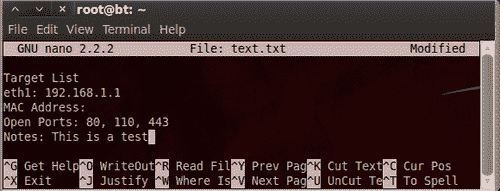
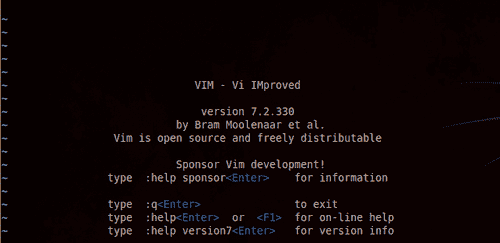
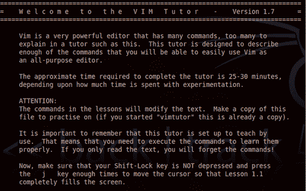
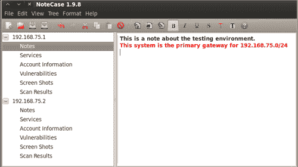
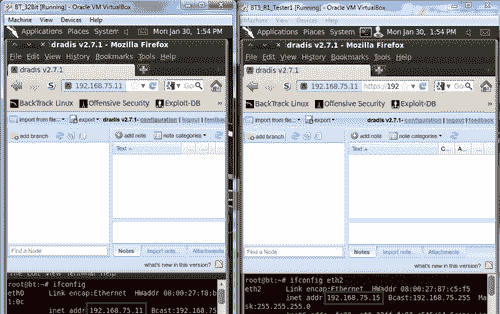
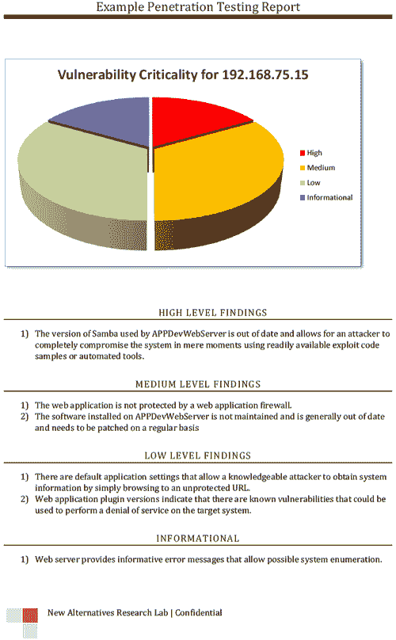
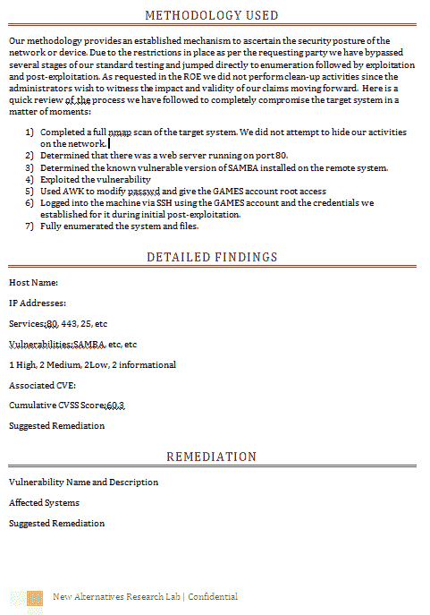

# 九、数据收集工具和报告

渗透测试的每一个步骤都必须正确记录，这可能看起来很痛苦。这不仅能够获得准确和可重复的结果，而且还能够让人对工作进行双重检查，确保测试过程中没有遗漏任何内容。随着渗透测试变得越来越普遍，测试团队变得越来越细分和专业化。团队中可能有一个人专门从事应用程序渗透测试，另一个人是利用后天才。有一件事不会因角色而改变，那就是需要适当的文档和报告。

幸运的是，社区可以使用一些工具来减少记录渗透测试的每个步骤、命令和结果的总体痛苦。正确使用这些工具后，文档将成为第二天性。

本章介绍了一些工具和技术的使用，这些工具和技术可以减少记录测试进度的痛苦，并简化报告编写：

*   简单文本编辑器
*   重温 Dradis-是时候合作了
*   报告概述

在我们开始有趣的东西之前，我们需要回顾一下基础知识。这些方法都是行之有效的，很少出错。撇开效率不谈，这些方法就是有效的。

# 立即录制-稍后排序

本书中讨论的几乎所有内容都可以通过 BackTrack 命令行实现。现在，为您记录每一个输入和输出不是很好吗？显然，这不会是渗透测试记录保存的巅峰，但从长远来看，拥有这样的日志可能最终会为您节省麻烦。

```
# script pentest.log 

```

Linux 脚本命令将记录测试期间使用的大多数命令。

# 老派——文本编辑法

正如网站创建狂热者一样，有一群人只使用纯文本编辑器作为数据存储库和报告生成工具。不过，不要让这种工具明显缺乏的特性欺骗了你。在今年的 DerbyCon 上，我有幸与一位个人交谈，他提到他使用 vi 自动化了数据收集的每一个步骤。通过使用自动化和脚本，各种工具的输出可以被处理、转换并收集到 vi 文本文件中。使用宏和脚本，他能够生成完整的报告。最初的设置可能很复杂，但最终产品的简单优雅令人惊叹。

流行的 Linux 文本编辑器包括**vim**，它需要一些实践，Nano 提供了编辑和收集简单文件数据的方便方法。

## 纳米

Nano 在本书中用于各种文本编辑需求。它学习起来又快又简单，非常适合快速记笔记或快速编辑文档。

### 注

不要被 Nano（Nano 的另一个文本编辑器）的简单性所愚弄。Nano 执行高级用户功能，如测试调整、语法突出显示、强大的文本搜索等。

从回溯类型 `nano`启动 Nano，后跟需要编辑或创建的文件名。Nano 将在您当前的工作目录中创建该文件。

```
# nano test.txt 

```



Nano 可以通过命令行选项或编辑 `/etc/nanorc`处的配置文件进行定制。使用 `nanorc`可以设置的一些选项包括以下内容，以及更多内容：

*   区分大小写的搜索
*   文本文件转换选项-是否转换 Dos 或 Mac 文本文件？
*   编辑器应该包装你的文本吗？
*   自动缩进选项

如果您决定在测试过程中利用 Nano，请务必查看设置并找到最适合您的工作流程和首选项的配置。

有关 Nano 的更多信息，请访问：[http://tuxradar.com/content/text-editing-nano-made-easy](http://tuxradar.com/content/text-editing-nano-made-easy) 。

## VIM-高级用户选择的文本编辑器

VIM 是作为 charityware 提供的 vi 的改进版本。

### 注

如果您发现想要使用 VIM，我们鼓励您向 ICCF 捐款。通过 `vim`命令启动编辑器时显示此信息。



使用 VIM 的人都应该熟悉一些基本命令。为了帮助那些对 VIM 完全陌生的人，该工具提供了一个教程，可以通过在命令行中键入 `vimtutor`来访问该教程。

```
# vimtutor 

```



在测试期间使用 VIM 收集数据的一些好处包括：

*   预装在许多 Linux 发行版上。
*   非常小的资源占用—当在系统上运行密集型进程时，这是非常有益的。
*   Compare multiple files by using the `diff` function. Perfect for those times when you had performed a test three months ago and want to quickly look for the differences. Also useful for ensuring that website code has not been modified from test to test. For instance, to compare `test1.txt` to `test2.txt:`

    ```
    # vim test1.txt test2.txt 

    ```

    

*   使用二进制模式可以查看甚至编辑二进制文件。
*   可以以只读模式打开文件，以避免意外更改文件。
*   使用 `-X`开关进行基本的动态文件加密。如果使用最新版本的 VIM（7.3+），则可以将加密设置为使用 Blowfish 作为加密类型。要加密名为 `test.txt`的文件，请使用以下命令启动文件：

    ```
    # vim -x test.txt 

    ```

系统将提示您输入加密密钥。将来解密文件时将需要此密钥。

```
Enter Encryption Key: ThisIsATest
Enter Same Key again: ThisIsATest

```

在文件中输入一些测试：


在没有正确的加密密钥的情况下保存并重新打开时，文件中的信息将无法识别：

```
# Vim -x test.txt 

```


对测试期间收集的数据进行加密是有益的，也是值得鼓励的；但是，需要注意的是，VIM 使用的对称加密类型并不适合共享文件。在这种情况下，专注于非对称加密方法的单独解决方案可能更合适。

## 便笺盒

如果您更愿意使用图形编辑器来收集和管理您的测试信息，那么有许多选项可用。当使用回溯时，可以用来收集项目或测试数据的工具之一是 NoteCase。它可以通过 `apt-get install notecase`安装在您的回溯访客机器中。下面是如何使用 NoteCase 收集您正在测试的站点信息的示例：



Notecase 通过选择**文件****另存为**并选择适当的下拉选项，允许文件以加密格式保存


# Dradis 协作框架

当涉及到渗透测试期间的协作和数据共享时，很难与 Dradis 中提供的好处和选项相比。这是我们在[第 1 章](01.html "Chapter 1. Planning and Scoping for a Successful Penetration Test")、*成功渗透测试*的规划和范围中讨论的两个主要数据收集工具之一，通常是数据收集的首选工具。和往常一样，在能够开始之前，我们需要一些可用的数据。对于本例，我们将假设一家小企业要求我们在其 web 服务器上执行渗透测试，该服务器仍处于利用阶段，在 Internet 上不可用。根据交战规则，除此之外，我们不允许访问 `192.168.75.0/24`子网上本地可访问的特定服务器。我们可以通过 VPN 访问 `192.168.75.0/24`网络，最多可以同时进行两次连接。测试时间有限，因此我们打算使用两个人来执行测试。

为了遵循此示例，您需要启动并运行以下虚拟环境：

*   `192.168.75.0/24`子网上的两台回溯来宾计算机（VLAN1）。
*   pfSense 配置为通过 DHCP 为 `192.168.75.0/24`子网（VLAN1）分配地址。
*   Kioptrix 1 级已设置为连接到 VLAN1。

此设置应允许您有效地遵循本章的其余部分。报告是一个非常灵活的领域，因此需要一些时间来找到您希望用于测试的“正确”模板和格式。

## 绑定到 127.0.0.1 以外的可用接口

在绑定到另一个端口时，需要进行一些轻微的修改来启动 Dradis。

```
# cd /pentest/misc/Dradis
# nano start.sh

```

更改第 15 行以匹配以下内容：

```
bundle exec rails server webrick $*

```

保存文件并使用 `-h`功能调用 `start.sh`命令，以显示可用选项：

```
# ./start.sh -h 

```


此时，我们可以通过键入：绑定到端口 3004 上的 `192.168.75.11`（使用您用于托管 Dradis 服务器的回溯机**的 IP 地址）**

```
# ./start.sh -b 192.168.75.11 -p 3004 
=> Booting WEBrick
=> Rails 3.0.6 application starting in production on http://192.168.75.11:3004
=> Call with -d to detach
=> Ctrl-C to shutdown server

```

通过启动浏览器并在本地主机和其他回溯机器上键入 `https://192.168.75.11:3004`来测试您的配置。请注意，在下面的屏幕截图中，我们可以确定 `192.168.75.11`上的 Dradis 服务器可由两台机器访问。



任何一个系统所做的更改都将被更新，以便两个用户都能看到。进行更改时，会通知其他登录用户：


当出现此注释时，只需单击“添加分支：旁边节点列顶部的**刷新树**图标即可


有效地使用 Dradis 等工具将使您的团队在执行测试时更加高效和彻底。

# 报告

在渗透测试结束时，所有数据都需要转化为信息，以便企业和网络所有者采取行动。尽管渗透测试的目标可能有所不同，但记录整个过程并将结果转换为易于理解的格式的需求仍然是一样的。执行报告中应包含的一些项目包括以下内容：

*   封面
    *   你的公司标志
    *   所进行试验的标题和说明
    *   保密提示
    *   测试日期和时间

封面应该既专业又醒目。如果你碰巧有任何图形可用于你的标志，这是一个理想的地方显示他们。查看此示例，了解典型报告封面的基本概念：


下一页应提供报告中所含材料的索引。添加索引可以让读者快速跳转到感兴趣的位置。当该人员正在参加会议或需要快速复习报告内容时，这一点尤为重要：


下一页应该是**执行摘要**，可用于快速审查调查结果。执行摘要可能因目标受众而异。在我们的例子中，我们假设我们不知道报告提交给谁，因此试图涵盖所有基础——技术和非技术经理。

报告的这一部分应向未参与初始测试过程的人员提供足够的信息，以了解测试是什么，以及测试的目标是什么。它还应该提供一个关于调查结果的快速概述，以及是否发现了需要立即关注的特别问题。

请看以下示例：


如前所述，我们设法在一个页面中捕获了几个主要区域。信息应简明扼要，尽可能避免使用技术术语，因为报告最终可能会提供给管理团队的非技术成员。

### 提示

你发现的所有漏洞都需要有人付费修复，但如果他们不理解你的报告，他们不太可能这么做。

应在不到一页的篇幅内涵盖的主要部分包括标题和简要说明、范围或介绍以及测试发生的时间线。许多人不明白，执行渗透测试的人与团队的任何其他部分一样，受到资源的限制。如果破解密码需要两天时间，但您只有一天时间执行测试，这并不一定意味着密码是安全的，只是您没有足够的时间正确执行测试。

执行摘要中的调查结果部分非常重要。大多数管理团队可能永远不会了解为发现这些漏洞而必须采取的所有步骤，他们只想知道这些步骤是什么，以及每种类型的优先级是什么，以便他们可以开始发布补救策略和计划。

请看我们报告的下一页：



我们不仅清楚地定义和总结了研究结果，而且还提供了一个很好的图表来帮助研究结果的可视化。通过分解客户的漏洞，您可以让他们的生活更轻松，并且可以避免在将来再次访问，只是为了再次检查您的发现。

从您的角度来看，提供清晰定义的网络图非常重要。这使客户能够理解所有适当的系统都经过了测试，并且在某些情况下会暴露客户甚至不知道的问题，例如网络上不一定属于的系统。理想情况下，您应该有一个网络上所有可用服务的列表。在下面的示例中，我们只列出了端口和描述，因为我们知道只涉及一个系统。另一种方法是列出所有服务，例如：

<colgroup><col style="text-align: left"> <col style="text-align: left"> <col style="text-align: left"></colgroup> 
| 

**端口**

 | 

**说明**

 | 

**系统**

 |
| --- | --- | --- |
| 80 | 超文本传输协议 | 192.168.75.1, 192.168.75.2, 192.168.75.15 |

如果系统上存在不应该存在的服务，那么这样的列表可以执行。例如：一台利用服务器仍在运行一台几年前就应该关闭的 web 服务器。

请看下面的示例页面，其中包括基本网络图和在 `192.168.75.15`上打开的虚拟端口列表。


最后，是时候提供一些详细的报告了。这是您详细列出调查结果的机会，并提供有关如何发现这些问题的信息。详细报告部分中可以放置的数据量通常没有限制。确保提供至少足够的信息，以便管理员可以尝试模拟测试的特定部分，以确保已实施的任何缓解控制措施都能实际工作。

在文档中的某一点上，应该说明所使用的方法，无论是标准方法的子集，还是您自己提出的方法，了解您所做的事情都很重要。这是让你的笔记变得非常方便的地方。

下面是一个小示例，展示了本节的内容：



如果你仔细观察，你会注意到有一个补救部分。修复问题所需的所有信息都已在报告中，但有时最好列出与特定漏洞相关的易受攻击系统。这使得企业能够以逻辑方式快速而简单地解决漏洞。例如，管理员的任务可能是更新网络上的所有 SAMBA 版本，并且通过报告中的修正部分，他们可以直接在列表上工作。

任何与提供可操作数据无关的附加信息都应添加到附录中。这包括任何大型数据转储，如目录列表、URL、已安装的软件和版本等。

# 对读者的挑战

使用前面提供的实验室设置，对 Kioptrix 1 级机器执行完全记录的测试！

完成报告后，请后退一步，将自己想象成一个将此报告作为输出接收的企业主。您的工作是否允许修复发现的任何问题？您是否提供了足够的交叉参考资料，以便在初步咨询完成后，该文件能够独立存在？

再次查看[第 1 章](01.html "Chapter 1. Planning and Scoping for a Successful Penetration Test")、*成功渗透测试*的规划和范围，看看您是否可以设置一个 HTML 模板，使您能够轻松地将详细数据导入最终报告。一旦这样的东西被自动化，它就有可能节省大量的时间！

# 总结

在本章中，我们介绍了在执行测试时安全收集数据的几种方法，如 VIM、Nano 和 NoteCase。我们还利用现有的 Dradis 知识，将其配置为同时供多个测试人员使用。

我们审查了渗透测试报告中应包含的几个关键项目。有时，贵公司获得的唯一可见性将基于此报告。报告越好，下一次需要渗透测试时，您就越有可能再次接到电话。

最后，我们向读者发出了一个小挑战，要求他们完成并记录本章中审查的配置评估。

在下一章中，我们将有机会在构建一个模拟安全虚拟公司的测试实验室时，将所有这些信息付诸实施。