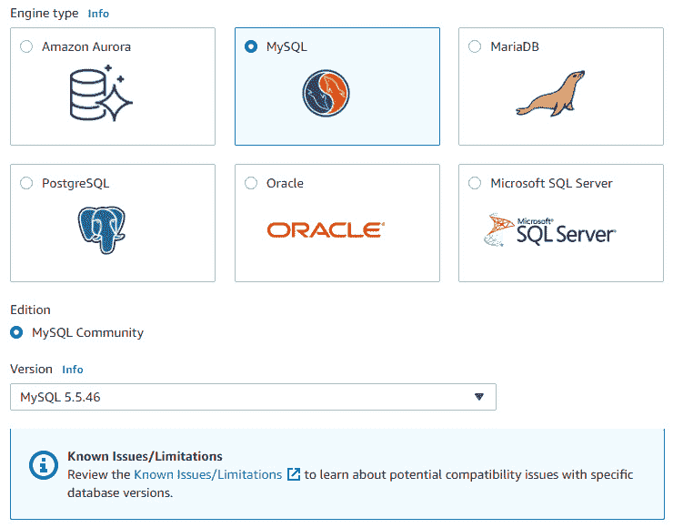
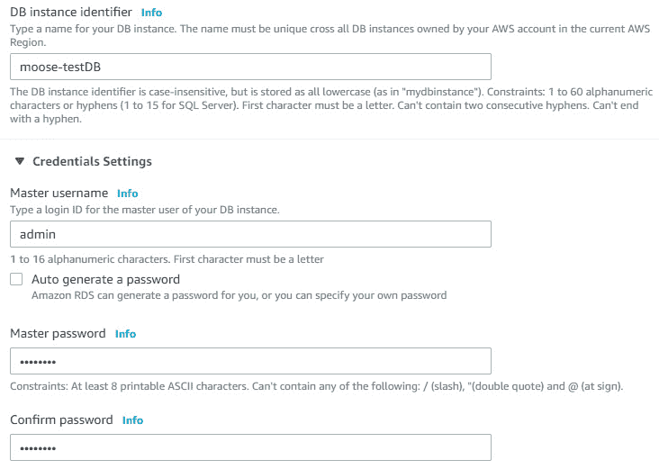
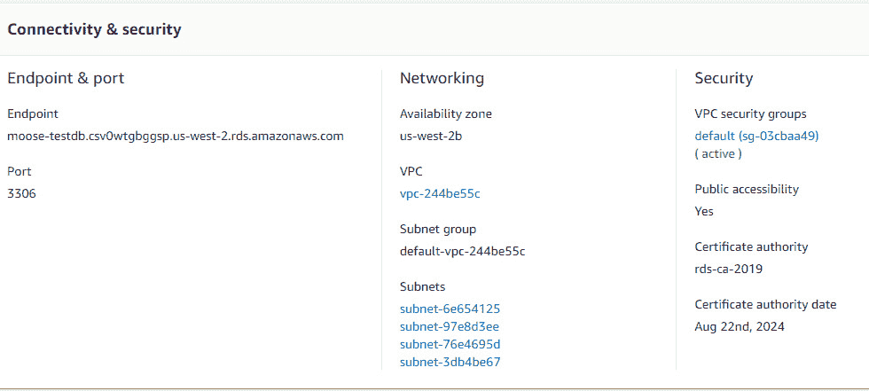
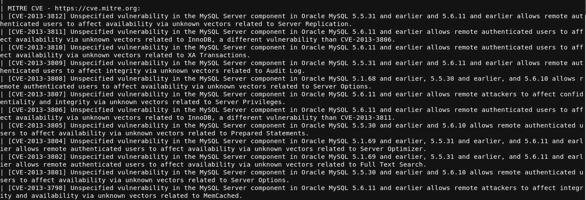
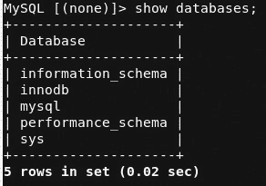
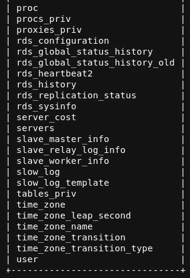
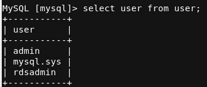

# 五、了解易受攻击的 RDS 服务

亚马逊**关系数据库服务**（**RDS**提供可扩展且易于设置的基于云的数据库，允许用户像操作典型数据库一样操作它们。RDS 使用户能够通过 MySQL 和 Amazon Aurora 等服务与数据库交互，就像用户在标准物理数据库基础设施中一样。RDS 的崩溃与常规数据库一样——注入和错误配置。

在本章中，我们将通过讨论一些关键点和使用 MySQL 建立 RDS 数据库来了解什么是 RDS。在建立数据库之后，我们将扫描它，然后使用它应用语法，学习必要的“动作”和命令，以便在一个小型 MySQL 数据库中导航。之后，我们将通过暴力强制登录凭据来了解弱密码的严重程度，并通过了解什么是**SQL 注入**（**SQLi**）以及它对数据库的影响来结束。

在本章中，我们将了解以下内容：

*   理解 RDS
*   设置 RDS（MySQL）
*   理解基本 SQL 语法
*   数据库操作与探索
*   理解错误配置
*   了解注射点

# 技术要求

要遵循本章中的说明，您需要以下内容：

*   **Nmap**：[https://nmap.org/download.html](https://nmap.org/download.html)
*   **九头蛇**：[https://github.com/vanhauser-thc/thc-hydra](https://github.com/vanhauser-thc/thc-hydra)
*   **美杜莎**：[https://github.com/jmk-foofus/medusa](https://github.com/jmk-foofus/medusa)
*   **Vulnscan**：[https://github.com/scipag/vulscan](https://github.com/scipag/vulscan)

查看以下视频以查看代码的运行：[https://bit.ly/35Va2KH](https://bit.ly/35Va2KH)

# 了解 RDS

RDS 允许用户建立、扩展和操作关系数据库服务，而无需建立自己的数据库服务器。除了没有在本地分配硬件和资源外，RDS 的目标是降低拥有成本，这反过来使公司能够更专注于自己的业务目标，减少对技术需求的担忧。自托管数据库往往会占用大量时间、金钱和人力–RDS 使所有者只需创建和配置其云数据库设置。

让我们快速浏览一下使用 RDS 的一些优点。

## 使用 RDS 的优势

为什么 RDS 是一种为基础设施建立数据库的好方法，有许多好处和优点。除了我们已经简要提到的一些，我们很高兴知道如何使用 AWS 及其相关服务快速、安全地扩展。

让我们快速了解一下为什么 RDS 比其他数据库服务更具影响力：

*   **快速**：只需点击几下，您就拥有了自己的数据库！不要担心我们目前没有进行任何实际操作，在本章中，我们将大量使用 RDS。
*   **Secure**: Both **data at rest** and **data in use** are encrypted.

    --**正在使用的数据**是当前从一个源传输到另一个源的数据。重要的是，这个数据是安全的，因为有人可以在中间执行 T4 攻击。MiTM 攻击是指攻击者能够在数据在线路上移动时访问数据。攻击者随后会检索未加密的数据，并将其用于恶意目的。

    --**静止数据**是当前存储的数据，包括备份。攻击者不应能够访问或查看此数据。未加密的静态数据会造成很大的风险，如果数据被盗，攻击者可以查看数据。

    --数据库实例将自动修补。有些选项允许手动管理修补程序–正如您所想象的，如果不应用修补程序，这可能会导致安全问题。

*   **易于管理**：能够通过 AWS web 控制台集中控制您的所有数据库，使事情变得非常无缝。但是，数据库管理员必须确保他们能够跟上不断更新和扩展的需求。
*   **可扩展**：只需点击几下，您就可以根据需要扩展数据库。由于不必购买大量的 hardware，因此您可以轻松地扩展基础设施。

与此列表不同的另一个好处是 RDS 为选择它而不是不在本地托管它的客户端带来的成本效益。公司可以通过迁移到 AWS 来节省大量资金。这主要是因为不必建立物理基础设施。

从安全的角度来看，不在本地存储数据库意味着您不必担心物理访问控制和物理安全，这也节省了成本。AWS 共享安全模型确保亚马逊拥有物理设备的所有权，包括这些设备的物理安全。

现在，让我们开始更专门地了解一些服务，以便了解 RDS 中承载的服务类型。我们要提到的两个服务是 MySQL 和 Aurora。

## MySQL

MySQL 是一个基于**S**结构化**Q**uery**L**语言的标准数据库，也称为 SQL。综合性的数据库作为 web 应用程序的后端数据库，已经变得相当普遍。所以，当你在网上购物时，你很可能正在与一个 MySQL 数据库进行交互。

虽然本节中没有涉及太多内容，但重要的是要知道我们将在本书中使用 MySQL。我们将研究各种数据库系统，并讨论那些系统所使用的语法。

## 极光

Aurora 是一个与 MySQL 和 PostgreSQL 兼容的关系数据库，其构建目的是提高持久性和速度。众所周知比 MySQL 和 PostgreSQL 等其他数据库速度快得多，并且提供了与我们提到的 RDS 相同的优势。它在构建时考虑了其他 AWS 组件，例如：

*   S3
*   EC2
*   专有网络和更多…

它也由 RDS 管理，这意味着它们使用依赖于 AWS 的相同管理和管理功能。我们将在[*第 6 章*](06.html#_idTextAnchor281)*中更深入地了解如何设置和测试 Aurora，以及如何设置和测试 AWS Aurora RDS*。现在我们知道了什么是 RDS，让我们来看看实际建立一个 RDS PoalT6-数据库。

# 设置 RDS（MySQL）

为了建立 RDS 数据库，我们将使用较旧版本的 MySQL。您将在 AWS 控制台中来回移动 RDS，因此请确保在 AWS 控制台中锁定 RDS 图标：

图 5.1–将 RDS 固定为快捷方式

在那之后，确保你在你在这本书中一直与之合作的地区，并继续建立一个数据库。请记住，在整本书中，选择我们一直用于环境的区域是很重要的。这使得我们的所有资源在地理位置上保持一致。

按照下面的说明创建您自己的 RDS 实例：

1.  Click on the **RDS** icon you created, and then select **Create database**:

    

    图 5.2–创建新数据库

2.  Next, you'll need to select a database – we will be using **MySQL**. Make sure you use an older version, if not the oldest version available:

    

    图 5.3–选择 MySQL

3.  After that, you'll be given a template to choose from. We want to avoid charges, so use the **Free tier** option:

    

    图 5.4–选择自由层

4.  Next, set the name, username, and password for the RDS instance:

    

    图 5.5–创建用户名和密码

5.  确保您已为数据库选择选项作为公共数据库：

图 5.6–公开 RDS 实例

您现在有一个正在运行的 RDS 数据库！它需要一些时间来完成创建–一旦完成创建，您可以通过 MySQL 访问它。

在我们的实例启动并运行之后，让我们继续向我们的安全组添加一条规则，允许默认的 MySQL 端口**3306**打开并允许对该实例的流量。

## 向安全组添加规则

我们的实例已经完成，但还没有完全准备好。现在，您需要确保允许通过端口**3306**进行入站流量–这是我们将访问实例的端口。

为此，请执行以下步骤：

1.  Click on the security group within your database:

    

    图 5.7–创建安全组

2.  点击**VPC 安全组**。
3.  单击安全组 ID。
4.  创建允许来自端口**3306**的**任何**流量的入站规则：

图 5.8–编辑规则

现在，您可以从计算机连接到数据库。接下来，让我们来看一个连接到我们的 To.t0.新设置的 Undo-T1E.P 数据库的测试。

## 测试连接

一旦你的数据库启动并运行，它总是一个良好的健全检查，以确保你可以连接到它——即使你不会马上使用它。为了测试与我们新数据库的连接，让我们在 Kali 打开一个终端，使用**mysql**访问我们的数据库：

$mysql-h<<rds instance="">>-p3306-u admin-P</rds>

以下屏幕截图显示了前面命令的输出：

图 5.9-连接到 RDS

我们现在有一个稳定的数据库连接！扫描服务器后，我们将查看数据库中的移动情况。

现在，我们了解如何连接到数据库，让我们来看看我们如何扫描我们的数据库在 PayTeT T0 定量测试。

## 扫描 RDS

现在我们有了我们的 RDS 数据库并运行，让我们来看看我们将如何对它进行各种扫描。这些技术正是我们将在 pentest 中使用的技术，可以帮助我们在实验室环境中更多地了解我们的*目标*。

以下步骤将帮助我们实现这些结果：

1.  Let's say this is a "real-life" pentest. The first thing we want to do is check our target and see what ports are open. In order to enumerate any information, we need to run a *basic scan* on the host:

    **$nmap-vv-Pn<<RDS 实例>>**

    这将产生以下输出：

    

    图 5.10–端口 3306 在实例上打开

2.  Next, we run a version scan to see what version of the software is running on the port:

    **$nmap-P3306-Pn-sV<<RDS 实例>>**

    这将产生以下输出：

    

    图 5.11–端口 3306

3.  Next, we confirm the software version using Metasploit:

    **$使用辅助/scanner/mysql/mysql\u 版本**

    **$set rhosts<<RDS 实例>>**

    **$exploit**

    这将产生以下输出：

图 5.12–使用 Metasploit 扫描 MySQL 版本

太好了，现在我们知道运行的是什么版本了！

枚举阶段的下一部分是查看哪些 CVE 与此版本相关。我们将查看使用 Nmap 中构建的脚本列出的一些 CVE。

重要提示

CVE 为您在评估过程中可能发现的各种漏洞和漏洞提供了参考。您可以在此处找到有关 CVE 的更多信息：https://cve.mitre.org/.

接下来，让我们拉一个新的 CVE repo，并使用更新的 CVE repo 运行 Nmap 扫描。

以下步骤将指导我们：

1.  First, you'll need to get the following from GitHub: [https://github.com/scipag/vulscan](https://github.com/scipag/vulscan).

    我们可以使用**git clone**命令执行：

    **$git 克隆 https://github.com/scipag/vulscan scipag_vulscan**

    **$ln-s`pwd`/scipag\u vulscan/usr/share/nmap/scripts/vulscan**

2.  Then run your scan:

    **$nmap-sV--script=vulscan/vulscan.nse-p3306<<RDS 实例>>**

    这将为您提供以下输出：

图 5.13–来自 Vulnscan 的信息

我们可以看到，扫描的输出向我们显示了各种 CVE，我们可以查看它们。您可以使用 MITRE 数据库在此处查找 CVE:[https://cve.mitre.org/](https://cve.mitre.org/) 。CVE 是一个相当深入的话题，可能会稍微偏离本书，因此最好简单地理解 CVE 是在测试期间发现的漏洞和漏洞的参考。

正如你所知道的，有各种各样的方法来扫描——我指的是皮肤——一只猫！通过扫描主机，您可以查看任何打开的服务和端口，这些服务和端口可能成为服务器的立足点。在 pentesting 中，没有一个端口被忽视，也没有一个服务被遗忘。枚举是关键，扫描可能是枚举中最大的策略！

现在，让我们看一些有关 SQL 语法的快速参考资料，它们将帮助我们完成本章的其余部分。

# 理解基本 SQL 语法

理解 SQL 语法非常重要——特别是现在我们将通过 MySQL 与 SQL“shell”交互。从本质上讲，语法是与之交互的系统、应用程序和设备的语言，因此了解一些基础知识以及如何使用语法非常重要。

以下是属于 MySQL 语法的基本命令列表：

*   **选择**：从数据库中提取数据
*   **更新**：更新数据库中的信息
*   **删除**：从数据库中删除数据
*   **显示**：显示数据库或表中的数据
*   **使用**：切换到数据库
*   **插入**：将新数据插入数据库
*   **创建数据库**：新建数据库
*   **ALTER DATABASE**：修改数据库
*   **创建表**：创建新表

现在您已经了解了一些简单语法，让我们继续应用它，并开始在您的新数据库中移动。

# 数据库操作与探索

知道如何在数据库中移动不仅对 pentesting 很重要；作为一名技术专家，理解这一点也非常重要。数据库被一切事物所使用，你会遇到数据库的次数超过你自己的合理份额，因此理解如何使用它们的语法是很重要的。还有，如果你不知道你要去哪里，那你怎么去呢？如果你甚至不知道从哪里开始呢？如果您不将您的知识应用到实际测试中，那么在 MySQL 中移动就是这样。既然我们已经提到了语法，让我们在下一部分中实际使用它。首先，请确保已连接到 RDS 数据库。连接后，在该部分向前移动。

假设这是一个真正的 pentest，您被授予访问数据库的权限，但需要查找错误配置。访问服务器时要做的第一件事是显示服务器上的所有数据库。

让我们使用一些命令来帮助我们在数据库中操作：

1.  Let's look at the databases in our instance:

    **$show 数据库；**

    这将为我们提供以下输出：

    

    图 5.14–列出 RDS 中的数据库

2.  Great, we now know what databases are on the server. Next, let's take a look at the MySQL database – this typically hosts usernames and passwords:

    **$使用 mysql；**

3.  Next, let's look at the tables within that database:

    **$show tables；**

    将显示以下表格：

    

    图 5.15–显示表格

4.  You'll see a table titled **user**. Go ahead and show the data within that table:

    **$SELECT*来自用户；**

    这将为我们提供以下输出：

图 5.16–从用户表中列出信息

您将获得一些数据，这些数据看起来就像我们的屏幕截图中所示的混乱数据。如果您查看它，您可以看到每个用户名及其哈希。默认情况下，MySQL 使用 SHA-1 哈希。

现在，让我们通过只查询用户来确保看到了所有用户：

$从用户中选择用户；

这将为我们提供以下输出：

图 5.17-人类可读文本中的用户

如您所见，我们有用户名及其哈希：

*   **rdsadmin**：***AAEED912FFD9F3EBB625FBE039BB2A88FB8C4187**
*   **mysql.sys**：***此密码无效，可在**处使用
*   **管理员*****2470C0C06DEE42FD1618BB99005ADCA2EC9D1E19**

接下来，让我们看一看，是否有更自然的方式来查看终端中的用户名和散列。在 pentesting 时，能够在一个屏幕截图中有效地演示一种技术是一种很好的实践。这样做有助于您的客户理解并在将其放入报告时看起来更专业。

我们可以通过使用 Metasploit 转储哈希来实现这一点。让我们向前看，看看我们如何做到这一点。

## 使用 Metasploit 转储哈希

转储散列是从用户那里获取密码的好方法。虽然散列不是密码本身，但它们可以被破解或用于“散列”传递攻击，这是一种允许您使用散列密码进行身份验证的技术。

要执行我们的**hashdump**，我们需要在 Kali 实例中使用**Metasploit**。加载后，使用辅助模块**mysql_hashdump**并设置参数以适合您的目标。确保使用数据库用户名和密码：

图 5.18–转储散列

正如您所看到的，我们已经成功地转储了数据库哈希，并且可以提供一个更简洁的屏幕截图，该截图可以提交到 pentest 报告中。

现在我们已经找到了移动和定位用户和密码的方法，让我们继续移动，看看我们如何创建数据库，并在测试期间使用**碎屑**。

## 创建 RDS 数据库

在进行五旬斋时，通常会留下**面包屑**。这些碎屑通常被称为**人工制品**，它们被放在内部，以便让客户知道它们实际上是在他们所说的系统中。此外，当 pentesters 在几个月后再次访问系统时，他们将通过查看工件是否已移除来知道系统是否已修复。如果工件仍然存在，这是一个很好的指标，表明系统的问题没有得到解决-通常，因为管理员会在修复问题时删除工件。

对于我们的 MySQL 服务器，我们将创建一个名为**pentest**的数据库。如果这是一次真正的订婚，那么它将作为一个*我在这里*声明被抛在后面：

1.  Connect to your database and enter the following command to create the database:

    **$create database pentest；**

2.  Now that you have a database created, it's a good measure to double-check and make sure it was created correctly:

    **$show 数据库；**

    以下屏幕截图将显示输出：

图 5.19–显示我们的新数据库

现在我们已经创建了一个数据库，我们对 RDS、MySQL 以及如何移动数据库有了更多的了解。现在，让我们讨论一些常见的错误配置，并进行一次动手的暴力强迫练习，以真正了解由错误配置引起的问题。

# 理解错误配置

如果不能快速有效地纠正错误配置，则可能成为数据库的终结。这些问题往往是由卫生条件差或管理人员缺乏知识引起的。数据库中留下的漏洞是讨厌的黑客们的宝藏，但是，仅仅因为它们对 pentesters 很有趣并不意味着它们应该存在！

让我们来看看你在技术生涯中可能会发现的一些常见问题。

## 弱密码

弱密码倾向于从默认密码或普通密码派生。在此处了解有关弱密码的更多信息：https://cwe.mitre.org/data/definitions/521.html. 弱密码通常是容易猜到的密码。以下是被视为弱密码的列表：

*   管理
*   暗语
*   12345qwer
*   密码 123
*   根

为了帮助说明弱密码有多危险，让我们看看一些工具，我们可以使用这些工具在最近创建的 RDS 数据库上对管理员帐户强制使用弱密码。

### 九头蛇

Hydra 是一个很好的工具，当你需要破解登录密码时可以使用——它对于各种协议都是快速、简单和灵活的。在我们的例子中，我们将使用它来强制我们的 RDS 数据库登录。

在开始之前，请确保您有一个简短的密码列表，以便针对 RDS 登录进行测试。我建议使用 10 个左右的密码，并将它们存储在一个**.txt**文件中。创建密码文件后，使用以下命令使用已知密码**admin**和密码列表强制数据库：

$hydra-l admin-P passwords.txt<<rds instance="">>mysql</rds>

这将为我们提供以下输出：

图 5.20–使用 Hydra 进行暴力施压

如您所见，Hydra 以绿色显示找到的密码和用户名，使我们更容易阅读。现在让我们来看另一个工具，美杜莎。

### 美杜莎

Medusa 与 Hyrda 相同–如中所述，它是一个强大而快速的工具，可以暴力破解登录凭证。和前面一样，让我们使用我们的密码列表和已知的用户名名称来强制我们的 RDS 登录：

$medusa-h<<rds instance="">>-u admin-P/root/passwords.txt-M mysql</rds>

这将为我们提供以下输出：

图 5.21-美杜莎的暴力强迫

注意最后一行显示**账户**，显示已找到用户名和密码。

### 变质岩

Metasploit 还内置了一个很棒的模块，让我们可以使用蛮力！就像其他时候一样，使用您的密码列表和已知用户名来强行登录！要查找该模块，请搜索**mysql_ 登录**扫描器，并以您的 RDS 实例为目标：

图 5.22–使用 Metasploit 的暴力强制

现在，您已经有了一些时间来研究数据库中的各种问题，同时还可以测试弱密码。如果您检查工具的输出，您将看到文字**登录失败**，这表明我们没有成功获取凭据。但是，如果您查看显示为**成功**的输出，您将看到凭证**admin:password**已经找到。

现在，让我们进一步讨论一下我们在数据库中看到的一些问题，其中一些问题你可能会在你最辉煌的职业生涯中发现。

## 未修补的数据库

未修补的系统是一个重大问题，有时恶意黑客很容易遇到这个问题。那么，为什么公司不修补他们的系统或者启用自动修补呢？不幸的是，事情并没有那么简单。由于特定补丁对其系统和应用程序有不利影响，许多公司都面临着补丁问题。此外，修补可能需要时间，并可能导致服务器停机。如果服务器未运行，通常会导致组织收入损失。

这就是为什么 pentesting 现在成为一个如此大的职业领域。公司面临的问题是必须不断更新其安全态势，几乎不可能查看所有内容。Pentesting 通过不断查找未修补的系统和利用漏洞来帮助缓解该问题。这样做可以让公司评估与 u 匹配系统相关的风险，并据此制定计划。

现在让我们开始结束，但在结束之前，我们将快速查看注射。注入是在允许访问后端数据库的 web 应用程序中发现的最具影响力的漏洞之一。

# 了解注射点

虽然在本章中我们不打算对注入进行任何“实践”，但有必要了解什么是注入、它是如何工作的，以及为什么它仍然是 web 应用程序中的首要问题之一。我们将在[*第 6 章*](06.html#_idTextAnchor281)**中，在为 SQL 注入练习设置易受攻击的 e 环境时，设置并测试 AWS Aurora RDS*的注入实现。*

## 什么是注射？

注入是应用程序中允许执行恶意语句的缺陷。虽然看起来“不太邪恶”，但这些语句可以是实际控制数据库的语句——最终让未经授权的用户控制系统。这意味着如果不纠正，该漏洞可能允许恶意用户访问敏感数据 or 甚至完全接管数据库。

## 它是如何工作的？

首先，需要找到一个入口点；这通常是网页或 web 应用程序中易受攻击的输入部分。易受攻击的入口点通常可以直接访问 SQL 数据库，并允许用户进行直接从数据库查询的查询。一旦发现，恶意负载将发送到数据库并在服务器端执行。让我们来看看一个概念 To.T2A. T2（To.T3，PoC，T4），它说明了一个非常基本的注入钉，它允许一个 UnAuthOutT6 的用户名和密码的查询。

### 伪码

在这个例子中，我们将使用伪代码——这不是真正的编码；它的代码易于阅读，并帮助读者理解正在执行的操作。以下字符串是伪代码，这意味着它可能在实际场景中工作，也可能不工作：

从用户名='administrator'和密码='password'的用户中选择用户名

以下查询将尝试检索管理员用户名和密码，但将失败，因为数据库将看到用户无权访问服务器。把这看作是一个虚假的陈述。**FALSE**语句仅仅意味着服务器将不会执行该命令，因为该查询是不合法的（有多种方式可能是不合法的）。

因此，如果数据库不执行 false 命令，这意味着它应该运行一个**TRUE**语句。让我们更改查询以使其**为真**：

从用户名='administrator'和密码='password'或 1=1'的用户中选择用户名

通过在查询末尾添加**或 1=1’**，我们将其变成**TRUE**语句，因为**1**等于**1**——使其成为 TRUE。这样可以检索管理员的用户名和密码。

重要提示

请记住，伪代码不是真实代码。伪代码的目的是规划一个可能性的“路线图”。

## 为什么这是一个问题？

如前所述，注入影响业务员工和客户。注入点可以允许从数据库的完全控制到泄漏敏感信息的任何操作。当建立一个新的数据库时，前端网站对输入进行清理以帮助防止这些类型的攻击是非常关键的。

# 总结

在本章中，我们学习了很多关于数据库的知识，比如 RDS、MySQL 和 Aurora。我们还快速深入研究了 MySQL 语法，以帮助我们更好地理解在交互式 MySQL shell 中，命令是什么以及它们在做什么。我们学习了如何使用 RDS 建立数据库，还学习了如何在 RDS 数据库中创建数据库。然后，我们学习了如何对数据库进行暴力攻击，同时还学习了弱密码对数据库影响的严重性。

在下一章中，您将开始使用从本章中获得的知识，并在更多实践中实现它，同时在 AWS 中构建环境。

# 进一步阅读

*   SQL 注入：[https://portswigger.net/web-security/sql-injection](https://portswigger.net/web-security/sql-injection)
*   数据库漏洞：[https://www.darkreading.com/vulnerabilities---threats/the-10-most-common-database-vulnerabilities/d/d-id/1134676](https://www.darkreading.com/vulnerabilities---threats/the-10-most-common-database-vulnerabilities/d/d-id/1134676)