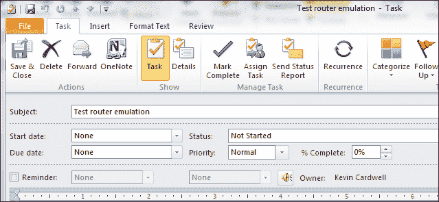
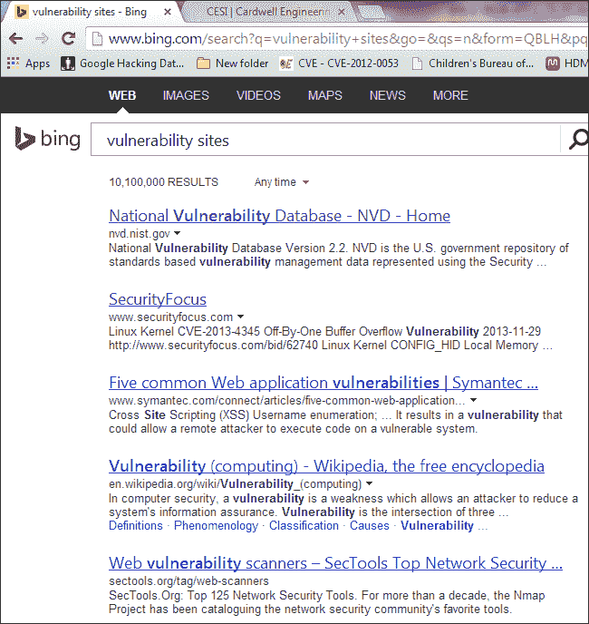
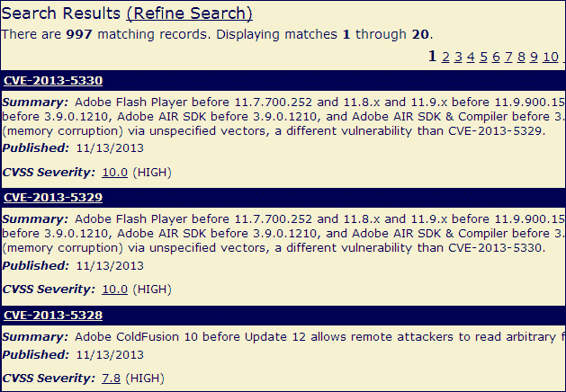
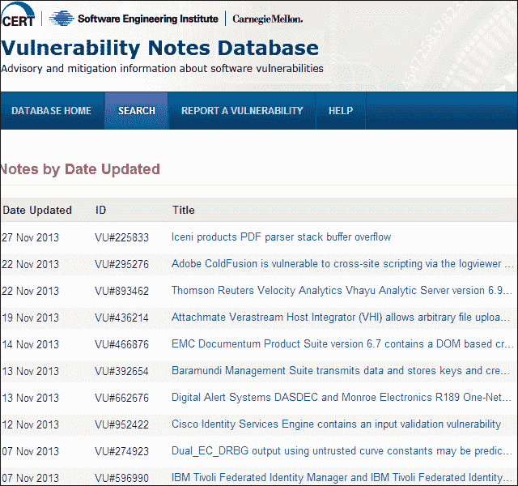
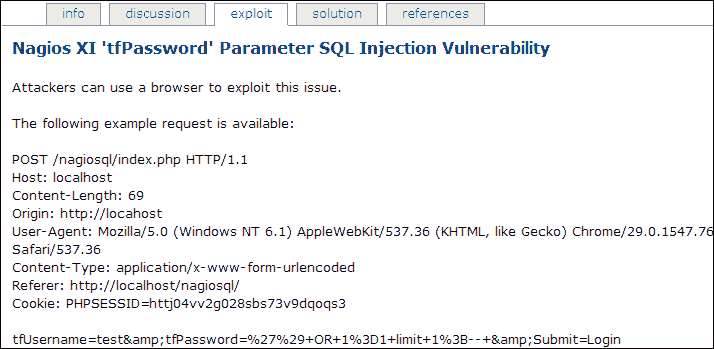
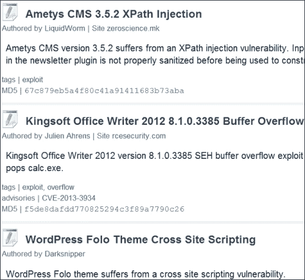
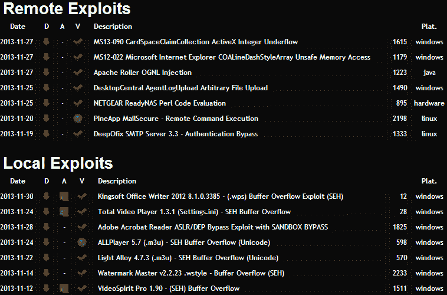

# 三、规划范围

在本章中，我们将开始规划测试环境所需的过程。我们将讨论搜索和查找要测试的漏洞的过程，并为测试一种类型的漏洞创建一个实验室环境。我们将讨论以下问题：

*   计划
*   识别漏洞

本章将为我们提供一个定义的体系结构，以构建和支持我们必须执行的测试类型。

# 规划

完成的一个基本步骤是计划；此外，还将讨论我们正在努力实现的目标以及我们将如何实现这一目标的概念。这是许多人没有花足够时间的领域之一。正如我们在[第 1 章](01.html "Chapter 1. Introducing Penetration Testing")*介绍渗透测试*中所讨论的，对于我们的抽象方法，我们不能像潜在攻击者那样花六到九个月的时间进行规划。话虽如此，我们可以花大量时间规划我们想要为我们的高级笔测试实验室构建的体系结构。因此，我们将从计划的内容开始。我们将要讨论的计划包括以下各节中提到的领域。

## 我们想要实现什么？

我们是在测试 web 应用、应用、设备还是其他东西？这就是我们开始确定虚拟化环境需要什么的地方；此外，我们还将确定如何配置和构建所需的组件。

## 我们必须在什么时候完成？

在这一步中，我们将定义我们试图创建的内容的时间范围。在这方面，重要的是要有一个明确的时间表；否则，我们可以继续建设，没有既定的结果。虽然一些不一致或未知是过程的一部分，但我们对时间定义得越好，我们的工作效率就越高。这就像设定目标；如果你设定了目标，但你从未指定时间框架，那么它就不是一个定义明确的目标。

当你读到这篇文章时，你可能想知道目标设定是如何进入这些页面的。对于那些想知道的人，我将提供一个例子。在为客户开发培训课程的实验室时，我试图创建并构建一个运行良好的 Cisco 路由器仿真功能。由于我还没有决定尝试的次数，更重要的是，这项活动的时间框架，这导致了三天的徒劳活动。我将在本章后面介绍这一点，并提供如何构建自己的平台的步骤。

本课程所需的虚拟平台将是 Hyper-V。我在 VMware 环境中使用此解决方案已经五年多了，但无论我如何尝试，当我开始在 Hyper-V 中构建平台时，它都不起作用。我首先尝试使用 Starwind 软件转换我的一个虚拟机 VMDK 文件，但这并没有起作用。网络无法与路由器仿真器通信，也无法与主机通信。因此，简而言之，没有连接。然后，我从头开始构建虚拟机，认为它可能会工作，但这也不起作用。我为此工作了三天，阅读了每一篇博客文章、白皮书，或者任何我能弄到手的东西。一个更好的计划是给它一天时间，或者限制它几次尝试，但是当我开始这个计划时，我没有任何时间表，因此花费了我三天的时间。我现在和你们分享这个，希望你们不要犯我犯过的同样的错误。

量化和跟踪计划的一个好方法是使用时间图表或项目工具。有几个可用的，但它超出了本书的范围涵盖他们。你用哪一个真的不重要。如果你像我一样，你会想用一个简单的，而不必学习另一个程序。因此，我使用的是 Microsoft Outlook 中的日历。你们中的一些人可能使用微软项目；那很好，用任何适合你的东西。我相信，我们大多数人（如果不是所有人的话）在某个时候都使用过邮件程序，如果功能在邮件程序中，那么它是值得探索的。

我们将看一个例子。我同时使用任务和事件组件，因此如果启动 Microsoft Outlook 程序，您可以单击菜单顶部的**新项目**。这将打开菜单以创建新项目。以下屏幕截图显示了一个示例：

在 Outlook 中创建新项目的菜单（剪切的文本不重要）

我们想要创建一个新任务；为此，我们点击**任务**选项上的，将打开一个新菜单，如下图所示：

单击任务选项后的菜单屏幕（剪切的文本不重要）

从这一点来说，创建任务并跟踪任务是一个相对容易的过程；此外，您可以在任何时候参考任务列表，查看仍保留哪些任务。我们鼓励您在规划网络体系结构的构建时使用任务和事件。我们将在本书中为您提供逐步构建环境的过程，但当您偏离本书的范围时，您可能会遇到类似创建路由器模拟的挑战。当你这样做时，你必须为可能的时间延迟和其他不可预见的情况做好计划。在规划阶段花费的时间越多，在进入后期开发阶段时遇到的障碍就越少。

# 识别漏洞

由于我们已经将 pen 测试定义为漏洞的验证和验证，这是我们准备建立 pen 测试实验室时的主要关注点之一。我们必须找到我们可以利用的漏洞，以便在工作范围允许时获得访问权限。您将花费大量时间进行准备，试图找到能够提供我们所需访问且可靠的漏洞。

需要记住的重要一点是，所有系统都会有漏洞，但并非所有漏洞都会被利用。在很多情况下，您会发现存在漏洞，但您的搜索没有发现针对该漏洞的攻击；此外，您可能会发现一个漏洞，但它对您的目标无效。这是因为，正如我们喜欢说的，剥削不是 100%。通常情况下，您会把所有事情都做好，但利用漏洞就会失败！欢迎来到渗透测试的真实世界。

在我们查看某些位置的信息以查找漏洞之前，我们将讨论我们想要了解的关于我们将要利用的潜在漏洞的信息。我们想了解以下关于可利用性的部分（如果不是全部的话）：

*   Access vector

    我们需要在本地计算机上、本地子网上还是远离任何位置？

*   Complexity

    该漏洞利用是否需要编写代码、将不同组件链接在一起，或者我们需要做任何额外的工作才能成功利用该漏洞？

*   Authentication

    是否需要身份验证，或者我们是否可以在没有凭据的情况下利用该漏洞？如果需要身份验证，我们需要做什么来打破身份验证？我们可以使用暴力、字典攻击，还是有默认密码？

这只是一个小样本，当我们开始研究漏洞特性时，我们可能需要考虑的是什么。使用**通用漏洞评分系统**（**CVSS**）的示例如以下截图所示：

关于通用脆弱性评分系统的参考表（裁剪文本不重要）

识别漏洞是我们初始阶段的关键部分；我们必须找到能够进行 pen 测试的漏洞。你们中的一些人可能会认为，我们可以启动我们选择的漏洞扫描器，然后让扫描器告诉我们存在什么漏洞；此外，您可能认为您可以让一个利用框架来帮助实现这一点。虽然所有这些都是事实，但这不是我们努力实现的范围和重点。记住，我们想要构建笔式测试实验室环境，为此我们需要找到可利用的漏洞；此外，在进行实际测试之前，我们需要发现这些问题。在本节中，关键是定位我们希望在实验室体系结构中测试的漏洞，相应地，我们将记录利用该漏洞并获得访问权限的步骤和要求。我们这样做，所以当我们遇到它时，我们知道会发生什么。

需要掌握的一个微妙但极其重要的概念是，我们可以建立任何可能的环境，但我们必须根据我们想要实现的目标来建立环境。例如，Microsoft Internet Explorer 中存在许多漏洞；其中大部分与内存问题有关，这些被称为释放后使用漏洞。此外，这是一款软件，我们在笔试旅行中很可能会遇到它。因此，我们必须跟踪和监视 Internet Explorer 上出现的漏洞，这是我们对可能遇到的所有潜在软件和硬件采取的方法。

一种常见的方法，也是我们推荐的方法，是跟踪商业领域非常流行的产品的漏洞。我们已经提到了 InternetExplorer；其他需要跟踪的还有思科、红帽、甲骨文、Adobe 等。这是专业安全测试的力量；我们知道所有这些供应商以及其他许多供应商都可能存在漏洞，因此一旦我们发现其中任何一个，我们就可以着手将其用于我们的优势。该过程包括获取漏洞的详细信息，然后构建实验室，以便能够测试和实验该漏洞。因此，如果我们有一个 Internet Explorer 漏洞，我们将创建一台带有易受攻击软件的机器，然后我们将开始有系统地利用该漏洞获得某种形式的访问。这里还要强调的一点是，我们不必总是运行利用代码或执行某种形式的利用来获得访问权限。通常，我们会发现另一个弱点，例如服务上的默认密码，这将允许我们获得所需的访问权限。所有这些都将及时讨论，但我们现在必须研究获取漏洞信息的技术。

## 漏洞站点

与互联网上的大多数东西一样，有更多的漏洞报告网站，我们无法跟踪。因此，推荐的方法是选择几个站点，然后通过定期检查来保持一致性。或者，您可以订阅一项服务，它将向您发送定制的漏洞列表。但是，作为一名专业的安全测试人员，我们没有能力设置系统、服务和/或网络的配置文件，以便跟踪。然而，我们可以维护我们可能遇到的流行软件和系统的概况，但这又是一个反复试验的问题。我和我的学员练习的方法是经常访问三到四个地点，并始终访问它们；这就是我们跟踪公共领域最新信息的方式。您还应该留意供应商补丁的发布日期，并跟踪它们。为了证明这是一项多么艰巨的任务，我们将做一个实验；打开您最喜欢的搜索引擎，搜索漏洞站点。

以下屏幕截图显示了在 Microsoft Bing 中进行此搜索的示例：

搜索 Microsoft Bing 上的漏洞站点（剪切的文本不重要）

正如前面的截图所示，这些术语的点击量超过 1000 万次。现在，正如你们中的许多人读到这篇文章时很可能意识到的那样，我们所进行的搜索并不是一次狭隘而精确的搜索；我们可以输入`vulnerability + sites`以返回结果中任意位置的这两个单词的匹配。此外，我们可以使用漏洞站点使结果精确匹配。我们不会在这里这样做，但这是你可以做的事情，以获得更细粒度的结果，可以节省你一些时间。

当我们审查结果时，我们看到列表顶部是国家脆弱性数据库，这是我们喜欢使用的数据库之一。所以，输入[http://nvd.nist.gov](http://nvd.nist.gov) 在您的浏览器中。一旦网站出现，查看漏洞信息；在主页左上方，点击**漏洞**。

这将打开漏洞的搜索界面；从这里开始，只需输入您的搜索参数并查看结果。此搜索页面如下图所示：

漏洞的搜索界面（剪切文本不重要）

正如你所看到的，我们可以搜索很多东西。另一个功能是搜索特定的时间范围，如果您只是在寻找最新的列表，这将是有益的。

例如，在关键字搜索字段中输入`Adobe`，点击**搜索**。这将导致 Adobe 的漏洞被返回，并且由于它是一个流行的程序，因此总是有攻击者试图利用它进行攻击。此外，它还为我们提供了跨平台利用的能力，这是我们在进行测试时希望看到的另一个特性。

以下屏幕截图显示了此搜索的示例：

显示返回 Adobe 漏洞的屏幕（剪切文本不重要）

这就是我们喜欢看到的！在前面的屏幕截图中，当我们看到 CVSS 严重性时，7 表示它是一个高漏洞，10 表示它不会变得更严重，因为它是最大严重性。如您所见，在进行此搜索时返回了 997 个结果。这是因为 Adobe 是一个经常被攻击的目标，因此，攻击者仍然是攻击的目标。

下一步是进一步研究漏洞，看看漏洞的具体特征是什么；此外，我们将为它找到一个漏洞。由于这是一种客户端软件类型的漏洞，这意味着我们必须进行某种形式的欺骗，让用户访问某个站点或单击某个东西。现在，我们有这个网站的主要目的，我们将转移到另一个网站。我们鼓励您在方便的时候浏览该网站并了解更多信息。

您可能已经注意到，我们必须输入信息来显示漏洞；这可能不太理想，因此我们现在将查看第一个为我们提供最新漏洞列表的站点。

返回国家漏洞数据库网站主页，位于页面左侧的中间位置，您将看到其他链接；找到并点击**US-CERT Vuln notes**。这将带来 US-CERT 团队的漏洞说明。以下屏幕截图显示了一个示例：

显示来自 US-CERT 团队的漏洞说明的屏幕（剪切文本不重要）

我们现在有一个漏洞列表，它为我们提供了一个时间线，我们可以将其用作参考。事实上，有一个列表使这个列表成为一站式列表；我们可以查看最新信息并继续前进，这是我们希望从我们选择的前三到四个站点中获得的。此外，我们仍然可以引用更多的站点，但我们使用三到四个选定的站点来获取更新，然后当我们发现感兴趣的内容时，我们可以查看其他站点，看看他们对该漏洞的描述。

我们希望能够进一步探索我们的漏洞，因此我们现在将通过一个示例来实现这一点。当我们在前面的屏幕截图中查看此漏洞列表时，我们看到 Cisco 有一个漏洞。由于我们喜欢了解这些流行产品的最新信息，思科就是其中之一，因此我们将进一步探索。请根据您的结果使用您自己的漏洞，或者查看 2013 年 11 月 12 日结果中的 Cisco 数据。

单击该漏洞后，将打开另一个页面，其中包含有关该漏洞的更多详细信息。我们看到这是一个输入验证问题，这是我们经常看到的。程序员在开发应用时没有很好地清理他们的输入。以下屏幕截图显示了该漏洞的详细信息示例：

显示漏洞详细信息的屏幕（剪切的文本不重要）

当我们查看有关漏洞的详细信息时，我们可以开始制定计划，说明如何构建一个环境来测试它。在某些情况下，我们可能需要额外的硬件。这里的要点是理解这个过程，一旦你理解了，你就可以从那里开始。过程不会改变，只有漏洞会改变。

当您查看该漏洞的详细信息时，您可能会注意到有一个项目被称为**常见弱点枚举**（**CWE**），在本例中是**CWE-20**。该 CWE 是标识符，例如我们喜欢从 Mitre 团队使用的其他标准的编号，它可以帮助获得关于弱点的额外信息。更重要的是，它为我们提供了一个标准术语来搜索，就像**常见漏洞和暴露**（**CVE**号）一样。

如果我们在该漏洞上选择 CWE 编号，它将为我们提供有关该漏洞的更多详细信息。以下屏幕截图显示了一个示例：

屏幕显示有关漏洞的其他详细信息（剪切的文本不重要）

当您查看这些信息时，会有很多关于我们的漏洞的额外细节，因此，它为我们的规划和测试目的提供了更多数据。我们要关注的一点是，存在一个区域，用于识别漏洞的可能性，正如我们从前面的**高**漏洞截图中看到的，这就是我们正在寻找的。同样，有许多网站可供参考，因此您可以使用我们在本书中展示的网站，也可以自己研究。当我们查看这两个站点时，我们没有发现的一件事是关于等式开发方面的更多信息；这是我们想要的东西，所以我们现在将在一个网站上查看这些信息。

下一个我们要看的站点是我们返回搜索结果时排名第二的站点，是**安全焦点**站点。打开您选择的浏览器并输入[http://www.securityfocus.com](http://www.securityfocus.com) 。这将使您进入安全关注的主页；以下屏幕截图中显示了一个示例：

显示安全焦点主页的屏幕（剪切的文本不重要）

正如前面的截图所示，我们进行搜索的那天对 Mozilla 来说是糟糕的一天。关于**安全焦点**网站，我们喜欢的是它们为我们提供了一些我们认为有用的额外细节，其中之一就是漏洞利用信息。选择主页上列出的漏洞之一。以下屏幕截图显示了**Mozilla Firefox/Thunderbird/SeaMonkey JavaScript 引擎多缓冲区溢出漏洞**的一个示例：

显示 Mozilla Firefox/Thunderbird/SeaMonkey JavaScript 引擎多缓冲区溢出漏洞漏洞的屏幕（剪切的文本不重要）

当您查看漏洞详细信息时，您将看到有许多我们感兴趣的选项卡，主要是**漏洞**选项卡。这将潜在地为我们提供关于漏洞可利用性的信息，如果存在关于野外利用的信息。由于这些漏洞本质上是新的，因此没有任何利用漏洞的信息。它仍然是一个很好的参考，因为它为我们提供了有关该漏洞的更多详细信息。我们可以在测试中使用的 Nagios 漏洞示例显示在以下屏幕截图中，以提供读取漏洞信息的参考：

我们现在投入业务是因为我们有利用漏洞的字符串，而这只是建立实验室和测试它的问题。这一切都会及时到来，现在我们将继续审查不同的网站，以作为潜在的参考。当我们追求漏洞时，漏洞越新越好。这是因为，很可能还没有为检测漏洞而编写的签名；此外，如果它是一个零日漏洞，那么它就不会被公开，这使它变得非常理想。我们有几个网站要审查，它们为我们提供了关于零日的信息，我们首先要看的是网站的零日跟踪程序。在浏览器中，输入[http://www.eeye.com/Resources/Security-Center/Research/Zero-Day-Tracker](http://www.eeye.com/Resources/Security-Center/Research/Zero-Day-Tracker) 。网站的一部分显示在以下屏幕截图中：

现场的一部分[http://www.eeye.com/Resources/Security-Center/Research/Zero-Day-Tracker](http://www.eeye.com/Resources/Security-Center/Research/Zero-Day-Tracker) （剪切的文本不重要）

正如您在访问该网站后所看到的，它致力于零日调查结果。这是我们讨论过的，我们希望在研究中做的事情，这个网站为我们提供了一个很好的参考。因此，让我们进一步探讨上市问题。选择一个漏洞并查看其他详细信息。以下屏幕截图显示了进一步详细信息的示例：

在查看屏幕截图时，我们希望更仔细地查看该漏洞的一些特征。我们发现目前没有可用的缓解措施。这意味着在披露时无法对其进行辩护。这使得它非常适合添加到我们的工具箱中。您会注意到它影响了 Windows XP 机器，这很好地说明了为什么 Microsoft 继续试图从行业中消除这一点。操作系统已经过时，确实需要更换；问题是它作为一个受信任的操作系统已经存在很长时间了，以至于人们，包括我自己，都喜欢使用它。然而，微软已经宣布不再支持它。因此，从我们的测试角度来看，如果漏洞被释放，这意味着它永远不会有补丁，因此漏洞将始终存在。

安全社区中的许多人认为，在等待 Windows XP 生命的终结时，攻击者一直坐视着许多 Windows XP 漏洞。这是因为一旦不再支持该漏洞，那么释放的任何漏洞都将是攻击者以及我们在测试中使用的理想漏洞。

您还将从屏幕截图中注意到，该漏洞已被利用，并且存在针对该漏洞的攻击。同样，这些是我们的测试曲目的理想选择；此外，当我们遇到这种类型的目标时，它们应该是我们利用漏洞收集的一部分。这是过程的一部分；我们确定什么在我们的实验室环境中起作用，记录它，并将其作为我们安全测试集合的一部分。

另一件需要注意的事情是，虽然它是以内核级权限执行的，这是好的，但所需的位置是本地的，这对我们的测试是不利的。好吧，这并不是那么糟糕，它只是意味着我们将无法远程执行，因此我们必须获得本地访问权限来执行漏洞的杠杆作用，并相应地利用它。当您查看此类漏洞时，我们将最高优先级和优先权放在远程攻击的能力上，虽然此示例攻击不太理想，但我们仍然可以对其进行测试，看看我们必须做些什么才能使攻击成功。由于需求是本地的，这意味着我们很可能不得不使用某种形式的诱饵来让客户与我们的诱饵交互，以便能够利用它。我们可以使用的一些方法是电子邮件，例如，向网站发送电子邮件，看看我们是否可以欺骗任何人点击电子邮件。我们将讨论诱饵和诱骗受害者的不同方法，同时我们将观察要模拟的不同类型的测试。

下一个站点我们将关注的是由**TippingPoint**赞助的零日计划站点，该站点现在是 HP 的一部分。在浏览器中，打开链接[http://www.zerodayinitiative.com](http://www.zerodayinitiative.com) 。以下屏幕截图显示了站点主页的示例：

当您查看前面的屏幕截图时，您会看到中有关于**即将发布的咨询**以及**已发布的咨询**的部分。我们将重点关注**发布的咨询**，但**即将发布的咨询**也很有趣，您可能希望自己去探索。

这些是已通知供应商但尚未发布修补程序的通知。当您看到供应商收到通知后的天数，以及仍然没有发布补丁的事实时，您可能会感到惊讶。然而，同样，这是我们将不在这里讨论的内容，但这是很好了解的信息。我们将查看**发布的咨询**。点击**发布的咨询**，将弹出当前发布咨询的列表，如下图所示：

当您查看前面的屏幕截图时，您会看到一些具有**CVE**。我们可以使用此 CVE 跨不同工具和站点跟踪漏洞，以收集更多信息。此外，几乎所有工具都与 CVE 编号有交叉引用，因此，这使我们的工作更容易。这个过程是创建我们想要测试的实验室环境，然后使用这个工具，看看它在数据包级别做了什么。要在数据包级别查看信息，我们只需使用协议分析器，如 Wireshark 或其他。

我们不会在这里详细介绍该站点，但我们确实希望更仔细地查看该漏洞详细信息中的可用信息。我们将选择上一个屏幕截图中未显示的示例。我们选择的漏洞位于**Cisco 数据中心管理器**中，其 CVE 编号为**2013-5486**，并于 2013 年 11 月 24 日**进行了修补**。一旦我们选择了该漏洞，它就会显示关于实际漏洞本身的附加信息。作为测试人员，我们希望尽可能多地研究该漏洞，以便在测试环境中或在现场测试时更好地模拟它。下一个屏幕截图显示了该漏洞的示例：

这里特别令人感兴趣的是，该漏洞于 2013 年 2 月 22 日向供应商报告，并持续到 2013 年 11 月 24 日。这就是修补的现实；在安全方面，它不会拯救我们。这对我们现在来说是好的，因为我们正在测试，但最终是坏的，因为我们在测试和进攻，所以我们在防守端保护自己。正如我想说的，补丁是一个坏系统，但不幸的是，当我们试图缓解软件中的这些漏洞时，它是我们唯一的系统。

所有这些网站都遵守了负责任的披露规则，包括通知供应商，并为他们提供足够的时间来构建补丁和修复漏洞。并不是所有的网站都会遵循这种想法；有些是我们称之为完全披露的，即一旦发现任何漏洞，他们就会在不通知供应商的情况下发布。由于这些场地的性质，请谨慎前往。此外，这些网站来来往往，因此它们通常会在短时间内从互联网上消失。需要注意的重要一点是，总会有一些网站不进行负责任的披露，我们希望将这些网站添加到我们的资源中，以找到验证和验证我们的漏洞的方法。

另一件被遗漏的事情是，在大多数情况下，站点中的漏洞代码是有限的。**安全焦点**有一些关于该漏洞的信息和一些代码，但这是我们所知的。

我们将首先从一些倾向于或实际上是完全公开的网站开始；因此，其中大多数都有利用漏洞的信息或链接。我们首先要看的是**SecurityTeam**的网站；打开链接[http://www.securiteam.com](http://www.securiteam.com) 。这是另一个为我们提供丰富信息的网站，超出了本书的全面探讨范围；然而，我们确实想看看这里的一些优秀信息和资源。在主页的右侧，您将看到有关漏洞利用和工具的信息，如以下屏幕截图所示：

同样，这是一个你想经常访问的网站，你可以阅读其中的一些资源和信息。该方法将被要求执行环境测试。你的下一步是计划和准备你的实验室；我们讨论过的这个站点和其他站点为您提供了一个机会，让您可以寻找外面存在的东西，然后您尝试在实验室环境中创建它，这样您就可以知道当您进入测试领域时会发生什么。

我们现在来看看其中一个漏洞，看看该网站为我们提供了什么。我们将选择主页顶部的漏洞利用选项卡，并查找我们选择的漏洞利用。要继续，请单击**漏洞**。这将打开撰写本书时列出的漏洞列表，如以下屏幕截图所示：

我们选择清单的这一部分是因为一个特定的原因。在写这本书的时候，我们正在为一个高端客户机进行一次安全测试，在简报会的初始结果中，客户问我们这样一个问题：“您在 Windows 以外的其他操作系统上发现了什么吗？”。经常会遇到这个问题，因为人们错误地认为 Linux 或 Unix 自动比 Windows 更安全。我们不打算在这本书的书页中讨论这个问题；此外，它忽略了安全性的要点，即最重要的是流程而不是操作系统。也就是说，如果您没有一个补丁管理过程，那么无论使用什么操作系统，都会发现漏洞。这里就是这样；他们的 Linux 和 Unix 平台存在漏洞，因为他们没有有效的漏洞管理系统。

在前面的屏幕截图中有许多漏洞值得调查。不过，我们将集中讨论清单上倒数第二个问题；它在 FreeBSD 中，正好是我最喜欢部署在防火墙架构中的操作系统之一，唯一优先选择它的是**OpenBSD**。让我们进一步探讨这个问题。以下屏幕截图显示了利用漏洞信息的示例：

需要注意的一点是，我们正在连接到本地主机，因此这是一个本地攻击，我们需要在本地计算机上进行攻击。正如前面提到的，这并不理想，但我们可以为此建立实验室，看看是否可以远程利用它。同样，重要的是过程；我们从那里取下它，然后用它进行实验，看看当我们在野外遇到一台 FreeBSD 机器时，我们如何使用它。当然，我们还要求 box 为这次攻击运行 telnet 服务。在上一个屏幕截图中显示的不是，而是该漏洞的实际源代码，可在网站上找到。

下一个我们要看的站点是**包风暴**。输入[http://www.packetstormsecurity.com](http://www.packetstormsecurity.com) 在您的浏览器中。packet storm 不仅有咨询和漏洞利用信息，它还是一个可以下载的文件存储库。在大多数情况下，这是一个黑客工具或类似的东西，你可以在这里找到。

一旦您查看了 packet storm 的主页，我们想看看漏洞利用领域。点击**漏洞**并查看出现的信息。有一个巨大的漏洞列表。以下屏幕截图显示了利用漏洞列表的示例：

显示利用漏洞列表示例的屏幕（剪切的文本不重要）

正如我们从其他网站看到的，如果您点击漏洞标题，它将为您提供漏洞利用的信息、详细信息和代码。

我们已经查看了许多不同的站点，正如我们所讨论的，这只是一个小样本。我们鼓励您探索和发现本书之外您想要添加到资源工具包中的内容。

在本节中，我们将介绍的最后一个网站将是一个网站，在大多数情况下，它是我们在零日查找包含漏洞的信息时的最佳参考。所使用的网站名为 millw0rm，但创始人的任务非常艰巨，他试图保持网站正常运行，因此关闭了该网站。幸运的是，进攻性安全团队延续了原有站点的传统。在浏览器中，打开链接[http://www.exploit-db.com](http://www.exploit-db.com) 带出现场。正如您所看到的，该站点根据漏洞利用所需的位置分为部分。以下屏幕截图显示了该站点的示例：

和以前一样，我们可以查看漏洞代码，但既然我们已经完成了这项工作，我们将查看该网站的另一个功能，它非常强大，而且经常被忽略。这是搜索漏洞的能力。

位于主页顶部的是一个菜单列表；花一分钟回顾一下选项。此菜单显示在以下屏幕截图中：

显示位于主页顶部的菜单列表的屏幕（剪切的文本不重要）

我们要选择的选项是**搜索**选项，所以点击**搜索**。这将打开该工具的搜索窗口，并为我们提供许多查找漏洞的方法。此外，我们可以通过端口、CVE 和多种方法进行搜索。这使我们的参考资料和资源得到充分利用；我们已经介绍了获取此漏洞和其他漏洞详细信息的多种方法，现在这使我们能够将其提升到下一个级别并搜索漏洞。因此，当我们试图利用漏洞和攻击目标时，我们现在有了一个完整的武器库来识别要使用的东西。

我们可以搜索各种参数；选择在很大程度上取决于你在研究中发现了什么。我们将提供一个简单的例子。我们在 FreeBSD 中看到了一个漏洞，因此我们将搜索数据库，并查看其中包含的关于 FreeBSD 的内容。在搜索窗口中，在**说明**字段中输入`FreeBSD`。然后，点击**搜索**按钮，将搜索提交到数据库，并返回大量结果。以下屏幕截图显示了一个示例：

有趣的是，我们没有看到在探索 SecurityTeam 站点时发现的 telnet 漏洞。这就是为什么我们在进行研究时使用大量不同的参考资料和资源。总有一种可能，一个人拥有它，而另一个人没有。列表可能位于另一个参数下。因此，我们可以尝试使用另一个参数进行搜索，看看能得到什么。我们不会在这里尝试，因为我们有来自早期站点的利用代码，因此我们可以构建实验室环境并尝试利用。我们已经涵盖了足够多的漏洞站点；此外，这为您提供了一个良好的基础，帮助您发现漏洞并试图在实验室环境中验证这些漏洞。

## 供应商现场

我们查看了一些可用作资源的站点。我们还有一件事要做，那就是供应商的网站。我们可以从供应商网站上收集到一些好的细节。话虽如此，正如 zero day initiative 网站所示，供应商并不总是提供有关漏洞的信息，除非对他们方便。有一个案例是，Cisco 将一个漏洞报告为拒绝服务漏洞，而一名安全研究人员并没有在供应商报告的内容上停下来。在他的研究中，发现这不仅是一个拒绝服务漏洞，而且是一个远程代码执行拒绝。这一事件被称为“思科之门”。你可以在[上阅读 http://www.wired.com/science/discoveries/news/2005/08/68435](http://www.wired.com/science/discoveries/news/2005/08/68435) 。简言之，它解释了一名研究人员是如何遵循规则并告诉思科及其公司他将在其研究结果中陈述的内容的，后来因在 Blackhat 会议上陈述而被起诉的。

这并不意味着供应商不会发布漏洞的完整细节，只是当您使用供应商网站时，您必须获取他们的信息并与其他网站交叉引用，然后做出判断。如果所有其他方法都失败了，那么你可以自己进行实验和测试。

在规划笔测试实验室环境时，我们希望重点关注您最有可能遇到的供应商，这一点怎么强调都不为过。我们知道，我们在某些供应商中继续看到如此多的漏洞的原因之一是因为这些漏洞非常流行，这为攻击者和我们提供了一个更好的目标丰富的环境。

由于您将遇到的大多数目标都基于 Microsoft Windows，因此我们从这里开始是有意义的。每个月的第二个星期二是一个重要的日期，它被指定为微软的*补丁星期二*。一旦名单公布，黑客社区就会聚集在一起，通宵举行“黑客大会”，看看他们是否能够利用当天全世界都知道的新漏洞进行攻击！寻找这些漏洞漏洞的最佳位置是漏洞数据库站点，一旦黑客发现漏洞，该站点将立即释放这些漏洞。

Microsoft 有一个漏洞公告编号，我们可以在尝试关联来自不同站点的信息时使用该编号；它类似于 CVE 这样的参考，但它来自微软内部。下一个屏幕截图显示了 2013 年 11 月的 Microsoft 公告列表示例：

当您查看清单时，您会发现这三个问题非常关键，而这正是我们在查找漏洞时所要寻找的问题。我们已经发现了许多获取信息的方法，而使用公告编号作为参考只是另一种方法。

您可能还记得，我们访问了漏洞利用数据库站点，一些针对 Microsoft 平台的漏洞利用与 Microsoft 公告编号有关，我们将查看公告编号**MS13-009**以供参考；在这里，MS13 的意思是 2013 年。因为我们在漏洞数据库中有它，所以我们知道它有漏洞。现在，我们的下一步是回顾这个漏洞，看看我们能发现什么。

理想情况下，当这些漏洞利用存在于漏洞利用数据库中时，它们已经是 metasploit 框架的一部分。我会认为，几乎所有阅读这篇文章的人都听说过 RAPID7 拥有的优秀开发框架，另外，由于该收购，现在已经有了商业版。我们将在整本书中使用开源版本。如果碰巧您不熟悉该工具，您可以在[发现更多信息 http://www.metasploit.org/](http://www.metasploit.org/) 。主页示例如以下屏幕截图所示：

屏幕显示[http://www.metasploit.org/](http://www.metasploit.org/) （剪切的文本不重要）

网站包含优秀的参考资料和资源，因此鼓励您查看网站上的文档，并将其添加到参考资料工具箱中。关键的一点是，一旦我们发现该漏洞已进入 metasploit 框架，它将使我们在虚拟环境中的测试工作变得更加容易。

我们从漏洞利用数据库站点获取的 MS13-009 漏洞利用示例是为 Microsoft Internet Explorer 软件编写的。这是我们在执行测试任务时极有可能遇到的问题，而且它有一个一贯的习惯，即几乎在每一个*补丁*上为我们提供漏洞。我们现在将进一步探讨此漏洞。当我们在漏洞数据库站点时，我们点击**漏洞**打开漏洞代码。以下屏幕截图显示了利用漏洞代码的标题示例：

显示利用漏洞代码标题示例的屏幕（剪切的文本不重要）

正如前面的屏幕截图所示，此漏洞利用是 metasploit 框架的一部分，因此，我们可以从框架内调查漏洞利用所需的参数。我们将在下一节中选择并构建一台攻击者机器；因此，现在我们将在 metasploit 中显示该漏洞的外观，而不提供构建该机器的详细信息。下面的屏幕截图显示了 metasploit 中的漏洞利用选项示例：

正如前面的屏幕截图所示，我们只有两个选项需要设置，**SRVHOST**和**SRVPORT**来尝试利用此漏洞。这里重要的一点是，一旦它进入框架，我们的漏洞验证任务就变得容易得多。不过要谨慎一点；仅仅因为我们在 metasploit 中有这个漏洞并不意味着我们会成功。这就是为什么存在“利用率不是 100%”的说法。

正如我们所展示的，供应商站点可以用作额外的信息源，但决不是唯一的信息源。需要一个系统的过程来识别感兴趣的漏洞，并与多个来源协调以取得成功。

# 总结

在本章中，我们研究了在尝试构建范围之前所需的初步步骤。我们从规划的第一步开始，以及规划架构的重要性。在本节中，我们确定了我们试图实现的目标，并讨论了实现这一目标的计划。

我们研究了许多方法，可以用来识别我们想要在体系结构中测试的漏洞。现在我们知道了发现漏洞的方法，我们已经准备好建立这个范围的基础。这样，当我们发现一个新的或零日漏洞时，我们就可以在我们的范围内部署它，看看我们能做些什么来利用它并访问不同的目标。这个基础将在下一章中建立。