# 六、物联网设备黑客攻击

在本章中，我们将介绍以下主题：

*   硬件利用与软件利用
*   硬件黑客攻击方法
*   硬件侦察技术
*   电子 101
*   识别总线和接口
*   嵌入式设备的串行接口
*   NAND 毛刺
*   JTAG 调试与利用

# 介绍

任何**物联网**（**物联网**解决方案）的关键核心组件都是嵌入式设备。它是与物理环境交互并与 web 端点和周围的其他设备通信的设备。了解如何利用这些硬件设备对于执行物联网笔测试至关重要。

物联网解决方案中使用的设备类型可能因产品而异。在某些情况下，它可以是一个网关，允许各种设备与之交互，同时也可以与 web 端点通信，或者，它可以是一个医疗设备实用程序，其唯一目的是从患者身体收集数据并在智能手机上显示。

然而，存在某些特定的安全问题，这些问题可能会影响任何给定的硬件设备，无论其类别如何。这是我们将在本章中重点关注的内容，以深入了解各种物联网设备安全问题，如何识别它们，以及如何利用它们，而不考虑设备类型。但是，在我们进入实际的硬件利用之前，让我们先看看硬件利用与传统软件利用的区别。

# 硬件利用与软件利用

硬件攻击和软件攻击之间的差异非常显著，最重要的是要发现硬件中的漏洞和攻击，您需要随身携带物理设备。这意味着，除非您拥有两台或两台以上的设备，否则对物联网设备的硬件进行有效的笔试是相当复杂的。

增加硬件安全性工作复杂性的另一个因素是围绕硬件安全公开可用的资源量。例如，对于您正在评估的软件，您可能会发现该软件正在使用的某个组件中存在的漏洞，或者您正在使用的软件类型中存在的常见漏洞。这并不意味着硬件利用更难，它只是意味着如果您刚开始，您可能会发现硬件利用比您以前的软件利用经验要复杂一些，因为缺少给定组件的深入的、与安全相关的信息。

另一件需要注意的事情是，就基于硬件的漏洞而言，它们相对来说更难修补，在某些情况下，如果终端用户不完全更换设备，就不可能修补。这意味着，如果硬件设备出厂时硬件设备本身存在严重的安全问题，这将是制造商召回设备并更换为更安全设备的唯一选择。

最后，作为笔式测试人员，我们最显著的区别之一是，对于硬件利用，我们需要许多硬件工具和设备来有效地评估和利用终端设备的安全性。

但是，不要失去积极性，因为我们将介绍一些硬件利用工具和技术，这将使您快速进入硬件黑客世界。

# 硬件黑客攻击方法

以下是硬件黑客攻击方法中涉及的步骤：

*   情报收集和侦察
*   设备的外部和内部分析
*   识别通信接口
*   使用硬件通信技术获取数据
*   使用硬件利用方法进行软件利用
*   后门（可选）

让我们一个接一个地深入了解其中的每一个步骤，并从更深层次上理解其中的每一个步骤。

# 情报收集和侦察

嵌入式设备黑客攻击方法的第一步是收集尽可能多的关于我们正在处理的目标的信息。这听起来很简单，但对于嵌入式设备来说，这可能比我们想象的要复杂一些。关于目标设备的信息通常至少从非常高的层次来看是有限的，因为为了获得关于设备的相关信息量，我们需要访问物理设备本身。

但即使在这样做之前，笔测试仪也可以通过多种方式收集有关给定目标设备的更多信息。这些包括客户提供的或通过其他资源提供的公开来源或文档。

本阶段可能相关的一些信息包括：

*   嵌入式设备基于什么？
*   它运行的操作系统
*   设备支持哪些外部外围设备？
*   该设备使用哪种芯片组？
*   有关设备中使用的存储和内存的详细信息
*   有关设备的任何其他相关技术信息

一旦我们有了这些信息，我们就可以进入下一步，即使用外部和内部分析来分析设备。

# 设备的外部和内部分析

一旦您获得了从上一步获得的信息，下一步就是开始使用设备本身。在这里，目标是从攻击者的角度查看设备，并使用外部和内部的视觉检查尽可能多地识别信息。

外部分析非常简单，可以通过查看设备并计算出您可以看到的所有不同组件来执行。在这里，您可以问自己以下问题：

*   设备的各种接口选项有哪些？是否有 USB 端口、SD 卡插槽或以太网端口？
*   设备如何通过电池、PPoE 或适配器供电？
*   设备上有标签吗？如果是，他们有什么样的信息？

一旦我们进行了外部分析，下一步就是对设备进行内部分析。这需要您打开设备并查看**印刷电路板**（**PCB**）。在这一步中，我们将识别设备中存在的所有不同芯片组，在数据表上查找它们，了解每个特定组件的功能，同时记录我们从其数据表中找到的各种信息。

在这个阶段，我还想画出组件之间各种互连的基本框图，以便对整个设备内部有更清晰的理解。

# 识别通信接口

一旦我们查看了 PCB 并找到了有关整个电路和其中涉及的各种组件的足够信息，下一步就是寻找与设备接口的所有可能选项。

在某些情况下，它可能非常明显，站在你面前，而在另一些情况下，它可能更难识别，因为它分散在整个电路板上，或者在某些情况下，你必须直接连接到给定芯片组的腿部。

# 使用硬件通信技术获取数据

一旦我们确定了正在使用的通信协议/接口，我们就可以使用一组特定的工具通过给定的协议与目标设备通信，并与目标设备交互，或将信息读/写到给定的芯片。

根据所审查的接口，我们将使用不同的技术连接到它，并获取笔测试的有用数据。一些最常见的接口是 UART、JTAG、SPI、I2C 和单线。

# 使用硬件利用方法进行软件利用

一旦我们通过给定的硬件接口访问目标设备，下一步就是通过硬件利用执行各种软件利用技术。这些包括执行诸如转储固件、在给定内存区域写入新内容、修改正在运行的进程等操作。

正如您现在可能已经了解的那样，大多数利用硬件技术的攻击都会导致您访问敏感资源，然后可以通过多种方式利用这些资源。

现在我们已经了解了整个硬件笔测试方法，让我们深入了解如何在硬件设备上执行侦察。

# 硬件侦察技术

除了视觉外部分析外，侦察包括两个步骤：打开设备，查看当前的各种芯片，并从其数据表中查找信息。

让我们逐一讨论。

# 打开设备

硬件侦察过程的第一步是打开设备。根据您使用的设备，此过程的复杂性可能从极其简单到高度复杂不等。

在一些设备中，您会发现螺钉隐藏在腿上的橡胶垫下面，而在其他情况下，螺钉将大部分暴露在外，在其他情况下，两个不同的部分可能会焊接在一起。

根据设备的组装方式，使用适当的工具拆下不同的部分。在整个硬件利用过程中，建议您随身携带一套好的螺丝刀，因为不同的设备中会使用许多不同类型的螺丝刀。

# 看看现在的各种芯片

打开设备后，下一步是查看 PCB 并识别存在的所有不同芯片。要读取芯片标签，请使用 USB 显微镜或智能手机的手电筒，同时稍微倾斜芯片。还建议配备支架，以便在阅读各种芯片名称时稳定地握住设备。

一旦你弄清楚一个芯片的名字，就去谷歌搜索它的制造商，然后是型号和单词“数据表”。这也是我们在本章后面将要做的事情。

一旦有了数据表，您就可以使用其中提供的信息来计算目标芯片的所有各种属性，包括引脚，这将在硬件利用过程中被证明是非常有用的。

既然我们知道了如何在目标设备上执行侦察，我们就可以进一步深入硬件利用了。为了确保我们非常了解我们的目标，并确保我们的攻击成功，我们需要更好地了解电子技术，这将使我们在利用时更容易理解。

# 电子 101

如前所述，如果你想进入硬件黑客领域，电子学是需要了解的最重要的事情之一。在不了解电子学的情况下，您可能会发现一些低挂漏洞；然而，要想精通它，您需要了解设备上发生了什么，以及如何利用给定的组件。在本节中，我们将介绍一些电子学的基本概念，一旦您开始研究嵌入式设备的内部结构，这些概念将帮助您获得更多的信心和理解。

这在你看来可能是绝对基本的；但是，当您开始使用嵌入式设备时，请将本节视为您将在后面几节以及在现实生活中看到的内容的复习。

# 电阻

电阻器是一种电子元件，它可以抵抗电流，或者说在更深的层次上抵抗电子流。电阻器，以*R*表示，是无源元件，这意味着它们根本不发电，而是通过以热的形式耗散功率来降低电压和电流。

电阻的单位是欧姆（Ω），电阻器通常使用碳素或金属线制造。您还将发现，电阻器的颜色编码有助于传达其提供的电阻值。

这就是电阻器的外观：

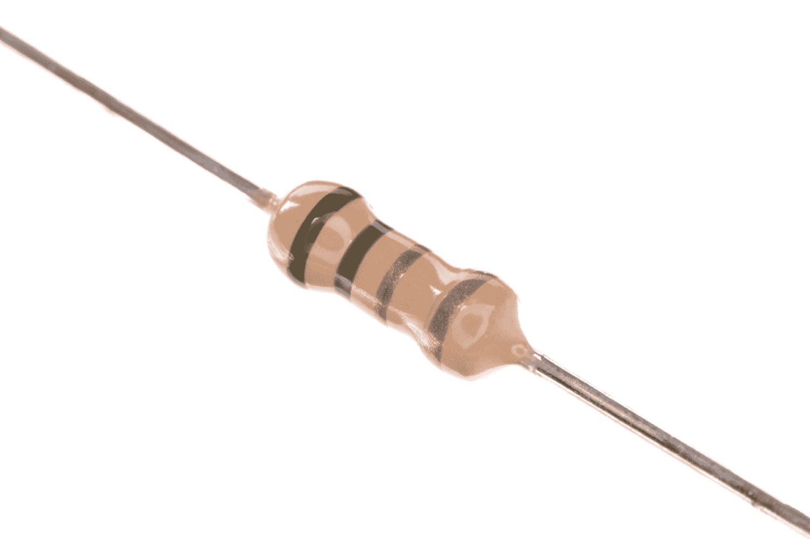

既然您知道了电阻器是什么，那么还值得注意的是，可能有两种不同类型的电阻器：固定电阻器和可变电阻器。顾名思义，固定电阻器是电阻固定且不能改变的地方，而在可变电阻器中，可以使用某些技术改变电阻。可变电阻器最流行的例子之一是**电位计**。

# 电压

电子学中的电压只是两个不同测量点之间的势能差。在大多数情况下，您会发现测量给定点电压的参考点是**接地**（**接地**），或电池或电源的负极端子。在现实生活中，如果使用 9V 电池，这意味着两点之间的电位差为 9 伏。

更深入地讲，假设导体的两端，比如铜线，有大量的电子（负电荷），另一端有质子（正电荷）。这意味着这两点的电位之间存在差异，最终导致电流流动。

为了测量电压，我们使用一种称为**伏特计**的装置，它告诉我们它所连接的两点之间的电位差。例如，9V 蓄电池正极端的电压为+9V，蓄电池负极端的电压为-9V。

# 现在的

正如我们在前一个场景中所讨论的，当电压存在差异时，电流流动（在前一个场景中，因为介质是铜导体），并且它将继续流动，直到两侧具有等量的电子和质子。

电流可以是**交流电**（**交流电**）或**直流电**（**直流电**），这意味着如果电流以恒定速率流动，例如在电池中，它将是直流电，而如果它是交流电或随时间变化，则是交流电。例如，在美国，从电源插座获得的默认电源是 120V 和 60Hz AC。

电流测量单位为**安培**（**A**），并在方程式和公式中用字母*I*表示。用于测量电流的装置称为**安培计**。

您可能会认为这三个组件电流、电压和电阻似乎相互依赖。总而言之，电压使电流流动，而电阻与电流流动相反。

这种关系就是众所周知的**欧姆****定律**，即*电流（I）=电压（V）/电阻（R）*。

这也证实了电流与电压成正比，与电阻成间接正比的事实。

# 电容器

电容器是几乎所有嵌入式设备中最常见的组件之一。顾名思义，它们的主要任务之一就是以电荷的形式保持能量。

电容器内有两块电荷相反的极板，当连接到电源时，它们会保持电荷。电容器的一些其他用途是充当滤波器，降低影响设备上其他芯片的电噪声，分离交流和直流组件（交流耦合），等等。

电容单位为法拉第，表示为*F*，计算公式如下：

*C=Q/V*

这里，*C*是电容，*Q*是电荷，*V*是电压。

上述所有数值均以法拉第（*F*、库仑（*C*）和伏特（*V*为标准单位进行测量。

# 晶体管

晶体管是一种电子元件，通过同时充当开关和放大器来实现多种用途。

作为一个放大器，它可以接收小电流并将其放大以产生更大的输出电流。其中一个例子是连接到扬声器的麦克风，麦克风接收一个小的声音输入，并在通过扬声器输出时将其放大以产生更大的声音。

类似地，作为一个开关，它可以接受一个小电流输入，并通过激活新的电流来允许更大的电流流动。

这就是晶体管的外观：

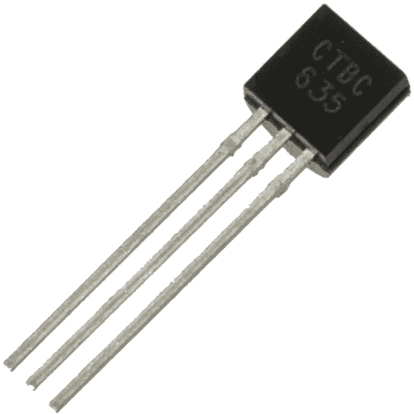

以下是 NPN 晶体管（另一种类型是 PNP，箭头指向基极）的示意图表示方式：


# 内存类型

嵌入式设备中一些最重要的组件与数据存储相关，设备可将数据存储用于多种用途。在这里，您可以找到固件和**应用编程接口**（**API**键等内容。嵌入式设备中的三种主要内存类型及其细分如下：

*   **随机存取存储器**（**RAM**）
    *   **静态 RAM**（**SRAM**）
    *   **动态 RAM**（**DRAM**）
*   **只读存储器**（**ROM**）
    *   **可编程只读存储器**（**可编程只读存储器**）
    *   **可擦除可编程 ROM**（**EPROM**）
*   混合的
    *   **电可擦除可编程 ROM**（**EEPROM**）
    *   闪光

各种存储器类型的区分是基于许多因素进行的，例如存储数据的能力、存储数据的持续时间、如何擦除和重写数据以及重写数据过程的外观。

例如，与 DRAM 相比，SRAM 只在接收电源时保存数据，DRAM 将数据的每一位存储在单个电容器中。此外，由于 DRAM 具有刷新周期这一主要事实（因为电容器最终将被放电），SRAM 比 DRAM 更快。

类似地，对于 ROM，根据数据可以写入的次数，它被分类为 PROM 或 EPROM。对于 PROM，数据一旦写入就不能修改，而在 EPROM 中，数据可以使用**紫外线**（**紫外线**）射线擦除，它可以通过一个小窗口到达芯片，通过重置芯片并使其恢复初始状态来擦除芯片。

然而，我们将遇到的两种最重要的内存类型是 EEPROM 和 Flash，或者 NOR 和 NAND Flash，这取决于读、写和擦除周期的差异，这取决于是否可以一次对整个块执行操作（Flash）以及是否需要一次对单个位执行操作（EEPROM）。

# 串行和并行通信

现在我们已经对一些电子元件有了基本的了解，让我们进入嵌入式设备中使用的不同类型的通信介质。

嵌入式设备中的两种数据通信方法是串行通信和并行通信。顾名思义，串行通信按顺序一次发送一位数据。这意味着，如果必须传输 8 位，它将一位接一位地发送，并且只有在接收到所有 8 位时，数据传输才会完成。

然而，在并行通信的情况下，将同时传输多个比特，因此与串行通信相比，数据传输过程更快。

您可能会认为并行通信会更好，并且由于更快的数据传输速率，将主要在任何地方使用。然而，这并非如此，因为我们没有考虑在电路板上的房地产量，它需要并行通信。

嵌入式设备的物理空间极低。因此，当涉及到数据传输时，考虑到并行数据传输比串行数据传输需要更多的数据线这一事实，更快并不总是更好的选择。

并行数据传输通信的一些示例是 PCI 和 ATA，而串行通信是使用 USB、UART 和 SPI 进行的。

在本书中，我们将重点介绍串行通信介质，因为它们广泛存在于您将遇到的所有硬件设备中。

# 还有更多。。。

此时，您可以执行的另一项操作是查看任何给定嵌入式设备的电路板，并尝试确定所涉及的各种组件以及它们使用的通信机制。

# 识别总线和接口

现在我们已经很好地了解了嵌入式设备中的不同组件，让我们看看如何识别设备中的不同总线和接口。

为此，第一步是打开设备并查看 PCB。请注意，在本节中，我们将只关注识别特定管脚、管头或芯片的用途，而不是实际连接到它，这是我们将在下一节中介绍的内容。

如何做到这一点…我们将首先寻找 UART，这是黑客最喜欢的访问设备的接口之一。我们将首先查看 UART 的内部结构，然后讨论如何识别引脚，最后讨论如何与目标设备连接。

# UART 识别

我们在嵌入式设备中首先要寻找的是**通用异步收发信机**（**UART**接口。UART 是嵌入式设备中最常见的通信协议之一。UART 本质上是将它接收到的并行数据转换成串行位数据流，从而更容易与之交互。

由于此处的另一个重点是减少线路数量，因此 UART 通信中不存在时钟。相反，UART 依赖于**波特率**，即数据传输速率。UART 通信中的两个不同组件将在指定波特率上达成一致，以确保以正确的格式接收数据。

此外，在 UART 通信中，还向通信中添加了另一位称为**奇偶校验位**，以便于错误检测。因此，典型的 UART 通信将按顺序具有以下位：

*   **开始位**：表示这是 UART 通信的开始。
*   **数据位**：这是需要传输的实际数据。
*   **奇偶校验位**：用于错误检测。
*   **停止位**：表示 UART 数据流结束。

如果您想自己尝试一下并了解 UART 数据流，您可以使用逻辑分析仪并连接到 UART 端口（稍后我们会确定），并在逻辑分析仪软件中查看结果。Salae logic 是一种常用的逻辑分析仪，它有 8 通道和 16 通道两种选择。

以下屏幕截图显示了逻辑分析仪中的数据外观：


让我们来看看 UART 端口在实际设备中是什么样子的。以下是 UART 端口的一些示例，这些端口已在设备中识别。注意，要进行 UART 通信，两个引脚是必要的发送（Tx）和接收（Rx）。此外，在大多数情况下，您还会发现接地（GND）和 Vcc 的另外两个引脚：

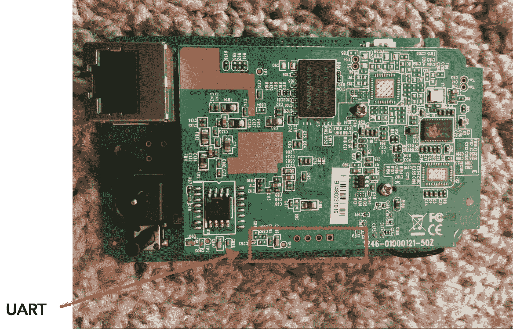

如上图所示，有四个引脚彼此相邻，在本例中为 UART 引脚。在下一节关于获取和与串行通信接口的内容中，我们将研究如何确定与 Tx、Rx 和 GND 对应的确切引脚，以及如何与这些引脚/端口接口以访问设备。

# SPI 和 I2C 识别

SPI 和 I2C 标识与我们刚才在 UART 通信标识中看到的类似。确定正在使用的通信协议是 SPI 还是 I2C 的方法之一是使用逻辑分析仪并查看通信中传输的各种位。

SPI 和 I2C 都属于串行通信，主要用于闪存和 EEPROM。正确识别正在使用的确切协议以及进一步细节的方法之一是查看芯片名称并从数据表中获取信息。

以下是 SPI 闪存芯片的外观：

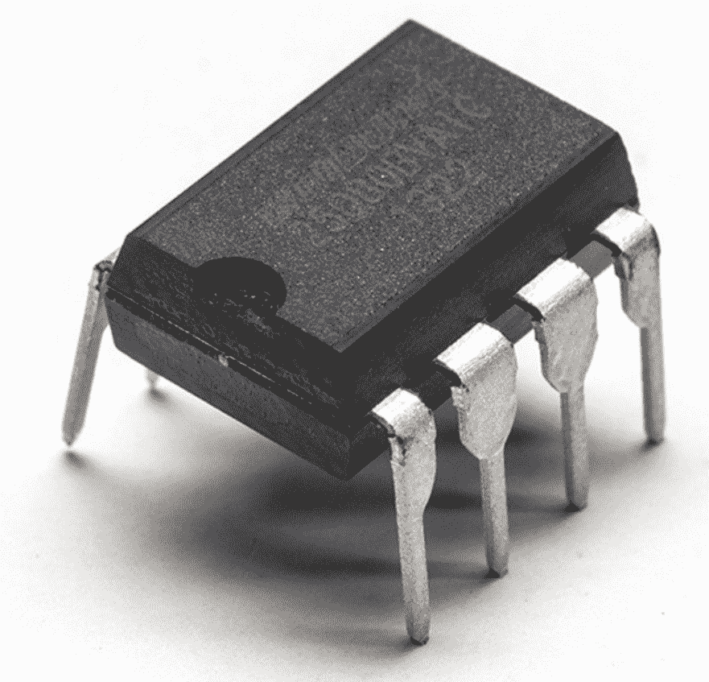

图像来源：[https://cdn-shop.adafruit.com/1200x900/1564-00.jpg](https://cdn-shop.adafruit.com/1200x900/1564-00.jpg)

上图中的闪存芯片有一个标签，Winbond W25Q80BV，这意味着现在我们可以查看其数据表并识别其各种属性，即使不知道它是 SPI 闪存芯片。

如果我们在谷歌上搜索芯片号，我们会得到以下信息：


让我们继续打开搜索结果中找到的任何数据表 PDF。在数据表一开始，我们将发现以下内容：


这意味着我们的芯片是一个 SPI 闪存芯片，存储容量为 8MB。在数据表中进一步介绍时，我们还发现了它的引脚，如下面的屏幕截图所示，它告诉我们给定 SPI 闪存芯片的确切引脚：


因此，我们能够正确识别该芯片的用途、特性以及引脚。

一旦我们有了这些信息，我们就可以使用 Attify Badge 连接到 SPI 闪存芯片，这是一种用于处理各种硬件协议和标准（如 UART、JTAG、SPI 和 I2C）的工具。或者，您也可以使用 FTDI MPSSE 电缆。

将**数据输出**（**DO**）和（**DI**中的**数据分别连接到 Attify 徽章中的 MOSI 和 MISO，或者，如果您使用 FTDI 电缆，则芯片中的 DI 连接到 DO（黄色），芯片中的 DO 连接到电缆的 DI（绿色）。此外，还要将电缆的 Vcc、GND、WP 和 CS 连接到芯片上的相同引脚。**

下图中的表格将帮助您在此阶段建立连接：


一旦建立了连接，我们所要做的就是从位于[的 LibMPSSE 库运行`spiflash.py`实用程序 https://github.com/devttys0/libmpsse](https://github.com/devttys0/libmpsse) 。这也显示在以下屏幕截图中：

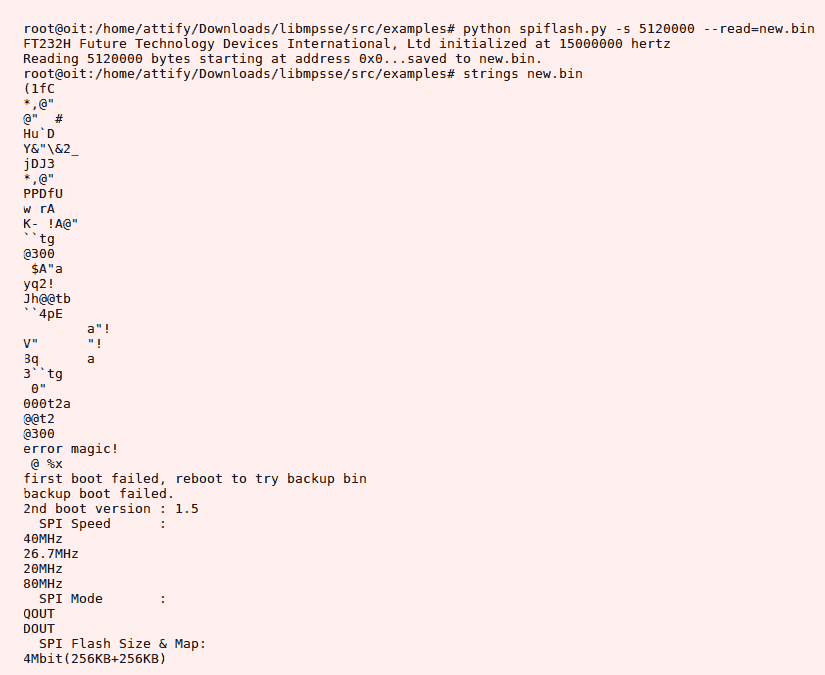

上述语法中的大小是从闪存芯片的数据表中获得的，闪存芯片的全部内容被放入一个名为`new.bin`的文件中。

因此，现在您可以查看 SPI 闪存芯片，找出其引脚，并从中转储数据，这些数据可能是固件、硬编码密钥或其他敏感信息，具体取决于您使用的设备。

# JTAG 识别

为了识别设备上有趣的公开接口，我们将寻找的最后一件事是**联合测试行动小组**（**JTAG**。

与之前的钉床测试方法相比，JTAG 是一种测试引脚和调试引脚的简化方法。它允许设备利用人员和测试人员确保设备上各种芯片中的每一个管脚都能按预期工作、互连和操作。

对于渗透测试人员来说，JTAG 有很多用途，从为我们提供读/写数据甚至调试运行进程的能力，到修改程序执行流。

当我们寻找 JTAG 时，四个最重要的引脚是中的**测试数据（**TDI**）、**测试数据输出**（**TDO**）、**测试时钟**（**TCK**）和**测试模式选择**（【T14 TMS**）。然而，即使在识别这些单独的引脚之前（我们将在下一节中进行），我们也必须首先识别 JTAG 头在设备上的位置。

为了简化工作，JTAG 提供了两个标准接口选项，如 13 针、14 针、20 针等等。以下是真实设备中 JTAG 接口的一些图像：

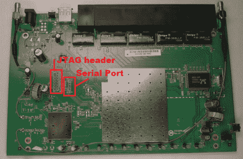

图像来源：https://www.dd-wrt.com/wiimg/thumb/9/99/DLINK-DIR632_Board.png/500px-DLINK-DIR632_Board.png

以下是 Experia v8 机箱上的 JTAG 接口，其中焊接了 JTAG 头：

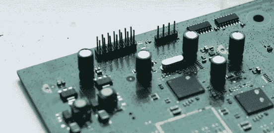

图像来源：http://www.alfredklomp.com/technology/experia-v8/

这里需要注意的另一个重要点是，尽管您可能能够找到以标准头格式排列的 JTAG，但在一些实际设备中，您会发现 JTAG 引脚分散在整个电路板上，而不是在单个位置。在这些情况下，您需要在其上焊接头/跳线，并将其连接到 JTAGulator，以便能够识别它们是否为 JTAG 引脚，以及哪个引脚对应于哪个 JTAG 引脚。

# 还有更多。。。

*   除了前面提到的接口和协议外，您的目标设备可能还使用许多其他硬件通信协议。其他一些流行的通信技术有 CAN、PCI、单线等。建议您研究更多的硬件通信协议，以便更广泛地了解分析协议的方法。

# 嵌入式设备的串行接口

由于我们在上一节中已经介绍了 UART 的基础知识，所以让我们开始讨论如何与 UART 接口进行交互。

# 准备

一旦我们在设备上找到 UART 引脚，我们将首先了解如何识别引脚。

我们试图找到的四个管脚如下：

*   德克萨斯州
*   接收
*   GND
*   Vcc

为此，我们将使用一个**万用表**，它可以测量电压和电流，因此既可以作为电压表，也可以作为电流表，因此命名为万用表。

以下是万用表的外观。如下图所示连接探头：


# 怎么做。。。

连接后，让我们继续查找下一步中描述的不同 UART 引脚。

1.  确保万用表上的指针指向扬声器符号，如下图所示：


确保您的设备已关闭。将黑色探针放在地面上，这可能是设备上的任何金属表面。

2.  将红色探针分别放在四个焊盘（您认为是 UART）上。重复使用其他键盘，直到听到嘟嘟声/嗡嗡声。
3.  您听到*嘟嘟声*的地方是设备上的 GND 引脚。该测试也称为导通性测试，因为我们刚刚检查了两个 GND 引脚（一个已知，一个未知）之间的导通性。

现在我们已经确定了 GND 引脚，让我们继续确定其他剩余的引脚。

4.  将万用表指针置于 V-20 位置，因为现在我们要测量电压。将黑色探针固定在 GND 上，并将红色探针移动到 UART 的其他引脚上（GND 除外）。

在此阶段，关闭设备电源并将其打开。在您看到恒定高电压的管脚处是我们的 Vcc 管脚。

5.  接下来，再次重新启动设备，并测量其余焊盘和 GND 之间的电压（前面步骤中确定的 Vcc 和 GND 除外）。由于启动期间最初进行了大量数据传输，因此在最初的 10-15 秒内，您会注意到其中一个管脚上的电压值出现巨大波动。此 pin 将成为我们的 Tx pin。
6.  Rx 可由在整个过程中具有最低电压波动和最低总体值的引脚确定。

因此，我们已经确定了 UART 通信 Tx 和 Rx 以及 GND 和 Vcc 所需的所有引脚。

7.  一旦确定了设备的引脚，下一步就是将设备的 UART 引脚连接到 Attify Badge。您也可以在此处使用其他设备代替 Attify 徽章，如 USB-TTL 或 Adafruit FT232H。

此时，我们将关注的 Attify 徽章上的引脚是 D0 和 D1，分别对应于发送和接收。

目标设备的**发送**（**发送**将发送至 Attify Badge 的接收（D0），目标设备的接收将发送至 Attify Badge 的发送（D1）。IP 摄像头的 GND 将连接到 Attify 徽章的 GND。

完成所有连接后，下一步是计算设备运行的波特率。将 Attify 徽章连接到系统并打开目标设备的电源。

为了确定波特率，我们将使用[上提供的`baudrate.py`实用程序 https://github.com/devttys0/baudrate/blob/master/baudrate.py](https://github.com/devttys0/baudrate/blob/master/baudrate.py) 。

8.  可以使用以下命令运行此操作：

```
sudo python baudrate.py
```

9.  进入波特率屏幕后，可以使用向上和向下箭头键切换波特率。如果您能够看到可读字符，则为波特率，这是目标设备的正确波特率。它应该类似于以下屏幕截图：

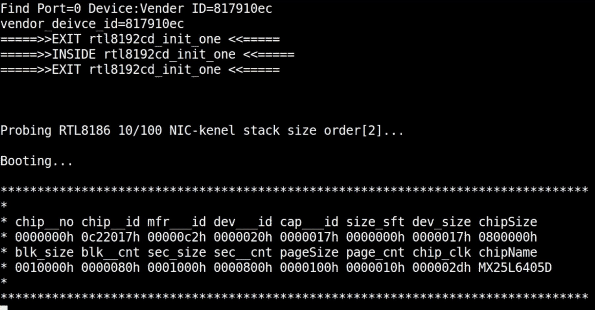

10.  接下来，点击*Ctrl*+*C*，这将使用识别的设置将您带到 minicom 实用程序。点击此处的*输入*将授予您 shell 访问权限，因为您的目标设备具有基于 UART 的 shell：


因此，我们能够利用公开的 UART 接口，找出引脚和接口，最后得到一个根外壳。

# 另见

*   现在，您可以访问目标设备的 UART 接口，还可以执行其他利用技术，例如通过**普通文件传输协议**（**TFTP**）后门和转储整个文件系统。但是，这将因设备而异，并取决于您对已泄露设备的当前权限。

# NAND 毛刺

为了绕过安全措施（例如 UART 控制台上没有根 shell），可以在嵌入式设备上执行的另一项操作是利用基于故障的攻击。

# 准备

顾名思义，故障是在您正在使用的系统中引入故障的一种方式。这可以通过多种不同的方式实现，并且有单独的书籍和研究论文专门针对这一主题编写。

现在，我们将看到一个非常基本的基于故障的攻击概述。这样做的目的是能够访问引导加载程序，这将允许我们更改敏感参数，如 boot up args，我们可以在其中定义自己的参数，告诉系统使用登录提示符/shell 启动 UART 控制台，或者绕过身份验证以单用户模式引导系统。

# 怎么做。。。

1.  我们将在这里看到的故障称为**NAND 故障**，我们将把设备 NAND 闪存的一个 I/O 引脚短接到 GND 引脚。请注意，此短路必须在引导加载程序已引导且内核即将引导时执行。

因此，如果短路有效，内核将无法引导，从而导致您下降到默认引导加载程序提示符，使您能够更改引导加载程序参数。

2.  为了举例说明如何使用引导加载程序访问，将`single`添加到引导参数将使您能够登录到单用户模式，从而绕过某些系统上的身份验证要求。这也显示在以下屏幕截图中：

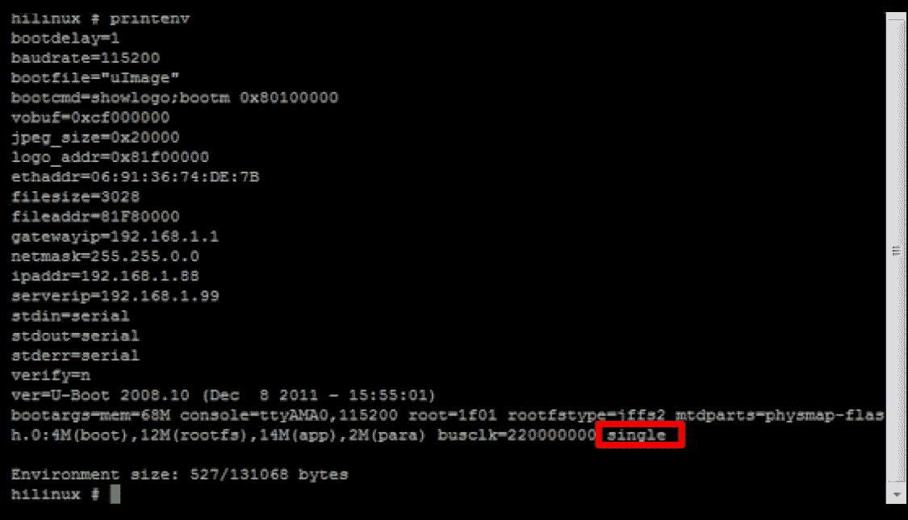

图像来源：http://console-cowboys.blogspot.com/2013/01/swann-song-dvr-insecurity.html

3.  类似地，在 Wink Hub 上执行相同的 NAND 故障将导致跳转到引导加载程序（由团队在`Exploitee.rs`处发现），在那里您可以更改参数，如以下屏幕截图所示：

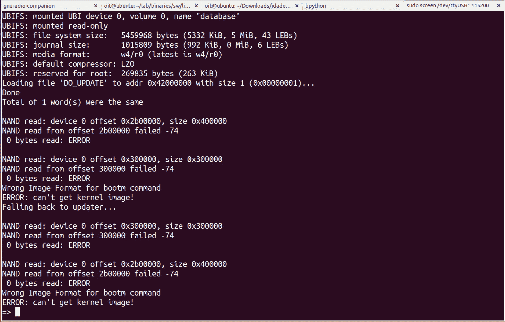

4.  修改引导参数后，您将能够在下次引导时通过 UART 访问根 shell，如以下屏幕截图所示：


图像来源：http://www.brettlischalk.cimg/WinkHack/WinkRootShell.png

# 另见

NAND 故障是我们利用基于故障的攻击的技术之一。但是，您也可以使用电源和电压闪烁技术来执行诸如绕过加密等操作。

以下是一些额外的有用资源：

*   [https://www2.cs.arizona.edu/~collberg/Teaching/466-566/2012/Resources/presentations/2012/topic1 final/report.pdf](https://www2.cs.arizona.edu/~collberg/Teaching/466-566/2012/Resources/presentations/2012/topic1-final/report.pdf)
*   [https://www.cl.cam.ac.uk/~sps32/ECRYPT2011_1.pdf](https://www.cl.cam.ac.uk/~sps32/ECRYPT2011_1.pdf)
*   [https://www.blackhat.com/docs/eu-15/materials/eu-15-Giller-Implementing-Electrical-Glitching-Attacks.pdf](https://www.blackhat.com/docs/eu-15/materials/eu-15-Giller-Implementing-Electrical-Glitching-Attacks.pdf)

# JTAG 调试与利用

现在我们已经介绍了硬件设备上的各种利用技术，现在是时候介绍危害设备 JTAG 的最重要方法之一了。我们已经看到了什么是 JTAG，以及 JTAG 引脚通常是什么样子。

# 准备

让我们开始识别给定目标设备上的 JTAG 引脚。为此，我们将使用 JTAGulator，这是一个由*乔·格兰德*构建的硬件工具，用于识别 JTAG 引脚。

# 怎么做。。。

将所有 JTAGulator 通道连接到目标设备上的预期 JTAG 引脚后，再将 GND 连接到 GND。

1.  使用以下代码启动屏幕：

```
sudo screen /dev/ttyUSB0 115200 
```

2.  然后，您将获得 JTAGulator 提示，如以下屏幕截图所示：

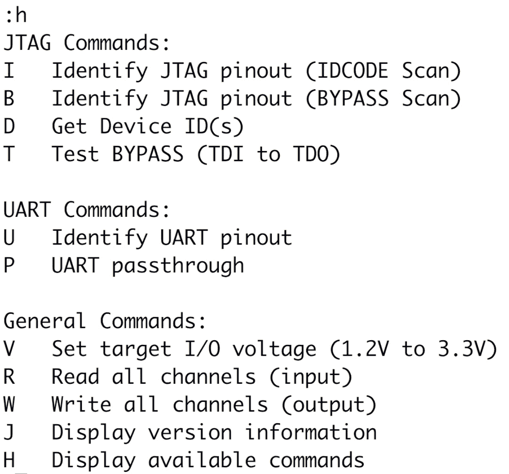

3.  我们在这里要做的第一件事是设置目标设备的电压，在当前场景中是 3.3。要执行此操作，只需键入`V`，然后键入`3.3`，如以下屏幕截图所示：


4.  一旦我们设置了目标电压，我们就可以通过点击*B*来运行旁路扫描，以确定当前连接中的 JTAG 引脚。


如您所见，JTAGulator 能够识别 JTAG 引脚，并告诉我们各个引脚对应的是什么。

5.  现在我们已经确定了引脚，下一步是将引脚连接到 Attify Badge（或 FTDI C232HM MPSSE 电缆），如下所示：
    1.  目标的 TDI 连接到 Attify 徽章的 D1（TDI）（或 FTDI 电缆的黄色）
    2.  目标的时差到达 Attify 徽章的 D2（时差）（或 FTDI 电缆的绿色）
    3.  目标的 TMS 连接到 Attify 徽章的 D3（TMS）（或 FTDI 电缆的棕色）
    4.  目标的 TCK 连接到 Attify 徽章的 D0（TCK）（或 FTDI 电缆的橙色）
6.  完成所需连接后，下一步是使用 Attify Badge（或 FTDI C232HM MPSSE 电缆）的配置文件和目标设备的芯片运行 OpenOCD。安装后可从`OpenOCD`目录获取配置文件，位于`openocd/tcl/target`。
7.  OpenOCD 可以运行，如以下屏幕截图所示：


8.  如您所见，OpenOCD 已经识别了链中的两个设备，并且还启用了端口`4444`上的 Telnet，我们现在可以连接到该端口，如以下屏幕截图所示：


在这一步中，您可以执行所有各种 OpenOCD 命令，以及特定于给定芯片的命令，以破坏设备。

# 另见

通过 JTAG 访问设备的一些功能是使用`mdw`命令从给定的内存位置读取数据，如下所示：

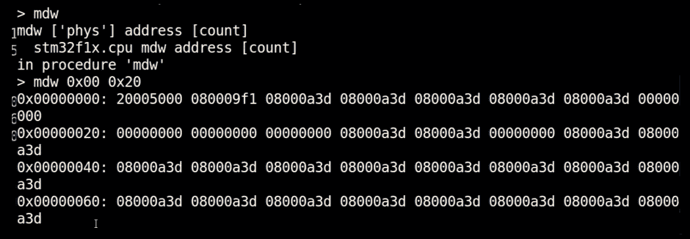

另一个例子是连接到 GDB 以调试正在运行的进程，方法是通过端口`3333`连接到正在运行的实例，并使用我们在前面章节中学习的技能执行 ARM/MIPS 利用。