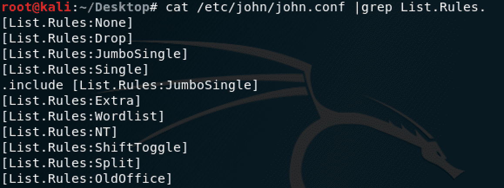
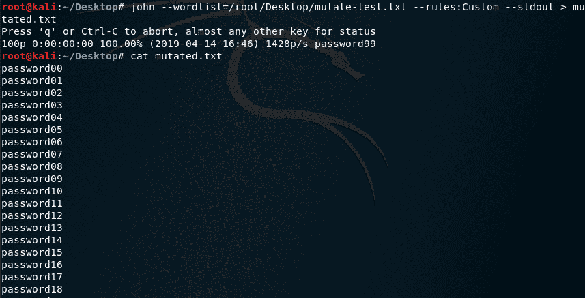
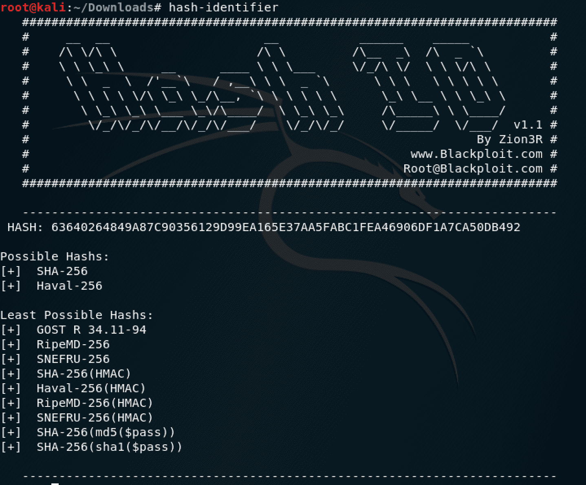
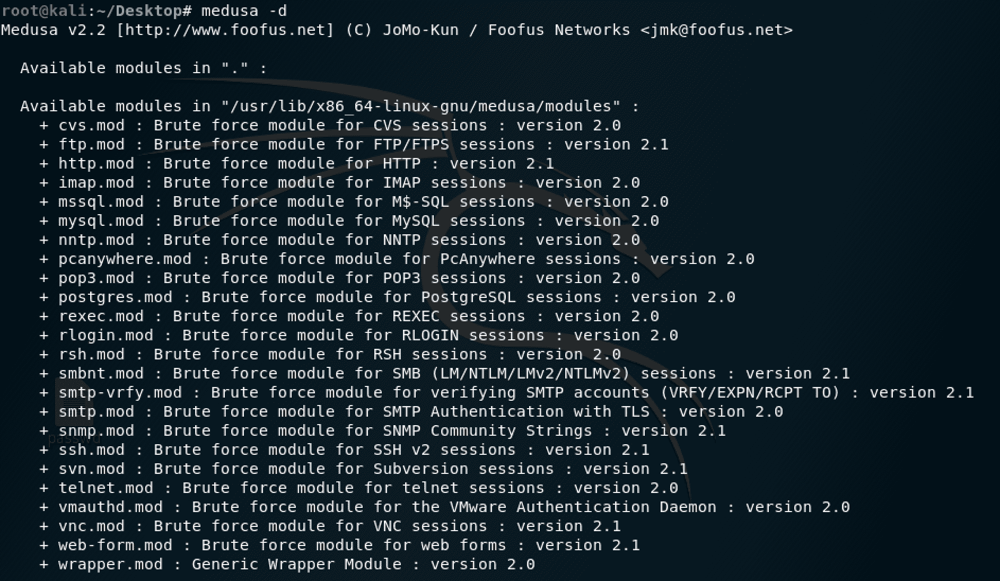
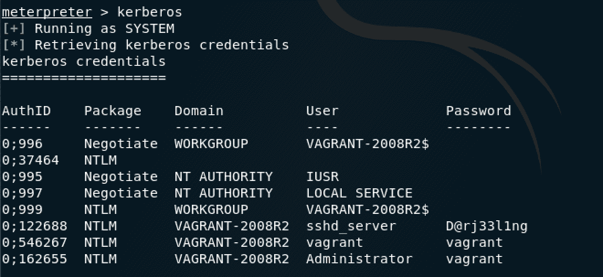
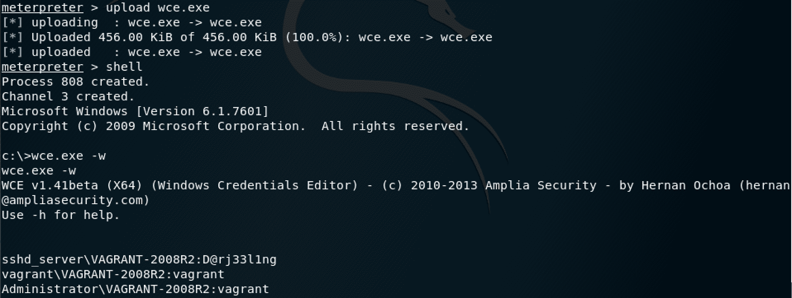

# 六、理解密码攻击

在密码分析中，密码破解可以定义为使用其哈希对应项恢复明文密码短语的过程。密码是我们日常生活的一部分；我们几乎在我们做的每件事中都使用它们。由于系统的安全性是通过研究各种密码加密方法发展起来的，因此可以破解密码的工具也是如此。

在本章中，您将了解密码是如何成为我们日常生活的一部分的。您将获得查找、构建和自定义单词列表的技能。您将学习如何利用单词列表，并在 Kali Linux 中的各种密码破解工具中使用它们。您将了解各种工具，以及在渗透测试中何时以及如何使用这些工具。

随着本章的学习，您将学习以下内容：

*   密码攻击简介
*   使用单词表
*   脱机密码破解
*   在线密码破解
*   从内存中转储密码

# 技术要求

本章要求以下技术要求：

*   Kali Linux 2019.1
*   Metasploitable 2 和 3 虚拟机

# 密码攻击简介

密码不是什么新鲜事。它们已经存在了几个世纪。例如，罗马军队使用密码来区分朋友和敌人。在 20 世纪 60 年代早期，密码的概念被人们用来访问计算机系统和共享数据。其目的是帮助对其他个人保密个人档案。从那时起，它成为个人和公司使用的计算机安全的事实标准。在一开始，保护密码并不是什么大问题。随着时间的推移，由于互联网的繁荣，随着人们开始在互联网上获取敏感信息，安全问题变得越来越令人担忧。

散列和盐析后来被引入来帮助密码的安全性。散列执行密码的单向转换，本质上是将密码转换为字符串。Salting 是添加到密码中的数据的唯一值，它会生成不同的散列。将简单散列的密码与用盐散列的密码进行比较将导致两种完全不同的散列

如今，用户名和密码是人们每天使用的组合。计算机系统、移动设备、游戏机、平板电脑等设备都受密码保护。作为计算机用户，您可能有多种用途的密码，例如登录系统、访问电子邮件、数据库、网络、网站、应用和升级服务。

在渗透测试过程中，您经常会遇到密码作为最小的障碍。具有高度安全成熟度的企业仍将拥有最薄弱环节的用户。正如我们在[第 4 章](04.html)*【掌握社会工程*中所了解的，用户可以通过社会工程进行开发。用户也是可预测的，大多数用户会使用易于预测的密码

密码带来了一个不可分割的问题。较短的密码更容易记住，也更容易猜测。更长的密码更难破解，但也更难记住。在混合中增加复杂性，问题仍然存在。如果密码要求过于复杂，用户最终会忘记密码，或者更糟糕的是，将密码写下来。这会带来诸如大量密码重置之类的问题，您可以通过社会工程加以利用。在穿过大楼时，写下密码很容易被注意到。现在，让我们考虑一下这样一个事实，即用户拥有多种在线服务的密码，如亚马逊、Spotify、iTunes、Facebook 和 Instagram，而且列表还在继续。跟踪这么多密码是很困难的，这导致许多人多次使用同一密码。如果攻击者能够获得一个密码，这将带来一个主要问题；一切都可以访问。

让我们来看看如何利用各种方法破解密码，在某些情况下，甚至不需要破解密码来使用服务。

# 使用单词表

为了破解密码，您需要有一个可以尝试的凭据列表。您可以使用用户列表（仅包含用户名）、密码列表（仅包含密码）或两者结合的列表。

**用户名列表**是包含用户名的列表。它可以通过对你的目标进行侦察来建立，或者在某些情况下，它可以提供给你进行渗透测试。如果你需要建立自己的 To.T4 用户列表，就有一些问题需要考虑。目标是否使用`firstname.lastname`**作为用户名？也许目标的用户名与他们的电子邮件地址相同？查找用户名的一个好方法是查看在互联网上公开发布的文件的元数据。您可以使用一个简单的 Google 查询来查找特定的文件类型，使用`filetype:`搜索字符串。**

 **在[第三章](03.html)*执行信息收集*中，我们了解了如何使用谷歌**dorks**进行信息收集。

在 Kali Linux 中，使用 Firefox ESR，并使用搜索字符串`filetype:xls`，我能够找到一些文档，这些文档的详细信息可以为我提供关于用户名结构*（*的线索，如下面的屏幕截图*。*您可以使用 ExifTool**等工具执行相同的分析**ExifTool 是一种跨平台工具，支持多种文件格式。它是轻量级的，您可以从文件中获取大量信息。

要在 Kali Linux 中安装 ExifTool，需要从终端窗口运行以下命令：

```
apt install libimage-exiftool-perl
```

安装后，您可以使用`exiftool [options] file`命令查询文件。要查看选项的完整列表，您可以使用`man exiftool`命令，该命令将显示终端内的文档，如以下屏幕截图所示：


图 1：使用 exiftool 提取元数据

在前面的屏幕截图中，我们可以确定该特定公司的用户名结构为`name.surname`。我们可以使用 LinkedIn 进行进一步调查，以获取在该公司工作的员工名单，并从中生成用户名列表。

**密码****列表**包含密码。您可以下载这些，甚至构建自己的。Kali Linux 包含一些密码列表，尽管它们不像您在 internet 上看到的那样全面。

内置的单词列表位于`/usr/share/wordlists`并包含著名的`rockyou.txt`密码列表，如以下截图所示：


图 2:Kali Linux 内置单词列表

Kali Linux 中的一些工具有自己的单词列表；例如，工具**裂土器约翰**的密码列表位于`/usr/share/John/password.lst`

Metasploit 框架在`/usr/share/metasploit-framework/data/wordlists`中有许多单词列表。

有许多在线资源可用于获取密码列表。有些网站拥有不经常更新的旧密码列表。保持更新的站点位于 WeakPass（[等站点）https://weakpass.com](https://weakpass.com) 和 Seclists（[https://github.com/danielmiessler/SecLists/tree/master/Passwords](https://github.com/danielmiessler/SecLists/tree/master/Passwords) ）。可以使用`apt install seclists`命令在 Kali Linux 内部安装 seclist。这将把当前版本的密码列表下载到`/usr/share/seclists`路径中，如以下屏幕截图所示：


图 3:SecList 中的密码列表列表

一些站点，如 CrackStation（[https://crackstation.net/crackstation-wordlist-password-cracking-dictionary.htm](https://crackstation.net/crackstation-wordlist-password-cracking-dictionary.htm) ），托管一个相当大的数据库，并提供一个在线哈希破解程序。

# 密码分析

在计划渗透测试时，必须有一个专门适用于目标的自定义密码列表。拥有一个分析过的密码列表有助于渗透测试的成功，因为您消除了使用公共单词列表（通常非常广泛）所花费的时间

自定义密码列表并使其更特定于目标的一种方法是使用密码分析技术。密码分析包括从目标组织中提取单词或短语，并将其包含在单词列表中，以提高找到有效密码的机会。

在[第 3 章](03.html)*执行信息收集*中，我们在 Metasploitable 2 和 3 虚拟机上执行了 Nmap 扫描。一些开放服务是 SSH（端口`22`和 FTP（端口`21`）。在前面的[第 5 章](05.html)中*深入到 Metasploit 框架*中，我们探讨了针对这些易受攻击虚拟机的一些攻击。现在，我们将执行一些利用密码文件的攻击，但不是使用来自 internet 的密码文件（其中将包含数千个密码），我们将构建一个已分析的密码文件。

Kali Linux 附带了一个名为**CeWL**的工具。CeWL 将给定 URL 爬行到您可以指定的深度，并返回可使用的单词列表。CeWL 是可定制的，允许您指定单词的最小和最大长度，从文件的元数据中提取单词，等等。

要构建与 Metasploitable 虚拟机相关的单词列表，我们可以使用位于[的 wiki 页面 https://github.com/rapid7/metasploitable3/wiki.](https://github.com/rapid7/metasploitable3/wiki)

使用以下命令，我们将生成用于密码暴力的单词列表。在命令中，我们定义了最小字数*（*`-m 7`*）、*蜘蛛深度（`-d 1`），然后指示 CeWL 将输出写入桌面上名为`metasploitable-dict.txt`（`-w`的文件，如下所示：

```
cewl https://github.com/rapid7/metasploitable3/wiki -m 7 -d 1 –w /root/Desktop/metasploitable-dict.txt 
```

命令完成后，我们有一个当前包含 2443 个单词的单词列表，如以下屏幕截图所示：


图 4:CeWL 生成的单词列表

要对文本文件执行字数统计，可以使用命令`wc -w`【文件】。

现在，我们可以使用刚刚创建的单词列表执行测试。我们将针对 Metasploitable 3 虚拟机运行单词列表，以检查是否可以使用**服务器消息块**（**SMB**协议）访问它。可使用辅助模块`auxiliary/scanner/smb/smb_login`执行以下步骤进行检查：

1.  在终端窗口中，使用`msfconsole`命令打开 Metasploit 框架。确保在运行`msfconsole`命令之前已启动 PostgreSQL 服务。
2.  使用`use auxiliary/scanner/smb/smb_login`命令加载辅助扫描仪。
3.  接下来，我们将定义以下选项：
    *   `SET RHOSTS [IP]`：在这里，您将定义 Metasploitable 3 虚拟机的 IP 地址。这可以通过使用`netdiscover -r [subnet]`或登录虚拟机并使用命令提示符窗口中的`ipconfig`命令检查其 IP 地址来获取
    *   `SET USER_FILE [path]`和`SET PASS_FILE [path]`：在这里，我们定义单词列表。使用**CeWL**生成的词表，我们定义的路径是`/root/Desktop/metasploitable-dict.txt`。
    *   `SET STOP_ON_SUCCESS true`：这告诉扫描器在找到成功凭证后停止扫描。
    *   `SET VERBOSE false`：这会阻止扫描仪在屏幕上显示输出。它将只显示成功的输出。
4.  定义选项后，我们使用`run`命令运行扫描仪。一旦找到成功的凭证，输出将按照以下屏幕截图显示：


图 5:Metasploit 框架 SMB 登录扫描程序的输出

Metasploit 将发现的凭据存储在其数据库中。可以使用`creds`命令访问凭据。

要记住的一个关键点是，你的词表越大，花的时间就越多。通过使用配置文件的单词列表，您可以减少查找有效登录名所花费的时间。

# 密码变异

用户经常会以各种方式修改密码。一些类型的突变包括在密码末尾添加数字、替换字符，例如使用 3 表示“e”、使用大写字母等等。

使用开膛手约翰，我们可以在密码列表上执行变异。John the Ripper 附带了一个广泛的配置文件，其中包含许多预定义的密码变异规则。此配置文件可在`/etc/John/john.conf`**找到。**

配置文件中有定义为`[List.Rules:<name>]`的规则集，例如`[List.Rules:Wordlist]`或`[List.Rules:hashcat]`，列表如下。您可以使用一个简单的连接查询来查看当前的各种规则：`cat /etc/john/john.conf |grep List.Rules`，如下图所示：



图 6:John the Ripper 中当前规则集的片段

让我们进行一些突变。为了便于说明，我将创建一个名为`mutate-test.txt`的新文件，并将一个单词放入`password`中，然后将其存储在桌面上。*您可以使用 leafpad、nano 或您最喜欢的文本编辑器来完成此操作。*

 *创建文件后，我们可以执行一些突变并观察输出。在编辑`John.conf`文件时，我添加了一个名为`List.Rules:Custom`的自定义规则集，如下图所示：


图 7：自定义规则变异

在这个自定义规则中，我告诉裂土器 John 在每个密码的末尾添加两个额外的数字。以下是可以在规则集中使用的常用命令列表：

*   `$`：在单词后面加上字符或数字。在前面的自定义规则中，您会注意到我定义了一组数字，由**`0`**-**`9`**表示。这将在单词后面添加`0`、`1`、`2`、`3`、`4`、`5`、`6`、`7`、`8`和`9`。您还可以附加单个字符；例如，使用命令`$9`只会在单词后面加一个`9`。****
*****   `^`：在单词前加上字符或数字。在这里，您可以按照前面的`$`命令定义范围。*   `l`：将所有字符转换为小写，`c`**将其转换为大写*****   `t`：**切换单词中所有字符的大小写。********

 ******让我们使用下面的命令来查看这个规则的输出：

```
john --wordlist=/root/Desktop/mutate-test.txt --rules:Custom --stdout > mutated.txt
```

我们有一个名为`mutated.txt`的新文件，它将对`mutation-test.txt`*中定义的单词进行变异。`stdout`命令用于输出候选密码。请注意，`mutated.txt`文件的内容在主单词的末尾包含两个附加字符，如下所示：*

 *

图 8：变异密码列表

当您处理密码突变时，您会发现一些规则比其他规则更有效。关键是找到适合你的目标的方法，并且知道你有开膛手约翰的灵活性来执行密码突变。

# 脱机密码攻击

脱机密码攻击是一种破解密码而不被发现的方法。由于不存在对主动服务的暴力强迫，因此被发现的风险要小得多。其目的是获取密码的哈希版本，并将其还原为纯文本。不同的哈希算法输出不同比特长度的不同哈希。由于散列由十六进制数组成，每个十六进制数为四位，因此确定散列位长度需要计算十六进制数并乘以四。

例如，`63640264849A87C90356129D99EA165E37AA5FABC1FEA46906DF1A7CA50DB492`的散列包含 64 个字符。**64 x 4=256**。这告诉我们散列的位长度是`256`位。在本例中，最常见的输出`256`位哈希的哈希算法是`SHA-256`。如果你有一个`128`位的散列呢？在这里，我们使用了一些算法，例如`MD2`、`MD4`、`MD5`和`RipeMD-128`。这是你的直觉发挥作用时，确定你有什么散列。例如，如果您从 MySQL 数据库提取了一个散列，那么该散列很可能是一个`MD5`散列

幸运的是，有一些工具可以帮助您识别散列，从而使您花费在执行手动计算上的时间大大减少。然而，知道如何计算散列位长度和训练你的感知能力绝不是浪费。

在当前版本的 Kali Linux（2019.1）中，有一个名为**散列标识符**的工具，它将尝试识别散列。此工具可以使用`hash-identifier`命令从终端窗口运行。让我们尝试识别前面讨论的`SHA-256`散列。请注意以下屏幕截图中的输出：



图 9：使用哈希标识符识别哈希

使用`hash-identifier`使识别哈希变得简单，因为识别的哈希非常具体。

# 开膛手约翰

开膛手约翰功能丰富，速度快。它在一个程序中利用了多种破解模式，并且是完全可配置的（正如我们在密码突变中看到的）。John the Ripper 可在多个平台上使用，这使得在多个系统上使用同一个裂土器变得容易。它默认包含在 Kali Linux 中。

开膛手约翰的一些特点如下：

*   可以自动检测哈希类型
*   跨平台支撑
*   支持多种哈希算法

裂土器 John 的语法如下所示：

```
john [options] [password file]
```

既然我们已经确定了散列算法，那么让我们通过以下步骤尝试使用 John the Ripper 破解此散列：

*   **步骤 1**：使用文本编辑器将哈希添加到文本文件中。我已将文件命名为`sha256hash.txt`。
*   **步骤 2**：在终端窗口内，运行以下命令：

```
john --format=raw-sha256 [filename] --wordlist=[wordlist path]. 
```

在我的示例中，我使用了`rockyou.txt wordlist`。因此，我的环境中的完整命令如下所示：

```
john --format=raw-sha256 sha256hash.txt --wordlist=/usr/share/wordlists/rockyou.txt
```

请注意以下屏幕截图中的输出：


图 10：使用开膛手 John 破解 SHA-256 哈希

裂土器约翰将所有破解的密码存储在`john.pot`文件中，该文件位于您安装裂土器约翰的位置。默认情况下，在 Kali Linux 2019.1 中，它位于`/root/.John/john.pot`，如下图所示：


图 11:john.pot 文件中存储的破解密码。

让我们尝试破解我们从[第 5 章](05.html)*中丢弃的散列，使用开膛手 John 潜入 Metasploit 框架*。在终端窗口中，使用以下命令：

```
john --wordlist=/usr/share/wordlists/rockyou.txt --format=NT [filename] --rules=wordlist --pot=[filename].pot 
```

在这个命令中，我们定义要使用的单词列表（`rockyou.txt`），要使用的规则集（`wordlist`），以及存储破解哈希的位置（`meta3.pot`：


图 12：使用裂土器 John 破解从 Metasploi 表 3 获得的哈希

破解密码散列有时会非常耗时，而且在渗透测试期间，当您被要求花费时间时，破解密码散列是不可行的。使用转储密码散列的另一种方法是使用用户名和 NTLM/LM 散列的有效组合对远程系统重新进行身份验证。这种技术被称为**传递散列**（**PTH**），自 1997 年以来一直存在。

尽管我们只能破解三个密码，但我们仍然破解了一个特权帐户，即**管理员**帐户。如果我必须在开膛手约翰（John the Ripper）中使用更复杂的单词列表和更复杂的规则，它可能已经破解了所有的哈希。请记住，随着复杂性的增加，破解密码的时间也会延长。

为了破解 Linux 系统上的帐户，您需要以下两个文件：

*   `/etc/passwd`：包含用户信息
*   `/etc/shadow`：包含用户对应的密码哈希

在破解密码之前，这两个文件需要合并。这可以通过使用`unshadow`命令来完成，如以下屏幕截图所示：


图 13：使用 unshadow 命令组合 passwd 和 shadow 文件

现在，我们可以使用以下命令将此组合文件与裂土器 John 一起使用：

```
john --wordlist=/usr/share/wordlists/rockyou.txt [filename] --pot=[potname] 
```

John 将开始破解 Linux 哈希的密码（如下面的屏幕截图所示）。注意，在这个场景中，我们没有定义格式；裂土器 John 能够识别`hash type`并应用正确的开裂算法，如以下屏幕截图所示：


图 14：使用裂土器 John 破解从 Metasploi 表 2 中获得的哈希

尽管在前面的屏幕截图中`root`密码没有被破解，但利用开膛手约翰（John the Ripper）内部更复杂的单词列表和规则很可能会破解密码。

# 哈什卡特

Hashcat 是另一个离线密码破解工具，据称是世界上最快、最先进的密码恢复工具。它默认安装在 Kali Linux 中，并将 CPU 和 GPU 版本组合在一个程序中。

该程序支持多种散列算法，具有独特的密码破解模式。Hashcat 支持多种平台，如 Windows、macOS 和 Linux。

Hashcat 的一些特性如下：

*   它支持多线程
*   多哈希支持（同时破解多个哈希）
*   多设备支持（在同一系统中使用多个设备）
*   多设备类型（在同一系统中使用混合设备类型）
*   它基于多种算法（MD4、MD5、SHA1、DCC、NTLM、MySQL 等）
*   它使用专门的规则来扩展攻击模式

运行 Hashcat 的语法如下所示：

```
hashcat [options]... hash|hashfile|hccapxfile [dictionary|mask|directory]...
```

使用的一些常见选项如下：

*   `-m`**使用哈希的编号定义哈希类型。例如，MD5 是数字 0，SHA1 是 100。**
***   `-a`定义了攻击模式。*   `-o`定义输出文件。**

 **Hashcat 中的攻击模式定义如下：

*   **字典攻击**：（也称为直接模式或攻击模式零），它会尝试给定列表中的所有单词。
*   **组合攻击：**（称为模式*1*），将多个单词列表中的单词连接起来。
*   **暴力和面具攻击：**（模式 3）尝试给定角色集中的所有角色。
*   **混合攻击：**（模式*6*和*7*结合了词表和掩码，反之亦然。规则也可用于此攻击模式。

Hashcat 支持多种哈希算法；当从终端窗口使用`hashcat -h`命令时，可以在`[Hash modes]`部分看到这些，如下面的屏幕截图所示。下面的屏幕截图只是所支持的哈希算法的一个片段。在自己的实验室中运行该命令时，您将看到完整的列表：


图 15:Hashcat 支持的算法

如果你有一个 GPU，你真的可以利用 Hashcat 破解密码的能力。不幸的是，GPU 破解不在本书的范围之内。

# 在线密码攻击

就像使用自动漏洞扫描程序一样，我们可以利用工具自动尝试登录到服务并查找有效凭据。这些工具旨在自动执行在线密码攻击，直到服务器以有效登录作出响应。在线密码攻击可以定义为试图通过强制使用凭据登录到实时服务，直到发现有效的组合。

在线密码攻击的问题在于它们会发出噪音，并触发警报。让我们看看一些常用的在线密码攻击工具。

# 九头蛇

Hydra 是一个非常快速和灵活的登录破解程序。它支持易于添加的模块。它为许多协议和服务提供强大的身份验证强制。

Hydra 的语法如下所示：

```
hydra [username options] [password options] [options] [IP address] [protocol] -V -f
```

以下是一些可用的选项：

*   `-l`表示单个用户名。
*   `-L`定义一个用户名列表。
*   `-p`定义一个密码。
*   `-P`定义了一个密码列表。
*   `-t`用于限制并发连接。
*   `-V`通知 Hydra 显示详细输出。
*   `-f`用于在正确登录时停止。
*   `-s`用于定义一个端口。
*   `-x`利用蛮力模式。例如，`-x 5:8:A1`生成长度为 5 到 8 个字符、大写字母和数字的密码。

Hydra 支持多种服务，其中包括`ssh`、`smb`、`smtp[s]`、LDAP、http/s、Telnet 和 MySQL。

让我们利用 Hydra 攻击 Metasploitable 2 虚拟机上的服务。

在[第 3 章](03.html)*中，执行信息收集*时，我们对 Metasploitable 2 虚拟机执行了 Nmap 扫描。我们发现的服务之一是`ftp`端口`21`。使用前面生成的密码列表，我们可以将其与 Hydra 一起使用来执行在线密码攻击。

在 Kali Linux 的终端窗口中，我们使用以下命令：

```
hydra -L [username file] -P [password file] [IP address] [service] -f
```

在这个命令中，我们定义了一个`username`和`password`列表。在我的示例中，您会注意到我对这两个文件都使用了相同的文件。如果你有一个专用的`username file`，你可以利用它。我们的目标服务是`ftp`，我们希望 Hydra 在找到有效登录后停止，因此我们使用`-f`选项，如下图所示：


图 16：使用 Hydra 强制登录 Metasploi 表 2 的 FTP 服务

Hydra 能够恢复已取消的扫描。在下面的屏幕截图中，您会注意到我使用了一个更大的密码列表，并故意使用*Ctrl*+*C*键序列取消了扫描。注意 Hydra 写的以下消息。Hydra 创建了一个可用于恢复会话的`hydra.restore`文件：


图 17：Hydra 恢复功能

请务必记住，大多数服务都配置为在一定次数的登录尝试失败后锁定帐户。这是引起目标公司 IT 员工注意的一种方式。当登录尝试快速连续时，入侵防护设备也可以发挥作用。关键是要降低尝试输入服务密码的次数。然而，这将花费你的时间

Hydra 是渗透测试工具包中应有的工具。它能够遍历大量的用户名、密码和目标列表。可以使用各种标志对其进行调整，以适应渗透测试期间可能遇到的情况。

# 美杜莎

美杜莎据称是一款快速、并行、模块化的强力登录工具。它支持许多允许远程身份验证的服务。

以下是美杜莎的一些主要特征：

*   **并行测试**：提供同时测试多台主机、多个用户或多个密码的能力。
*   **可变用户输入**：提供多种方式指定目标信息的能力。例如，可以使用包含主机列表的文件，也可以在命令中定义单个主机
*   **模块化设计**：模块作为独立文件存在（`.mod`。如果需要对模块进行任何更改，则无需修改核心应用
*   **支持多种协议**：与 Hydra 类似，美杜莎支持多种应用，包括`smtp`、`http`、`pop3`和`sshv2`。

以下是美杜莎提供的一些选项：

*   `-h`定义 IP 地址的目标主机名。
*   `-H`指定包含多个目标的文件。
*   `-U`指定包含用户名的文件。
*   `-P`指定包含密码的文件。
*   `-g [num]`定义美杜莎放弃连接的秒数。
*   `-r [num]`定义重试尝试之间的秒数。
*   `-M`指定将要使用的模块的名称。请注意，这没有`.mod`扩展名。
*   `-m`定义要传递给模块的参数。
*   `-Z`定义要恢复的上一次扫描。

美杜莎支持许多模块。使用终端窗口中的`medusa -d`命令可以查看当前支持的模块列表，如以下屏幕截图所示：



图 18:Medusa 支持的模块列表

美杜莎的语法如下：

```
medusa [-h host|-H file] [-u username|-U file] [-p password|-P file] [-C file] -M module [OPT]
```

让我们使用美杜莎执行 FTP 攻击，就像我们对 Hydra 所做的那样。使用的命令如下所示：

```
medusa -U [username file] -P [password file] -h [host IP address] -M [module] [options]
```

这里，我对`username`和`passwords`使用相同的文本文件。正在使用的模块是`ftp`，我希望美杜莎在第一场比赛中使用`-f`选项停止，如以下屏幕截图所示：


图 19：使用美杜莎执行 FTP 暴力

美杜莎有能力恢复取消的扫描，如以下屏幕截图*所示。*可以使用`-Z [unique code]`命令恢复这些操作：


图 20：美杜莎恢复功能

Medusa 是渗透测试工具包中的另一个工具。与 Hydra 相比，它非常灵活，支持不同的协议集

# Ncrack

Ncrack 是一种功能强大且快速的密码破解工具，主要用于依赖身份验证的基于网络的服务。它被设计成模块化的，利用了一种命令行语法，如果您熟悉 Nmap 的语法，这种语法就不是新的了。您可以将使用 Nmap 执行的扫描集成到 Ncrack 中。Ncrack 支持的协议包括`ssh`、`rdp`、`ftp`、`telnet`、`http/s`、`smb`等。

Ncrack 随 Kali Linux 提供，因此无需安装，因为它可以开箱即用。Ncrack 的语法如下所示：

```
ncrack [Options] [target:service specification/port number]
```

以下是 Ncrack 中可用的一些选项：

*   `-cl`定义并发并行连接的最小数量。
*   `-CL`定义并发并行连接的最大数量。
*   `-at`定义每个连接的身份验证尝试次数。这是避免账户锁定的好方法。
*   `-U`指定一个用户名文件。
*   `-P`指定密码文件。
*   `-iX`定义要从 Nmap XML 输出文件输入的文件（Nmap 中的`-oX`开关）。
*   `-iN`定义要从 Nmap 正常输出文件输入的文件（Nmap 中的`-oN`开关）。
*   -`iL`定义主机或网络的列表。

要显示 Ncrack 支持的当前模块列表，您可以运行`ncrack -V`命令，如以下屏幕截图所示：


图 21:Ncrack 支持的模块

由于 Ncrack 能够执行暴力攻击，因此让我们对 Metasploitable 3 虚拟机执行此攻击。使用以下命令：

```
ncrack -U [username file] -P [password file] IP:service -f -vv
```

在这个命令中，我对用户名和密码使用相同的文件。我正在使用`-f`选项停止匹配，并使用`-vv`增加详细输出，如以下屏幕截图所示：


图 22：对 Metasploi 的 RDP 服务使用 Ncrack 表 3

使用 Ncrack 执行 RDP 暴力登录时，Metasploitable 3 虚拟机会话被锁定。在执行渗透测试时，请记住这一点。如果活动用户或管理员正在使用系统，并且他们的会话被锁定，则肯定会发出警报。

Ncrack 允许您在终止扫描时通过保存还原文件来恢复当前会话，如以下屏幕截图*所示。*可以使用`ncrack --resume [filename]`命令恢复此扫描：


图 23：恢复 Ncrack 会话

您在渗透测试中试图强行使用的协议将决定您将使用的工具。在某些情况下，您可以选择多个工具，您的选择可能归结为工具本身的速度。加速 bruce force 攻击的一个常见选项是增加登录线程的数量。在某些情况下，例如 RDP 和 SMB，由于与协议相关的限制，这可能是不可能的。

另一个需要考虑的因素是协议认证协商。例如，协议（如 RDP）的身份验证协商比 HTTP 更耗时。但是，如果您成功地强行使用 RDP 协议，您的回报通常会大得多，因为这可能会导致额外的哈希，可能具有更高的权限。使用在线工具进行暴力强迫背后的艺术在于，在发起攻击之前，凭直觉仔细选择目标、用户列表和密码文件。

# 从内存中转储密码

破解密码确实很有趣，但从受损主机的内存中转储密码要快得多。这将使您能够快速访问凭据，从而可以提升权限或在环境中横向移动。一些系统可能配置了`wdigest`身份验证，这将为您提供明文密码，而另一些系统可能更安全，您可以利用这一点通过散列攻击。

让我们来看看从内存中倾倒密码的可能性。我们将使用上一章中学习的内容（[第 5 章](05.html)*，深入 Metasploit 框架）*，并使用`eternalblue`漏洞对 Metasploitable 3 虚拟机执行漏洞攻击。对于有效载荷，我们将利用`meterpreter`外壳，如以下屏幕截图所示：


图 24:TernalBlue 漏洞中使用的选项

一旦建立了`meterpreter`会话，我们就可以利用 Metasploit 框架的内置工具，或者使用**Mimikatz**或**Windows 凭证编辑器**等工具。从`meterpreter`会话中使用 Mimikatz 不会将任何内容加载到远程系统（任何内容都不会触及磁盘）。这种方法的优点在于它更难检测，因为磁盘上没有写入任何内容。使用诸如**Windows 凭据编辑器**（**WCE**等工具需要我们将该工具上载到远程系统，然后从内存转储凭据。因为这涉及到写入远程系统磁盘，所以检测的机会更大。

内置于 Metasploit 中，我们能够使用`meterpreter`会话中的`msv`命令从内存中获取哈希值。在下面的屏幕截图中，您会注意到我们为当前用户从内存中转储了`LM`和`NTLM`散列：


图 25：使用 Metasploit 转储 MSV 哈希

我们的下一个选择是从内存中转储 Kerberos 凭据。这可以使用`meterpreter`会话中的`kerberos`命令来完成，如下面的屏幕截图*所示。*

*请注意，我们可以获得明文凭证：*

 *

图 26：使用 Metasploit 转储 Kerberos 凭据

同样可以使用`wdigest`命令，如下面的屏幕截图*所示。*这是可能的，因为使用的认证协议是`wdigest`，不安全：


图 27：使用 Metasploit 转储 wdigest 凭据

从`meterpreter`开始，我们能够利用 Mimikatz。创建 Mimikatz 是为了演示 Microsoft 操作系统使用的身份验证协议中的漏洞。它是使用最广泛的黑客工具，拥有大量功能，并且不断更新

可以使用`meterpreter`会话中的`load mimikatz`命令加载 Mimikatz。加载后，您可以使用管道命令使用`mimikatz_command -f`来模拟。

要转储受损主机的哈希，可以使用`mimikatz_command -f samdump::hashes`命令，如下面的屏幕截图所示。*注意**新技术 LAN Manager**（**NTLM**）散列，如果您想对其进行离线密码破解，可以复制散列：*

 *

图 28：使用 Mimikatz inside MeterMeter 从 SAM 数据库转储哈希

您可以使用`mimikatz_command -f sekurlsa::searchPasswords`命令从内存中提取密码，如下图所示：


图 29：使用 Mimikatz 从内存中提取密码

使用`meterpreter`的灵活性，您可以使用`upload`文件，如 Windows 凭证编辑器。这将允许您从内存中转储密码，如下所示：



图 30：使用 Windows 凭据编辑器从内存转储凭据

能够从内存中转储密码是非常有益的，尤其是在第一次获得高权限帐户时

# 总结

密码是我们每天都在使用的东西，对如何破解密码有很好的理解有助于成功的渗透测试。记住密码安全性的权衡；密码越复杂，人们绕过它的机会就越大。密码重复使用是人们常见的缺陷，因此您可能最终发现最终用户的在线服务密码与其在公司网络中的用户帐户相同。在所有用于密码破解的工具中，都支持阻止暴力尝试。此功能使您能够将暴力攻击与日常流量相结合，并最终减少锁定。

在本章中，您了解了密码的历史。我们研究了如何从公开元数据的公共文件中发现用户名。您已经了解了可以获取密码和用户列表的联机资源。您学习了如何在密码分析中使用您的感知能力，以及如何创建配置文件密码列表。我们研究了密码变异，以及如何使分析过的密码列表更适合您的目标。我们深入探讨了离线密码攻击以及如何使用各种工具破解密码散列。在联机密码攻击部分，我们研究了如何使用各种工具对利用身份验证的网络服务执行暴力攻击。

在下一章（[第 7 章](07.html)、*使用BurpSuite*，我们将了解如何在渗透测试中使用BurpSuite。我们将使用 Burp 套件的各种模块，并对 web 服务器执行各种攻击。

# 问题

1.  公开获取用户名的一种方法是什么？
2.  密码分析的好处是什么？
3.  什么工具可以用于密码变异？
4.  在线和离线密码攻击之间有什么区别？
5.  从内存中转储凭据时，应该记住什么？**************