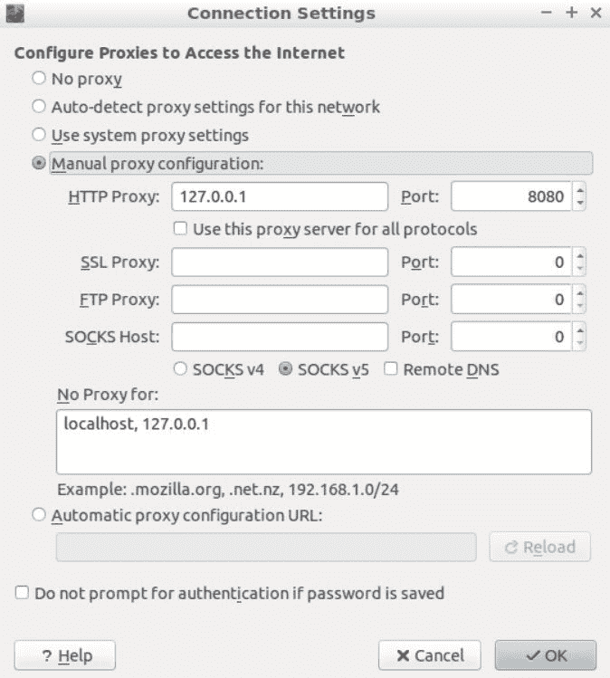
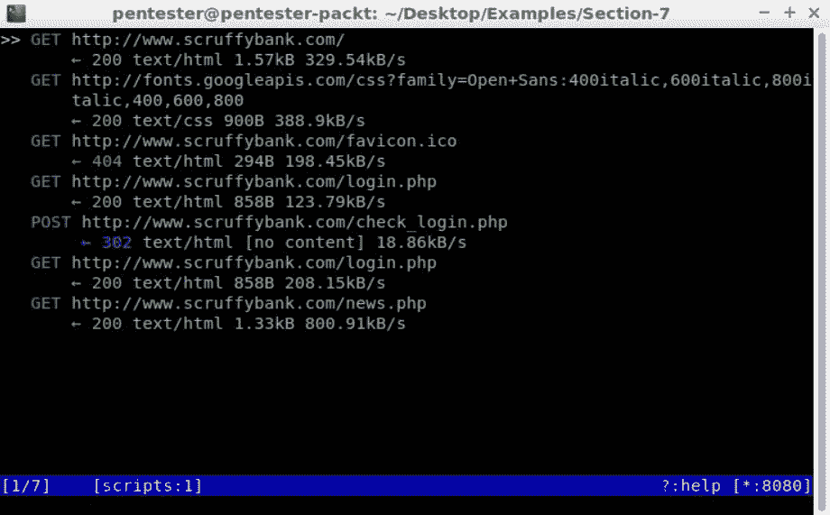
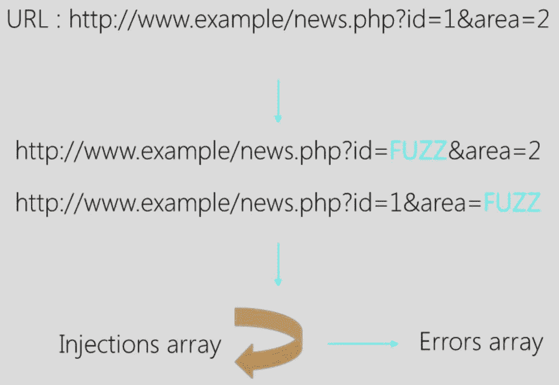

# 七、拦截 HTTP 请求

在本章中，我们将学习 HTTP 代理以及如何拦截和操作 HTTP 请求。我们将看到：

*   HTTP 代理剖析
*   mitmproxy 简介
*   操纵 HTTP 请求
*   在 mitmproxy 中自动化 SQLi

# HTTP 代理剖析

在本节中，我们将了解什么是 HTTP 代理，为什么需要和使用代理，以及存在什么类型的 HTTP 代理。

# 什么是 HTTP 代理？

HTTP 代理是充当两个通信方之间的中介的服务器。客户端和服务器之间没有直接通信。相反，客户端连接到代理并向其发送请求。然后代理将从远程服务器获取资源，最后将响应返回给客户端：


# 我们为什么需要代理？

出于以下原因，我们需要代理：

*   **隐私**：当我们不想让服务知道我们来自哪里或我们是谁时。
*   **绕过过滤器和审查**：在互联网审查普遍且服务被封锁的国家，代理可以帮助我们绕过这一封锁。
*   **记录和窃听**：许多公司实施代理，以记录员工浏览的内容并窃听他们的通信。
*   **缓存**：使用缓存的公司使用代理来缓存内容和加速通信。
*   **过滤和屏蔽**：公司可能直接想要屏蔽和限制员工可以访问的服务。
*   **操纵和修改流量**：作为安全测试人员，我们感兴趣的是拦截浏览器和 web 应用之间的通信，以便分析和操纵请求和响应，以便识别漏洞和调试问题。

# HTTP 代理的类型

说到 HTTP 代理，我们应该做一些不同的区分：

*   **转发代理**：这是最常见的代理示例。这就是我们在解释什么是代理时使用的示例。转发代理是客户端向代理发送请求，代理代表其获取资源的代理。在这种情况下，用户选择或被迫在公司中使用代理。用户知道正在使用代理，但服务器不知道：


*   **反向代理**：这些代理是公司为了隐藏在网络架构背后或需要在实际服务器之间分配负载而使用的代理。用户认为他们正在连接到真正的服务器，但他们正在连接到将处理请求的代理：


*   **透明代理**：这些代理在网络层拦截正常通信，而不需要在客户端进行任何配置。通常，客户机不知道他们正在使用透明代理。透明代理通常不会修改请求和响应。ISP 通常使用它们，以便为客户提供更快的响应。代理充当路由器或网关：


# mitmproxy 简介

在本节中，我们将了解使用 mitmproxy 的原因，如何在 mitmproxy 中使用基本 HTTP 代理功能，以及对 mitmproxy 内联脚本的简要介绍。

# 为什么是 mitmproxy？

Mitmproxy 是一个交互式控制台程序，允许拦截、检查、修改和重播流量。在研究了本节之后，我决定学习 Python 中 HTTP 代理的最简单、最完整的方法是使用 mitmproxy。任何其他尝试都比 mitmproxy 更加复杂和有限。

Mitmproxy 是用 Python 开发的，允许用户通过内联脚本进行扩展。它支持开箱即用的 SSL，与其他仅支持 HTTP 的替代方案不同。

让我们用一个简单的例子来看看 mitmproxy 是如何工作的。如果我们进入终端并键入`mitmproxy`，我们会得到一个 mitmproxy 控制台，在端口`8080`监听：


如果我们将浏览器设置更改为使用代理进行 HTTP 连接，并触发一个请求，如[http://www.edge-security.com/](http://www.edge-security.com/) 我们将在控制台中看到所有请求。

让我们点击浏览器右侧的“打开”菜单图标，进入“首选项”|高级|网络|连接|设置…|手动代理配置。将 HTTP 代理设置为`127.0.0.1`，端口设置为`8080`，点击 OK：


让我们加载[http://www.edge-security.com/](http://www.edge-security.com/) 现在在浏览器中；您可以在控制台中查看请求历史记录：


现在，如果您选择一个请求并按*Enter*，您将看到该请求的详细信息、响应、标题和连接详细信息。如果要编辑请求，请按*E*。完成后，您可以按*R*发送。这是 mitmproxy 的基本用法。

我鼓励您在[了解与 mitmproxy 合作的所有内容 https://mitmproxy.org/](https://mitmproxy.org/) 。它确实有很好的文档记录。这里有多个示例，您将找到关于它的所有必要信息。

为了提醒您代理是如何工作的，在这个特殊的例子中，我已经设置了我的浏览器以连接到端口`8080`中本地主机上的 mitmproxy。浏览器和代理位于同一台计算机上：


Mitmproxy 有一个强大的脚本 API，可以让我们动态访问请求以对其进行操作：


mitm 脚本 API 是事件驱动的，它的脚本只是一个公开一组事件方法的 Python 模块。

我们可以在屏幕截图中看到一个简单内联脚本的示例，该脚本将在每个 HTTP 响应返回到客户端之前添加一个新的头。这就是脚本所需的全部代码。在下一节中，我们将学习如何编写脚本来处理 mitmproxy 中的请求。

# 操纵 HTTP 请求

在本节中，我们将学习更多关于内联脚本的知识，我们将看到一个如何拦截请求并访问其不同部分的示例。

# 内联脚本

在上一节中，我们定义了一个简单的内联脚本，以便访问来自请求的响应。通信的其他部分 mitmproxy 允许我们通过处理程序访问响应：

*   `start`：在脚本启动后，在任何其他事件之前调用该函数
*   `clientconnect`：当客户端启动到代理的连接时调用

一个连接可以对应多个 HTTP 请求。

*   `request`：当收到客户端请求时调用
*   `serverconnect`：代理发起与目标服务器的连接时调用
*   `responseheaders`：当接收到服务器响应的`responseheaders`时调用，但响应体尚未处理
*   `response`：当收到服务器响应时调用
*   `error`：发生流错误时调用
*   `clientdisconnect`：当客户端断开与代理的连接时调用此函数
*   `done`：当脚本在所有其他事件后关闭时调用

现在我们知道了哪些处理程序可用，让我们看一个访问请求的示例。

让我们在编辑器中打开位于`Section-7`源代码中的`mitm-0.py`脚本。这个脚本基本上会记录代理从客户端收到的每个请求。

我们可以看到这个脚本非常简单：

```py
import sys

def request(context, flow):
  f = open('httplogs.txt', 'a+')
  f.write(flow.request.url + '\n') 
  f.close()
```

我们有`request`的处理程序，强制的第一个参数为`context`，第二个参数为`flow`。顾名思义，`flow`保存了有关通信的所有信息。在函数中，我们打开`httplogs.txt`文件，然后写入`flow.request.url`，这是客户端请求的 URL，最后关闭`f`文件。

让我们回到`Section-7`目录中的终端。输入`mitmproxy -s mitm-0.py`后，mitmproxy 控制台将出现。然后，我们将打开浏览器并更改代理配置，使其指向 localhost`8080`。单击浏览器右侧的“打开”菜单图标，进入“首选项”|高级|网络|连接|设置…|手动代理配置。将端口设置为`8080`。将`localhost`和`127.0.0.1`从无代理中删除：



让我们在浏览器中加载`www.scruffybank.com`。您可以在控制台中看到所有请求：



让我们关闭控制台并查看`httplogs.txt`文件。我们可以用编辑器打开它。我们可以看到会话中请求的所有 URL：


干得好！

现在，让我们添加一个过滤器来记录唯一的 URL，以避免存储重复的 URL。在编辑器中打开`mitm-1.py`文件。为了防止重复，让我们在脚本中创建一个名为`history`的全局变量；然后，在函数中，我们只需检查 URL 是否不在历史记录中：

```py
import sys

global history 
history = [] 

def request(context, flow):
  global history
  url = flow.request.url
  if url not in history:
    f = open('httplogs.txt', 'a+')
    f.write(flow.request.url + '\n') 
    f.close()
    history.append(url)
  else:
    pass
```

如果不存在，我们将其记录下来，然后将其添加到`history`。让我们再试一次，看看是否有效。首先，我们可以通过右键单击`httplogs.txt`文件并选择删除选项来删除该文件。运行`mitmproxy -s mitm-1.py`。

让我们回到浏览器，打开`www.scruffybank.com/login.php`并刷新几次。关闭代理控制台，然后再次打开结果：


伟大的没有重复的。

现在我们知道了如何访问请求，让我们看看如何向每个请求添加查询字符串参数。你可能会问为什么。嗯，我们需要在请求中添加某些参数，以便访问某些信息。

让我们在编辑器中打开`mitm-2.py`。现在，我们要做的是获取带有`flow.request.get_query()`的查询字符串，然后检查查询字符串是否包含某些内容：

```py
import sys

def request(context, flow):
  q = flow.request.get_query()
  if q:
    q["isadmin"] = ["True"]
    flow.request.set_query(q)
```

如果有内容，我们添加一个名为`isadmin`的新参数，其值为`True`。最后，我们用`flow.request.set_query(q)`更新请求查询字符串。

让我们在命令行中尝试一下。让我们通过输入`mitmproxy -s mitm-2.py`来启动`mitm-2.py`。在浏览器中，单击包含参数的“了解更多”链接。

在 mitmproxy 控制台中，您可以看到 mitmproxy 正在添加带有`True`值的`isadmin`查询字符串参数：


在本例中，它不会做任何事情，但它是下一节的热身，在下一节中，我们将学习如何做更复杂的事情，例如为代理中看到的每个参数测试 SQLi。

# 在 mitmproxy 中自动化 SQLi

在本节中，我们将学习如何在 mitmproxy 中为 SQL 注入自动化测试用例，创建我们使用的内联脚本、请求处理程序，以及我们在前面几节中学习的一些内容。

# SQLi 过程

本节的目标是为 mitmproxy 创建一个内联脚本，这将允许我们在每个具有参数的 URL 中测试 SQL 注入：



所以过程是，对于每个有参数的 URL，我们需要用 FUZZ 替换每个参数值，同时保留其余的参数值。我们这样做，而不是一次用 FUZZ 替换所有的值。然后，我们用数组中的每个值替换每个 URL 中的模糊字符串。

然后，我们在 errors 数组中执行一个匹配结果内容和 MySQL 错误的请求。让我们看看代码。让我们到编辑器打开`mitm-3.py`文件。我们有一些新的进口产品：

```py
import urlparse
from copy import deepcopy
import requests
import sys

def injector (url):
  errors = ['Mysql','error in your SQL']
  injections = ['\'','\"',';--']
  f = open('sqlinjection_results.txt','a+')
  a = urlparse.urlparse(url)
  query = a.query.split('&')
  qlen = len(query)
  while qlen != 0:
    querys = deepcopy(query)
    querys[qlen-1] = querys[qlen-1].split('=')[0] + '=FUZZ' 
    newq='&'.join(querys) 
    url_to_test = a.scheme+'://'+a.netloc+a.path+'?'+newq
    qlen-=1
    for inj in injections:
                  req=requests.get(url_to_test.replace('FUZZ',inj))
      print req.content
            for err in errors:
                          if req.content.find(err) != -1:
                                        res = req.url + ";" + err 
                                  f.write(res) 
  f.close()

def request(context, flow):
  q = flow.request.get_query()
  print q
  if q: 
    injector(flow.request.url)
    flow.request.set_query(q)
```

`copy`从`deepcopy`开始，我们需要前面代码中突出显示的代码来复制对象和`urlparse`，这将有助于解析 URL。

然后我们有了`request`处理函数。只要有`query`字符串，它就会调用`injector`函数。`injector`函数包含`errors`和`injections`数组，与我们在 SQLi 脚本中使用的数组类似。然后，我们打开一个文件来记录结果，并使用`urlparse`获取`query`字符串。

我们需要将其与`&`分开，并获得我们有多少个参数的长度。一旦我们知道了长度，我们就做一个`while`循环。对于每个迭代，我们将对对象`query`进行`deepcopy`处理，以保留原始内容并在新副本中工作。然后，我们用`FUZZ`字符串替换`qlen-1`参数的值。

在`url_to_test`中，我们重建 URL。然后，我们循环注入并用注入管柱替换`FUZZ`。最后，我们检查结果内容和`errors`数组中的内容。如果我们有匹配项，我们就写日志，就这样。mitmproxy 中包含了一个基本的 SQL 注入功能。

让我们转到终端，运行`mitmproxy -s mitm-3.py`，然后在应用中浏览。最后，转到`www.scruffybank.com/users.php`。我们知道这个页面容易受到前面练习中 SQLi 的攻击，例如，在用户 ID 中键入`1`，这对于这个演示应该足够了。关闭 mitmproxy 并在编辑器中检查`sqlinjection_results.txt file`日志：


很好，我们可以看到哪个 URL 易受 SQLi 攻击。我们可以看到产生错误的注入参数。从现在开始，您可以继续使用我们之前创建的 SQL 注入器脚本。现在，您已经有了一个基础，可以在此基础上构建自己的脚本来满足您的需求并测试自定义场景。

# 总结

我们已经了解了 mitmproxy 的工作原理，并学习了如何创建内联脚本来扩展代理和操纵通信。我们已经学会在 HTTP 代理中添加漏洞扫描功能，以便在 web 应用渗透测试期间为我们提供帮助。

我们为您提供了基本知识和技能，以帮助您将来创建自己的自定义工具。如果您作为 PunTebug 启动您的旅程，这将为您在每个情况下建立自定义工具奠定坚实的基础，并允许您修改和扩展现有工具。

既然你知道了基本知识，你就可以继续你的旅程，提高你的技能并付诸实践。为此，我建议提供以下资源：

*   OWASP 网络山羊（[https://www.owasp.org/index.php/Category:OWASP_WebGoat_Project](https://www.owasp.org/index.php/Category:OWASP_WebGoat_Project) ）。这是一个以虚拟机形式提供的培训课程。本培训重点介绍 OWASP 前 10 个漏洞。

*   戊酯实验室（[https://www.pentesterlab.com/](https://www.pentesterlab.com/) 提供可用于测试和理解漏洞的易受攻击应用。此外，你还可以在其他易受攻击的应用中测试你的技能，比如你可以在项目中找到的那些应用。
*   OWASP-WADP（[https://www.owasp.org/index.php/OWASP_Vulnerable_Web_Applications_Directory_Project](https://www.owasp.org/index.php/OWASP_Vulnerable_Web_Applications_Directory_Project) ），一组易受攻击的应用，提供接近现实的环境。

就这样。非常感谢您选择这本书，我希望您喜欢学习使用 Python 进行 web 应用测试。