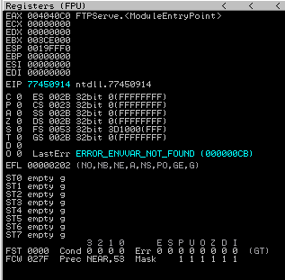
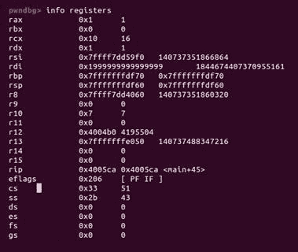
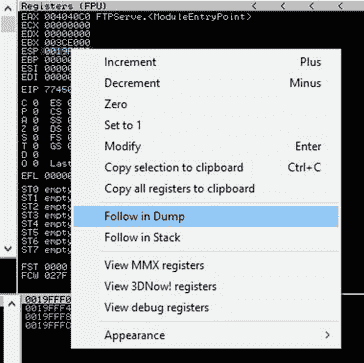
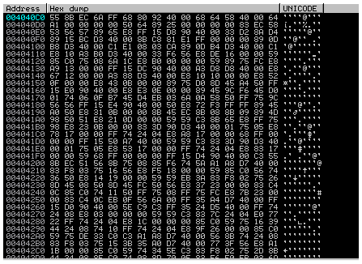
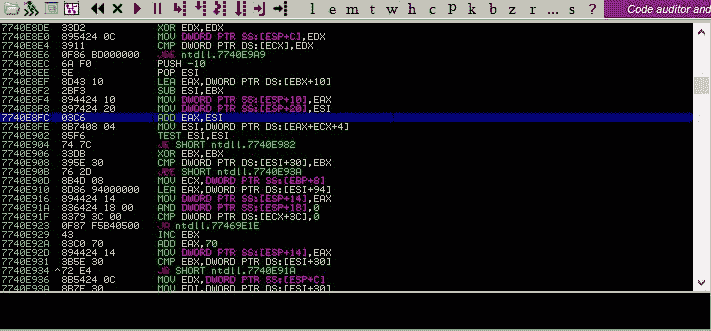

# 十二、利用开发简介

在本章中，我们将介绍以下配方：

*   寄存器
*   内存转储
*   CPU 指令

# 介绍

Python 有助于创建简单的原型代码来测试漏洞利用。在本章中，我们可以学习开发漏洞的基础知识，这些知识可以帮助您纠正错误的漏洞，或者从头开始构建您自己的漏洞。

# 寄存器

CPU 寄存器或处理器寄存器是处理器中的一小组数据存放位置之一，可以存放指令、存储地址或任何数据。寄存器应该能够存储指令。寄存器是最快的计算机内存，用于加速计算机操作。

# 准备

在进行开发之前，您需要对寄存器有一个基本的了解。为了理解，让我们考虑寄存器主要有两种形式，通用寄存器和专用寄存器。

# 通用寄存器

通用寄存器用于存储程序执行期间的中间结果和运行数学运算。四个通用寄存器为 EAX、EBX、ECX 和 EDX：

*   **EAX（累加器寄存器）**：用于基本数学运算和返回函数值。
*   **EBX**：根据需要用于标称存储。
*   **ECX（计数器寄存器）**：用于循环函数和迭代。它也可用于一般储存。
*   **EDX（数据寄存器）**：用于乘法、除法等高等数学运算。在运行程序时，它还存储函数变量。

# 专用寄存器

专用寄存器用于处理索引和指向。在编写漏洞利用的情况下，这些都很重要，因为我们将尝试操作和覆盖这些寄存器中的数据。主要专用寄存器为 EBP、EDI、EIP 和 ESP：

*   **EBP**：该指针寄存器指示堆栈底部的位置。因此，当我们启动一个函数时，它将指向堆栈的顶部或设置为旧的指针值，因为它是开始。
*   **EDI**：这是目标索引寄存器，用于指向函数的指针。
*   **EIP**：指令指针寄存器用于存储 CPU 执行的下一条指令。因此，这对于利用漏洞编写非常重要，因为如果我们可以编辑它，我们就可以控制下一条指令。此外，如果我们可以覆盖此 EIP，则意味着程序本身已失败。
*   **ESP**：当堆栈指针指示堆栈的当前顶部（最低内存地址）时。当项目从堆栈顶部移除时，此操作将在运行程序时获取更新。当加载新函数时，它会返回顶部位置。如果我们需要访问堆栈内存，我们可以使用 ESP。

要在运行程序时查看寄存器，我们需要调试器，我们必须在您的系统中安装调试器。对于调试 Windows 程序，我们可以使用免疫调试器；对于 Linux 和 Mac，我们可以使用`pwngdb`。

您可以从这里下载并安装免疫调试器：[https://www.immunityinc.com/products/debugger/](https://www.immunityinc.com/products/debugger/) 。

要安装`pwndbg`，请从 Git 存储库获取代码并运行安装脚本：

```
git clone https://github.com/pwndbg/pwndbg
cd pwndbg
./setup.sh  
```

# 怎么做。。。

为了更好地理解调试器工具中的这些寄存器，我们可以执行一些快速任务。

1.  要在运行程序时查看寄存器，我们需要使用调试器。因此，在调试器中打开一个可执行文件。为此，请在 Windows 计算机中打开免疫调试器。
2.  然后加载程序，在调试器中对其进行分析。从菜单转到文件|打开并选择要监视的应用程序。
3.  它将在调试模式下打开应用程序并打印当前详细信息。右上框将显示寄存器详细信息。“豁免”对话框中的“注册”窗格

调试器如下所示：



4.  对于 Linux 和 macOS，安装`pwndbg`后，我们可以使用以下命令在`pwndbg`中打开应用程序：

```
>> gdb ./app  
```

这将在调试器中打开应用程序`app`

5.  现在，我们可以在调试模式下使用断点集运行应用程序：

```
pwndbg> break 5
pwndbg> run  
```

这将运行应用程序并在第`5`行中断

6.  现在，我们可以使用以下命令查看当前状态下的寄存器：

```
pwndbg>info registers    
```

输出结果如下：



如果可执行文件为 64 位，寄存器将以`r`开头。以`e`开头是无效的。

# 内存转储

我们可以通过内存转储轻松查看内存位置的内容。我们可以使用免疫调试器或`pwndbg`进行此操作。

# 怎么做。。。

按照以下步骤更好地理解内存转储：

1.  在调试器中打开应用程序。

2.  如果要查看 ESI 寄存器中的内存转储，请右键单击地址，然后选择以下转储选项：



3.  这将更新左下角的内存转储窗口。调试器中的内存转储窗口如下所示：



4.  通过`pwndbg`我们可以通过`hexdump`命令获得内存转储。为此，在`gdb`中加载应用程序，并使用断路器运行：

```
pwndbg> break 5
pwndbg> run  
```

5.  现在，要查看 RSI 寄存器中的内存转储，请运行以下命令：

```
pwndbg> hexdump $rsi  
```

输出结果如下：


# CPU 指令

当用高级语言编写应用程序并进行编译时，语言指令将转换为与之对应的汇编语言。这是机器可以理解的代码。使用调试器，我们可以查看每条汇编指令。

# 怎么做。。。

按照以下步骤了解调试器中的用法：

1.  在调试器中打开应用程序。
2.  我们可以在调试器的左上窗格中查看操作码。
3.  我们可以通过按*F7*一步一步地浏览说明并查看结果：

以下是“说明”窗格的外观：



这将更新右上窗格中的相应寄存器。像这样，我们可以在调试器中跟踪每个 CPU 指令的执行情况。

在`pwndbg`的情况下，我们可以使用`entry`命令在入口点执行：

```
pwndbg> entry  
```

这将与上下文屏幕一起显示。

4.  我们可以使用`nearpc`命令查看断点附近的操作码：

```
pwndbg> nearpc  
```

输出结果如下：


5.  我们可以通过`stepi`命令逐步完成说明：

```
pwndbg> stepi  
```

这将执行一条机器指令，然后它将停止并返回到调试器。

像这样，我们可以通过说明来分析它。