# 企业网络与数据库开发

在上一章中，我们有机会学习如何攻击和保护 Linux 基础设施。现在，是时候扩展我们的技能，获得必要的知识和实际经验，以渗透公司网络和数据库了。

本章涵盖的主题包括：

*   网络扫描的高级主题
*   不安全的 SNMP 配置
*   数据库服务器利用

在深入之前，让我们先从一些基础知识开始。

# 网络基础

要了解如何攻击公司网络，学习一些重要的网络术语是至关重要的。

# 网络拓扑

网络的示意图描述称为拓扑。它是指网络中不同设备的布局。网络组件的排列可以是物理的，也可以是逻辑的。有许多网络拓扑：总线、网状、星形、环形、树型和混合型。

# 总线拓扑

总线拓扑表示一种布局，其中所有网络组件使用中心连接（有时称为主干）进行连接。这种类型的拓扑非常经济高效，因为它使用一根一次性电缆。对于小型网络来说，这是一个不错的选择，但当电缆断开时，所有连接的设备都会断开。作为网络架构师，最好避免单点故障方法。**总线拓扑**如图所示：


# 星形拓扑

星形拓扑是指将所有设备连接到单个集线器，集线器是一个中心节点，每个设备都有专用连接。中心的作用是重复数据流。它易于管理和故障排除，但与其他拓扑相比有点昂贵。**星形拓扑**如图所示：

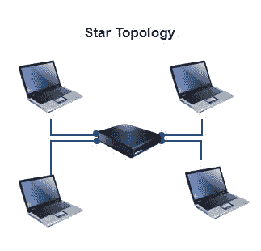

# 环拓扑

环形拓扑表示在一个方向上进行数据传输的环形布局。它表示单点故障，如总线拓扑。**环拓扑**如图所示：

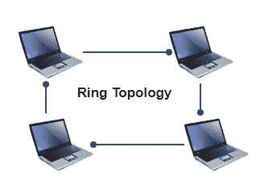

# 树形拓扑

树拓扑是一种分层布局。您可以将其视为总线拓扑和星形拓扑的组合。有时，它被认为是星形拓扑的另一种形式。它包含一个根节点和其他设备，对于分组工作区来说是一个不错的选择，但它的电缆连接非常密集。**树形拓扑**如图所示：

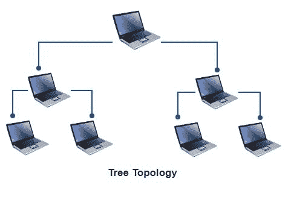

# 网格拓扑

在网状拓扑中，每个连接的设备都使用点对点连接连接到网络中的其他设备。这种类型的拓扑非常昂贵，但建议在冗余体系结构中使用，因为如果一个设备发生故障，数据将传输到另一台机器，通常使用最短路径。**网格拓扑**如图所示：

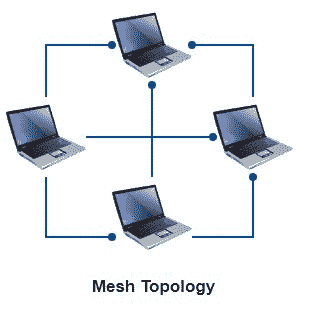

# 混合拓扑

混合拓扑是前面讨论的布局的至少两种拓扑的组合。根据您的需求，您可以选择一些拓扑以满足不同部门的需求。它是有效和灵活的。

# 传输模式

在研究了网络的不同拓扑之后，现在让我们看看数据是如何在两个不同的设备之间传输的。说到通信，我们有三种主要的传输类型：

*   **简单模式**：当数据只朝一个方向流动时，会出现这种模式。这种类型广泛用于电视广播（只能从源向监视器发送数据，而不能从相反的源发送数据）。
*   **半双工模式**：在这种类型的传输中，数据一次使用一种通信方式双向传输，如乒乓模式；您不能同时发送和接收消息。
*   **全双工模式**：该模式用于数据流双向同时的情况，如电话网络中使用的模式。

我们看到了传输操作的“如何”，让我们看看**【什么】；换句话说，不同的传播方式。有两种类型的传输：**

 ***   **有界表示**：数据通过三种物理电缆传输——同轴电缆、光纤电缆和绞合电缆
*   **未绑定表示**：数据以无线电和微波信号的形式传输

# 通信网络

有许多类型的通信网络。

# 局域网

在小型区域，如小型工作办公室或建筑物中使用**局域网**（**局域网**）。对于网络设计，可以使用前面讨论的布局中的任何拓扑。这种类型的网络很容易排除故障，并且经常用于共享环境（打印机、计算机等）。此处显示了一个示例：

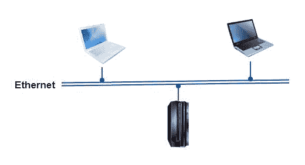

# 城域网

**城域网**（**城域网**）比局域网大，但它是可扩展的，因为它可以在更远的距离使用，例如，在同一城市的两个办公室之间。中间人可以是另一家公司和服务（例如，本地电话交换机）。

# 广域网

在涉及远距离的情况下，使用**广域网**（**广域网**）。一般来说，它是通过互联网连接不同各方的。下图总结了不同类别之间的差异：

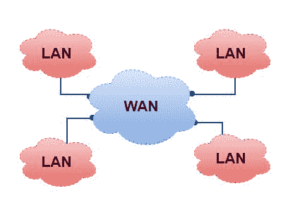

# 个人区域网

**个人区域网**（**PAN**为短距离无线网络。一般来说，平底锅的范围比单人房小。最著名的 PAN 是蓝牙。

# 无线网络

通过用无线电波取代物理电缆，无线网络是降低网络成本的绝佳解决方案。

# 数据中心多层模型设计

数据中心多层模型设计是现代组织数据中心中广泛使用的模型。这种拓扑结构非常灵活，但价格昂贵。该多层架构基于三个主要层：**核心**、**聚合**和**接入**：

*   **核心层**：这一层被称为主干层，因为它使用高数据传输速率确保数据包的可靠传输。
*   **聚合层**：该层有时被称为工作组层，因为它确保组织的子网和 VLAN 之间的数据包路由正确。它可能包括防火墙、**服务质量**（**QoS**）和许多其他基于策略的网络连接。
*   **接入层**：该层负责将终端和工作站连接到网络。

这些图层如下所示：

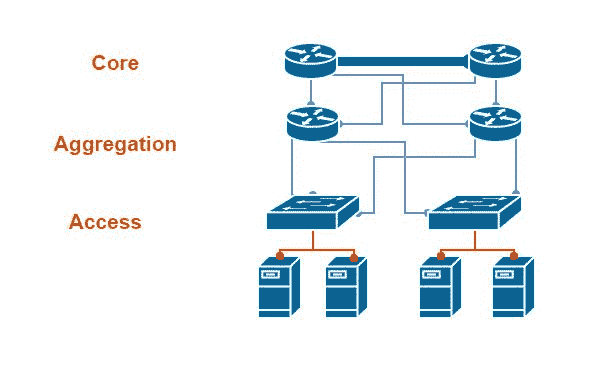

# 开放系统互连模型

网络是每个现代组织和每个人的重要组成部分。为了方便数据通信和处理，**开放系统互连**（**OSI**标准化模型已经发展。数据按特定顺序在网络中移动。该顺序由七个步骤和层次表示；OSI 模型包含七层。您可以使用此短语*从上到下记住各层，所有人似乎都需要数据处理*：

*   **应用层**：该层包含软件应用所需的所有服务。
*   **表示层**：该层主要负责数据的表示方式。这些操作可以包括压缩和加密。
*   **会话层**：该层提供主机之间的通信过程（启动会话、重启、终止等）。
*   **传输层**：管理发送数据传输的可靠性。
*   **网络层**：该层处理数据的路由操作，特别是使用名为 IP 地址的逻辑地址在网络之间发送数据包。路由器是网络层设备。
*   **数据链路层**：该层负责组织网络的链路设置。它包含两个不同的子层：**逻辑链路控制**（**LLC**）用于流控制和错误纠正，以及**媒体访问控制**（**MAC**）用于确定帧的流。交换机是数据链路层设备。
*   **物理层**：该层处理移动（发送和接收）数据的硬件手段（电缆、电气方面等）。例如，集线器是一个物理层设备。

将数据从数据移动到位的过程称为**封装**。相反的操作称为反封装。

OSI 模型如下所示：


# 深度网络扫描

扫描是黑客程序中至关重要的一步。在本节中，您将学习如何扫描和映射网络。网络扫描的目的是识别活动主机，包括其网络服务。但在深入研究网络扫描技术之前，让我们先从基本的 TCP 通信序列开始。

# TCP 通信

**传输控制协议**（**TCP**）是最著名的互联网协议之一。它作为面向连接的协议用于可靠的主机对主机通信。这意味着连接将一直保持到消息完全传输为止。TCP 通信由称为控制位的 TCP 标志处理，其结构化格式称为 TCP 头。控制位为 URG、SYN、PSH、RST 和 FIN**。**

*   **SYN**：启动连接
*   **确认**：确认接收
*   **RST**：重置连接
*   **FIN**：完成接收
*   **URG**：表示紧急处理
*   **PSH**：立即发送

数据交换是通过三方握手技术完成的，如图所示。第一步是客户端向服务器发送**SYN**数据包。然后，如果目标端口打开，服务器将以**SYN-ACK**数据包进行响应。最后，服务器接收到**ACK**数据包，建立连接：


# ICMP 扫描

**互联网控制报文协议**（**ICMP**）与 TCP 协议类似；两者都支持 internet 协议套件中的协议。ICMP 用于检查实时系统；ping 是使用 ICMP 请求的最著名的实用程序。其原理非常简单，ICMP 扫描向主机发送请求，并等待回显请求以检查系统是否处于活动状态。此处显示了 ping 扫描的示例：`ping <target>`：

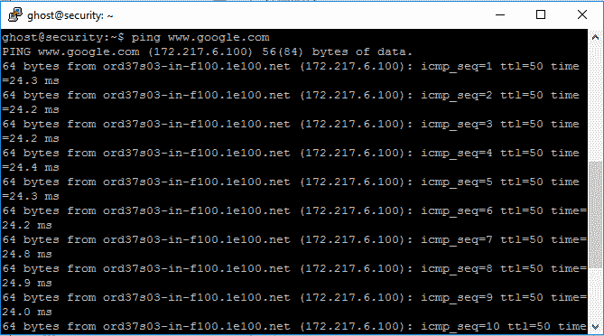

ping 扫描是一种 ICMP 扫描技术，但它扫描一系列 IP 地址。

有许多 TCP 服务扫描技术，例如：

*   **全开放扫描**：三方握手完成（全连接）时完成。
*   **半开放式扫描**：有时称为隐形扫描，只需执行三方握手的前半部分即可。
*   **FIN 扫描**：在 FIN 扫描过程中，攻击者发送一个 FIN 数据包。如果他没有得到响应，则表示端口已打开或已被放置的防火墙丢弃。
*   **空扫描**：为了执行空扫描，攻击者发送一系列包含零且未设置标志的 TCP 数据包。如果端口打开，则目标将丢弃该数据包。

# SSDP 扫描

**简单业务发现协议**（**SSDP**是一种用于发现直接连接设备的网络协议。该协议使用 UDP 使用即插即用设备来交换数据。它在端口`1900`上工作。

# UDP 扫描

**用户数据报协议**（**UDP**是一个互联网协议套件。它是 TCP 的替代方案，但不可靠。它只发送数据包而不等待确认。UDP 标头有四个 2 字节字段：

*   源端口
*   目的港
*   UDP 长度
*   UDP 校验和

在 UDP 扫描期间，UDP 数据包被发送到主机的 UDP 端口。如果没有响应，则端口打开，否则将收到一个`"Destination unreachable"`错误。

**Nmap**是最著名的开源网络发现和映射工具。它是一个非常灵活、功能强大且有良好文档记录的实用程序。您可以从以下网址下载：[https://nmap.org/download.html](https://nmap.org/download.html) 。

以下截图显示了名为**Zenmap**的 Nmap 图形用户界面模式的主界面：

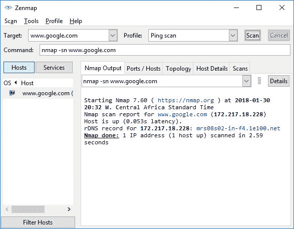

要使用 nmap，只需使用以下命令：

```
nmap <options> <Target>
```

以下是网络扫描中的一些有用选项：

*   `-p`：用于扫描端口
*   `-F`：用于快速扫描（使用最常用的端口）
*   `-p-`：用于扫描所有端口
*   `-sT`：用于 TCP 扫描
*   `-sU`：用于 UDP 扫描
*   `-A`：用于识别操作系统和服务
*   `-sN`：用于空扫描
*   `-SF`：用于翅片扫描

此外，您还可以使用以下表达式使用 Nmap 脚本（`.nse`，例如：`nmap -sV -p 443 –script=ssl-heartbleed.nse <Target_Here>`

# 入侵检测系统

**入侵检测系统**（**IDS**用于保护对组织网络的受限访问。它们可以由软件或硬件组成。有两种类型的 ID：

*   **基于主机的 ID**：该系统跟踪主机的行为是否存在任何可疑活动
*   **基于网络的 IDS**：该系统分析任何入侵的网络流量并生成警报

IDS 使用两种检测方法：

*   **基于特征码的检测**：与杀毒产品一样，这种类型的检测基于预定义的模式，如序列和特征码。
*   **基于异常的检测**：这种检测方法基于活动的行为。它是一种动态方法，根据先前已知的攻击检测异常和可疑活动。

# 入侵检测中的机器学习

由于许多组织收集了大量数据，机器学习显然是目前科技行业最热门的趋势。基于大数据做出决策和预测是如此强大。欺诈检测、自然语言处理、自动驾驶汽车和图像识别是机器学习应用的几个例子。机器学习是统计学、计算机科学、线性代数和数学优化方法的结合。下图说明了传统编程和机器学习之间的区别：


机器学习是研究和创造算法，可以从数据中学习并做出预测。据卡内基梅隆大学**CMU**教授汤姆·米切尔（Tom Mitchell）介绍，一个计算机程序据说可以从经验*E*中学习一些类别的任务*T*和性能度量*P*，如果它在*T 中执行任务*由*P*测量，随着经验*E*的提高而提高。例如，在语音识别中，任务*T*是正确识别单词，性能度量*P*是成功识别的单词数，经验*E*是一个口语词的数据集。机器学习可分为四种模型：监督学习、无监督学习、半监督学习和强化。

# 监督学习

当我们有输入变量（*I*和输出变量（*O*时，使用监督学习，我们需要将函数从输入映射到输出，作为一种学习算法。监督学习可以用两种类别来表示：分类，当输出为类别时使用；回归，当输出为真实值时使用。以下是一些有监督的机器学习算法：

*   **决策树**：决策树是一种使用树状图及其可能输出的机器学习算法。这些输出可以是是/否或连续变量。该算法有四个重要术语：

*   **朴素贝叶斯分类**：朴素贝叶斯分类器是基于预测给定样本类别的贝叶斯定理的多概率分类器。例如，它用于检查电子邮件是否为垃圾邮件。这里是贝叶斯定理：


*   **支持向量机**：一种**支持向量机****支持向量机**是一种二值分类算法。它被用来寻找我们称之为分离数据的分离超平面。它被定义为一个超平面，而不是一条简单的线，因为我们谈论的是一个多维空间。

# 无监督学习

在只有输入数据（*X*）而没有相应输出变量的情况下，无监督学习非常有用。无监督学习算法的一个例子是聚类，这是对一组对象进行分组的任务，使得同一组（簇）中的对象比其他组中的对象更相似，如下所示：

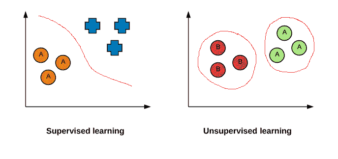

# 半监督学习

当我们有大量的输入数据（*I*）和少量的输出变量（*O*）时，使用半监督学习。我们可以将其视为介于有监督学习和无监督学习之间，因此我们可以使用这两种模型中的技术。

# 加固

当代理或系统基于与环境的交互（包括奖励功能）改进其性能时，会使用强化。

# 机器学习系统的工作流程

每个机器学习项目都应该遵循特定的步骤来实现其目标。第一步是数据处理。在这一步中，我们需要从原始数据中提取有意义的特征。这一步至关重要，因为需要良好的特征工程来构建良好的机器学习模型。在处理数据之后，我们必须训练并选择适合我们情况的最佳预测模型。最后，在训练模型之后，评估是一个重要的过程，在这个过程中，我们检查训练模型的准确性和性能，以预测新数据。

许多基于机器学习的入侵检测系统已经开始浮出水面。他们可以创建检测未知威胁的伟大解决方案，而网络安全工程师可以从收集的数据中提取有用的特征并构建机器学习模型。信息安全专业人士和数据科学爱好者可以根据自己的目的自由选择最方便的机器学习算法和模型，这就是为什么有各种探索性的机器学习 ID 可用的原因。其中之一是人工神经网络，特别是深度学习。

**人工智能****人工智能**要求计算机模拟人脑的认知功能。第一个人工神经网络是在 1960 年左右引入的，2006 年，杰弗里·辛顿（Geoffrey Hinton）提出了第一个神经网络的实现方案。人工神经网络的工作原理就像人类的大脑；它们由许多以线性方式相互连接的神经元组成。他们接受一个输入，并决定该类作为输出；换句话说，人工神经网络正在像大脑一样对信息进行建模。人工神经网络试图表现得像大脑一样，但大脑是如何工作的呢？

为了了解单层神经网络的工作原理，我们将对生物神经元和人工感知器进行比较。神经元是神经系统的一部分，包括大脑。它通过电化学信号传递信息。典型的神经元具有树突，树突将信息从其他细胞传播到包含细胞核和单个轴突的细胞体。

利用大脑行为的类比，人工神经元的行为方式与生物神经元相同，因此输入是一个多变量向量，通常完全连接到输出节点。输出节点获取所有输入的总和，并应用我们所称的激活函数。激活函数就像一个决定函数，它选择传递什么和阻止什么。

多层神经网络是具有至少三层节点的人工神经网络；它们包含许多感知器。中间的层称为隐藏层。

人工网络有多种类型：

*   **卷积神经网络**（**CNN**）：通过输入层传递大量信息可能会导致问题，例如，在图像识别中，传递大图像的每个像素不是有效的解决方案。这就是为什么我们需要一种称为卷积神经网络的神经网络，它由卷积层和池层（有时称为采样层）组成，当然还有输入层和输出层。
*   **递归神经网络**（**RNN**）：RNN 是当输入为序列信息且输入和输出相互独立时使用的神经网络。一般来说，它在处理自然语言处理任务时非常流行。RNN 有一个内存，用于捕获到目前为止所计算内容的相关信息。

# 机器学习模型评价指标

为了评估机器学习模型，我们需要一些度量标准。衡量分类绩效的方法有很多。准确度、F1 分数、精确度、召回率是评估机器学习模型的几个常用指标。它们基于四个参数计算：假阳性、假阴性、真阳性和真阴性。混淆矩阵是一个表，通常用于描述基于所讨论的四个参数的分类模型的性能。

# 服务枚举

服务枚举是从目标中提取关于运行服务的信息的操作，以探索将损害系统的攻击向量，例如机器的主机名、网络服务、服务设置以及 SNMP 和 DNS 的细节。以下小节详细讨论了如何枚举和利用两种不同的网络服务：SNMP 和 DNS。

# 不安全的 SNMP 配置

**简单网络管理协议**（**SNMP**是管理网络设备的协议；它在**UDP**上运行。每个网络设备都包含一个与独立 SNMP 管理器连接的 SNMP 代理。此协议使用两个身份验证密码：第一个是用于查看配置的公钥，第二个是用于配置设备的私钥。网络节点以树形结构存储在名为**管理信息库**（**MIB**的数据库中。例如，攻击者可以枚举 SNMP 服务以检查默认的 SNMP 密码或强制使用这些密码。

Nmap 在 SNMP 渗透测试中非常方便，因为它加载了用于此任务的非常有用的`.nse`脚本，例如：

*   `snmp-info.nse`
*   `snmp-netstat.nse`
*   `snmp-brute.nse`
*   `snmp-interfaces.nse`
*   `snmp-processes.nse`

为了抵御 SNMP 攻击，我们需要：

*   更改默认密码
*   阻止对 UDP 端口的访问`161`
*   使用 SNMPv3 解密密码
*   仅使用所需的 SNMP 代理

# DNS 安全

**域名系统**（**DNS**于 1983 年由美国科学家 Paul Mockapetris 和 Jon Postel 开发。我们都知道，记住使用 IP 地址的网站是很困难的，因此必须提供更简单的命名服务。这是 DNS 的目标，因为它提供了基于名称而非 IP 地址的命名结构。此处的图表显示了 DNS 的不同步骤：


DNS 数据基于全球的特定层次结构分布在多个位置，以确保更快的信息传输。通常，我们有根域（13）、顶级域和二级域：

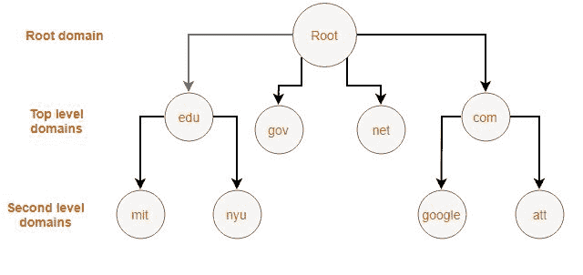

**完全限定域名**（**FQDN**格式为：`<host_name>.<Domain_name>`

要测试区域传输，可以使用主机实用程序：

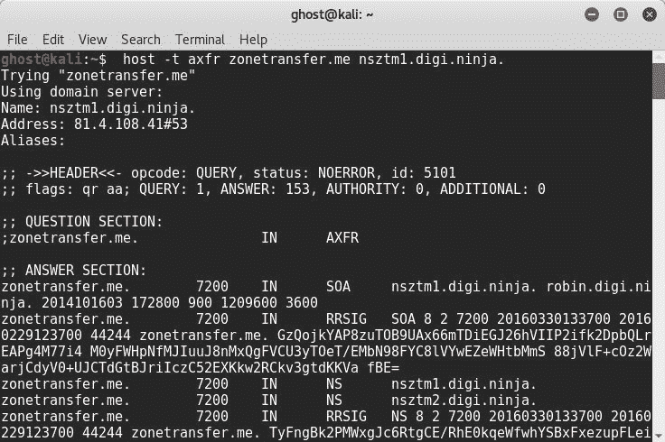

# DNS 攻击

DNS 面临着各种各样的恶意攻击。以下是一些 DNS 攻击：

*   **单点故障**：一次故障可导致整个系统同时停止
*   **中间人（MITM）攻击**：在这次攻击中，攻击者拦截了流量
*   **DNS 缓存中毒**：在这里，攻击者将受害者重定向到恶意服务器
*   **Kaminsky DNS 漏洞**：该漏洞可能允许攻击者将网络客户端重定向到自己选择的备用服务器，可能是出于恶意目的
*   **动态 DNS（DDNS）：**恶意软件开发人员使用 DDNS 快速更改地址
*   **分布式拒绝服务（DDoS）攻击：**攻击者向目标发送未经处理的请求

# 嗅探攻击

嗅探是通过将**网络接口卡**（**NIC**）切换到混杂模式来拦截网络流量的过程，以便能够嗅探传输的数据。有两种类型的网络嗅探–主动嗅探和被动嗅探：

*   **被动嗅探**：这发生在集线器设备或交换机上，无需注入任何额外的数据包。
*   **主动嗅探**：通过向网络注入**地址解析协议**（**ARP**数据包完成。以下是一些主动网络嗅探攻击：
    *   MAC 泛洪这是用随机数据泛洪 CAM 表直至其满的过程
    *   交换机端口窃取

通过在交换机端口上只允许一个 MAC 地址并实现端口安全性，可以避免前两次攻击。

*   **ARP 中毒**：ARP 用于解析 MAC 地址。攻击者可以伪造 ARP 请求来淹没交换机。当它们淹没 ARP 缓存时称为中毒。

*   **MAC 欺骗**：这是嗅探 MAC 地址并在另一个上下文中使用它的行为。要防御此攻击，您需要阻止绑定表中未提及的通信量。这是一个有插图的嗅探攻击

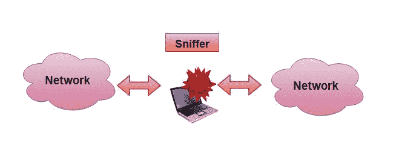

一般来说，为了防御嗅探攻击，我们需要遵循以下步骤：

*   使用安全协议，如 SFTP 和 HTTPS，而不是 FTP 和 HTTP
*   使用 SSH 和安全协议（IPSec）
*   从网络接口卡识别 MAC 地址
*   始终检查是否有机器正在使用混杂模式
*   部署 ID

Wireshark 是解决网络问题的著名工具。如需下载，请访问[https://www.wireshark.org/download.html](https://www.wireshark.org/download.html) 。


选择您的版本并将其安装到您的计算机上：

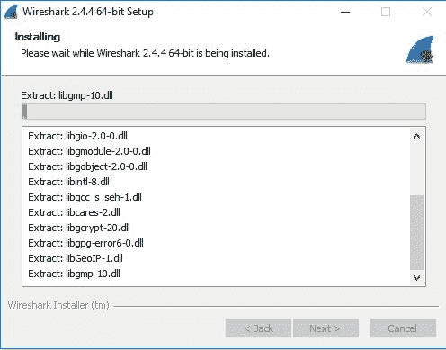

祝贺您可以使用它来分析网络上的所有流量。选择您的网卡：

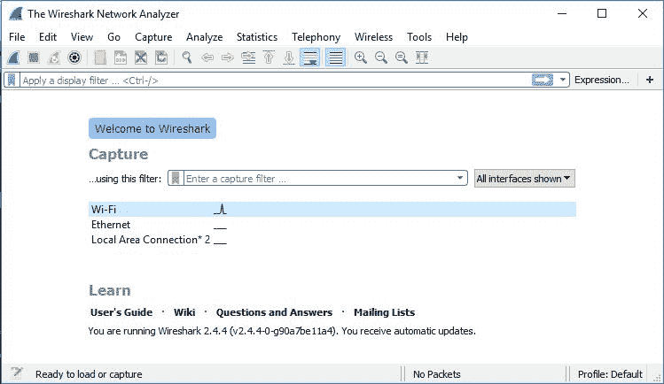

现在，您可以开始探索了：

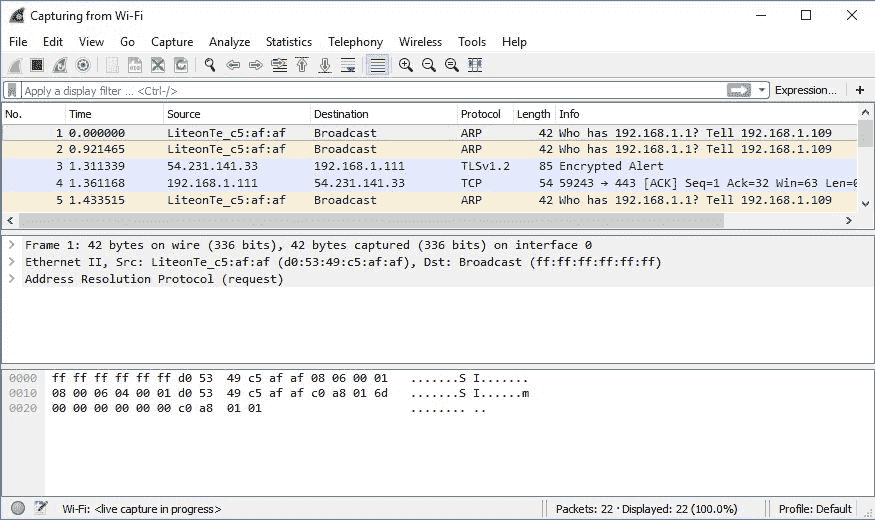

# 分布式拒绝服务攻击

当受损设备充斥目标系统的网络流量时，就会发生 DDoS 攻击。这种类型的攻击威胁到系统的可用性。对于 DDoS 攻击，有四种攻击向量：

*   **体积攻击**：这会使用组织的带宽淹没受害者。
*   **碎片攻击**：该攻击利用数据报碎片机制，防止碎片数据包重新组装。它也被称为泪滴攻击。
*   **TCP 状态耗尽攻击**：该攻击耗尽了 web 服务器、负载平衡器和防火墙支持的并发连接数。
*   **应用层攻击：**利用应用漏洞禁用服务。如下图所示，攻击者利用受损主机（也称为僵尸）对其目标执行 DDoS 攻击。

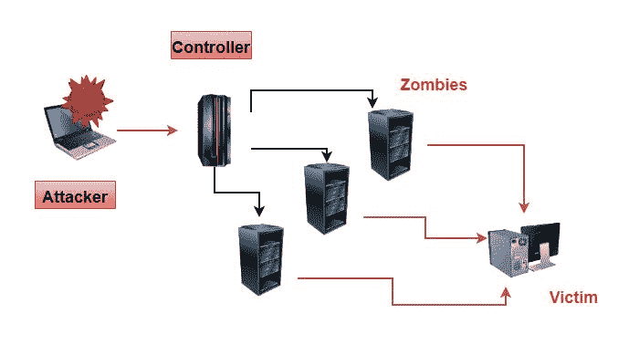

# DDoS 攻击的类型

**SYN 泛洪**：当攻击者发送 SYN 请求而不回复确认时，就会执行此操作。

**ICMP 泛洪攻击**：这是在不等待响应的情况下向服务器泛洪 ICMP 请求的过程。Smurf 攻击、ICMP 洪水和 ping 洪水都是 ICMP 洪水攻击的形式。作为演示，您可以使用以下命令尝试 hping3 实用程序：

```
hping3 -S --flood -V www.example.com
```

其中`-flood`表示泛洪模式（发送请求而不等待响应），`-S`表示 SYN 请求选项：

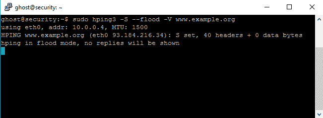

**应用程序洪水攻击**：该攻击以应用程序为目标，以丢失或降级在线服务。这些攻击会淹没应用程序，使其无法正确处理请求。

**僵尸网络**：这些是受损机器的网络，通常由**命令和控制**（**C2C**通道控制。

# 防御 DDoS 攻击

以下是针对**DDoS**攻击的一些对策：

*   实施检测机制，特别是信号分析技术
*   部署高可用性解决方案和冗余资源
*   禁用非必需服务
*   交通模式分析

# DDoS 清理中心

在数据中心规模上，实施 DDoS 清理中心是抵御 DDoS 攻击的明智决策，在 DDoS 攻击中，将分析流量并将正常流量传回网络。通常，互联网服务和云提供商等大型企业使用该中心站：


# 软件定义的网络渗透测试

**软件定义网络**（**SDN**）是一种网络体系结构，具有一个集中的完全可编程控制器，可以在一个实体中查看网络的所有路径和设备。这就是为什么它被认为是一个单点配置。这一巨大的自动化转变为企业网络增加了巨大的价值。下图表示不同的 SDN 层及其相互作用：

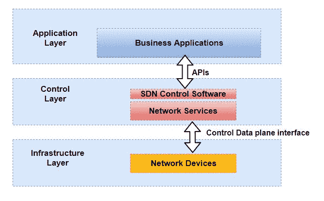

在经典的网络栈中，每个组件实现两个方面：控制和数据实体。但在 SDN 中，我们隔离了这两个面板。下图说明了两种联网方法之间的区别：


SDN 主要有三种型号：

*   网络虚拟化模型
*   进化模型
*   OpenFlow 模型

典型的 SDN 体系结构由以下三个主要组件组成：

*   **SDN 控制器**：这是一个智能逻辑实体，控制应用程序和设备之间的操作，以维护企业网络的全局视图
*   **SDN 组网设备**：负责跨网络转发和处理数据
*   **SDN 应用程序**：这些程序通过 API 向 SDN 控制器发送所需的操作

# SDN 攻击

这种新的网络模型是最近才出现的，但现在它已成为攻击者的高价值目标。如前所述，我们说过单一控制点对资产构成巨大威胁。SDN 具有单点控制功能；这就是为什么强大的力量伴随着巨大的责任。如果攻击者成功破坏 SDN，他们将控制整个网络。另一种攻击向量是 SDN 应用；最后，它们是程序，因此，任何软件故障或编写错误的代码都可能导致系统受损。DDoS 攻击和嗅探也是 SDN 的真正威胁，可能会破坏整个网络。下图描述了不同模型层中的一些攻击：

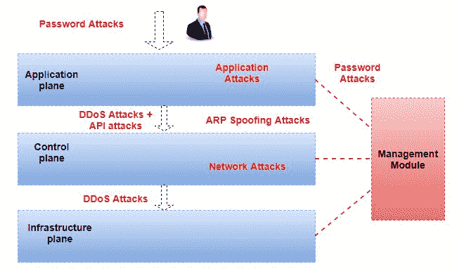

# SDNs 渗透测试

作为渗透测试人员，您的角色是模拟 SDN 攻击，以尝试识别弱点。目前有许多 SDN 渗透测试框架。

# DELTA:SDN 安全评估框架

DELTA:SDN 安全评估框架是基于攻击场景的安全框架。它还提供了未知 SDN 攻击情况下的模糊技术。它包含以下四个代理，如图所示：

*   **代理经理**
*   **申请代理**
*   **渠道代理**
*   **主机代理**


您可以通过以下命令使用 GitHub 克隆增量框架：

```
$ git clone https://github.com/OpenNetworkingFoundation/DELTA.git 
```

这是 DELTA 框架的主要架构：

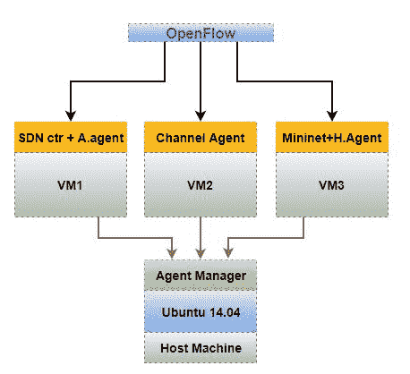

# SDNPWN

SDNPWN 是一个用于测试 SDN 安全性的工具包。它提供了一个简单的命令行工具来测试 SDN 攻击。要下载 SDNPWN，可以通过键入以下内容克隆存储库：

```
git clone https://github.com/smythtech/sdnpwn
```

您可以在执行脚本后使用工具箱。

```
./sdnpwn.py <module name> <module options>
```

您可以通过执行其模块来选择攻击。以下是一些可用的模块：

`[*] Available modules:` `[+] arpmon` `[+] controller-detect` `[+] dp-arp-poison` `[+] dp-mitm` `[+] help` `[+] host-location-hijack` `[+] info` `[+] lfa-relay` `[+] lfa-scapy` `[+] lldp-replay` `[+] mods` `[+] of-gen` `[+] of-switch` `[+] phantom-host-scan` `[+] phantom-storm` `[+] sdn-detect` `[+] system`

# 对数据库服务器的攻击

数据库是每个组织的重要组成部分。它们是攻击者的严重目标，因为它们包含敏感数据。数据库面临许多严重威胁；以下是一些数据库攻击：

*   **过度权限**：这是一种攻击者获得未经授权的权限来访问机密信息的攻击
*   **SQL 注入**：这是一种服务器端攻击，利用 web 应用程序中的漏洞发送未经授权的数据库查询。
*   **弱身份验证**：当密码弱时，攻击者可以使用社会工程攻击和暴力强制访问
*   **备份数据泄露**：未加密的备份对一个组织来说是一个真正的危险。所有备份都需要加密。

# 总结

在本章中，我们介绍了通过理解网络概念和应对网络漏洞的实践经验来保护组织网络的基本技能。本章不仅为您提供了防御现代网络攻击的能力，而且还将 SDN 作为一个研究案例，使您能够做好准备，确保下一代网络技术的安全。下一章将带您了解现代企业的另一个重要组成部分。您将面临 Microsoft Active Directory 的威胁，通过获得保护 Active Directory 所需的技能，您将更加强大。**