# Active Directory 攻击

在上一章中，我们探讨了如何利用组织的网络。我们从网络基础到发现最新的攻击方法。本章是您获得更多关于为每个现代公司保护另一个重要技术系统（Active Directory）的知识的下一步。我们将根据精心设计的计划将您带到另一个经验层次，以获得保护另一个环境所需的技能。

本章将介绍以下主题：

*   学习 Active Directory 和 Kerberos 概念
*   各种 Active Directory 攻击概述
*   了解哪些防御措施是有效的，以及它们如何缓解当前的攻击

# 活动目录

目录是一本以排序方式（通常按字母顺序或主题）列出个人或组织的书籍，包括详细信息，如姓名、地址和电子邮件。换句话说，目录包含存储的和结构化的对象，以简化对这些对象的访问和操作。在小型组织中，如果需要文件，则需要知道文件所在的服务器及其完整路径。这在小型环境中有效，但在中型和大型公司中不实用。因此，使用这种方法定位文件可能是一个真正的挑战。问题还不止于此，因为我们知道每个用户都可能拥有许多访问凭据，例如密码，这使得管理所有凭据变得困难，如果数量很大的话。这就是为什么需要一个目录服务来定位资源而不知道完整的位置。下图显示了分层目录的示例

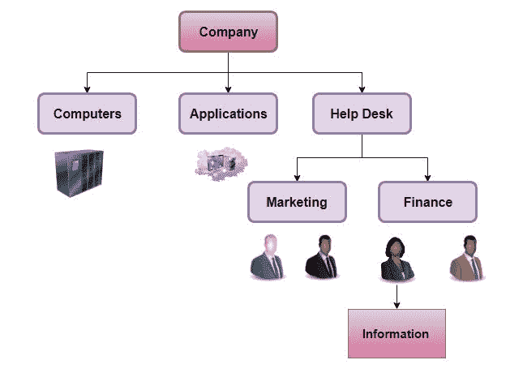

Microsoft Active Directory 为管理和解决这些难题提供了目录服务。它还具有许多其他特性和功能。如今，Active Directory 在许多现代组织和机构中发挥着重要作用。通信是业务的一个关键方面，目录服务是一个明智的选择，因为它充当所有所需信息的单个容器点。Active Directory 基于客户机/服务器体系结构。下图显示了 Active directory 用户的示例。

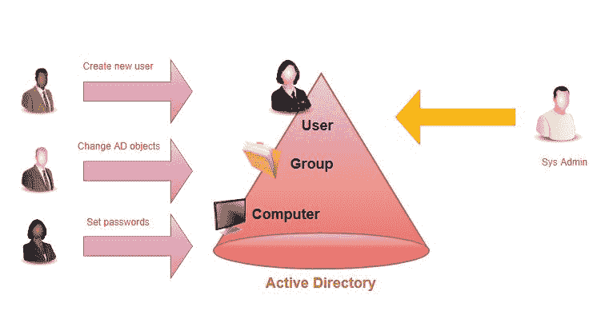

Active Directory 由以下四个组件组成：

*   **Active Directory 林**：这是一个类似顶级容器的 Active Directory 实例
*   **Active Directory 域**：这是管理定义对象的集合
*   **Active Directory 单元**：您使用这些容器对象以支持您的管理目的的方式排列其他对象
*   **场所**：这些是物品的容器

此图显示 Active Directory 林和树的示例：

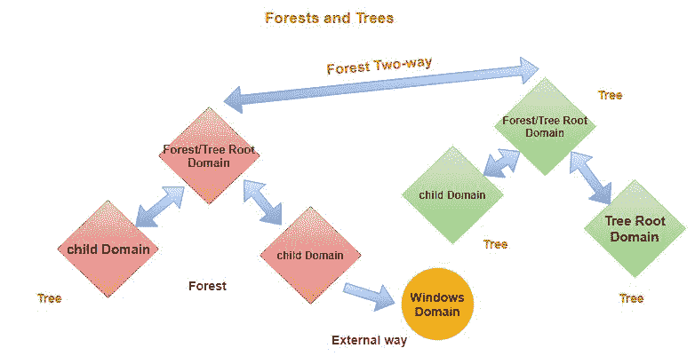

# 单点登录

**单点登录**（**SSO**）是一种中心方法，通常由身份验证服务器表示，它允许许多系统以高效的方式进行身份验证，而无需记住不同的密码。这种机制还通过提供单个身份验证点提高了开发人员的生产效率，因此他们不必担心这一部分，可以专注于更重要的任务。SSO 解决方案很好，但正如前几章所讨论的，单点是攻击者的一个有吸引力的目标。下图显示了单点登录如何简化身份验证。

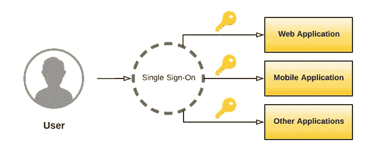

# Kerberos 认证

Kerberos 是 RFC 1510 下的一种身份验证协议，从本世纪初就集成到 Windows 操作系统中。它是由**麻省理工学院**（**麻省理工学院**在雅典娜项目下开发的。您可以通过其官方网站[进行检查和测试 http://www.kerberos.org](http://www.kerberos.org) 。Kerberos 环境包含三个部分：客户端、服务器和**密钥分发中心**（**KDC**），如下图所示。它根据 Needham 和 Schroeder 提出的密钥分发模型提供身份：


Kerberos 需要以下五个步骤才能继续：

1.  从身份验证服务器 KDC 请求身份验证
2.  除了使用票据授予服务加密的票据授予之外，KDC 还发回一个使用发送方的密钥加密的会话
3.  然后，接收方解密会话，并向票证授予服务请求权限
4.  如果会话有效，除使用资源密钥加密的服务票证外，票证授予服务还发送一个客户机/服务器会话以授予对资源的访问权
5.  资源验证会话并授予对客户端的访问权限

Kerberos 提供了一个很好的身份验证解决方案，但它将密钥存储为纯文本，这对组织来说是一个巨大的威胁。事实上，如果攻击者能够访问 KDC，他们将破坏所有密钥。下图显示了 Kerberos 操作的不同步骤：

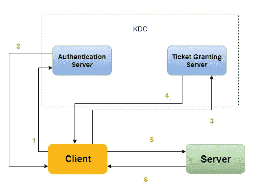

# 轻量级目录访问协议

Active Directory 使用**轻量级目录访问协议**（**LDAP**）作为访问协议，该协议依赖于 TCP/IP 协议栈。LDAP 支持 Kerberos 身份验证。

该协议使用倒树层次结构，因此每个条目都有一个定义的位置。这种结构称为**目录信息树**（**DIT**。**可分辨名称**（**DN**表示条目的完整路径。

下图显示了用户之间的不同交互（**通用名**（**CN**）。过滤器组仅限于某些应用程序：

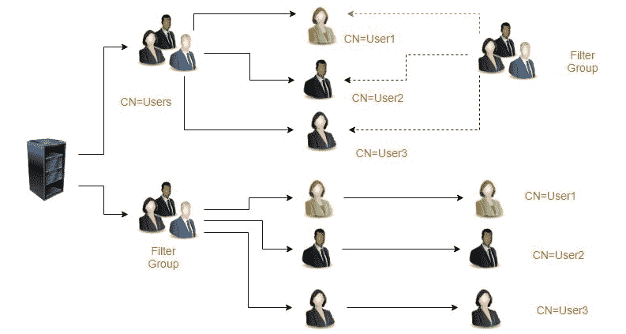

# PowerShell 和 Active Directory

PowerShell 是一个自动化框架，为系统管理员提供了执行任务的多种功能。它支持脚本语言。脚本中的每个命令都称为**cmdlet**。您可以使用.NET 编程语言构建自己的 cmdlet。这里给出了一个解释：

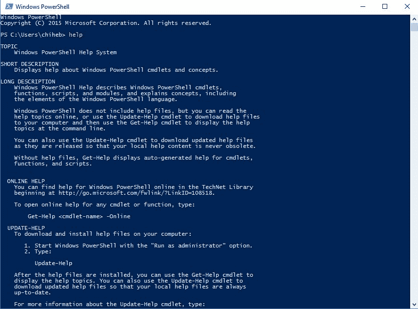

要签出林，可以使用`get-adforest`cmdlet，如图所示：

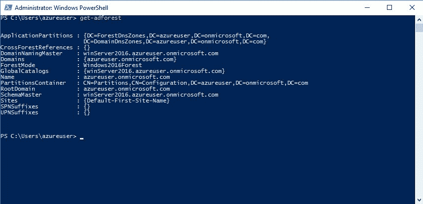

要检查所有命令，请键入：`Get-Command`，如图所示：


要查看域名，可以使用**`Get-ADDomain`**，如图所示：

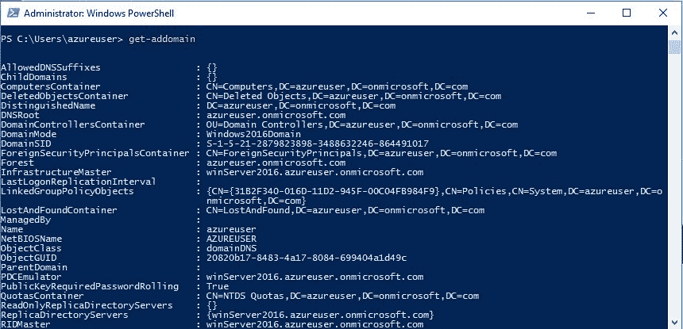

要检查林的信任，需要使用`get-adtrust`，如图所示：


`get-aduser`用于获取指定用户，如图所示：

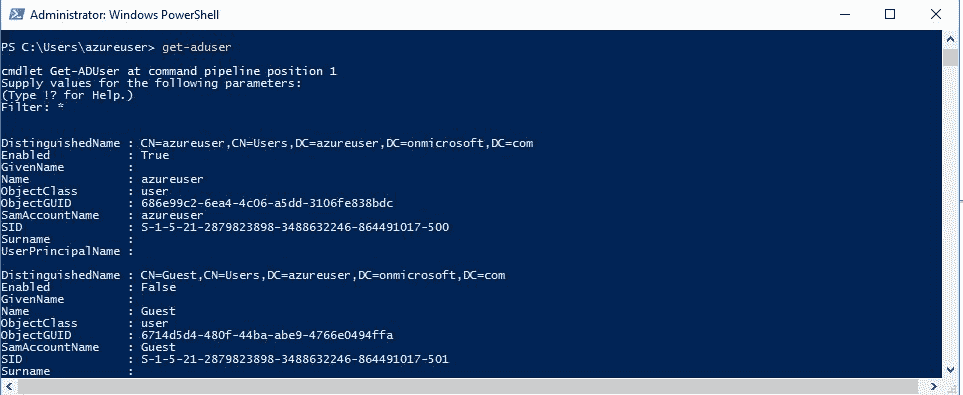

PowerShell 在许多情况下被用作攻击平台，原因如下：

*   它在内存中运行代码而不接触磁盘
*   它从另一个系统下载并执行代码
*   它与.NET 和 Windows API 接口
*   大多数组织都没有观看 PowerShell 活动
*   `CMD.exe`通常被阻止，但不是 PowerShell

# Active Directory 攻击

Active Directory 是攻击者的高调目标。由于其公共架构（单点），它是一个目标系统。有许多 Active Directory 攻击。这是一个复杂的系统，因此以下小节将讨论来自不同攻击向量的不同类型的攻击。

# PowerView

侦察是信息安全的关键一步。PowerView 是一个惊人的侦察工具–它是一个域网络态势感知工具。您可以从[中抓取 https://github.com/PowerShellMafia/PowerSploit/blob/master/Recon/PowerView.ps1](https://github.com/PowerShellMafia/PowerSploit/blob/master/Recon/PowerView.ps1) 。

像往常一样，克隆项目或将其作为`.zip`文件下载，如图所示：

```
git clone https://github.com/PowerShellMafia/PowerSploit.git
```


PowerView 将使您能够执行许多侦察任务，如下所示：

*   **用户**：`Get-NetUser`
*   **组**：`Get-NetGroup`
*   **课时**：`Get-NetSession`
*   **GPO 位置**：`Find-GPOLocation`
*   **Active Directory 对象**：`Set-ADObject`
*   **森林**：`Get-NetForest`

# Kerberos 攻击

Kerberos 是攻击者的主要目标，如前一节所述。但在深入研究 Kerberos 攻击之前，让我们先了解一些 PowerShell 功能。

*   `get-adrootdse`：获取 root 的对象，如图所示：


*   `get-adforest`：用于检查 Active Directory 林，如图所示：

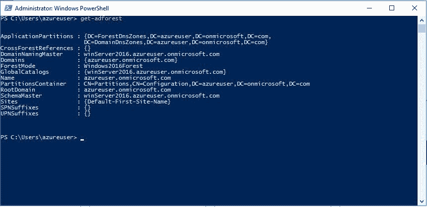

*   `get-domaincontroller`：列出域控制器，如图所示：


*   要获取 Active Directory 计算机，请使用`get-adcomputer`，如图所示：

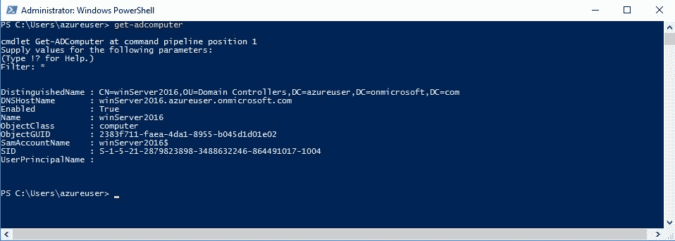

*   `get-adgroupmemberb`：获取广告组成员，如图所示：


在深入研究 Active Directory 攻击技术之前，让我们先了解一下 PowerShell 作为攻击性平台的一些功能。为此，我们将以 PowerShell Empire 为例进行演示，因为它是创建代理以破坏系统的绝佳工具：

```
#git clone https://github.com/EmpireProject/Empire
```

导航到`cd Empire/setup`并运行`./install.sh`脚本：

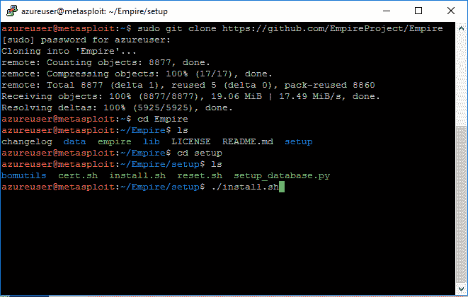

请稍候，等待安装完成：

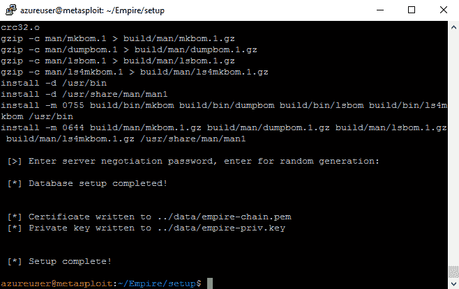

瞧！您现在可以使用 PowerShell Empire 了：


如果要生成代理，只需输入`usemodule external/generate_agent`：


# Kerberos TGS 服务票证脱机破解（Kerberoast）

如前几节所述，由于基于对称密钥加密的可信第三方，Kerberos 使用票据进行身份验证。最常见的攻击之一是 Kerberos TGS 服务票证离线破解，也称为 KerberoOAST。通过这种技术，攻击者可以利用大多数服务帐户密码与域密码长度相同这一事实。换句话说，您不需要强制两个密码，因为大多数服务帐户的密码都没有设置为过期。要减轻此攻击，您需要确保服务帐户密码长度超过 25 个字符。以下是票务授予*服务*（*TGS*的步骤）

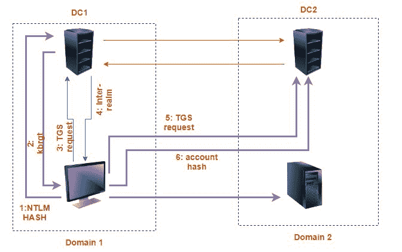

# SPN 扫描

**服务主体名称**（**SPN**）表示特定可发现服务的实例，如 HTTP、LDAP 和 SQL。Kerberos 使用它们将服务与服务帐户连接起来。您可以在不执行端口扫描的情况下扫描这些服务，因为 SPN 可以这样表示，例如，`MSSQLSvc/<domain>:3170`（`3170`是端口号）。

如果要使用 Microsoft 的内置工具检查所有 SPN 服务，只需键入`setspn -Q */*`。

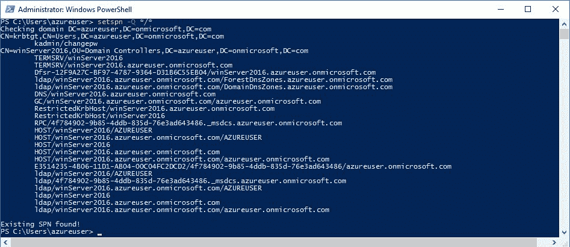

要检索广告票证，请键入：`> $ticket = Get-TGSCipher -SPN <SPN_service_Here>`。

要破解票据，您可以使用 john the ripper，这是一个著名的密码破解实用程序，如下所示：

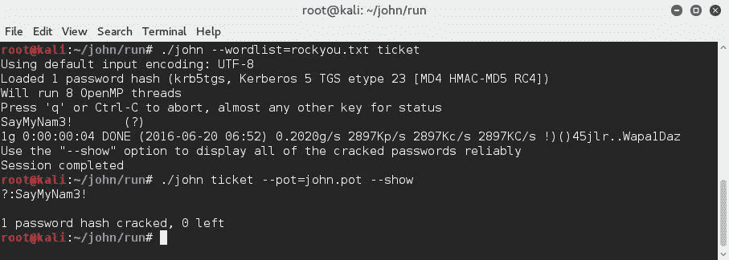

# SYSVOL 和组策略首选项中的密码

此攻击比上一次攻击简单得多。要从域用户升级到域管理员，攻击者只需在域 SYSVOL DFS 共享中搜索 XML 文件。SYSVOL 是 Active Directory 中的全域共享，所有经过身份验证的用户都有读取权限。

# 域控制器上存在 14-068 Kerberos 漏洞

要利用 MS14-068 Kerberos 漏洞，可以使用名为**PyKEK**的 Python 脚本（Kerberos 攻击工具包）将 TGT 注入内存，如图所示。从此 GitHub 存储库[克隆 python 脚本 https://github.com/bidord/pykek](https://github.com/bidord/pykek) ：

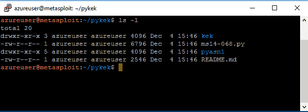

现在，您可以使用以下格式的脚本：

```
ms14-068.py -u <userName>@<domainName> -s <userSid> -d <domainControlerAddr>
```

# 使用 Mimikatz 转储所有域凭据

转储凭据是信息安全中的一项经典技术。转储域凭据是众所周知的 Active Directory 技术之一。这项技术可以在 Benjamin Delpy 开发的名为**Mimikatz**的强大实用程序的帮助下完成。您可以从其官方 GitHub 存储库[下载 https://github.com/gentilkiwi/mimikatz](https://github.com/gentilkiwi/mimikatz) ：

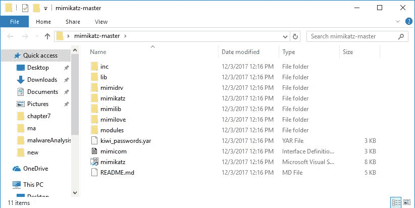

要构建 Mimikatz，您需要使用 VisualStudio 构建它。就我而言，我使用的是 Visual Studio 2015 Professional。如果您想直接使用二进制文件，请从[下载 https://github.com/gentilkiwi/mimikatz/releases/tag/2.1.1-20171203](https://github.com/gentilkiwi/mimikatz/releases/tag/2.1.1-20171203) ：

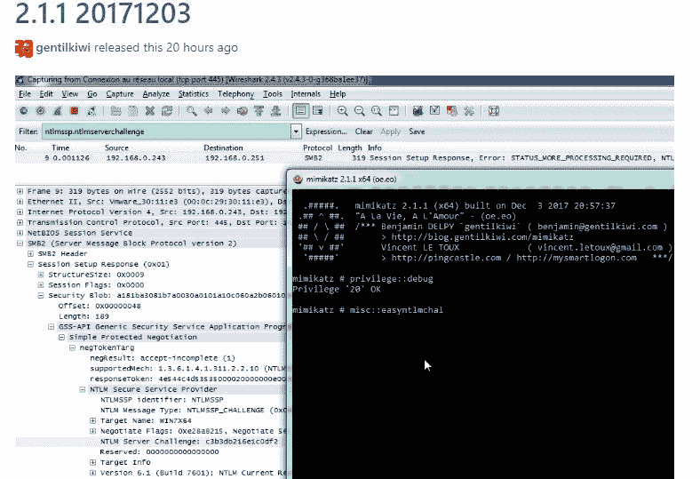

以下屏幕截图显示了 Mimikatz 的主界面：


现在，让我们了解一些 Mimikatz 命令和实用程序。

*   `CRYPTO::Certificates`：列出并检查证书，如图所示：

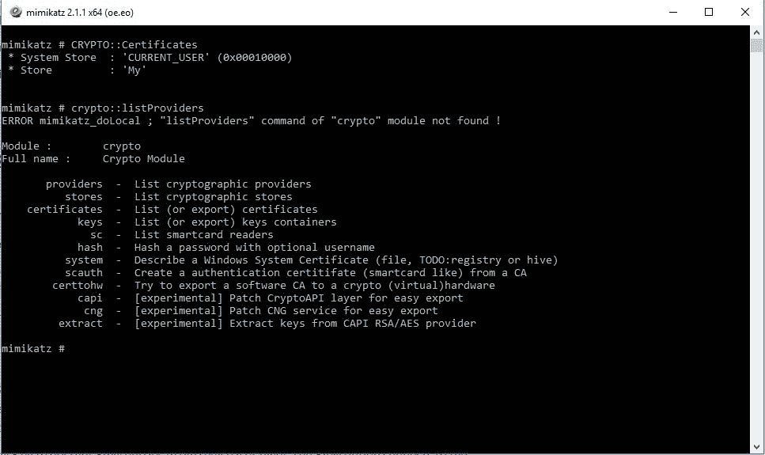

*   `SEKURLSA::Ekeys`：检查 Kerberos 加密密钥（[https://adsecurity.org/?page_id=1821#SEKURLSAEkeys](https://adsecurity.org/?page_id=1821#SEKURLSAEkeys)
*   `PRIVILEGE::Debug`：检查调试权限
*   `TOKEN::List`：检查所有系统令牌，如图所示：

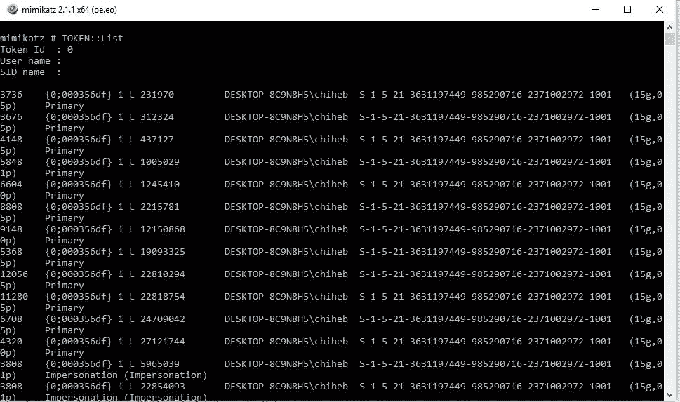

*   `TOKEN::Elevate`：检查域管理员，如图所示：


*   `TOKEN::Elevate/domainadmin`：要使用域管理员凭据模拟令牌：


# 传递凭证

Pass-the-credential 是发现 NTLM 散列密码的一种简单易用的技术，无需使用大量计算能力破解密码。虽然 Windows 不支持通过网络传递散列，但您可以尝试使用**传递票据**（**PtT**技术作为渗透测试仪，即抓取票据并以非合法方式使用的过程。此图显示 NTLM 身份验证流：

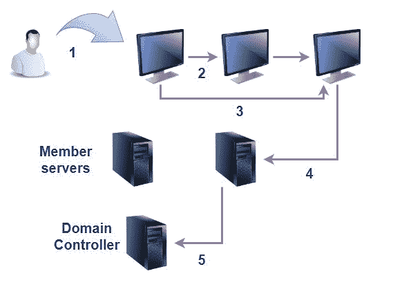

# 使用任务管理器转储 LSASS 内存（获取域管理员凭据）

内存转储是恢复某些隐藏信息（包括密码和凭据）的经典技术。Active Directory 技术之一是使用任务管理器转储 LSASS 内存。Mimikatz 具有强大的功能，如前面讨论的功能；其中一个正在从`LSASS.dmp`文件中转储 LSASS 内存，如图所示：

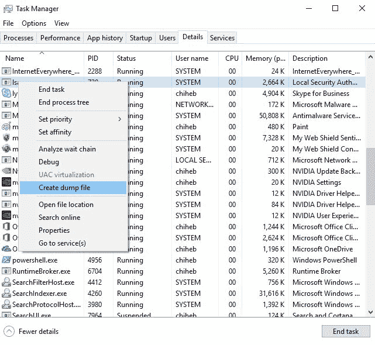

如果操作成功，您将收到以下消息：

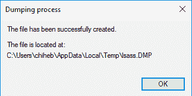

# 从 NTDS.dit 文件转储 Active Directory 域凭据

另一种威胁 Active Directory 环境的转储技术是从`NTDS.dit`文件转储凭据（Active Directory 数据存储在`NTDS.dit`中）。可以使用名为`secretdump.py`的 Python 脚本提取 Active Directory 凭据。它内置于 Kali Linux 环境中，或者您可以从该链接下载它；[https://github.com/CoreSecurity/impacket](https://github.com/CoreSecurity/impacket) ：

```
#git clone https://github.com/CoreSecurity/impacket
```


除了许多其他有用的脚本外，您还可以在`examples`文件夹中找到脚本：

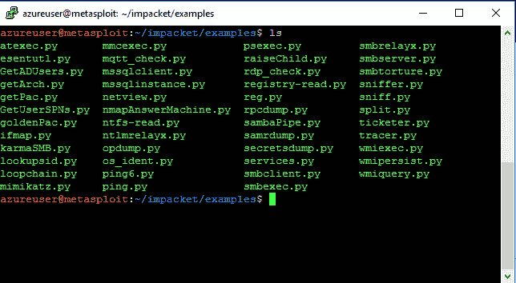

要检索数据，请键入：

```
secretdump.py -system /opt/system.hive -nt 
```

# 总结

本章讨论了现实世界中最常见的 Active Directory 威胁。我们从 Active Directory 的基本术语和组件开始，了解最新的 Active Directory 攻击，以及防御这些攻击所需的步骤。下一章将探索 Docker 的世界。您将学习如何构建安全的停靠环境。