# VLAN 攻击

交换机是任何现代网络中的重要组件。本章将带您经历一次学习体验，我们将了解如何一方面执行第 2 层攻击，另一方面如何防御它们。有必要知道如何保护第 2 层，因为网络安全只与最薄弱的一层一样强大。在我们的例子中，最薄弱的一层是第 2 层。损害它可能导致损害堆栈中的其他层。在本章中，我们将介绍以下主题：

*   交换基础
*   MAC 攻击
*   **动态主机配置协议**（**DHCP**攻击
*   **虚拟局域网**（**VLAN**攻击

# 网络交换

交换机是数据链路层（OSI 模型中的第 2 层）设备。他们的主要目标是通过接收交换包并将其转发到目标设备来连接网络设备。交换是连接设备的一种有效解决方案，但如果我们想要连接大量终端系统设备（计算机、电话等）和节点，它是不实际的。节点是在不修改信息或数据的情况下将信息从源传送到目的地的实体；一组节点称为通信网络，如下所示：

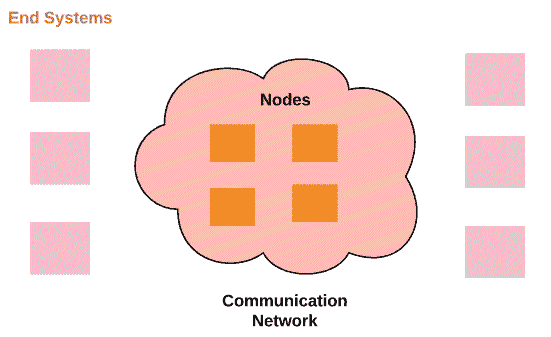

在切换中，有三种不同的技术：

*   **电路切换**：发送方和接收方之间的固定通道，专用通道称为**电路**。一旦建立连接，即使在确定连接之前电路未完全使用，也没有其他设备可以使用该通道。这种类型的交换机广泛应用于电话网络中。在电路切换过程中，我们有以下三个步骤：通道建立、数据传输和连接确定。有两种类型的电路切换：
    *   **频分复用（FDM）**：复用是将多个信号组合成一个信号的过程。FDM 是一种信道被分割而没有频率重叠的操作。下图说明了 FDM 过程：

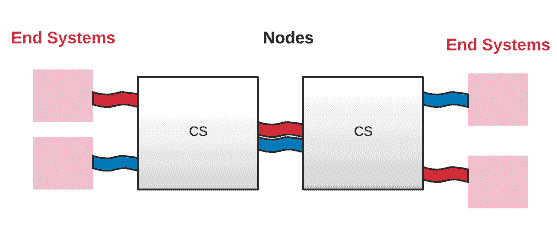


*   **分组交换**：在这种交换技术中，数据以称为**分组**的特定格式交换和转发。数据包由以下元素组成，如下所示：
    *   **数据**：传输信息
    *   **表头**：包含目的地地址
    *   **拖车****（可选）**：一般来说，它包含一些信息，表示它是数据包的结尾；有时，它用于错误检查：


在传输中，来自不同终端系统的数据包将多路传输；数据包也称为**数据报**。

*   **消息交换：**这有时被称为存储转发交换。在这种技术中，所有终端系统都接收消息，存储它，并将其转发到下一个设备。

# 局域网交换

局域网中使用的访问方法是基于 IEEE 802.3 标准的以太网连接。我们根据连接带宽有不同的类型（10 Mbps（以太网）、100 Mbps（快速以太网）或 1000 Mbps（千兆以太网））。以太网使您有机会选择不同的以太网传输物理设备，如双绞线和光纤。

用于阻止设备同时发送信息的算法称为**载波侦听多址/冲突检测**（**CSMA/CD**。如下图所示，两台主机不能同时发送信息：


在以太网连接中，数据流量由**媒体访问控制**（**MAC**地址）确定。此地址是唯一的 48 位序列号。它由**组织唯一标识符**（**OUI**和供应商分配的地址组成，如下所示。它以十六进制格式表示：

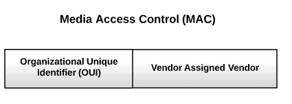

第二层中的传输可分为三种主要的数据传输方式：

*   **单播**：从特定网络设备到另一特定设备的传输方式。换句话说，它是一对一的传输模式。
*   **多播**：在多播操作中，单个设备向多个联网设备发送数据。这是一种一对多传输模式，设备将数据发送到特定组。
*   **广播**：此传输模式类似于多播，但在广播操作中，网络设备向所有其他设备发送数据。在广播中，设备使用`FF-FF-FF-FF-FF-FF`MAC 地址（可能的最高 MAC 地址）。

下图说明了三种传输模式之间的差异：

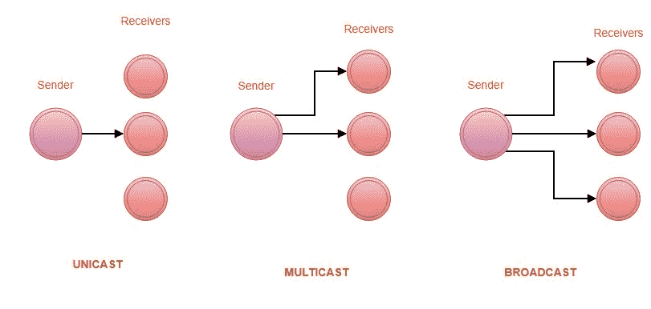

在 LAN 交换中，我们有以下三种技术：

*   **存储转发切换**：在存储转发切换中，模式交换机在计算**循环冗余校验**（**CRC**后，将所有帧存储在内存中并检查错误。如果基于帧中的位数出现错误，则该帧将被拒绝，否则将被转发，如图所示：

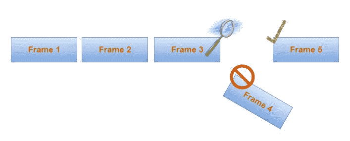

*   **直通交换**：在直通交换中，模式交换机只存储目的 MAC 地址，并与其 MAC 表进行比较。此技术比以前的技术更快，因为它只处理前 6 个字节：


*   **无碎片切换**：这种切换技术结合了之前的两种切换模式。这是一种混合开关技术。这类似于直通切换，但它不检查前 6 个字节，而是检查前 64 个字节，因为要检测冲突，我们需要检查前 64 个字节。

# MAC 攻击

MAC 地址是具有两个分配部分的唯一标识符。OUI 由 IEEE 分配，第二个 24 位由制造商分配。这些地址存储在一个名为**内容可寻址存储器**（**CAM**的表中。这张桌子有固定的尺寸。CAM 在运行后存储有关 MAC 地址的信息，如下图所示：

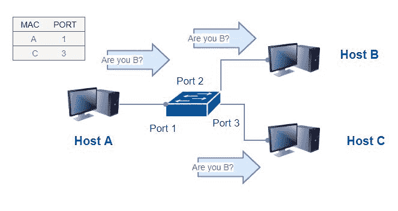

在这种情况下，CAM 最初包含两个地址及其端口信息。要从**主机 A**向**主机 B**发送流量，CAM 表中应包含**主机 B**的相关信息，但本演示中并非如此。因此**主机 A**向所有主机发送 ARP 请求。主机发回有关其 MAC 地址和端口的信息。现在**主机 A**有**主机 B**的相关信息并存储在 CAM 表中，如图所示：

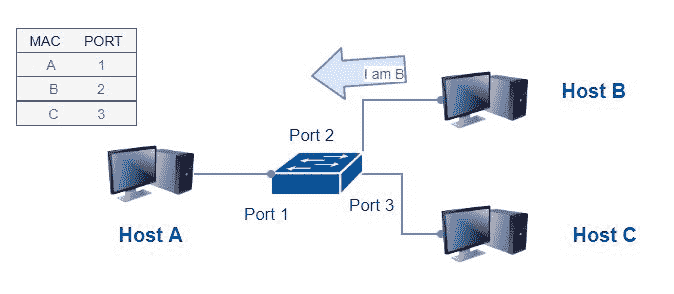

最后，CAM 表包含有关主机的所有必需信息，包括目标主机。因此，从**主机 A**到**主机 B**的流量应该正常运行：

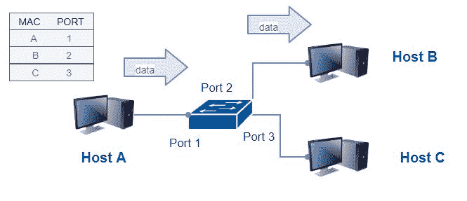

攻击者可以利用 CAM 表执行恶意活动。可以执行称为 CAM 溢出的攻击。换句话说，攻击者利用 CAM 表大小的最大限制使 CAM 表溢出。可用的工具有很多，其中一个是**macof**。让我们假设 CAM 表中充满了所有信息。攻击者可以通过发送随机源 MAC 地址（每分钟最多 155000 个 MAC 条目），使用 macof 洪泛交换机：

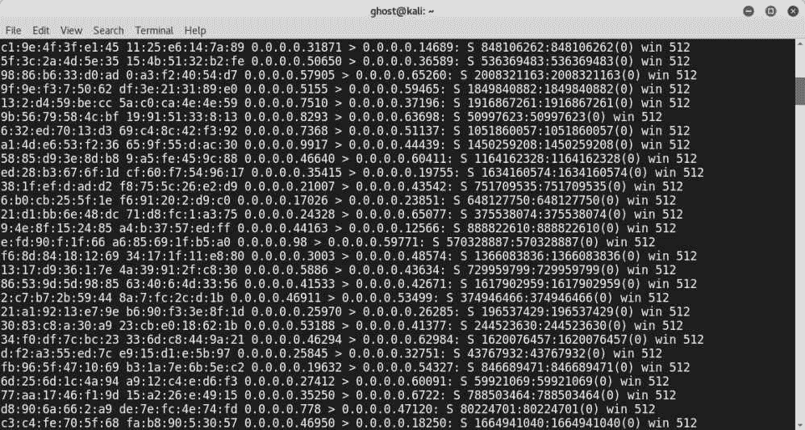

或者简单地说，您可以使用`macof -i eth1 2> /dev/null`。为了防止 MAC 洪泛，您需要使用端口安全性限制接口上的 MAC 地址数，如下图所示：

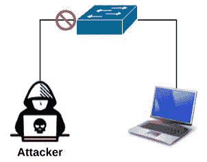

# 媒体访问控制安全

为了保护您的网络免受数据链路层攻击，并提供全面的以太网链路安全，您可以使用基于 802.1 AE 标准的**媒体访问控制安全**（**MACsec**）。MACsec 在网络层类似于 IPsec，它通过在网络节点之间使用**MACsec 密钥协议**（**MKA**）的逐跳加密（GCM-AES-128）提供完整性和机密性保护。因此，它加密所有以太网数据包，但不涉及源和目标 MAC 地址。切换到交换机模式下的 MACsec 与切换到主机模式不同。第一个被命名为下行链路 MACsec，主机在此经历 802.1x 身份验证过程。第二个是上行链路 MACsec。它可以在交换机上手动配置，也可以使用远程 RADIUS 服务器动态配置。下图显示通信已加密：

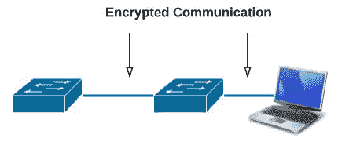

# DHCP 攻击

DHCP 是一种基于 RFC 2131 的网络层协议，允许动态地将 IP 地址分配给主机。将 IP 地址分配给特定主机需要以下四个步骤：

*   DHCP 发现
*   DHCP 提供
*   DHCP 请求
*   DHCP 确认

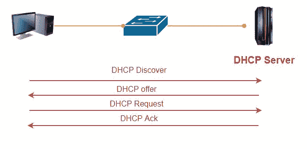

# 饥饿

在本章中，我们将讨论第 2 层攻击；我打赌你一定想知道为什么我们要讨论网络层协议（在我们的例子中是 DHCP）。答案很简单。攻击者可以执行我们称之为 DHCP 饥饿的操作。攻击者使用伪造的 MAC 地址广播 DHCP 请求；此攻击利用 DHCP 服务器地址空间进行攻击。这种攻击可以使用简单的工具完成，例如*狼吞虎咽。*

# 恶意 DHCP 服务器

恶意 DHCP 服务器（可以是家庭路由器或调制解调器）是攻击者在网络中实施的服务器，用于执行中间人攻击或嗅探网络流量。恶意服务器的这种实现使攻击者能够收集大量信息，包括 DNS 服务器信息和默认网关。为了防御 DHCP 攻击，您需要使用 DHCP 窥探，这是一种交换机功能，用于识别响应 DHCP 请求的端口。

# ARP 攻击

**地址解析协议**（**ARP**）是一种基于 RFC 826 标准，将 IP 地址与其相关 MAC 地址映射的协议。ARP 在许多操作系统中实现，包括 Linux。

您可以使用`arp`命令进行检查：

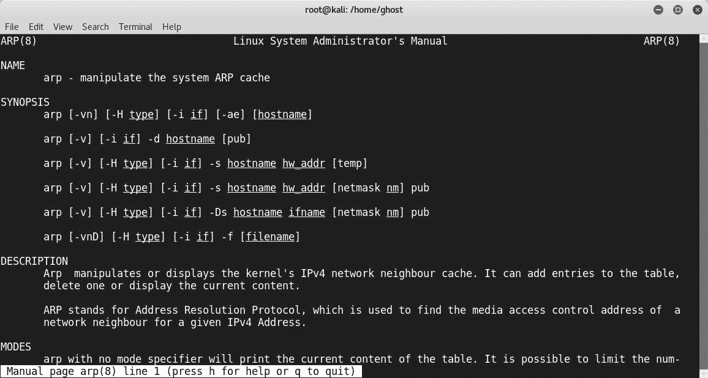

攻击者可以利用其缓存，使用诸如 eTerCap 的工具执行中间人攻击：

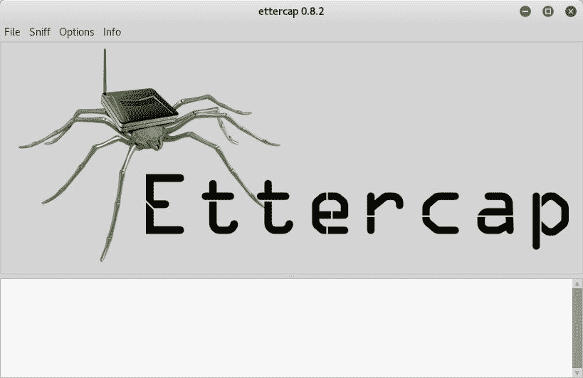

如果您已经在使用 Kali Linux，还可以使用`dsniff`实用程序：

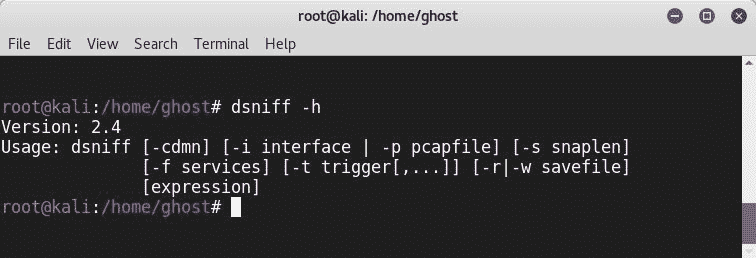

攻击者可以使用 ARP 协议的 IP/MAC 匹配功能将其 MAC 地址映射为合法 IP 地址。如果您使用的是 Kali Linux，那么可以直接从主菜单使用它。

为了防御 ARP 攻击，最好通过检查数据包是否与绑定表条目匹配来使用动态 ARP 检查，否则数据包将被丢弃；但首先需要配置 DHCP 侦听。

这是正常的 ARP 操作：


这是 ARP 欺骗攻击的示例：


# VLAN 攻击

VLAN 是同一广播域中网络设备的逻辑分组。这种逻辑分离在许多情况下非常有益。例如，如果我们有不同的地理位置，使用 VLAN 可能是一种将网络设备分组的好方法，即使它们位于不同的位置，但它们的行为就像一个广播域。此图说明了一个经典的交换体系结构；每个特定的企业部门都有一个特定的开关：

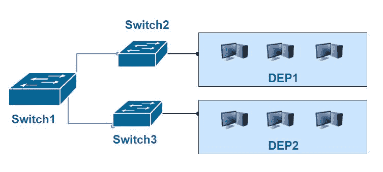

下图说明了实施 VLAN 的有益结果。我们可以为许多不同的部门配置交换机：


交换操作发生在第二层，但当我们使用 VLAN 时，我们需要一个路由器（第三层）通过名为**VLAN 间路由**的操作使 VLAN 相互通信。VLAN 中继需要通过使用 VLAN ID（介于 0 和 4095 之间的数字）标记每个帧来互连交换机，以标识 VLAN。这里使用集群协商，这得益于**动态中继协议**（**DTP**）：

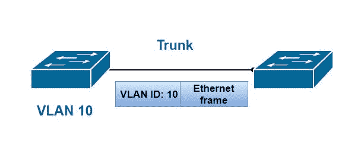

当交换机和路由器支持 VLAN 时，VLAN 实现是可能的。这意味着，它们支持中继协议，如 Cisco 专有的**交换机间链路**（**ISL**）和 IEEE 802.1q。如果交换机支持中继，则称为**受管交换机**。

# VLAN 的类型

VLAN 有多种类型。其中两项是：

*   **本机 VLAN 或未标记 VLAN**：如果主机在没有指定 VLAN ID 的情况下向交换机端口发送流量，则该流量将被分配未标记 VLAN
*   **标记的 VLAN**：当数据包被标记为 VLAN ID 时使用

# VLAN 配置

要在交换机上配置 VLAN，您需要遵循以下配置：


*   第一个 VLAN：

```
switch#configure terminal
switch(config)#vlan 10
switch(config-vlan)#exit
switch(config)#
```

*   第二个 VLAN：

```
switch#configure terminal
switch(config)#vlan 20
switch(config-vlan)#exit
switch(config)#
```

*   分配端口：

```
switch#configure terminal
switch(config)#interface FastEthernet 0/1
switch(config-if)#switchport mode access
switch(config-if)#switchport access vlan 10
 switch#configure terminal
switch(config)#interface range FastEthernet 0/2 - 8
switch(config-if-range)#switchport mode access
switch(config-if-range)#switchport access vlan 10
```

# VLAN 跳转攻击

VLAN 跳转攻击基于 DTP。DTP 的主要作用是自动化 802.1q 或 ISL 中继配置：

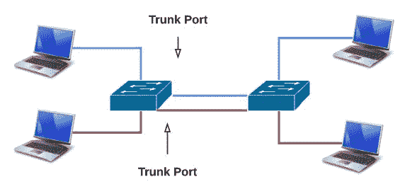

# 交换机欺骗

在此攻击过程中，攻击者通过模拟 ISL 或 802.1q 并使用 DTP 发送信号来模拟交换机。因此，它看起来像一个带有中继端口的交换机，因此它可以访问所有 VLAN。

# VLAN 双重标记

这种攻击有时称为双重 802.1q 封装攻击，通过发送 802.1q 双重封装帧来完成。一般来说，开关一次只执行一次脱封操作。因此，他们将剥下第一个，并将第二个送出。仅当攻击和目标位于同一 VLAN 上时，即使主干端口关闭，也可能发生此攻击：


# 专用 VLAN 攻击

我们在前面的章节中看到，VLAN 将 LAN 划分为广播域。**专用 VLAN**（**PVLAN**）也是 VLAN 的子域，存在孤立子域，如子 VLAN。

VLAN 需要第 3 层设备（如路由器）相互通信，PVLAN 也需要路由器通信，但主机仍在同一 IP 子网中。我们有三个 PVLAN 端口：

*   **混杂（P）**：连接路由器
*   **隔离（I）**：连接主机
*   **社区（C）**：连接到其他社区端口

攻击者可以通过发送带有 IP 和 MAC 地址以及目标 IP 地址的帧来攻击 PVLAN：


# 生成树协议攻击

**生成树协议**（**STP**）由 Radia Perlman 于 1985 年开发，用于解决以太网环路问题，但在深入研究 STP 之前，让我们回到这个问题的根本原因。如果发生广播风暴，您将失去网络可用性。当我们有一个以太网环路时，就会发生这种情况。作为一个简单的例子，在下图中，我们有三个连接的交换机。如果一个交换机向另外两个交换机发送广播，它们将通过所有端口转发广播来接收和重播广播，因为它们找不到地址。此外，他们将进行一个称为**广播风暴**的重复循环：

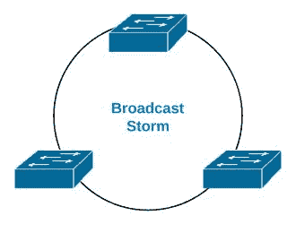

这样，由于基于 IEEE 802.1d 标准的**生成树算法**（**STA**，STP 似乎通过阻塞冗余路径解决了这个联网问题，这确保了两个站点之间只有一条路径可用：

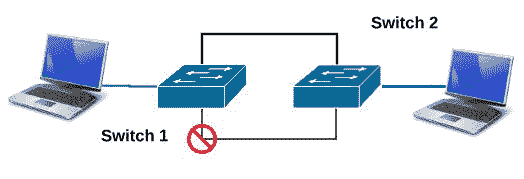

但在使用 STP 时，您会阻止哪些端口？在 STP 中，有五种类型的端口：

*   **学习端口**：该端口学习 MAC 地址，但不转发帧
*   **监听端口**：该端口不学习 MAC 地址或转发 MAC 地址
*   **丢弃端口**：该端口不转发数据
*   **转发端口**：该端口学习 MAC 地址并转发数据
*   **禁用端口**：此端口自解释

以下工作流描述了 STP 中端口的各个阶段：

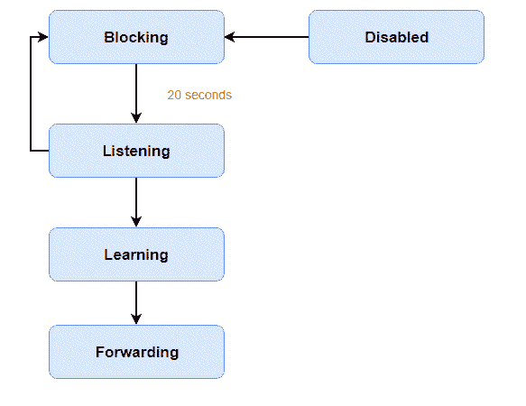

STP 执行以下三个步骤以实现其目标：

*   **根桥选**：交换机不是很智能的设备。因此，默认情况下，网络中的每个交换机都声称是根网桥，根网桥是控制拓扑的主交换机。选择根网桥时，所有交换机发送其**b****脊线 ID**（**BID**），即网桥优先级和 MAC 地址的 8 字节组合；默认情况下，它是 32768。具有最小出价的交换机被选为根网桥。
*   **选择根端口**：此选择基于简单的选择标准，即成本最低的**网桥协议数据单元**（**BPDU**）。因此，接收最低 BPDU 的端口将是根端口。
*   **选择指定端口**：指定端口为其他交换机端口（阻塞）。

# 攻击 STP

攻击者可以利用 STP 攻击网络。黑客攻击技术之一是在主干端口实现一个 rogue 交换机，并通过配置该 rogue 交换机并为其提供最低 ID 以成为根网桥来操纵生成树优先级。因此，所有流量将通过此交换机传输，然后它将嗅探所有流量或重定向流量。

要防御 STP 攻击，您需要在所有未指定为根端口的交换机端口上启用根防护：

```
Switch1(config)# interface gigabitethernet 0/1
Switch1(config-if)# spanning-tree guard root
```

# 总结

本章对如何利用第 2 层的弱点破坏网络进行了有益的解释。下一章将是一个深入的学习经验，解释如何利用 IP 语音系统。