# 九、VoIP 攻击

**IP 语音**（**VoIP**）正在将业务通信推向一个新的效率和生产力水平。基于 VoIP 的系统每天都面临着安全风险。尽管很多公司都关注 VoIP 服务质量，但他们忽视了 VoIP 基础设施的安全方面，这使得他们容易受到危险的攻击。本章将使用逐步指南解决大多数 VoIP 安全问题。

在本章中，我们将介绍以下主题：

*   VoIP 协议
*   VoIP 攻击
*   伏击
*   如何抵御 VoIP 攻击

# VoIP 基础知识

为了学习如何测试 VoIP，我们需要清楚地了解 VoIP 基础设施的实际工作方式。我们将剖析 VoIP 协议，以便稍后了解如何攻击 VoIP 系统。以下小节是语音和视频通信实现的一些众所周知的标准。让我们逐一探索。

# H.323

323 是**国际电信联盟标准化部门**（**ITU-T**推出的 IP 数据标准。如您所见，该标准化机构使用字母来定义基于许多标准的范围，如下所列：

*   **H**：用于视听和多媒体系统
*   **G**：用于传输系统和媒体
*   **Q**：用于切换和信令
*   **T**：用于远程信息处理服务的终端

323 是最古老的基于分组的通信系统协议之一。因此，该协议是稳定的。当前版本是 v6。许多供应商在许多产品中都很好地使用了它，如 Cisco call manager、NetMeeting 和 RadVision。

H.323 使用多种类型的设备：

*   **终端：**是 IP 电话、视频会议系统等用户设备。
*   **多点控制单元：**由两个逻辑组件组成，**多点控制器**（**MC**）和**多点处理器**（**MP**）。他们的角色是管理多点会议。
*   **网守：**这是可选的。网关守卫提供一些附加服务，如用户身份验证和地址解析。

H.323 堆栈基于以下组件：

*   IPv4 网络层
*   用户数据报协议层
*   实时协议
*   信令协议
*   呼叫前设置
*   视频编解码器
*   音频编解码器
*   数据

下图说明了 H.323 堆栈的不同组件：

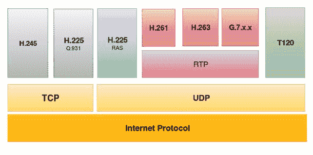

# 瘦呼叫控制协议

**Skinny Call Control Protocol**（**SCCP**）是由 Selsius 利用的 Cisco 专有协议。它被称为 skinny，因为它是一种用于 IP 电话和呼叫管理器通信的轻量级协议。此通信使用以下不同类型的消息：

*   **0001**：`RegisterMessage`
*   **0002**：`IPportMessage`
*   **0081**：`RegisterAckMessage`

这些消息采用以下格式：

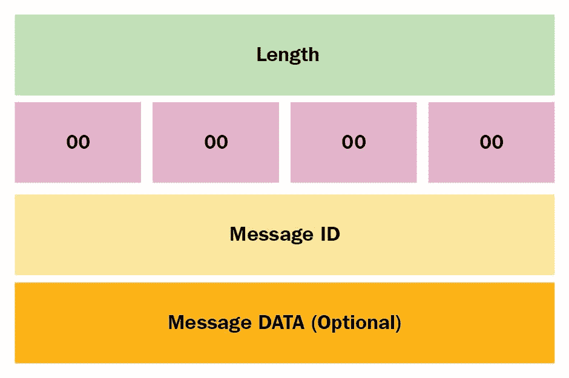

以下截图摘自 Wireshark 网站下载的使用 Wireshark 的瘦截图：

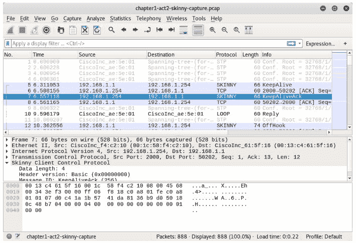

# RTP/RTCP

**实时协议**（**RTP**是一种基于 RFC3550 的传输协议，具体是通过**UDP**实现的。它用于实时多媒体应用和端到端实时数据流传输。为了实现这一点，例如，视频需要经过许多步骤：

1.  编码
2.  包装
3.  运输管制
4.  重新组装
5.  解码

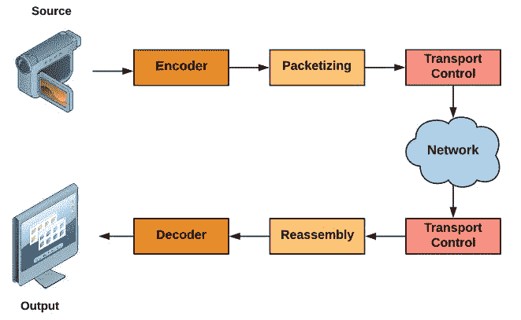

虽然指定 RTP 来承载媒体流，但有另一个与 RTP 一起工作的协议称为**实时控制协议**（**RTCP**。该协议与 RTP 并行工作，以监控传输并确保**服务质量**（**QoS**）。RTCP 的目的是检查过程中是否存在数据包丢失。

# 安全实时传输协议

**安全实时传输协议（SRTP）**是基于 RFC3711 的应用协议。SRTP 提供增强的安全特性；因此，它通过使用带有密钥流的 XOR 操作进行加密来保护 RTP。使用的算法是 AES，主密钥称为 SRTP MKI。下图说明了正常 RTP 数据包和安全 RTP 数据包之间的区别。Auth 字段包含消息身份验证代码。这些技术为语音通信提供了反重放机制，并确保其完整性：


# H.248 和媒体网关控制协议

**媒体网关控制协议**（**MGCP**是思科公司利用的协议。MGCP 的目标是处理信号和会话管理。它是媒体网关控制器和媒体网关之间的通信机制。因此，控制是集中的。换句话说，控制器与许多媒体网关通信。控制器还监控终端，并在其区域内注册新的终端。H.248 也类似于基于 ITU 的协议 H.323。它是 MGCP 的增强版。如图所示，MGCP 是一种主从协议：

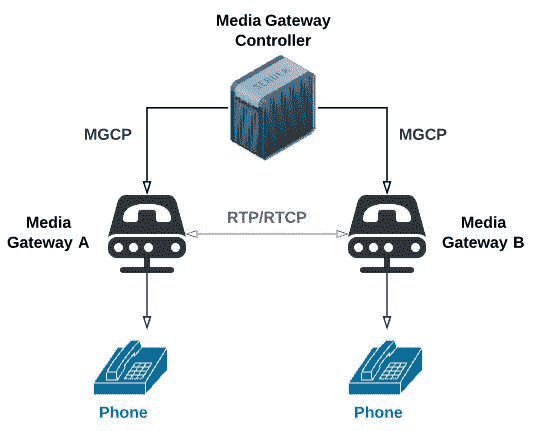

# 会话启动协议

**会话发起协议**（**SIP**是基于 RFC 3261 协议的会话管理协议。它同时在**UDP**和**TCP**上工作，还支持**TLS**。它比 H323 更具可扩展性。SIP 通过以下五个步骤处理呼叫：

1.  用户位置
2.  用户可用性
3.  用户能力
4.  会话设置
5.  会话管理

要启动 SIP 操作，用户需要注册：


下图描述了在两个用户代理客户端之间建立连接所需的步骤：


SIP 请求类似于 HTTP 请求。它们的格式如下：

`METHOD URI SIP/X.X`

`HEADER: XXX`

这里的方法是请求类型，我们有以下六种方法：

*   登记
*   邀请
*   阿克
*   取消
*   选择权
*   再见

SIP 回复请求需要以下格式：

`SIP/X.X <status code> description`

`Header: XXX`

*   **URI**：文件标识
*   **SIP/X.X**：SIP 版本
*   **头**：包含接收方的信息（To、From、Call ID 是一些 SIP 头字段）

以下是可能的状态代码：

*   `1xx`：信息性
*   `2xx`：成功
*   `3xx`：重定向
*   `4xx`：失败
*   `5xx`：服务器错误
*   `6xx`：全球失败

# VoIP 攻击

现在，在对在 VoIP 中扮演重要角色的主要协议有了清晰的了解之后，是时候学习如何渗透 VoIP 基础设施了。与任何其他渗透测试一样，要利用 VoIP 基础设施，我们需要遵循基于多个步骤的战略操作。

在攻击任何基础设施之前，我们已经了解到，在利用它之前，我们需要执行足迹、扫描和枚举，而这正是我们将使用 VoIP 所要做的。要执行 VoIP 信息收集，我们需要收集尽可能多的有关目标的有用信息。首先，你可以在网上做一个简单的搜索。例如，工作通知可能是一个有价值的信息来源。例如，以下工作描述让攻击者了解 VoIP：


稍后，攻击者可以搜索漏洞，尝试利用该特定系统进行攻击。搜索电话号码也可能是明智之举，根据语音信箱了解目标，因为每个供应商都有一个默认的电话号码。如果管理员没有更改，则收听语音邮件可以让您了解您的目标。如果您想查看一些默认语音邮件，请选中[http://www.hackingvoip.com/voicemail.html](http://www.hackingvoip.com/voicemail.html) 。这是一个很好的资源，可以学习很多关于黑客入侵 VoIP 的知识。

谷歌黑客是一种搜索信息和在线门户的惊人技术。在前几章中，我们讨论了使用 Dorks 进行谷歌黑客攻击。以下演示是此 Google Dork 在 URL:Network Configuration Cisco 中的输出：


您可以使用`Shodan.io`搜索引擎查找已连接的 VoIP 设备：


VoIP 设备通常连接到 internet。因此，外人可以接触到他们。它们可以通过其 web 界面公开；这就是为什么，有时将安装文件公开可能是危险的，因为使用搜索引擎会导致对门户进行索引。以下屏幕截图取自在线星号管理门户：


此屏幕截图取自一个公开网站的配置页面，使用一个简单的搜索引擎查询：

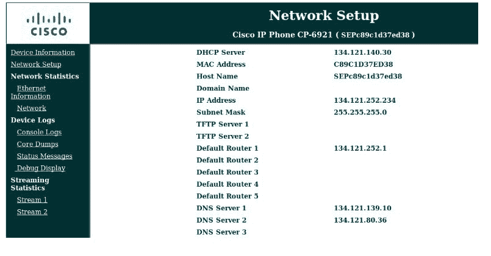

从攻击者的角度来看，在收集了有关目标的丰富信息后，我们通常应该执行扫描。在此阶段，使用前几章中讨论的扫描技术是必要的。执行主机发现和 Nmap 扫描是扫描基础架构以搜索 VoIP 设备的好方法。

扫描可以引导我们发现 VoIP 服务。例如，我们在 Nmap 中看到了检查服务的`-sV`选项。在 VoIP 中，如果端口`2000`打开，则为 Cisco CallManager，因为 SCCP 协议使用该端口作为默认端口，或者如果存在 UDP`5060`端口，则为 SIP。

`-O`Nmap 选项可用于识别正在运行的操作系统，因为有许多 VoIP 设备正在特定的操作系统上运行，如 Cisco embedded。

你知道现在该怎么办了。在足迹和扫描之后，我们需要枚举目标。正如您所见，在利用基础设施时，我们通常遵循相同的方法步骤。

横幅抓取是枚举中一种众所周知的技术，枚举 VoIP 基础设施的第一步是启动横幅抓取移动。为此，使用 Netcat 实用程序将帮助您轻松获取横幅，或者您可以简单地使用名为 banner 的 Nmap 脚本：

```
nmap -sV --script=banner <target>
```

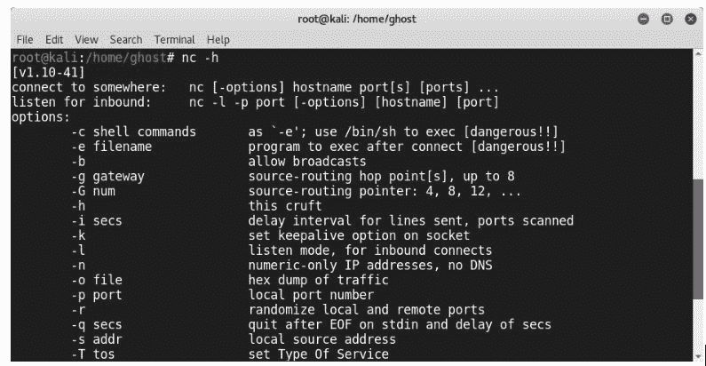

对于特定的供应商，有很多枚举工具可以使用；EnumIAX 就是其中之一。它是 Kali Linux 中的内置枚举工具，用于强制执行星号间交换协议用户名：

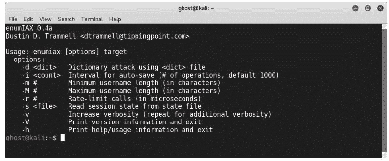

**Automated Corporate Enumerator**（**ACE**）是 Kali Linux 中的另一个内置枚举工具：


`svmap`是 Kali Linux 中用于识别 SIP 设备的开源内置工具。键入`svmap -h`您将获得此神奇工具的所有可用选项：

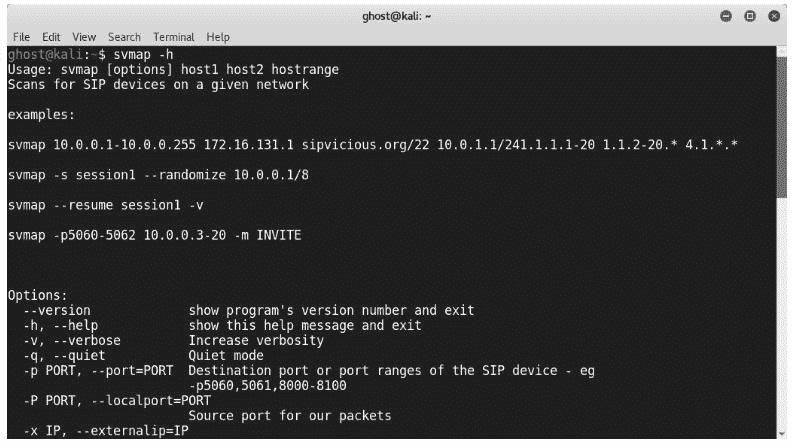

# VoIP 攻击

现在，您已经学习了执行 VoIP 示意图、扫描和枚举所需的技能。让我们来了解主要的 VoIP 攻击。VoIP 面临来自不同攻击载体的多种威胁。

# 拒绝服务

**拒绝服务**（**拒绝服务**）是对网络可用性的威胁。此攻击已在前几章中讨论过。DoS 对于 VoIP 来说也可能是危险的，因为确保呼叫的可用性在现代组织中至关重要。如今，不仅通话的可用性，而且通话的清晰性都是必要的。要监控 VoIP 的 QoS，您可以使用许多现有的工具；其中之一是 CiscoWorks QoS 策略管理器 4.1：

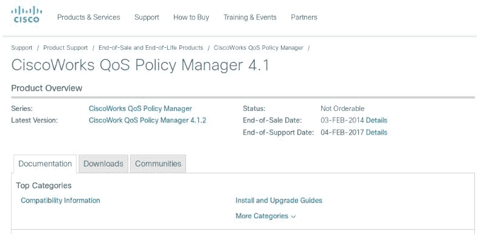

为了衡量 VoIP 的质量，有一些评分系统，例如**平均意见评分**（**MOS**）或基于多个参数（抖动、延迟和丢包）的 R 值。平均意见得分范围为 1 到 5 分（差到非常清晰），R 值得分范围为 1 到 100 分（差到非常清晰）。以下截图摘自对 Wireshark 网站下载的 RTP 数据包的分析：


您还可以分析 RTP 抖动图：


VoIP 基础设施可能受到经典 DoS 攻击。我们以前见过其中一些：

*   蓝精灵洪水攻击
*   TCP 同步洪水攻击
*   UDP 泛洪攻击

DoS 攻击工具之一是`iaxflood`。在 Kali Linux 中可以执行 DoS 攻击。**IAX**代表**星号间交换**。

打开一个 Kali 终端并键入 `iaxflood <Source IP> <Destination IP> <Number of packets>`：


VoIP 基础设施不仅会受到先前攻击，攻击者还可以使用模糊工具执行数据包碎片和格式错误的数据包来攻击基础设施。

# 窃听

**窃听**是最严重的 VoIP 攻击之一。它允许攻击者接管您的隐私，包括您的通话。有许多窃听技术；例如，攻击者可以在 TFTP 配置文件包含密码时嗅探网络中的 TFTP 配置文件。下面的屏幕截图描述了对**TFTP**捕获的分析：

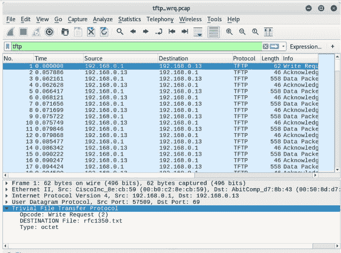

此外，在记录所有传出和正在进行的呼叫后，攻击者可以获取电话号码并建立有效的电话号码数据库。窃听还不止于此，攻击者可以通过**双音多频**（**DTMF**来记录您的通话，甚至知道您在键入什么。您可以从此链接[使用 DTMF 解码器/编码器 http://www.polar-electric.com/DTMF/](http://www.polar-electric.com/DTMF/) ：


**配置错误的互联网电话上的语音**（**VOMIT**）是将 Cisco IP 电话对话转换为 WAV 文件的一个非常有用的工具。您可以从其官方网站[下载 http://vomit.xtdnet.nl/](http://vomit.xtdnet.nl/) ：


# SIP 攻击

另一种攻击技术是 SIP 盗贼。我们可以执行两种类型的 SIP 流氓。从攻击者的角度来看，我们可以实现以下功能：

*   **流氓 SIP B2BUA**：在这种攻击技术中，攻击者模仿 SIP B2BUA：


*   **SIP rogue 作为代理**：在这里，攻击者模仿 SIP 代理：

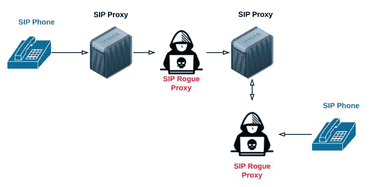

# SIP 注册劫持

**SIP 注册劫持**是一个严重的 VoIP 安全问题。之前，我们看到在建立 SIP 会话之前，有一个注册步骤。注册可能被攻击者劫持。在 SIP 注册劫持攻击期间，攻击者通过拒绝服务禁用正常用户，并简单地使用其自己的 IP 地址而不是该用户发送注册请求，因为在 SIP 中，消息传输清晰，因此 SIP 无法确保信令消息的完整性：


如果您是 Metasploit 爱好者，可以尝试许多其他 SIP 模块。通过键入`msfconsole`打开 Metasploit 控制台，并使用`search SIP:`搜索 SIP 模块

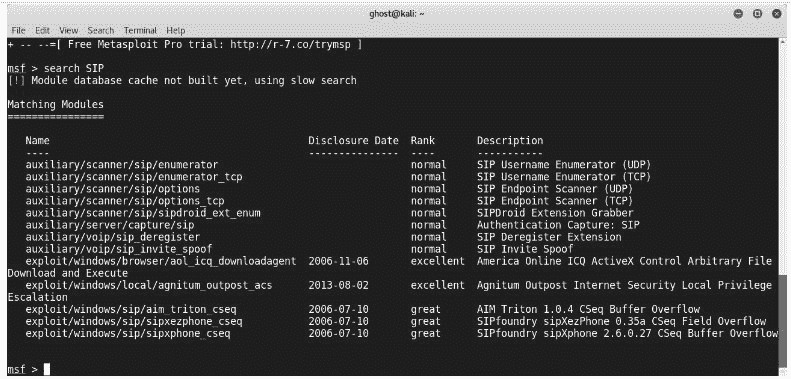

要使用特定的 SIP 模块，只需键入`use <module >`。以下接口是 SIP 模块使用的示例：

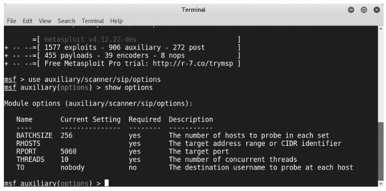

# 互联网电话上的垃圾邮件

**互联网电话**（**SPIT**）上的垃圾邮件，有时称为**语音垃圾邮件**，类似于电子邮件垃圾邮件，但会影响 VoIP。要执行 SPIT 攻击，您可以使用名为**spitter**的生成工具。

# 嵌入恶意软件

**恶意软件**是 VoIP 基础设施的主要威胁。不同类型的恶意软件（如蠕虫和 VoIP 僵尸网络）可以利用不安全的 VoIP 端点进行攻击。

软电话也极有可能成为攻击者的目标。危害您的软电话可能非常危险，因为如果攻击者利用它，他们可能会危害您的 VoIP 网络。恶意软件不是针对 VoIP 端点的唯一威胁。VoIP 固件是黑客的潜在攻击向量。固件黑客攻击可能导致手机受损。

# Viproy–VoIP 渗透测试套件

**Viproy VoIP 渗透测试套件（v4）**是一款 VoIP 和统一通信服务测试工具，由 Fatih Ozavci 在 2014 年美国黑帽兵工厂大会上展示：


要下载此项目，请从其官方存储库[中克隆它 https://github.com/fozavci/viproy-voipkit:](https://github.com/fozavci/viproy-voipkit)

`# git clone https://github.com/fozavci/viproy-voipkit.`

以下项目包含许多用于测试 SIP 和 Skinny 协议的模块：

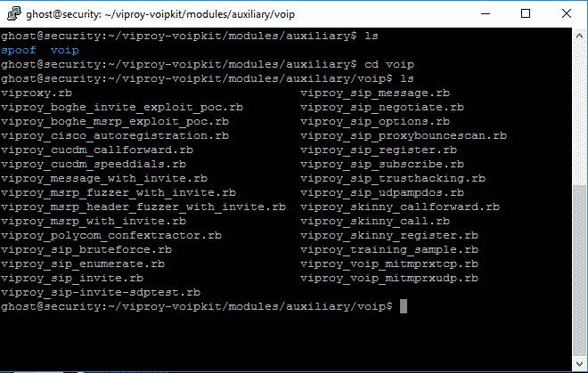

要使用它们，请将`lib`、`modules`和`data`文件夹复制到系统中的`Metasploit`文件夹中。

# 电压利用

**LTE 语音**（**VoLTE**通过 4G 网络传输语音。除了提供更好的覆盖范围外，它的通话质量高于其他 VoIP 变体。VoLTE 以及其他语音技术面临着来自攻击者的各种威胁。让我们开始探索 VoLTE 的基本原理，以便以后学习如何攻击它。**L****长期演进****LTE**由**第三代合作伙伴项目****3GPP**于 2014 年利用。它是一个基于 IP 的分组交换网络。它使用两种模式：**时分双工**（**TDD**）和**频分双工**（**FDD**）。LTE 架构由以下三个主要组件组成：

*   **用户设备**（**UE**）
*   **演进后的 UMTS 地面无线接入网**（**E-UTRAN**。
*   **演进包核心**（**EPC**）

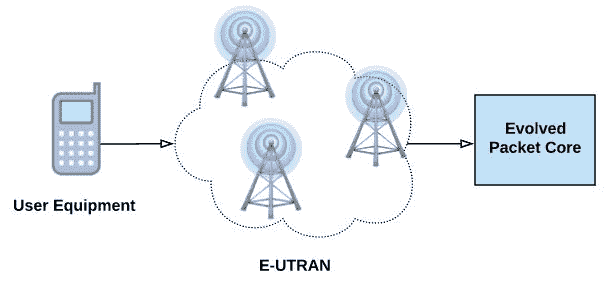

# 伏击

VoLTE 已经被一些电信公司采用，如 AT&T 和 T-Mobile。尝试和利用 VoLTE 中涉及的通信协议是许多研究的中心。Sreepriya Chalakkal 的一篇研究论文介绍了对 VoLTE 的几次攻击。以下是一些攻击：

*   嗅探电压接口
*   GSM SIM 中的公开密钥
*   用户位置操纵
*   漫游信息处理
*   旁道攻击

# SiGploit–电信信令利用框架

SiGploit 是一个安全框架，帮助电信安全专业人员增强移动网络基础设施。要测试项目，请从[克隆它 https://github.com/SigPloiter/SigPloit:](https://github.com/SigPloiter/SigPloit)

```
# git clone https://github.com/SigPloiter/SigPloit
```

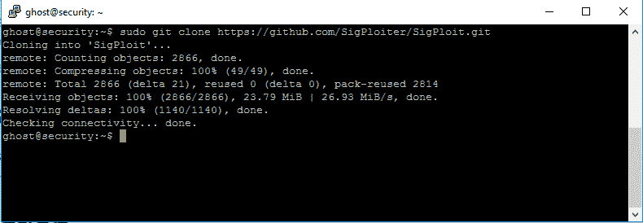

要使用该工具，请转到`bin`目录并运行`SiGsploit.py`脚本：

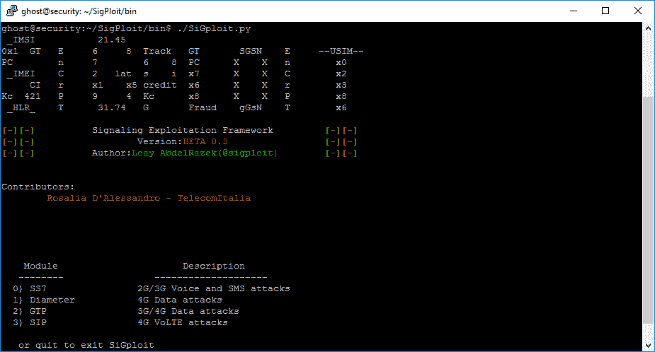

# 总结

在本章中，我们演示了如何利用 VoIP 基础设施。我们首先研究 VoIP 中涉及的核心协议。然后，除了渗透测试人员最常用的工具和实用程序外，我们还探讨了主要的 VoIP 攻击以及如何防御这些攻击。本章结束时，我们概述了一些针对 VoLTE 的最新攻击。