# 不安全的 VPN 攻击

**虚拟专用网络**（**VPN**）在以安全方式传输数据方面非常有用。VPN 实现了信息安全，但它们每天仍面临来自黑客的高风险。如果您想了解如何保护 VPN，本章将指导您从所需的密码学基础知识获得保护 VPN 所需的技能。

本章将涵盖以下主题：

*   密码学
*   VPN 基础
*   不安全的 VPN 攻击

# 密码学

在密码学领域，我们有两门不同的科学：密码学和密码分析。密码学基于数学算法保护信息安全，而密码分析处理的是公开密码学系统创建的密文。这两门科学并存。更简单地说，密码学处理隐藏信息，密码分析破坏密码系统以揭示隐藏信息。密码学不是一门新的科学，它是古老的。有一些经典的密码技术，如苏美尔楔形文字、埃及象形文字、scytale、Vigenère 密码、Caesar 密码和 ROT13 密码。

# 密码系统

密码技术的实现称为密码系统；有时它被称为密码系统。下图描述了一个简单的密码系统。发送方使用加密算法对明文进行加密，这是一个使用加密密钥的数学过程。该操作的输出生成将由接收方使用解密算法和解密密钥解密的密文，因此该密文将以明文形式可读：

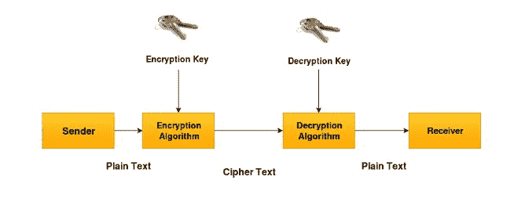

# 密码

密码是加密的信息。攻击者可能会截获密码。我们有两种主要的密码：古典密码和现代密码。让我们一个接一个地发现它们。

# 经典密码

这种类型在计算机时代之前就存在，它有以下两个部分：

*   **转置**：使用置换。明文被重新排列为另一种格式。角色仍然相同，但位置不同。
*   **替换**：使用字符替换，即用另一个字符替换一个字符，如用*M*替换*O*。发送方和接收方都应该知道替换算法。ROT13 和**凯撒密码是替代密码的两个示例。**

 **ROT13 是一种替换密码，其中明文中字符的位置移动了 13 位。所以，如果明文是*HELLO，***，那么密文应该是*URYYB，*，如图*：***

****

凯撒密码是朱利叶斯·凯撒（Julius Caesar）使用的一种替换密码，其中明文消息的每个字符都按预定义的位数移位。作为演示，假设移位号为**2**，那么*HELLO 的密文*就是***JGNNQ，*，如图所示。此密码很容易被破解，您最多可以尝试 25 次移位，直到找到可读文本：**

 **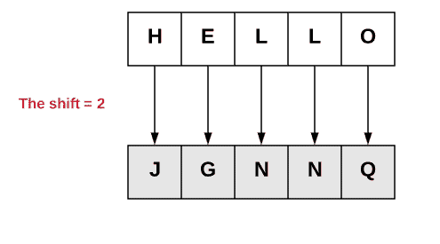

# 现代密码

现代密码又分为两种类型：

*   **分组密码**：这些处理信息分块处理。每个块将分别在加密和解密中进行处理。**数据加密标准**（**DES**）是最常用的分组密码之一，基于 IBM 研究员 Horst Feistel 开发的 Feistel 密码，旨在尝试构建实现 Claude Shannon 的**替换置换**（**s-P**的理想分组密码结构网络。下图说明了 Feistel 结构：

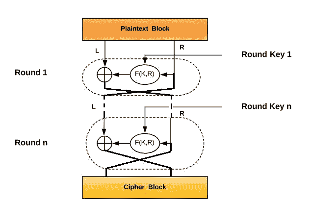

*   **流密码**：在加密和解密过程中逐位或逐字节处理信息。例如，要加密消息，使用与消息大小相同的种子密钥生成密钥流，然后进行加密。下图说明了两种密码类别：

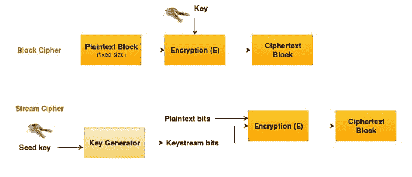

# 密码系统的 Kerckhoffs 原理

为了检查你是否拥有一个好的、安全的密码系统，一位名叫 Auguste Kerckhoffs 的荷兰密码学家提出了一套设计安全密码系统的法律和原则。这些文章发表在 1883 年的一篇文章*军事密码学*中。如果你想阅读全文，请阅读 Auguste Kerckhoffs，*军事密码学杂志，*军事科学杂志，第九卷，第 5-38 页，第二期，军事密码学设计，1883 年 1 月。Kerckhoffs 关于密码系统的六个原则如下所示：

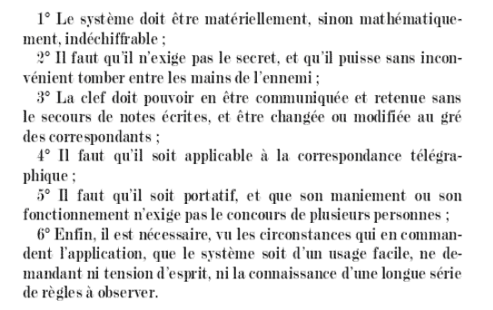

以下是翻译成英语的六条原则：

*   密码系统即使不是数学上的，实际上也应该是牢不可破的
*   密码系统落入入侵者手中不应导致系统的任何危害，从而避免给用户带来任何不便
*   钥匙应易于传达、记忆和更换
*   密文应该可以通过电报传输，这是一种不安全的信道
*   加密设备和文件应便于携带，并可由一个人操作
*   最后，该系统必须易于使用，既不需要精神紧张，也不需要了解一系列需要遵守的规则

# 密码系统类型

说到密码系统，我们有两大类基于加密解密密钥的对称密码系统和非对称密码系统。如果系统使用相同的密钥进行加密和解密，则它将是对称密码系统，否则，密码系统是不对称的，因为加密中使用的密钥与解密中使用的密钥不同。

# 对称密码体制

各种类型的对称密码系统如下所示：

*   **数据加密标准（DES）**：由 IBM 开发。它最初是 Lucifer encryption，后来由**国家标准与技术研究所**（**NIST**发布。此加密使用 56 位密钥：

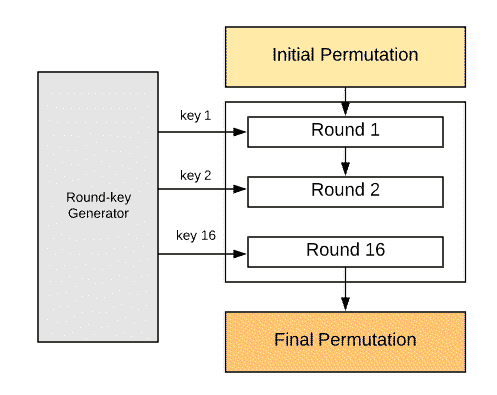

以下工作流中描述了“取整”功能：

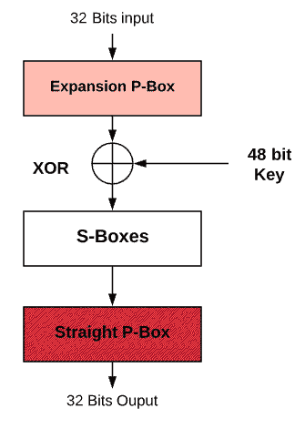

密钥生成使用以下工作流完成：

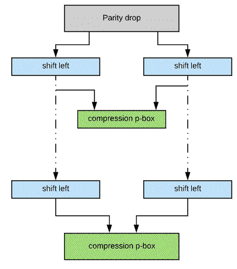

初始置换和最终置换由两个反向置换盒（P 盒）完成：

*   **三重 DES（3DES）**：此加密是 DES 的增强版。它使用 168 位密钥，因为用户生成三个密钥 k1、k2 和 k3。第一个密钥 k1 用于加密单个 DES。第二个密钥 k2 用于解密第一步的输出。最后一个密钥 k3 用于加密前一步，即单个 DES：

*   **高级加密标准（AES）**：AES 是 DES 的替代品。它更快（大约快六倍）而且更强壮。它使用 Rijndael 密码：

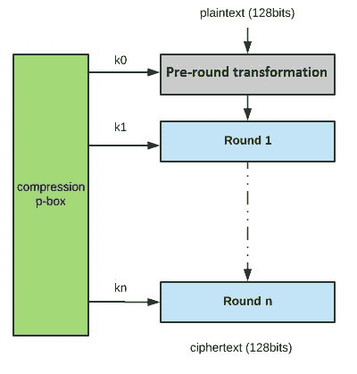

*   **里维斯特密码 5（RC5）**：这是一种由麻省理工学院教授罗纳德·里维斯特开发的非对称密码系统。RC5 由以下三个主要部分组成：
    *   密钥扩展算法
    *   加密算法：

>

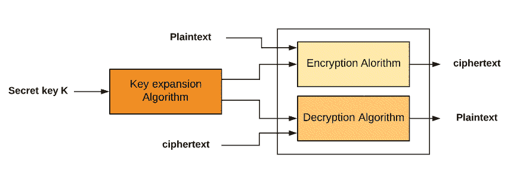

RC6 源于 RC5，块大小为 128 位，密钥大小灵活。

# 非对称密码体制

以下是非对称密码系统的算法：

*   **Rivest Shamir Adleman（RSA）**：RSA 是互联网上使用最广泛的密码系统之一。它是由麻省理工学院的 Ron Rivest、Adi Shamir 和 Leonard Adleman 开发的。使用 RSA 时，将生成一对密钥、一个私钥和一个公钥。
*   **Diffie-Hellman 密钥交换**：Diffie-Hellman 密钥交换是一种创建密钥的方法，在该操作过程中不需要共享和交换信息。

其基本思想如下：

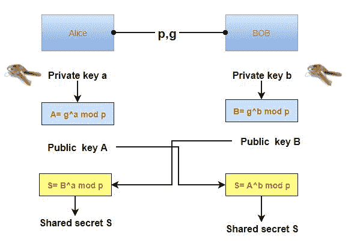

*   **El Gamal**：El Gamal 是一种基于 Diffie–Hellman 密钥交换的密码系统

# 散列函数和消息完整性

哈希函数是数学函数，它接受任意大小的输入字符串，并生成一个称为哈希值或消息摘要的固定大小的输出。一个好的散列函数
应该很容易计算散列；计算一个给定的
散列的明文将非常困难，并且它不会为两个不同的输入生成相同的散列，除非在极少数情况下。

现在有许多著名的散列函数使用；详情如下:

*   **散列消息认证码**
*   **消息摘要**（**MD2**
*   **消息摘要**（**MD4**
*   **消息摘要**（**MD5**），如果要加密或解密明文，可以使用[http://md5decrypt.net/en/](http://md5decrypt.net/en/) 如图所示：

*   **安全哈希算法**（**SHA**
*   **惠而浦**
*   **哈弗**
*   **RIPEMD**

# 数字签名

数字签名的主要目标是验证消息或文档的真实性和完整性。你可以把它看作电子指纹。下图显示了签署文档的步骤：

# 隐写术

隐写术是将信息隐藏在人类可读介质中的一门艺术，如图像文件、视频、文本等。更改应该是肉眼看不到的，以屏蔽托管文件后面的消息。两种类型的隐写术如下所示：

*   文本隐写术：
    *   行移位编码
    *   字移位编码
    *   特征编码

*   图像隐写术：
    *   **最低有效位**（**LSB**）：在 8 位图像的每个像素中隐藏 1 位数据，在 24 位图像的每个像素中隐藏 3 位数据。您可以使用`steglsb`执行 LSB 隐写术：

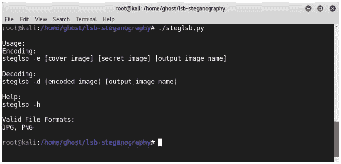

# 密钥管理

密钥管理是保护加密密钥的过程。为了确保这种保护，必须维持生命周期，如图所示：

*   密钥创建
*   钥匙保护和保管
*   键旋转
*   密钥销毁
*   密钥托管

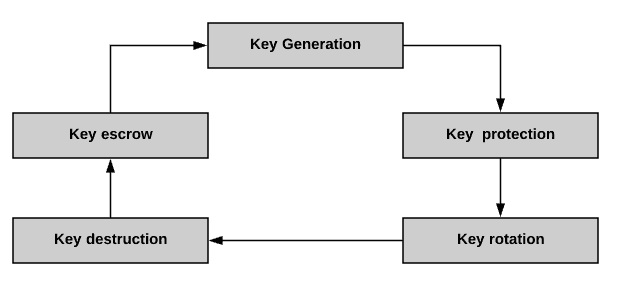

# 加密攻击

为了检索信息的明文，攻击者和密码分析师正在使用许多技术：

*   **暴力攻击（BFA）**：在这次攻击中，攻击者将尝试所有的密钥组合来检索密钥
*   **字典攻击**：在此攻击中，攻击者使用准备好的字典并尝试其中的单词
*   **生日攻击**：在生日攻击中，攻击者使用哈希冲突
*   **仅密文攻击（COA）**：在该攻击中，攻击者拥有密文，只需确定密钥即可
*   **已知明文攻击（KPA）**：攻击者使用我们称之为线性密码分析的方法从密码中检索丢失的明文，同时他知道密码的部分明文
*   **选择明文攻击（CPA）**：攻击者在自行选择密文和明文后，使用差分密码分析检索密钥
*   **侧通道攻击（SCA）**：攻击者使用硬件攻击密码系统，使用功耗或 CPU 周期来利用密码系统物理实现中的弱点
    *   **定时攻击**：攻击者分析加密算法的计算次数
    *   **功耗分析攻击**：这与定时攻击相同，但攻击者不是研究时间，而是分析功耗
    *   **故障分析攻击**：攻击者通过研究密码系统中的错误来收集更多信息

# VPN 基础

说到信息技术，密码学在保护处于不同状态的信息方面发挥着巨大的作用。各种技术应用每天都使用加密技术，如磁盘加密、电子邮件安全和通信。VPN 就是其中之一。根据定义，VPN 是两个站点之间的逻辑网络。VPN 的流量是加密的。

在加密中，我们有以下两种模式：

*   **链路加密**：在这种模式下，所有信息都是加密的，每一跳都需要对消息进行解密。在这种情况下，路由器应该解密消息，以便知道路由信息，再次加密，并将其转发到下一跳。
*   **端到端加密**：在此模式下，如图所示，所需报头中的信息未加密，例如路由器不需要解密，因为路由信息是清晰的：

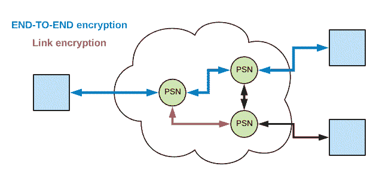

# 隧道协议

VPN 中使用了两种技术：SSL 和**互联网协议安全**（**IPSec**。我们将以详细和全面的方式讨论这两种技术，但现在，让我们看看不同的隧道协议：

*   **点对点隧道协议**（**PPTP**）
*   **二层隧道协议**（**L2TP**

# IPSec

IPSec 是一个协议套件，支持系统之间的安全性。所谓安全性，我指的是第一章中讨论的信息安全的三个基本基石中的一些：机密性和完整性，以及身份验证和防重放保护。IPSec 使用以下两种协议：

*   **认证头（AH）协议**：该协议用于对流量进行认证，而不是加密。使用散列函数（MD5 或 SHA1）执行身份验证。
*   **封装安全有效载荷（ESP）协议**：该协议也用于身份验证，但也支持加密。

IPSec 以以下两种不同的模式运行：

*   **隧道模式**：在这种模式下，整个数据包被封装和转发。它广泛应用于 VPN 中。在原始 IP 头的顶部添加一个新的 IP 头。
*   **传输模式**：此模式用于系统间的端到端加密。将 AH 标头添加到 IP 标头：

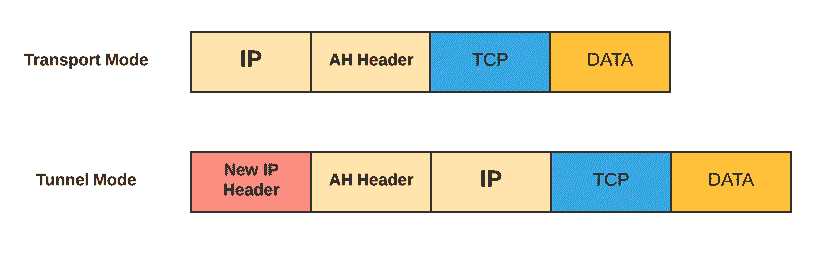

下图说明了两种不同的协议和不同的模式：

# 安全套接字层/传输层安全

**安全套接字层**（**SSL**是一种应用层协议。如果在安全模式下使用现代浏览器，则浏览器与 web 服务器之间的连接由 SSL 保护。SSL 更安全的版本是**传输层安全**（**TLS**）。如果网站由 SSL 证书保护，则 HTTPS 标志将出现在您的 URL 栏中：

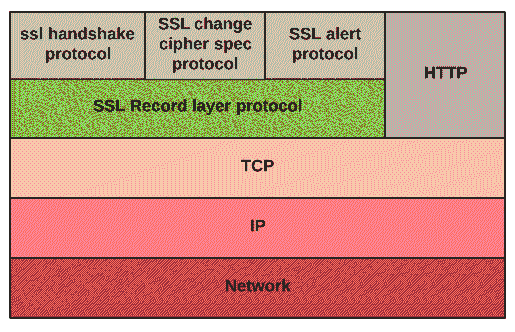

SLL/TLS 操作如下所示：

# SSL 攻击

本节将讨论多年来发生的主要 SSL 攻击。

# 溺水袭击（CVE-2016-0800）

溺水攻击是一种破坏加密的技术。当发现攻击时，他们发现超过 33%的 HTTPS 服务器易受攻击。仍然支持 SSLv2 的服务器易受此攻击。在溺水攻击中，攻击者发送具有相同私钥的探测来解密 TLS 通信。因此，所有信息都将被公开。不仅支持 SSLv2 的服务器易受攻击，而且攻击者还可以使用另一个支持 SSLv2 的服务器的私钥发起攻击。

要测试您的服务器是否容易受到溺水攻击，您可以使用[https://pentest-tools.com/network-vulnerability-scanning/drown-ssl-scanner](https://pentest-tools.com/network-vulnerability-scanning/drown-ssl-scanner) ：

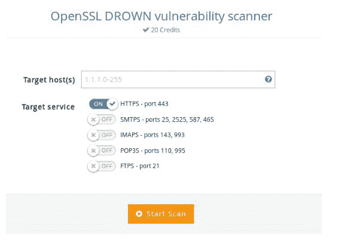

为了防御溺水攻击，建议您在服务器上禁用 SSLv2；确保私钥未被允许 SSLv2 连接和升级 OpenSSL 加密库的任何其他服务使用。

# 贵宾犬攻击（CVE-2014-3566）

2014 年发现了对甲骨文进行降级的传统加密（**贵宾犬**攻击的**漏洞。此攻击利用了一个事实，即许多服务器一方面支持 SSLv3，另一方面支持块填充漏洞。下图演示了贵宾犬攻击：**

通常，作为第一步，客户端发送受支持的 TLS 版本。在这种情况下，攻击者拦截执行中间人攻击的流量并模仿服务器，直到连接降级到 SSLv3。如果建立连接，攻击者通过操纵填充字节来执行 POODLE 攻击，从而利用密码块链接漏洞进行攻击。

如果您想测试您的服务器是否容易受到狮子狗攻击，您可以使用`ssl-poodle`nmap 脚本，或者使用以前的网站在线测试：

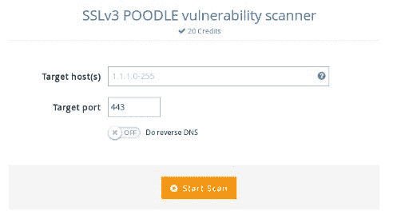

为了防御狮子狗攻击，您需要在服务器上禁用 SSLv3 并升级客户端，因为升级后的客户端使用 TLS fallback**信令密码套件值**（**SCSV**）来防止协议降级攻击。

# 野兽攻击（CVE-2011-3389）

2011 年发现了针对 SSL/TLS（**BEAST**攻击的**浏览器漏洞。在 BEAST 攻击中，攻击者利用 TLS 中的密码块链接漏洞，通过执行中间人攻击，使用 CPA。要防御野兽攻击，请升级 TLS 版本。**

# 犯罪攻击（CVE-2012-4929）

在**压缩比信息泄漏使得**（**犯罪**攻击变得容易的情况下，攻击者利用 TLS 压缩中的漏洞进行攻击。下图显示了犯罪攻击：

例如，这种压缩基本上并且可选地用于使用 DEFLATE 算法来减少带宽。要防御此攻击，请确保您的浏览器是最新的。

# 漏洞攻击（CVE-2013-3587）

在通过超文本（**突破**攻击）的自适应压缩进行的**浏览器侦察和过滤中，攻击者利用 HTTP 压缩。**

# 心血发作

在 Heartbleed 攻击中，攻击者利用 OpenSSL 库中的 TLS 心跳扩展进行攻击。此扩展用于始终确保两个系统之间的连接处于活动状态。请求有效负载由数据及其大小组成。攻击者利用此格式迫使服务器从内存泄漏的数据中发送请求的大小：

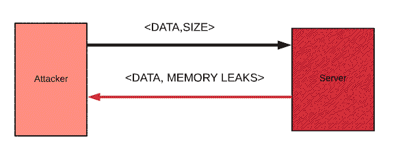

要测试服务器，请尝试常见的网站：

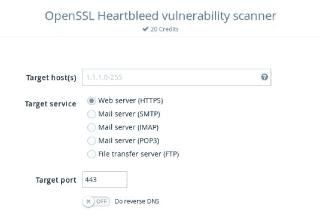

# 奎里斯 SSL 实验室

要测试服务器是否受到 SSL 攻击，您可以尝试 Qualys SSL 实验室。要尝试，只需访问[https://ssllabs.com/](https://ssllabs.com/) ：

单击“测试您的服务器”并放入您的网站：

网站将扫描与输入网站相关的地址：

将生成一份报告，为您提供详细的 SSL 报告和总体评级：

>

# 总结

在本章中，您学习了如何保护 VPN。像其他章节一样，我们从基础开始，从密码学技术到 VPN，因为对技术的各个方面有一个清晰的理解将使渗透测试人员有一个更清晰的视野，知道如何保护该技术。

在下一章中，我们将讨论交换机和路由器中可能存在的常见安全漏洞，并提供有关保持网络设备安全的建议。******