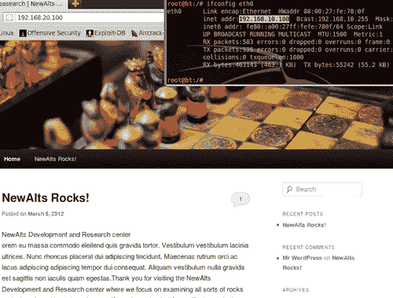
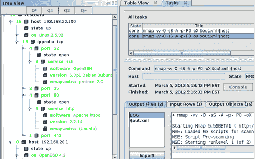
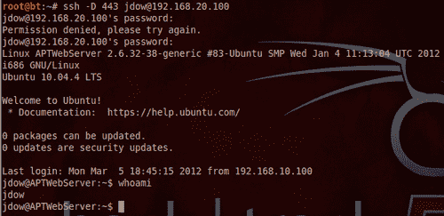
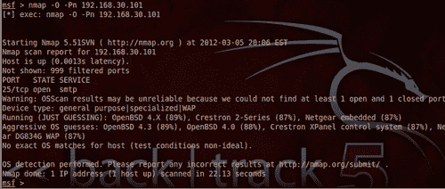
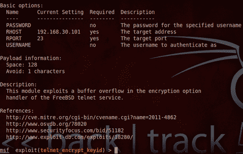
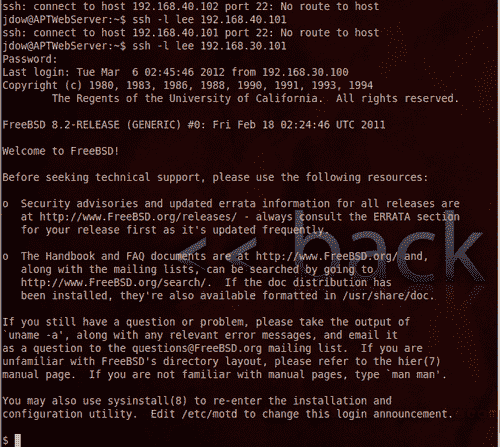

# 第 11 章。接受挑战——把所有的东西放在一起

在本书中，我们讨论了各种技术和方法，通过实践、持续研究和勤奋，您可以从头到尾执行渗透测试。本章允许您将其中一些信息用于工作，并对其进行透视。

我们将在本章中讨论以下事项：

*   建立实践环境
*   使用渗透测试技术从一个系统转移到另一个系统
*   一个虚构公司从头到尾的渗透测试示例

# 场景

一家名为 NewAlts Research Labs 的虚构公司决定增加一个网络展示。由于其业务模式的性质，信息保密至关重要，任何敏感研究数据的泄露都会对其底线产生直接的负面影响。他们的管理员已经建立了一个模拟环境，类似于他们希望最终进入生产环境的环境。企业主已要求管理员聘请外部顾问审查环境，并告知可能存在的任何漏洞。

然后，管理员与您签订合同，让您在实体模型环境上执行渗透测试，因为他已确定他正在使用安全最佳做法，并在几个月前执行了初始漏洞扫描，但未发现任何问题。他重申，他使用的是提供巨大支持的知名产品，并为自己的商店是 100%开源而感到自豪。

当询问网络时，您会发现只有一台面向 web 的服务器。此服务器正在运行最新版本的 WordPress。提到的唯一其他服务是 SSH，他使用 SSH 在紧急情况下访问站点。在办公室时，管理员使用管理区域直接访问服务器，但该区域无法从 Internet 访问，并且已被防火墙关闭。服务器的 IP 地址为 `192.168.10.25`。当询问环境时，管理员会让您知道他们使用分段内部网络、多个防火墙、ID 和 WAF，并且确信这种分层防御方法足以保护核心数据网络，最终将存储重要和机密的研究信息。

由您向管理层提供这样的信心：如果此设置要投入使用，他们的数据将得到保护。您需要在事先不了解网络的情况下模拟攻击者，并在有限的时间内执行攻击。管理员提到他打算为服务器使用虚拟映像，并且每天晚上都会将其关闭并恢复到原始状态。

# 设置

像往常一样，我们需要建立虚拟实验室来模拟这个环境，因为我们正在执行的渗透测试纯粹是虚构的。然而，不要认为这种努力是徒劳的；许多渗透测试人员将尝试模拟其客户机的网络，以确保他们打算使用的漏洞实际有效且稳定，更不用说这降低了勤勉的管理员和安全专业人员检测您的移动的可能性。根据渗透测试的类型，这可能证明是至关重要的。

## 新阿尔茨研究实验室虚拟网络

我们将在 VirtualBox 中设置以下环境：


系统名称：**pfsense1**

*   OS:pfSense 2.0（FreeBSD）
*   虚拟磁盘大小：1 GB
*   内存：128
*   三个网络适配器（内部）：
    *   WAN=192.168.10.1（Int10）
    *   LAN=192.168.20.1（DMZ20）
    *   OPT1=192.168.30.1（DEV30）
    *   OPT2=NAT（这是一个可选步骤，允许您轻松下载和安装必要的软件包。应尽快禁用此适配器。）
*   已安装的软件包：
    *   Snort（请确保对此进行配置和更新。）
    *   删除回退（仅在 32 位版本的 pfSense 中可用。）
*   为所有三个接口设置 DHCP 服务器。
*   允许通过 WAN 接口使用专用 IP。
*   设置允许端口 22、80、443 和 3306 从 WAN 到 LAN 的规则。
*   Set up rules to allow ports 21, 22, 23, 25, 80, 443 from LAN to OPT1 and back.

    ### 提示

    在构建实验室的同时启用 ICMP 流量可以帮助您解决问题。在开始虚拟渗透测试之前，应阻止 ICMP。

系统名称：**pfsense2**

*   OS:pfSense 2.0（FreeBSD）
*   虚拟磁盘大小：1 GB
*   内存：128
*   两个网络适配器（内部）：
    *   LAN=192.168.40.2（CORE40）
    *   WAN=192.168.30.2（DEV30）
*   为核心（LAN）接口设置 DHCP
*   允许通过 WAN 接口使用专用 IP
*   设置规则以允许所有从核心（WAN）到开发（LAN）适配器
*   Set up rules to allow ALL from Dev (LAN) to Core (WAN)

    ### 提示

    如果硬盘空间非常宝贵，请尝试使用 pfsense1 作为链接基座。这可以通过克隆 pfsense1 并选择连接设备来实现。选中此框可重新初始化接口 MAC 地址。

系统名称：**网络服务器**

*   操作系统：Ubuntu 10.04
*   用户：John Dow（jdow），密码：039Alts2010
*   虚拟磁盘大小：6 GB
*   内存：最小 128 MB。（建议 512 MB）
*   要安装的软件包：
    *   OpenSSH
    *   lamp 服务器^
    *   WordPress（最新版本）
*   两个网络适配器（内部）：
    *   eth0=192.168.20.100（DMZ20）
    *   eth1=192.168.30.100（DEV30）
*   在锁定静态 IPs 之前执行所有系统更新

系统名称：**DevMachine**

*   OS:FreeBSD-8.2-RELEASE-i386-disc1:位于大多数镜像路径上，如下所示：（/pub/FreeBSD/releases/i386/ISO-IMAGES/8.2/）
*   用户：JohnDoe（jdoe），密码：1A2b3C4d！
*   虚拟磁盘大小：4 GB（标准安装，基本用户可容纳 4 GB 或更小）
*   内存：最小 128 MB（建议 256 MB）
*   两个网络适配器（内部）：
    *   eth0=192.168.40.101（CORE40）
    *   eth1=192.168.30.101（DEV30）

此系统需要安装默认的 SSH 和 INETD（Telnet、FTP）服务器。必须为此系统上的两个适配器配置 DHCP，否则您将遇到技术困难。这可以在操作系统安装过程中完成。在所有实例中使用用户名 jdoe。

系统名称：**Kioptrix 一级**

*   CORE40 上的 1 个网络适配器（DHCP 将分配地址）

该系统将作为最终的 ArchLinux 数据库服务器的占位符，该服务器包含公司的关键基础设施。管理员声称您永远无法从 `192.168.40.0/24`网络访问此区域。他对这一事实如此确信，以至于他将一个已知的脆弱系统放在核心部分来证明这一点。您的目标是从 `192.168.40.0/24`网段获得 Kioptrix 机器的根。

## 附加系统修改

在本书中，我们全面介绍了在 VirtualBox 环境中安装和配置操作系统，如 pfSense 和 Kioptrix，因此，为了简洁起见，我们将只关注那些使本练习中的系统独特且不同于默认安装的步骤。幸运的是，我们只需要担心配置 Ubuntu web 服务器。

### Web 服务器修改

名为 `Webserver`的系统需要安装 `lamp-server^`并运行。如前所述，我们还需要安装和配置最新版本的 WordPress。WordPress 团队在为社区提供分步详细的安装和配置说明方面做得非常出色，可在互联网上访问：[http://codex.wordpress.org/Installing_WordPress](http://codex.wordpress.org/Installing_WordPress) 。此时，所使用的用户名、数据库和密码并不重要，但应该易于记住，而且功能强大。请记住，本练习中的管理员旨在构建一个安全的环境。当您测试此环境时，您需要“忘记”您知道密码和用户名是什么…

除了完全修补和更新此系统外，我们还需要设置 SSH 服务器，以便在配置 WordPress、OpenSSH 和静态 IP 后，从（Internet）连接接收 jdow 用户，我们在 192.168.10.0/24 模拟该连接。

WordPress 启动并运行后，我们需要将示例页面替换为以下文本：

```
NewAlts Development and Research center
orem eu massa commodo eleifend quis gravida tortor. Vestibulum vestibulum lacinia ultrices. Nunc rhoncus placerat dui adipiscing tincidunt. Maecenas rutrum orci ac lacus adipiscing adipiscing tempor dui consequat. Aliquam vestibulum nulla gravida est sagittis non iaculis quam egestas.Thank you for visiting the NewAlts Development and Research center where we focus on examining all sorts of rocks and minerals and hope to make your life easier and safer! As we like to say in the office: NewAlts Rocks! Lorem ipsum dolor sit amet, consectetur adipiscing elit. Morbi dolor lacus, malesuada vitae sodales eu, vulputate a leo. Mauris vulputate tristique nulla, at vestibulum nisl fringilla ut. Duis a quam quis lectus rutrum cursus. Morbi volutpat lorem eu massa commodo eleifend quis gravida tortor.
Vestibulum vestibulum lacinia ultrices. Nunc rhoncus placerat dui adipiscing tincidunt. Maecenas rutrum orci ac lacus adipiscing adipiscing tempor dui consequat. Aliquam vestibulum nulla gravida est sagittis non iaculis quam egestas. Thanks again for your visit and if you run into any problems with the website please contact our website administrator at jdow@newalts.lab! . Morbi volutpat lorem eu massa commodo eleifend quis gravida tortor. Vestibulum vestibulum lacinia ultrices. Nunc rhoncus placerat dui adipiscing tincidunt. Maecenas rutrum orci ac lacus adipiscing adipiscing tempor dui consequat.

```

这将为我们提供一些在网站上使用的信息。我们可以继续本章更有趣的方面！当浏览我们的 `WebServer`机器时，我们会看到类似于以下屏幕截图的内容：



# 挑战

实验室已建立，连接已验证；是时候把整本书中获得的信息付诸实践了。挑战自己在此环境中从头到尾执行完全渗透测试。包括以下项目：

*   确定范围（管理员只允许您在其 VPN 上使用两个小时）。
*   了解客户希望进行渗透测试的原因。这对于能够真正满足用户的需求至关重要。对于某些职业来说，这很容易，但对于渗透测试人员来说，情况并非总是如此。确定您的客户是否希望进行渗透测试或与一般漏洞分析更密切相关的测试。
*   审计业务规则文件：
    *   使用提供的信息创建实用的业务规则文档。
    *   确定并记录 ROE 中的范围。
    *   在 ROE 中巩固关于测试的任何假设。
    *   明确的目标。你需要做什么来证明成功？对于大多数观众来说，仅仅用 `whoami = root`来展示屏幕截图是不够的。
*   决定是否使用 Dradis、Magic Tree 或其他数据管理工具来管理结果。
*   列出你最初的测试计划。在测试之前了解初始步骤很重要。
*   进行侦察。
*   开始枚举并决定攻击计划。相应地更改您的测试计划。根据范围的不同，您可以对资源进行漏洞扫描或应用程序扫描。这声音会很大。
*   在枚举期间，您应该收集有关可能的防火墙、ID 或负载平衡的信息。
*   执行你的攻击计划。由于渗透测试的性质，这将因测试而异，有时甚至需要动态更改。如果某件事情没有按预期工作，请准备好备份计划。
*   当成功访问系统时，请执行后期开发，并在需要时设置一个支点，以便深入了解网络体系结构。
*   实现渗透测试的目标。
*   清理
*   生成您的报告。
*   安排会议，与客户一起审查结果。

虽然渗透测试的“开发”阶段最吸引人，但其他步骤对于成功的渗透测试同样重要。一定要练习并为过程中的每一步做好准备。理解渗透测试中的工具和技术非常重要，但这些工具和技术会不断变化。过程本身保持相当稳定，因此，从长远来看，自动化或改进这些步骤的任何努力都将是最有益的。

祝你好运！测试结束时，您应该能够在 Kioptrix 机器上找到根。请务必仔细记录您的步骤以及为使网络更安全而应进行的任何建议更改！不要提前阅读，因为它会包含破坏测试的破坏者。

# 演练

希望您能够在阅读本章这一部分之前完成测试。它将包含示例和至少一种实现我们设定的目标的方法，即破坏在我们自己的网络或机器上运行的虚拟 NewAlts 开发实验室的安全性。如果您获得初始目标的文档或方法与中描述的不同，并不意味着它是错误的，只是不同而已。通过实践，渗透测试人员将开发适合其技能集和知识库的自己的方法。

### 注

除本章所述方法外，可能还有其他方法可以实现我们的目标。本章的目标是给出贯穿测试工作流程从头到尾的示例。如果您在核心网络中的 Kioptrix 机器上找到其他获取 root 的方法，恭喜您！这就是渗透测试的全部内容！

## 界定范围

通过阅读场景目标和背景信息，可以清楚地定义此特定测试的范围。

1.  我们有两个小时的时间来测试一个虚拟环境，这个虚拟环境是为了模拟我们的客户希望最终在生产中使用的环境而设计的。
2.  我们知道的唯一用户是代表虚构的 NewAlts 研发公司与我们签约的管理员。
3.  此网络中包含的信息对公司完全无害。没有特别需要对内容进行加密，也不需要对第三方服务持谨慎态度。
4.  我们要实现 Kioptrix 机器的完全折衷，Kioptrix 机器已放置在核心 192.168.40.0/24 网段中，这是无法从 192.168.10.0/24 网段访问的，该网段模拟生产环境中存在的互联网连接。
5.  我们可以使用我们已知的任何技术，包括社会工程、剥削、拒绝服务等。天空是极限。
6.  关于这些系统的任何数据或信息都不违反我们所知的任何法律，无论是州法律还是联邦法律。因为网络是用于教育目的的，所以我们可以用它做任何我们想做的事情。
7.  网络上的所有系统都将基于开源。

考虑到这些因素，这里的挑战显然将伴随有限的时间因素而来。如果我们的团队中有几个人，我们可以建议使用几个具有非常特定任务的测试人员，这些任务可以并行运行，以充分利用有限的两小时测试时间。（管理员拒绝支付超过两小时的标准费用，这是基于最多三名测试人员必须参加测试）。

## 确定“为什么”

虽然在这种情况下，我们已经清楚地说明了“为什么”，但我们不应自满。它帮助测试人员和业务人员了解测试的真正目标是什么，并允许您将重点放在调整测试和报告以实现此目标上。

在这种情况下，管理员已明确表示已针对该网络使用了漏洞分析工具，并已解决了除业务部门认为可接受的问题外的其他问题。这将因企业而异，取决于您所处理的公司或个人的风险偏好。了解风险偏好也有助于确定“为什么”。也许您测试环境只是为了向业务部门证明，他们仍然有信心攻击者需要两个多小时才能破坏他们的网络，这恰好是他们的安全团队找到环境中发生的任何奇怪活动所需的时间。

### 那么这个特殊测试的“原因”是什么？

管理员明确表示，如果恶意入侵者收集其任何关键数据，将产生直接的金钱影响。在该公司工作的科学家并不精通技术，他们将使用基本的解决方案来解决技术问题。可以肯定地说，他们将存储未加密的测试文件，这些文件由多个用户共享在包含关键数据的文件服务器上。这种情况下的“原因”是担心会损失大量资金，需要有人向业务部门保证管理员建议的安全配置足以防止这种情况发生。

## 制定业务约定书规则

这一最关键的文件必须写得清楚，定义明确。我们现在掌握了制定交战规则文件所需的所有信息，在进行任何测试之前，必须提交并达成一致。

### 提示

业务约定规则应由具有代表客户全权的 C 级主管签署。

接战规则必须详细说明范围、系统、网络地址，以及在测试期间允许和不允许执行的操作。无论您选择何种模板或外观，您为迎接挑战而创建的文档至少应包含以下信息：

1.  **ROE 创建日期：**2020 年 2 月 1 日。
2.  **贵公司和任何直接参与测试的测试人员的姓名和联系方式：**Lee Allen。
3.  **请求摘要：**我们将对放置在核心网段中的 Kioptrix 机器进行完全折衷，该机器无法从模拟生产环境中存在的互联网连接的 192.168.10.0/24 网段访问。
4.  **渗透测试是什么的快速描述（以下摘自本书**[第 1 章](01.html "Chapter 1. Planning and Scoping for a Successful Penetration Test")、*成功渗透测试的规划和范围*、**：**渗透测试使业务部门能够了解所采用的缓解策略是否实际按照预期工作；从本质上讲，它消除了等式中的猜测。预期渗透测试人员将模拟攻击者可能尝试的操作，并通过证明他们能够危害目标关键系统而受到挑战。这使业务部门能够了解现有的安全控制是否按预期工作，以及是否有任何方面需要改进。
5.  **将进行的测试类型：**完全折衷渗透测试，除时间范围外无任何限制。
6.  **限制：**2 小时时间范围。
7.  **明确了渗透测试的目标：**在两小时内完全破坏位于核心网段的 Kioptrix 机器。
8.  **IP 范围：**192.168.10.0/24、192.168.20.0/24、192.168.30.0/24、192.168.40.0/24。
9.  **数据处理：**数据仅用于测试，因此不以任何方式被视为或视为机密。
10.  **如何处理任何发现可能违反州或联邦法律的数据：**将在业务或其实体之前通知相关部门。
11.  **NewAlts 开发联系人列表及其电话号码等：**Jon Doe。
12.  **需要公司相关管理人员的签名：**新阿尔茨发展首席信息官、首席信息官或其他负责人。除非他能证明其他情况，否则管理员没有足够的权限允许您测试 NewAlts 开发公司的资产。

## 初始攻击计划

有了 ROE，我们可以查看网络图并制定攻击计划。让我们回顾一下管理员提供给我们的网络布局。


在这个白盒测试中，我们获得了网络架构，以弥补我们正在测试模拟环境并且受到严格时间限制的事实。我们需要确定路由器是否允许我们从 pfSense1 到 web 服务器和 DevServer。从提供的图表中不清楚我们是否可以远程到达 Kioptrix 1 级机器。我们的初步计划如下：

1.  在 192.168.10.1 防火墙和网关上执行漏洞扫描。我们知道这一点，所以我们不妨利用它！对本图中列出的所有系统执行相同的操作。
2.  对 192.168.20.0/24 执行网络和漏洞扫描。
3.  如果我们可以从 192.168.10.0/24 设备访问其他部分，我们也将对这些部分执行网络和漏洞扫描。
4.  如果我们无法访问任何网络，我们将对 web 服务器应用程序执行 web 应用程序扫描，并查看是否存在我们可以利用的 web 应用程序漏洞。

这些最基本的计划足以让我们开始。我们从这些步骤中收集的信息应该足以推动我们进入下一步。谁知道呢，也许管理员是对的，而且安装实际上是安全的！（在这种情况下不太可能！）

### 注

在本测试范围有限的情况下，可以使用任何可用的文件方式，以便向客户提供可接受的报告。

## 枚举与开发

我们首先执行行动计划中的第一步，并使用我们选择的工具扫描设备。在这种情况下，我决定使用 MagicTree。它允许我在应用程序中运行查询，并能够动态生成报告。

加载 MagicTree 并创建一个新节点，就像我们在本书[第 1 章](01.html "Chapter 1. Planning and Scoping for a Successful Penetration Test")*中为成功的渗透测试*所做的规划和范围界定一样，并对 192.168.10.0/24 子网中可用的任何网络运行 Nmap 扫描。如果所有配置都正确，您应该只能在 `192.168.20.0/24`网络上看到 `192.168.20.1`和 `Webserver`。



在查看数据时，我们发现这些系统上运行着一些有趣的服务，应该对这些服务进行检查。让我们对它们运行一个快速漏洞扫描以节省时间。我们将使用 OpenVas 执行漏洞扫描。OpenVas 包含在回溯 5 R1 中，但在使用前必须正确配置。有关设置 OpenVas 的说明，请访问 `Backtrack-linux.org`网站[http://www.backtrack-linux.org/wiki/index.php?title=OpenVas &旧 ID=756](http://www.backtrack-linux.org/wiki/index.php?title=OpenVas&oldid=756)。

### 注

请注意，OpenVas 配置将需要 Internet 连接。

在意识到扫描将花费太长的时间并将使我们超过两个小时后，我们决定进入测试计划的下一阶段，并迅速确定已安装的软件已合理更新，并且没有已知的漏洞可用于任何开放服务。通过查看该网站，我们还注意到它是 WordPress 最新版本的标准安装。仔细查看网站时，我们会注意到一个联系人电子邮件地址。我们将此电子邮件地址添加到 MagicTree 备注中。电子邮件名称**jdow**很有可能也被用作网络登录。如果是这样的话，我们已经解决了一半的难题。我们可能有机会暴力破解 Joe 的 SSH 密码。

此时，我们决定尝试一下 SSH 服务器。根据范围，我们可以使用任何可用的工具为我们打开强制密码。再次，请记住，此测试的时间有限，因此我们决定使用 `cewl`从 192.168.20.100 的网站上获取密码列表。

```
# /usr/bin/ruby1.8 /pentest/passwords/cewl/cewl.rb -e -w dict 192.168.20.100 

```

此命令在当前目录中创建一个名为 `dict`的文本文件。我们可以尝试按原样运行此列表，看看这些单词是否有助于我们强制使用 SSH 服务器的用户名或密码。

然后，我们将获取该列表并通过 `cupp`运行它，添加一些特殊字符，连接单词，并且通常滥用该文件。完成后，我们可以通过删除许多不太可能使用的密码来节省时间，例如那些只有数字的密码，例如 00000001，等等。如果单词列表太大，那么删除其中一个选项并尝试一下。


使用 `jdow`用户名和新生成的密码列表在 `xhydra`中运行此列表，您将有望得到以下提示（在整个实验室运行的测试系统上花费了 15 分钟；在您的系统上可能需要更长的时间，特别是因为整个实验室占用了您的大部分资源）：


现在我们有了一个 SSH 连接。登录 WebServer，查看 jdow 帐户的权限。您会意识到我们没有能力安装任何软件。相反，我们决定使用 MetaSploit 将 WebServer 用作轴心点（本例中为 SSH 代理）。首先，我们需要在回溯到 Web 服务器的路径中设置 SSH 隧道：

```
# ssh -D 127.0.0.1:3306 jdow@192.168.20.100 

```

这将在 3306 端口创建我们的隧道，用于发起我们的攻击。下面是使用 443 的隧道示例，它将增加与网络上其他加密流量混合的额外好处。我们选择 3306 取而代之，因为我们最终使用的漏洞存在一些稳定性问题。



登录 Metasploit 后，我们设置了一个代理连接，允许我们通过 Web 服务器连接使用 Metasploit。在 Metasploit 中，执行以下命令，这些命令改编自 HD Moore 的邮件列表响应。原始消息可在以下位置找到：[https://mail.metasploit.com/pipermail/framework/2010-January/005675.html](http://https://mail.metasploit.com/pipermail/framework/2010-January/005675.html) 。

```
setg Proxies SOCKS4:127.0.0.1:3306
setg LPORT 45567
setg PAYLOAD bsd/x86/shell/bind_tcp

```

这些命令将为代理和首选负载设置全局变量。我们选择默认的本地端口为 45567。

作为下一步，我们需要确认在 192.168.30.0/24 网络上确实有可用的 FreeBSD 机器，正如管理员通知我们的那样。要做到这一点，我们可以从 Telnet 服务器抓取横幅，查看是否有正在使用的操作系统的指示。查看 NMAP 扫描是否有任何可用信息也是一个好主意。

使用标准 Nmap 扫描时，我们注意到我们的流量被拦截。此时，我们可以使用其他扫描方法，但决定手动尝试最常见的端口，而不是等待代理扫描的结果，因为代理扫描可能会很慢。

### 注

我们无法从此透视运行标准 SYN 扫描。还有其他扫描方法，但这超出了本章的范围。



我们碰巧知道，有一个已知的针对 FreeBSD Telnet 的漏洞，管理员似乎已将其安装在此系统上（通过在 Web 服务器上的 SSH 会话中使用 NetCat 确认）。我们使用 `nc`检查最常见的端口，如 80、25、21 等。在走这条路线之前，我们首先检查是否安装了 nmap 或其他扫描仪。


让我们来试试这个已知的漏洞。目标系统很有可能易受攻击，因为它是一个相对较新的漏洞。



首先，我们在 MSF 中搜索了 Telnet，然后我们在 `exploit/freebsd/telnet/telnet_encrypt_keyid`上设置了所有需要的内容，并准备尝试利用该漏洞。

它可以工作，我们可以运行一些命令来验证我们作为谁登录，以及系统连接到什么。


请注意，我们现在可以使用该系统作为针对 192.168.40.0/24 的攻击平台，这是管理员提到的核心安全区域。让我们尝试升级游戏帐户的权限。我们将目录更改为 `/etc/`并运行以下命令：

```
awk -F ":" 'BEGIN{OFS = ":"} $1 == "games" {$3="0"}{$4="0"}{$7="/bin/bash"}{ print }' passwd > test 

```

复制通过 `passwd`文件生成的测试文件，我们现在应该可以使用该帐户登录。注意：我们无法更改游戏帐户或任何其他帐户的密码！默认的 `pam`安全性防止我们执行这项琐碎的任务！这再次证明，作为一名渗透测试人员，你必须保持勤奋，永不放弃。如果某个方法不起作用，请尝试进行一些更改，或者更改整个方法，直到您成功！

幸运的是，我们是以 root 用户身份登录系统的，因此我们尝试 `/usr/sbin/adduser`并设置了一个名为 lee 的用户，其密码为 lee。 `awk`语句已修改，我们将重试：

```
# awk -F ":" 'BEGIN{OFS = ":"} $1 == "lee" {$3="0"}{$4="0"}{$7="/bin/bash"}{ print }' passwd > test
# cp test passwd

```

现在，让我们转到 Web 服务器上的 SSH 会话，看看我们的 lee 帐户是如何为我们工作的。

在下一阶段，我们必须利用我们的知识，即我们已知的最后一个目标系统。我们已经了解了它的漏洞，并且有代码（请记住， `10.c?)`可供我们使用，我们可以在 192.168.30.101 系统上编译，以利用 192.168.40.102 的系统。在这一点上进行操作的许多方法之一包括简单地将 `10.c`的代码复制到 vi 中，然后在 FreeBSD 机器上通过 GCC 编译。


一旦 `10.c`被编译，我们就能够运行它并获得对 Kioptrix 一级机器的根访问权。为了证明我们能够访问这台机器，我们决定更改根密码。这通常不是一个好主意，但根据我们的交战规则，这是完全可以接受的。我们使用 `passwd`命令将 Kioptrix 机器的密码更改为 `NothingIsSecure`，然后注销并断开所有连接。

我们重新连接到 Web 服务器机器上的 SSH，将 SSH 连接到 DevServer:



随后，我们使用新密码登录到 Kioptrix 机器的 SSH，以验证我们已经实现了渗透测试的目标。


# 报告

我们已成功完成渗透测试，现在必须编制文件。你的报告应该看起来专业、有条理，并清楚地解释调查结果，而且还应该设置为非技术性语言，说明这些问题是如何被忽视的。关注允许您进入的内容，但也要确保指出什么时候起作用，例如在尝试为标准游戏帐户添加密码时遇到的 `pam`限制（从技术上讲，在声称安全的环境中不应该存在密码）。

让我们花一点时间来解决我们在这次渗透测试中遇到的问题：

1.  我们能够使用大写和小写字符以及数字强制输入密码。密码长度也超过 8 个字符，这在安全环境中是相当标准的。用户在任何时候都不得使用基于公司名称或其他琐碎事实的密码。如果有人有一个页面说他们热爱足球，那么你最好相信它会出现在某人的基本词表中。这里的建议是将 SSH 连接限制在特定 IP 上，或者至少需要简单登录之外的证书。尽管这看起来微不足道，但许多公司仍然忽视了这一简单的步骤。帐户锁定也是挫败暴力密码攻击的一种行之有效的方法。
2.  我们利用了一个已知的漏洞。很可能这个漏洞最终会被修补。这里真正的问题是 Telnet 一开始就在运行。它是一种已知的不安全协议，以明文形式传递数据。在这种情况下，由于所传输数据的性质，业务部门必须将其视为可接受的风险。这里学到的教训应该是，任何时候都只能运行关键服务，并且仅仅因为存在一个安全层并不意味着其他系统可以完全依赖该安全机制。
3.  将已知易受攻击的系统作为目标只是自找麻烦。在现实世界中，这无论如何都是不可接受的。通过使用这样一个系统，管理员将在某些人身上打开怀疑的可能性。他们不会理解系统代表了他们将在启动时出现的“加固”服务器。说明攻击者将有两个多小时的时间执行攻击，并将安装各种恶意软件，以帮助最终破解任何已加固的计算机。
4.  网络安全设备在适当监控和控制时有效。然而，它们不是万能药。只有通过深入防御，互联网上的企业才能真正安全，即使如此，随着安全研究人员和恶意黑客发现新技术，也可能会有不同程度的“安全”。需要记住的是，安全研究人员报告他们的发现，以帮助保护最终用户。当安全研究人员发布有关漏洞的信息时，重要的是要记住该漏洞不是新的，而是新发布的。安全研究人员没有制造漏洞；他或她提请负责纠正编码错误的人员注意。恶意用户可能已经知道该漏洞，甚至可能已经使用该漏洞多年。恶意攻击者将保守秘密，并最大限度地从误用技术中获得利润。许多企业不理解这种区别，我们的工作是确保他们知道真正的威胁是谁，以及安全研究人员为什么要执行他们所做的工作。

如果您在模拟报告中捕获了所有这些以及更多内容，恭喜您！这一挑战并不代表可能的最具挑战性的环境，但希望能够很好地引入对高度安全环境的渗透测试，这些环境使用补丁系统、防火墙、IDS 等来保护其关键资产。

# 总结

在本章中，我们首先设置了一个场景，该场景允许我们从头到尾模拟渗透测试。我们继续设置测试环境，然后深入研究成功渗透测试所需的阶段。

一旦涵盖了基本知识，您就面临着在这种环境下执行自己的测试的挑战。希望这对你来说既有挑战性又令人兴奋！

我们通过提供一种可能的渗透测试方法的演练结束了本章。做同样的任务还有其他方法，有些方法比其他方法更好。目的是展示其中一种方法。与实验室一起玩，尝试其他场景。用它来获得你所需要的技能或磨练你所拥有的技能。到了做这项工作的时候，你需要所有你能得到的运气和技能，因为如果有一件事在这个世界上是肯定的：“任何可能出错的事情都会出错”墨菲定律。