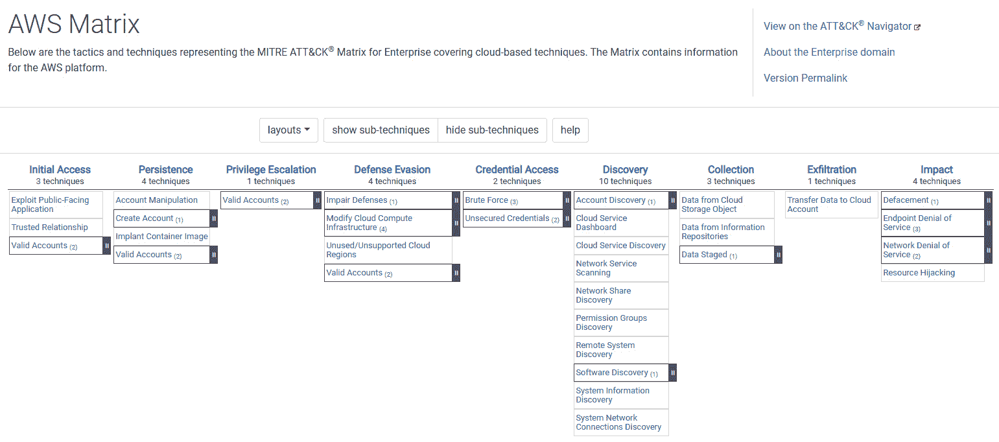
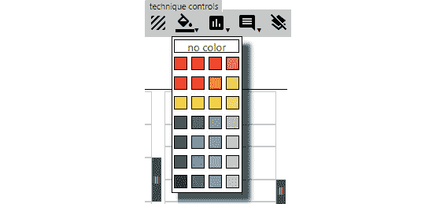
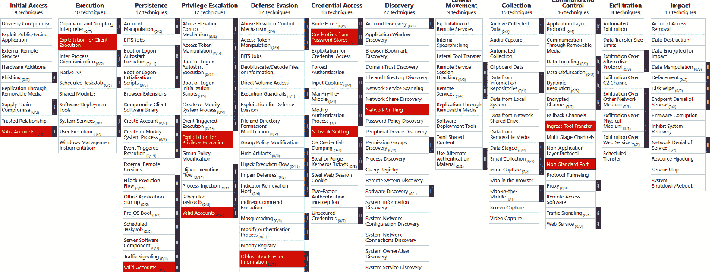
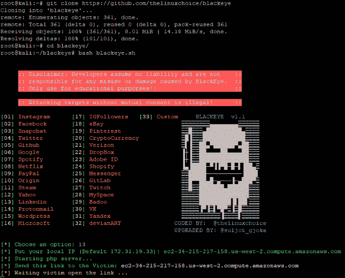
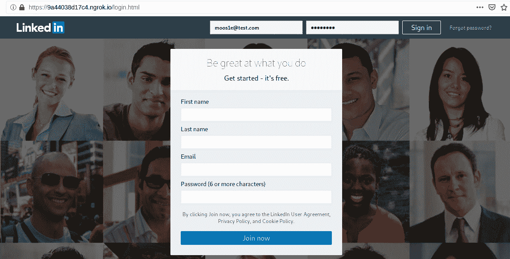

# *第 12 章*：其他有 AWS 的项目

在这本书的结尾，我想简单地提到另外两个不同的项目，它们值得注意和深入研究。在本书中，我们采用了相当多的高层次观点以及大量的低层次观点（实践部分），以创建对 pentesting 的连贯理解以及它对 AWS 的意义。最后一章将讨论一个开源框架，红队成员、渗透测试人员和道德黑客使用该框架，允许企业在其组织上测试真正的对手战术和方法——通过定位弱点最终改善控制和防御。然后，我们将以一个有趣的练习结束，该练习来自我在 2019 年提出的一个网络钓鱼项目，我们将学习如何利用 EC2 建立快速有效的网络钓鱼练习，您可以在授权的组织上使用。

在本章中，我们将介绍以下主题：

*   理解 MITRE ATT&CK 框架
*   利用 AWS 进行网络钓鱼

# 技术要求

本章的技术要求如下：

*   斜接附件和甲板导航仪：[https://mitre-attack.github.io/attack-navigator/enterprise/](https://mitre-attack.github.io/attack-navigator/enterprise/)
*   卡利 Linux
*   本章中使用的网络钓鱼程序：[https://github.com/thelinuxchoice/blackeye](https://github.com/thelinuxchoice/blackeye)

# 了解 MITRE ATT&CK 框架

根据的范围，pentesting 可能会成为一项庞大而繁琐的工作，可能会严重影响 pentest 的质量。在 pentesting 时，我们希望能够提供创造性和真实世界的场景，以便我们能够使用这些场景与客户、客户网络和系统进行互动。在测试期间，我们将我们的行为和方法称为**TTPs**——代表以下内容：

*   战术
*   技巧
*   程序

这三个词构成了我们祷告的一大部分；然而，如果我们不真正理解它们代表什么，那么我们就真的无法利用它们。为了更好地理解它们，我们可以将它们应用到一个开放的知识库中，称为 MITRE ATT&CK 框架，并通过将它们应用到实际场景中来讨论这些术语。

MITRE ATT&CK 框架允许我们以 TTP 的形式开发自己的方法和行动，并履行对客户的质量承诺。该框架是一个庞大的知识库，其中包含了现实世界中的对手战术，我们可以使用这些战术在 pentest 期间创建威胁模型和现实生活中的 pentesting 路线图。

MITRE ATT&CK 框架的另一大好处是，它可以让您模拟现实生活中的威胁场景，我们将在*发现 MITRE ATT*&*CK Navigator*部分中看到更多内容。在使用 MITRE 创建攻击路径之前，我们需要了解如何将其用于 AWS 测试。下一节将讨论 AWS 矩阵，该矩阵通过 MITRE ATT&CK 框架说明战术和技术。

## 用 AWS 矩阵理解 TTP

MITRE ATT&CK 框架内的 AWS 矩阵允许我们通过查看实际技术并将其应用于我们的 pentesting 方法来推进我们的极限和攻击路径。因为有很多方法可以测试，有很多不同的场景，AWS 矩阵允许我们通过提供从实际发生的攻击中衍生出来的真实场景来减少思考，做更多的事情。

要查看矩阵，请转至[https://attack.mitre.org/matrices/enterprise/cloud/aws/](https://attack.mitre.org/matrices/enterprise/cloud/aws/) 。

让我们来看看这个矩阵，以及它设置攻击所需要的东西。以下屏幕截图显示了 AWS 矩阵的菜单：

图 12.1-斜接附件和连接

这看起来像是一个非常复杂的 Excel 工作表，但并不像看上去那么复杂。这实际上是在分解我们在 pentest 中使用的攻击过程的各个步骤–唯一的区别是，这是使用真实世界的方法，而不是理论方法，所以让我们分解主题，以便我们能够简明地理解 pentest AWS 时它们的意思：

*   **Initial Access** details the various ways of how we can obtain credentials that allow us access to user-oriented services, such as S3, EC2, Lambda, and others. How these credentials can be accessed varies in attack paths; however, the more common ways are through exposed GitHub and GitLab. If you go to the following link, it shows that a real **Advanced Persistent Threat** (**APT**) was able to gather credentials by using compromised Office 365 accounts: [https://attack.mitre.org/techniques/T1078/004/](https://attack.mitre.org/techniques/T1078/004/).

    以下是描述的屏幕截图：

图 12.2–APT33

请注意，它引用了一个真实的威胁参与者。这意味着我们可以使用此属性创建“真实”路径来攻击客户端，以验证客户端是否容易受到此类攻击。

*   **持久性**包括维护对系统的访问。我们在[*第 9 章*](09.html#_idTextAnchor381)*现实生活中使用 Metasploit 等进行 Pentesting 时就这样做了！*，使用 Metasploit 处理不同场景时。通常，我们可以创建帐户或使用有效帐户来维护持久性。**提升权限**的相同方法包括发现具有更好权限的有效 AWS 帐户，或对受损帐户执行垂直权限提升。
*   **防御性规避**具有各种技术，可以执行这些技术来帮助实现绕过防御的结果，例如 AWS 环境中的防火墙和其他检测服务。如果我们看一看**云计算基础设施**技术，我们将看到创建云实例的子技术。这是一个有趣的概念，因为本质上，这意味着在 pentest 期间，我们创建了一个新实例，该实例成为环境的一部分，并且可以在 pentest 期间用作恶意服务器。
*   关于这个过程的另一个重要部分是**发现阶段**。在这一阶段，对手——在本例中是 pentest 团队——使用各种技术，通过侦察和枚举来帮助收集有关目标网络的信息。我们在整本书中做了大量的侦察和发现工作，使用各种工具查找信息，以发现有关 EC2、S3、Lambda 和开放信息的信息和元数据。
*   Next, once we discover our targets, we move toward **collecting** and **exfiltrating** data outside the network. What this means is that we can use techniques and procedures to pull information out of the network and into our network. In an adversary approach, a threat or malicious hacker that has access to the AWS environment would gather data and push it to their server that resides behind proxy servers.

    重要提示

    代理服务器充当目标服务器和攻击者服务器之间的中间主机。代理服务器用于“隐藏”攻击者服务器。

*   Another part that is good to mention is that the last part of the MITRE ATT&CK framework involves the **impact** of threats. The impact can be defacing a web server or website, bringing services down via **DDoS** or **DoS**. These types of attacks are common and can really hurt an organization if something were to occur during a pentest, or even worse – if a large impact occurred from an actual threat or APT!

    重要提示

    要更多地使用 MITRE ATT&CK 框架，请在[查看整个框架 https://attack.mitre.org/](https://attack.mitre.org/) 。

既然我们已经讨论了 MITRE ATT&CK 框架，那么让我们开始看看 MITRE ATT&CK Navigator——一个让我们能够在高级别 view 上绘制和说明攻击的工具。

## 发现米特 ATT&CK 导航器

在本节中，我们将快速了解如何在高级视图中使用该工具，以及操作员（红队队员）和 Pentester 如何使用插图类型工具来揭示特定用户使用的攻击。在这个例子中，我们将关注 APT33 所使用的一些攻击，APT33 是一个可疑的伊朗威胁组织，至少从 2013 年开始实施行动。APT33 的目标包括美国、沙特阿拉伯和韩国等国家，它们对航空领域感兴趣。您可以在此处找到有关 APT33 的更多信息：[https://attack.mitre.org/groups/G0064/](https://attack.mitre.org/groups/G0064/) 。

让我们从这里的导航器开始：[https://mitre-attack.github.io/attack-navigator/enterprise/](https://mitre-attack.github.io/attack-navigator/enterprise/) 。

到达 Navigator 后，按照以下步骤创建 APT33 路线图：

1.  Click on **multi-select** in the **section tools** section and scroll down in the **threat group** section until you come across **APT33**. When you come across it, click **select**:

    

    图 12.3–斜接导航器中的下拉列表

2.  Now that we have selected **APT33**, we have selected all of its techniques. Now, let's highlight the techniques by clicking on the paint bucket under **technique controls**. For this example, we have selected **red** for the color:

    

    图 12.4-使用颜色突出显示攻击方法

3.  在选择一种颜色后，您的屏幕应该开始充满您选择的许多颜色。这些颜色突出了**APT33**所使用的战术和技术，以及您的 pentest 团队如何执行这些攻击。这也是向高层管理人员展示攻击者如何瞄准其他 AWS 环境的一种很好的方式，并允许公开讨论如何防范这些类型的攻击。以下是 ATT&CK Navigator**APT33**中的攻击路线图说明：

图 12.5–完整突出显示的攻击路径

这就是本章导航部分的内容。正如您所看到的，**Navigator**是一个伟大、简单、简洁的工具，它将帮助我们向高层管理层和我们的 pentest 团队展示我们的攻击路径，并让我们在保持正轨的同时执行 pentest。

现在，我们了解如何使用 MITRE ATT 和 CK 结合我们的笔试，让我们来看看攻击者和 PTETESTER 如何通过 PHIS ORT T0？兴的方法和方法获得初始访问。

# 钓鱼上钩

网络钓鱼是一种网络攻击，占受害者组织遭受的破坏的 70%左右。这种技术含量较低的欺骗技术通常涉及攻击者制造某种类型的有效载荷，然后将其发送给受害者或多个受害者。有效载荷包括一封带有某种恶意软件或链接的电子邮件，这些恶意软件或链接诱骗用户点击它们。这是通过欺骗和借口的艺术来使用的，通常使用某种诱饵来引诱目标。

现在，让我们继续前进，看看如何在教育环境中应用网络钓鱼。这篇文章的目的是帮助读者理解简单而有效的钓鱼网站如何实现的**基本**技术属性。

## 利用 AWS 实施网络钓鱼

现在，我们了解钓鱼是什么，让我们来看看一个快速但非常有趣的例子，一个使用我们的 AWS KALI Linux 机器来帮助我们执行钓鱼攻击的练习。在我们开始之前，您需要确保您的 Kali Linux 机器已启动并正在运行。一旦您的 Kali Linux 机器运行，就可以通过其公共 IP 地址将 SSH 连接到它。登录到 Kali 机器后，继续执行以下步骤：

1.  Grab a copy of BlackEye from GitHub:

    **$git 克隆 https://github.com/thelinuxchoice/blackeye**

2.  Next, change into the directory for the tool:

    **$cd 黑眼**

3.  Launch the application:

    **$bash blackeye**

4.  After launching the application, you'll be prompted with a selection screen for what site you want to clone for your phishing attack. In this case, we will choose **Linkedin** by selecting option **13**:

    

    图 12.6–黑眼主屏幕

5.  在选择**13**选项后，确保您将**公共 DNS**作为本地 IP。这将确保该工具绑定到我们的本地 DNS 名称以路由该工具。

现在，该站点已启动并运行，等待目标访问，或者它位于钓鱼电子邮件中，请用户单击该链接。

要查看页面，请在首选浏览器的 URL 栏中输入公共 DNS：

图 12.7——网络钓鱼 LinkedIn 网站

正如我们所见，现场看起来正常；然而，我们可以看到，在顶部附近的搜索栏中，URL 是不同的。看到这将是一个明确的指标，有意识的用户，这是一个钓鱼计划；然而，意识较低的用户可能会被欺骗并输入他们的信息。

尝试向应用程序输入一些凭据。不要使用您的合法 LinkedIn 凭据！

一旦您输入了您的凭据，请按正常方式单击**登录**。你应该被重定向到真正的 LinkedIn 页面。发生的事情是黑眼工具获取了您的凭据，并将您重定向到实际的 LinkedIn 页面，以便再次尝试登录。一般用户会认为这是一个潜在的错误，只是试图再次登录。然而，如果我们回过头来看看我们的卡利终端，我们会注意到另外一件事——我们的凭证已被收集和保存！

图 12.8–被盗凭证

正如我们所见，我们有可以用来访问 LinkedIn 的凭据。当然，这些都是不合法的；然而，在现实生活中的网络钓鱼计划中，获取的凭据可能会导致很多麻烦，例如欺诈、身份盗窃以及您的数据被泄露。

重要提示

有关此主题的有趣和交互式视频，请查看*Simply Cyber*，了解使用此工具进行的精彩现场演示！

[https://www.youtube.com/watch?time_continue=2 &v=aa7e7oLPyp4&特征=emb_ 标志](https://www.youtube.com/watch?time_continue=2&v=aa7e7oLPyp4&feature=emb_logo)

# 总结

在本章中，通过分析和讨论 MITRE ATT&CK 框架，我们了解了一些攻击技术，然后我们通过一个有趣的互动练习来完成本章，该练习介绍如何利用 AWS 进行 AWS 钓鱼活动。

这一章结束了这本书。我希望你和我一样喜欢读它！

# 进一步阅读

一篇关于 AWS 真实攻击的文章：[https://www.darkreading.com/cloud/hackers-use-public-cloud-features-to-breach-persist-in-business-networks/d/d-id/1332618](https://www.darkreading.com/cloud/hackers-use-public-cloud-features-to-breach-persist-in-business-networks/d/d-id/1332618)