# 六、Python 漏洞扫描器-第二部分

当我们谈到使用开源脚本进行服务扫描时，首先想到的是使用各种 NSE 脚本来获取服务版本以及与配置的服务相关的漏洞。现在，在一个典型的手动网络渗透测试中，我们不仅使用 NSE 脚本来完成任务，还使用各种 Ruby、Perl 和 Bash 脚本以及 Java 类文件。我们还运行 Metasploit 辅助模块进行服务扫描，并利用模块利用漏洞和创建 POC。我们还可以运行各种 Kali 工具，如 Nikto for web scanning，或 SQLmap、w3af 和 Wireshark，为配置不当的 FTP 或 SSH 服务捕获明文用户名和密码。所有这些工具和脚本都会产生一个巨大的信息池，测试人员需要手动枚举并整合该信息池。还必须消除误报，以得出关于哪些服务具有哪些漏洞的结论。手动服务扫描的另一个方面是，它缺乏标准化，更多地依赖于个人的专业知识和所用脚本的选择。重要的是要记住，要使用的脚本大多是彼此分离的，因此一个人必须遵循顺序方法来运行所有所需的脚本和模块。我们可以实现有限的并行性。

在本章中，我们将了解漏洞扫描器如何自动化所有这些活动，并为整个生态系统带来标准化。我们还将看到自动扫描器如何调用和协调所有惊人的工具，Kali 必须为渗透测试人员生成一份完整的报告，从而为他们提供一个可用于快速分析的整合视图。我们还将研究漏洞扫描器的 GUI 版本，它具有更高级的功能，并补充了 Nessus 等现有漏洞扫描器。必须注意的是，当我使用*这个词来补充*时，我绝不会将我们的扫描仪与 Nessus 或 Qualys 进行比较。它们都是经过多年研发而发展起来的优秀商业产品，并且有一些优秀的工程师在研究它们。然而，我们将建立一个令人惊讶的好东西；了解代码让您有机会为扫描仪做出贡献，这反过来有助于随着时间的推移使其更好、更大。

# 架构概述

我们已经在第 5 章*漏洞扫描器 Python-第 1 部分*中了解了扫描器的体系结构。让我们回顾一下扫描器的服务扫描部分，思考一下整个生态系统是如何工作的。下图显示了我们的服务扫描架构：


项目 ID 将与通过 Nmap 端口扫描完成的所有扫描相关联。用户可以选择要执行服务扫描的项目 ID，还可以查看端口扫描已成功完成的所有项目 ID。应注意的是，仅显示已完成项目的项目 ID；已暂停端口扫描的项目将不会显示。

一旦选择了项目 ID，代码将读取数据库表`IPtable_history`以显示打开的端口和默认配置，这是指打开的端口和相关脚本（取决于服务名称）。用户可以重新配置扫描结果，包括手动添加丢失的任何打开的端口，或删除显示为打开的端口实际上无法访问的任何条目。一旦用户重新配置了结果，我们都将运行服务扫描。应该注意，如果用户发现端口扫描结果正常，则可以跳过重新配置步骤。

扫描活动结束后，我们将所有结果保存在 MySQL 数据库表中。在服务扫描的情况下，根据发现的服务，我们将获得一个配置的脚本列表，如果找到特定的服务，我们需要执行这些脚本。我们使用一个 JSON 文件来映射服务和要执行的相应脚本。

在端口扫描的情况下，会向用户提示端口扫描结果，并在需要时提供重新配置结果的选项（以减少误报）。一旦设置了最终配置，就开始服务扫描。逻辑是一次从数据库中选择一个主机，并根据发现的服务，从 JSON 文件中读取适当的脚本，然后为该特定主机执行这些脚本。最后，脚本执行后，结果应保存在数据库中。这将一直持续到扫描所有主机的服务为止。最后，生成一个 HTML 报告，其中包含格式化结果，还包含要附加的 POC 的屏幕截图。以下屏幕截图描述了如何配置 JSON 文件以执行脚本：

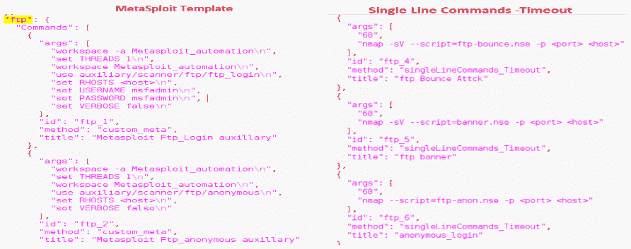

从前面的屏幕截图可以看出，JSON 文件中有各种类型的命令。Metasploit 模板包含用于执行 Metasploit 模块的命令。单行命令用于执行 NSE 脚本以及所有模块和脚本，这些模块和脚本不是交互式的，可以通过单个命令触发。其他类别包括`interactive_commands`和`single_line_sniffing`（我们需要在执行脚本的同时嗅探流量）。JSON 文件的通用模板如下所示：


**键**是服务的名称。标题包含文件的说明。`method_id`是调用要执行的外部脚本时应该调用的实际 Python 方法。请注意，对于单行命令，我们还以秒为单位指定了一个`timeout`参数作为`args`参数下的第一个参数。

# 仔细看一下代码

需要注意的是，整个代码库可以在 GitHub[找到 https://github.com/FurqanKhan1/Dictator](https://github.com/FurqanKhan1/Dictator) 。我们将查看构成服务扫描器的核心逻辑部分的所有基本代码文件。或者，我创建了一个即插即用的 Kali-VM 映像，其中包含所有必备安装和开箱即用的代码库。可以从以下 URL[免费下载和执行 https://drive.google.com/file/d/1e0Wwc1r_7XtL0uCLJXeLstMgJR68wNLF/view?usp=sharing](https://drive.google.com/file/d/1e0Wwc1r_7XtL0uCLJXeLstMgJR68wNLF/view?usp=sharing) 。默认用户名为`PTO_root`，密码为`PTO_root`。

让我们看一下基本文件和方法的概述，这些文件和方法将用于使用 Python 构建服务扫描引擎。

# Driver_scanner.py

端口扫描结束后，下一步是执行服务扫描。该 Python 类调用另一个类`driver_meta.py`，该类采用要对其执行服务扫描的项目名称/ID，如以下代码段所示：


# 驱动程序

此类显示端口扫描的默认结果，并为用户提供在需要时重新配置结果的选项。在重新配置之后，该类从要进行服务扫描的项目的数据库表中读取主机。对于每个主机，它读取 JSON 文件以获取要执行的命令，对于要执行的每个命令，它将控制传递给另一个文件`auto_comamnds.py`：

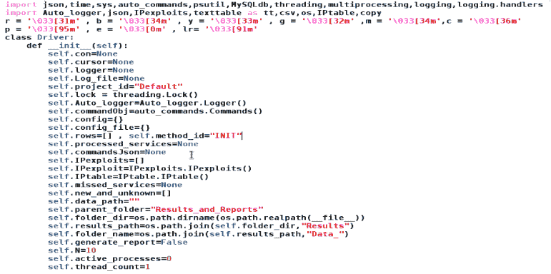

前面的类表示此 Python 模块的主父类。如我们所见，我们已经导入了各种其他 Python 模块，如 JSON、SYS 和 psutil，以用于此类。我们还可以看到，我们在这个模块中使用了其他类，如`auto_commands`、`Auto_logger`、`IPexploits`和`IPtable`。这些不是内置的 Python 模块，而是我们自己的类，它们为我们的服务扫描引擎执行不同的功能。稍后我们将更详细地讨论这些问题。

# main（）

看看这个类的`main()`方法，执行周期实际上从这里开始：

`main()`方法与 CLI 版本和 GUI 版本的代码使用的代码相同，因此有许多参数只有在 GUI 模式下调用时才相关。在本节中，我们将讨论在 CLI 模式下需要的功能。我们可以看到，在`main()`方法的定义中，`mode`变量被初始化为`c`。

在以下屏幕截图中突出显示为**（1）**的部分中，我们为`texttable()`Python 模块初始化了一个对象，该对象将用于在控制台窗口上绘制一个表，以显示可以执行服务扫描的项目 ID。第二部分从数据库中收集所有已完成的项目，**（3）**部分将检索到的行添加到要在屏幕上显示的程序变量中。后面的代码很简单。在第**（4）**节中，该功能实际上删除了服务扫描已经完成的项目的早期细节，以便用户可以使用新的服务扫描操作覆盖结果：


第**（5）**节在`results`文件夹下创建一个名为`<project_id>`的目录。例如，如果当前项目 ID 为`744`，则命令`init_project_directory()`将在`<parent_folder_code_base>/results/<744_data>`下创建一个子文件夹。所有日志文件、扫描配置和最终报告都将放置在此文件夹中。正如我们已经讨论过的，我们有一个预配置的 JSON 文件，其中包含服务名称和针对该服务执行的测试用例之间的映射

以下部分显示如何配置 JSON 文件。让我们以一个`http`服务为例，看看测试用例是如何配置为针对 HTTP 服务执行的：


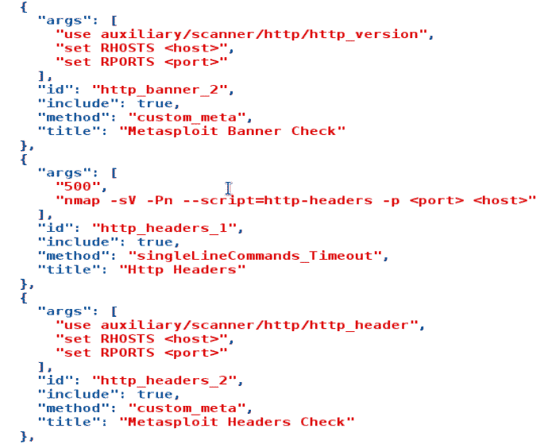


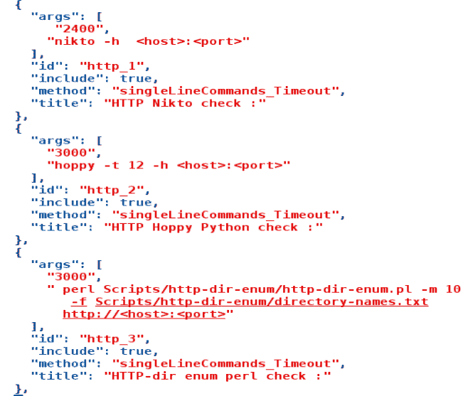

从前面的分岔中可以看到并分类，所有名为`http`的服务的测试用例都将放在一个 JSON 列表中，其键为`Commands`。`Commands`列表中的每个条目都是一个 JSON 字典，其中包含以下条目：`{"args":[],"id":"","method":"","include":"","title":""}`。每个字典制定一个要执行的测试用例。让我们试着理解每个条目：

*   `args`：`args`参数实际上是一个列表，包含针对目标执行的实际命令和 NSE 脚本。所有要执行的命令/脚本都分为五个不同的类别，我们将在方法部分中看到。现在，只要理解 args 包含要在 Kali 控制台上使用 Python 执行的实际命令就足够了。
*   `id`：每个要执行的命令都有一个唯一的 ID，便于枚举。对于所有基于 HTTP 的命令，我们可以看到 ID 是`http_1`、`http_2`、`http_3`等等。
*   `method`：这个特殊的条目非常重要，因为它引用了一个实际的 Python 方法，应该调用该方法来执行这个 testcase。这些方法放在 Python 文件/模块`auto_commands.py`中，这个类有不同的方法映射到 JSON 文件。通常，所有要执行的脚本都分为五个类/类别，每个类别都有一个与之关联的对应方法。脚本的类别及其相应的方法如下：
    *   `Single_line_comamnds_timeout`：所有需要一次性调用并为您生成输出的命令/脚本，不需要在两者之间进行任何交互，都属于此类别。例如，NSE 脚本可以如下执行：`nmap -p80 --script <scriptname.nse> 10.0.2.15`；它不需要任何其他输入，只需执行并提供最终输出。或者，可以按如下方式调用执行目录枚举的 Perl 脚本：`perl http-dir-enum.pl http://10.0.2.15:8000`。**同样，所有 Python 脚本、Bash 命令和 Kali 工具（如 Nikto 或 Hoppy）都属于这一类。所有这些脚本都由一个 Python 方法`singleLineCommands_timeout()`处理，该方法位于`auto_comamnds.py`模块内。需要注意的是，所有这些脚本还需要一个额外的`timeout`参数。有时，单个脚本由于某些原因挂起（主机可能没有响应，或者可能遇到未经测试的意外情况），挂起脚本将导致队列中的其他脚本处于等待状态。为了避免这种情况，我们在`args[]`列表中指定一个阈值参数作为第一个参数，这是我们希望脚本执行的最长时间（以秒为单位）。这就是为什么，从前面的配置中，我们可以看到，`500`秒被指定为 ID 为`http_5`的 NSE 脚本的超时。如果在`500`秒内未执行脚本，则操作将中止，并执行队列中的下一个脚本。**
    ***   `General_interactive`：除了需要激发并执行单行命令的脚本外，我们还有其他 Bash 命令、Kali 工具和开源脚本，它们在激发后需要一些交互。一个典型的例子是 SSH 到远程服务器，我们通常在那里传递两组命令。这可以在一次拍摄中完成，但为了理解，让我们以以下示例为例：
        *   `ssh root@192.168.250.143 [Command 1]`
        *   `password:<my_password> [Command 2]`**

 **另一个例子可能是 SQLmap 或 w3af_ 控制台之类的工具，在这些工具中需要一定数量的用户交互。请注意，有了这个自动化/扫描引擎，我们就有了一个变通办法，通过这个变通办法，可以使用 Python 自动调用和执行脚本。所有需要交互的脚本或测试用例都由一个名为`general_interactive()`的方法处理，该方法位于 Python 模块`auto_comamnds.py`下。

*   `include`**：**参数`include`取两个值：`True`和`False`，如果我们不希望测试用例/脚本包含在要执行的测试用例列表中，我们可以设置`include=False`。选择扫描配置文件时，此功能非常有用。在某些情况下，我们不希望在目标上运行耗时的测试用例，比如 Nikto 或 Hoppy，而只希望运行某些强制检查或脚本。为了具有该功能，引入了 include 参数。当我们使用扫描仪的 GUI 版本查看扫描配置文件时，我们将进一步讨论这一点。
*   `title`：这是一个信息字段，提供要执行的底层脚本的相关信息。

现在，我们已经对将加载到`self.commandsJSON``class variable`中的 JSON 文件有了很好的理解，让我们继续编写代码。

突出显示为**（6）**的部分读取我们`all_config_file`` program variable`中的 JSON 文件，该文件最终进入`self.commandsJSON`类变量。突出显示为**（7）、（8）**和**（9）**的代码部分加载要用于扫描的扫描配置文件：


默认情况下，我们代码的命令行版本的扫描配置文件是**强制配置文件**。这个概要文件大体上包含了应该针对目标执行的所有测试用例；它只是删除了一些耗时的内容。但是，如果我们希望更改`mandatory_profile`的定义，以添加减去测试用例，我们可以编辑`mandatory.json`文件，它与我们的代码文件`driver_meta.py`位于同一路径。

以下是`http`服务的`mandatory.json`文件中的条目：


突出显示为（9）的部分将加载我们示例中从项目 ID`744`的端口扫描获得的所有结果。结果保存在数据库表`IPtable_history`中，下面的屏幕截图告诉我们将加载哪些记录：


我们可以从前面的屏幕截图中看到，基本上有三条记录对应于 ID 为`744`的扫描。表列的架构为`(record_id,IP,port_range,status,project_id,Services_detected[CSV_format])`。

在后端执行的实际查询如下所示：


返回的结果将是可以迭代的列表列表。第一个内部列表的第 0 个索引将包含在 CSV 中检测到加载的服务。格式为`(host;protocol;port;name;state;product;extrainfo;reason;version;config;cpe)`，可以从前面的屏幕截图中验证。所有这些信息将放在`results_`列表中。

在**（10）**节中，如 folliwng 片段所示，我们正在迭代`results_`列表，并在新行`\n`上拆分字符串数据。我们将返回的列表进一步拆分为`;`，最后将所有结果放入一个列表`lst1 []`：


对于当前示例，在第（11）节之后，`lst1`将包含以下数据：

```
lst1=[
[10.0.2.15,tcp,22,ssh,open,OpenSSH,protocol 2.0,syn-ack,OpenSSH-7.2p2 Debian 5,10,cpe:/o:linux:linux_kernel],                                                                    [10.0.2.15,tcp,80,http,open,nginx,,syn-ack,nginx-1.10.2,10,cpe:/a:igor_sysoev:nginx:1.10.2],
  [10.0.2.15,tcp,111,rpcbind,open,,RPC #100000,syn-ack,-2-4,10,],
  [10.0.2.15,tcp,443,https,open,nginx,,syn-ack,nginx-1.10.2,10,cpe:/a:igor_sysoev:nginx:1.10.2],
  [10.0.2.15,tcp,8000,http,open,nginx,,syn-ack,nginx-1.10.2,10,cpe:/a:igor_sysoev:nginx:1.10.2],
  [10.0.2.15,tcp,8002,rtsp,open,,,syn-ack,-,10,]
]
```

因此，`lst1[0][0]`会给我们`10.0.2.15`、`lst1[2][2]=111`等等。

在代码的**（12）**部分，我们按照服务类型对`lst1`中的数据进行排序。我们已经声明了一个字典，`lst={}`，我们希望根据其服务类型对所有主机和端口进行分组，**（12）**、**（13）**部分的输出如下：

```
lst = {
"ssh":[[10.0.2.15,22,open,OpenSSH-7.2p2 Debian 5;10]],
"http":[[10.0.2.15,80,open,nginx-1.10.2],[10.0.2.15,8000,open,nginx-1.10.2]],
"rcpbind":[[10.0.2.15,111,open,-2-4,10]],
"https":[[10.0.2.15,443,open,nginx-1.10.2]],
"rtsp":[[10.0.2.15,8002,open,-]]
}
```

在第**（15）**、`ss = set(lst_temp).intersection(set(lst_pre))`节中，我们正在两个包含字典键的结构之间进行一组交集。一个结构包含字典`lst`中的键，字典又包含端口扫描器发现的所有服务。另一个包含从预配置的 JSON 文件加载的密钥，其目的是让我们看到所有发现的服务，这些服务映射了测试用例。所有发现和映射的服务密钥/名称都位于列表**SS**中，表示要扫描的服务。

在第**（16）**、`ms=list(set(lst_temp) - set(lst_pre))`节中，我们将 JSON 文件中未配置的服务与发现的服务进行比较。就常见的服务而言，我们的 JSON 文件非常详尽，但仍有一些情况下，Nmap 可能会在端口扫描期间找到一个未在 JSON 文件中预配置的服务。在本节中，我们试图识别 Nmap 发现的服务，但在 JSON 文件中没有针对这些服务映射测试用例。为了做到这一点，我们在两个结构之间做了一系列的区别。我们将这些服务标记为`new`，用户可以针对它们配置测试用例，也可以脱机分析它们以执行自定义测试用例。所有这些服务都将被放入名为`ms`的列表中，其中**ms**代表**错过的服务**。

在**（17）和（18）**节中，如下面的代码片段所示，我们再次以前面提到的格式在两个不同的字典中重新构造两个丢失和映射的服务：`{"ssh":[[10.0.2.15,22,open,OpenSSH-7.2p2 Debian 5;10]],...}`，发现的服务将被放入`dic`字典中，然后放入`self.processed_services`类变量中。遗漏的将被放入`ms_dic`中，最后放入`self.missed_services`：


最后，在**（19）**节中，我们将调用`parse_and_process()`方法，该方法将调用显示发现的和丢失的服务的逻辑，并在需要时为用户提供执行任何重新配置的选项。

重新配置完成后，`parse_and_process()`将调用另一个方法`launchExploits()`，该方法实际从 JSON 配置文件中读取`method_name`，用发现的相应主机 IP 和端口替换`<host>`和`<port>`，并将控制传递给`auto_command.py`的相关方法（基于`method_name`读取）模块。

一旦为所有发现的主机和端口执行了所有测试用例，就可以生成包含屏幕截图和相关数据的报告了。这是由**（20）**和**（21）**节处理的部分，如下面的片段所示：

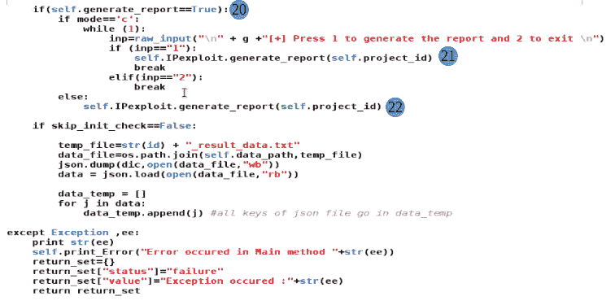

# 解析 _ 和 _ 进程（）

在下一节中，我们将了解`parse_and_process()`方法是如何工作的。需要注意的是，对于 CLI 版本，mode 变量的值为`c`，我们将只关注逐步升级到`mode=c`的代码部分。其他代码分支将用于 GUI 模式，如果您想了解更多信息，可以自由阅读。

第**（1）、（2）、（3）、**和**（4）**节中的`parse_and_process()`方法通过迭代`self.missed_services`和`self.processed_services`开始执行。这里的迭代思想是将这些发现的服务、主机、端口和`command_template`放在不同的数据库表`IPexploits`中。我们稍后将讨论`command_template`。对于我们当前的示例，`self.processed_services`将包含以下数据：

```
self.processed_services= {
"ssh":[[10.0.2.15,22,open,OpenSSH-7.2p2 Debian 5;10]],
"http":[[10.0.2.15,80,open,nginx-1.10.2],[10.0.2.15,8000,open,nginx-1.10.2]],
"rcpbind":[[10.0.2.15,111,open,-2-4,10]],
"https":[[10.0.2.15,443,open,nginx-1.10.2]],
}
self.missed_services ={
"rtsp":[[10.0.2.15,8002,open,-]]
}
```

这是因为除了`rtsp`之外，所有发现的服务都映射到 JSON 文件中：

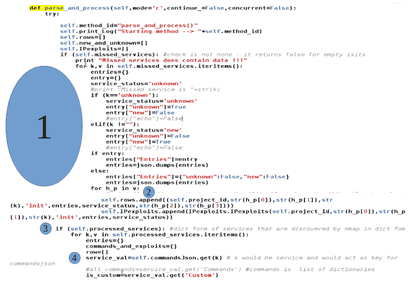

代码的第**（5）**节迭代该字典并尝试获取`getTemplate(k)`之类的内容，其中`k`是正在迭代的当前服务。`getTemplate()`是读取 JSON 文件并返回要执行的 testcase 的命令 ID 的方法。


下面的例子将说明这一点。假设`getTemplate`是通过`http`调用的，比如`getTemplate('http')`。这将返回以下结构：

```
entries= {"Entries": {"http_5": [true, "0", "0"], "http_trace_1": [true, "0", "0"], "http_trace_2": [true, "0", "0"], "http_trace_3": [true, "0", "0"], "http_banner_1": [true, "0", "0"], "http_banner_2": [true, "0", "0"], "http_robots_1": [true, "0", "0"], "http_robots_2": [true, "0", "0"], "http_headers_1": [true, "0", "0"], "http_headers_2": [true, "0", "0"], "http_methods_1": [true, "0", "0"], "http_methods_2": [true, "0", "0"], "http_web_dev_1": [true, "0", "0"], "http_web_dev_2": [true, "0", "0"]}}
```

结构如下：`{ "http_5" : ['include_command,commands_executed,results_obtained]}`。如果`http_5`是键，则该值是一个包含三个条目的列表。第一个表示是包含还是执行命令（取决于选择的扫描配置文件）。第二个条目保存在终端上执行的实际命令。最初设置为 0，但一旦执行，`http_5`的`0`将替换为`nmap -Pn --script=banner.nse -p 80 10.0.2.15`。**第三个`0`实际上将被执行上述命令产生的结果所取代。**

 **代码`entries=getTemplate(k)`将返回每个服务类型所述的条目。我们准备了一个名为`rows`的列表，其中我们放置了主机、端口、服务、打开/关闭状态和条目/`command_template`。执行该活动的代码段是`self.rows.append((self.project_id, str(h_p[0]), str(h_p[1]), str(k), 'init', entries, service_status, str(h_p[2]), str(h_p[3])))`。

`type=new`或未映射的服务将由代码段**（2）**处理。这将在我们示例的条目中放置以下内容：

`entries={"Entries": {"new": true, "unknown": false}}`

代码段**（6）**检查是否存在`if(is_custom==True)`之类的内容。这意味着，某些服务可以与其他服务一起多次使用。例如，`ssl`的测试用例可以与`[http +ssl]`、`ftps`作为`[ftp + ssl]`、`ssh`作为`[ssh + ssl]`等`https`一起使用。因此，`https`、`ftps`等服务被标记为`custom`，当发现`https`时，我们应该同时加载`http`和`ssl`的模板。这是第**（6）节中所做的。**

在第（6）节结束时，`self.rows`将为所有主机和端口设置`[project_id,host,port,service,project_status,command_template,service_type,port_state,version]`等条目。在我们当前的示例中，它将为所有服务类型保留六行。

在**（7）**、`self.IPexploit.insertIPexploits(self.rows)`节中，我们一次性推送后端数据库表`IPexploits`中`self.rows`的所有数据。必须记住，`command_template/entries`的数据类型在后端数据库中也标记为 JSON。因此，我们需要 MySQL 版本 5.7 或更高版本，它支持 JSON 数据类型。

执行此命令后，当前项目`744`的后端数据库如下：


必须注意的是，我没有加载`command_template`（后端名为`Exploits`，因为这样数据就会变得杂乱无章。让我们尝试加载两个服务的模板，例如`rtsp`和`ssh`：


同样，我们也会有`http`、`ssl`和`rcpbind`的条目。应该注意的是，我们期望表中有六行，但实际上有七行。这是因为`https`服务分为`http`和`ssl`两类，因此在`443`端口，我们没有`https`，而是有两个条目：`http-443`和`ssl-443`。

在下一节中，将从同一数据库表中获取项目的默认配置（主机、端口、要执行的测试用例），并将其显示给用户。第八节使用`launchConfiguration()`调用代码：


# 启动配置（）

在这一节中，让我们看一看 PosiT0}方法，它载入默认配置，并给用户调整或重新配置它的能力。此外，它调用文件的中心逻辑，该逻辑将实际启动脚本执行，即`launchExploits()`。

对于 CLI 版本`launchExploits()`由`launchConfiguiration()`调用。但是，在 GUI 版本中，`launchExploits()`仅由`parse_and_process()`方法调用。有关此方法的更多信息，请参见前面的屏幕截图。

以下代码段的**（1）**节加载了当前项目`IPexploits`表中的所有细节，即`744`。我们已经看到了将被拉出并放在`IPexploits`列表下的七行。请记住，在后端表中，我们只有命令 ID，例如`http_1`或`http_2`放在`Template`下，但是为了显示所选的配置和要执行的命令，我们拉出实际的脚本，它将映射到`http-1`等等。这就是**（2）**节正在做的事情。它读取 JSON 文件以获取实际命令。

在**（3）**节中，我们将拉取的细节放在一个`tab_draw`变量中，该变量将在控制台窗口上绘制一个表格，并表示加载的配置：

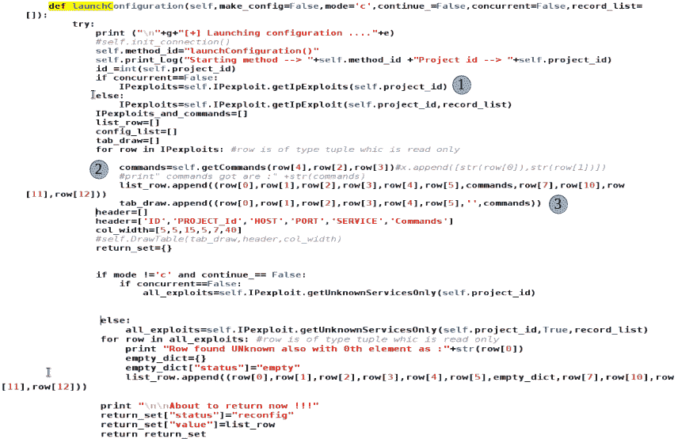

第**（4）**节是不言自明的；我们正在将所有提取的细节放入一个名为`config_entry`的字典中。这将保存到一个文件中，因为最终选择的扫描配置将启动：


最后，在**（6）**节下，我们称之为`launchExploits()`。如果需要执行重新配置，**（7）**节调用`self.reconfigure()`方法，该方法非常简单，可以从代码库或以下 URL<引用 https://github.com/FurqanKhan1/Dictator/blob/master/Dictator_service/driver_meta.py >：


第**（5）**节将在屏幕上显示配置，如下所示：


# launchExploits（）

以下部分将讨论`launchExploits()`方法

以下代码的**（9）**节加载了当前项目`IPexploits`表中的所有细节，即`744`。我们已经看到了将被拉出并放在`IPexploits_data`列表下的七行。我们不需要关注`if(concurrent=False)`的`else`块，因为它指的是 GUI 版本中调用的代码。现在，我们只考虑`if`块，就像 CLI 版本的`concurrent=False`一样。接下来，我们迭代`IPexploits_data: "for exploit in IPexploits_data:"`结构：

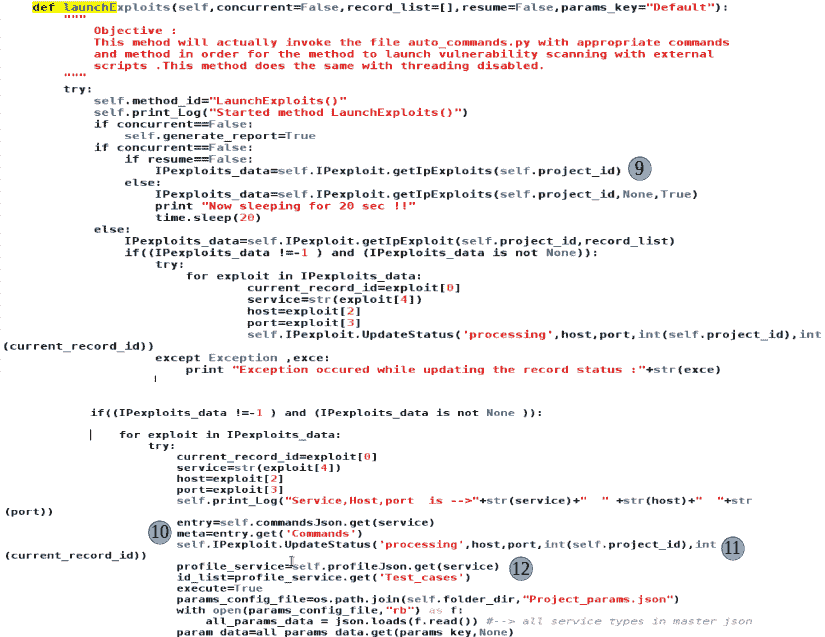

在第**（10）**节中，我们从正在迭代的当前服务的 JSON 结构加载详细信息。记住，`self.commandsJSON`保存了我们映射服务和测试用例的整个 JSON 文件数据。然后，我们加载该特定服务的所有命令和测试用例，并将它们放在一个列表`meta`下。例如，如果为`service = http`，则元将保持`[http_1,http_2,http_3,http_4,http_5 ...]`。现在，请记住，在最后一节中，对于七条记录中的每一条记录，`project_status`是`init`。在下一行**（11）**中，我们将当前记录的`(host,port,service,record_id)`组合状态更新为`processing`。由于我们已经选择了要执行的服务，所以我们希望更改数据库状态。

在第**（12）**节中，我们根据为项目选择的扫描配置文件，为要执行的特定服务加载所有启用的服务案例。如前所述，我们已经加载了所有基本案例。

某些项目/扫描可能还需要一些用户定义的参数，例如用户名、要使用的密码等。所有这些参数都放在一个`Project_params.json`文件中，**（13）**节将要执行的命令的用户名和密码替换为项目特定的用户名和密码，如适用：


`Self.commandObj`持有`auto_commands.pl`类的对象。第**（14）**节初始化与要执行的当前记录集（主机、端口、服务等）相关的类的实例变量。如前所述，JSON 文件中的`args`参数包含要执行的实际命令。我们在程序变量 args 中加载了`args`值。我们知道，这是一个包含命令的列表。我们迭代该列表，并用实际要扫描的 IP 替换`<host>`，用实际要扫描的端口替换`<port>`。我们将对所有测试用例逐一重复此活动。对于当前示例，如果我们假设`http`是要扫描的当前服务，则代码将迭代所有命令`[http_1,http_2..]`。最后，`http_5`和端口`80`的`final_args`列表将指定为`[500, nmap -Pn --script=banner.nse -P80 10.0.2.5]`：


在第**（16）**节中，我们实际上是从`auto_comamnds.py`模块调用了适当的方法。让我们想想这是如何工作的。`getattr(object, name[, default])`返回`object. name`的命名属性的值，并且必须是字符串。如果字符串是对象属性之一的名称，则结果是该属性的值。例如，`getattr(x,'Method_name')`相当于`x. Method_name`：


正如我们已经讨论过的，执行脚本/模块的方法的名称在 JSON 文件中预先配置，在前面的代码中，它是在变量方法中读取的。`func = getattr(self.commandObj,method_name)`将返回该方法的引用，并且可以调用，例如`func(args)`。这是在第**（18）**:`func(final_args,grep_commands)`节中所做的。当执行该方法时，它将自动将结果保存在数据库中。一旦执行了服务的所有测试用例，我们希望将该行的状态从`processing`更新为`complete`，这是在**（20）**节中完成的。重复相同的操作，直到扫描所有主机的所有查找到的服务。让我们看看在执行测试用例时数据库表的样子。我们将从不同的项目 ID 中选取示例：


从前面的屏幕截图可以看出，服务扫描前项目 ID 736 的这一特定行的数据如下：`Pid=736,Service='ssl',Exploits={"Entries" :{"ssl_1":[true,0,0]} ... }`。但是，一旦执行结束，第一个 0 将替换为执行了命令的列表。代替第二个 0，我们得到了字符串形式的最终结果。

# auto_commands.py

在下一节中，我们将从调用的方法如何自动化服务扫描过程的角度，来看看东西实际上是如何工作的。我们将探索 Python 模块或文件`auto_commands.py`。必须记住，在本节中，我们将介绍这个类的基本方法。除此之外，还有一些是为特定用例定制的。您可以在 GitHub 存储库[<中参考确切的代码文件 https://github.com/FurqanKhan1/Dictator/blob/master/Dictator_service/auto_commands.py >](http://%3Chttps://github.com/FurqanKhan1/Dictator/blob/master/Dictator_service/auto_commands.py%3E)。让我们先看看这个类是什么样子的：

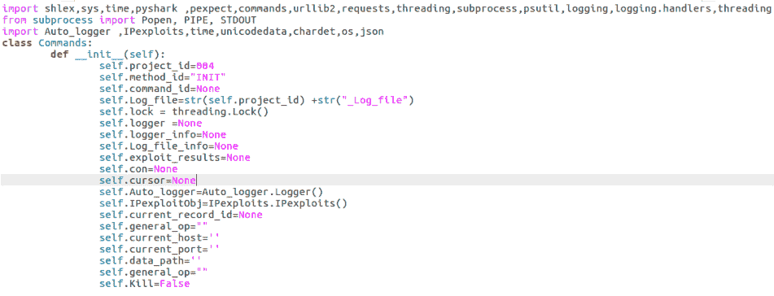

我们导入的模块之一是**pexpect**。在下一节中，让我们试着了解这个模块的功能以及它的重要性。

# 期望

Pexpect 是一个 Python 模块，它的工作方式类似于 Unix 的 expect 库。此库的主要目的是自动化交互式控制台命令和实用程序。Pexpect 是一个纯粹的 Python 模块，用于生成子应用、控制它们并响应它们输出中的预期模式。Pexpect 允许您的脚本生成一个子应用并控制它，就像人类键入命令一样。Pexpect 可用于自动化交互式应用，如 SSH、FTP、passwd、telnet 等。

我们将使用 Pexpect 使用 Python 自动化 Metasploit，并在中调用各种需要用户交互的终端自动化用例。必须注意，使用 Python 代码调用 Metasploit 还有另外两种方法：`"msfrpc"`，它调用构建在 Metasploit 之上的服务 API，以及`".rc"`脚本。然而，我们观察到，使用 Pexpect 模块取得了最大的成功。

Pexpect 模块有一个 spawn 类，用于生成任何终端命令、进程或工具。生成的工具应该作为代码的子进程生成。

spawn 类构造函数的语法如下所示：

`pexpect.spawn(command, args=[], timeout=30, maxread=2000, searchwindowsize=None, logfile=None, cwd=None, env=None, ignore_sighup=False, echo=True, preexec_fn=None, encoding=None, codec_errors='strict', dimensions=None, use_poll=False)`

`spawn`类构造函数需要很多参数，但必须使用的参数是`command`。`command`是我们希望在 Unix 终端上执行的实际命令。如果我们希望将参数传递给调用的命令，我们可以使用命令本身指定参数，并用空格分隔，或者将参数作为第二个参数`args`下指定的 Python 列表传递。第三个参数是`timeout`，默认为 30 秒。这意味着，如果在 30 秒内未生成进程，则整个操作将终止。如果我们的服务器负载过高，或者我们有性能问题，我们可以增加`timeout`参数。以下代码表示如何使用 Pexpect 调用 SSH 会话：

```
child = pexpect.spawn('/usr/bin/ftp')
child = pexpect.spawn('/usr/bin/ssh user@example.com')
```

我们还可以用一系列参数来构造它，如下所示：

```
child = pexpect.spawn('/usr/bin/ftp', [])
child = pexpect.spawn('/usr/bin/ssh', ['user@example.com'])
```

在终端上执行命令时，通过进程创建和控制会话，该进程返回并放置在`child`变量下，如上例所示。

`pexpect`的另一个重要类别是`expect`。Expect，顾名思义，列出了如果成功执行`spawn`命令可能产生的一个或多个预期输出。例如，如果`spawn`命令是`pexpect.spawn('/usr/bin/ssh',['user@example.com'])`，我们通常希望 ssh 服务器向我们询问密码。从先前指定的命令中预期的所有可能的模式或字符串都作为参数传递给`pexpect.expect`类，如果任何模式匹配，我们可以根据匹配定义下一个要发送到终端的命令。如果没有匹配项，我们可能会中止操作并尝试调试它。

以下语法检查流，直到模式匹配为止。该模式是重载的，可能有几种类型。模式可以是字符串类型、EOF、已编译正则表达式或这些类型的列表：

`pexpect.expect(pattern, timeout=-1, searchwindowsize=-1, async_=False, **kw)`

如果您传递一个模式列表和多个匹配项，则选择流中的第一个匹配项。如果此时有多个模式匹配，则选择模式列表中最左侧的模式。例如：

```
# the input is 'foobar'
index = p.expect(['bar', 'foo', 'foobar'])
# returns 1('foo') even though 'foobar' is a "better" match
```

`child.sendLine(command)`是一种方法，假设一切都按照预期模式工作，则接收发送给终端的命令：

```
child = pexpect.spawn('scp foo user@example.com:.')
child.expect('Password:')
child.sendline(mypassword)
```

让我们用一个小例子来说明使用 PQEY 的 SSH 自动化会使事情变得更清晰：

```
child = pexpect.spawn(ssh root@192.168.250.143)
i=child.expect(['.*Permission denied.*', 'root@.* password:.*','.* Connection refused','.*(yes/no).*',pexpect.TIMEOUT,'[#\$]',pexpect.EOF],timeout=15)
if(i==1):
       child.sendline('root')
       j=child.expect(['root@.* password:.*', '[#\$] ','Permission denied'],timeout=15)
       if(j==1):   
           self.print_Log( "Login Successful with password root")
       else:
           self.print_Log("No login with pw root")
```

在前面的代码中，我们只考虑成功场景。需要注意的是，如果终端需要输入列表`'root@.* password:.'`索引 1 中的内容，那么我们通过`sendline`方法将密码作为 root 传递。注意，`'root@.* password:.'`表示 root 之后的任何 IP 地址，因为它是一个 regex 模式*。*根据匹配的字符串/正则表达式模式的索引，我们可以制定我们的逻辑，以指示下一步应该做什么。

# 自定义 _meta（）

现在让我们看看`custom_meta`方法，它负责处理所有 Metasploit 模块。它是在 Pexpect 库的帮助下实现的。

从以下代码片段的**（1）**部分可以看出，我们使用`pexpect.spawn`在终端上调用`"msfconsole -q"`。这将通过虚拟终端调用 Metasploit 进程，并将该进程的控制权返回到声明为子变量的变量：

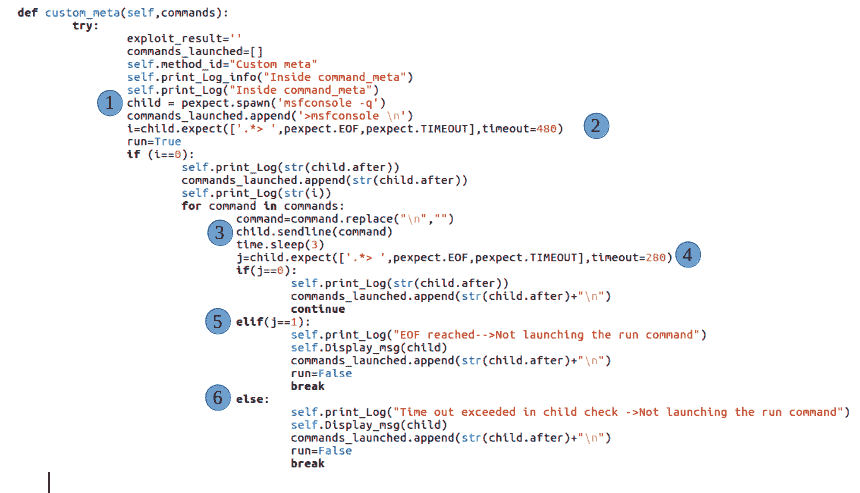

无论何时调用 msfconole，如果没有错误，我们都会得到一个 Metasploit 提示符`msf>`。这是我们在**（2）**、>、>节中指定的第 0 个索引。这里暗示的是，我们希望前面有`>`的任何内容都能成功执行，因此我们将传递运行 Metasploit 模块所需的命令。如果 child.expect 返回的索引为 0，我们将迭代 JSON 文件的命令列表，并将每个命令发送到 Metasploit 控制台。对于我们的 projectID`744`和`http`服务，我们已经配置了一些 Metasploit 模块。其中一项如下所示：


在前面的 JSON 结构截图中，`args`键中的任何内容都将作为列表传递给`custom_meta`方法，并存储在命令列表中。在第**（3）****节中，我们迭代了命令列表，并且，正如我们前面所研究的，`<host>`和`<port>`实际上将由实际主机和正在扫描的端口替换。**

 **在本节中，每个命令都通过`child.sendline(cmd)`命令逐个发送到 msfconsole 终端。在发送每个命令之后，我们需要检查控制台是否与我们期望的一样，这意味着它应该包含`msf>`提示符。我们调用`pexpect.expect`并指定`".*>"`作为输入列表的第 0 个索引。请注意，索引 0 定义了我们继续的成功标准。只要我们得到一个与索引 0 匹配的输出，我们就会按照第**（4）**节的规定继续。如果在任何时候我们观察到索引 0 以外的任何情况（超时或文件结尾–EOF），我们就会意识到某些事情没有按预期发生，因此我们将布尔变量设置为 false：


当我们退出这个迭代循环时，我们将转到第**（9）**节，在这里我们将检查 run==True。如果为真，我们假设所有参数都已正确设置以执行 Metasploit 模块。我们在`sendline`的帮助下发出`'run'`命令，如**（10）**节所强调的。

最后，如果一切顺利，并且模块成功执行，那么是时候收集我们的结果了。在**（11）**节中，如果一切正常，我们将在`exploits_results`变量中收集结果，并在`commands_launched`变量中收集命令。如果存在错误，我们将在**（12）**节中收集错误详细信息：


最后，在**（14）**节中，我们通过调用`saveDetails()`**方法**将结果保存在数据库表中。**必须注意的是，结果将保存在与前面讨论的相同的 JSON 结构中，`"http_headers_2"`键是脚本的 ID。`saveDetails`方法的定义如图所示。请注意，它将在我们将讨论的所有不同方法中发布：**

 **

突出显示为**（1）**的部分调用类文件`IPexploits.py`中的方法，该方法将在数据库中插入详细信息。整个代码文件可以在 GitHub 存储库**中找到。**

# singleLineCommands_Timeout（）

在本节中，我们将看到`singleLineCommands_Timeout`方法的定义。这段代码解释了线程和多处理的功能。我们在前面研究了所有概念，但在本节中，我们将了解如何应用线程和进程的概念来解决实际问题。

目前的问题是执行所有类别的命令和脚本，这些命令和脚本只需在控制台上触发一行即可执行。这些产生了产出。这看起来很简单，但有一个陷阱。请记住，我们讨论了由于某些不可预见的原因，脚本的执行可能需要很长时间的情况，我们应该以这样的方式设计我们的解决方案：在这种情况下，所有脚本类别都有一个超时。这里，我们将使用线程来实现超时功能。线程和进程的组合将帮助我们实现目标。

中心思想是调用线程并将其绑定到方法“x”。我们在调用的线程上调用`join()`，并且`join()`的持续时间将是 JSON 文件中指定的超时。正如我们前面所研究的，`join()`方法在从主线程“m”通过线程“t”调用时，将导致主线程“m”等待“t”完成其执行。如果我们从主线程“m”在线程“t”上调用 join（20），这将导致主线程“m”等待 20 秒，等待“t”完成。20 秒后，主线程将继续执行并退出。我们可以用同样的类比来完成我们的任务：

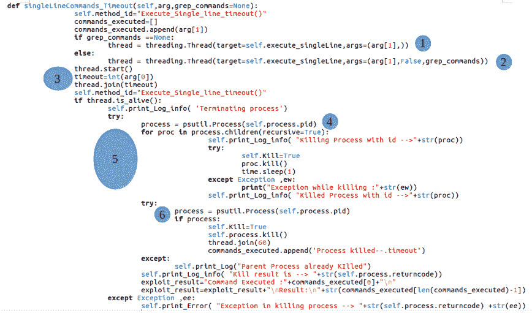

在**（1）**和**（2）**节中，我们正在创建一个`thread`对象，并且我们附加到它的方法是`"execute_singleLine"`。需要注意的是，在某些情况下，我们希望从最终输出中 grep 出一些内容，这就是为什么我们要检查是否设置了`grep`参数。如果设置了，`grep`字符串作为参数发送给 thread 方法；否则，我们只发送该方法应该调用的控制台脚本/命令。我们现在不需要担心 grep 条件。

在**（3）**节中，我们可以看到我们正在收集超时参数，它始终位于命令列表的索引 0 处或 JSON 文件中参数的第 0 个索引处。我们在线程上调用 start 方法，它将调用`"execute_singleLine"`方法并将要执行的命令作为参数传递。之后，我们调用`join(timeout)`，在调用的线程上，代码将在那里暂停，直到超时下指定的持续时间秒。在**（3）**节之后的任何一行都不会执行，直到`"execute_singleLine"`方法完成或时间超过超时。在继续前行之前，让我们更仔细地看一下在第三部分中发生的事情。


按照`"execute_singleLine()"`方法的**（1）**节的规定，我们正在利用 Python 的子流程模块生成一个子流程。该过程将由`"cmd"`变量中的命令指定。因此，如果`cmd`持有`nmap -Pn --script=banner.nse -p 80 192.168.250.143`，终端会执行相同的命令，这不过是操作系统级的一个流程，流程类的实例会被返回并放置在`self.process`类变量下。该实例包含各种属性，如`"id"`、`"is_alive()"`等，它们为我们提供了有关流程状态的信息。

因为我们确定传递给流程的参数（因为它们不是直接来自用户），所以我们可以继续。但是，最好使用`shell=False`并将参数指定为列表`[]`，或者使用 Python 的**shelx**实用程序将字符串参数自动转换为列表并使用`shell=False`。

我们希望父进程等待子进程执行，我们还希望子进程将其生成的所有数据返回给父进程。我们可以通过在被调用的流程上调用`communicate()`来实现这一点。`communicate()`方法将返回一个元组，其中第 0 个索引包含进程的输出，第一个索引将产生错误。由于我们指定了`output=subprocess.PIPE`和`error=subprocess.PIPE`，因此输出和错误都将通过 OS 管道传输到父进程，这就是我们实现进程间通信的方式。这在第**（2）节中突出显示。**

我们的下一个挑战是将控制台输出转换为标准 ASCII 格式，以便将数据干净地保存在数据库中。应该注意的是，不同的工具和脚本以不同的格式和编码生成适合控制台显示的数据。控制台支持多种编码，但我们需要将输出保存在数据库表中，因此在推送数据之前，我们需要将其从控制台编码转换为 ASCII 格式。这就是我们在**（3）节中所做的。**

在**（4）**节中，我们通过调用`process = psutil.Process(self.process.pid).`来控制父进程

在**（5）**节中，在清理完数据后，我们通过调用`saveDetails()`**方法推送已执行的命令和在数据库表中生成的数据。**

 **在第**（3）节之后，**通过调用`thread.is_alive()`检查线程是否仍然处于活动状态。如果返回`false`，则表示线程在指定时间内通过内部调用`subprocess.Process`命令成功执行，并且详细信息保存在数据库表中。但是，如果`thread.is_alive()`返回`true`，这意味着外部脚本仍在运行，因此我们需要强制终止它，以便它不会妨碍其他要执行的脚本的执行。请记住，调用的流程将返回我们保存在`self.process`类变量下的流程实例。我们将在这里使用这个变量来终止这个进程。Python 有一个非常强大的实用程序，名为`"psutil"`，我们可以使用它不仅杀死进程，还可以杀死该进程调用的所有子进程。我们还需要杀死子进程，因为我们不希望这些进程在后台运行并消耗我们的 CPU。例如，像 Nikto 这样的工具可以调用许多子进程来加快整个操作，我们希望杀死所有子进程，以确保父进程被杀死，并且所有系统资源都被释放出来供其他进程使用。获取父进程后，我们使用`for`循环`for proc in process.children(recursive=True):`迭代其每个子进程，并通过发出`proc.kill()`**命令来杀死每个子进程。**这在**（5）节中突出显示。**最后，在**（6）**节中，我们通过调用`self.process.kill()`来确保我们也杀死了父进程。

# 一般互动

在本节中，我们将了解`general_interactive()`方法是如何工作的。虽然我们也可以使用此方法实现 Metasploit 命令，但为了保持类别的分离，我们单独实现了 Metasploit。

`general_interactive`的目标是自动化交互式工具和 Bash 命令。这意味着 JSON 文件包含成功模式和失败模式，它们定义了执行工作流。我们将使用 Pexpect 来适应这一点，如下所示：

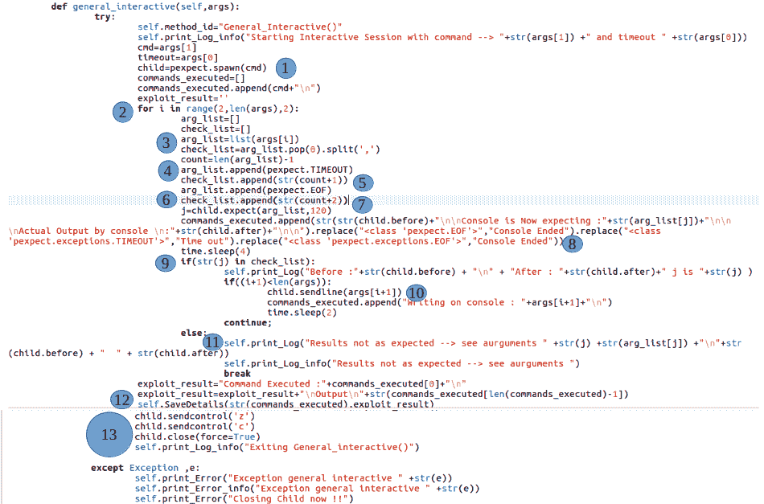

让我们更仔细地看看这种方法，通过干运行，如图所示：


正如我们在`args[]`中看到的，第一个参数是超时。第二个索引包含我们希望使用通用交互方法自动执行的命令。与此类别一样，第一个参数是`timeout`，第二个参数是要触发的命令。从这里开始，定义了一个备用模式。第三个索引将保存预期输出列表和成功标准。如果满足成功标准，第四个索引将保存下一个要发送到控制台的命令。第五个索引将根据在第四个索引中发送的命令再次保存预期的输出列表，它还保存成功标准。该模式非常简单，并且根据我们计划自动化的底层命令或工具的要求执行相同的交替序列。

成功标准在预期输出列表的第一个索引处定义。如果有多个成功结果或指数，可以在第一个指数处以逗号分隔的输入形式给出。让我们以上面的`rlogin`为例，我们尝试使用 root 作为用户名和密码进行远程登录，并尝试了解预期的输出列表所包含和表示的内容。索引 3 处的列表包含`['0,1','.* password: .*","[$,#]",".*No route.*"]`**这里，第 0 个索引“0,1”定义了成功标准。这意味着如果终端期望`".* password: .*"`或`"[$,#]"`，我们假设输出与预期一致，因此我们向控制台发送下一个命令，在我们的例子中是`"root"`。如果我们得到的不是索引 0 或 1，我们假设工具或脚本的行为不符合预期，从而中止操作。**

 **要配置属于这一类别的命令和脚本，测试人员需要知道脚本在成功和失败条件下是如何执行的，并制定一次配置文件。前面的代码很简单，实现了我们前面讨论的相同逻辑。

# 一般命令

这里的想法类似于我们如何借助线程实现`singleLineComamnd()`方法。请注意，要执行的命令的类别可能是`interactive`或`"singleLineCommand_Timeout"`，以及嗅探操作。我们将创建一个线程，并通过将其附加到`start_sniffing`方法将嗅探任务委托给它。我们还将重用前面创建的方法。我们调用**（1）**规定的`singleLineCommands_Timeout()`或**（2）**规定的`general_interactive()`：


在第**（3）**和**（4）**节中，我们检查嗅探过程是否仍然存在，如果存在，我们将其杀死：

```
start_sniffing()
```

我们通常使用 Wireshark 来捕获接口上的所有流量。由于 Wireshark 是一个桌面应用，因此在本例中，我们将使用**Tshark**。Tshark 代表终端 shark，是 Wireshark 的 CLI 版本。Tshark 调用命令在第**（2）**节中指定，其中我们指定希望 Tshark 嗅探流量的端口。我们还指定需要嗅探流量的主机或目标主机。我们同时指定主机和端口的原因是我们希望保持结果的完整性；该工具的 GUI 版本可以部署在服务器上，多个用户可以使用它进行扫描。如果我们指定它应该在接口上嗅探，那么来自其他用户的其他正在运行的会话的数据也将被嗅探。为了避免这种情况，我们对主机和端口非常具体。我们还指定它嗅探的超时时间。我们将输出保存在指定为`"project_id_host_port_capture-output.pcap"`的文件中。

在第**（2）**节中，我们在前面讨论的子流程模块的帮助下调用`tshark`流程：


# 基于 HTTP_（）的

下面的`http_based`方法很简单。我们使用 Python 的请求库向目标发送 GET 请求，捕获响应，并将其保存在数据库中。现在，我们只是发送一个 GET 请求，但是您可以调整代码，在自己的时间内处理 GET 和 POST。在接下来的章节中，我们将介绍更多关于 python 请求和抓取的内容：

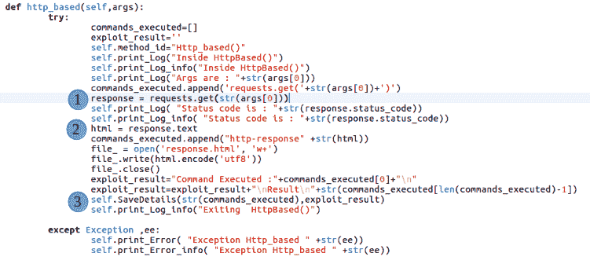

# IPexploits.py

另一个处理服务扫描引擎数据库层的重要代码文件是`IPexploits.py`。这个文件很简单；它包含各种方法，每个方法的目标都是从数据库表中获取数据或将数据放入数据库表中。我们不会在这里讨论这个模块，但我建议您看看可以在 GitHub 存储库[中找到的代码 https://github.com/FurqanKhan1/Dictator/blob/master/Dictator_service/IPexploits.py](https://github.com/FurqanKhan1/Dictator/blob/master/Dictator_service/IPexploits.py) 。

# 执行代码

在执行代码之前，请仔细参考 GitHub 存储库[中的安装和设置说明 https://github.com/FurqanKhan1/Dictator/wiki](https://github.com/FurqanKhan1/Dictator/wiki) 。《安装指南》还讨论了如何设置后端数据库和表。或者，您可以下载已安装并预配置所有内容的即插即用 VM。

要运行代码，请转到以下路径：`/root/Django_project/Dictator/Dictator_Service`。将代码文件`driver_main_class.py`作为`:python Driver_scanner.py`运行必须注意的是，结果是使用 Python 库生成的，该库将控制台输出转换为其 HTML 等价物。更多详细信息可在以下代码文件[中找到 https://github.com/PacktPublishing/Hands-On-Penetration-Testing-with-Python](https://github.com/PacktPublishing/Hands-On-Penetration-Testing-with-Python) ，根据`generate_results()`方法。

# 漏洞扫描器的服务扫描部分的数据库架构

对于扫描结果的服务扫描，请转到 IPexploits 表，其架构如下所示：

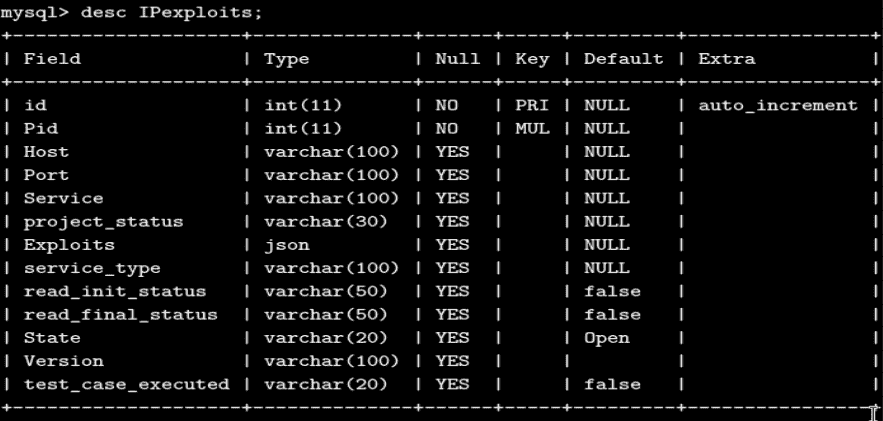

# 漏洞扫描器的 GUI 版本

可以增强前面讨论的相同代码库，以开发基于 web 的漏洞扫描器版本，同时具有端口扫描和服务扫描功能。该工具有许多不同的功能，包括一个四层体系结构，它有一个 web 层表示、一个 web 层服务器、一个 API 层和一个 DB 层。从 GitHub 存储库[下载并安装该工具的 web 版本 https://github.com/FurqanKhan1/Dictator/wiki](https://github.com/FurqanKhan1/Dictator/wiki) 。或者，您可以使用即插即用虚拟机，只需登录并在`https://127.0.0.1:8888`打开浏览器即可访问该工具。

扫描仪 GUI 版本的各种功能包括：

*   并行端口扫描
*   暂停和恢复端口扫描
*   服务扫描
*   全测试用例自动化
*   暂停和恢复服务扫描**（不在 CLI 中）**
*   并行服务扫描**（不在 CLI 中）**
*   Nmap 报告上传和 Qualys 和 Nessus 报告解析

# 用法[PTO-GUI]

以下部分将引导我们了解扫描仪 GUI 版本的使用。

# 扫描模块

根据在底层基础结构上进行的扫描的类型和性质，pen 测试仪有多个可用选项，可以选择最适合待测试给定基础结构的选项。以下部分介绍了各种可用的使用模式。

# 顺序模式

在顺序模式下，该工具将首先进行发现，然后进行重新配置，然后开始服务扫描。因此，这是一个三步过程。请注意，在顺序模式下

*   在扫描所有主机之前，无法启动服务扫描
*   一旦启动服务扫描，就无法进行重新配置
*   服务扫描一旦启动，将为所有服务启动。用户无法控制首先扫描哪个服务和最后扫描哪个服务

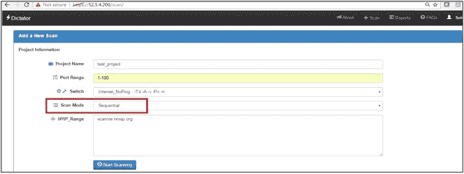

# 发现完成后的重新配置

为了减少误报和漏报，请分析端口扫描结果，如果需要，重新配置/更改它们。如果遗漏了任何服务/端口，您还可以添加测试用例。


在前面的屏幕截图中，我们正在将类型为**状态为**的服务更改为类型为`ftp`。因此，测试用例将针对`ftp`运行。注意：仅当您确定发现的服务不正确或类型为`Unknown`时，才执行此操作。我们将很快了解服务类型。

如果 nmap 遗漏了主机/端口/服务，可以手动添加，如下所示：


添加测试用例后，我们可以点击**开始扫描**选项开始服务扫描。我们可以选择启用线程选项以加速结果，也可以在不使用线程选项的情况下启动服务扫描，如以下屏幕截图所示：


查看中间结果：当一个人点击**开始扫描**时，他/她将被重定向到扫描页面。每次执行测试用例时，UI 都会被更新，并且在被扫描的服务前面的屏幕上会出现一个蓝色图标。用户可以单击该图标来查看测试用例结果。

当服务的所有`test_cases`将被执行时，图标将变为绿色。

下图显示了中间测试用例结果：

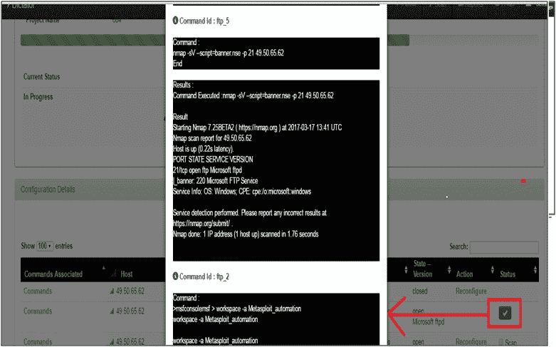

在任何时候，用户都可以离开 UI 而不影响正在运行的扫描。如果用户希望看到当前正在运行的扫描，他可以从顶部的**扫描状态**选项卡中选择运行扫描。将显示以下屏幕：


根据扫描的状态，它将显示适当的操作。如果扫描正在进行，**动作**栏的动作为**进行中**，用户点击此按钮可进入当前扫描状态的 UI 画面。

用户可以单击扫描的名称以查看最初启动扫描时使用的配置（主机、端口、交换机）。

# 并发模式

在顺序模式下，只有在扫描所有端口和主机的端口扫描结果可用时，才能启动服务扫描。因此，笔式测试仪可能需要等待才能获得这些结果。此外，在此模式下，笔式测试仪无法控制哪些服务可以先扫描，哪些服务可以稍后扫描。所有服务都是一次性扫描的，限制了对服务扫描的控制粒度。这些是由并发模式处理的顺序模式的限制。

并发模式提供了在服务发现完成时启动服务扫描的灵活性，并进一步提供了根据笔测试人员的选择为选择性服务启动服务扫描的选项。

1.  点击**扫描**选项卡下的**新扫描**选项卡。
2.  填写扫描参数，选择扫描模式为**并发**：


3.  其余步骤将是相同的，唯一的例外是在这种扫描模式下，用户不必等待扫描所有主机和端口，即可开始服务扫描。此外，用户还可以选择希望扫描的服务。下图对此进行了说明：


正如您在前面的屏幕截图中所看到的，用户可以选择先扫描`http`，而不是立即扫描 ssh。用户可以决定何时扫描什么服务。

所有功能（重新配置、查看结果等）也可在并发模式下使用。

# 顺序默认模式

使用此模式，服务扫描将在发现完成后立即开始，从而跳过重新配置阶段。在计划扫描的情况下，此模式的实用性更为重要，笔式测试仪可能会计划在其他时间开始扫描，并且可能无法进行重新配置，同时希望继续进行服务扫描的默认端口扫描结果。因此，该扫描模式跳过了重新配置阶段，在获得默认`nmap`端口扫描结果时直接启动服务扫描。

1.  点击**扫描**选项卡下的**新扫描**选项卡
2.  填写扫描参数，选择扫描模式为**顺序默认**


端口扫描结果完成后，无论用户当前是否登录，它都将自行启动服务扫描。

# 暂停和恢复扫描

无论扫描模式如何，都可以暂停处于查找或服务扫描状态的任何扫描。中间结果将被保存，用户可以在将来随时恢复扫描。

必须注意的是，如果在查找时暂停扫描（端口扫描将一直进行），则将保存已扫描端口的端口扫描结果；一旦用户恢复，将开始扫描未扫描的端口。同样，如果扫描在服务扫描期间暂停，那么无论扫描的是什么服务，它们的结果都将被保存，并且用户可以灵活地分析将被扫描的服务的结果。扫描恢复后，将开始对未扫描的服务进行服务扫描。

以下屏幕截图显示了如何暂停正在进行的扫描：


要恢复扫描，请转至**当前扫描**选项卡或**暂停扫描**选项卡。默认情况下，“操作”列有两个按钮：

*   **恢复**：这将从暂停的任何状态恢复扫描。
*   **分析**：如果扫描时暂停扫描，则渗透测试人员可以分析已经扫描的服务的结果。如果您希望恢复扫描，则他/她可以选择“分析”选项。有了它，用户可以看到已完成服务的中间测试用例结果。

如果扫描将在端口扫描期间暂停，则分析选项可能不会出现，因为不会执行`test_cases`来分析端口扫描是否进行以及模式是否并发。对于并发扫描，**分析**选项不出现，**恢复**按钮将执行恢复和分析并发模式下调用的扫描的联合功能。


# 下载报告或分析扫描何时完成

扫描完成后，用户会在 UI 上获得**下载所有**选项。如果用户访问**当前扫描**选项卡，对于发现扫描和服务扫描状态均为**完成**的所有扫描，**动作**默认情况下，column 可以下载结果进行脱机分析，也可以在线分析结果，如以下屏幕截图所示：


点击**下载所有**按钮，将下载一个压缩文件夹。它将有：

*   包含所有测试用例结果的最终 HTML 报告。
*   Pcap 文件，用于在需要嗅探的位置嗅探某些服务。可以使用 Wireshark 打开 Pcap 文件，并分析文本/凭证是以明文形式还是以加密格式传递。注意：Pcap 文件的名称类似于`<project_id>_capture_output.pcap`。因此，如果在`host1`上对端口`21`和项目 ID`100`进行嗅探，则 Pcap 文件名将为`100_host1_21_capture_output.pcap`。
*   下载的文件夹还将具有最终选择的配置（服务-测试用例），启动扫描时使用该配置。（JSON 格式）
*   另一方面，点击**分析测试**将带我们进入 UI，在那里我们只能在用户界面上看到所有`test_cases`的结果。

# 报告

要上传 Nmap 报告，请转到**上传报告**并选择 Nmap 报告。它是一个结果导入模块，可以从现有的`Nmap.xml`报告文件中读取结果，并可以将结果导入我们的自定义数据库，并进一步使用这些结果来启动测试用例/服务扫描。因此，用户可以灵活地在两种模式下使用我们的工具：

*   发现和服务扫描在一起
*   仅服务扫描模式


点击**上传**按钮，将解析并上传报告。用户可以进入**当前扫描**页签，会发现上面列出的上传项目`test_upload_nmap`，其**发现状态**为**完成**且**服务扫描**状态为**未完成**。用户可以点击**动作**页签**进行中的**重新配置结果，然后开始服务扫描。

*   Qualys 和 Nessus 报告解析器

要使用此选项，请转到**上传报告**选项卡，并选择**Qualys**/**Nessus**报告。我们有一个报告合并模块，它将合并从 Qualys、Nessus 和手动测试用例获得的结果。为了合并报告，必须首先对其进行分析。我们有 Qualys、Nmap 和 Nessus 报告解析器。它们都将采用 XML 格式的报告，并将解析该报告并将其放置在本地存储中，以便查询结果并将其与其他报告集成变得更加容易：

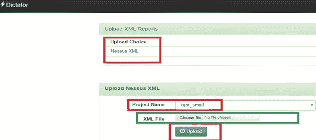

在此处上载报告的目的是将其与一些手动项目合并。因此，从下拉列表中选择用户可能希望合并 Nessus/Qualys 报告的项目。

*   报告合并：

要使用此选项，请转到**合并报告**选项卡，并选择要与之集成 Qualys 和 Nessus 结果的手动项目的**ID**/**名称**。

它假设 Nessus 和 Qualys 报告已经上传并链接到要合并的项目。

该模块合并了手动测试用例、解析的 Qualys 报告、解析的 Nessus 报告，还将 CVE 映射到漏洞利用，最后，将为用户提供一个选项，以下载任何格式（XML、HTML、CSV、JSON）的集成报告，从而提供一个综合视图进行分析。


最终的可下载报告有四种格式（HTML、CSV、JSON、XML）。

合并报告将根据 Nessus/Qualys 和手动测试案例中的常见结果进行合并。它将公共主机和端口群集到一个组中，从而使分析变得更容易。

# 总结

在本章中，我们讨论了如何使用各种 Python 模块来实现服务扫描自动化的任务。我们还研究了如何结合使用线程和多处理来解决实际问题。本章讨论的所有概念在前几章中基本上都提到过。在本章结束时，读者应该很好地理解 Python 在网络安全领域的强大功能，以及我们如何使用它来制作自己的扫描仪。我们还查看了 GUI 模式下漏洞扫描器的概述。

在下一章中，我们将看到如何使用机器学习和自然语言处理来自动化渗透测试阶段的手动报告分析阶段。

# 问题

1.  为什么我们不使用 msfrpc 来自动化 Metasploit？
2.  我们可以做些什么来进一步优化吞吐量？
3.  是否必须使用 JSON 文件？我们可以改用数据库吗？
4.  我们还可以与扫描仪集成哪些其他工具？

# 进一步阅读

*   Python nmap 0.6.1:[https://pypi.org/project/python-nmap/](https://pypi.org/project/python-nmap/)
*   来自 Python 的 nmap:[https://xael.org/pages/python-nmap-en.html](https://xael.org/pages/python-nmap-en.html)
*   JSON 编解码器：[https://docs.python.org/2/library/json.html](https://docs.python.org/2/library/json.html)************