# 七、机器学习与网络安全

如今，**机器学习**（**ML**是我们经常遇到的一个术语。在本章中，我们将概述 ML 到底是什么，它解决了什么样的问题，以及它在网络安全生态系统中可以有什么样的应用。我们还将研究各种不同类型的 ML 模型，以及在哪些情况下可以使用哪些模型。应该注意的是，本书的范围不是详细介绍 ML，而是提供对 ML 及其在网络安全领域中的应用的坚实理解。

本章将详细介绍以下主题：

*   机器学习
*   基于回归的机器学习模型
*   分类模型
*   自然语言处理

# 机器学习

让我们从一个基本问题开始：*什么是机器学习，我们为什么要使用它？*

我们可以将 ML 定义为数据科学的一个分支，它可以有效地解决预测问题。假设我们有过去三个月电子商务网站客户的数据，该数据包含特定产品的购买历史（`c_id`、`p_id`**、**`age`、`gender`、`nationality`、`purchased[yes/no]`）。

我们的目标是根据客户的购买历史记录，使用数据集确定可能购买产品的客户。我们可能认为，一个好主意是将购买列考虑在内，并假设以前购买过该产品的人最有可能再次购买该产品。然而，更好的业务解决方案将考虑所有参数，包括购买最多的地区、客户的年龄组以及他们的性别。基于所有这些领域的排列，企业主可以更好地了解受产品影响最大的客户类型，因此营销团队可以设计更具体、更有针对性的活动。

我们可以用两种不同的方法来实现这一点。第一种解决方案是用我们选择的编程语言编写软件，并编写逻辑，为所讨论的每个参数赋予特定的权重。这样，逻辑就能够告诉我们所有潜在的买家是谁。然而，这种方法的缺点是，起草逻辑需要大量的时间，如果添加了新的参数（如客户的职业），逻辑将需要更改。此外，所编写的逻辑只能解决一个特定的业务问题。这是机器学习发展之前采用的传统方法，目前仍被各种企业使用。

第二种解决方案是使用 ML。基于客户数据集，我们可以训练 ML 模型，并使其预测客户是否是潜在买家。培训模型涉及将所有培训数据输入到一个 ML 库，该库将考虑所有参数，并了解哪些是购买产品的客户的公共属性，哪些是未购买产品的客户的属性。通过模型学习到的任何东西都会保存在内存中，所获得的模型被称为训练模型。如果模型中显示了新客户的数据，它将使用其培训，并根据通常导致购买的已学习属性进行预测。过去必须用计算机程序和硬编码逻辑解决的同一个业务问题现在用数学 ML 模型解决了。这是我们可以使用 ML 的许多情况之一。

重要的是要记住，如果手头的问题是预测问题，那么可以应用 ML 来获得良好的预测。然而，如果问题的目标是自动执行手动任务，那么 ML 将没有帮助；我们需要使用传统的编程方法。ML 通过使用数学模型来解决预测问题。

**人工智能**（**AI**是我们可能经常遇到的另一个词。现在让我们尝试回答另一个问题：什么是人工智能，它与机器学习有什么不同？

# 在 Kali Linux 中设置机器学习环境

所有 ML 库都打包在一个名为`anaconda`的包中。这将安装 Python 3.5 或可用的最新 Python 版本。要运行 ML 代码，我们需要 Python 3 或更高版本：

1.  从以下 URL 下载蟒蛇：[https://conda.io/miniconda.html](https://conda.io/miniconda.html) 。
2.  通过运行`bash Anaconda-latest-Linux-x86_64.sh.>`安装所有软件包
3.  有关更多详细信息，请参阅以下 URL:[https://conda.io/docs/user-guide/install/linux.html](https://conda.io/docs/user-guide/install/linux.html) 。

# 基于回归的机器学习模型

当我们必须预测连续值而不是离散值时，我们使用回归模型。例如，假设数据集包含员工的工作年限和工资。基于这两个值，该模型经过训练，预计将根据员工的*年经验*对其工资进行预测。由于工资是一个连续的数字，我们可以利用基于回归的机器学习模型来解决这类问题。

我们将讨论的各种回归模型如下：

*   简单线性回归
*   多元线性回归
*   多项式回归
*   支持向量回归
*   决策树回归
*   随机森林回归

# 简单线性回归

**简单线性回归**（**SLR**）获取线性数据，并在需要时对其应用特征缩放。**特征缩放**是一种平衡各种属性影响的方法。所有的机器学习模型本质上都是数学模型，所以在用数据训练模型之前，我们需要应用一些步骤来确保所做的预测没有偏差。

例如，如果数据集包含三个属性（`age`、`salary`和`item_purchased[0/1]`），我们人类知道，可能去商店的年龄组在 10 到 70 岁之间，工资可能在 10000 到 100000 之间或更高。在进行预测时，我们希望将这两个参数都考虑在内，以了解哪一年龄组、哪种工资最有可能购买产品。然而，如果我们在不将年龄和工资调整到相同水平的情况下对模型进行训练，由于年龄和工资之间的巨大数值差异，工资的价值将掩盖年龄的影响。为了确保不会发生这种情况，我们对数据集应用特征缩放来平衡它们。

需要的另一个步骤是数据编码，使用**一个热编码器**。例如，如果数据集具有国家属性，则这是一个分类值，比如说，它有三个类别：俄罗斯、美国和英国。这些词对数学模型来说没有意义。使用一个热编码器，我们转换数据集，使其读取（`id`、`age`、`salary`、`Russia`、`UK`、`USA`、`item_purchased`。现在，所有购买了该产品且来自俄罗斯的客户都会在名为“俄罗斯”的列下显示数字 1，在美国和英国列下显示数字 0。

例如，假设数据最初看起来如下所示：

| **ID** | **国家** | **年龄** | **工资** | **购买** |
| 1. | 美国 | 32 | 70 千 | 1. |
| 2. | 俄罗斯联邦 | 26 | 40K | 1. |
| 3. | 英国 | 32 | 80 千 | 0 |

执行数据转换后，我们将获得以下数据集：

| **ID** | **俄罗斯** | **美国** | **英国** | **年龄** | **工资** | **购买** |
| 1. | 0 | 1. | - | 0.5 | 0.7 | 1. |
| 2. | 1. | 0 | 0 | 0.4 | 0.4 | 1. |
| 3. | 0 | 0 | 1. | 0.5 | 0.8 | 0 |

可以看出，获得的数据集是纯数学的，因此我们现在可以将其交给回归模型学习，然后进行预测。

应该注意的是，有助于进行预测的输入变量称为自变量。在上例中，`country`、`age`和`salary`是自变量。定义预测的输出变量称为因变量，在本例中为`Purchased`列。

# 回归模型是如何工作的？

我们的目标是在数据集上训练一个机器学习模型，然后要求该模型进行预测，以便根据员工的经验确定应该给他们的工资。

我们正在考虑的示例基于 Excel 表格。基本上，我们有一家公司的数据，该公司的薪酬结构基于多年的经验。我们希望我们的机器学习模型能够推导出经验年限和给定工资之间的相关性。根据导出的相关性，我们希望模型提供未来的预测，并指定建模的薪资。机器通过简单的线性回归来实现这一点。在简单线性回归中，通过给定的分散数据（趋势线）绘制各种线。趋势线的想法是它应该最适合（横切）所有分散的数据。然后，通过计算建模差异来选择最佳趋势线。这可以进一步解释如下：


继续同一个例子，让我们以一名雇员“e”为例，他在实际工作 10 年后，收入为 100000 美元。然而，根据模型，员工的收入应该比实际收入少一点，如绿色`+`所示，绿色`+`下方的线条实际上比组织后面的线条（模拟工资）要少。绿色虚线表示实际工资和模拟工资之间的差异（`~=80K`。由*一-一^*给出，其中*一*为实际工资，*一^*为模式。

SLR 通过您的数据绘制所有可能的趋势线，然后计算整条线的总和*（y-y^）**<sup>2</sup>*。然后找到计算出的平方的最小值。具有最小平方和的线被认为是最适合数据的线。这种方法被称为**最小二乘法**或**欧几里德距离法**。最小二乘法是一种数学回归分析形式，可以找到数据集的最佳拟合线，提供数据点之间关系的直观演示。

以下屏幕截图表示回归模型绘制的各种预测线：


基于平方和法，选择最佳拟合线，如下所示：


基本上，绘制的数据点不在一条直线上，但实际点在直线两侧对称绘制，如下所示：


以下部分介绍了实现 SLR 的代码：


# 多元线性回归

SLR 适用于具有一个独立变量和一个因变量的数据集。它在*XY*维空间中绘制两者，根据数据集绘制趋势线，最后通过选择最佳拟合线进行预测。然而，我们现在需要考虑如果因变量的数量超过*一*会发生什么。这就是多元线性回归出现的地方。**多元线性回归**（**MLR**）取多个自变量，在 n 维上作图进行预测。

我们现在将研究一个不同的数据集，其中包含 50 家初创公司的相关信息。数据基本上包括公司各个垂直领域的支出，如研发、管理和营销。它还表明了公司所在的州以及各垂直行业的净利润。显然，利润是因变量，其他因素是自变量。

在这里，我们将从一个投资者的角度出发，他希望分析各种参数，并预测应该在哪些垂直市场上花费更多的收入，以及在哪个州，以实现利润最大化。例如，可能有一些州在研发上投入更多会带来更好的结果，或者其他州在营销上投入更多会带来更多的利润。该模型应能够预测投资于哪些垂直市场，如下所示：


鉴于我们有多个自变量，如图所示，我们还必须确定哪些是真正有用的，哪些不是：

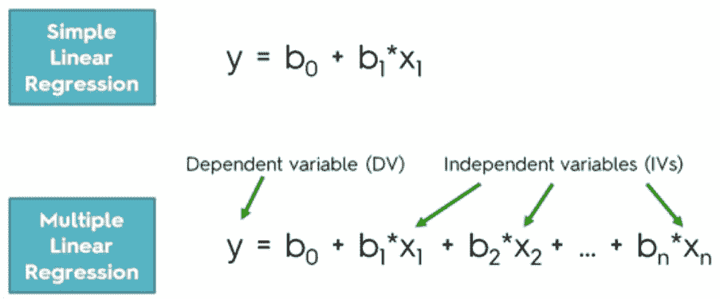

虽然一些自变量可能会对最终因变量产生影响，但其他自变量可能不会。为了提高模型的准确性，我们必须消除所有对因变量影响最小的变量。消除此类变量的方法有五种，如下图所示，但最可靠的方法是**反向消除**：


反向消除的工作原理如下所示：

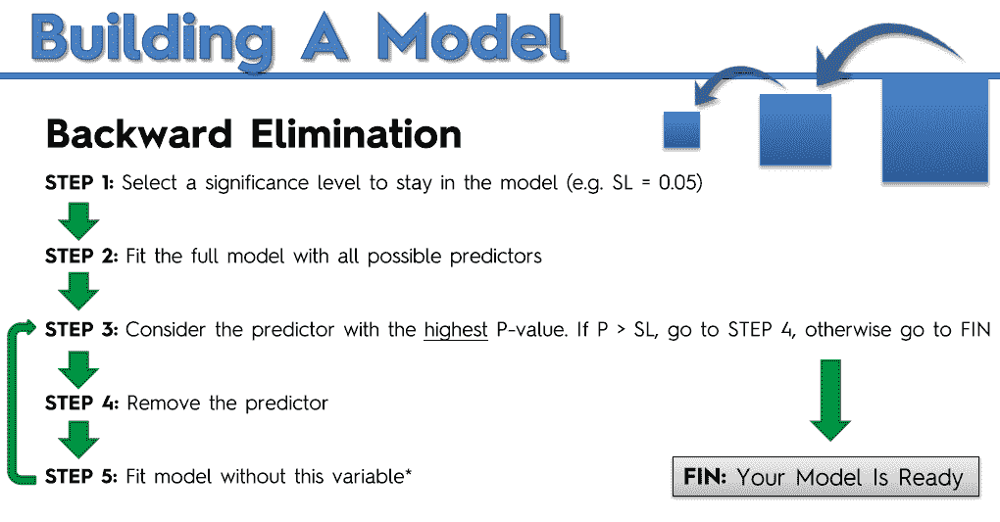

在前面的方法中，我们所说的显著性水平指的是最小阈值，它表示被检查的变量对因变量或最终预测至关重要。

**P 值**是决定因变量和自变量之间关系是否随机的概率。对于任何给定变量，如果计算的 P 值等于 0.9，这表明该自变量和最终因变量之间的关系是 90%随机的，因此自变量的任何变化可能不会对因变量产生直接影响。另一方面，如果不同变量的 P 值为 0.1，这意味着该变量与因变量之间的关系本质上不是随机的，该变量的变化将对输出产生直接影响。

我们应该从分析数据集开始，找出对预测有重要意义的自变量。我们必须只在这些变量上训练我们的数据模型。下面的代码片段代表了反向消除的实现，这将让我们了解哪些变量需要删除，哪些变量需要保留：

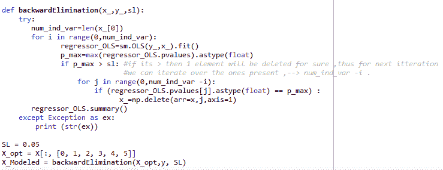

以下是对前面代码段中使用的主要函数的说明：

*   `X[:,[0,1,2,3,4,5]]`表示我们将从 90 到 5 的所有行和列传递给向后消除函数
*   `sm.OLS`是一个内部 Python 库，有助于 P 值计算
*   `regressor_OLS.summary()`将在控制台上显示一个摘要，帮助我们决定保留哪些数据变量以及删除哪些数据变量

在下面的示例中，我们将针对所有变量训练模型。但是，建议使用之前获得的`X_Modeled`，而不是`X`：

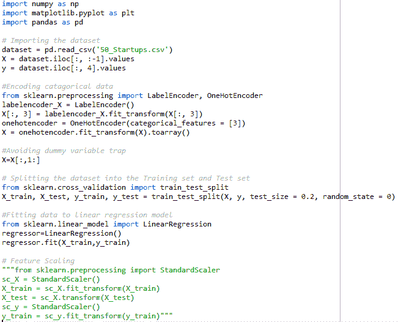

应注意，在 MLR 中，预测也基于最佳拟合线，但在这种情况下，最佳拟合线绘制在多个维度上。下面的屏幕截图给出了如何在 n 维空间中绘制数据集的想法：

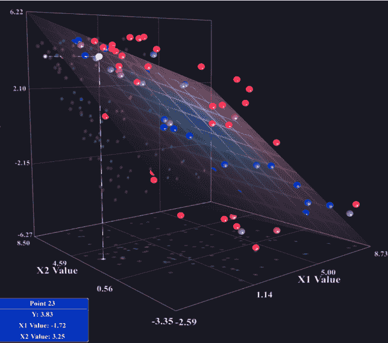

对于其他类型的数据集，还有其他各种各样的回归模型，但是涵盖所有这些模型超出了本书的范围。然而，上面提到的两个模型应该让我们了解回归模型是如何工作的。在下一节中，我们将讨论**分类模型**。我们将更详细地研究一个分类模型，并了解如何在自然语言处理中使用它，在渗透测试生态系统中应用 ML。

# 分类模型

与回归模型不同，回归模型预测一个连续数，分类模型用于预测给定类别列表中的类别。前面讨论的业务问题，我们有一个电子商务网站在过去三个月的客户相关数据，其中包含特定产品的购买历史记录（`c_id`、`p_id`、`age`、`gender`、`nationality`、`salary`、`purchased[yes/no]`）。与以前一样，我们的目标是根据客户的购买历史确定可能购买产品的客户。基于所有自变量（`age`、`gender`、`nationality`、`salary`的排列，分类模型可以根据 1 和 0 进行预测，1 表示某个客户将购买该产品，0 表示他们不会购买该产品。在这种特殊情况下，有两个类别（0 和 1）。但是，根据业务问题，输出类别的数量可能会有所不同。此处显示了常用的不同分类模型：

*   朴素贝叶斯
*   逻辑回归
*   K-近邻
*   支持向量机
*   内核支持向量机
*   决策树分类器
*   随机森林分类器

# 朴素贝叶斯分类器

让我们试着理解分类模型如何借助于朴素贝叶斯分类器工作。为了理解朴素贝叶斯分类器，我们需要理解贝叶斯定理。**贝叶斯定理**是我们在概率论中研究的定理，可以通过一个例子加以解释。

假设我们有两台机器，都生产扳手。这些扳手标有生产它们的机器。M1 是机器 1 的标签，M2 是机器 2 的标签。

假设一个扳手有缺陷，我们想找出缺陷扳手由机器 2 生产的概率。假设 B 已经发生，则事件 A 发生的概率由朴素贝叶斯定理确定。因此，我们使用贝叶斯定理如下：


*   P（A）表示事件发生的概率。
*   p（B/A）表示给定 A 的 B 的概率（假设 A 已经发生 B 发生的概率）。
*   P（B）表示 B 发生的概率。
*   p（A/B）表示给定 B 的概率（A 发生的概率，假设 B 已经发生）。
*   如果我们将数据放在概率方面，我们得到以下结果：

|  |  |

假设我们有一个人群数据集，其中一些人步行上班，一些人开车上班，这取决于他们的年龄类别：

| 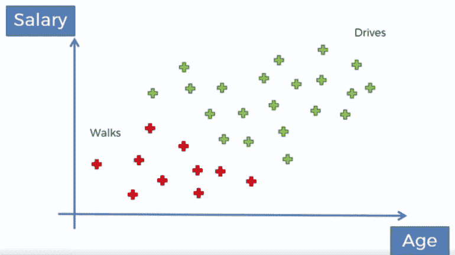 |  |

如果添加了新的数据点，我们应该能够确定此人是开车上班还是步行上班。这就是监督学习；我们正在一个数据集上训练机器，并从中导出一个学习模型。我们将应用贝叶斯定理来确定新数据点属于步行类和驾驶类的概率。

为了计算属于行走类别的新数据点的概率，我们计算*P（Walk/X）。*这里，*X*代表给定人员的特征，包括他们的年龄和薪水：


为了计算新数据点属于驾驶类别的概率，我们计算*P（Drives/X）*，如下所示：


最后，我们将比较*P（Walks/X）*和*P（Drives/X）。*基于此比较，我们将确定新数据点的放置位置（在概率较高的类别中）。初始绘图发生在 n 维空间上，具体取决于自变量的值。

接下来，我们计算边际似然，如下图所示，即 P（X）：


*P（X）*实际上是指将新数据点添加到具有相似特征的数据点的位置的概率。该算法将发现的数据点与即将添加的数据点在特征上相似的数据点分割或围成一个圆圈。然后，将特征的概率计算为*P（X）=相似观测数/总观测数*

*   在这种情况下，圆的半径是一个重要参数。该半径作为算法的输入参数给出：


*   在本例中，假设圆圈内的所有点与要添加的数据点具有相似的特征。假设我们添加的数据点与 35 岁且工资为 40000 美元的人有关。在这种情况下，25-40K 美元范围内的所有人都将被选中：


*   接下来，我们需要计算可能性，这意味着随机选择的行走者包含 X 特征的概率。以下将确定*P（X/行走）*：


*   考虑到数据点具有与步行者相同的特征，我们将采用同样的方法来推导属于驾驶区的数据点的概率
    *   在这种情况下，P（X）等于前面所示圆圈内的类似观测数除以观测总数。P（X）=4/30=0.133
    *   P（驾驶）=P（#谁驾驶）/（总计）=20/30=0.666
    *   P（X |驱动因素）=P（驱动因素的类似观察）/总驱动因素=1/20=0.05
    *   应用这些值，我们得到 P（Drivers | X）=0.05*0.666/0.133=0.25=>25

对于给定的问题，我们将假设数据点将属于 Walker 集合。

# 朴素贝叶斯分类器综述

以下要点将迄今为止讨论的所有概念放在了透视图中，以总结我们对朴素贝叶斯分类器的了解：

*   应该注意的是，朴素贝叶斯分类器没有训练后获得的计算模型。事实上，在进行预测时，所有数据点都只是根据它们所属的类别进行标记。
*   在预测时，基于自变量的值，将计算数据点并在 n 维空间中的特定位置绘制。其目的是预测 N 个类中 a 类数据点属于哪个类。
*   基于自变量，数据点将在向量空间中与相似特征的数据点非常接近地绘制。但是，这仍然不能确定数据点属于哪个类。
*   根据最初选择的最佳半径值，将围绕该数据点绘制一个圆，封装圆半径附近的其他几个点。
*   假设我们有两类，A 和 B，我们需要确定新数据点 X 的类别。Bayes 定理将用于确定 X 属于类别 A 的概率和 X 属于类别 B 的概率。概率较高的是预测数据点所属的类别。

# 实现代码

假设我们有一家汽车公司 X，它持有一些关于人的数据，包括他们的年龄、薪水和其他信息。它还详细说明了此人是否购买了该公司以非常昂贵的价格推出的 SUV。这些数据用于帮助他们了解谁购买了他们的汽车：

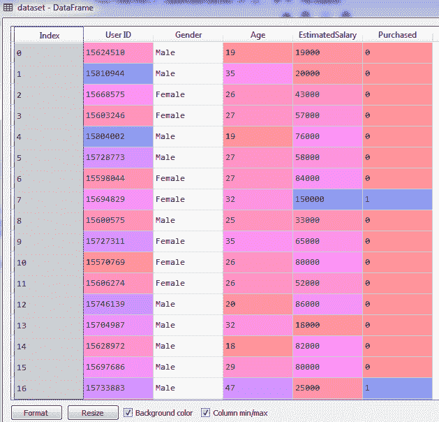

我们将使用相同的数据来训练我们的模型，以便它能够预测一个人是否会买车，考虑到他们的`age`、`salary`和`gender`：


以下屏幕截图显示了前 12 个数据点的`y_pred`和`y_test`之间的差异：

| 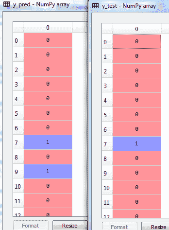 | 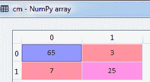前面的屏幕截图表示混乱矩阵的输出。

*   单元格[0,0]表示输出为 0 且预测为 0 的总情况。
*   单元格[0,1]表示输出为 0 但预测为 1 的总情况。
*   单元格[1,0]表示输出为 1 但预测为 0 的总情况。
*   单元格[1,1]表示输出为 1 且预测为 1 的总情况。

如果我们从之前的数据集中获取统计数据，我们可以看到，在 100 个预测中，90 个是正确的，10 个是错误的，这给了我们 90%的准确率。                     |

# 自然语言处理

**自然语言处理**（**NLP**）是关于分析文本、文章，涉及对文本数据进行预测分析。我们所做的算法将解决一个简单的问题，但同样的概念适用于任何文本。我们还可以使用 NLP 预测书籍的类型。

考虑下面的标签分离值（TSV），它是一个制表符分隔的数据集，用于我们应用 NLP 并查看它是如何工作的：

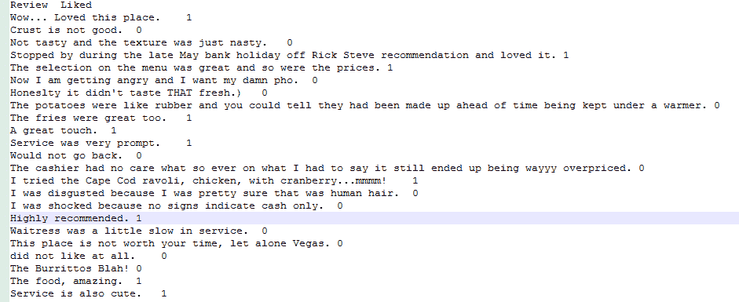

这是我们将要处理的数据的一小部分。在本例中，数据表示客户对餐厅的评论。评论以文本形式给出，并有一个评分，即 0 或 1，以表明客户是否喜欢该餐厅。1 表示审核为正，0 表示审核为非正。

通常，我们会使用 CSV 文件。然而，在这里，我们使用的是一个 TSV 文件，其中分隔符是一个选项卡，因为我们处理的是基于文本的数据，所以我们可能会使用不表示分隔符的逗号。以第 14 条<sup xmlns:epub="http://www.idpf.org/2007/ops">记录为例，我们可以在文本中看到逗号。如果这是一个 CSV 文件，Python 会将句子的上半部分作为评论，下半部分作为评分，而`1`则会作为新的评论。这会把整个模型搞砸</sup>

该数据集已获得约 1000 条评论，并已手动标记。由于我们正在导入 TSV 文件，`pandas.read_csv`的一些参数需要更改。首先，我们使用/t 指定分隔符以制表符分隔。我们还应该忽略双引号，这可以通过指定参数 quoting=3 来实现：


导入的数据集如下所示：

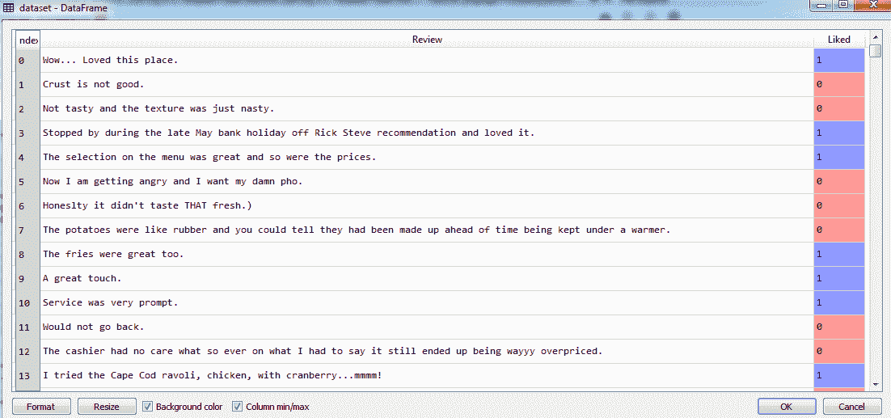

我们可以看到 1000 条评论已经成功导入。所有评论都在评论栏中，所有评分都在**喜欢的**栏中。在 NLP 中，我们必须在使用之前清理基于文本的数据。这是因为 NLP 算法使用单词袋的概念工作，这意味着只保留导致预测的单词。单词袋实际上只包含影响预测的相关单词。诸如`a`、`the`、`on`等词语在本上下文中被认为是不相关的。我们还去除了点和数字，除非需要数字，并在单词上应用词干。词干分析的一个例子是用单词`love`代替`loved`。我们使用词干分析的原因是，我们不希望最后有太多的单词，也不希望将像`loving`和`loved`这样的单词重新组合成一个单词`love`。我们还删除了大写字母，所有内容都使用小写。要应用我们的单词袋模型，我们需要应用标记化。在我们这样做之后，我们会有不同的词，因为预处理会去除那些无关的词。

然后，我们把不同评论中的所有单词都记下来，并为每个单词制作一个专栏。可能会有许多列，因为评论中可能有许多不同的单词。然后，对于每个评论，每个列都会包含一个数字，表示该单词在特定评论中出现的次数。这种矩阵称为稀疏矩阵，因为数据集中可能有很多零。

`dataset['Review'][0]`命令将给我们第一次检查：


我们使用正则表达式的子模块，如下所示：


我们使用的子模块称为减法函数。这将从输入字符串中减去指定的字符。它还可以将单词组合在一起，并用您选择的字符替换指定的字符。要替换的字符可以作为字符串输入，也可以采用正则表达式格式。在上一示例中所示的正则表达式格式中，^符号表示不和[a-zA-Z]表示除 a-z 和 a-z 之外的所有内容都应替换为单个空格`' '`。在给定的字符串中，点将被删除并替换为空格，从而产生以下输出：`Wow Loved this place`。

我们现在删除所有无意义的单词，如`the`、`a`、`this`等。为此，我们将使用`nltk`库（自然语言工具包）。它有一个名为 stopwords 的子模块，其中包含所有与获取句子含义基本无关的单词（通用单词）。要下载 stopwords，我们使用以下命令：


这会将停止词下载到当前路径，从中可以直接使用它们。首先，我们将评论分成一个词列表，然后浏览不同的词，并将它们与下载的停止词进行比较，删除那些不必要的词：


在前面的代码片段中，我们使用了 for 循环。在 review 前面声明`[]`符号表示列表将包含从 for 循环返回的单词，在本例中是 stopwords。

`for`循环前面的代码表明，我们应该分配字符串单词，并且每当该单词出现在审阅列表中而不出现在`stopwords.words('English')`列表中时，就用新词更新列表。请注意，我们正在使用`set()`函数将给定的停止词列表转换为一个集合，因为在 Python 中，集合上的搜索操作要比列表上的搜索操作快得多。最后，审查将用我们不相关的词保留字符串。在这种情况下，第一次审查将举行[`wov`、`loved`、`place`。

下一步是执行词干分析。我们应用词干分析的原因是为了避免稀疏性，当我们的矩阵（称为稀疏矩阵）中有很多零时，就会出现稀疏性。为了减少稀疏性，我们需要减少矩阵中零的比例。

我们将使用 portstemmer 库对每个单词应用词干分析：


现在，评审将举行[`wov`、`love`、`place`。

在这一步中，我们将通过调用`join`将转换后的 string review 从列表连接回字符串。我们将放置一个空格作为`delimiter``' '.join(review)`将复习列表中的所有单词连接在一起，然后使用`' '`作为分隔符来分隔单词。

该评论现在是一系列相关单词，全部小写：


执行代码后，如果我们比较原始数据集和获得的语料库列表，我们将获得以下结果：


由于 stopword 列表中还有单词`Not`，索引 1 处的字符串`Crust is not good`（其`Liked`评级为 0）变成了`crust good`。我们需要确保这不会发生。同样地，`would not go back`变成了`would go back`。处理它的方法之一是使用一个停止词列表作为`set(stopwords.words('english'))]`。

接下来，我们将创建一个单词包模型。在这里，将从获得的语料库（句子列表）中提取不同的单词，并为每个不同的单词创建一个列。所有单词都不会重复。

因此，将采用诸如`wov love place`、`crust good`、`tasti textur nasti`等单词，并为每一个单词创建一列。每一列将对应一个不同的单词。我们还将有评论和条目编号，指定该词在该特定评论中存在的次数。

使用这种设置，我们的表中会有很多零，因为可能会有不经常出现的单词。目标应该始终是将稀疏性保持在最低限度，以便只有相关的单词指向预测。这将产生一个更好的模型。我们刚刚创建的稀疏矩阵将是我们的单词包模型，它的工作原理与我们的分类模型一样。我们有一些自变量，这些自变量取一些值（在本例中，自变量是复习单词），根据自变量的值，我们将预测因变量，即复习是否为正。要创建我们的单词袋模型，我们将应用一个分类模型来预测每个新的评论是正面的还是负面的。我们将借助标记化和名为**CountVectorier**的工具创建一个单词包模型。

我们将使用以下代码来使用此库：

```
from sklearn.feature_extraction.text import CountVectorizer
```

接下来，我们将创建这个类的一个实例。这些参数将停止字作为参数之一，但由于我们已经将停止字应用于数据集，因此无需再次这样做。这个类还允许我们控制大小写和令牌模式。我们也可以选择在使用此类之前执行所有步骤，但单独执行会提供更好的粒度控制：


注意，`cv.fit_transform`行实际上将稀疏矩阵拟合到 cv，并返回包含语料库所有单词的特征矩阵。

到目前为止，我们已经制作了一个单词包，或者说稀疏矩阵，一个自变量矩阵。下一步是使用一个分类模型，在单词包的一部分上训练模型，-X，在相同的索引上训练因变量，-Y。本例中的因变量是`Liked`列。

执行上述代码将创建一个包含 1565 个特征（不同列）的特征矩阵。如果不同特征的数量非常大，我们可以限制最大特征并指定最大阈值数量。假设，如果我们将阈值数指定为 1500，那么稀疏矩阵中只会获取 1500 个特征或不同的单词，而那些与前 1500 个特征或单词相比频率较低的特征或单词将被删除。这将使自变量和因变量之间有更好的相关性，进一步减少稀疏性。

我们现在需要在模型词和因变量袋上训练我们的分类模型：

按如下方式提取因变量：


`X`和`Y`将如下所示：


注意，在前面的例子中，每个索引（0-1499）对应于原始语料库列表中的一个单词。我们现在有了我们在分类模型中所拥有的东西：一个自变量指标和一个结果，0 表示负面评价，1 表示正面评价。然而，我们仍然有大量的稀疏性。

我们的下一步是使用分类模型进行培训。使用分类模型有两种方法。一种方法是根据我们的数据集测试所有分类模型并确定误报和漏报，另一种方法是基于经验和过去的实验。与 NLP 一起使用的最常见模型是朴素贝叶斯和决策树或随机森林分类。在本教程中，我们将使用朴素贝叶斯模型：

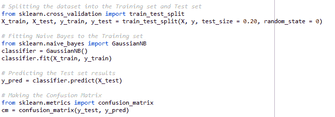

整个代码如下所示：


从前面的代码中，我们可以看到，我们将列车和测试集分为 80%和 20%。我们将对训练集进行 800 次观察，对测试集进行 200 次观察，并查看我们的模型将如何运行。执行后的混淆度量值如下所示：


负面评论的正确预测有 55 个，正面评论的正确预测有 91 个。负面评价有 42 个错误预测，正面评价有 12 个错误预测。因此，在 200 个预测中，有 146 个预测是正确的，相当于 73%。

# 在渗透测试报告中使用自然语言处理

ML 在网络安全领域中的一个应用是，我曾经尝试过自动化报告分析任务，以发现漏洞。我们现在知道了我们在上一章中构建的漏洞扫描器是如何工作的，但是所有集成脚本和工具产生的数据量是巨大的，我们需要手动处理或分析它。在 Nessus 或 Qualys 等典型的扫描仪中，插件实际上是脚本。由于它们是由 Nessus 和 Qualys 内部开发的，因此脚本旨在发现缺陷并以易于理解的方式报告。然而，在我们的例子中，我们正在集成许多开源脚本和工具集，并且生成的输出没有集成。为了自动化此任务并获得漏洞概述，我们需要了解脚本或工具在标记漏洞的场景中以及在返回结果安全的场景中产生的输出。根据我们的理解和每个脚本的预期输出模式，我们必须起草 Python 代码逻辑，以发现哪个插件产生了不安全的检查结果，哪个插件返回了安全检查。这需要付出巨大的努力。每当我们增加集成脚本的数量时，我们代码的逻辑也需要更新，因此是否要遵循这条路径取决于您。

我们手头的另一种方法是利用机器学习和 NLP。既然有一个巨大的历史 pentesting 数据池可供我们使用，为什么不将其提供给机器学习模型，并训练它了解什么是不安全的，什么是安全的？感谢我们使用漏洞扫描器执行的历史渗透测试报告，我们的数据库表中有大量数据。我们可以尝试重用这些数据，使用机器学习和 NLP 自动化手动报告分析。我们谈论的是监督学习，它需要一次性的努力来适当地标记数据。假设我们采用了过去 10 次渗透测试的历史数据，平均每个测试 3 个 IP。我们还假设平均每个 IP 执行 100 个脚本（取决于打开端口的数量）。这意味着我们有 3000 个脚本的数据。

我们需要手动标记结果。或者，如果测试人员在用户界面中显示数据，测试人员可以在测试时通过复选框选择**易受攻击**/**不易受攻击**，该复选框将作为显示数据的标签。假设我们能够用 1 标记所有结果数据，其中测试用例或检查结果为安全，而 0 标记测试用例结果为不安全。然后，我们将标记数据，这些数据将被预处理并提供给我们的 NLP 模型，该模型将接受关于它的培训。一旦模型得到训练，我们就会坚持模型。最后，在实时扫描过程中，我们将测试用例的结果传递给我们经过训练的模型，使其对测试用例进行预测，这些测试用例的结果容易受到攻击，而不易受到攻击。然后，测试人员只需要关注易受攻击的测试用例并准备它们的开发步骤。

为了演示这个概念的 PoC，让我们从一个项目中获取结果，并且只考虑运行于 TytT0 和 SUT1 的脚本。让我们看看代码的作用。

# 步骤 1–标记原始数据

以下是我们使用漏洞扫描器扫描的其中一个项目的`ssl`和`http`检查结果。数据从后端 IPexploits 表中获取，并在检查不易受攻击时标记为 0，在测试不安全时标记为 1。我们可以在下面的屏幕截图中看到这一点。这是一个 TSV 文件，其模式为（`command_id`、`recored_id`、`service_result`、`vul[0/1]`：


现在我们已经标记了数据，让我们处理并清理它。之后，我们将用它来训练我们的 NLP 模型。我们将在 NLP 中使用朴素贝叶斯分类器。对于当前的数据集，我已经成功地使用了这个模型。这将是一个很好的练习来测试各种其他模型，看看我们是否能够获得更好的预测成功率。

# 第 2 步-编写代码来训练和测试我们的模型

下面的代码与我们在 NLP 一节中讨论的代码相同，只是添加了一些代码，其中我们使用`pickle.dump`将经过训练的模型保存到一个文件中。我们还使用`pickle.load`加载保存的模型：


下面的屏幕截图以数据集的训练模型给出的混淆矩阵的形式显示了结果。我们在 80%的数据集（由 0.8 指定）上训练模型，并在 20%的数据集（由 0.2 指定）上测试模型。获得的结果集表明，模型预测的准确率为 92%。应该注意的是，对于较大的数据集，精度可能会有所不同。这里的想法是让您了解 NLP 如何与渗透测试报告一起使用。我们可以改进处理以提供更清晰的数据，并更改模型的选择以获得更好的结果：


# 总结

在本章中，我们讨论了将 ML 与 Python 结合使用，以及如何将其应用于网络安全领域。数据科学和 ML 在网络安全领域还有许多其他精彩的应用，涉及日志分析、流量监控、异常检测、数据过滤、URL 分析、垃圾邮件检测等。现代 SIEM 解决方案大多建立在机器学习的基础上，并使用大数据引擎减少监控中的人为分析。请参阅进一步阅读部分，了解机器学习与网络安全的各种其他用例。还必须注意，pen 测试人员必须了解机器学习，才能发现漏洞。在下一章中，用户将了解如何使用 Python 自动化各种 web 应用攻击类别，包括 SQLI、XSS、CSRF 和点击劫持。

# 问题

1.  与机器学习相关的各种漏洞是什么？
2.  什么是大数据？具有已知漏洞的大数据产品的示例是什么？
3.  机器学习和人工智能有什么区别？
4.  哪些测试工具使用机器学习？为什么？

# 进一步阅读

*   使用机器学习检测钓鱼网站：[https://github.com/abhishekdid/detecting-phishing-websites](https://github.com/abhishekdid/detecting-phishing-websites)
*   使用机器学习进行日志分析：[https://github.com/logpai](https://github.com/logpai)
*   网络安全 NLP:[https://www.recordedfuture.com/machine-learning-](https://www.recordedfuture.com/machine-learning-cybersecurity-applications/) [网络安全应用/](https://www.recordedfuture.com/machine-learning-cybersecurity-applications/)
*   使用机器学习的垃圾邮件检测：[https://github.com/Meenapintu/Spam-Detection](https://github.com/Meenapintu/Spam-Detection)
*   Python 深度学习：[https://www.manning.com/books/deep-learning-with-python](https://www.manning.com/books/deep-learning-with-python)