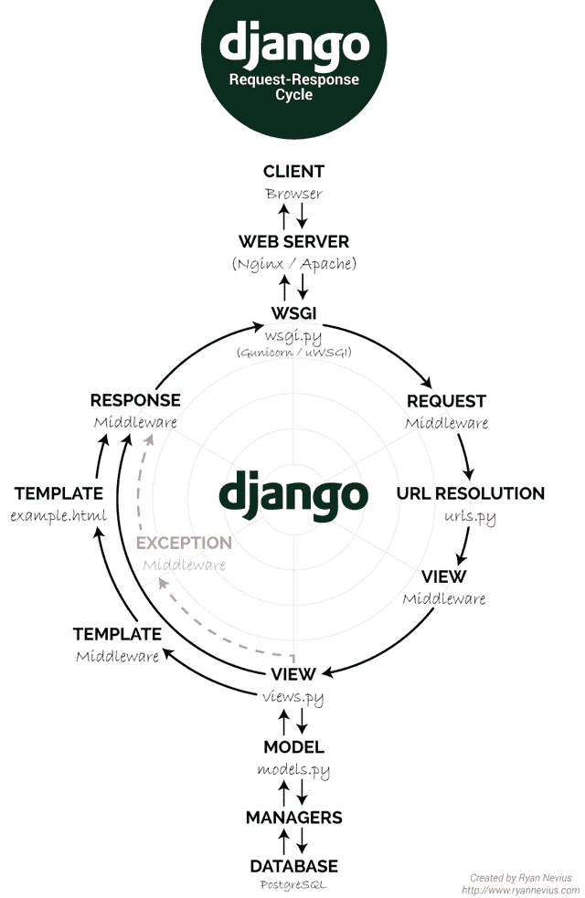
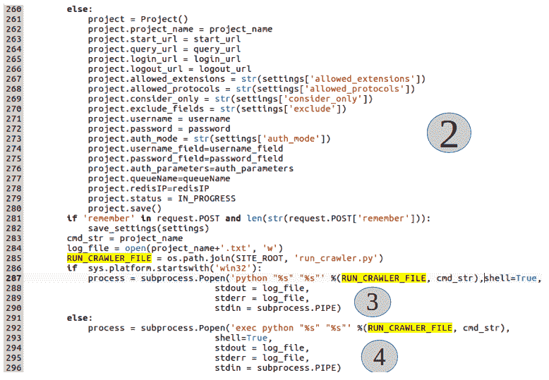
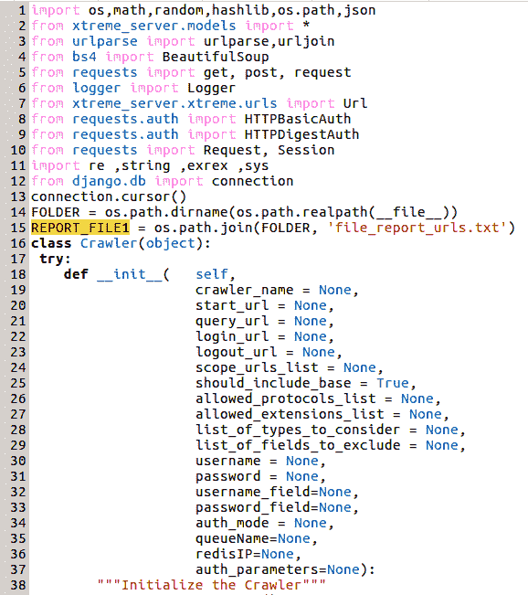
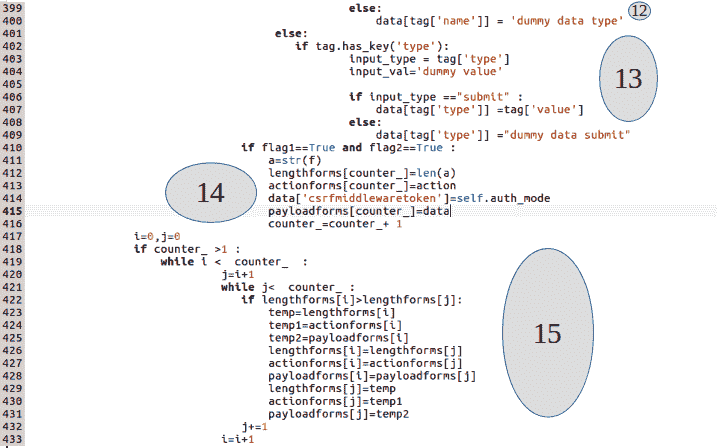
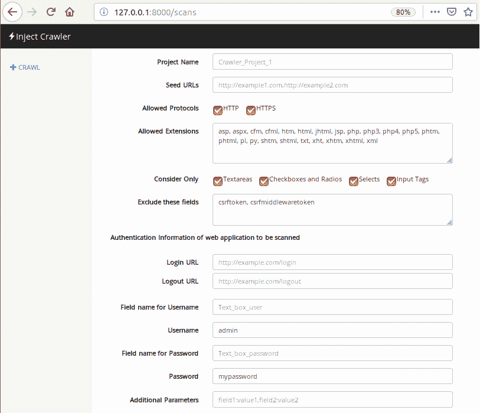
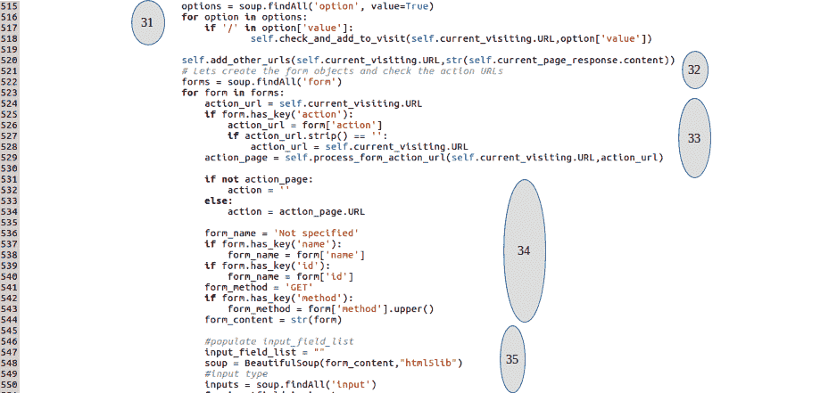
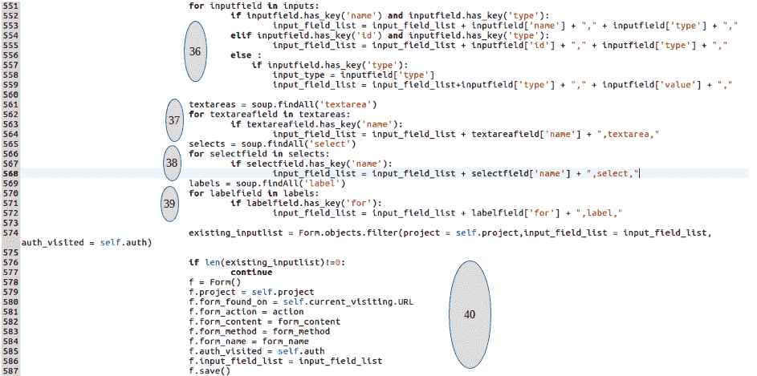
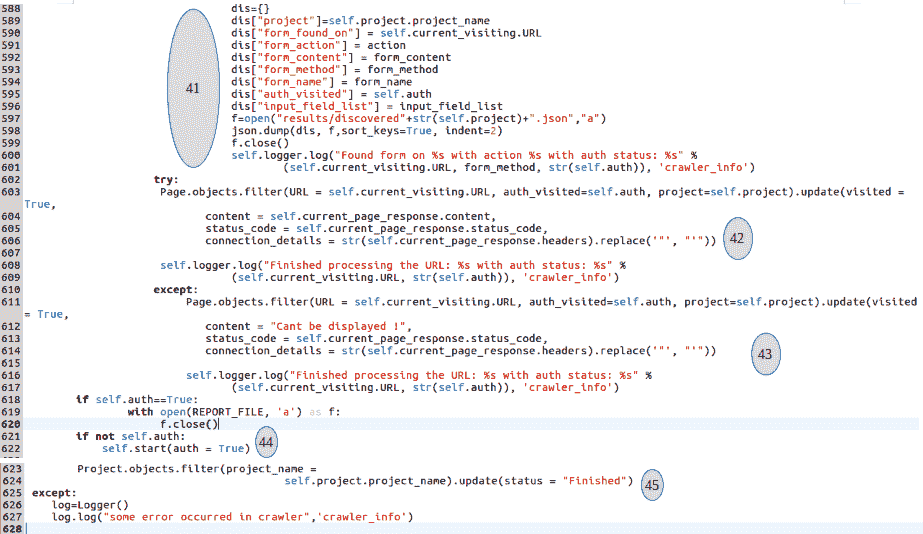
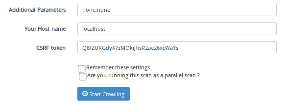
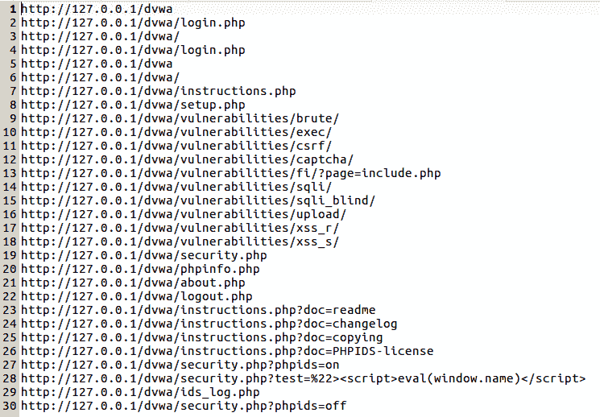

# 十、构建自定义爬虫程序

当我们谈到 web 应用扫描时，我们经常会遇到爬虫，它们内置在我们用于 web 应用扫描的自动扫描工具中。Burp Suite、Acunetix、web inspect 等工具都有出色的爬虫程序，可以在 web 应用中进行爬网，并尝试针对爬网 URL 的各种攻击向量。在本章中，我们将了解爬虫是如何工作的，以及在引擎盖下会发生什么。本章的目的是让用户了解爬虫如何收集所有信息并形成各种攻击的攻击面。同样的知识可以在以后用于开发一个自定义工具，该工具可以自动化 web 应用扫描。在本章中，我们将创建一个自定义网络爬虫程序，该程序将在网站中爬行，并为我们提供一个包含以下内容的列表：

*   网页
*   HTML 表单
*   每个表单中的所有输入字段

我们将了解如何以两种模式抓取 web 应用：

*   未经认证
*   通过身份验证

我们将在 Django（Python 的 web 应用框架）中开发一个小型 GUI，使用户能够在测试应用上进行爬行。必须注意的是，本章的主要重点是爬虫程序的工作原理，因此我们将详细讨论爬虫程序代码。我们不会把重点放在 Django web 应用的工作上。为此，本章末尾将提供参考链接。我将在 GitHub 存储库中共享整个代码库，供读者下载和执行，以便更好地了解应用。

# 设置和安装

要使用的操作系统是 Ubuntu 16.04。该代码在此版本上进行了测试，但读者可以自由使用任何其他版本。

通过运行以下命令安装本章所需的先决条件：

```
pip install django==1.6 pip install beautifulsoup4 pip install requests pip install exrex pip install html5lib pip install psutil sudo apt-get install sqlitebrowser
```

应该注意的是，该代码在 Python2.7 上进行了尝试和测试。建议读者在同一版本的 Python 上尝试该代码，但它也应该适用于 Python 3。打印语句可能会有一些语法变化。

# 开始

典型的 Django 项目遵循基于 MVC 的体系结构。用户请求首先点击`Urls.py`文件中配置的 URL，然后从那里转发到相应的视图。视图充当后端核心逻辑和呈现给用户的模板/HTML 之间的中间件。`views.py`有多种方法，每种方法都对应于`Urls.py`文件中的 URL 映射器。在收到请求时，`views`类或方法中编写的逻辑准备来自`models.py`和其他核心业务模块的数据。准备好所有数据后，在模板的帮助下将其呈现回用户。因此，模板构成了 web 项目的 UI 层。

下图表示 Django 请求-响应周期：



# 爬虫代码

如前所述，我们有一个用户界面，用于收集要爬网的 web 应用的用户参数。因此，请求被转发到`views.py`文件，从那里我们将调用爬虫驱动程序文件`run_crawler.py`，该文件将依次调用`crawler.py`。`new_scan`视图方法获取所有用户参数，将其保存在数据库中，并为爬网项目分配新的项目 ID。然后将项目 ID 传递给爬虫驱动程序，让爬虫驱动程序在 ID 的帮助下引用并拉取相关项目参数，然后将其传递给`crawler.py`开始扫描。

# url.py 和 Views.py 代码段

以下是`Urls.py`文件的配置，该文件具有 HTTP URL 和映射到该 URL 的`views.py`方法之间的映射。此文件的路径为`Chapter8/Xtreme_InjectCrawler/XtremeWebAPP/Urls.py`：


前面突出显示的行表示新爬网项目的 URL 与满足请求的`views`方法之间的映射。因此，我们将在`views.py`文件中有一个名为`new_scan`的方法。文件的路径为`Chapter8/Xtreme_InjectCrawler/XtremeWebAPP/xtreme_server/views.py`。方法定义如下所示：





# 代码解释

`new_scan`方法将同时接收来自用户的`HTTP GET`和`POST`请求。`GET`请求将被解析为用户可以输入项目参数的页面，`POST`请求将把所有参数发布到之前的代码中，然后可以进一步处理。正如代码第**（1）**节所强调的，从用户请求中检索项目参数，并将其放入 Python 程序变量中。守则第（2）条亦有同样的规定。它还从用户提供的设置中获取一些其他参数，并将它们放在名为 settings 的 Python 字典中。最后，当收集所有数据时，它将所有细节保存在后端数据库表`Project`中。从第 261 行可以看出，代码初始化了一个名为`Project()`的类，然后从第 262 行到第 279 行，它将从用户处获得的参数分配给`Project()`类的实例变量。最后，在第 280 行，调用`project.save()`代码。这会将所有实例变量作为一行放入数据库表中。

基本上，Django 遵循 ORM 开发模型。**ORM**代表**对象关系映射**。Django 项目的模型层是一组类，当使用`python manage.py syncdb`命令编译项目时，这些类实际上转换为数据库表。实际上，我们并没有在 Django 中编写原始 SQL 查询来将数据推送到数据库表或获取它们。Django 为我们提供了一个模型包装器，我们可以将其作为类进行访问，并调用各种方法，如`save()`、`delete()`、`update()`、`filter()`和`get()`，以便对我们的数据库表执行**创建、检索、更新和删除**（**CRUD**操作。对于当前的案例，让我们来看看 FoodT6A.file，其中包含了{ ToodT7}模型类：


因此，当编译代码或使用`python manage.py syncdb`命令进行数据库同步时，将在工作数据库中创建一个名为`<project_name>_Project`的表。表的模式将根据类中实例变量的定义进行复制。因此，对于 projects 表的前一种情况，将创建 18 列。该表将有一个主键`project_name`，其数据类型在 Django 应用中定义为`CharField`，但在后端将转换为类似`varchar(50)`的内容。本例中的后端数据库是 SQLite 数据库，在`settings.py`文件中定义如下：


代码片段的**（3）**和**（4）**部分很有趣，因为这是工作流执行的实际开始。从**（3）**节可以看出，我们正在检查操作系统环境。如果操作系统是 Windows，那么我们将调用`crawler_driver`代码`run_crawler.py`作为子流程。

如果底层环境是基于 Linux 的，那么我们将使用与 Linux 环境相关的命令调用相同的驱动程序文件。正如我们之前可能观察到的，我们正在使用子流程调用作为单独的流程调用此代码。拥有这种体系结构的原因是我们可以使用异步处理。应该快速响应用户发送的 HTTP 请求，并显示一条消息，指示爬网已开始。在整个爬网操作完成之前，我们不能保留相同的请求。为了适应这种情况，我们生成了一个独立的进程，并将爬网任务卸载到该进程，HTTP 请求立即返回一个 HTTP 响应，指示爬网已经开始。我们在后端数据库中进一步映射进程 ID 和项目名称/ID，以持续监控扫描的状态。我们通过将控制重定向到详细信息 URL，从而将控制返回给用户，然后返回模板`details.html`。

# 驱动程序代码–运行 _crawler.py

以下代码用于`run_crawler.py`文件：


还记得我们是如何从`views.py`代码中调用此文件的吗？我们通过传递一个作为项目名称的命令行参数来调用它。如第**（1）**节所述，`run_crawler.py`前面的代码将该命令行参数加载到项目名称程序变量中。在**（2）**节中，代码尝试使用`project.objects.get(project_name=project_name)`命令从后端数据库表项目中读取所有参数。如前所述，Django 遵循 ORM 模型，我们不需要编写原始 SQL 查询来从数据库表获取数据。前面的代码片段将在内部转换为`select * from project where project_name=project_name`。因此，所有项目参数都被拉入并传递给本地程序变量。

最后，在第**（3）**节中，我们初始化`crawler`类并将所有项目参数传递给它。初始化后，我们调用突出显示为第**（4）**节的`c.start()`方法。这就是爬行的开始。在下一节中，我们将看到爬虫类的工作情况。

# 爬虫程序代码–Crawler.py

下面的代码片段表示`crawler`类的构造函数。它初始化所有相关的实例变量。`logger`是写入日志调试消息的自定义类之一，因此，如果爬虫程序在执行过程中发生任何错误，爬虫程序将作为子进程生成并在后台运行，则可以对其进行调试：




现在让我们来看看`crawler`的`start()`方法，爬行实际上是从这里开始的：


可以在**（1）**节中看到，对于第二次迭代（`auth=True`），我们向用户提供的作为登录 URL 的 URL 发出`HTTP GET`请求。我们使用 Python`requests`库中的`GET`方法。当我们向 URL 发出`GET`请求时，响应内容（网页）被放置在`xx`变量中。

现在，正如第**（2）**节所强调的，我们使用`xx.content`命令提取网页的内容，并将提取的内容传递给`Beautifulsoup`模块的实例。`Beautifulsoup`是一个优秀的 Python 实用程序，使解析网页变得非常简单。从这里开始，我们将用别名 BS 表示`Beautifulsoup`。

第**（3）**节使用 BS 解析库中的`s.findall('form')`方法。`findall()`方法采用 HTML 元素的类型，作为字符串参数进行搜索，并返回包含搜索匹配项的列表。如果一个网页包含十个表单，`s.findall('form')`将返回一个包含十个表单数据的列表。它将如下所示：`[<Form1 data>,<Form2 data>, <Form3 data> ....<Form10 data>]`。

在代码的第**（4）**节中，我们正在迭代之前返回的表单列表。这里的目标是在网页上可能存在的多个输入表单中识别登录表单。我们还需要找出登录表单的操作 URL，因为在那里我们将`POST`获取有效凭证并设置有效会话，如以下屏幕截图所示：





让我们尝试分解前面的不完整代码，以了解到目前为止发生了什么。然而，在我们继续前行之前，让我们看看从用户那里获取爬行参数的用户界面。这将使我们对先决条件有一个很好的了解，并帮助我们更好地理解代码。以下屏幕显示用户输入参数的表示形式：



如前所述，爬虫程序分两次迭代。在第一次迭代中，它尝试在没有身份验证的情况下对 web 应用进行爬网，在第二次迭代中，它使用身份验证对应用进行爬网。认证信息保存在`self.auth`变量中，该变量默认初始化为`false`。因此，第一次迭代将始终没有身份验证。

需要注意的是，前面提到的代码属于`< if self.auth ==True >`部分，其目的是从登录网页/URL 中识别登录表单。识别登录表单后，代码将尝试识别该表单的所有输入字段。然后，它使用合法的用户凭据来制定数据负载，以提交登录表单。提交后，将返回并保存有效的用户会话。该会话将用于第二次爬网迭代，这是基于身份验证的。

在代码的第**（5）**节中，我们正在调用`self.process_form_action()`方法。在此之前，我们提取表单的动作 URL，这样我们就知道数据将在哪里*发布*。它还将相对操作 URL 与应用的基本 URL 相结合，以便我们最终将请求发送到有效的端点 URL。例如，如果表单动作指向一个名为`/login`的位置，而当前 URL 为`http://127.0.0.1/my_app`，则此方法将执行以下任务：

1.  检查该 URL 是否已添加到爬虫应该访问的 URL 列表中
2.  将操作 URL 与基础上下文 URL 组合并返回`http://127.0.0.1/my_app/login`

此方法的定义如下所示：


可以看出，在这个方法中调用的第一件事是另一个方法，`self.check_and_add_to_visit`。此方法检查相关 URL 是否已添加到爬虫程序应该爬网的 URL 列表中。如果添加，则完成`no9`操作。如果没有，爬虫程序将添加 URL，以便稍后重新访问。此方法还检查许多其他事项，例如 URL 是否在范围内，协议是否是允许的，等等。此方法的定义如下所示：


可以看出，如果第 158 行下的`self.already_seen()`返回`false`，则在当前项目的后端数据库`Page`表中创建一行。通过 Django ORM（模型抽象）再次创建行。`self.already_seen()`方法只需检查`Page`表，查看爬虫是否在当前项目名称和当前身份验证模式下访问了相关 URL。这通过访问的`Flag`进行验证：


`Page.objects.filter()`相当于`select * from page where auth_visited=True/False and project='current_project' and URL='current_url'`。

在代码的第**（6）**节中，我们将当前表单的内容传递给新创建的 BS 解析模块实例。原因是我们将解析并提取当前正在处理的表单中的所有输入字段。一旦提取了输入字段，我们会将每个输入字段的名称与用户在`username_field`和`password_field`下提供的名称进行比较。我们这样做的原因是登录页面上可能有多个表单，例如搜索表单、注册表单、反馈表单和登录表单。我们需要能够识别哪些表单是登录表单。由于我们要求用户提供**登录用户名/电子邮件**的字段名和**登录密码**的字段名，我们的方法是从所有表单中提取输入字段，并与用户提供的内容进行比较。如果两个字段都匹配，则将`flag1`和`flag2`设置为`True`。如果我们在表单中找到匹配项，很可能这就是我们的登录表单。这是一种表单，我们将在其中将用户提供的登录凭据放置在相应字段下，然后按照 action 参数下的指定，在 action URL 处提交表单。该逻辑由**（7）**、**（8）**、**（9）**、**（10）**、**（11）**、**（12）**、**（13）**和**（14）**部分处理。

还有一个重要的考虑因素。在许多情况下，登录网页中也可能包含注册表单。假设用户指定了`username`和`user_pass`作为我们代码的用户名和密码参数的字段名，以便在这些字段名下提交适当的凭据以获得有效会话。然而，注册表单还包含另外两个字段，也称为`username`和`user_pass`，并且还包含一些附加字段，如**地址**、**电话**、**电子邮件**等。但是，正如前面所讨论的，我们的代码仅使用这些提供的字段名标识登录表单，并且可能最终将注册表单视为登录表单。为了解决这个问题，我们将所有获得的表单存储在程序列表中。当解析和存储所有表单时，我们应该有两个可能的候选表单作为登录表单。我们将比较两者的内容长度，长度较短的内容将作为登录表单。这是因为注册表单通常比登录表单有更多的字段。该条件由代码的**（15）**部分处理，该部分列举了所有可能的形式，最后将最小的形式放在`payloadforms[]`列表和`actionform[]`列表的索引 0 处。

最后，在第 448 行中，我们将提供的用户凭证发布到有效的解析登录表单。如果凭据正确，将返回一个有效会话并将其置于会话变量`ss`下。通过调用`POST`方法发出请求，如下所示：`ss.post(action_forms[0],data=payload,cookie=cookie)`。

用户提供要爬网的 web 应用的起始 URL。第**（16）**节获取该起始 URL 并开始爬网过程。如果有多个起始 URL，它们应该用逗号分隔。开始 URL 作为爬虫程序应该访问的 URL 添加到`Page()`数据库表中：


在**（17）**节中，有一个爬行循环，调用`there_are_pages_to_crawl()`方法，检查后端`Page()`数据库表，查看当前项目是否有任何带有访问标志`set = False`的页面。如果表中有爬虫尚未访问的页面，此方法将返回`True`。由于我们刚刚在**（16）**节的`Page`表中添加了起始页，因此此方法将返回`True`作为起始页。其想法是在该页面上发出`GET`请求，提取所有进一步的链接、表单或 URL，并继续将它们添加到`Page`表中。只要有未访问的页面，循环就会继续执行。一旦页面被完全解析并提取所有链接，该页面或 URL 的访问标志为`set=True`，因此不会提取该页面或 URL 进行再次爬网。此方法的定义如下所示：


在**（18）**节中，我们通过调用`get_a_page_to_visit()`方法从后端`Page`表中获取未访问的页面，其定义如下：


在**（19）**节中，我们向该页面发出 HTTP`GET`请求以及会话 cookie`ss`，因为**（19）**节属于处理`auth=True`的迭代。一旦向该页面发出请求，则会进一步处理该页面的响应以提取更多链接。在处理响应之前，我们检查应用生成的响应代码。

在某些情况下，某些页面将返回重定向（`3XX`响应代码），我们需要适当地保存 URL 和表单内容。假设我们向第 X 页提出了一个`GET`请求，作为回应，我们有三份表格。理想情况下，我们将使用标记为 X 的 URL 保存这些表单。但是，假设在第 X 页上发出`GET`请求时，我们得到了到第 Y 页的 302 重定向，并且响应 HTML 实际上属于设置重定向的网页。在这种情况下，我们将最终保存用 URL X 映射的三个表单的响应内容，这是不正确的。因此，在第（20）和（21）节中，我们正在处理这些重定向，并将响应内容映射到适当的 URL：


第（22）节和第（23）节所做的与前面提到的第（19）、（20）节和第（21）节所做的完全相同，但是第（22）节和第（23）节所做的是迭代，其中`authentication =False`：


如果在处理当前页面时遇到任何异常，第（24）节将处理这些异常，将当前页面的已访问标志标记为`True`，并将适当的异常消息放入数据库中。

如果一切顺利，则控制权转移到第（26）节，从该节开始处理从当前访问页面上的`GET`请求中获得的 HTML 响应内容。此处理的目标是执行以下操作：

*   从 HTML 响应中提取所有其他链接（`a href`、`base`标记、`Frame`标记、`iframe`标记）
*   从 HTML 响应中提取所有表单
*   从 HTML 响应中提取所有表单字段

代码的第**（26）**节提取返回的 HTML 响应内容的`base`标记（如果有）下存在的所有链接和 URL。

第**（27）**和**（28）**节使用 BS 解析模块解析内容，提取所有锚定标签及其`href`位置。提取后，它们将被传递到`Pages`数据库表中，供爬虫稍后访问。必须注意的是，只有在检查链接在当前项目和当前身份验证模式下不存在后，才会添加链接。

第**（29）**节使用 BS 解析模块解析内容，提取所有`iframe`标签及其`src`位置。提取后，它们将被传递到`Pages`数据库表中，供爬虫稍后访问。第**（30）**节对帧标记执行相同操作：



第**（31）**节使用 BS 解析模块解析内容，提取所有选项标签，并检查它们在`value`属性下是否有链接。提取后，它们将被传递到`Pages`数据库表中，供爬虫稍后访问。

代码的**（32）**部分尝试探索所有其他选项，以从网页中提取任何丢失的链接。以下是检查其他可能性的代码段：


第**（33）**和**（34）**节从当前 HTML 响应中提取所有表单。如果标识了任何表单，则表单标记的各种属性（如操作或方法）将被提取并保存在局部变量下：



如果识别出任何 HTML 表单，下一个任务是提取所有输入字段、文本区域、选择标记、选项字段、隐藏字段和提交按钮。这是由第**（35）**、**（36）**、**（37）**、**（38）**和**（39）**节执行的。最后，所有提取的字段以逗号分隔的方式放置在一个`input_field_list`变量下。例如，假设表单`Form1`由以下字段标识：

*   `<input type ="text" name="search">`
*   `<input type="hidden" name ="secret">`
*   `<input type="submit" name="submit_button>`

所有这些都提取为`"Form1" : input_field_list = "search,text,secret,hidden,submit_button,submit"`**。**

代码第**（40）**节检查当前项目和当前`auth_mode`数据库表中是否已经保存了内容完全相同的表单。如果不存在此类表单，则该表单将保存在`Form`表中，再次借助 Django ORM（`models`包装器：



前面代码的第（41）节继续进行，并将这些唯一的表单保存在 JSON 文件中，名称为当前项目名称。然后，可以使用简单的 Python 程序解析该文件，以列出我们所爬网的 web 应用中存在的各种表单和输入字段。此外，在代码的末尾，我们有一个小片段，它将所有发现/爬网的页面放在一个文本文件中，我们可以稍后参考。该代码段如下所示：

```
 f= open("results/Pages_"+str(self.project.project_name))
    for pg in page_list:
        f.write(pg+"\n")
 f.close()
```

代码的第**（42）**节更新了我们刚刚解析的内容的网页的访问标志，并将其标记为当前`auth`模式下的已访问。如果在保存过程中出现任何异常，则由**（43）**节处理，该节再次将访问标志标记为`true`，但另外添加了异常消息。

在**（42）**和**（43）**节之后，控制再次返回到代码的**（17）**节。爬虫将从数据库中获取下一个尚未访问的页面，并重复所有操作。这将一直持续到爬虫访问了所有网页。

最后，我们在第（44）节中检查当前迭代是否具有身份验证。如果没有身份验证，则调用爬虫的`start()`方法，并将`auth`标志设置为`True`。

两次迭代成功完成后，假设 web 应用已完全爬网，并且代码第（45）节将项目状态标记为**已完成**。

# 代码的执行

我们需要做的第一步是将模型类转换为数据库表。这可以通过执行如下所示的`syncdb()`命令来完成：


创建数据库表后，让我们启动 Django 服务器，如下所示：


我们将针对著名的 DVWA 应用测试我们的爬虫程序，看看它发现了什么。我们需要启动 Apache 服务器并在本地为 DVWA 提供服务。可以通过运行以下命令启动 Apache 服务器：

```
service Apache2 start
```

现在，让我们浏览爬虫界面，并提供如下扫描参数：




点击**开始爬行**按钮：


现在让我们浏览应用的`results`文件夹，它位于`<Xtreme_InjectCrawler/results>`路径，查看发现的 URL 和表单，如下所示：


让我们首先打开 JSON 文件以查看内容：


现在，让我们打开`Pages_Dvwa_test`文件，查看发现的 URL，如下所示：



因此，可以验证爬虫程序已成功爬网应用，并识别了上一屏幕截图中显示的链接：


# 总结

在本章中，我们了解了如何从头开始编写自定义爬虫。使用 Python 的模块（如请求、美化组等）可以简化此任务。请随意下载整个代码库，并与其他各种网站一起测试爬虫程序，以检查其覆盖范围。在某些情况下，爬虫可能无法提供 100%的覆盖率。看一看，看看自己的局限性的爬虫和它可以如何改进。

# 问题

1.  如何改进爬虫程序以覆盖 JavaScript 和 Ajax 调用？
2.  我们如何使用爬虫结果来自动化 web 应用测试？

# 进一步阅读

*   *使用 Python 和 Kali Linux 的渗透测试自动化*：[https://www.dataquest.io/blog/web-scraping-tutorial-python/](https://www.dataquest.io/blog/web-scraping-tutorial-python/)
*   *请求：人类 HTTP*：[http://docs.python-requests.org/en/master/](http://docs.python-requests.org/en/master/)
*   *Django 项目*：[https://www.djangoproject.com/](https://www.djangoproject.com/)
*   *使用 Python 和 Kali Linux 的渗透测试自动化*：[https://scrapy.org/](https://scrapy.org/)