# 七、无线电窃听

在本章中，我们将介绍以下配方：

*   熟悉 SDR
*   实践 SDR 工具
*   了解和利用 ZigBee
*   洞察 Z 波
*   理解和利用可编程逻辑

# 介绍

在当前场景中，几乎所有的**物联网**（**物联网**设备都与其他设备交互，以交换信息并采取行动。为了有效地对物联网设备进行笔测试，了解物联网设备使用的无线协议以及影响它们的安全问题至关重要。

无线通信或无线电只是利用电磁波通过空中通信媒介将数据从源传输到目的地的一种方式。无线电信号与微波、光和红外线等常用设备中使用的信号相同；只是每种情况下信号的波长和频率都不同。在无线通信的情况下，首先使用电位差和信号源天线的位置将需要发送的数据转换为电信号，通过载波进行传输，然后在另一端解调以获得源发送的实际数据。我们将不再深入讨论电磁概念以及如何从数据中生成电信号，因为这超出了本章的范围。

根据产品要求和设备制造商的偏好，物联网设备使用从蜂窝到 Wi-Fi 的各种无线通信协议。不可能在一章或一本书中涵盖所有各种无线通信协议，但是，我们将重点关注整体渗透测试方法，并涵盖两种最常见的协议 ZigBee 和**蓝牙低能量**（**BLE**）。

不同的无线协议有各自的用途，也有各自的优缺点。它们中的每一个都以指定的频率（或频率范围）运行，需要不同的笔式测试仪硬件和软件设置，以便能够分析该通信协议的数据包。

在讨论各个协议之前，我们将深入了解**软件定义无线电**（**SDR**），这是物联网设备无线电反向和黑客攻击的最重要概念之一。我们还将熟悉各种基本概念，以便更好地理解无线电黑客和 SDR。

# 熟悉 SDR

SDR 是一种非常有用的技术，我们可以通过它改变给定无线电设备的用途。顾名思义，本例中的收音机是软件定义的，这意味着可以根据我们的要求更改和修改收音机执行的功能或操作。这与传统收音机不同，传统收音机中的特定设备基于其现有的硬件设计用于单一用途。

这为我们提供了大量机会，因为我们可以开始使用 SDR，并不断调整其用途以满足我们的各种需求。这里的重新调整用途仅仅意味着，假设我们正在分析 FM 频谱，我们可以让设备进行分析，并且，如果以后我们想分析从 433 MHz 的物联网设备输出的数据，我们可以使用相同的设备捕获数据，处理数据，并提取其中发送的文本。

到现在为止，你应该已经对 SDR 是什么以及它们能起到什么作用有了相当的了解。在进行 SDR 的实际实践练习和分析不同的事情之前，在本节中，我们将熟悉在深入研究无线电黑客和 SDR 时可能遇到的基本概念和术语。

# 无线电关键术语

让我们快速浏览一下 SDR 中经常遇到的一些术语。

一个简单的无线电系统将包括几个组件，如发送器、接收器、载波和媒体。这些组件与您所期望的基本相同。发送方是通过传输媒介发送信号的组件，该信号由接收方接收。

在大多数实际场景中，需要发送的数据波用载波调制，然后将载波发送到接收机，在接收机中解调调制波以恢复要发送的原始数据波。

有许多调制类型，例如频率调制、幅度调制和相位调制。此外，还有许多数字调制技术，例如**开关键控**（**OOK**）、**相移键控**（**PSK**）、**频移键控**（**FSK**）和**幅移键控**（**ASK**） ).

在使用无线电系统时，您将遇到以下一些常见术语：

*   **波长**：这在无线电术语中是指波形中两个后续波峰（高点）或两个后续波谷（低点）之间的距离。
*   **频率**：顾名思义，这是指事件发生的频率。
*   **增益**：新处理信号的信噪比与原始信号的信噪比。
*   **滤波器**：从无线电信号中去除不必要或不需要的成分。它可以是各种类型，例如高通滤波器（仅允许高于某个阈值的信号通过滤波器）、低通滤波器（仅允许低于某个阈值的信号通过滤波器）和带通滤波器（仅允许给定频率范围之间的信号通过滤波器）。
*   **采样**：这涉及将连续信号转换为具有多个独立值的离散时间信号。如预期的那样，如果采样率不正确，则信号可能不完整或失真，并可能导致不正确的计算。
*   **奈奎斯特定理**：在这种情况下，如果采样频率至少是信号带宽的两倍，则任何信号都可以用离散样本表示。
*   **模数转换器**（**ADC**/**数模转换器**（**DAC**）：将模拟信号转换为数字信号，反之亦然。

现在我们已经对各种无线电术语有了很好的理解，让我们来看看我们可以使用 SDR 并将其用于安全研究目的的一些工具。

# 实践 SDR 工具

在本节中，我们将介绍用于 SDR 和无线电信号分析的最常用工具。我们将从非常基本的工具开始，然后使用这些工具从无线电数据包中提取更多信息。

# 准备

要执行基于 SDR 的安全研究，需要以下工具：

*   硬件：
    *   RTL-SDR
*   软件：
    *   GQRX
    *   GNU 无线电伴侣

要安装这些工具，以下存储库提供了最佳的构建说明。

不要从`apt-get`开始安装，而是确保构建 GNU Radio companion 以获得更好的使用 SDR 的体验。

SDR 安全性研究也取决于系统的性能。确保为执行这些任务的虚拟机分配了足够的 RAM。如果可能，使用 Ubuntu 实例作为主机以获得最佳体验。

# 怎么做。。。

RTL-SDR 是 SDR 领域最好的入门设备之一。它最初是一个带有 Realtek 芯片组的电视调谐器加密狗，可用于许多基于无线电的活动。这些设备的频率不同，通常在 22 MHz-1.7 GHz 的范围内。

# 分析调频

1.  为了开始 SDR，我们要做的第一件事是使用 RTL-SDR 查看频谱。这将使我们更好地了解一切是如何工作的，并让我们开始侦察基于 SDR 的设备。
2.  为此，请将 RTL-SDR 插入系统。如果正在使用虚拟机，请确保 RTL-SDR 已连接到虚拟机。
3.  接下来，打开 GQRX 并在初始启动菜单中选择 RTL-SDR 设备。如您所见，这里有不同的部分：

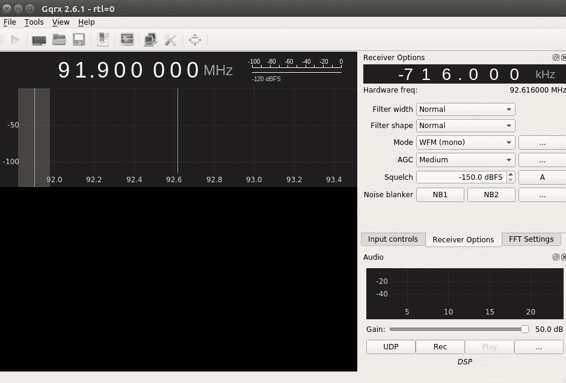

在顶部，您可以使用向上和向下箭头键设置频率，也可以通过键入要调整 RTL-SDR 的频率来设置频率。

就在频率部分之后，我们有了频谱。在这里，当您使用基于无线电的物联网设备时，您可以看到哪些频率最活跃，并注意到其中的峰值。稍后我们将对此进行更多讨论。

接下来是瀑布部分，它是活动与时间的关系图。这意味着您可以在几秒钟前看到哪个频率有通信活动。

在右侧部分，我们有一个接收器选项、输入控制和 FFT 设置，这些是各种配置，可以帮助您更好地分析数据。然而，我们现在不会为了保持事情的简单而逐一讨论它们。所有窗格都可以根据需要进行修改和自定义。

在第一个练习中，我们将通过调到其中一个本地 FM 电台并在 GQRX 中接收音频来收听该电台。

4.  为此，我们首先将模式更改为宽调频立体声，如以下屏幕截图所示：


5.  完成此操作后，将频率更改为本地 FM 电台频率范围，如下所示：


6.  只要你按下捕获按钮，你就能看到多个地方有尖峰的频谱。峰值代表该频率范围内的活动：

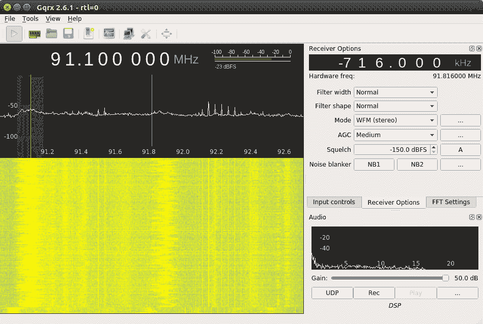

如果您现在在调谐到一个有效的 FM 电台（可通过尖峰识别）后收听扬声器发出的声音，您将能够听到该频率的 FM 广播。

# 用于 GSM 分析的 RTL-SDR

您还可以将 RTL-SDR 用于许多其他用途。其中一种用法是执行细胞分析，如下所示。我们将使用 RTL-SDR 查找各种手机用户的确切位置详细信息。然后可以将其与单向天线一起使用，以增加范围并收集大量信息。

1.  为此，启动`grgsm_livemon`，可从[下载 https://github.com/ptrkrysik/gr-gsm/](https://github.com/ptrkrysik/gr-gsm/) 。启动它，如以下屏幕截图所示：


2.  这将打开一个`grgsm_livemon`屏幕，允许您更改增益和频率，以便查看频谱：

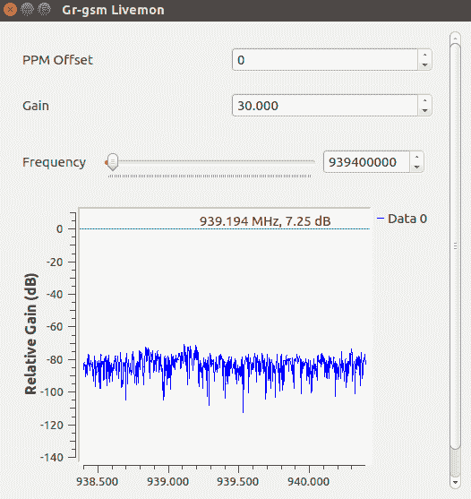

那么，我们如何获得在蜂窝网络上进行活动的频率呢。为此，我们将使用一个名为 Kalibrate 的实用程序，这是一个 GSM 频率标识符，可从[获得 https://github.com/ttsou/kalibrate](https://github.com/ttsou/kalibrate) 。

3.  获得 Kalibrate 后，指定要扫描的频带。在本例中，我们正在扫描 GSM900，并将增益设置为 40.0 dB：

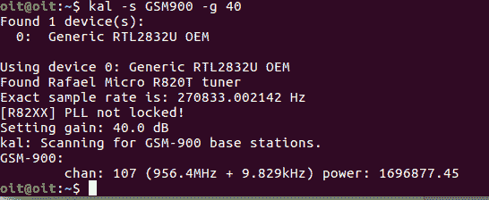

4.  它告诉我们在 956.4 MHz+9.829 kHz 时有大量的通信量。让我们启动 GQRX 并查看此频率，如以下屏幕截图所示：


5.  正如预期的那样，确实有很多活动以确定的频率发生。现在我们得到了我们想要查看的频率，让我们回到 GRGSM，设置这个频率，并进一步分析它：

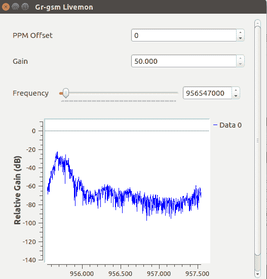

6.  我们也可以在 Gr gsm 中看到同样的流量。现在，为了进一步分析，我们需要查看环回`lo`接口上 Wireshark 的流量。正如所料，我们可以在这里看到一些有趣的信息。应用`gsmtap`过滤器过滤掉与我们相关的信息：


7.  如您所见，我们已经识别了**移动国家代码**（**MCC**）、**移动网络代码**（**跨国公司**）和**位置区号**（**拉丁美洲地区**）使用它，我们现在可以使用诸如 CellidFinder 之类的实用程序在地图上精确定位此手机的位置，这将允许我们在地图上找到离手机最近的塔：


因此，这就是如何将 RTL-SDR 用于各种目的，并分析从普通 FM 到飞行流量，甚至是蜂窝网络流量的许多事情。

# 使用 GNU 无线电

现在，在以前的案例中，我们只需要观察频率并对其进行分析，但不是太深入。如果我们有一个物联网设备，它正在传输原始无线通信量，我们想了解幕后发生了什么，并找出它实际传输的是什么数据，该怎么办。

为此，我们将使用一个名为 GNU Radio companion 的实用程序，它允许我们构建无线电模块以处理各种无线电信号。在该实用程序中，您可以选择输入源（如 RTL-SDR 源、Osmocom 源、HackRF 源和信号发生器）并在其上应用无线电块，最后将输出存储在原始 wav 文件中或绘制在图形中。

在本练习中，我们将查看一个气象站，我们将使用 RTL-SDR 源捕获该气象站的数据，然后执行解调和时钟恢复，以找到气象站发送的实际数据。

为了找出设备工作的频率，我们可以使用 GQRX 并在它传输数据时查找峰值。另一个选择是寻找 FCC ID——制造商在美国销售具有显著放射性的设备所需的标准。此信息通常位于设备上的一个标签上。

一旦我们有了 FCC ID，我们可以进入`fccid.io`并输入`FCC-ID`，这将显示设备使用的确切频率：


现在我们知道了频率，让我们转到 GNU Radio companion 并创建一个工作流来处理来自气象站的数据。我们不会深入讨论 GNU Radio companion 及其各种属性，但我们强烈建议您自己探索它，并尝试各种其他无线电捕获。

以下是我们将在此处添加的模块：

*   **Osmocom 源**：这有助于您从 RTL-SDR 获取无线数据包，并将其传递到以下模块。
*   **复杂到 Mag^2**：这有助于您将复杂数据类型更改为真实数据类型，而不考虑相位角等目前对我们不重要的因素。
*   **乘法常数**：这有助于增加您收到的输出数据的强度，因为原始数据可能非常低。值为 5 或 10 就好了。
*   **文件接收器**：这有助于您将输出放入一个文件中，然后可以在 audacity 中对其进行分析。

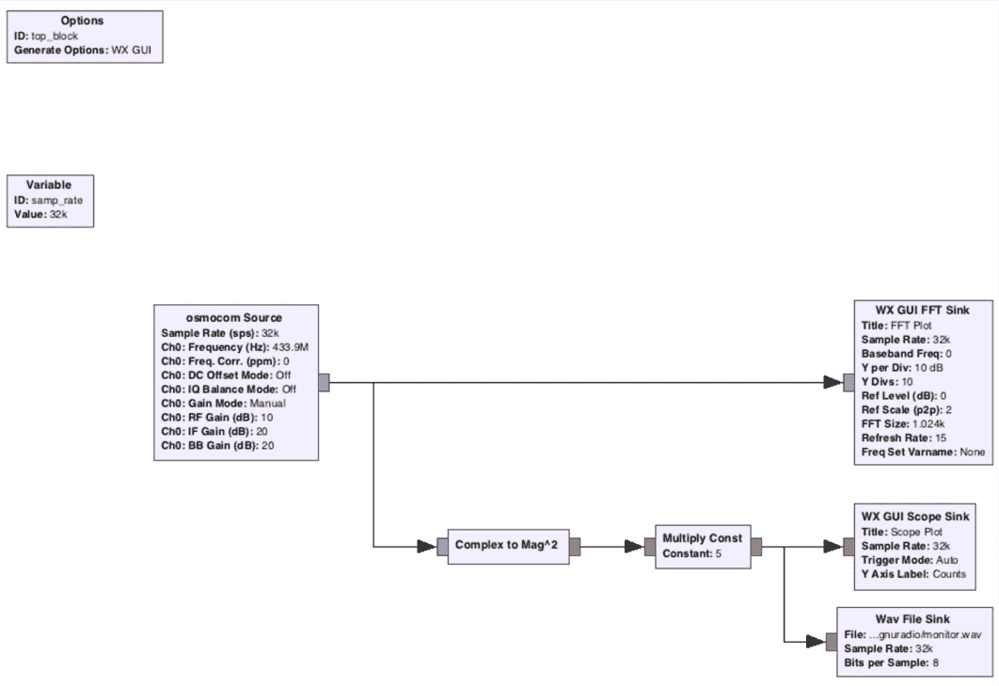

双击 Osmocom source 以更改其属性并设置频率，这是我们之前确定的。

同时双击 Wav 文件接收器并给它一个输出文件名。

我们现在已经准备好运行这个。一旦我们运行这个，我们将有一个名为`monitor.wav`的新文件。将 audacity 中的文件作为原始文件导入。在这一步中，这看起来像一个 OOK；我们需要将这些数据转换为可以理解的实际数据。其中一种方法是让较短的脉冲间隙代表数字零，较长的脉冲间隙代表数字零。这也显示在以下屏幕截图中：


如果我们进一步分析数据，我们现在可以看到气象站发送的准确数据，包括温度和湿度数据：


# 还有更多。。。

围绕 RTL-SDR 和总体 SDR 黑客攻击构建了许多其他实用程序，可用于多种目的。例如，ADS-B 项目允许您实时跟踪航班，RTL-433 使用 433 MHz 信号和其他实用程序利用键盘等功能。

# 了解和利用 ZigBee

ZigBee 是物联网设备中常用的无线协议之一，因为它能够形成网状网络并以低功耗和资源消耗执行操作。它已在许多垂直领域得到应用，包括智能家居、**工业控制系统**（**ICS**）、智能楼宇控制等。它在大多数国家的工作频率为 2.4 GHz，在美国和澳大利亚为 902 至 928 MHz，在欧洲为 868 至 868.6 MHz。

在本节中，我们将了解 ZigBee，并了解如何识别我们周围的 ZigBee 设备，嗅探和重放流量，以识别安全问题。

# 准备

要使用 ZigBee，需要进行以下设置：

*   **硬件**：Atmel RzRaven U 盘闪烁 KillerBee 固件

*   **软件**：KillerBee

安装 KillerBee 非常简单，可以按照此处提供的官方 GitHub repo[上的说明进行安装 https://github.com/riverloopsec/killerbee](https://github.com/riverloopsec/killerbee) 。

安装完成后，将 RzUSB 棒插入系统。您应该能够看到琥珀色的 LED 发光。如果您发现颜色为蓝色，这意味着您的 RzUSB 棒未闪烁 KillerBee 固件。我们将不讨论闪存固件的说明，因为它在 GitHub repo 中有很好的文档记录，并且有许多在线商店，您可以从那里获得带有 KillerBee 固件的预闪存 RzRaven。

# 怎么做。。。

以下是我们如何开始分析我们周围的 ZigBee 设备并最终使用 RzRaven 和 KillerBee 实用程序嗅探 ZigBee 上的流量的步骤。

1.  我们将执行的第一步是查看我们周围的 ZigBee 设备。这可以使用`zbid`实用程序完成，如以下屏幕截图所示：


2.  我们还向 Arduino 播放了以下节目。该程序告诉 Arduino 与通过插脚 2 和 3 串行连接的 XBee 进行交互，并通过 XBee 发送消息`5e87bb4a6cdef053fde67ea9711d51f3`。XBee 发送此流量的通道基于给定 XBee 的编程方式。如果您想编程自己的 XBee 并指定频道，可以使用实用程序 XCTU：

```
#include <SoftwareSerial.h> 

 int a = 0; 
SoftwareSerial mySerial(2, 3);  

 void setup() { 
Serial.begin(2400); 
} 

void loop() { 
Serial.println("5e87bb4a6cdef053fde67ea9711d51f3"); 
Serial.println(a); 
a++; 
} 
```

3.  接下来，我们将 Xbee 和 Arduino 放在 Xbee 护罩中，其外观类似于下图所示：


4.  打开护罩电源，运行`Zbstumbler`，如下图所示：

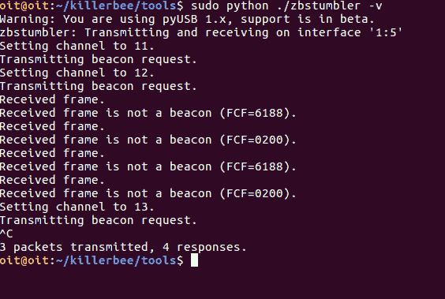

正如我们所看到的，我们能够看到设备在 12 频道上广播。

5.  下一步是嗅探通道 12 上的流量，看看它是否包含任何敏感信息。为此，我们将使用如下语法的`zbwireshark`实用程序，它将自动打开 Wireshark，以便在语法中指定的通道上进行 ZigBee 嗅探：

```
sudo ./zbwireshark -c 12
```

6.  正如预期的那样，我们将能够看到 Wireshark 中的所有流量，如以下屏幕截图所示，以及我们为 Arduino 编程的敏感字符串：


# 还有更多。。。

您还可以执行其他攻击，例如使用 KillerBee 工具套件中的实用程序（如 ZBREALAY）在修改后重放捕获的流量。

# 洞察 Z 波

Z-Wave 是无线传感器网络和家庭自动化中流行的协议之一，在美国和欧洲的工作频率分别为 908.42 MHz 和 868.42 MHz。Z-Wave 就像 ZigBee 一样支持网状网络，这使得它能够安全地防止节点故障等问题。

它是由西格玛系统公司利用的，与 ZigBee 和其他公司相比，它是一个封闭的协议。这也是安全社区针对 Z-Wave 的安全研究倡议相对较少于其他流行物联网协议的原因之一。还有一些项目，比如 OpenZWave，提供了一个开源的替代方案；然而，它们仍处于非常早期的阶段。

就像典型的无线电通信协议一样，Z-Wave 设备也面临同样的安全问题。Z-Wave 设备中最常见的漏洞之一是通信中缺乏加密，这使得它容易受到攻击，如敏感信息的明文传输和基于重播的攻击。然而，另一件需要注意的事情是，Z-Wave 中的 S2 Security 等项目极大地提高了设备中 Z-Wave 实现的安全性，从而进一步保护设备免受针对密钥交换和设备身份验证的攻击。

# 怎么做。。。

为了对 Z-Wave 进行攻击，流行的框架之一是 EZ-Wave（[https://github.com/AFITWiSec/EZ-Wave](https://github.com/AFITWiSec/EZ-Wave) 由*Joe Hall*和*Ben Ramsey*利用，使用 Hack RF 硬件对 Z-Wave 协议进行攻击。

EZ Wave 工具包包括三个工具，如下所示：

*   设备发现和枚举程序
*   侦察已识别设备 EZRecon
*   指纹的利用

评估 Z-Wave 协议的方法之一是捕获传输中的数据包，并查找以明文形式传输的敏感信息：


使用前面的所有构建块，下面是我们最终的流程图：


图像来源：http://oldsmokingjoe.blogspot.in/2016/04/z-wave-protocol-analysis-using-ez-wave.html.

完成后，我们可以选择重播数据包，或者根据我们想要实现的目标进行修改，然后重播。针对 Z-Wave 系统的另一类攻击是将 Z-Wave 设备节点从网络中分离/取消配对攻击、欺骗攻击、干扰和拒绝服务攻击等。

# 理解和利用可编程逻辑

BLE 或 Bluetooth Low Energy 是许多智能设备中最常见的平台之一，从智能家居到医疗设备公用设施，甚至健身跟踪器和可穿戴设备。BLE 越来越流行的原因之一是，我们今天使用的几乎所有智能手机都支持 BLE，因此更容易与基于 BLE 的物联网设备交互。

BLE 是为具有资源和功率限制的设备而设计的，BLE 通过提供短突发的远程无线电连接有效地解决了这些限制，从而显著节省了电池消耗。

BLE 最初是在 Bluetooth 4.0 规范中引入的，主要用于需要极低功耗通信模式的设备，BLE 声称使用单枚币形电池可以使用几个月到几年。

基于其当前连接和运行阶段，可编程器件可在四种不同模式下运行：

*   **中心设备和外围设备**：在该分类中，扫描广告包并启动连接的设备称为中心设备，而为连接而进行广告的设备称为外围设备。例如，将智能手机作为中央设备，将健身跟踪器作为外围设备。
*   **广播者和观察者**：顾名思义，广播者是广播数据的设备，而观察者是扫描广告包的设备。然而，与之前的分类类型相比，这里的主要区别在于广播者是不可连接的，并且观察者不能启动连接。这方面的一个例子是气象站，它作为一个广播员连续发射温度数据，而接收广播并在屏幕上显示的显示器是一个观察者。

BLE 包括 40 个不同的频道-3 个广告和 37 个数据频道，如下图所示：

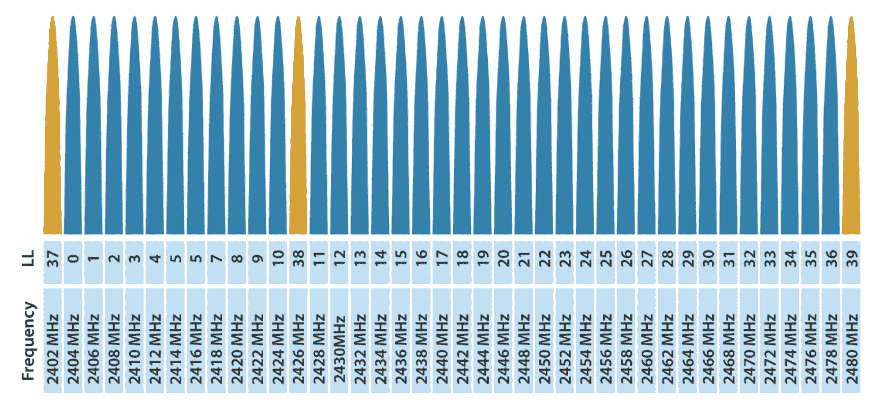

资料来源：http://www.connectblue.com/press/articles/shaping-the-wireless-future-with-low-energy-applications-and-systems/

BLE 还执行跳频扩频，这意味着它在每次事件中都会不断改变频道。然而，我们将在接下来的部分中使用的工具将能够通过跳跟踪设备，并能够嗅探 BLE 通信的数据。

为了更好地掌握蓝牙低能耗的基本概念，以下是 BLE stack 的外观：

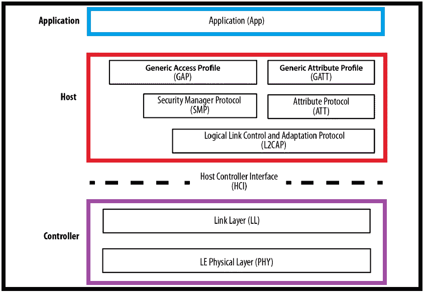

图像来源：http://www.embetronicx.com/

如您所见，这里有三个主要层：**应用**、**主机**和**控制器**。此外，**主机**和**控制器**通过所谓的**主机控制器接口**（**HCI**进行交互。

**控制器**包含**链路层****LL**和**LE 物理层****物理层**。物理层负责信号调制和解调的主要任务，并在连接期间计算设备的跳频模式。链路层负责许多任务，例如管理许多事情，包括设备的蓝牙地址、加密和连接启动，以及处理广告包。

**主机**层包含一些最重要的内容，我们将在 BLE 利用过程中直接处理这些内容。其中包括**通用访问配置文件**（**GAP**）和**通用属性配置文件**（**关贸总协定**）。

GAP 负责控制大多数广告和连接启动，并定义通信中存在的各种设备的角色。

GATT 直接位于 ATT 之上，ATT 是负责主/从设备之间数据交换的组件，执行许多操作，如读、写和错误处理。GATT 在 ATT 之上增加了一个整体数据组织层，使其更易于理解。在关贸总协定中，所有数据按照给定图表进行分类：


从上图中我们可以看到，整体数据被组织成**特征**的最低元素，其中包含**值**和**描述符**。这方面的一个例子是每分钟的心跳次数及其存储在 characteristic 中的值。这些特征还具有唯一的 UUID，可从蓝牙**特别兴趣小组**（**SIG**）数据库[中引用 https://www.bluetooth.com/specifications/gatt/characteristics](https://www.bluetooth.com/specifications/gatt/characteristics) 。

接下来，服务中包含了各种类似的特性。服务的一个例子是`heart-rate-service`，它包含各种特征，如每分钟心跳、不规则心跳和恐慌发作。服务还具有一个 16 位 UUID，使用该 UUID，可以将其引用到此处提供的服务 UUID 的 Bluetooth SIG 数据库[https://www.bluetooth.com/specifications/gatt/services](https://www.bluetooth.com/specifications/gatt/services) 。

接下来，整个服务包含在一个**配置文件**中，该配置文件可以是一个通用配置文件，在本例中，类似于心脏健康配置文件，其中包含各种服务，如`heart-rate-service`和`heart-oxygen-service`。

如前所述，我们在嗅探期间的目标是找到正在读写的特征的值。这些特征通常被称为**句柄**，这是我们捕获流量后将看到的。

接下来，BLE 堆栈的另一个重要组件是 L2CAP。L2CAP 代表逻辑链路控制和自适应协议，主要负责从其他层获取数据，并将数据封装在适当的 BLE 数据包结构中。

这就是我们需要知道的所有内容，以便开始进行不可恢复的利用。现在，让我们把手弄脏。

# 准备

要开始利用 BLE，我们需要以下工具：

*   软件：
    *   蓝色 Hydra 或 HCI Utils
    *   牙突
    *   加特克
*   硬件：
    *   可编程适配器加密狗
    *   Ubertooth 或类似的嗅探器

在使用 BLE 时，我们的方法是首先找出目标设备的地址，并在使用目标 BLE 设备执行操作时嗅探该特定地址的通信量。

这将允许我们找到正在设备上写入的特定 BLE 句柄，以执行特定操作。为了更好地了解什么是 BLE 句柄，它们只是对 BLE 特性所具有的各种属性的引用。

在本节中，我们将确保一切都已正确设置，如下所示。

确保蓝牙适配器加密狗已连接到您的虚拟机，并且您能够看到`hci`界面，如以下屏幕截图所示：


接下来，从他们的官方 GitHub repos 安装以下工具：

*   蓝色 Hydra（用于对 BLE 设备执行初始侦察）：[https://github.com/pwnieexpress/blue_hydra](https://github.com/pwnieexpress/blue_hydra)
*   Ubertooth Utils（为我们的 BLE 设备执行嗅探和数据包捕获）[https://github.com/greatscottgadgets/ubertooth](https://github.com/greatscottgadgets/ubertooth)
*   Wireshark（数据包分析工具，也与 BLE 兼容）[https://www.wireshark.org/download.html](https://www.wireshark.org/download.html)

一旦您安装并配置了所有这些，我们就可以开始与周围的 BLE 设备进行交互了。

# 怎么做。。。

1.  为了与我们周围的 BLE 设备进行交互，我们要做的第一件事就是查看我们周围的所有设备并找到它们的蓝牙地址。这可以使用以下命令完成：

```
sudo hcitool lescan 
```

2.  这使用 Hcitool 的`lescan`（低能扫描）功能查找附近的所有 BLE 广告，如以下屏幕截图所示：

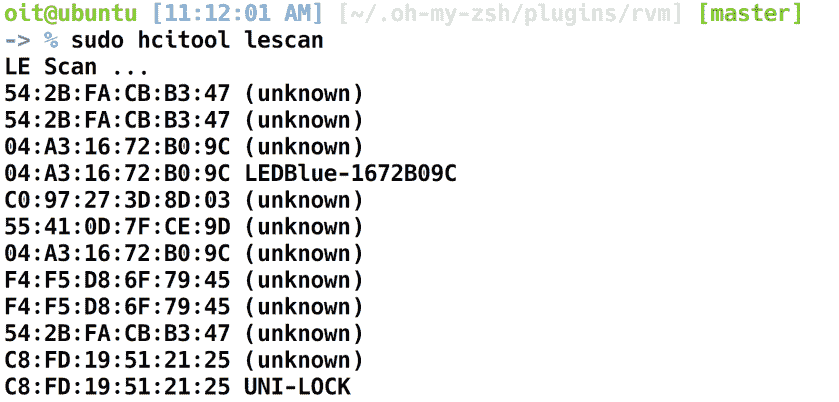

如您所见，我们能够识别周围的许多设备及其地址。接下来，我们可以使用 Ubertooth 嗅探给定设备的流量，如下所示。

Ubertooth One 是由 GreatScottGadgets 的*Michael Ossman*利用的设备，用于帮助评估蓝牙设备的安全性。它由一个 CC2400 2.4 GHz 射频收发器和一个带有 USB 端口的 NXP LPC1756 微控制器组成。

作为安全研究人员和渗透测试人员，它可以帮助我们识别安全问题，如明文数据传输，还可以识别在网络通信过程中写入和读取哪些句柄。

3.  要使用 Ubertooth 嗅探其后面给定设备的连接，请使用以下语法：

```
sudo ubertooth-btle -f -t [address] -c [capture-output]

```

4.  将`[address]`替换为我们在上一步中识别的设备地址。

`[capture-output]`可以是文件或管道，以防我们要进行主动流量拦截。

让我们使用`/tmp/pipe`作为捕获接口，管道的一端从 Ubertooth 获取输入数据，管道的另一端在 Wireshark 中显示数据。

5.  为此，打开另一个终端窗口并输入 mkfifo`/tmp/pipe`。完成后，转到 Wireshark |捕获接口|管理接口|新接口|管道并添加值`/tmp/pipe`并保存接口。
6.  接下来，开始嗅探刚刚创建的 Wireshark 中的`/tmp/pipe`接口。根据您正在执行的操作和目标设备，您将能够在 Wireshark 中看到 BLE 流量，如以下屏幕截图所示：

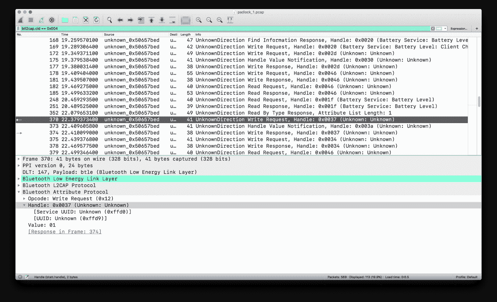

我们还在前面的屏幕截图`btl2cap.cid==0x004`中应用了一个过滤器，以确保我们获得了包含有用数据的数据包。正如您在图中所看到的，我们已经收到了大量的读/写请求，以及句柄和写入该特定句柄的值的详细信息。在这种情况下，手柄 0x0037 和值 1 对应于基于 BLE 的智能锁的解锁。

现在我们已经知道为了执行特定的操作要向句柄写入什么值，我们可以自己编写特定的句柄，而无需进行任何修改。为此，我们将使用 BLE 适配器加密狗和一个名为`gatttool`的实用程序。

7.  为此，启动`gatttool`，如下图所示，同时启动`-b`和`-I`标志，提供蓝牙地址并指定其在交互模式下打开：

```
sudo gatttool -b [Bluetooth-address] -I 
[gatttool prompt] connect 

```

8.  接下来，我们需要做的就是向目标设备发送写入请求，指定要写入句柄的值，如以下屏幕截图所示：


由于智能锁检测到手柄`0x0037`现在的值为`01`，这与智能锁的解锁状态有关，因此智能锁已解锁。

这就是如何与基于 BLE 的物联网设备交互，找出正在写入的句柄，然后自己编写这些句柄。

9.  您还可以通过查看服务的所有值来查看设备的其他属性，如以下屏幕截图所示：


10.  也可以对特征执行此操作，如以下屏幕截图所示：


# 还有更多。。。

为了有效地嗅探不稳定的流量，识别可能在三个广告频道中的任何一个上做广告的设备是很重要的。为此，重要的是设置三个 Ubertooth，而不是一个。

此外，您可以尝试的其他一些工具包括：

*   **btlejuice**：如果您想使用 web GUI 界面对 BLE 流量执行 MITM，这是一个方便的工具
*   **Gattacker**：与`btlejuice`类似，但没有 GUI
*   **BLEah**：这是一个可编辑的信息收集工具