# 一、渗透测试中的机器学习简介

目前，机器学习技术是信息技术的一些最热门的趋势。它们影响着我们生活的方方面面，影响着每一个行业和领域。机器学习是信息安全专业人员的一种网络武器。在这本书中，读者不仅将探索机器学习技术背后的基本原理，而且还将学习构建一个全功能机器学习安全系统的秘密。我们不会停止建立防御层；我们将说明如何构建攻击性工具来攻击和绕过安全防御。在本书结束时，您将能够绕过机器学习安全系统，使用渗透测试（pentesting）任务中构建的模型。

在本章中，我们将介绍：

*   机器学习模型与算法
*   绩效评估指标
*   降维
*   集成学习
*   机器学习开发环境和 Python 库
*   渗透测试中的机器学习——承诺和挑战

# 技术要求

在本章中，我们将构建一个开发环境。因此，我们将安装以下 Python 机器学习库：

*   努比
*   松软的

*   张量流
*   凯拉斯
*   熊猫
*   MatplotLib
*   scikit 学习
*   NLTK
*   西雅娜

您还可以找到此 GitHub 存储库中使用的所有脚本和安装指南：[https://github.com/PacktPublishing/Mastering-Machine-Learning-for-Penetration-Testing/tree/master/Chapter01](https://github.com/PacktPublishing/Mastering-Machine-Learning-for-Penetration-Testing/tree/master/Chapter01) 。

# 人工智能与机器学习

让机器像人一样思考是最古老的梦想之一。机器学习技术用于帮助根据经验和数据进行预测。

# 机器学习模型与算法

为了教会机器如何解决大量的问题，我们需要考虑不同的机器学习模型。如你所知，我们需要为模型提供数据；这就是为什么机器学习模型根据输入的数据集分为四大类：有监督学习、半监督学习、无监督学习和强化。在本节中，我们将详细描述每个模型，并探索每个机器学习模型中使用的最著名算法。在构建机器学习系统之前，我们需要知道事物在表面下是如何工作的。

# 被监督的

当我们有输入变量和输出变量时，我们讨论有监督机器学习。在这种情况下，我们需要在双方之间映射函数（或模式）。下面是一些最常用的有监督机器学习算法。

# 贝叶斯分类器

根据*剑桥英语词典*，偏见是指以不公平的方式支持或反对特定的人或事物，允许个人观点影响你的判断的行为。贝叶斯机器学习指的是先有一个信念，然后用数据更新它。从数学上讲，它基于贝叶斯公式：


最简单的贝叶斯问题之一是随机抛硬币，并试图预测输出是正面还是反面。这就是为什么我们可以将贝叶斯方法识别为概率方法。当您使用少量数据时，朴素贝叶斯非常有用。

# 支持向量机

**支持向量机**（**SVM**）是一种有监督的机器学习模型，通过识别表示数据之间的超平面来工作。数据可以在多维空间中表示。因此，支持向量机在分类模型中得到了广泛的应用。在支持向量机中，将使用最能分隔不同类的超平面。在某些情况下，当我们有分隔不同类的不同超平面时，将通过称为**边距**或**间隙**的东西来识别正确的超平面。边距是超平面和数据位置之间的最近距离。您可以查看以下图示以检查边距：


将选择间隙最大的超平面。如果我们选择边距最短的超平面，我们以后可能会面临错误分类问题。不要被前面的图表分心；超平面并不总是线性的。考虑如下情况：


在前面的情况中，我们可以添加一个新的轴，称为*z*轴，并使用称为核函数的核技巧应用变换，其中`z=x^2+y^2`。如果应用转换，新图形将如下所示：

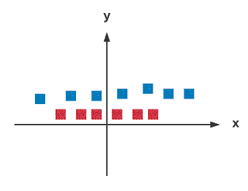

现在，我们可以确定正确的超平面。该转换称为**内核**。在现实世界中，找到超平面非常困难。因此，正则化和 gamma 这两个重要参数在确定正确的超平面以及在每个 SVM 分类器中在非线性超平面情况下获得更好的精度方面起着巨大的作用。

# 决策树

决策树是决策中使用的监督学习算法，它将数据表示为倒立的树，树的根在顶部。以下是决策树的图形表示：


数据是通过迭代二分法 3 算法来表示的。分类和回归问题中使用的决策树称为 CARTs。他们是由利奥·布雷曼介绍的。

# 半监督

半监督学习是介于前面讨论的两个模型之间的一个领域。换句话说，如果您在使用少量标记数据和未标记数据的情况下，则执行半监督学习。半监督学习广泛应用于现实世界中，如语音分析、蛋白质序列分类和 web 内容分类。有许多半监督方法，包括生成模型、低密度分离和基于图的方法（离散马尔可夫随机场、流形正则化和 mincut）。

# 无监督

在无监督学习中，我们没有关于模型输出的清晰信息。以下是一些著名的无监督机器学习算法。

# 人工神经网络

人工网络是人工智能，特别是机器学习中最热门的应用之一。人工神经网络的主要目的是建立能够像人脑一样学习的模型；换句话说，我们试图模仿人类的思维。这就是为什么，为了学习如何构建神经网络系统，我们需要清楚地了解人类思维的实际运作方式。人类的思想是一个惊人的实体。大脑由神经元组成和连接。神经元负责传递和处理信息。

我们都知道，人类的大脑可以执行很多任务，比如听、看、尝以及许多其他复杂的任务。因此，从逻辑上讲，人们可能认为大脑由许多不同的区域组成，每个区域负责一项特定的任务，这要归功于特定的算法。但这是完全错误的。根据研究，人类大脑的所有不同部分都得益于一种算法，而不是不同的算法。该假设称为**单一算法假设**。

现在我们知道大脑是通过一种算法工作的。但是这个算法是什么呢？它是如何使用的？信息是如何处理的？

为了回答前面的问题，我们需要看看神经元的逻辑表示。人类神经元的人工表示被称为**感知器**。感知器由下图表示：

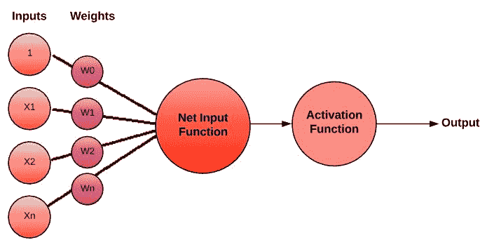

使用了许多**激活功能**。您可以将它们视为逻辑门：

*   **步进功能**：预定义的阈值。
*   **乙状结肠功能**：

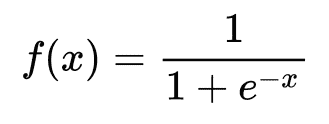

 ***   **Tanh 功能**：


*   **ReLu 功能**：


许多完全连接的感知器组成了我们所称的**多层感知器**（**MLP**网络。典型的神经网络包含以下内容：

*   输入层
*   隐藏层
*   输出层

一旦我们有了三个以上的隐藏层，我们将讨论术语**深度学习**。世界上使用了多种类型的深度学习网络：

*   **卷积神经网络**（**CNNs**）
*   **递归神经网络**（**RNNs**）
*   **长短期记忆**（**LSTM**）
*   浅层神经网络
*   **自动编码器****AEs**
*   受限玻尔兹曼机器

别担心；我们将在以后的章节中详细讨论前面的算法。

为了建立深度学习模型，我们遵循 Jason Brownlee 博士建议的五个步骤。这五个步骤如下：

1.  网络定义
2.  网络编译
3.  网络拟合
4.  网络评估
5.  预言

# 线性回归

线性回归是一种统计和机器学习技术。它被广泛用于理解输入和输出之间的关系。当我们有数值时，我们使用线性回归。

# 逻辑回归

逻辑回归也是一种统计和机器学习技术，用作二元分类器——换句话说，当输出为类（是/否、真/假、0/1 等）时。

# k-均值聚类

**k-最近邻**（**kNN**）是一种著名的聚类方法。它是基于在数据点中发现相似性，或者我们称之为特征相似性。因此，该算法简单，广泛应用于解决许多分类问题，如推荐系统、异常检测、信用评级等 . 但是，它需要大量内存。虽然它是一个有监督的学习模型，但它应该由标记数据提供，并且输出是已知的。我们只需要映射与双方相关的功能。kNN 算法是非参数的。数据表示为特征向量。您可以将其视为数学表示：


分类像投票一样进行；要知道所选数据的类别，必须首先计算所选项目与另一个培训项目之间的距离。但是我们如何计算这些距离呢？

一般来说，我们有两种主要的计算方法。我们可以使用欧几里德距离：

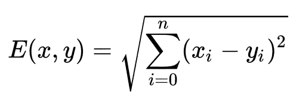

或者，我们可以使用余弦相似性：


第二步选择*k*最近距离（*k*可任意选取）。最后，我们根据信心水平进行投票。换句话说，数据将被分配给概率最大的类。

# 加固

在强化机器学习模型中，agent 与其环境相互作用，因此在学习过程中通过收集数据从经验中学习；目标是优化我们称之为长期**奖励**。你可以把它看作是一场有计分系统的游戏。下图说明了加固模型：


# 绩效评估

评估是每项方法操作的关键步骤。在构建了一个产品或系统，特别是一个机器学习模型之后，我们需要对其性能有一个清晰的愿景，以确保它以后能够按预期的方式运行。为了评估机器学习性能，我们需要使用定义良好的参数和见解。为了计算不同的评估指标，我们需要使用四个重要参数：

*   真阳性
*   假阳性
*   真阴性
*   假阴性

上述参数的符号如下所示：

*   *tp*：真阳性
*   *fp*：假阳性
*   *tn*：真阴性
*   *fn*：假阴性

有许多机器学习评估指标，例如：

*   **精密度**：精密度或阳性预测值是正确分类的阳性样本的比率除以阳性分类样本的总数：


*   **召回**：召回率或真阳性率是真阳性分类数除以数据集中阳性样本总数的比率：


*   **F 分数**：F 分数，或 F 度量，是将精确度和召回率结合在一个调和公式中的度量：


*   **准确度**：准确度是正确分类的样本总数除以样本总数的比率。这个度量本身是不够的，因为它是在类数相等的情况下使用的。

*   **混淆矩阵**：混淆矩阵是给定机器学习模型性能的图形表示。它总结了分类问题中每个类的性能。

# 降维

降维用于降低数据集的维数。在问题变得难以解决的情况下，当变量数量增加时，它确实很有用。通过使用术语维度，我们指的是特征。特征工程是一种基本的约简技术。

通常，我们有很多降维算法：

*   **低方差过滤器**：删除方差较低的变量。
*   **高相关滤波器**：使用 pearson 或 polychoric 识别具有高相关的变量，并使用**方差膨胀因子**（**VIF**）选择其中一个。
*   **后向特征消除**：在消除每个变量*n*次后，通过计算**误差平方和**（**SSE**）来完成。
*   **线性判别分析**（**LDA**）：将维度*n*的数量从原来的维度减少到类的数量 — 1 功能的数量。
*   **主成分分析**（**PCA**）：这是一个将变量转换为一组新变量（主成分）的统计过程。

# 利用集成学习改进分类

在许多情况下，当你建立一个机器学习模型时，你会得到低精度和低结果。为了得到好的结果，我们可以使用集成学习技术。这可以通过将许多机器学习技术组合到一个预测模型中来实现。

我们可以将集成学习技术分为两类：

*   **并行集成方法—**下图说明了并行集成学习的工作原理：


*   **顺序集成方法—**下图说明了顺序集成学习的工作原理：


以下是三种最常用的集成学习技术：

*   **Bootstrap 聚合****bagging**：**这涉及到构建单独的模型，并使用模型平均技术（如加权平均和多数投票）将其组合。**
***   **Boosting**：这是一种顺序集成学习技术。梯度增压是最常用的增压技术之一。*   **叠加**：这类似于 boosting，但它使用一个新模型来组合子模型。**

 **# 机器学习开发环境和 Python 库

在这一点上，我们已经获得了关于最常用的机器学习算法背后的基础知识。从本节开始，我们将更深入，通过亲身体验构建基于机器学习的安全项目。我们不会就此止步；在接下来的章节中，我们将学习恶意攻击者如何绕过智能安全系统。现在，让我们把迄今为止所学到的知识付诸实践。如果您正在阅读这本书，您可能对 Python 有一些经验。对你有好处，因为你有学习如何建立机器学习安全系统的基础。

我打赌你一定在想，为什么是 Python？这是一个很好的问题。根据最新的研究，Python 是数据科学中使用最多的编程语言之一，特别是机器学习。最著名的机器学习库是针对 Python 的。让我们了解一下构建机器学习模型所需的 Python 库和实用程序。

# 努比

数值 Python 库是数组数学和逻辑运算中使用最多的库之一。它包含许多线性代数功能，在机器学习中非常有用。当然，它是开源的，并且受到许多操作系统的支持。

要安装 NumPy，请通过键入以下命令使用`pip`实用程序：

```py
#pip install numpy
```

现在，您可以通过导入来开始使用它。以下脚本是一个简单的数组打印示例：


此外，您可以使用许多数学函数，如`cosine`、`sine`等。

# 松软的

**Scientific Python**（**SciPy**）就像 NumPy 一样，是一个惊人的 Python 包，加载了大量的科学函数和实用程序。欲了解更多详情，请访问[https://www.scipy.org/getting-started.html](https://www.scipy.org/getting-started.html) ：

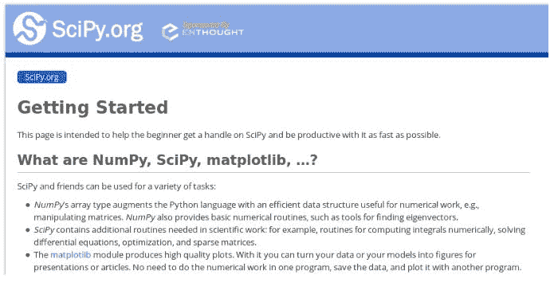

# 张量流

如果你已经进入机器学习一段时间了，你会听说 TensorFlow，或者甚至用它来建立机器学习模型或者给人工神经网络提供信息。这是一个惊人的开源项目，由 Google 开发并支持：

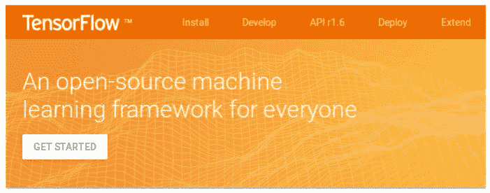

根据官方网站，TensorFlow 的主要架构如下：

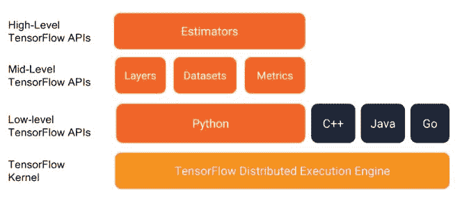

如果您是第一次使用 TensorFlow，强烈建议访问项目官方网站[https://www.tensorflow.org/get_started/](https://www.tensorflow.org/get_started/) 。让我们把它安装到我们的机器上，并了解它的一些功能。安装它有很多可能性；您可以使用本机 PIP、Docker、Anaconda 或 Virtualenv。

让我们假设我们将在 Ubuntu 机器上安装它（它还支持其他操作系统）。首先，使用`python --version`命令检查 Python 版本：

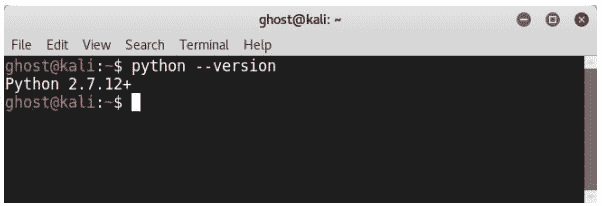

使用以下命令安装 PIP 和 Virtualenv：

```py
sudo apt-get install python-pip python-dev python-virtualenv
```

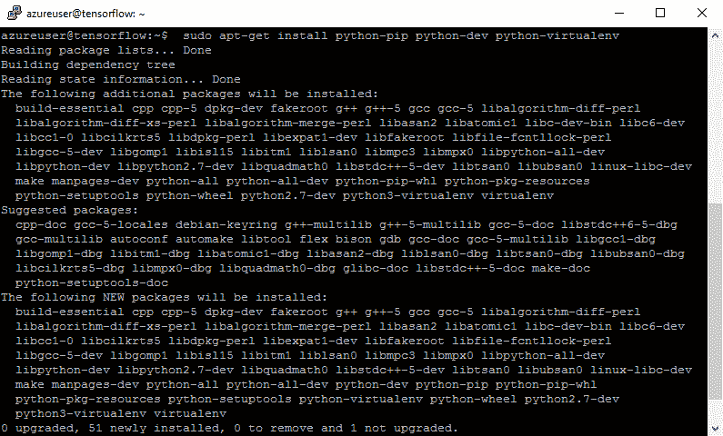

现在，软件包已安装：


使用`mkdir`命令创建新存储库：

```py
#mkdir TF-project
```

通过键入以下命令创建新的 Virtualenv：

```py
 virtualenv --system-site-packages TF-project
```

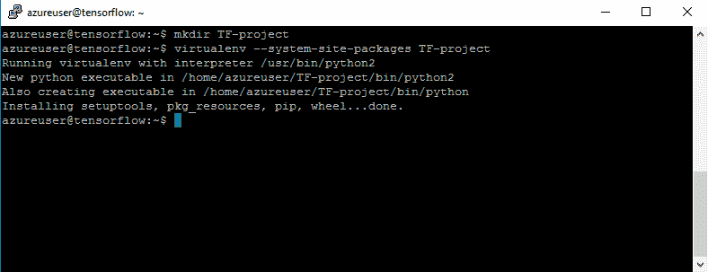

然后，键入以下命令：

```py
source  <Directory_Here>/bin/activate
```

使用`pip install -upgrade tensorflow`命令升级 TensorFlow：


```py
>>> import tensorflow as tf
>>> Message = tf.constant("Hello, world!")
>>> sess = tf.Session()
>>> print(sess.run(Message))
```

以下是显示`Hello World!`消息的完整步骤：

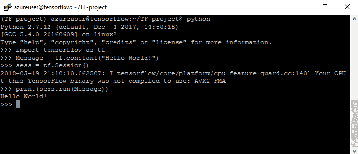

# 凯拉斯

Keras 是一个广泛使用的 Python 库，用于构建深度学习模型。这很容易，因为它是建立在 TensorFlow 之上的。构建深度学习模型的最佳方法是遵循前面讨论的步骤：

1.  加载数据
2.  定义模型
3.  编译模型
4.  适合的
5.  评价
6.  预言

在构建模型之前，请确保 SciPy 和 NumPy 已预配置。要进行检查，请打开 Python 命令行界面并键入以下命令，以检查 NumPy 版本：

```py
 >>>print numpy.__version__
```

要安装 Keras，只需使用 PIP 实用程序：

```py
$ pip install keras
```


当然，要检查版本，请键入以下命令：

```py
>>> print keras.__version__
```

要从 Keras 导入，请使用以下命令：

```py
from keras import [what_to_use]
from keras.models import Sequential
from keras.layers import Dense
```

现在，我们需要加载数据：

```py
dataset = numpy.loadtxt("DATASET_HERE", delimiter=",")
I = dataset[:,0:8]
O = dataset[:,8]  
#the data is splitted into Inputs (I) and Outputs (O)
```

您可以使用任何公开可用的数据集。接下来，我们需要创建模型：

```py
model = Sequential()
# N = number of neurons
# V = number of variable
model.add(Dense(N, input_dim=V, activation='relu'))
# S = number of neurons in the 2nd layer
model.add(Dense(S, activation='relu'))
model.add(Dense(1, activation='sigmoid')) # 1 output
```

现在，我们需要编译模型：

```py
model.compile(loss='binary_crossentropy', optimizer='adam', metrics=['accuracy'])
```

我们需要符合模型：

```py
model.fit(I, O, epochs=E, batch_size=B)
```

如前所述，评估是机器学习的关键步骤；因此，为了评估我们的模型，我们使用：

```py
scores = model.evaluate(I, O)
print("\n%s: %.2f%%" % (model.metrics_names[1], scores[1]*100))
```

要进行预测，请添加以下行：

```py
predictions = model.predict(Some_Input_Here)
```

# 熊猫

pandas 是一个开源 Python 库，以其高性能而闻名；它是由韦斯·麦金尼开发的。它可以快速处理数据。这就是为什么它被广泛应用于学术界和商业活动的许多领域。与以前的软件包一样，它受到许多操作系统的支持。

要在 Ubuntu 机器上安装，请键入以下命令：

```py
sudo apt-get install python-pandas
```


基本上，它处理三种主要的数据结构—数据帧、系列和面板：

```py
>> import pandas as pd
>>>import numpy as np
 data = np.array(['p','a','c','k',’t’])
 SR = pd.Series(data)
 print SR
```

我恢复了此屏幕截图中前面的所有行：


# Matplotlib

正如您所知，可视化在从数据中获取见解方面起着巨大的作用，在机器学习中也非常重要。Matplotlib 是数据科学家用于绘图的可视化库。您可以通过访问其官方网站[了解更多信息 https://matplotlib.org](https://matplotlib.org) ：

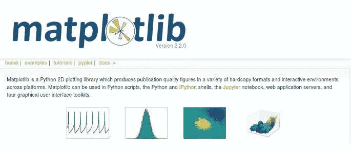

要在 Ubuntu 机器上安装，请使用以下命令：

```py
sudo apt-get install python3-matplotlib
```


要导入所需的包装，请使用`import`：

```py
import matplotlib.pyplot as plt
import numpy as np
```

使用此示例准备数据：

```py
x = np.linspace(0, 20, 50)
```

要进行打印，请添加以下行：

```py
plt.plot(x, x, label='linear')
```

要添加图例，请使用以下命令：

```py
plt.legend()
```

现在，让我们展示一下情节：

```py
plt.show()
```

瞧！这是我们的阴谋：

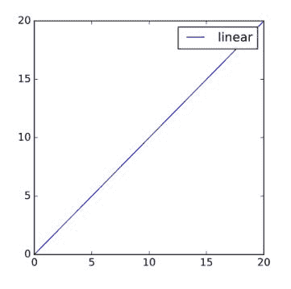

# scikit 学习

我强烈推荐这个惊人的 Python 库。scikit learn 已完全加载，具有各种功能，包括机器学习功能。scikit learn 的官方网站为[http://scikit-learn.org/](http://scikit-learn.org/) 。要下载它，请使用 PIP，如前所述：

```py
pip install -U scikit-learn 
```


# NLTK

自然语言处理是机器学习项目中最常用的应用之一。NLTK 是一个 Python 包，帮助开发人员和数据科学家管理和操作大量文本。可以使用以下命令安装 NLTK：

```py
pip install -U nltk
```


现在，导入`nltk`：

```py
>>> import nltk
```

使用以下组件安装`nltk`软件包：

```py
> nltk.download()
```

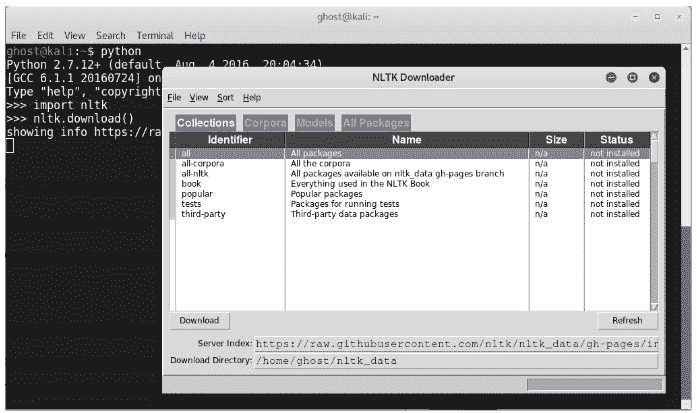

您可以安装所有软件包：


如果您使用的是命令行环境，则只需执行以下步骤：


如果点击`all`，您将下载所有软件包：


# 西雅娜

优化和速度是建立机器学习模型的两个关键因素。Theano 是一个 Python 包，它优化了实现并使您能够利用 GPU。要安装它，请使用以下命令：

```py
 pip install theano
```

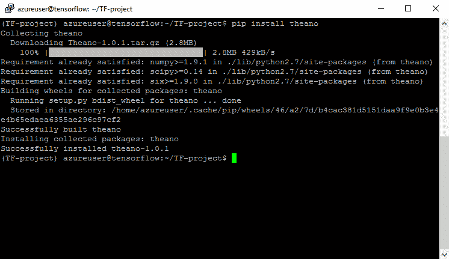

要导入所有 Theano 模块，请键入：

```py
>>> from theano import *
```

在这里，我们导入了一个名为`tensor`的子包：

```py
>>> import theano.tensor as T
```

假设我们要添加两个数字：

```py
>>> from theano import function
>>> a = T.dscalar('a')
>>> b = T.dscalar('b')
>>> c = a + b
>>> f = function([a, b], c)
```

以下是完整的步骤：

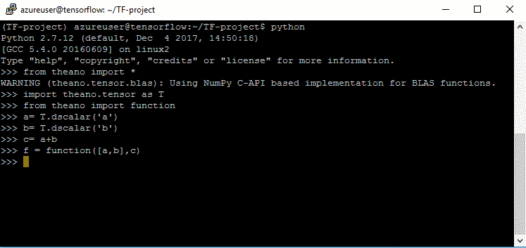

到目前为止，我们已经掌握了安装和使用机器学习项目中使用的最常见 Python 库的基本技能。我假设您已经在计算机上安装了以前的所有软件包。在接下来的章节中，我们将使用这些软件包中的大部分来构建完全工作的信息安全机器学习项目。

# 渗透测试中的机器学习——前景与挑战

机器学习现在是每个现代项目的一个必要方面。结合数学和尖端优化技术和工具可以提供惊人的结果。将机器学习和分析应用于信息安全是防御高级现实世界攻击和威胁的一个进步。

黑客总是试图使用新的、复杂的技术来攻击现代组织。因此，作为安全专业人员，我们需要不断更新自己，并部署必要的保障措施来保护资产。许多研究人员已经展示了数千种基于机器学习技术构建防御系统的方案。例如，以下是一些信息安全模型：

*   **监督学习**：
    *   网络流量分析
    *   垃圾邮件过滤
    *   恶意软件检测

*   **半监督学习**：
    *   网络异常检测
    *   C2 探测

*   **无监督学习**：
    *   用户行为分析
    *   内部威胁检测
    *   恶意软件系列识别

正如您所看到的，有很多应用程序可以帮助保护现代组织的宝贵资产。但一般来说，黑帽黑客不再使用经典技术。如今，机器学习技术的使用正从防御技术转向进攻系统。我们正从防守转为进攻。事实上，仅仅用人工智能和机器学习建立防御层是不够的；需要了解如何利用这些技术执行凶猛的攻击，并且在执行渗透测试任务时应将其添加到您的技术技能中。在模拟尖端攻击时，将攻击性机器学习工具添加到 pentesting 兵工厂非常有用。虽然这些攻击性应用程序中有很多仍用于研究目的，但我们将尝试构建自己的项目，以了解攻击者是如何构建攻击性工具和网络武器来攻击现代公司的。也许你以后可以在渗透测试操作中使用它们。

# 深度开发

最近出现了许多优秀的公开工具，它们使用机器学习功能将渗透测试提升到另一个层次。其中一个工具是深度开发。在 2018 年黑帽大会上展示。它是一个与 metasploit 链接的全自动渗透测试工具。这个伟大的工具使用强化学习（自我学习）。


它能够执行以下任务：

*   情报收集
*   威胁建模
*   脆弱性分析
*   剥削
*   剥削后
*   报告

要下载深度利用漏洞，请访问其官方 GitHub 存储库：[https://github.com/13o-bbr-bbq/machine_learning_security/tree/master/DeepExploit](https://github.com/13o-bbr-bbq/machine_learning_security/tree/master/DeepExploit) 。

它由机器学习模型（A3C）和元 SPLOIT 组成。这是深度利用体系结构的高级概述：

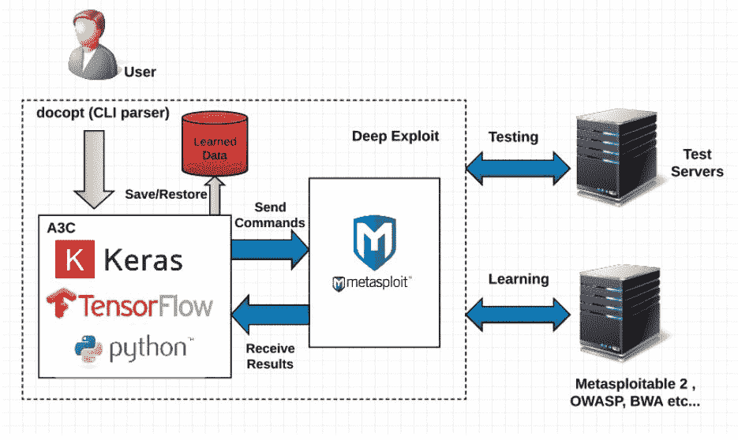

使深度利用正常工作所需的环境如下：

*   Kali Linux 2017.3（VMWare 上的来宾操作系统）
    *   内存：8.0GB
    *   Metasploit 框架 4.16.15-dev
*   Windows 10 Home 64 位（主机操作系统）
    *   CPU:Intel（R）Core（TM）i7-6500U 2.50GHz
    *   内存：16.0GB
    *   Python 3.6.1（蟒蛇 A3）
    *   TensorFlow 1.4.0
    *   Keras 2.1.2

# 总结

现在我们学习了最常用的机器学习技术；在进入实际实验室之前，我们需要对这些模型的实际工作原理有一个公平的了解。我们的实践经验将从下一章开始。

读完本章后，我假设我们可以构建自己的开发环境。第二章将向我们展示如何抵御先进的、基于计算机的社会工程攻击，我们将学习如何构建智能钓鱼探测器。与每一章一样，我们将从学习攻击背后的技术开始，并通过实际步骤构建钓鱼检测系统。

# 问题

1.  尽管机器学习是一个有趣的概念，但在有限的商业应用中它是有用的。（对|错）
2.  机器学习应用程序太复杂，无法在云中运行。（对|错）
3.  对于两次 k-means 聚类，是否期望得到相同的聚类结果？（是|否）
4.  具有离散值目标属性的预测模型可称为：

（a） 回归模型
（b）分类模型

5.  以下哪种技术执行的操作类似于神经网络中的辍学操作？

（a） 堆码
（b）装袋
（c）增压

6.  哪种神经网络结构最适合解决图像识别问题？

（a） 卷积神经网络
（b）递归神经网络
（c）多层感知器
（d）感知器

7.  深度学习与传统机器学习有何不同？

（a） 深度学习算法可以处理更多的数据，在数据科学家较少的监督下运行。
（b）与深度学习相比，机器学习更简单，并且需要更少的数据分析师监督。

（c） 两者之间没有真正的区别；它们是相同的工具，具有不同的名称。

8.  以下哪项是机器学习项目中经常使用的技术？

（a） 对数据进行分类。
（b）将相似对象分组。
（c）确定事件之间的关系，以预测一个事件何时会跟随另一个事件。
（d）以上所有内容。

# 进一步阅读

为了节省您的精力，我准备了一份有用的资源列表，以帮助您深入探索我们讨论过的技术。

推荐书籍：

*   *Python 机器学习-第二版*由塞巴斯蒂安·拉什卡和瓦希德·米尔贾利利编写：[https://www.packtpub.com/big-data-and-business-intelligence/python-machine-learning-second-edition](https://www.packtpub.com/big-data-and-business-intelligence/python-machine-learning-second-edition)
*   *用 Python 构建机器学习系统*由 Luis Pedro Coelho 和 Willi Richert 编写：[https://www.amazon.com/Building-Machine-Learning-Systems-Python/dp/1782161406](https://www.amazon.com/Building-Machine-Learning-Systems-Python/dp/1782161406)
*   *从头开始的数据科学：Python 的第一原则*作者：Joel Grus:[https://www.amazon.com/Data-Science-Scratch-Principles-Python/dp/149190142X/ref=pd_sim_14_4?_encoding=UTF8 &pd_rd_i=149190142X&pd_rd_r=506TTMZ93CK4Q4KZWDRM&pd_rd_w=5Eqf8&pd_rd_wg=1HMzv&psc=1&refRID=506TTMZ93CK4Q4KZWDRM](https://www.amazon.com/Data-Science-Scratch-Principles-Python/dp/149190142X/ref=pd_sim_14_4?_encoding=UTF8&pd_rd_i=149190142X&pd_rd_r=506TTMZ93CK4Q4KZWDRM&pd_rd_w=5Eqf8&pd_rd_wg=1HMzv&psc=1&refRID=506TTMZ93CK4Q4KZWDRM)

推荐网站和在线课程：

*   **机器学习掌握**：[https://machinelearningmastery.com](https://machinelearningmastery.com)
*   **科瑟拉 — 机器学习（Andrew Ng）**：[https://www.coursera.org/learn/machine-learning#syllabus](https://www.coursera.org/learn/machine-learning#syllabus)
*   **用于机器学习的神经网络**：[https://www.coursera.org/learn/neural-networks](https://www.coursera.org/learn/neural-networks)****