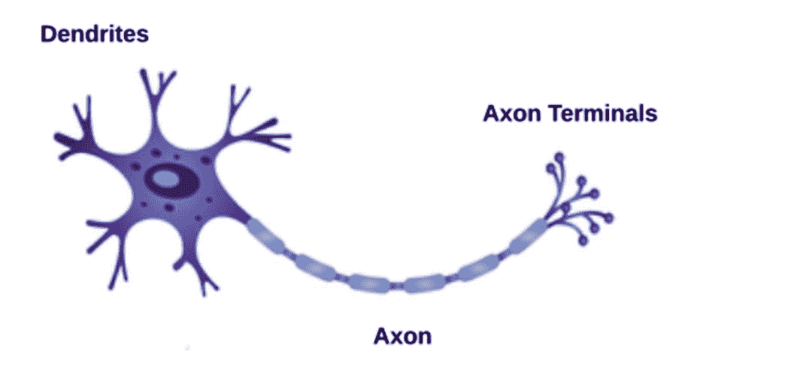
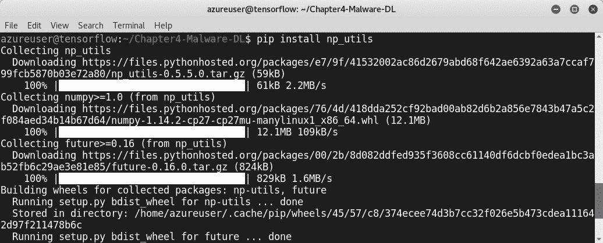
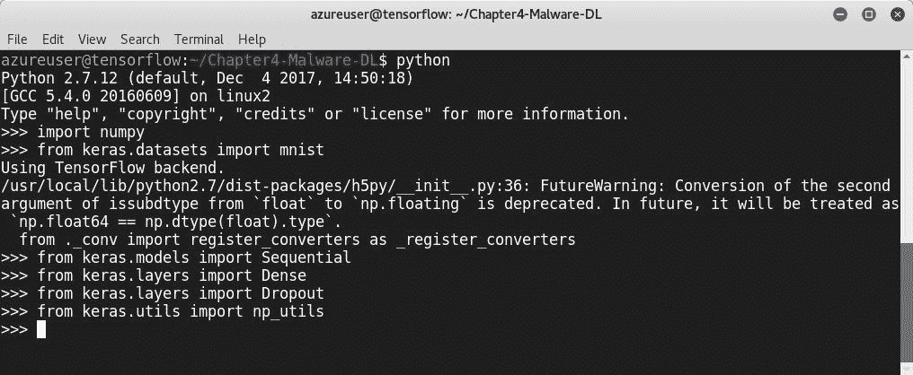
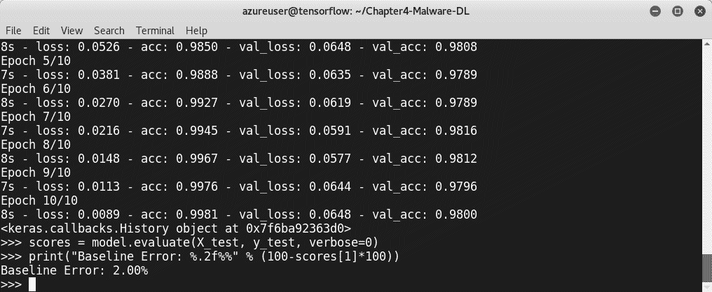
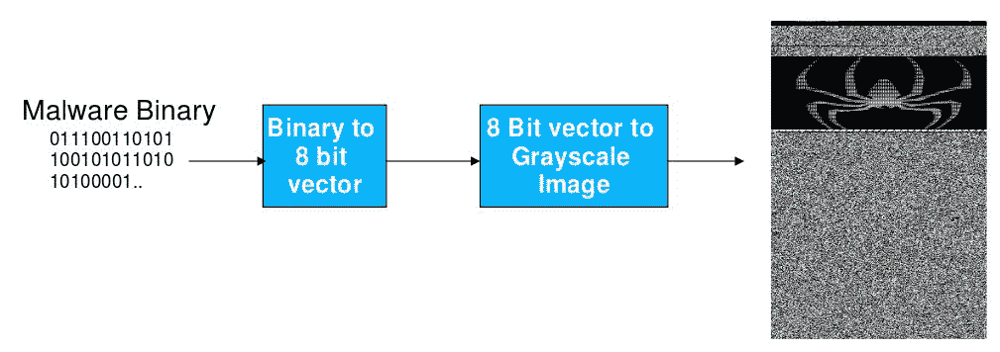
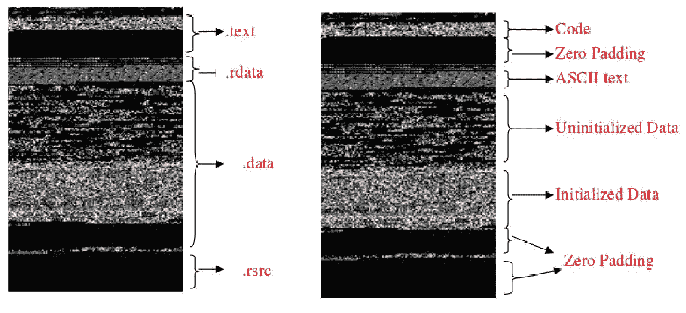
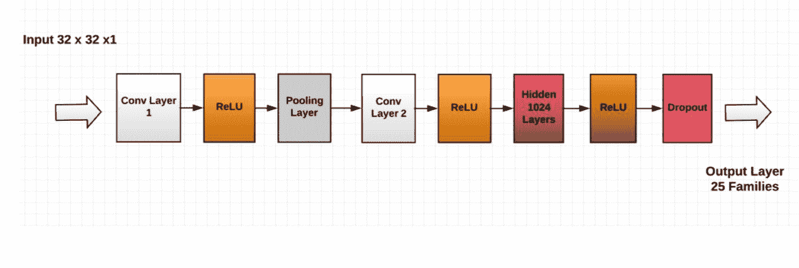

# 基于深度学习的恶意软件检测

人类的思想是一个迷人的实体。我们潜意识和潜意识的力量是难以置信的。使这种力量成为现实的是我们不断自我学习和快速适应的能力。这种神奇的自然天赋可以在你意识到它的作用之前计算出数十亿的任务。几十年来，科学家们一直在努力建造能够像人类大脑一样同时完成任务的机器，换句话说，就是能够以难以置信的速度高效地执行大量任务的系统。机器学习的一个称为**深度学习（DL）**的子领域出现了，它帮助我们构建像人脑一样工作并受其结构启发的算法。信息安全专业人员也对这些技术感兴趣，因为它们在防御重大网络威胁和攻击方面提供了有希望的结果。恶意软件分析是实现 DL 最合适的候选者之一。

在本章中，我们将发现：

*   人工神经网络：深入综述
*   如何使用 Python 构建第一个神经网络
*   如何用多层感知器构建恶意软件检测器
*   恶意软件可视化技术及如何利用卷积神经网络构建恶意软件分类器

# 技术要求

基本上，在本章中，我们将使用已经安装的 Python 库。一般来说，我们将在本书的大部分章节中使用这些库。因此，我们在第一章中教您如何安装我们将在大多数章节和项目中使用的所有必需库。在此链接中找到代码文件：[https://github.com/PacktPublishing/Mastering-Machine-Learning-for-Penetration-Testing/tree/master/Chapter04](https://github.com/PacktPublishing/Mastering-Machine-Learning-for-Penetration-Testing/tree/master/Chapter04) 。

# 人工神经网络综述

我们的大脑在一眨眼之间就完成了许多复杂的功能。因此，为了使用与人类思维相同的技术构建算法，我们必须了解大脑是如何工作的。通过对人类大脑如何运作的公平理解，我们将更好地理解深度学习。三种主要的不同思维功能是：

*   思考（分析、比较和判断）
*   感觉（快乐、悲伤和兴奋）
*   想要（动机、欲望和目标）

这三个功能在动态过程中不断相互作用。

大脑主要由三部分组成：**大脑**，是大脑最大的部分，控制着视觉、听觉和味觉等高级功能；**小脑**，负责协调肌肉运动和人体的一般姿势，包括平衡；第三部分被称为**脑干**，它连接前两部分并控制许多其他任务，包括打喷嚏、咳嗽和消化。

由于大脑的不同部分，它执行复杂的操作。从逻辑上讲，人脑的解剖结构由许多区域组成，因此每个区域都基于特定的算法工作。尽管大脑的每个部分都使用自己的算法工作，但令人惊讶的是，人脑基本上使用相同的算法来理解许多不同的输入模式。这个假设被称为**一个学习算法**假设。1992 年*Roe 等人*所做的许多研究都证明了这一点，尤其是雪貂的实验，在实验中，视觉输入被插入雪貂大脑的听觉部分，听觉皮层学会了如何看。

下图描述了**人工智能（AI）**、**机器学习（ML）**和**深度学习（DL）**之间的关系：


从生物学角度讲，人脑由数十亿个称为神经元的小器官组成。神经元是通过电信号和化学信号处理和传递信息的单位。这些神经细胞主要包括：

*   树突
*   轴突
*   突触
*   胞体
*   核

下图显示了生物神经元的不同组成部分：



生物神经元的类比表示被称为**感知器**。感知器可分为：

*   投入
*   砝码
*   净输入函数
*   激活函数
*   输出

感知器和人类神经元之间的类比并不完全正确。它只是用来让我们一窥感知器是如何工作的。人类的思维远比人工神经网络复杂。有一些相似之处，但直接比较大脑和神经网络是不合适的。

# 用 Python 实现神经网络

经典的计算机程序在基于一系列指令和算术运算的计算操作方面是伟大的，但在许多其他情况下，它们面临着困难和挑战；例如，手写识别。作为热身活动，让我们构建一个手写数字识别器，借此机会安装下一节所需的 Python 库，并学习如何用 Python 构建和实现我们的第一个神经网络。为了训练模型，我们需要向它提供数据。在我们的实现中，我们将使用 MNIST 数据集：


首先，让我们使用`pip install`命令安装`keras`库，如下所示：

```py
# pip install keras
```


然后，使用以下命令安装 TensorFlow（`tensorflow`）：

```py
# pip install tensorflow
```


最后，安装`np_utils`：

```py
# pip install np_utils
```



打开 Python 命令行界面，并使用导入命令导入以下模块，如图所示：

*   `mnist`数据集
*   `Sequential`模型
*   `Dense`和`Dropout`层
*   `np_utils`模块

```py
>>> from keras.models import Sequential
>>> from keras.layers import Dense
>>> from keras.layers import Dropout
>>> from keras.utils import np_utils
```

下图说明了前面的代码：



之所以使用 Seed，是因为我们希望得到可重复的结果。`numpy.random.seed(seed)`用于给发电机播种：

```py
>>> seed = 7
>>> numpy.random.seed(seed)
>>> (X_train, y_train), (X_test, y_test) = mnist.load_data()
```

从[下载数据 https://s3.amazonaws.com/img-datasets/mnist.pkl.gz](https://s3.amazonaws.com/img-datasets/mnist.pkl.gz) ：

```py
>>> num_pixels = X_train.shape[1] * X_train.shape[2]
>>> X_train = X_train.reshape(X_train.shape[0], num_pixels).astype('float32')
>>> X_test = X_test.reshape(X_test.shape[0], num_pixels).astype('float32')
>>> X_train = X_train / 255
>>> X_test = X_test / 255

>>> y_train = np_utils.to_categorical(y_train)
>>> y_test = np_utils.to_categorical(y_test)
>>> num_classes = y_test.shape[1]
>>> model = Sequential()
>>>model.add(Dense(num_pixels, input_dim=num_pixels, activation='relu'))
>>>model.add(Dense(num_classes,activation='softmax'))
>>>model.compile(loss='categorical_crossentropy', optimizer='adam', metrics=['accuracy'])
```

这里，`.astype()`用于转换变量，`.reshape()`用于在不改变数据的情况下为数组提供新的形状：



我们的手写数字分类器的准确率为 99.8%，这是一个惊人的结果。现在，我们已经学会了如何构建我们的第一个神经网络程序，是时候利用我们的技能并获得如何使用人工神经网络（特别是 DL 网络）构建恶意软件分类器的实际经验了。

# 基于 PE 报头的深度学习模型

根据我们学到的概念，我们将使用人工神经网络构建恶意软件检测器。让我们从识别数据集开始。现在，您已经熟悉了构建机器学习模型所需的步骤。对于这个模型，我们将使用**可移植可执行文件**（**PE**文件）作为馈送数据。正如您在上一章中所注意到的，我们安装了一个名为`pefile`的 Python 库。是时候在这个模型中使用它了。一旦我们使用 Python 软件包安装管理器 PIP 安装了`pefile`，我们就可以开始使用`pefile`从任何 PE 文件中提取信息。为了从 PE 文件中收集信息，请导入`os`和`pefile`库。`os`库允许您与运行 Python 的底层操作系统进行交互。

作为演示，我们将下载 Palo Alto networks 提供的恶意软件 PE 文件，用于实验目的。使用`wget`命令下载，如下所示：

```py
# wget https://wildfire.paloaltonetworks.com/publicapi/test/pe  
```

安装 PE 文件后，打开 Python 环境并导入所需的库，如下所示：

```py
>>> import os
>>> import pefile
```

使用以下命令加载文件：

```py
>>> PEfile = pefile.PE("pe", fast_load=True)
```

现在我们可以从 PE 文件中提取`PE_HEADER_OPTIONAL`信息，包括`MajorLinkerVersion`、`MajorLinkerVersion`、`SizeOfImage`和`DllCharacteristics`。您可以通过查看 Microsoft 文档找到完整列表：


在以下脚本中，我提取了有关以下内容的信息：

*   `LinkerVersion`
*   `NumberOfSections`
*   `ImageVersion`


我们知道，当涉及到计算时，训练模型是一项高消耗的任务。因此，处理并向模型提供所有头信息不是明智的决定。所以，我们需要对它们进行功能设计。选择好的特性是每个数据科学任务所需要的技能。Adobe Systems 的**产品安全事件响应团队**（**PSIRT**）的 Karthik Raman 进行了一项名为*选择特征对恶意软件*进行分类的研究，提出了一项建议，通过建议我们需要选择的最重要 PE 头来解决该问题；它们是：

*   `DebugSize`
*   `DebugRVA`
*   `ImageVersion`
*   `OperatingSystemVersion`
*   `SizeOfStackReserve`
*   `LinkerVersion`

*   `DllCharacteristics`
*   `IatRVA`
*   `ExportSize`
*   `ExportRVA`
*   `ExportNameLen`
*   `ResourceSize`
*   `ExportFunctionsCount`

要提取它们，您可以像以前一样使用导入的`PEfile`模块：

```py
DebugSize = PEfile.OPTIONAL_HEADER.DATA_DIRECTORY[6].Size
print (DebugSize)
DebugRVA = PEfile.OPTIONAL_HEADER.DATA_DIRECTORY[6].VirtualAddress
print (DebugRVA)
 ImageVersion = PEfile.OPTIONAL_HEADER.MajorImageVersion
 print (ImageVersion)
OSVersion = PEfile.OPTIONAL_HEADER.MajorOperatingSystemVersion
print (OSVersion)
ExportRVA = PEfile.OPTIONAL_HEADER.DATA_DIRECTORY[0].VirtualAddress
 print (ExportRVA)
ExportSize = PEfile.OPTIONAL_HEADER.DATA_DIRECTORY[0].Size
print (ExportSize)
IATRVA = PEfile.OPTIONAL_HEADER.DATA_DIRECTORY[12].VirtualAddress
 print (IATRVA)
ResSize = PEfile.OPTIONAL_HEADER.DATA_DIRECTORY[2].Size
 print (ResSize)
LinkerVersion = PEfile.OPTIONAL_HEADER.MajorLinkerVersion
 print (LinkerVersion)
NumberOfSections = PEfile.FILE_HEADER.NumberOfSections
 print (NumberOfSections)
StackReserveSize = PEfile.OPTIONAL_HEADER.SizeOfStackReserve
 print (StackReserveSize)
Dll = PEfile.OPTIONAL_HEADER.DllCharacteristics
print (Dll)
```


为了训练模型，有许多公开的来源。您可以从大量组织和教育机构列表中下载不同类型的文件（干净的和恶意的），例如：

*   **病毒标记**：[http://www.virusign.com/](http://www.virusign.com/)
*   **MalShare**：[http://malshare.com/](http://malshare.com/)
*   **恶意软件数据库**：[http://ytisf.github.io/theZoo/](http://ytisf.github.io/theZoo/)
*   **Endgame 恶意软件研究基准（EMBER）**：最大的数据集之一，包含 110 万个 2017 年某个时候扫描的 PE 文件的 SHA256 哈希。我强烈建议您下载它并尝试使用它构建您的模型。您可以从[下载 https://pubdata.endgame.com/ember/ember_dataset.tar.bz2](https://pubdata.endgame.com/ember/ember_dataset.tar.bz2) （1.6GB，扩展至 9.2GB）：


您的数据集应该包含两类 PE 文件：**清理**和**恶意文件**。我们需要至少 10000 个文件来训练这个模型。您必须使用前面的脚本开始提取标题信息。您可以通过自己开发自动化脚本来自动化任务。可以随意使用任何编程语言。最好的方法是将所有文件的选定功能导出为 CSV 文件，这样我们就可以使用我们在前几章中学到的内容，然后我们就可以使用熊猫加载它们：

```py
Malware  = pd.read_csv("Malware.csv")
Clean_Files = pd.read_csv("Clean_Files.csv")
```

在准备功能之后，我们需要将两种类型的数据合并为一种。例如，我们可以使用`pd.concat`合并这两个文件。为了训练模型，我们需要导入所需的模块：

```py
>>> import numpy as np
>>> from sklearn.model_selection import train_test_split
>>> from sklearn.metrics import confusion_matrix
>>> from sklearn.neural_network import MLPClassifier
>>> from sklearn.preprocessing import StandardScaler
```

关于数据准备：

```py
y = dataset['Clean_Files']
X = dataset.drop('Clean_Files',axis = 1)
X = np.asarray(X)
y = np.asarray(y)
```

这一行用于拆分，正如我们在其他模型中所做的：

```py
X_train,X_test,y_train,y_test = train_test_split(X,y,test_size = 0.3,random_state=0)
```

为了更好的预测，我们可以使用`StandScaler()`；它用于通过删除平均值并缩放到单位方差来标准化特征：

```py
scaler = StandardScaler()
scaler.fit(X_train)
X_train = scaler.transform(X_train)
X_test = scaler.transform(X_test)
```

在准备和特征工程数据后，我们需要构建**多层感知器**（**MLP**网络：

```py
MLP = MLPClassifier(hidden_layer_sizes=(12,12,12,12,12,12))
```

这里，`12`是层数和特征数。让我们训练模型并计算预测：

```py
MLP.fit(X_train,y_train)
Predictions = MLP.predict(X_test)
```

要检查评估指标，请添加以下行：

```py
TN, FP, FN TP = confusion_matrix(y_test,predictions).ravel()
```

这里使用`ravel()`返回一个连续的平坦数组。相当于`reshape(-1, order=order)`：

```py
print ("True Positive:" , TP)
print ("True Negative:" , TN)
print ("False Positive:" , FP)
print ("False Negative:" , FN)
```

# 基于卷积神经网络和恶意软件可视化的深度学习模型

前一部分是用于检测恶意软件的 MLP 网络的真实实现。现在，我们将探索其他人工网络体系结构，我们还将学习如何使用其中一种来帮助恶意软件分析师和信息安全专业人员检测和分类恶意代码。在深入研究 DL 方法的技术细节和实际实现步骤之前，有必要学习和发现人工神经网络的其他不同结构。我们在[第一章](01.html#K0RQ0-49a67f1d6e7843d3b2296f38e3fe05f5)*Pentesting 机器学习导论*中简要讨论了其中一些。现在讨论了主要的人工神经网络。

# 卷积神经网络（CNNs）

**卷积神经网络**（**CNNs**）是一种深度学习方法，用于解决图像分类问题，或者我们称之为计算机视觉问题，因为经典计算机程序在识别对象时面临许多挑战和困难，原因很多，包括照明、视点、变形、，和分割。这项技术的灵感来源于眼睛的工作原理，特别是动物的视觉皮层功能算法。在 CNN 中，以宽度、高度和深度为特征的三维结构排列。对于图像，高度是图像高度，宽度是图像宽度，深度是 RGB 通道。要构建 CNN，我们需要三种主要类型的层：

*   **卷积层**：卷积运算是指从输入图像中提取特征，并将滤波器中的值与原始像素值相乘
*   **池层**：池操作降低了每个特征地图的维度
*   **全连接层**：全连接层是经典的多层感知器，输出层具有 softmax 激活功能

要使用 Python 实现 CNN，可以使用以下 Python 脚本：

```py
import numpy
from keras.datasets import mnist
from keras.models import Sequential
from keras.layers import Dense
from keras.layers import Dropout
from keras.layers import Flatten
from keras.layers.convolutional import Conv2D
from keras.layers.convolutional import MaxPooling2D
from keras.utils import np_utils
from keras import backend 
backend.set_image_dim_ordering('th')

model = Sequential()
model.add(Conv2D(32, (5, 5), input_shape=(1, 28, 28), activation='relu'))
model.add(MaxPooling2D(pool_size=(2, 2)))
model.add(Dropout(0.2))
model.add(Flatten())
model.add(Dense(128, activation='relu'))
model.add(Dense(num_classes, activation='softmax'))
model.compile(loss='categorical_crossentropy', optimizer='adam', metrics=['accuracy'])
```

# 递归神经网络（RNN）

**递归神经网络**（**RNNs**）是一种人工神经网络，我们可以利用序列信息，如句子。换句话说，RNN 对序列的每个元素执行相同的任务，输出取决于之前的计算。RNN 广泛应用于语言建模和文本生成（机器翻译、语音识别和许多其他应用）。RNN 不会记住很长时间的事情。

# 长短时记忆网络

**长短期记忆**（**LSTM**）通过构建记忆块解决了递归神经网络中的短记忆问题。该块有时称为**存储单元**。

# 霍普菲尔德网络

Hopfield 网络由 John Hopfield 于 1982 年开发。Hopfield 网络的主要目标是自动关联和优化。我们有两类 Hopfield 网络：**离散**和**连续**。

# 玻尔兹曼机器网络

Boltzmann 机器网络使用循环结构，并且仅使用本地可用信息。它们是由杰弗里·辛顿和特里·塞诺夫斯基于 1985 年开发的。此外，波尔兹曼机器的目标是优化解决方案。

# 基于 CNNs 的恶意软件检测

对于这个新模型，我们将发现如何使用 CNN 构建恶意软件分类器。但我敢打赌，你一定想知道当 CNN 将图像作为输入时，我们如何做到这一点。答案很简单，这里的诀窍是将恶意软件转换成图像。这可能吗？是的。恶意软件可视化是近年来众多研究课题之一。其中一个建议的解决方案来自于一个名为“OrthT0.恶意软件图像”的研究，即可视化和自动分类，To1 T1 损坏，来自加利福尼亚大学圣塔巴巴拉的视觉研究实验室 Lakshmanan Nataraj To.T3T.

下图详细说明了如何将恶意软件转换为图像：



以下是**Alueron.gen 的图片！J**恶意软件：


该技术还使我们能够以详细的方式可视化恶意软件部分：



通过解决如何通过图像向使用 CNN 的恶意软件机器学习分类器提供信息的问题，信息安全专业人员可以利用 CNN 的强大功能来训练模型。最常用于向 CNN 提供信息的恶意软件数据集之一是**Malimg 数据集**。此恶意软件数据集包含来自 25 个不同恶意软件系列的 9339 个恶意软件样本。您可以通过访问以下链接从 Kaggle（预测建模和分析竞赛平台）下载：[https://www.kaggle.com/afagarap/malimg-dataset/data](https://www.kaggle.com/afagarap/malimg-dataset/data) 。

以下是恶意软件系列：

*   阿勒普勒
*   所有的
*   尤纳
*   Lolyda.AA 1
*   Lolyda.AA 2
*   Lolyda.AA 3
*   C2Lop.P
*   C2Lop.gen！G
*   即时访问
*   Swizzor.gen！我
*   Swizzor.gen！E
*   VB.AT
*   伪造的
*   罗恩·根！J
*   马莱克斯·根！J
*   洛丽达
*   阿迪勒 C
*   Wintrim.BX
*   拨号平台
*   顿托沃
*   模糊器
*   探员，仅供参考
*   自动运行
*   胡说八道！消息
*   皮肤修剪

将恶意软件转换为灰度图像后，您可以获得以下恶意软件表示形式，以便稍后使用它们为机器学习模型提供信息：


可以使用以下 Python 脚本将每个恶意软件转换为灰度图像：

```py
import os
import scipy
import array
 filename = '<Malware_File_Name_Here>';
 f = open(filename,'rb');
 ln = os.path.getsize(filename);
width = 256;
 rem = ln%width;
 a = array.array("B");
 a.fromfile(f,ln-rem);
 f.close();
 g = numpy.reshape(a,(len(a)/width,width));
 g = numpy.uint8(g);
 scipy.misc.imsave('<Malware_File_Name_Here>.png',g);
```

对于特征选择，您可以提取或使用任何图像特征，例如纹理图案、图像中的频率、强度或颜色特征，使用不同的技术，例如**欧几里德距离**或平均值和标准偏差，以生成后续的特征向量。在我们的例子中，我们可以使用诸如颜色布局描述符、同质纹理描述符或**全局图像描述符**（**GIST**等算法。假设我们选择了要点；`pyleargist`是一个伟大的 Python 库来计算它。要安装它，请像往常一样使用 PIP：

```py
# pip install pyleargist==1.0.1
```

作为一个用例，要计算 GIST，可以使用以下 Python 脚本：

```py
import Image
Import leargist
 image = Image.open('<Image_Name_Here>.png');
 New_im = image.resize((64,64));
des = leargist.color_gist(New_im);
Feature_Vector = des[0:320];
```

这里，`320`指的是我们使用灰度图像时的第一个`320`值。别忘了将它们保存为*NumPy 数组*，以便稍后使用它们来训练模型。

在得到特征向量后，我们可以训练许多不同的模型，包括支持向量机、k-均值和人工神经网络。其中一个有用的算法是 CNN 算法。

一旦特征选择和工程完成，我们就可以建立一个 CNN。例如，对于我们的模型，我们将构建一个具有两个卷积层的卷积网络，具有*32*32*输入。要使用 Python 库构建模型，我们可以使用以前安装的 TensorFlow 和 utils 库来实现它。

因此，整个 CNN 架构如下图所示：



CNN 架构不是构建模型的唯一建议，但目前我们将使用它进行实现。

为了建立模型和 CNN，我强烈推荐 Keras。所需的导入内容如下：

```py
import keras
 from keras.models import Sequential,Input,Model
 from keras.layers import Dense, Dropout, Flatten
 from keras.layers import Conv2D, MaxPooling2D
 from keras.layers.normalization import BatchNormalization
 from keras.layers.advanced_activations import LeakyReLU
```

如前所述，灰度图像的像素值范围为 0 到 255，因此我们需要向网络提供*32*32*1*维图像：

```py
train_X = train_X.reshape(-1, 32,32, 1)
test_X = test_X.reshape(-1, 32,32, 1)
```

我们将使用以下参数培训我们的网络：

```py
batch_size = 64
epochs = 20
num_classes = 25
```

要构建体系结构，请使用以下格式：

```py
Malware_Model = Sequential()
Malware_Model.add(Conv2D(32, kernel_size=(3,3),activation='linear',input_shape=(32,32,1),padding='same'))
Malware_Model.add(LeakyReLU(alpha=0.1))
Malware_model.add(MaxPooling2D(pool_size=(2, 2),padding='same'))
Malware_Model.add(Conv2D(64, (3, 3), activation='linear',padding='same'))
Malware_Model.add(LeakyReLU(alpha=0.1))
Malware_Model.add(Dense(1024, activation='linear'))
Malware_Model.add(LeakyReLU(alpha=0.1))
Malware_Model.add(Dropout(0.4))
Malware_Model.add(Dense(num_classes, activation='softmax'))
```

要编译模型，请使用以下命令：

```py
Malware_Model.compile(loss=keras.losses.categorical_crossentropy, optimizer=keras.optimizers.Adam(),metrics=['accuracy'])
```

安装并培训模型：

```py
Malware_Model.fit(train_X, train_label, batch_size=batch_size,epochs=epochs,verbose=1,validation_data=(valid_X, valid_label))
```

正如你所注意到的，我们正在关注前几章讨论的神经网络的训练流程。要评估模型，请使用以下代码：

```py
Malware_Model.evaluate(test_X, test_Y_one_hot, verbose=0)
print('The accuracy of the Test is:', test_eval[1])
```

# 将深度学习应用于恶意软件检测的前景和挑战

机器学习从业者和恶意软件分析员提出了许多不同的深度网络体系结构来检测已知和未知的恶意软件；提出的一些结构包括受限玻尔兹曼机器和混合方法。您可以在*进一步阅读*部分中查看其中一些。检测恶意软件和恶意软件的新方法显示了许多有希望的结果。然而，恶意软件分析员在使用深度学习网络检测恶意软件时面临许多挑战，尤其是在分析 PE 文件时，因为要分析 PE 文件，我们将每个字节作为输入单元，因此我们需要通过数百万步对序列进行分类，此外，由于函数调用和跳转命令，还需要在函数之间保持复杂的空间相关性。

# 总结

恶意软件是每个现代组织的噩梦。攻击者和网络罪犯总是会想出新的恶意软件来攻击他们的目标。安全供应商正在尽最大努力抵御恶意软件攻击，但不幸的是，由于每月发现数以百万计的恶意软件，他们无法做到这一点。因此，需要新的方法，这正是我们在本章和上一章中所看到的。我们发现了如何使用不同的机器学习算法构建恶意软件检测器，特别是使用深度学习技术。在下一章中，我们将学习如何通过构建和开发健壮的智能系统来检测僵尸网络。

# 问题

1.  MLP 网络和深度学习网络的区别是什么？
2.  为什么 DL 最近正在起飞？
3.  为什么我们需要在不同的模型中迭代多次？
4.  将英语翻译成法语需要什么类型的 DL？
5.  为什么恶意软件可视化是对恶意软件进行分类的好方法？
6.  激活功能的作用是什么？
7.  你能提到三种 DL 架构吗？

# 进一步阅读

*   **博客帖子**：
    *   Keras 教程：深入学习 Python（[https://www.datacamp.com/community/tutorials/deep-learning-python](https://www.datacamp.com/community/tutorials/deep-learning-python) ）
    *   使用 Keras 逐步开发 Python 中的第一个神经网络（[https://machinelearningmastery.com/tutorial-first-neural-network-python-keras/](https://machinelearningmastery.com/tutorial-first-neural-network-python-keras/) ）
    *   MNIST 手写数字数据库（[http://yann.lecun.com/exdb/mnist](http://yann.lecun.com/exdb/mnist) /）

*   **论文和演示文稿**：
    *   恶意软件家族的高维可视化（[https://www.rsaconference.com/writable/presentations/file_upload/tta-f04-high-dimensional-visualization-of-malware-families.pdf](https://www.rsaconference.com/writable/presentations/file_upload/tta-f04-high-dimensional-visualization-of-malware-families.pdf) ）
    *   一种基于深度学习的混合恶意代码检测方法（[http://www.covert.io/research-papers/deep-learning-security/A%20Hybrid%20Malicious%20Code%20Detection%20Method%20based%20on%20Deep%20Learning.pdf](http://www.covert.io/research-papers/deep-learning-security/A%20Hybrid%20Malicious%20Code%20Detection%20Method%20based%20on%20Deep%20Learning.pdf) ）
    *   基于 API 调用序列（[的文件访问模式的恶意软件分类多任务学习模型 http://www.covert.io/research-papers/deep-learning-security/A%20Multi-任务%20 从%20API%20Call%20Sequence.pdf](http://www.covert.io/research-papers/deep-learning-security/A%20Multi-task%20Learning%20Model%20for%20Malware%20Classification%20with%20Useful%20File%20Access%20Pattern%20from%20API%20Call%20Sequence.pdf)学习%20Malware%20Classification%20 的%20 模型%20，具有%20 有用的%20 文件%20 访问%20 模式%20）
    *   结合受限 Boltzmann 机器和单边感知器进行恶意软件检测（[http://www.covert.io/research-papers/deep-learning-security/Combining%20Restricted%20Boltzmann%20Machine%20and%20One%20Side%20Perceptron%20for%20Malware%20Detection.pdf](http://www.covert.io/research-papers/deep-learning-security/Combining%20Restricted%20Boltzmann%20Machine%20and%20One%20Side%20Perceptron%20for%20Malware%20Detection.pdf) ）
    *   用于恶意软件分类的卷积神经网络-论文（[http://www.covert.io/research-papers/deep-learning-security/Convolutional%20Neural%20Networks%20for%20Malware%20Classification.pdf](http://www.covert.io/research-papers/deep-learning-security/Convolutional%20Neural%20Networks%20for%20Malware%20Classification.pdf) ）
    *   恶意软件系统调用序列分类的深度学习（[http://www.covert.io/research-papers/deep-learning-security/Deep%20Learning%20for%20Classification%20of%20Malware%20System%20Call%20Sequences.pdf](http://www.covert.io/research-papers/deep-learning-security/Deep%20Learning%20for%20Classification%20of%20Malware%20System%20Call%20Sequences.pdf) ）
    *   基于深度神经网络的二维二进制程序特征恶意软件检测（[http://www.covert.io/research-papers/deep-learning-security/Deep%20Neural%20Network%20Based%20Malware%20Detection%20Using%20Two%20Dimensional%20Binary%20Program%20Features.pdf](http://www.covert.io/research-papers/deep-learning-security/Deep%20Neural%20Network%20Based%20Malware%20Detection%20Using%20Two%20Dimensional%20Binary%20Program%20Features.pdf) ）
    *   DL4MD：智能恶意软件检测的深度学习框架（[http://www.covert.io/research-papers/deep-learning-security/DL4MD-%20A%20Deep%20Learning%20Framework%20for%20Intelligent%20Malware%20Detection.pdf](http://www.covert.io/research-papers/deep-learning-security/DL4MD-%20A%20Deep%20Learning%20Framework%20for%20Intelligent%20Malware%20Detection.pdf) ）
    *   Droid Sec：深入学习 Android 恶意软件检测（[http://www.covert.io/research-papers/deep-learning-security/DroidSec%20-%20Deep%20Learning%20in%20Android%20alware%20Detection.pdf](http://www.covert.io/research-papers/deep-learning-security/DroidSec%20-%20Deep%20Learning%20in%20Android%20Malware%20Detection.pdf)
    *   HADM：检测恶意软件的混合分析（[http://www.covert.io/research-papers/deep-learning-security/HADM-%20Hybrid%20Analysis%20for%20Detection%20of%20Malware.pdf](http://www.covert.io/research-papers/deep-learning-security/HADM-%20Hybrid%20Analysis%20for%20Detection%20of%20Malware.pdf) ）
    *   具有循环网络的恶意软件分类（[http://www.covert.io/research-papers/deep-learning-security/Malware%20Classification%20with%20Recurrent%20Networks.pdf](http://www.covert.io/research-papers/deep-learning-security/Malware%20Classification%20with%20Recurrent%20Networks.pdf) ）