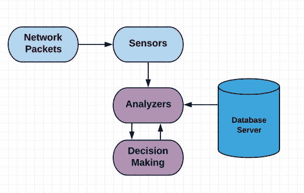
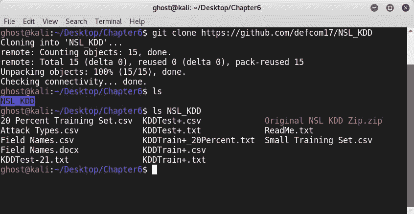
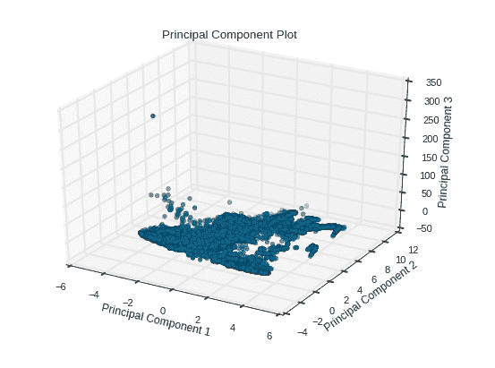

# 异常检测系统中的机器学习

网络上未经授权的活动可能是任何企业的噩梦。保护客户的数据是我们最关心的问题，也是每个企业所有者的责任。部署入侵检测系统是现代组织防范恶意入侵的明智决策。不幸的是，攻击者和黑帽黑客总是发明新技术来绕过保护，以获得对网络的未经授权访问。这就是为什么机器学习技术是一个很好的解决方案，可以保护网络免受复杂的攻击。

本章将是一个一站式指南，用于发现网络异常，学习如何使用公开可用的数据集和尖端的开放源码 Python 数据科学库从头开始构建入侵检测系统。

在本章中，我们将介绍以下内容：

*   异常检测技术综述
*   网络攻击
*   检测网络异常
*   **基于主机的入侵检测系统**（**HIDS**
*   **基于网络的入侵检测系统**（**NIDS**

# 技术要求

这些是本章所需的要求：

*   本章要求具备网络工作知识。
*   我们将使用前面章节中看到的相同 Python 库，并添加一个名为**Yellowbrick**的新库。（您将在本章中找到安装说明。）
*   您可以在 GitHub 存储库的[中找到本章中使用的代码文件 https://github.com/PacktPublishing/Mastering-Machine-Learning-for-Penetration-Testing/tree/master/Chapter06](https://github.com/PacktPublishing/Mastering-Machine-Learning-for-Penetration-Testing/tree/master/Chapter06) 。

# 异常检测技术综述

现在我们将讨论网络异常（这是我们最关心的）及其检测方法。根据定义，异常是超出规范的东西，是数据中意外的模式。术语异常在数据挖掘中被广泛使用，有时被称为异常值。异常检测技术通常用于欺诈检测和发现恶意活动。在网络中，由于多种原因可能会出现异常，但在这种情况下，对我们来说重要的是恶意活动检测。通常，我们会看到三种类型的异常：

*   **点异常**：与其他数据相比，个别数据实例异常。
*   **上下文异常**：仅在特定上下文（时间段、区域等）中发生的异常行为。
*   **集体异常**：与其他数据相比的异常活动的集合。

基于可用数据，可以使用多种技术检测这些异常。

# 静态规则技术

如果我们有训练数据，那么我们需要检查数据是否平衡。如果我们没有训练数据，将根据异常类型做出决定；要检测点异常，建议使用百分位数和直方图。为了检测集体异常，决策将基于异常的方差；要检测单变量异常，可以使用马尔可夫链，也可以建立一个模型并查看残差。在多变量情况下，我们可以使用聚类和马尔可夫模型（如果异常有序）或 k 近邻（如果异常无序）。

下图显示了不同的技术：


# 网络攻击分类

当涉及到网络异常时，我们的工作是保护组织的网络免受入侵者的入侵。网络入侵是一种威胁网络安全的恶意活动。为了更好地研究，信息安全专业人员建议对网络攻击进行多种分类。例如，他们将网络攻击分为以下几类：

*   感染（恶意软件）
*   爆炸（缓冲区溢出）
*   探测（嗅探）
*   欺骗（欺骗）
*   遍历（蛮力强制）
*   并发（DDoS）

攻击还可以分为被动攻击和主动攻击。主动攻击是指攻击者直接影响网络。**国防高级研究计划局**（**DARPA**）在其入侵检测评估计划中将主动攻击分为四大类。四个类别如下：

*   **拒绝服务（DoS）**：DoS 攻击是指试图中断授权用户对网络的访问。换句话说，它们阻止用户访问在线服务，如电子邮件。
*   **用户对根（U2R）攻击**：U2R 攻击难以检测；他们试图获得高（超级用户）权限。这是通过以普通用户的身份访问系统并尝试在以后利用系统的弱点来升级权限来实现的。
*   **远程到本地（R2L）**：R2L 攻击是试图与远程机器交互以获取访问权限。使用的一种技术是密码猜测。
*   **探测**：探测是试图获取网络中主机的信息，包括有效 IP 地址、正在运行的服务和打开的端口。它通常是通过扫描来完成的。如您所知，收集的信息稍后将用于识别漏洞，以便对其进行攻击。

# 网络异常的检测

网络**入侵检测系统**（**IDSs**并不是一个新概念。自最早的网络攻击以来，它们就被提出。根据其部署情况，IDS 可分为两大类：HIDS 和 NIDS。下图说明了 IDS 体系结构的高级概述：



# HIDS

HID 能够收集和监控计算机系统（尤其是其内部），以便安全分析师深入了解关键系统（如工作站、服务器和移动设备）上发生的情况。HIDS 的主要目标是检测入侵。

# NIDS

NID 负责检测网络数据中的入侵。基本上，检测是基于序列数据中的特定模式进行的。换句话说，NIDSs 读取所有传入的数据包，并尝试在其中发现异常。

# 基于异常的入侵检测系统

谈到 IDS，我们通常讨论两类：基于主机的和基于网络的。但也出现了一类新的入侵检测系统。新类别是基于异常的。这些系统通过使用机器学习技术来识别数据中的入侵和异常。在前面的章节中，特别是在[第 1 章](01.html#K0RQ0-49a67f1d6e7843d3b2296f38e3fe05f5)、*笔试中的机器学习简介*中，我们研究了不同的机器学习模型：监督、非监督、半监督和强化学习。根据用于检测网络入侵的机器学习模型，基于异常的入侵检测系统也分为有监督和无监督系统。经过多年的研究，信息安全界已经成功地对 IDS 中使用的不同方法进行了分类。由 Elike Hodo、Xavier J.A.Bellekens、Andrew Hamilton、Christos Tachtatzis 和 Robert C.Atkinson 提出的名为*浅层和深层网络入侵检测系统：分类和调查的方案*详细概述了许多用于可靠入侵检测的机器学习技术。下图显示了一些技术：


如您所见，我们在前面的章节中讨论了许多建议的技术。通常，在有监督的异常检测中，输入数据和异常类别是已知的。换句话说，所有的数据都有标签；即使是收集带标签的数据也是一项费时费力的任务。捕获的数据将在发送到检测引擎之前进行处理。无监督异常检测系统在工作时可能是新的解决方案，即使数据没有标记。

聚类是无监督系统中最常用的技术之一。这两个不同的系统可以组合成一个混合入侵检测系统。整体混合异常入侵检测系统如下所示：


如果你想建立一个成功的和可靠的基于异常的网络入侵检测系统，你需要考虑很多重要的因素。其中一个因素是邻近测量；根据定义，邻近性是指对物体的相似性或相异性的测量。因此，如前所述，这些系统正试图将数据分类或分组，从而分别测量对象之间的接近程度。相似性度量的值介于`0`和`1`之间，其中`1`是最大的相似性值。欧几里德距离和曼哈顿距离是一些常见的邻近度量。选择合适的度量值取决于数据类型（数字或分类）。异常不是任意检测的，而是基于评分系统。子样本通过称为**异常分数**的入侵分数进行标记。该评分系统对信息安全分析师非常有益；根据有序排列的异常列表，他们可以根据严重程度选择阈值。以下是异常网络入侵检测系统使用的一些常见异常评分技术：

*   **基于距离的异常评分估算**：
    *   **进化数据集中基于链接的离群值和异常检测**：数据集包含连续属性和分类属性。它使用相似性度量来度量链接强度和两点之间的关联度。
    *   **减少内存负载**：这将异常定义为具有具有不寻常值的子集属性的数据点。

*   **基于密度的异常评分估算**：
    *   **混合属性数据集离群点检测**：通过计算值的不规则性以及不同类型属性之间的关系来检测异常。

# 构建自己的 ID

现在，您已经了解了不同的网络异常检测技术。我们现在将用 Python 从头开始构建我们自己的网络 ID。加利福尼亚大学举办了一个名为“Ont0”的竞赛，即第三届国际知识发现和数据挖掘工具竞赛 T1，他们提供了一个数据集，称为“ORT T2”KDD CUP 1999 数据，AUTT3 或 ORD T4 KDD 1990 ORT T5。您可以在[找到它 http://kdd.ics.uci.edu/databases/kddcup99/kddcup99.html](http://kdd.ics.uci.edu/databases/kddcup99/kddcup99.html) 。

比赛的主要目的是建立一个能够区分坏（攻击）和好（正常）连接的系统。许多现代方案和机器学习解决方案都是使用该数据集提出的。但正如您所看到的，数据集是旧的；除了数据冗余等其他问题外，这些模型无法检测现代网络攻击。Mahbod Tavallaee、Ebrahim Bagheri、Wei Lu 和 Ali A.Ghorbani 对 KDD CUP 99 数据集进行了名为*的详细分析*的伟大研究，突出了 KDD99 数据集中的许多问题。出现了一个新的数据集来解决这些问题，名为 NSL-KDD（[http://www.unb.ca/cic/datasets/nsl.html](http://www.unb.ca/cic/datasets/nsl.html) ）。即使这样也没有解决所有的问题，但已经做出了许多改进。这些改进使数据减少了约 75%。

以下是一些额外的、公开可用的数据集，可以帮助您构建自己的入侵检测系统：

*   **科堡入侵检测数据集****CIDDS**：[https://www.hs-coburg.de/index.php?id=927](https://www.hs-coburg.de/index.php?id=927)
*   **UGR'16，一个新的基于循环平稳性的网络 IDSs 评估数据集**：[https://nesg.ugr.es/nesg-ugr16/index.php#CAL](https://nesg.ugr.es/nesg-ugr16/index.php#CAL)
*   **入侵检测评估数据集（CICIDS2017）**：[http://www.unb.ca/cic/datasets/ids-2017.html](http://www.unb.ca/cic/datasets/ids-2017.html)

对于我们的模型，我们将使用**NSL_KDD**作为训练和测试的数据集。要获得它，只需从 GitHub 克隆它，或者直接使用它，因为我们在本书的 GitHub 存储库中提供了本书中讨论的所有数据集。您可以在`Chapter 06`文件夹中找到：

```py
# git clone https://github.com/defcom17/NSL_KDD
```



数据集包含不同的文件：

*   `KDDTrain+.arff`：完整的 NSL-KDD 训练集，带有 ARFF 格式的二进制标签。
*   `KDDTrain+.txt`：完整的 NSL-KDD 训练集，包括 CSV 格式的攻击类型标签和难度等级。
*   `KDDTrain+_20Percent.ARFF`：`KDDTrain+.arff`文件的 20%子集。
*   `KDDTrain+_20Percent.TXT`：`KDDTrain+.txt`文件的 20%子集。
*   `KDDTest+.ARFF`：完整的 NSL-KDD 测试集，带有 ARFF 格式的二进制标签。
*   `KDDTest+.TXT`：完整的 NSL-KDD 测试集，包括 CSV 格式的攻击类型标签和难度等级。
*   `KDDTest-21.ARFF`：不包含记录的`KDDTest+.arff`文件的子集，难度等级为 21 分之 21。
*   `KDDTest-21.TXT`：不包含记录的`KDDTest+.txt`文件的子集，难度等级为 21 分之 21。

如果您打开`Field Names.csv`，您将看到全部 40 个字段：


要导入此数据集，我们将使用`pandas`：

```py
>>> import pandas as pd
>>> Data = pd.read_csv("KDDTrain+.csv", header=None)
```

如果我们用`Data.columns`检查列，我们将看到列或字段表示为数字：


为了使特征分析更容易，让我们为一个数字指定一个字段名，以便更好地表示特征。为此，我们将创建一个名为`Columns`的数组，填充字段名，并加载数据集：

```py
Columns = ["duration","protocol_type","service","flag","src_bytes",
 "dst_bytes","land","wrong_fragment","urgent","hot","num_failed_logins",
 "logged_in","num_compromised","root_shell","su_attempted","num_root",
 "num_file_creations","num_shells","num_access_files","num_outbound_cmds",
 "is_host_login","is_guest_login","count","srv_count","serror_rate",
 "srv_serror_rate","rerror_rate","srv_rerror_rate","same_srv_rate",
 "diff_srv_rate","srv_diff_host_rate","dst_host_count","dst_host_srv_count",
 "dst_host_same_srv_rate","dst_host_diff_srv_rate","dst_host_same_src_port_rate",
 "dst_host_srv_diff_host_rate","dst_host_serror_rate","dst_host_srv_serror_rate",
 "dst_host_rerror_rate","dst_host_srv_rerror_rate","label","difficulty"]
```

加载数据：

```py
Data = pd.read_csv("KDDTrain+.csv", header=None, names = Columns)
Data.columns
```

以下是功能名称：


为了更好地理解数据集，我们可以使用`pandas.DataFrame.describe`：

```py
Data.describe()
```


在训练模型之前，需要进行一些额外的处理。`sklearn.preprocessing.LabelEncoder`使用`0`和`n_classes-1`以及`fit_transform(y)`之间的值对标签进行编码。安装标签编码器并返回编码标签。在我们的例子中，我们正在将非数字标签转换为数字标签。另外，我们需要预处理四个标签：`protocol_type`、`service`、`flag`和`label`。

为此，我们使用`fit.transform()`，校准我们的测量值：

```py
from sklearn import preprocessing 
Data.protocol_type = preprocessing.LabelEncoder().fit_transform(Data["protocol_type"])
 Data.service = preprocessing.LabelEncoder().fit_transform(Data["service"])
 Data.flag = preprocessing.LabelEncoder().fit_transform(Data["flag"])
 Data.label = preprocessing.LabelEncoder().fit_transform(Data["label"])
```


在 scikit 学习中，有两种不同的方法：`fit`和`fit_transform`。这两种方法的区别在于`fit`计算参数（μ和σ，其中μ是总体的平均值，σ是总体的标准偏差）并在内部保存，而`fit_transform`执行相同的任务，但也对特定样本集应用转换。

让我们确定我们的数据。在以下几行中，我们使用了一种额外的 NumPy 方法`as_matrix()`，将帧转换为其 NumPy 数组表示形式。根据官方文档，在 NumPy 数组中，返回的不是 NumPy 矩阵，而是 NumPy 数组：

```py
X = Data[Columns].as_matrix()
y = Data.label.as_matrix()
```

通常，在这一步之后，我们将进行模型训练；但这一次，我们将花更多的时间来分析和可视化我们的数据和功能。数据科学的任务之一是获取洞察力和知识，而可视化对于数据科学和机器学习至关重要。我的建议是尽可能多地使用数据，并使用不同的技术进行研究。正如您所注意到的，机器学习系统通常尊重相同的技术，作为数据科学家或机器学习专家，您的工作是从数据中选择正确的特征。机器学习算法是基于数学的，通常情况下，你不会改变算法本身；相反，您需要执行一些良好的特性工程，以构建一个可靠、高精度的模型，以满足您的目标。

Yellowbrick 是一个很棒的可视化库和一套可视化诊断工具（可视化工具）。此库依赖于 scikit 学习和 Matplotlib。您可以使用`pip`进行安装：

```py
pip install yellowbrick
```

这个库非常丰富，可以让您可视化特征、分类、回归、聚类，甚至文本（例如，可视化语料库中术语的频率分布）：

```py
visualizer = Rank1D(features=Columns, algorithm='shapiro')
visualizer.fit(X, y) 
visualizer.transform(X) 
visualizer.poof()
```


`visualizer.poof()`将显示如下图：


要保存绘图，可以添加`outpath`，如下所示：

```py
visualizer.poof(outpath="Figure1.png") 
```

您甚至可以将其导出为 PDF 文件。您可能已经注意到，在`visualizer = Rank1D(features=Columns, algorithm='shapiro')`行中，我们使用了一种称为`Rank1D`的方法和一种称为`shapiro`的算法，对特征进行排序并检测它们之间的关系。`Rank1D`和`Rank2D`评估单个特征或成对特征。在我们的例子中，我们使用了特征的一维排序。

`Rank2D`是特征的二维排序。下面显示了如何实现它：

```py
visualizer = Rank2D(features=Columns, algorithm='covariance')
```

您可以从`pearson`或`covariance`中选择：

```py
visualizer.fit(X, y)
visualizer.transform(X)
visualizer.poof()
```


让我们回到我们使用的排名算法。`shapiro`参数是指 Shapiro-Wilk 排序算法。您可以选择您的排名算法：


我们之前发现了**P****主成分分析**（**PCA**。Yellowbrick 使您能够将高维数据分解为二维或三维，并绘制它们：

```py
visualizer = PCADecomposition(scale=True, center=False, col=y)
visualizer.fit_transform(X,y)
visualizer.poof()
```


此外，绘图可以是三维的：

```py
visualizer = PCADecomposition(scale=True, center=False, color=y, proj_dim=3)
 visualizer.fit_transform(X,y)
 visualizer.poof()
```

上图显示了上述代码：



现在是时候训练我们的入侵检测机器学习模型了。通常，我们分割数据，选择使用的分类器，拟合模型，并获得评分结果：

```py
clf = RandomForestClassifier(max_depth=2, random_state=0)
clf.fit(X, y)
Score = clf.score(X_test,y_test)
print(Score*100)
```


我们的入侵检测系统得分为 85.7%。有关更多详细信息，您可以像在以前的模型中一样输出评估指标（TF、FP、TN、FN 和 Recall）。

# 羽衣甘蓝

监控是一项艰巨的任务，尤其是对于数百名工程师组成的团队来说，在这个团队中，可能会出现指标过载。为了解决这个问题，除了基于时间序列的异常检测能力之外，我们还可以使用许多项目。其中之一是羽衣甘蓝。它由两部分组成：天际线和眼。Skyline 的作用是检测异常度量（异常检测系统），而 Oculus 是异常相关组件。要下载这两个组件，可以检查以下存储库：

*   天际线：[http://github.com/etsy/skyline](http://github.com/etsy/skyline)
*   眼睛：[http://github.com/etsy/oculus](http://github.com/etsy/oculus)

您将需要以下内容：

*   至少 8GB 内存
*   四核 Xeon 5620 CPU 或类似处理器
*   1 GB 磁盘空间

# 总结

在本章中，我们探讨了网络异常检测技术的基本原理及其背后的理论。您学习了如何使用 Python 构建基于机器学习的网络异常检测器。有许多其他技术可用于构建机器学习 ID。下一章将指导您部署一个完全有效的威胁搜寻平台，为开放源码项目使用一个称为 ELK 堆栈的惊人堆栈，从而提高您的技能。

# 问题

1.  什么是异常？
2.  什么是马尔可夫链？
3.  什么是隐马尔可夫模型？
4.  我们如何用隐马尔可夫模型检测异常？
5.  时间序列异常检测与其他类型的异常检测有什么区别？
6.  时间序列异常检测和其他类型的异常检测有什么区别？
7.  有监督和无监督机器学习异常检测之间有什么区别？

# 进一步阅读

*   **博客帖子**：
    *   **异常检测文章**：[https://www.kdnuggets.com/tag/anomaly-detection](https://www.kdnuggets.com/tag/anomaly-detection)
    *   **DevOps 异常检测实用指南**：[https://www.bigpanda.io/blog/a-practical-guide-to-anomaly-detection/](https://www.bigpanda.io/blog/a-practical-guide-to-anomaly-detection/)
*   **论文**：
    *   **分布式复杂系统时空图形建模时间序列异常的根本原因分析**：*[https://arxiv.org/abs/1805.12296](https://arxiv.org/abs/1805.12296)*
    **   **一种用于无监督异常检测的广义主动学习方法**：*[https://arxiv.org/abs/1805.09411](https://arxiv.org/abs/1805.09411)***   **解释异常：一类模型的深层泰勒分解**：*[https://arxiv.org/abs/1805.06230](https://arxiv.org/abs/1805.06230)***   **面向软件定义网络的高效异常入侵检测**：*[https://arxiv.org/abs/1803.06762](https://arxiv.org/abs/1803.06762)****