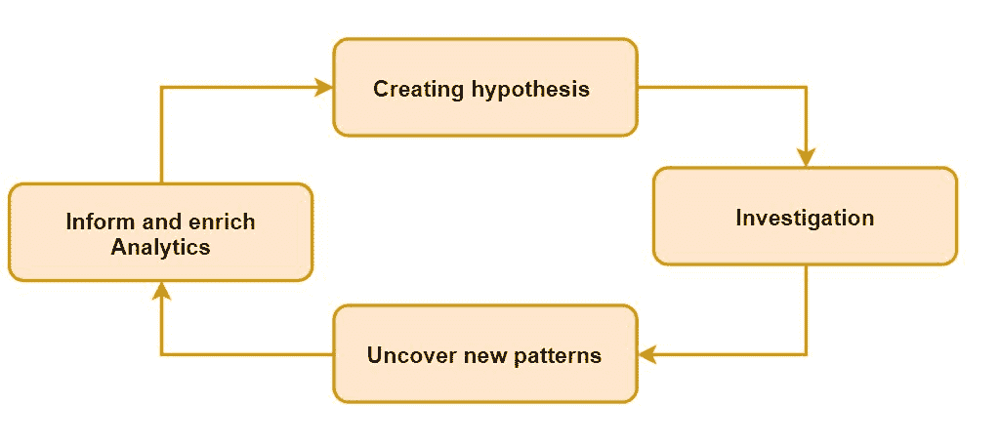
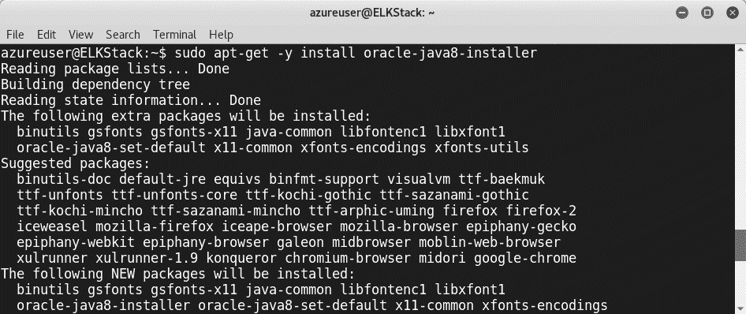
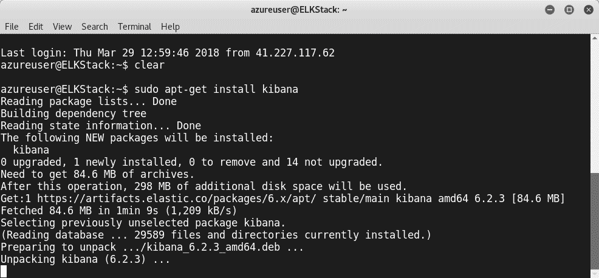
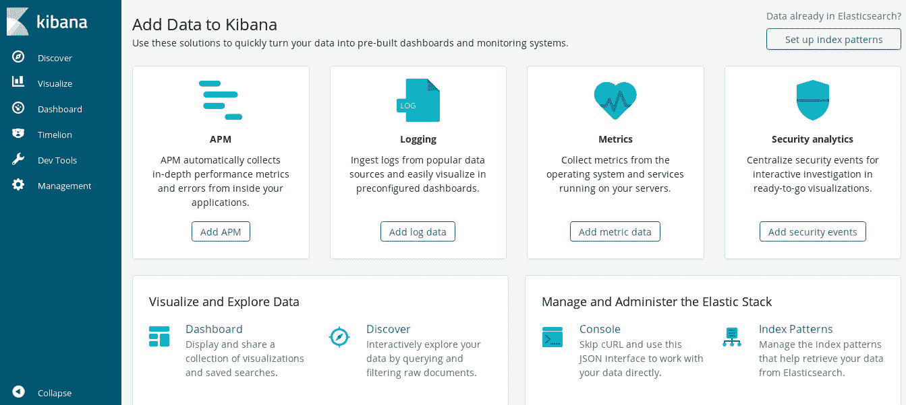
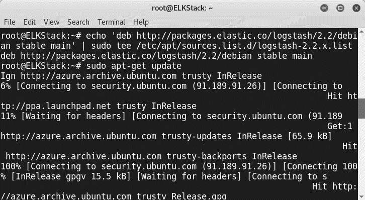
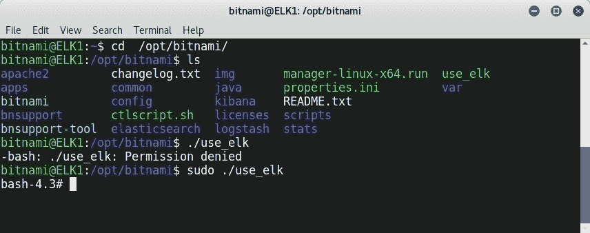
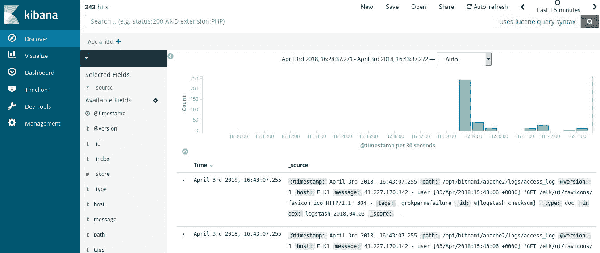
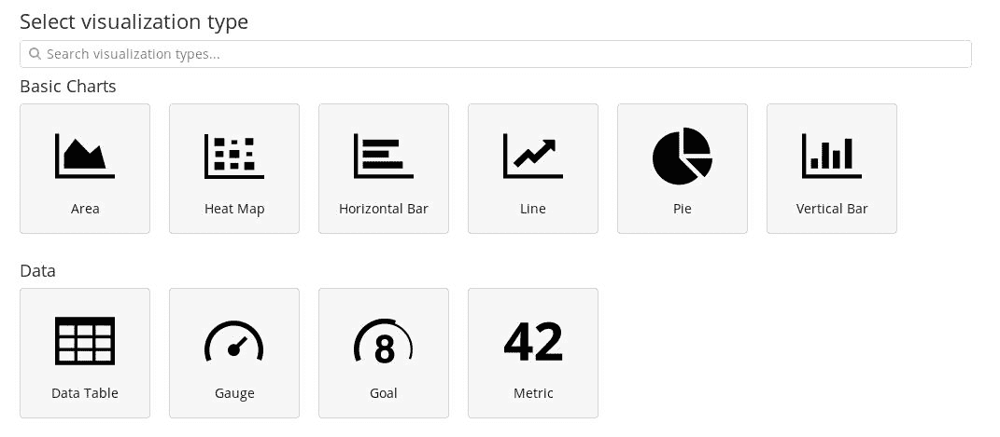

# 检测高级持久性威胁

现代组织每天都面临着网络威胁。黑帽黑客没有任何迹象表明他们将停止。新的黑客技术经常出现。检测**高级持续性威胁**（**APTs**）是一项艰巨的任务，因为这些攻击的目标是长时间不被发现，并窃取数据，而不是造成系统损坏。

根据多份信息安全报告，APT 攻击的数量正在显著增加，目标是国防、制造业和金融业。因此，在许多情况下，经典的保护技术是无用的。部署合适的平台和解决方案可以帮助组织和公司抵御网络攻击，尤其是 APT。

本章将逐步指导您如何构建威胁搜索平台，使用一堆著名的开源项目来保护客户的数据。您将学习如何创建一个机器学习模块来增强您的平台和自动化异常检测，以便您能够关注团队中的其他问题。

在本章中，我们将介绍：

*   高级威胁景观
*   威胁搜寻方法
*   狩猎成熟度模型
*   网络杀人链
*   入侵检测的钻石模型
*   使用机器学习的威胁狩猎，具有**Elasticsearch**、**Logstash**和**Kibana**（**麋鹿**堆栈

# 技术要求

在本章中，我们将使用与前几章相同的 Python 库。建议您具备以下条件：

*   4 GB 内存
*   2 GB CPU

# 威胁和风险分析

威胁是对组织资产的潜在危险。根据**欧盟网络和信息安全署**（**ENISA**）2017 年威胁形势报告，现代组织面临数百万网络威胁，包括：恶意软件、网络攻击、钓鱼、勒索软件、僵尸网络等。对于安全专业人员，尤其是风险管理人员来说，威胁在分析风险时扮演着巨大的角色。风险是威胁和漏洞的组合，在数学上可以表示为*风险=威胁 x 漏洞*。

# 威胁搜寻方法

威胁搜寻是一种搜索、识别和理解 APT 的方法。与任何方法论信息安全任务一样，威胁搜寻与工具和实用程序无关。它是流程、人员和技术的组合。

威胁搜寻包括以下步骤：

*   创造假设
*   使用工具和技术进行调查
*   发现新模式
*   提供信息并丰富分析

以下步骤构成**威胁搜寻循环**：



您可以通过从以下选项中选择一个级别来评估威胁搜寻计划的成熟度：

*   **1 级**：初始（很少或没有数据收集，依靠自动警报）
*   **2 级**：最低（数据收集的高水平）
*   **第 3 级**：程序性（高水平的数据收集，遵循数据分析程序）
*   **第 4 级**：创新（数据收集水平高，遵循新的数据分析程序）
*   **第 5 级**：领导（高水平的数据收集，使成功的数据分析程序自动化）

以下两部分包括威胁搜寻中最重要的术语。

# 网络杀人链

与信息安全的许多方面一样，网络杀戮链是一个受军事启发的模型，用于描述网络攻击中使用的步骤。

网络杀戮链的七个步骤如下：

*   **侦察**：获取邮件地址等信息
*   **武器化**：将漏洞利用和后门耦合到可交付有效载荷，换句话说，使用漏洞利用和后门构建可交付有效载荷

*   **交付**：通过电子邮件或 USB 等不同方式向受害者交付武器包
*   **攻击**：利用漏洞在目标机器上执行代码
*   **安装**：安装恶意软件
*   **指挥与控制（C2）**：用于远程操纵受害者的命令通道
*   **行动与目标**：完成原目标

# 入侵分析的钻石模型

入侵分析的钻石模型是为验证网络威胁而开发的一种方法。每一个事件都可以被描绘成一颗钻石。许多信息安全分析师使用这种认知模型来一致地描述有组织的威胁，并在其演变过程中跟踪它们。

菱形的四个节点如下所示：

*   对手（坏人角色）
*   基础架构（如 IP 地址、域名和电子邮件地址）
*   功能（如恶意软件、漏洞攻击和被盗证书）
*   受害者（如人员和网络资产）

# 用麋鹿群进行威胁狩猎

您现在已经清楚地了解了威胁搜寻中最重要的术语。那么，让我们构建我们的威胁搜寻平台。在以下部分中，我们将学习如何使用开源项目构建威胁搜寻系统。在我们的实践指南中，我们将使用麋鹿堆栈中最有前途的解决方案之一。它包括三个开源项目，是当今下载量最多的日志管理平台之一。

麋鹿堆广泛应用于许多领域，包括：

*   商业智能
*   网站分析
*   信息安全
*   顺从

麋鹿堆由以下组件组成：

*   **Elasticsearch**：用于搜索和分析数据
*   **Logstash**：采集和转换数据
*   **Kibana**：数据可视化

下图显示了麋鹿堆中的主要组件：


因此，根据主要架构，为了构建威胁搜索平台，我们需要：收集日志，分析和搜索合适的数据，并管理我们发现的可视化。让我们看看如何准备麋鹿堆叠环境。

# 弹性搜索

Elasticsearch 是一个惊人的开源项目。它是一个基于 RESTful、分布式和 JSON 的搜索引擎。换句话说，您可以将其视为 NoSQL 搜索服务器。您可以在[看到其官方网站 https://www.elastic.co/](https://www.elastic.co/) ：


如需下载，请点击[https://www.elastic.co/downloads/elasticsearch](https://www.elastic.co/downloads/elasticsearch) ：


选择合适的包装。在我的例子中，我将把它安装在 Ubuntu 14.04 机器上。因此，我将选择`.deb`版本。建议您具备以下条件：

*   4GB 内存
*   2GB CPU

Elasticsearch 是用 Java 编写的。因此，我们需要确保它安装在我们的环境中（如果没有安装，我们应该下载）。将 Java 添加到`apt`中，如下所示：

```
sudo add-apt-repository -y ppa:webupd8team/java 
```

现在将 Java 源代码添加到`list.sources`文件中：


更新`list.sources`文件：


现在，安装 Java`installer`：

```
sudo apt-get -y install oracle-java8-installer
```



然后，配置它：


瞧！我们已经成功安装了它。通过键入`java -version`命令进行检查：


让我们安装 Elasticsearch。按如下方式导入`elasticsearch`公钥：

```
wget -qO - https://packages.elastic.co/GPG-KEY-elasticsearch | sudo
apt-key add -
```


将 Elasticsearch 添加到源列表：

```
echo "deb https://artifacts.elastic.co/packages/6.x/apt stable main" |
sudo tee -a /etc/apt/sources.list.d/elastic-6.x.list
```


使用`apt-get update`和`install elasticsearch`更新源列表：

```
apt-get install elasticsearch
```


要配置 Elasticsearch，请使用文本编辑器编辑`/etc/elasticsearch/elasticsearch.yml`：

```
vi /etc/elasticsearch/elasticsearch.yml
```


配置文件后，重新启动 Elasticsearch 服务：

```
sudo service elasticsearch restart
```

# 基巴纳

在安装和配置 Elasticsearch 之后，是时候安装 Kibana 了，以便在设计良好的仪表板中可视化数据。Kibana 是一个具有不同类型图表的 web 界面。您可以将其视为堆栈的可视化层。

像往常一样，使用`apt-get install`命令安装 Kibana：

```
apt-get install kibana
```

安装它不会花费太长时间：



安装完成后，我们可以通过文本编辑器对`/opt/kibana/config/kibana.yml`配置文件进行修改进行配置：

```
sudo vi /opt/kibana/config/kibana.yml
```

使用以下命令启用 Kibana 服务：

```
sudo update-rc.d kibana defaults 96 9
```


使用以下命令启动服务：

```
sudo service kibana start
```


如果要使用公共 IP 地址从外部访问仪表板，可以使用反向代理。例如，在这种情况下，**Nginx**将非常好。

您可以在`/usr/share/kibana`找到 Kibana 文件夹：


要检查仪表板，请键入`<Address>: 5601`并输入您的凭证：



# 伐木场

在这一点上，我们已经安装了 Elasticsearch 和 Kibana；现在我们需要安装 Logstash 来收集和转换数据。Logstash 管道包含三个组件：

*   输入
*   过滤器
*   输出


让我们将 Logstash 添加到源列表中，然后更新它：

```
echo 'deb http://packages.elastic.co/logstash/2.2/debian stable main' |
sudo tee /etc/apt/sources.list.d/logstash-2.2.x.list
```



安装 Logstash，如下所示：

```
apt-get install logstash
```


安装 Logstash 后，可以编辑其配置文件`<Parent_Directory>/logstash/conf/logstash.conf`。您会注意到，配置文件包含两部分-`input`和`output`：


等待我敢打赌你一定想知道为什么我们只有两个部分，尽管 Logstash 包含三个部分，正如我们之前讨论的那样。你完全正确。我们需要添加一个定制的部分，名为`filters`。Logstash 提供了良好的功能，包括创建个性化过滤器的功能。例如，要创建过滤器，您可以使用以下格式（稍后我们将在指南中使用）：

```
filter {
     grok {
         match => { "message" => "COMBINEDAPACHELOG %{COMMONAPACHELOG} %{QS:referrer} %{QS:agent}" }
     }
     date {
         match => [ "timestamp" , "dd/MMM/yyyy:HH:mm:ss Z" ]
    }
 }
```

`gork`过滤器用于将非结构化日志数据解析为结构化和可查询的内容。根据过滤器插件的官方章节（[https://www.elastic.co/guide/en/logstash/current/plugins-filters-grok.html](https://www.elastic.co/guide/en/logstash/current/plugins-filters-grok.html) ），默认情况下，Logstash 提供超过 120 个模式。

# 使用 X-Pack 插件使用麋鹿堆栈进行机器学习

我们现在已经安装了麋鹿堆栈的三个主要组件。如果您想要一种有效的方法来部署 ELK 堆栈，特别是出于测试目的，我建议您使用基于云的堆栈。例如，在下面的演示中，我将使用 Bitnami 预定义的 cloud ELK 堆栈。

Bitnami ELK Stack 附带以下软件版本：

*   Apache 2.4.29
*   Elasticsearch 6.2.2
*   日志存储 6.2.2
*   基巴纳 6.2.2

过一会儿，您的堆栈就可以使用了。以下屏幕截图显示了麋鹿堆栈文件：


要获取 Bitnami 环境的密码，请转到 Azure 门户中的引导诊断部分，并检查日志文件；您将在文件底部找到密码：


在添加机器学习插件之前，让我们先配置一下麋鹿堆栈。加载 ELK 环境并使用以下命令登录 ELK 服务器：

```
sudo /opt/bitnami/use_elk
```



让我们通过键入`sudo /opt/bitnami/ctlscript.sh stop logstash`停止 Logstash


创建配置文件`/opt/bitnami/logstash/conf/access-log.conf`：

```
input {
     file {
         path => "/opt/bitnami/apache2/logs/access_log"
         start_position => beginning
     }
 }

 filter {
     grok {
         match => { "message" => "COMBINEDAPACHELOG %{COMMONAPACHELOG} %{QS:referrer} %{QS:agent}" }
     }
     date {
         match => [ "timestamp" , "dd/MMM/yyyy:HH:mm:ss Z" ]
    }
 }

 output {
     elasticsearch {
         hosts => [ "127.0.0.1:9200" ]
     }
 }
```


检查`/opt/bitnami/logstash/bin/logstash -f /opt/bitnami/logstash/conf/ --config.test_and_exit`的配置：


按如下方式开始日志存储：

```
sudo /opt/bitnami/ctlscript.sh start logstash
```


检查 Elasticsearch 是否工作正常：


现在，我们去基巴纳。您可能已经注意到，我们还没有索引模式：


配置 Logstash 后，我们可以创建一个新的索引模式：


键入`*`并单击下一步：


选择@timestamp 并单击创建索引模式按钮。现在，您可以在 Kibana 中查看新的索引模式页面：


单击“发现”选项时，可以检查日志：



现在，让我们自定义一个可视化，以便稍后添加到主仪表板。单击侧列表上的“可视化”，然后创建新的可视化：


对于我们的演示，我们将使用竖条。您可以从一系列图表和可视化工具中进行选择：



对于 X 轴，选择日期直方图作为聚合，选择@timestamp 作为字段：


然后，您将看到图表的可视化，如以下屏幕截图所示：


创建可视化之后，让我们添加到仪表板。单击 Dashboard 链接并创建一个新的 Dashboard。然后，添加可视化效果：


保存仪表板。现在，您可以检查任何指示器：


麋鹿堆栈威胁平台可以帮助您捕获大量高级威胁。让我们将我们的项目提升到一个新的高度，并通过使用机器学习的能力来自动化狩猎操作，为其添加智能触感。麋鹿堆栈使您能够向狩猎平台添加一个名为 X-Pack 的插件，这将帮助您检测工件和日志中的异常情况。

要获得 X-Pack 插件，我们需要在堆栈的每一层上安装它，如下图所示：


要在 Elasticsearch 上安装插件，请转到`binaries`文件夹并键入以下命令：

```
./elasticsearch-plugin install x-pack
```

同样的行动也适用于 Kibana：

```
sudo bin/kibana-plugin install x-pack
```

它也适用于日志存储：

```
sudo bin/logstash-plugin install x-pack
```

重新启动所有服务并转到 Kibana 仪表板；您将注意到一个称为机器学习的新选项：


最后，由于 X-Pack，您可以添加时间序列异常检测功能。在上一章中，我们详细讨论了异常检测。我们深入探讨了异常检测的基本原理以及如何使用机器学习来检测这些异常。X-Pack 使用相同的技术来发现异常。


# 总结

在前面的章节中，我们看到了如何使用不同的机器学习算法和 Python 库从头构建异常检测系统。本章包括一个分步指南，帮助您使用三个惊人的开源项目构建一个功能齐全的威胁搜索平台。我们还实现了一个机器学习插件，以优化和增强威胁搜索平台的功能。到目前为止，您已经学会了如何使用机器学习的功能构建许多防御系统。如果你想学习如何绕过机器学习的保护措施，下一章是必读的。

# 问题

1.  以下哪项不是网络杀戮链中的一步？

（a） 扫描
（b）控制和命令
（c）发现和传播

2.  以下哪个选项不是入侵分析菱形模型的节点？

（a） 受害者
（b）基础设施
（c）程序

3.  一个 Logstash 配置文件需要多少部件？

（a） 2
（b）3
（c）4

4.  在 ElasticSearch 中，什么是索引？

（a） 将数据存储在索引
中的过程（b）识别数据
的过程（c）上述任何一项

5.  在 Elasticsearch 中，什么是节点？

（a） Elasticsearch 模块
（b）Elasticsearch
的实例（c）上述任何一项

6.  在 Elasticsearch 中，什么是碎片？

（a） 共享文件
（b）共享数据
（c）共享资源（RAM、vCPU 等）

7.  Elasticsearch 是否有模式？（是|否）