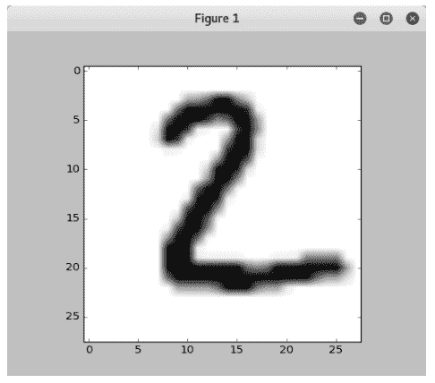
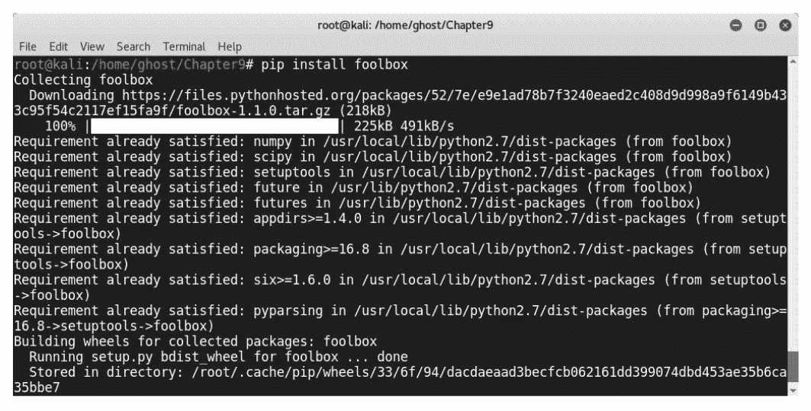
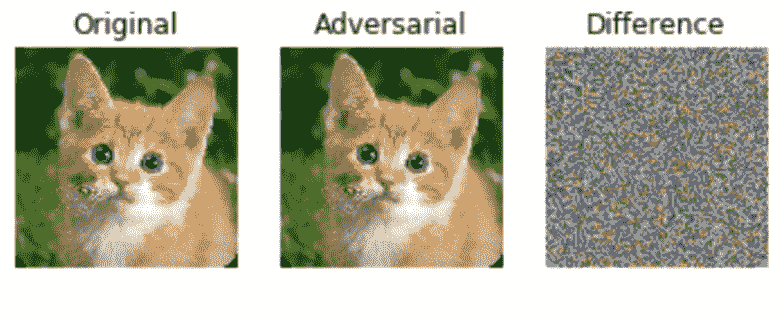
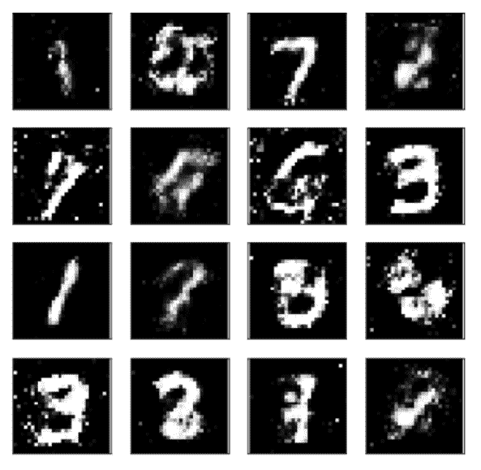

# 绕过机器学习恶意软件检测器

在上一章中，您了解到可以通过使用对抗性机器学习技术，闯入机器学习模型并使其执行恶意活动。在这一章中，我们将探讨进一步的技术，比如如何愚弄人工神经网络和深度学习网络。我们将把反恶意软件系统规避作为一个案例研究。

在本章中，我们将介绍以下内容：

*   对抗式深度学习
*   如何通过生成性对抗网络绕过下一代恶意软件检测器
*   用强化学习绕过机器学习

# 技术要求

您可以在[找到本章的代码文件 https://github.com/PacktPublishing/Mastering-Machine-Learning-for-Penetration-Testing/tree/master/Chapter09](https://github.com/PacktPublishing/Mastering-Machine-Learning-for-Penetration-Testing/tree/master/Chapter09) 。

# 对抗式深度学习

信息安全专业人员正在尽最大努力想出新的技术来检测恶意软件和恶意软件。趋势技术之一是利用机器学习算法的力量来检测恶意软件。另一方面，攻击者和网络罪犯也提出了绕过下一代系统的新方法。在前一章中，我们研究了如何攻击机器学习模型以及如何绕过入侵检测系统。

恶意软件开发人员使用许多技术绕过机器学习恶意软件检测器。之前，我们探索了一种通过使用灰度图像向量训练系统来构建恶意软件分类器的方法。在 UCSB 视觉研究实验室的**搜索和检索恶意软件**（**SARVAM**研究单位）进行的演示中，研究人员说明，通过改变几个字节，模型可以将恶意软件归类为好软件。攻击者可以通过改变几个字节和像素来绕过恶意软件分类器。在演示中，研究人员使用了 NETSTAT 程序的一种变体，这是一种显示网络连接的命令行网络实用工具。在下图中，左侧是`NETSTAT.EXE`恶意软件的代表，第二个被检测为恶意软件。如您所见，在将两种类型的文件转换为灰度图像并检查它们之间的差异后，两个程序之间的差异不明显（36864 字节中的 88 字节：0.78%）：


这项技术只是开始；在本章中，我们将深入探讨如何欺骗他们（机器学习模型，在我们的例子中是恶意软件分类器）执行恶意活动。

前一章是对抗式机器学习的概述。我们了解了攻击者如何绕过机器学习。在本章中，我们将更深入地了解如何绕过基于机器学习的恶意软件检测器；在此之前，我们将学习如何愚弄人工神经网络，避免使用 Python、开源库和开源项目进行深入学习。神经网络可以被**敌对样本**欺骗。对抗性样本用作神经网络的输入，以影响学习结果。伊恩·J·古德费罗、乔纳森·什伦斯和克里斯蒂安·塞格迪（在谷歌）主持了一个名为*解释和利用敌对网络*的开创性研究项目，研究表明，少量精心构造的噪声可以欺骗神经网络，使其认为输入的图像是长臂猿图像而不是熊猫图像，置信度为 99.3%。神经网络最初认为提供的图像是一只熊猫，置信度为 57.7%，这是真的；但第二个例子中的情况并非如此，在愚弄了网络之后：


许多电子设备和系统依赖深度学习作为保护机制，包括人脸识别；想象一下攻击者可以做些什么来攻击它们，并获得对关键系统的未经授权访问。

现在，让我们试着愚弄一个神经网络。我们将使用著名的 MNIST 数据集愚弄手写数字检测系统。在[第 4 章](04.html#2D7TI0-49a67f1d6e7843d3b2296f38e3fe05f5)*恶意软件检测与深度学习*中，我们学习了如何构建一个。为了演示，我们将愚弄迈克尔·尼尔森（Michael Nielsen）的预训练神经网络。他使用了 50000 张训练图像和 10000 张测试图像。或者，你可以简单地使用你自己的神经网络。您可以在本章的 GitHub 存储库中找到培训信息。文件名为`trained_network.pkl`；您还可以找到 MNIST 文件（`mnist.pkl.gz`：

```py
import network.network as network
import network.mnist_loader as mnist_loader
# To serialize data
import pickle
import matplotlib.pyplot as plt
import numpy as np
```

让我们检查一下这个模型是否训练有素。加载`pickle`文件。用`pickle.load()`加载数据，识别培训、验证和测试数据：

```py
Model = pickle.load( open( "trained_network.pkl", "rb" ) )    trainData, valData, testData =mnist_loader.load_data_wrapper()
```

例如，要检查数字 2，我们将选择`test_data[1][0]`：

```py
>>> data = test_data[1][0]
>>> activations = Model.feedforward(data)
>>> prediction = np.argmax(activations) 
```

以下屏幕截图说明了前面的代码：


使用`matplotlib.pyplot (plt)`绘制结果以进一步检查：

```py
>>> plt.imshow(data.reshape((28,28)), cmap='Greys')
>>> plt.show()
```

如您所见，我们生成了数字**2**，因此模型得到了很好的训练：



一切都设置正确。现在，我们将用两种类型的攻击来攻击神经网络：**目标**和**非目标。**

对于非目标攻击，我们将生成一个对抗性样本，并使网络给出一定的输出，例如，*6*：


在这次攻击中，我们希望神经网络认为输入的图像是*6*。目标图像（我们称之为*X】*是一个*784*维向量，因为图像维是*28×28*像素。我们的目标是找到一个向量`*⃗x*`，该向量将成本*C 降至最低，*生成一个神经网络预测的图像，作为我们的目标标签。成本函数*C*定义如下：


以下代码块是导数函数的实现：

```py
def input_derivative(net, x, y):
    """ Calculate derivatives wrt the inputs"""
    nabla_b = [np.zeros(b.shape) for b in net.biases]
    nabla_w = [np.zeros(w.shape) for w in net.weights]

    # feedforward
    activation = x
    activations = [x] # list to store all the activations, layer by layer
    zs = [] # list to store all the z vectors, layer by layer
    for b, w in zip(net.biases, net.weights):
        z = np.dot(w, activation)+b
        zs.append(z)
        activation = sigmoid(z)
        activations.append(activation)

    # backward pass
    delta = net.cost_derivative(activations[-1], y) * \
        sigmoid_prime(zs[-1])
    nabla_b[-1] = delta
    nabla_w[-1] = np.dot(delta, activations[-2].transpose())

    for l in xrange(2, net.num_layers):
        z = zs[-l]
        sp = sigmoid_prime(z)
        delta = np.dot(net.weights[-l+1].transpose(), delta) * sp
        nabla_b[-l] = delta
        nabla_w[-l] = np.dot(delta, activations[-l-1].transpose())
    return net.weights[0].T.dot(delta)
```

要生成对抗性样本，我们需要设定目标：

```py
goal = np.zeros((10, 1))
goal[n] = 1
```

创建用于渐变下降初始化的随机图像，如下所示：

```py
x = np.random.normal(.5, .3, (784, 1))
```

计算梯度下降，如下所示：

```py
for i in range(steps):
        # Calculate the derivative
        d = input_derivative(net,x,goal)       
        x -= eta * d       
    return x

```

现在，您可以生成示例：

```py
a = adversarial(net, n, 1000, 1)
x = np.round(net.feedforward(a), 2)
Print ("The input is:", str(x))
Print ("The prediction is", str(np.argmax(x)))
```

绘制对抗性样本，如下所示：

```py
plt.imshow(a.reshape(28,28), cmap='Greys')
plt.show()
```


在目标攻击中，我们使用相同的技术和相同的代码，但在代价函数中添加了一个新术语。因此，情况如下：


# 傻瓜箱

傻瓜箱是一个 Python 工具箱，用于测试机器学习模型的健壮性。它受到许多框架的支持，包括：

*   张量流
*   皮托克
*   西雅娜
*   凯拉斯
*   千层面
*   MXNet

要安装傻瓜箱，请使用`pip`实用程序：

```py
pip install foolbox
```



以下是一些傻瓜箱攻击：

*   **基于梯度的攻击**：通过将输入*x*周围的损失线性化
*   **梯度符号攻击（FGSM）**：通过计算梯度*g（x0）*一次，然后寻找最小步长
*   **迭代梯度攻击**：通过沿梯度方向的小步最大化损失，*g（x）*
*   **迭代梯度符号攻击**：通过沿上升方向上的小台阶最大化损失，*符号（g（x））*
*   **深度傻瓜 L2Attack**：通过计算每个等级的最小距离*d(ℓ, ℓ0）*，达到类边界所需的时间
*   **深渊∞攻击**：类似 L2 攻击，但最小化*L∞-取而代之的是 norm*
*   **基于雅可比矩阵的显著性图攻击**：通过计算每个输入特征的显著性得分
*   **单像素攻击**：通过将单像素设置为白色或黑色

要使用傻瓜箱实施攻击，请使用以下命令：

```py
import foolbox
import keras
import numpy as np
from keras.applications.resnet50 import ResNet50

keras.backend.set_learning_phase(0)
kmodel = ResNet50(weights='imagenet')
preprocessing = (np.array([104, 116, 123]), 1)
fmodel = foolbox.models.KerasModel(kmodel, bounds=(0, 255), preprocessing=preprocessing)

image, label = foolbox.utils.imagenet_example()
attack = foolbox.attacks.FGSM(fmodel)
adversarial = attack(image[:, :, ::-1], label)
```

如果您收到错误`ImportError('`load_weights` requires h5py.')`，请通过安装**h5py**库（`pip install h5py`来解决。

要绘制结果，请使用以下代码：

```py
import matplotlib.pyplot as plt
plt.figure()
plt.subplot(1, 3, 1)
plt.title('Original')
plt.imshow(image / 255) 
plt.axis('off')
plt.subplot(1, 3, 2)
plt.title('Adversarial')
plt.imshow(adversarial[:, :, ::-1] / 255)  # ::-1 to convert BGR to RGB
plt.axis('off')
plt.subplot(1, 3, 3)
plt.title('Difference')
difference = adversarial[:, :, ::-1] - image
plt.imshow(difference / abs(difference).max() * 0.2 + 0.5)
plt.axis('off')
plt.show()
```



# 深加工

Deep pwning 是一个轻量级的机器学习模型实验框架，目的是评估机器学习模型对有动机的对手的鲁棒性。它被称为机器学习的**元语言**。您可以从位于[的 GitHub 存储库中克隆它 https://github.com/cchio/deep-pwning](https://github.com/cchio/deep-pwning) 。

不要忘记安装所有要求：

```py
pip install -r requirements.txt 
```

以下是使用深度 pwning 所需的 Python 库：

*   Tensorflow 0.8.0
*   Matplotlib>=1.5.1
*   Numpy>=1.11.1
*   熊猫>=0.18.1
*   六个>=1.10.0

# 逃避

规避 ml（[https://evademl.org](https://evademl.org/) 是一个基于遗传编程的进化框架，用于自动查找逃避基于机器学习的恶意软件分类器检测的变体。它是由弗吉尼亚大学的机器学习小组和安全研究小组开发的。

若要下载，请从[克隆它 https://github.com/uvasrg/EvadeML](https://github.com/uvasrg/EvadeML) 。

要安装 EquiveML，您需要安装以下必需的工具：

*   用于解析 PDF 的 pdfrw 的修改版本：[https://github.com/mzweilin/pdfrw](https://github.com/mzweilin/pdfrw)
*   布谷鸟沙盒 v1.2，作为甲骨文：[https://github.com/cuckoosandbox/cuckoo/releases/tag/1.2](https://github.com/cuckoosandbox/cuckoo/releases/tag/1.2)
*   目标分类器 PDFrate Mimicus:[https://github.com/srndic/mimicus](https://github.com/srndic/mimicus)
*   目标分类器 Hidost:[https://github.com/srndic/hidost](https://github.com/srndic/hidost)

要配置项目，请复制模板，然后使用编辑器进行配置：

```py
cp project.conf.template project.conf
Vi  project.conf
```

在运行主程序`./gp.py`之前，使用预定义的恶意软件签名运行集中式检测代理，如文档所示：

```py
./utils/detection_agent_server.py ./utils/36vms_sigs.pickle
```

选择几个良性 PDF 文件：

```py
./utils/generate_ext_genome.py [classifier_name] [benign_sample_folder] [file_number]
```

要添加一个要回避的新分类器，只需在`./classifiers/`中添加一个包装器。

# 通过生成性对抗网络绕过下一代恶意软件检测器

2014 年，伊恩·古德费罗（Ian Goodfello）、约书亚·本吉奥（Yoshua Bengio）和他们的团队提出了一个名为**生成性对抗网络（GAN）**的框架。生成性对抗网络能够从随机噪声中生成图像。例如，我们可以训练生成网络从 MNIST 数据集中生成手写数字的图像。

生成性对抗网络由两个主要部分组成：一个**发生器**和一个**鉴别器**。

# 发电机

发生器将潜在样本作为输入；它们是随机生成的数字，并经过训练生成图像：


例如，要生成手写数字，生成器将是一个完全连接的网络，它采集潜在样本并生成`784`数据点，将其重塑为*28x28*像素图像（MNIST 数字）。强烈建议使用`tanh`作为激活功能：

```py
generator = Sequential([
Dense(128, input_shape=(100,)),
LeakyReLU(alpha=0.01),
Dense(784),
Activation('tanh')
], name='generator')
```

# 鉴别器

鉴别器只是一个用监督学习技术训练的分类器，用于检查图像是真实的（`1`）还是虚假的（`0`）。它由 MNIST 数据集和生成器样本进行训练。鉴别器将 MNIST 数据分类为真实数据，生成器样本分类为虚假数据：

```py
discriminator = Sequential([
Dense(128, input_shape=(784,)),
LeakyReLU(alpha=0.01),
Dense(1),
Activation('sigmoid')], name='discriminator')
```

通过连接发生器和鉴别器这两个网络，我们产生了一个生成性对抗网络：

```py
gan = Sequential([
generator,
discriminator])
```

这是生成性对抗网络的高级表示：


为了训练 GAN，我们需要训练发生器（在后续步骤中将鉴别器设置为不可训练）；在训练中，反向传播更新生成器的权重以生成真实图像。因此，为了训练 GAN，我们使用以下步骤作为循环：

*   用真实图像训练鉴别器（鉴别器可在此训练）
*   将鉴别器设置为不可训练
*   训练发电机

训练循环将发生，直到两个网络都无法进一步改进。

要使用 Python 构建 GAN，请使用以下代码：

```py
import pickle as pkl
import numpy as np
import tensorflow as tf
import matplotlib.pyplot as plt
batch_size = 100
epochs = 100
samples = []
losses = []
saver = tf.train.Saver(var_list=g_vars)
with tf.Session() as sess:
    sess.run(tf.global_variables_initializer())
    for e in range(epochs):
        for ii in range(mnist.train.num_examples//batch_size):
            batch = mnist.train.next_batch(batch_size)

            batch_images = batch[0].reshape((batch_size, 784))
            batch_images = batch_images*2 - 1

            batch_z = np.random.uniform(-1, 1, size=(batch_size, z_size))

            _ = sess.run(d_train_opt, feed_dict={input_real: batch_images, input_z: batch_z})
            _ = sess.run(g_train_opt, feed_dict={input_z: batch_z})

        train_loss_d = sess.run(d_loss, {input_z: batch_z, input_real: batch_images})
        train_loss_g = g_loss.eval({input_z: batch_z})

        print("Epoch {}/{}...".format(e+1, epochs),
              "Discriminator Loss: {:.4f}...".format(train_loss_d),
              "Generator Loss: {:.4f}".format(train_loss_g))    

        losses.append((train_loss_d, train_loss_g))

        sample_z = np.random.uniform(-1, 1, size=(16, z_size))
        gen_samples = sess.run(
                       generator(input_z, input_size, n_units=g_hidden_size, reuse=True, alpha=alpha),
                       feed_dict={input_z: sample_z})
        samples.append(gen_samples)
        saver.save(sess, './checkpoints/generator.ckpt')
with open('train_samples.pkl', 'wb') as f:
    pkl.dump(samples, f)
```



要使用 Python 构建 GAN，我们将使用 NumPy 和 TensorFlow。

# 马尔根

为了生成恶意软件样本来攻击机器学习模型，攻击者现在正在使用 GANs 来实现其目标。使用我们之前讨论过的相同技术（生成器和鉴别器），网络罪犯对下一代反恶意软件系统进行攻击，即使不知道所使用的机器学习技术（黑匣子攻击）。其中一种技术是 MalGAN，它是由机器感知（MOE）重点实验室和机器智能部的 Hu Weiwei 和 Ying Tan 进行的一项研究项目*中提出的，该项目名为*生成基于 GAN 的黑盒攻击的对抗性恶意软件示例。MalGAN 的架构如下所示：


生成器通过将恶意软件（特征向量*m*和噪声向量*z】*作为输入来创建对抗性恶意软件样本。替代检测器是一个多层前馈神经网络，它以程序特征向量*X、*作为输入。它将程序分为良性程序和恶意程序。

为了训练生成性对抗网络，研究人员使用了以下算法：

```py
While not converging do:
    Sample a minibatch of Malware M
    Generate adversarial samples M' from the generator
    Sample a minibatch of Goodware B
    Label M' and B using the detector
    Update the weight of the detector
    Update the generator weights
End while
```

生成的许多示例可能不是有效的 PE 文件。为了保留突变和格式，系统需要一个沙箱来确保功能得到保留。

生成性对抗性网络训练不能简单地产生巨大的效果；这就是为什么需要许多黑客来获得更好的结果。Soumith Chintala、Emily Denton、Martin Arjovsky 和 Michael Mathieu 引入了一些技巧，以获得更好的结果：

*   对*-1*和*1*之间的图像进行归一化
*   使用最大对数*D*作为损失函数，优化*G*而不是最小（*对数 1-D*）
*   从高斯分布而不是均匀分布进行采样
*   构建不同的真假小批量
*   避免使用 ReLU 和 MaxPool，而是使用 LeakyReLU 和 Average 池
*   如有可能，使用**深卷积 GAN**（**DCGAN**）
*   使用`ADAM`优化器

# 用强化学习绕过机器学习

在前面的技术中，我们注意到如果我们生成对抗性样本，特别是如果结果是二进制文件，我们将面临一些问题，包括生成无效样本。信息安全研究人员提出了一种新技术，通过强化学习绕过机器学习反恶意软件系统。

# 强化学习

之前（特别是在第一章中），我们探讨了不同的机器学习模型：有监督、半监督、无监督和强化模型。强化机器学习模型是构建智能机器的重要方法。在强化学习中，agent 通过与环境交互，通过经验进行学习；它根据状态和奖励函数选择最佳决策：


强化学习的一个著名例子是基于 AI 的 Atari 突破。在这种情况下，环境包括以下内容：

*   球和砖
*   移动桨（左或右）
*   清除砖块的奖励

下图展示了用于教授模型如何玩 Atari Breakout 的强化模型的概述：


以 Atari Breakout 环境为例，学习如何避免反恶意软件系统，我们的环境如下：


对于代理，它采用环境状态（常规文件信息、标题信息、导入和导出的函数、字符串等）来优化其性能和来自防病毒报告的奖励输入，以及结果操作（创建入口点和新节、修改节等）。换句话说，执行和学习代理需要两种输入（状态和奖励）。

作为我们讨论的概念的一个实现，信息安全专业人员在 OpenAI 环境中工作，构建一个可以使用强化学习技术逃避检测的恶意软件。其中一个环境是**健身房恶意软件**。这一伟大的环境是在游戏结束时形成的。

OpenAI gym 包含一个开源 Python 框架，由一家名为 OpenAI（[的非盈利 AI 研究公司开发 https://openai.com/](https://openai.com/) 开发和评估强化学习算法。要安装 OpenAI Gym，请使用以下代码（您需要安装 Python 3.5+）：

```py
git clone https://github.com/openai/gym
cd gym
pip install -e
```

OpenAI Gym 加载了预先制作的环境。您可以在[查看所有可用的环境 http://gym.openai.com/envs/](http://gym.openai.com/envs/) ：


要使用 Python 运行环境，可以使用以下代码；在这个片段中，我选择了`CartPole-v0`环境：

```py
import gym
 env = gym.make('CartPole-v0')
 env.reset()
 for _ in range(1000): # run for 1000 steps
    env.render()
    action = env.action_space.sampe() # pick a random action
    env.step(action) # take action
```

要使用 Gym 恶意软件环境，您需要安装 Python 3.6 和一个名为 Instrument Executive Formats 的库，该库的名称恰当地命名为`LIEF`。您可以通过键入以下内容来添加：

```py
pip install https://github.com/lief-project/LIEF/releases/download/0.7.0/linux_lief-0.7.0_py3.6.tar.gz
```

从[下载健身房恶意软件 https://github.com/endgameinc/gym-malware](https://github.com/endgameinc/gym-malware) 。[将已安装的 Gym 恶意软件环境移动到`gym_malware/gym_malware/envs/utils/samples/`。](https://github.com/endgameinc/gym-malware)

要检查样本是否位于正确的目录中，请键入以下内容：

```py
python test_agent_chainer.py
```

此环境中可用的操作如下所示：

*   `append_zero`
*   `append_random_ascii`
*   `append_random_bytes`
*   `remove_signature`
*   `upx_pack`
*   `upx_unpack`
*   `change_section_names_from_list`
*   `change_section_names_to random`
*   `modify_export`
*   `remove_debug`
*   `break_optional_header_checksum`

# 总结

在本章中，我们继续学习如何绕过机器学习模型。在上一章中，我们发现了对抗式机器学习；在本续篇中，我们探讨了对抗性深度学习以及如何愚弄深度学习网络。我们查看了一些真实案例，以了解如何使用最先进的技术逃离反恶意软件系统。在下一章和最后一章中，我们将获得更多的知识，学习如何构建健壮的模型。

# 问题

1.  生成性对抗网络的组成部分是什么？
2.  发生器和鉴别器之间的区别是什么？
3.  当我们生成恶意软件对抗性样本时，如何确保它们仍然有效？
4.  做一点研究，然后简要说明如何检测对抗性样本。
5.  强化学习与深度学习的区别是什么？
6.  监督学习和强化学习有什么区别？
7.  代理如何在强化学习中学习？

# 进一步阅读

以下资源包含大量信息：

*   *解释和利用对抗性样本*：[https://arxiv.org/pdf/1412.6572.pdf](https://arxiv.org/pdf/1412.6572.pdf)
*   *深入研究可转移的对抗性示例和黑盒攻击*：[https://arxiv.org/pdf/1611.02770.pdf](https://arxiv.org/pdf/1611.02770.pdf)
*   *傻瓜箱-一个 Python 工具箱，用于测试机器学习模型的健壮性*：[https://arxiv.org/pdf/1707.04131.pdf](https://arxiv.org/pdf/1707.04131.pdf)
*   *傻瓜箱*GitHub:[https://github.com/bethgelab/foolbox](https://github.com/bethgelab/foolbox)
*   *基于 GAN*：[生成针对黑盒攻击的对抗性恶意软件示例 https://arxiv.org/pdf/1702.05983.pdf](https://arxiv.org/pdf/1702.05983.pdf)
*   *恶意软件图像：可视化和自动分类*：[https://arxiv.org/pdf/1702.05983.pdf](https://arxiv.org/pdf/1702.05983.pdf)
*   *SARVAM:搜索和检索恶意软件*：[http://vision.ece.ucsb.edu/sites/vision.ece.ucsb.edu/files/publications/2013_sarvam_ngmad_0.pdf](http://vision.ece.ucsb.edu/sites/vision.ece.ucsb.edu/files/publications/2013_sarvam_ngmad_0.pdf)
*   *SigMal：基于静态信号处理的恶意软件分类*：[http://vision.ece.ucsb.edu/publications/view_abstract.cgi?416](http://vision.ece.ucsb.edu/publications/view_abstract.cgi?416)