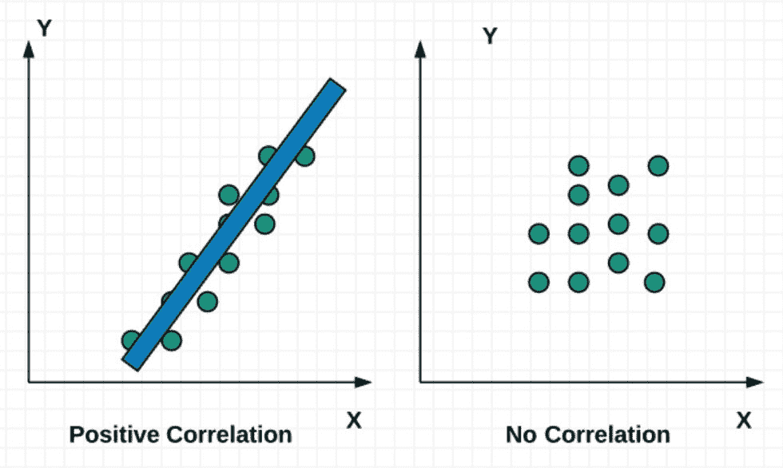
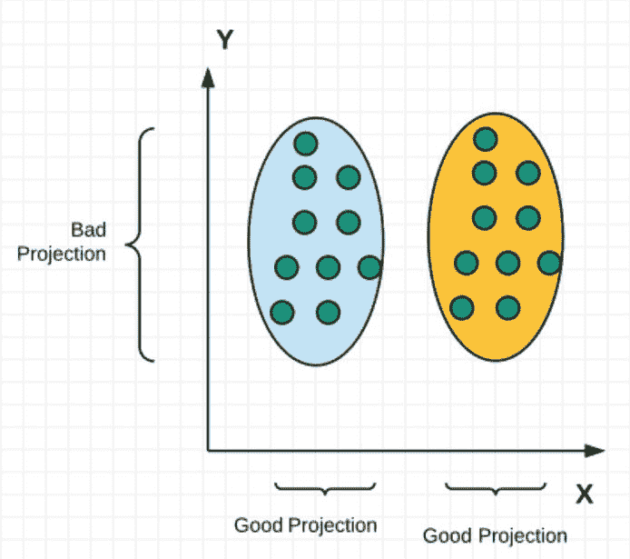
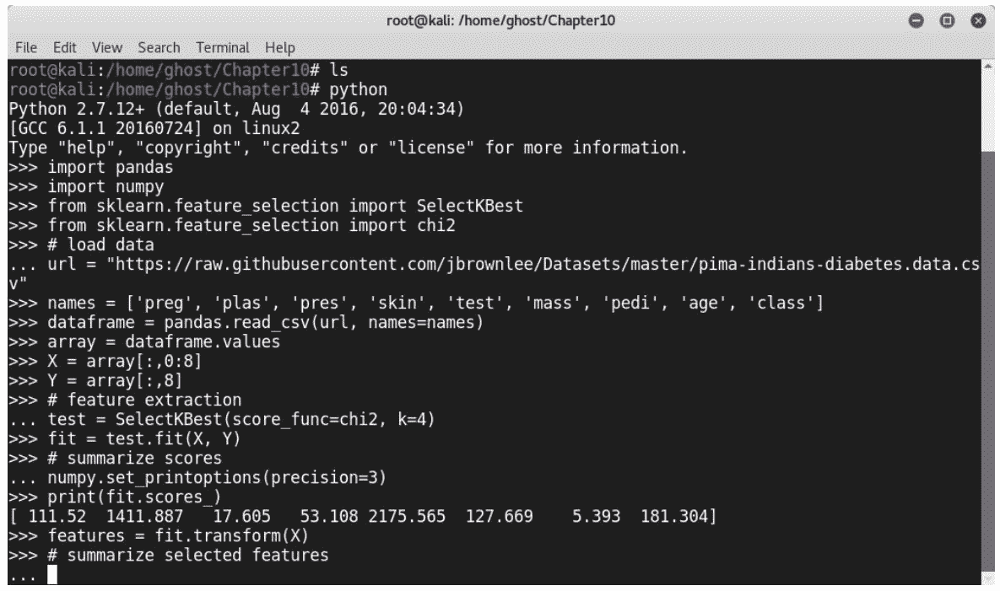
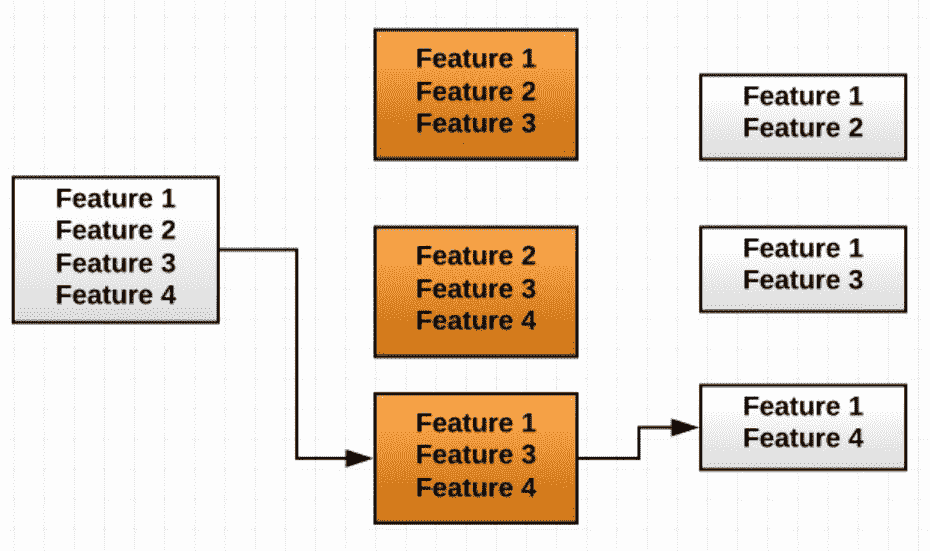
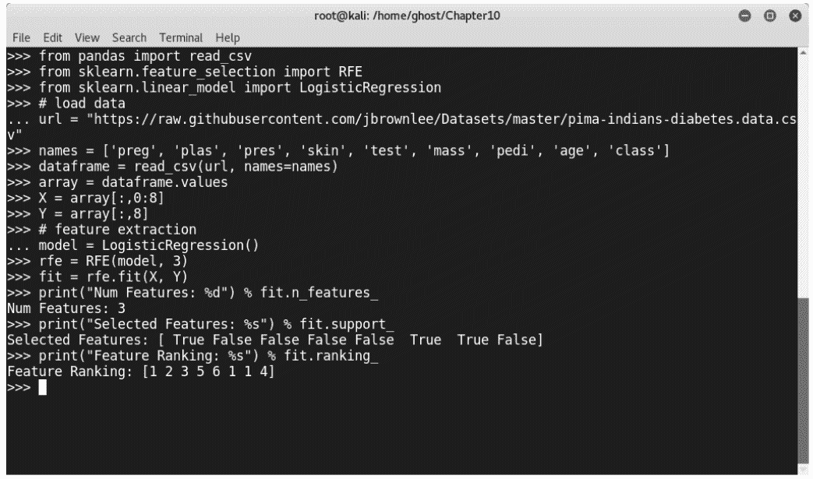
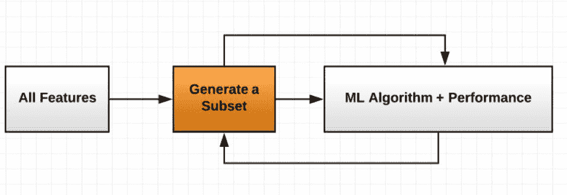
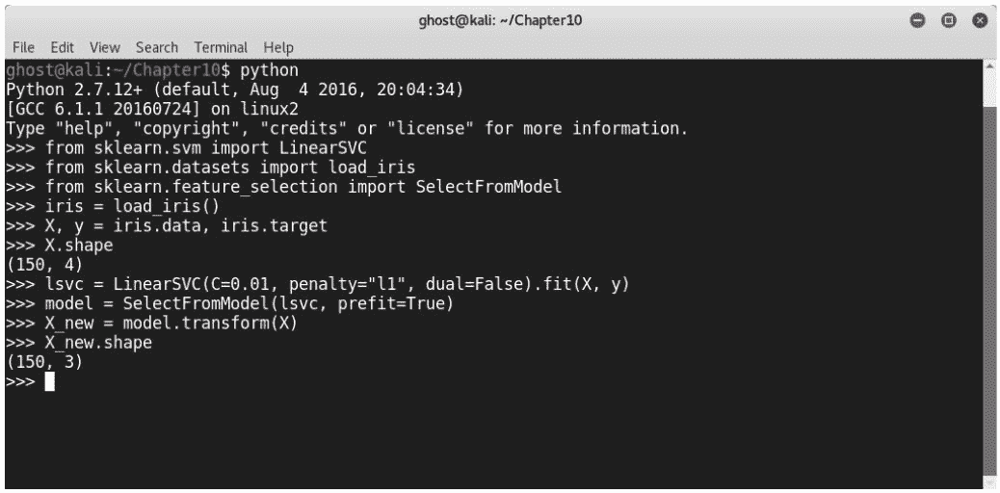
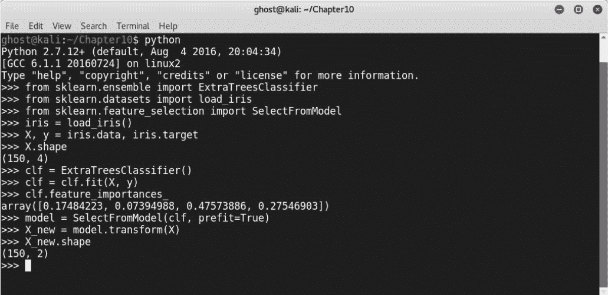

# 机器学习和特征工程的最佳实践

在前面的章节中，我们学习了机器学习的基础知识，并且学习了如何通过使用一套惊人的开放源码 Python 库来构建许多不同的 Python 项目。此外，我们还深入研究了如何打破机器学习模型。

最后一章将通过说明项目不同方面的许多技巧和最佳实践，帮助您构建更好的模型。

在本章中，我们将介绍以下内容：

*   机器学习中特征工程的深入概述
*   机器学习的最佳实践

# 技术要求

您可以在[找到本章的代码文件 https://github.com/PacktPublishing/Mastering-Machine-Learning-for-Penetration-Testing/tree/master/Chapter10](https://github.com/PacktPublishing/Mastering-Machine-Learning-for-Penetration-Testing/tree/master/Chapter10) 。

# 机器学习中的特征工程

通过构建和开发本书中的所有项目和原型，您肯定已经注意到功能工程和功能选择对于每个现代数据科学产品都是必不可少的，尤其是基于机器学习的项目。根据研究，建立模型所花费的时间中有 50%以上用于清洁、处理和选择训练模型所需的数据。设计、表示和选择功能是您的责任。

大多数机器学习算法无法处理原始数据。他们不够聪明，不能这样做。因此，需要特征工程，将原始状态的数据转换为算法可以理解和使用的数据。Andrew Ng 教授曾说过：

“提出功能是困难的、耗时的，需要专家知识。“应用机器学习”基本上是功能工程。”

根据跨行业数据挖掘标准流程，特征工程是数据准备阶段的一个流程：


术语**特征工程**本身不是一个正式定义的术语。它将设计功能以构建智能系统的所有任务组合在一起。它在系统中起着重要作用。如果你查看数据科学竞赛，我敢打赌你已经注意到竞争对手都使用相同的算法，但获胜者表现最好的特征工程。如果您想提高自己的数据科学和机器学习技能，我强烈建议您访问[www.kaggle.com](http://www.kaggle.com)进行竞争：


在搜索机器学习资源时，您将面临许多不同的术语。为了避免混淆，我们需要区分特征选择和特征工程。特征工程将原始数据转换为合适的特征，而特征选择则从工程数据中提取必要的特征。特征工程是选择所有特征的子集，不包括冗余或不相关的特征。

# 特征选择算法

为了使算法能够更快地训练，减少模型的复杂性和过度拟合，除了提高其准确性之外，还可以使用许多特征选择算法和技术。我们将研究三种不同的特征选择方法：过滤方法、包装方法和嵌入方法。让我们讨论各种方法和技术。

# 过滤方法

在过滤方法中，每个特征将被分配一个分数，由不同的统计度量计算。换句话说，这些方法通过考虑特征和目标之间的关系来对特征进行排序。过滤方法通常用于预处理阶段：


# 皮尔逊相关

皮尔逊相关性是一种统计方法，用于测量两个变量`x`和`y`之间的线性相关性。介于`+1`和`-1`之间；`+1`表示存在正相关性。你需要知道`x`和`y`应该是连续变量。皮尔逊相关系数的公式如下：


*Cov*是**协方差，**和`dx`以及`dy`是`x`和`y`的标准差：



要使用 Python 计算此值，可以使用`scipy`库中的`scipy.stats.pearsonr(x, y)`。

# 线性判别分析

在前面的章节中，特别是在[第 1 章](01.html#K0RQ0-49a67f1d6e7843d3b2296f38e3fe05f5)、*笔试机器学习导论*中，我们看到了**主成分分析**（**PCA**的统计过程。**线性判别分析**（**LDA**）也是一种降维技术。它用于查找分隔类的特征的线性组合：



要将 LDA 与 scikit 学习一起使用，请使用以下行导入它：

```
from sklearn.discriminant_analysis import LinearDiscriminantAnalysis as LDA
```

按如下方式使用：

```
sklearn_lda = LDA(n_components=2)
 X_lda_sklearn = sklearn_lda.fit_transform(X, y)
```

# 方差分析

**方差分析**（**方差分析**）与 LDA 类似，但它使用分类特征，通过分析不同类别之间的差异来检查不同类别的均值是否相等。

# 卡方

**卡方**用于确定子集数据是否与总体匹配。这些值应该是分类的。换句话说，卡方检验用于检查不同类别或类别之间的相关性和关联。

卡方检验的公式如下：


以下是一个使用 scikit learn 的卡方检验示例，由 Jason Brownlee 博士提供：

```
import pandas
import numpy
from sklearn.feature_selection import SelectKBest
from sklearn.feature_selection import chi2
# load data
url = "https://raw.githubusercontent.com/jbrownlee/Datasets/master/pima-indians-diabetes.data.csv"
names = ['preg', 'plas', 'pres', 'skin', 'test', 'mass', 'pedi', 'age', 'class']
dataframe = pandas.read_csv(url, names=names)
array = dataframe.values
X = array[:,0:8]
Y = array[:,8]
# feature extraction
test = SelectKBest(score_func=chi2, k=4)
fit = test.fit(X, Y)
# summarize scores
numpy.set_printoptions(precision=3)
print(fit.scores_)
features = fit.transform(X)
# summarize selected features
print(features[0:5,:]) 
```

下图说明了前面的代码：



# 包装方法

包装方法通过获取子集和训练学习算法来实现。根据培训结果，我们可以为模型选择最佳功能。而且，正如您可能已经猜到的，这些方法在计算上非常昂贵：


有许多包装器技术，包括下面几节中列出的技术。

# 正向选择

正向选择使用搜索作为选择最佳特征的技术。这是一种迭代方法。在每次迭代中，我们都会添加更多功能来改进模型，直到我们不再需要进行任何进一步的改进：


# 反向消除

反向消除与前一种方法类似，但这一次，我们从所有特征开始，并在每次迭代中消除一些特征，直到模型停止改进：



# 递归特征消除

您可以看到递归特征消除是一种贪婪的优化算法。这项技术是通过创建具有不同子集的模型，计算性能最佳的特征，并根据消除排序对它们进行评分来实现的。

此脚本与前一个脚本类似，但它使用递归特征消除作为特征选择方法：

```
from pandas import read_csv
from sklearn.feature_selection import RFE
from sklearn.linear_model import LogisticRegression
# load data
url = "https://raw.githubusercontent.com/jbrownlee/Datasets/master/pima-indians-diabetes.data.csv"
names = ['preg', 'plas', 'pres', 'skin', 'test', 'mass', 'pedi', 'age', 'class']
dataframe = read_csv(url, names=names)
array = dataframe.values
X = array[:,0:8]
Y = array[:,8]
# feature extraction
model = LogisticRegression()
rfe = RFE(model, 3)
fit = rfe.fit(X, Y)
print("Num Features: %d") % fit.n_features_print("Selected Features: %s") % fit.support_
print("Feature Ranking: %s") % fit.ranking_
```

下图说明了前面的代码：



# 嵌入方法

特征选择嵌入方法的主要目标是学习哪些特征对机器学习模型的准确性贡献最大。它们具有内置惩罚功能，以减少过度装配：



以下部分列出了一些嵌入式技术。

# 套索线性回归

在统计学中，套索是一种回归分析方法。套索线性回归 L1 简单地添加了一个等于系数大小绝对值的惩罚。以下是 Python 和 sckit 学习中该方法的实现：

```
>>> from sklearn.svm import LinearSVC
>>> from sklearn.datasets import load_iris
>>> from sklearn.feature_selection import SelectFromModel
>>> iris = load_iris()
>>> X, y = iris.data, iris.target
>>> X.shape
>>> lsvc = LinearSVC(C=0.01, penalty="l1", dual=False).fit(X, y)
>>> model = SelectFromModel(lsvc, prefit=True)
>>> X_new = model.transform(X)
>>> X_new.shape
```



# 岭回归 L2

岭回归 L2 方法增加了相当于系数大小平方的惩罚。换句话说，它执行 L2 正则化。

# 基于树的特征选择

基于树的特征选择方法用于检查和计算特征重要性。以下是我们如何使用官方 scikit 学习文档提供的基于树的特征选择技术的示例：

```
>>> from sklearn.ensemble import ExtraTreesClassifier
>>> from sklearn.datasets import load_iris
>>> from sklearn.feature_selection import SelectFromModel
>>> iris = load_iris()
>>> X, y = iris.data, iris.target
>>> X.shape
>>> clf = ExtraTreesClassifier()
>>> clf = clf.fit(X, y)
>>> clf.feature_importances_ 
>>> model = SelectFromModel(clf, prefit=True)
>>> X_new = model.transform(X)
>>> X_new.shape         
```



如前所述，功能选择用于预处理阶段，因此您可以使用 scikit learn 构建管道，如以下示例所示：

```
Classifier = Pipeline([
  ('feature_selection', SelectFromModel(<SelectionTechniqueHere>))),
  ('classification', <ClassificationAlgorithmHere>)
 ])
 Classifier.fit(X, y)
```

伊莎贝尔·盖永（Isabelle Guyon）和安德烈·埃利塞夫（Andre Elisseeff）撰写了一本名为《变量和特征选择导论》（Introduction to Variable and Feature Selection）的好书，书中包含了一份更好的特征选择清单。

要了解完整清单的更多信息，您可以浏览到[https://machinelearningmastery.com/an-introduction-to-feature-selection/](https://machinelearningmastery.com/an-introduction-to-feature-selection/) 。

# 机器学习的最佳实践

在前面的部分中，我们了解了如何执行特征工程来提高机器学习系统的性能。现在，我们将讨论一些技巧和最佳实践，以构建健壮的智能系统。让我们探讨机器学习项目不同方面的一些最佳实践。

# 信息安全数据集

数据是每个机器学习模型的重要组成部分。为了训练模型，我们需要向它们提供数据集。在阅读前面的章节时，您会注意到，要构建准确高效的机器学习模型，即使在清理数据之后，也需要大量的数据。拥有大量可用数据的大公司使用其内部数据集来构建模型，但像初创企业这样的小公司往往难以获取如此大量的数据。由于数据隐私是信息安全的一个重要方面，国际规则和条例使得这项任务更加困难。每个现代企业都必须保护其用户的数据。为了解决这一问题，许多机构和组织正在提供公开可用的数据集，以便其他人可以下载这些数据集，并构建用于教育或商业用途的模型。一些信息安全数据集如下所示：

*   **控制器局域网**（**CAN**入侵检测数据集（OTIDS）：[http://ocslab.hksecurity.net/Dataset/CAN-intrusion-dataset](http://ocslab.hksecurity.net/Dataset/CAN-intrusion-dataset)
*   用于入侵检测的汽车黑客数据集：[http://ocslab.hksecurity.net/Datasets/CAN-intrusion-dataset](http://ocslab.hksecurity.net/Datasets/CAN-intrusion-dataset)
*   用于网络犯罪分析的网络黑客数据集：[http://ocslab.hksecurity.net/Datasets/web-hacking-profiling](http://ocslab.hksecurity.net/Datasets/web-hacking-profiling)
*   **基于 API 的恶意软件检测系统**（**APIMDS**数据集：[http://ocslab.hksecurity.net/apimds-dataset](http://ocslab.hksecurity.net/apimds-dataset)
*   入侵检测评估数据集（CICIDS2017）：[http://www.unb.ca/cic/datasets/ids-2017.html](http://www.unb.ca/cic/datasets/ids-2017.html)
*   Tor 非 Tor 数据集：[http://www.unb.ca/cic/datasets/tor.html](http://www.unb.ca/cic/datasets/tor.html)
*   Android 广告软件和通用恶意软件数据集：[http://www.unb.ca/cic/datasets/android-adware.html](http://www.unb.ca/cic/datasets/android-adware.html)

# Jupyter 项目

Jupyter 笔记本是一个开源 web 应用程序，用于创建和共享编码文档。我强烈推荐它，特别是对于新手数据科学家，原因有很多。它将使您能够直接编码和可视化输出。它非常适合发现和处理数据；探索数据是建立机器学习模型的重要步骤。

Jupyter 的官方网站是[http://jupyter.org/](http://jupyter.org/) ：


要使用`pip`进行安装，只需键入以下内容：

```
python -m pip install --upgrade pip
python -m pip install jupyter
```

# 使用 GPU 加速训练

正如您所知，即使有良好的特征工程，机器学习方面的培训在计算上也是昂贵的。训练学习算法的最快方法是使用**图形处理单元**（**GPU**）。一般来说，尽管并非所有情况下，使用 GPU 是训练模型的明智决定。为了克服 CPU 性能瓶颈，聚集/分散 GPU 体系结构是最好的，它执行并行操作以加速计算。

TensorFlow 支持使用 GPU 来训练机器学习模型。因此，设备被表示为字符串；以下是一个例子：

```
"/device:GPU:0" : Your device GPU
"/device:GPU:1" : 2nd GPU device on your Machine
```

要在 TensorFlow 中使用 GPU 设备，可以添加以下行：

```
with tf.device('/device:GPU:0'):
    <What to Do Here>
```

您可以使用单个 GPU 或多个 GPU。不要忘记使用以下命令安装 CUDA 工具包：

```
Wget "http://developer.download.nvidia.com/compute/cuda/repos/ubuntu1604/x86_64/cuda-repo-ubuntu1604_8.0.44-1_amd64.deb"

sudo dpkg -i cuda-repo-ubuntu1604_8.0.44-1_amd64.deb

sudo apt-get update

sudo apt-get install cuda
```

按如下方式安装 cuDNN：

```
sudo tar -xvf cudnn-8.0-linux-x64-v5.1.tgz -C /usr/local

export PATH=/usr/local/cuda/bin:$PATH

export LD_LIBRARY_PATH="$LD_LIBRARY_PATH:/usr/local/cuda/lib64:/usr/local/cuda/extras/CUPTI/lib64"
export CUDA_HOME=/usr/local/cuda
```

# 选择模型和学习曲线

为了提高机器学习模型的性能，有许多超参数需要调整。使用的数据越多，可能发生的错误就越多。要处理这些参数，有一种称为`GridSearchCV`的方法。它通过迭代对预定义的参数值执行搜索。`GridSearchCV`默认使用`score()`功能。要在 scikit 学习中使用它，请使用以下行导入它：

```
from sklearn.grid_search import GridSearchCV
```

学习曲线用于了解机器学习模型的性能。要在 scikit learn 中使用学习曲线，请将其导入 Python 项目，如下所示：

```
from sklearn.learning_curve import learning_curve
```

# 机器学习体系结构

在现实世界中，数据科学家发现数据不像公开的数据集那样干净。现实世界中的数据是通过不同的方式存储的，而数据本身是以不同的类别形成的。因此，机器学习实践者需要构建自己的系统和管道来实现他们的目标并训练模型。典型的机器学习项目遵循以下体系结构：


# 编码

良好的编码技能对数据科学和机器学习非常重要。除了使用有效的线性代数、统计学和数学，数据科学家还应该学习如何正确编码。作为一名数据科学家，您可以从许多编程语言中进行选择，如 Python、R、Java 等。

尊重编码的最佳实践非常有帮助，并强烈推荐。编写优雅、简洁、易懂的代码可以通过以下技巧完成：

*   注释对于可理解的代码非常重要。所以，不要忘了随时注释代码。
*   为变量、函数、方法、包和模块选择正确的名称。
*   每个缩进级别使用四个空格。
*   正确构建存储库。
*   遵循通用样式指南。

如果你使用 Python，你可以遵循这个伟大的格言，被称为*Python 之禅*，由传奇人物蒂姆·彼得斯（Tim Peters）撰写：

“美胜于丑。
显性胜于隐性。
简单胜于复杂。
复杂胜于复杂。
扁平胜于嵌套。
稀疏胜于密集。
可读性很重要。
特殊情况不足以打破规则。
尽管实用性胜过纯洁性。
错误永远不应该悄无声息地过去。
除非明确地沉默。
面对模棱两可的情况，拒绝猜测的诱惑。
应该有一种——最好只有一种——显而易见的方式来做这件事。
尽管这种方式一开始可能并不明显，除非你是荷兰人。
现在总比没有好。
虽然从来没有常常比现在好。
如果实现很难解释，那是个坏主意。
如果实现很容易解释，那可能是个好主意。
名称空间是一个非常好的主意——让我们做更多这些吧！”

# 数据处理

良好的数据处理可以成功地构建机器学习项目。加载数据集后，请确保所有数据都已正确加载，并且读取过程正在正确执行。对数据集执行任何操作后，检查生成的数据集。

# 商业环境

智能系统与业务方面高度相关，因为毕竟，您正在使用数据科学和机器学习来解决业务问题或构建商业产品，或者从所获取的数据中获得有用的见解，从而做出正确的决策。在构建机器学习模型以解决业务问题时，识别正确的问题并提出正确的问题非常重要。

# 总结

这本书是学习如何使用开源库、Python 和一组开源项目构建机器学习项目以抵御网络威胁和恶意活动的实用指南。我们没有就此止步；我们还向您展示了如何使用对抗性机器学习攻击这些模型。通过这一过程，您获得了一套分析数据、构建防御系统和打破下一代安全措施的技能。我们通过讨论许多要点来帮助您构建更好的模型，从而完成了本书。

# 问题

1.  特征工程和特征选择之间的区别是什么？
2.  主成分分析（PCA）和特征选择之间的区别是什么？
3.  我们如何对日期和时间等功能进行编码？
4.  为什么打印培训和测试准确度有用？
5.  我们如何部署机器学习模型并在产品中使用它？
6.  为什么特征工程比其他步骤花费更多的时间？
7.  虚拟变量的作用是什么？

# 进一步阅读

**论文和幻灯片**：

*   *特征工程*-*知识发现与数据挖掘 1*，作者：Roman Kern:[http://kti.tugraz.at/staff/denis/courses/kddm1/featureengineering.pdf](http://kti.tugraz.at/staff/denis/courses/kddm1/featureengineering.pdf)
*   *特征工程与选择*[https://people.eecs.berkeley.edu/~jordan/courses/294-fall09/touctions/feature/slides.pdf](https://people.eecs.berkeley.edu/~jordan/courses/294-fall09/lectures/feature/slides.pdf)-*CS 294：实用机器学习，*伯克利：[https://people.eecs.berkeley.edu/~jordan/courses/294-fall09/讲座/feature/](https://people.eecs.berkeley.edu/~jordan/courses/294-fall09/lectures/feature/)
*   *特征工程*作者：普林斯顿大学 Leon Bottou:[http://www.cs.princeton.edu/courses/archive/spring10/cos424/slides/18-feat.pdf](http://www.cs.princeton.edu/courses/archive/spring10/cos424/slides/18-feat.pdf)

**博客帖子**：

*   *发现特性工程-如何设计特性以及如何做好：*[https://machinelearningmastery.com/discover-feature-engineering-how-to-engineer-features-and-how-to-get-good-at-it/](https://machinelearningmastery.com/discover-feature-engineering-how-to-engineer-features-and-how-to-get-good-at-it/)
*   *机器学习掌握*：[https://machinelearningmastery.com/start-here/](https://machinelearningmastery.com/start-here/)

**书籍**：

*   *特征提取、构建和选择：数据挖掘视角*：[https://www.amazon.com/dp/0792381963?tag=inspiredalgor-20](https://www.amazon.com/dp/0792381963?tag=inspiredalgor-20)
*   *特征提取：基础与应用*：[https://www.amazon.com/dp/3540354875?tag=inspiredalgor-20](https://www.amazon.com/dp/3540354875?tag=inspiredalgor-20)
*   *计算机视觉特征提取与图像处理，第三版：*[https://www.amazon.com/dp/0123965497?tag=inspiredalgor-20](https://www.amazon.com/dp/0123965497?tag=inspiredalgor-20)