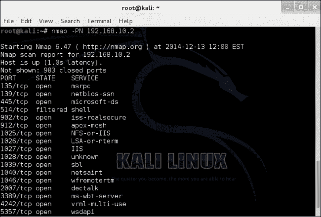
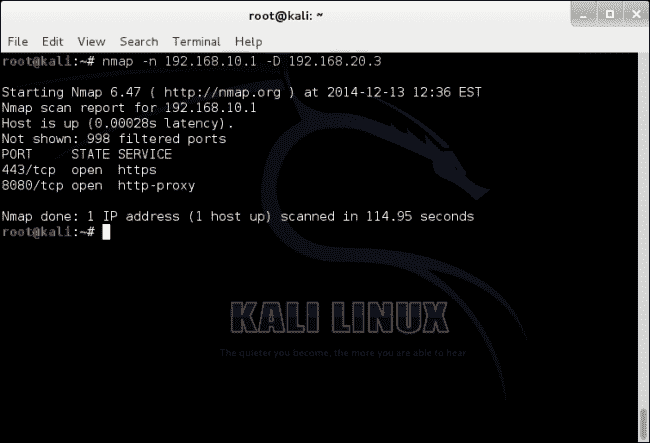
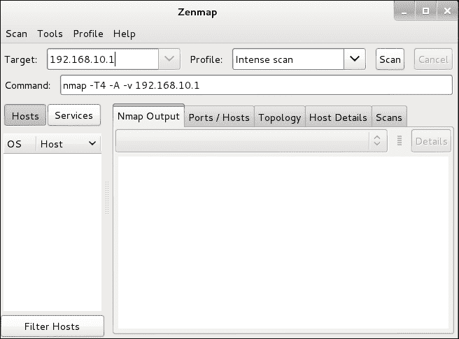
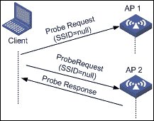
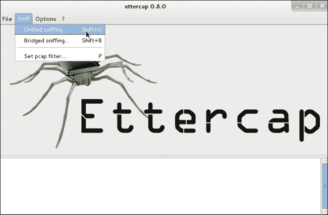
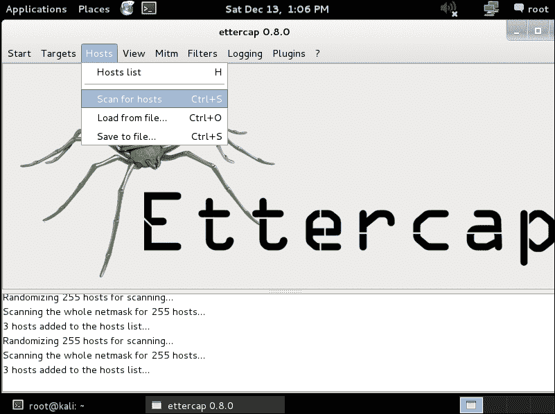

# 三、踩点与侦察

我们希望您喜欢阅读最后一章，并发现它非常有用，因为它涵盖了许多有用的信息。作为作者，我的目标是尽可能详细地介绍尽可能多的信息，以便您作为读者能够理解它，并在以后的真实世界中使用它！在本章中，我将介绍如何扫描无线网络以获取信息，不同的无线扫描方法，以及如何将它们用于好坏。

你可能会问或想，扫描无线网络有多难？任何人都能做到！是的，但是，如果 SSID 是隐藏的呢？你能找到隐藏的无线网络吗？普通用户很可能不知道隐藏的无线网络甚至存在。

你可能还会问，隐藏的无线网络有什么重要的？你可能会认为这是一个很好的安全措施，对别人隐藏。是的，是的！不幸的是，隐藏的无线网络可用于恶意和其他非法目的。

例如，假设您是企业的安全顾问。一位同事告诉您，一些文件丢失或在工作时间后被一个既不能在工作时间后进行物理访问也不能进行远程访问的用户更改。您可以验证修改的文件以及凌晨 2 点之后删除的文件的时间戳，还可以找到登录并进行更改的用户的姓名。现在，这个用户告诉你他们什么都没做。那天下午晚些时候，你的同事告诉你，他们看到用户在他们的隔间里设置了无线接入点或路由器。您可以询问上司是否可以搜索用户的工作区域中的安全问题。在搜索了那个区域之后，你最终发现了一个无线接入点，它连接在桌子下面。这绝对不好！现在，任何人都可以从无线范围内的任何地方访问该公司的网络，并访问网络共享和服务器。

# 什么是足迹和侦察？

足迹和侦察是您收集客户网络信息的地方，以根据收集的信息创建配置文件。攻击者必须以安全和专业的方式从组织获取信息，而不暴露信息。

足迹通常包括两个侦察步骤。第一步是从目标收集信息，以确定网络范围的范围。最常用的工具是：

*   nslookup
*   谁

在您的足迹和侦察过程中，您应该收集以下信息：

*   联系人姓名、电话号码和电子邮件地址
*   每个地点和分支机构
*   公司安全策略

为了获得更好的结果，试着发一封电子邮件或打电话给其中一名员工，并进行社会工程技术，看看他们愿意提供多少信息。然后，回顾安全意识培训可能需要改进的领域。

# 无线网络发现

在下一节中，我们将介绍网络和安全管理员推荐的最佳网络应用程序。这类应用程序可以轻松检测恶意硬件、软件许可证违规，甚至检测停机或性能问题。我选择的应用程序牢记多样性和可靠性。


照片来源：pobre.ch 通过 photopin cc

尽管我们将只介绍两种网络发现工具，但我们将分享更多我们认为可以帮助您和您的公司的应用程序。

## Nmap

**网络映射器**（**Nmap**是最流行的端口扫描仪和网络发现工具之一。它可以在所有主要的操作系统平台上使用。以下屏幕截图中给出了一个示例：


有关 Nmap 的更多信息，请参考[http://nmap.org/](http://nmap.org/) 。

## Nmap 命令

Nmap 有很多命令选项，我敢肯定我们不会总是马上记住这些命令。最后，它实际上就是要知道你的命令以及在特定情况下使用什么命令。作为 pentester，您需要高效地掌握这些工具中的大部分。其中一些解释如下：

*   **Operating system and version detection**: These commands will display results for operating system and software versions, as shown in the following screenshot:

    

    以下是的一些命令：

    *   `nmap –A 192.168.10.1`：此命令将显示操作系统、服务版本和跟踪路由输出。
    *   `nmap –v –A 192.168.10.1`：此命令将在扫描期间显示更多详细信息，以及操作系统、服务版本和跟踪路由输出。
    *   `nmap –O 192.168.10.1`：此命令仅显示正在运行的系统。添加一个`–osscan-guess`可以使扫描猜测更具攻击性。
    *   `nmap –A –iL /tmp/nmapscan.txt`：此命令将扫描操作系统、服务版本，并运行跟踪路由。然后，它将从文本文件中输入主机或网络的列表。

*   **Service scans**: These commands will display results for services and ports running on the host and can also help find out whether a host or network is protected by a firewall. This is illustrated in the following screenshot:

    

    以下是执行服务扫描的一些命令：

    *   `nmap –sV 192.168.10.1`：此命令将查找打开的端口，以确定正在运行的服务和版本。
    *   `nmap –sA 192.168.10.1`：此命令用于扫描防火墙策略。它将显示有关防火墙是否只是阻止 SYN 数据包的数据包过滤器的信息。向目的地发送 ACK 分组；如果它得到响应，那么它是开放的；如果它没有得到响应，那么它正在运行一个包过滤器。

*   **Bypassing firewall filters**: This command allows you to scan a host or network that is protected by a firewall. This command also depends on what firewall filters are running. The technique is illustrated in the following screenshot:

    

    以下是一些命令：

    *   `nmap –PN 192.168.10.1`：此命令将扫描主机，就像主机在线一样。如果您无法通过 ping 或扫描访问主机，则此功能非常有用。
    *   `nmap –PS 192.168.10.1`：此命令将对给定端口运行 TCP SYN 发现扫描。
    *   `nmap –PA 192.168.10.1`：此命令将对给定端口运行 ACK 发现扫描。

*   **Scanning for firewall vulnerabilities**: These commands will scan for common firewall exploits that are subject to finding a loophole in the TCP network protocol:

    

    以下是的一些命令：

    *   `nmap –sN 192.168.10.1`：此命令为空扫描。空扫描没有设置任何位，因此可以用来绕过非状态防火墙和数据包过滤器。
    *   `nmap –sF 192.168.10.1`：此命令为 FIN 扫描。FIN 扫描将仅设置 TCP FIN 位。当 FIN 数据包被发送到打开的端口时，打开的端口将忽略该数据包，关闭的端口将被发送回 RST 数据包，然后 RST 数据包将在 Nmap 中显示哪些端口处于打开和关闭状态。
    *   `nmap –sX 192.168.10.1`：此命令为 Xmus 扫描。Xmus 扫描可用于确定目标机器上的端口是打开还是关闭。此扫描发送包含在数据包头中发送的所有标志的 TCP 段。

*   **Packet fragments**: This command splits up the TCP header over several packets to make it harder for packet filters, intrusion detection systems, and firewalls to detect your scan. These commands are essential if you are looking to run a stealth scan on a network without raising a flag. The following is an example:

    *   `nmap –sS –p 80 –f 192.168.10.1`：此命令是一个 TCP SYN 扫描，扫描`192.168.10.1`上的端口`80`，而不触发入侵检测系统或警报。请理解，这也取决于防火墙或 IDS 配置和策略。此命令如以下屏幕截图所示：

    

*   **Firewall decoys**: This command allows you to spoof a host to the remote host. If spoofed correctly, an IDS and network administration will be unaware of a networks scan taking place. The following is a sample command:

    *   `nmap –n 192.168.10.1 –D 192.168.20.3`：此命令在不发送 DNS 请求的情况下扫描主机，并且它还为`192.168.20.3`设置了一个诱饵，使扫描看起来像`192.168.20.3`正在运行扫描，而不是 Kali Linux 主机。此命令如以下屏幕截图所示：

    

## 天马

**Zenmap**是 Nmap 的多平台图形前端。它使 Nmap 更易于使用，并附带了预配置的命令，可快速运行扫描。



有关 Zenmap 的更多信息，请参考至[http://nmap.org/zenmap/](http://nmap.org/zenmap/) 。

# 无线扫描

无线接入点不断搜索其他无线接入点。802.11 无线电扫描频率为 2.4 GHz 至 5.85 GHz。有两种不同的扫描方法，**被动**和**主动**。默认情况下，802.11 无线电在该国运营法律允许的所有频道上执行这两种扫描。


照片来源：@jbtaylor via photopin cc

对没有 FCC 许可证或执照的操作的处罚可能会对您一天的操作收取巨额罚款。你可以问 FCC 是谁？**联邦通信委员会**（**联邦通信委员会**监管美国的电信行业，包括互联网。我们为什么要担心这一点？互联网的目标是让任何人都可以访问，而不受歧视、封锁、审查或限制网络。总而言之，FCC 正在提出新的互联网政策和合同，允许互联网服务提供商收取额外费用或推广“付费使用”服务，如果你没有额外的钱来支付，这将减慢你的互联网速度。在进行任何本地广播或扫描之前，请参考贵国的 LCT。

## 被动扫描

**被动扫描**监听信标并探测响应。从客户端发送的无线电每秒扫描一次，然后审核无线网络上的数据包。被动扫描始终处于启用状态，因为它用于将客户端连接到访问点。

## 主动扫描

**主动扫描**仅在政府法规允许的频道上执行。默认情况下启用活动扫描；但是，可以在无线适配器的配置文件或配置中禁用它。在活动扫描期间，无线电发送带有空 SSID 名称的探测请求，以从该区域的其他设备请求探测响应。换句话说，接入点会主动寻找其他设备并收听它们：



## 扫描工作原理

为了扫描操作范围之外，接入点必须改变信道。这些来自接入点的无线射频信道扫描每秒在不同的信道范围内执行一次，直到它们在所有信道中循环。


无线接入点随后将离开射频信道约 25-30 毫秒。计划扫描以避免干扰其他信标传输。然后，一旦通道更改完成，将发送探头。请记住，如果检测到语音、视频或其他大量数据使用，扫描频率将降低。

# 监听无线网络

我知道你在想什么。。。我真的能闻到无线网络的味道吗？不，但是，使用正确的工具和硬件，您可以！无线监听是一种由无线网络上的特殊应用程序或工具使用的窃听技术。嗅探比无线更具侵入性，因为无线在网络中步履蹒跚。无线嗅探的目标是解决无线网络上的网络问题和协议。

可以监视和嗅探无线和有线连接。无线网络更容易嗅探，因为它们使用无线电信号进行通信。攻击者可以坐在建筑物外的汽车中，嗅探无线网络中的敏感信息，以获取个人利益、注意力甚至金钱。

网络将信息分成小块，称为**帧**。这些帧中有数据包。攻击者可能以帧、数据包或两者为目标。

通过以帧为目标，攻击者可能会在区域内检测到隐藏的无线网络，如果网络未使用最新的无线加密标准，攻击者可能会在该区域内获得未经授权的访问。网络管理员使用这些技术来解决网络问题。

## Wireshark 应用程序

Wireshark 是一款免费的开源数据包分析器。它用于网络故障排除和分析。它捕获网络数据包并详细显示这些数据包。网络和安全管理员依靠 Wireshark 解决网络和安全问题。

几年前，有许多不同的工具可用，使用起来相当昂贵。Wireshark 已经改变了这一点，它向公众免费提供了自己。Wireshark 是目前可用的最好的开源数据包分析器之一。

Wireshark 有很多很好的用途。网络管理员将使用它来识别和排除网络问题。网络安全工程师可以检查安全问题。开发人员可以调试协议实现。用户可以很好地了解网络协议的工作原理以及攻击者可能会对其造成的危害。

在现实世界中，Wireshark 非常有助于查看实时数据包以确定 web 应用程序问题、身份验证问题（如三向 TCP 握手）和审核。Wireshark 将向您展示数据包的来源、目的地以及用途。

例如，您可以查看一个用户在网络上使用的带宽是否比其他用户多。该用户可能在工作时间大量下载或观看 YouTube 视频。您可以降低该用户的带宽，这样就不会降低其他用户的网络速度。

Wireshark 适用于 Windows、Mac 和 Linux 操作系统。请访问[http://www.wireshark.org/](http://www.wireshark.org/) 了解有关功能和支持的更多信息。Kali Linux 已经预装了 Wireshark，因此您不必安装它，但您可能需要在任何您想要的操作系统上安装它。

## Ettercap

Ettercap 执行中间人攻击，将自身定位为路由器或服务器。


攻击者可将 eTerCap 用于以下目的：

*   操纵数据
*   收集 FTP、HTTP、POP 和 SSHv1 等协议的密码
*   在 HTTPS 会话中伪造 SSL 证书

在这个 Ettercap 演示中，我们将把我们的 Kali Linux 系统定位为 ARP 欺骗后的“中间人”。开始吧！

1.  Open Ettercap in graphical mode by opening a bash terminal and typing in `ettercap –G`:

    

2.  Select **Sniff** and then select **Unified sniffing…**:

    

3.  Select **Hosts** and then select **Scan for hosts**:

    

    网络范围将由您在上一步选择的接口上的 IP 设置决定。

4.  Click on **Hosts** and then click on **Hosts list**:

    

5.  Select the router's IP address and click on **Add to Target 1**. If you would like to target another router or host, select another IP address from the list and click on **Add to Target 2**.

    

    如果您不选择任何内容，您将 ARP 毒害整个子网。不要在任何生产网络上运行此操作！IP 地址`192.168.146.1`是我们将用于本演示的路由器。

6.  Click on **Mitm** and then click on **ARP poisoning…**:

    

7.  Check the box **Sniff remote connections.**:

    

8.  Click on **Start** and then click on **Start Sniffing**:

    

既然子网已陷入中间人攻击，攻击者只需在该子网上运行修改的或过滤的攻击即可。这些过滤器可以通过 eTerCap 提供的插件使用，也可以自己创建。这是常见的攻击，如 DNS 欺骗、FTP 提示更改或 SSH 降级攻击发生的地方。最终用户甚至不知道它发生了。网络管理员可以使用 Wireshark 确定数据包的来源，并追踪攻击者的 IP 地址。作为安全性的一般规则，不要使用默认或自动设置。实施最高级别的安全措施，并与员工讨论安全最佳做法。

## dsniff

dsniff 是一款高级密码嗅探器，可识别多种不同的网络协议，如 Telnet、FTP、SMTP、POP、IMAP、HTTP、CVS、Citrix、SMB、Oracle 等。Wireshark 可以提供大量关于数据包的信息，而 dsniff 可以提供用户名和密码。您可以指定要侦听的接口，甚至可以将输出保存为文件格式以供以后读取。让我们来看看如何使用 DNSIFF！


执行以下步骤：

1.  打开一个新的终端窗口。
2.  Type the following command:

    ```
    dsniff –n –i eth0

    ```

    选项`–n`不会将 IP 地址解析为主机名。选项`–I`是我们选择`eth0`的网络接口。

    

3.  Log in with a username and password for any of the network protocols mentioned earlier:

    

4.  If you look back at your other Terminal, you should see that dsniff has revealed your login credentials:

    

如果任何人使用非加密方式登录，dsniff 将获取登录凭证。这就是为什么强烈建议在用户可用时始终使用加密。请确保您使用的是最新的 TLS 标准和具有 2048 位以上密钥的优秀安全证书。如果您正在配置服务器，请将默认端口更改为唯一端口。这将有助于减少潜在攻击的数量以及野外可能存在的任何其他安全风险。

假设您想使用 dsniff 嗅探远程计算机在本地 LAN 上的密码？当然没问题！有一个名为**ARPSOOF**的工具，可以让您将攻击计算机的 IP 地址欺骗为默认网关或中间人攻击。要使此攻击生效，您必须启用计算机的 IP 路由，以便在两台计算机之间成功建立正确的通信。

# 确定你的目标

作为一名渗透测试人员，了解并了解你的目标是谁是至关重要的。要考虑的不仅仅是计算机。服务器、智能手机、平板电脑和网络硬件也是渗透测试的一部分。了解是否应用了软件或系统补丁非常重要，因为我们不希望未经授权访问这些设备和系统，尤其是在生产环境中。


照片来源：Bogdan Suditu 通过 photopin cc

Nmap 和 Zenmap 等工具可用于扫描整个网络。尽管这是一种快速获取操作系统和软件版本等信息的方法，但并不总是准确的。根据场景的不同，有时最好访问每个设备和系统以了解网络上正在使用的内容。如果客户能够提供网络文档和硬件清单，那么向客户询问这些信息会非常有帮助。

# 保护/防止自己受到攻击

无论情况如何，我们始终需要知道如何保护自己免受任何可能发生的威胁。无论是来自网络内部还是外部，您都需要了解个人或企业可能受到的影响。有几种方法可以保护自己免受此类攻击：

*   针对 Nmap 和 Zenmap 的保护/预防：

    *   创建自定义防火墙规则和访问列表
    *   监控网络流量的任何硬件 ID 24/7
    *   阻止或过滤 ICMP ping

*   无线扫描防护/预防：

    *   配置最新无线加密算法
    *   配置 MAC 过滤规则
    *   关闭或隐藏无线广播
    *   关闭 UPnP 支持

*   针对嗅探无线网络的保护/预防：

    *   使用 HTTPS 和 SSH 代替 HTTP 和 telnet
    *   使用 VPN 服务连接
    *   仅连接到受信任的无线网络

# 总结

在本章中，您了解了如何扫描无线网络以获取信息，了解了两种不同类型的无线扫描，并了解了它们的工作原理。您了解了如何通过使用 Ettercap 的 ARP 中毒来嗅探无线网络，以及如何使用 dsniff 获取登录凭据。我们还讨论了如何在无线渗透测试期间识别目标。

最后，您学习了几种不同的方法来保护自己免受这些攻击。保持你作为攻击者的心态很重要，因为这会让你看到更多可能威胁你个人或企业的安全威胁。始终连接到受信任的无线网络，在可用时使用加密，在旅行时使用 VPN。