# 七、客户端攻击

在上一章中，我们讨论了如何在网络上执行漏洞评估。本章将介绍客户端攻击，这将帮助您了解黑客如何瞄准和攻击网络上的系统和其他设备。那么什么是客户端攻击呢？我很高兴你问我！

在本章中，我们将介绍以下主题：

*   客户端攻击的类型
*   嗅探未加密的流量
*   蜜罐攻击
*   预防威胁


# 客户端攻击是如何工作的

为了充分理解客户端攻击是如何工作的，我们需要讨论服务器端攻击与客户端攻击相比是如何工作的。服务器运行许多与客户端交互的不同应用程序和服务。客户机可以访问这些服务器服务，客户机可以利用这些服务进行尝试和利用。随着服务器上运行的服务越来越多，它就更容易受到攻击。


客户端攻击是不同的。这类攻击的目标是与恶意服务器交互的客户端应用程序中的漏洞。如果客户端未连接到服务器，则不会有风险，因为它不处理从服务器发送的任何内容。即时消息应用程序可能会使客户端受到攻击，因为大多数客户端都会自动配置为登录到服务器。


最常见的客户端攻击是在有人访问针对其 web 浏览器应用程序的恶意网页时执行的。如果攻击成功，攻击者可以轻松控制客户端。攻击不仅仅是基于 web 的攻击，例如通过电子邮件、即时消息和 FTP 进行的攻击。


只有当有可用的防御时，客户端才会受到保护。防火墙和代理有助于将网络流量限制为仅受信任的网站和服务器。硬件防火墙，如 WatchGuard 的 XTM 800 系列，具有数据包过滤、入侵预防服务和应用程序控制。如果您是一家企业，并且您的网络上没有硬件防火墙，那么您的所有系统和设备都有风险。

# 客户端攻击的类型

客户端攻击利用用户与其访问的网站或服务器之间的信任。


以下类型的攻击是最常见的客户端攻击：

*   **欺骗**：欺骗用户相信某个网站或服务器是合法的。
*   **跨站点脚本（XSS）**：这允许攻击者从用户的 web 浏览器中执行。此攻击可用于控制用户会话、实施钓鱼攻击以窃取登录凭据，甚至使用显式内容羞辱用户。所有 web 应用程序都易受此攻击。通常，利用此漏洞将使用 HTML、JavaScript、VBScript、ActiveX、Java 或 Flash 在用户的 web 浏览器应用程序上执行。

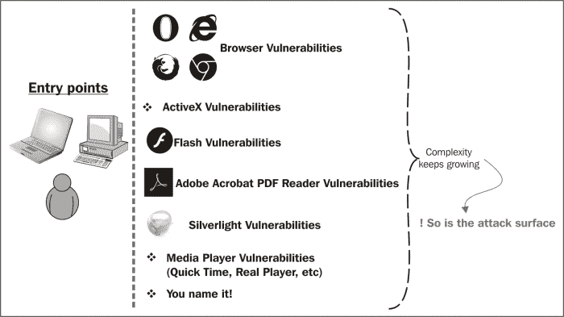

# 嗅探未加密的流量

您现在应该知道，任何人都可以查看未加密的无线通信，因此您的数据很容易被泄露。您是否曾经连接过公共无线网络，如星巴克或酒店？你有没有想过还有谁可能连接到你的网络，并且可能正在监听你的网络流量？听起来很吓人吧？

事实上，几乎不需要任何经验！任何人都很容易查看未加密的流量。在下一个演示中，我将详细介绍如何嗅探未加密的流量。本演示将帮助您了解始终使用安全连接进行连接的重要性。

1.  Navigate to **Applications** | **Internet** | **Wireshark**:

    

    ### 提示

    您也可以通过打开终端并键入`sudo wireshark`来打开 Wireshark。

2.  If you receive an error message or information message, click on **OK**:

    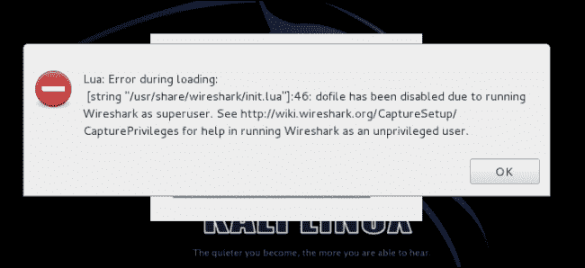

    在前面的屏幕截图中，简单地说`dofile`由于以超级用户身份运行 Wireshark 而被禁用。我们只需点击**OK**即可忽略此错误消息，因为它不会影响我们的工作。这只是说我们是作为一个非特权用户运行 Wireshark。

    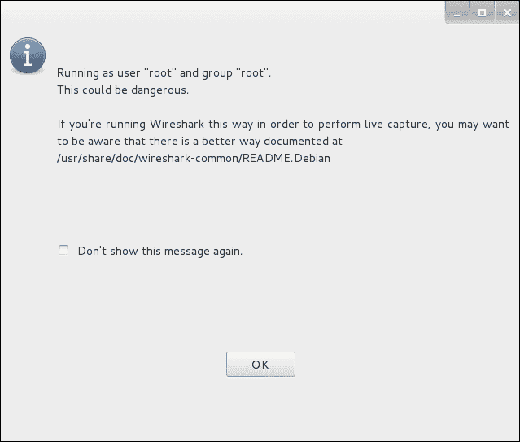

3.  The Wireshark graphical interface should appear:

    

4.  Then, navigate to **Capture** | **Interfaces...** as follows:

    

5.  In this demonstration, we have selected **eth0**. This might be **wlan0** or **wlan1** for some of you. Check the box and click on **Start**:

    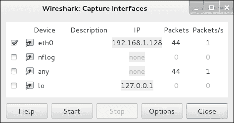

6.  You should see Wireshark beginning to capture network traffic:

    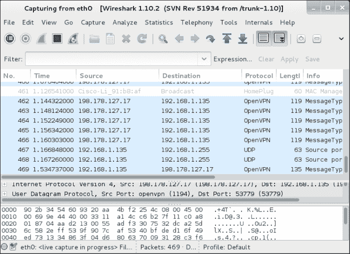

7.  In this demonstration, we will be filtering `telnet`. Click on **Save**:

    

8.  Use the `telnet` command to connect to a telnet server. You will need to run your own telnet server to follow this:

    

9.  In Wireshark, you should see a lot of different telnet packets. Right-click on one of them and select **Follow TCP Stream**:

    

10.  It should display the telnet session output with the login and password in plain text:

    

要使用这种连接的安全形式，必须使用 SSH-2。SSH-1 存在中间人攻击问题和安全漏洞。SSH-1 也已经过时，应该不惜一切代价避免使用。确保您更新了您的`sshd_config`文件，更改默认 SSH 端口，限制用户的 SSH 访问，配置 IDL 注销超时时间间隔，禁用根登录，并根据您的法律条款和法律通知详细信息设置警告横幅。使用强 SSH 密码和密码短语。我怎么强调都不过分，这是多么重要。

# 蜜罐攻击

随着技术的进步，无线网络在带宽和范围上变得越来越大。黑客可以很容易地建立一个无线蜜罐，诱使受害者进入他们认为可信的无线网络。什么是无线蜜罐？**无线蜜罐**是一种配置为接入点的设备，在该接入点中，它可能与该区域中的另一个接入点具有相同的 SSID，并且还配置了一个代理以指向攻击者的计算机。

如果用户连接到蜜罐，攻击者将过滤或监视其所有网络流量，这可能最终导致中间人攻击。然后，攻击者将能够查看该连接中的任何未加密流量，如电子邮件、即时消息、FTP 和 telnet 会话：

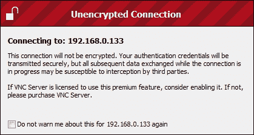

如果攻击者拥有高功率增益天线，客户端很可能会在可用无线网络的无线列表中看到它。另一件需要注意的事情是，大多数 Microsoft Windows 操作系统配置为自动连接到无线网络，如果附近碰巧有一个具有相同 SSID 和密码短语的蜜罐，这可能非常糟糕。可以禁用此功能。

## 我如何保护自己免受蜜罐或中间人攻击？

保护自己免受蜜罐攻击的最简单方法之一就是不使用无线。如果您的组织需要无线通信，该怎么办？在 BYOD 设备上，应创建配置文件，以仅允许受信任的无线网络连接到客户端设备。使用 3G/4G 连接或有线连接。如果你还需要无线怎么办？有基于软件和硬件的无线入侵防御系统（WIPS），可以检测恶意接入点。

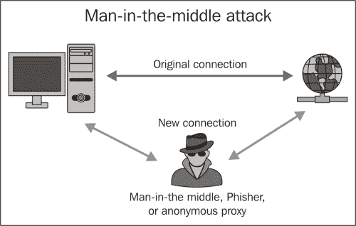

WIPS 通过 SSID、通道、信号强度和 MAC 地址识别这些访问点。如果参数不匹配，则 AP 有可能是蜜罐。如果黑客在同一 SSID 和通道上操作会怎样？WIP 将根据信号强度进行调整。信号强度可以确定它是否是合法 AP。

**KFSensor**是基于 Windows 的蜜罐**入侵检测系统**（**IDS**）。它就像蜜罐一样吸引和检测黑客、蠕虫、流氓和漏洞。通过充当诱饵，它可以转移攻击，提供额外的安全级别。KFSensor 界面如以下屏幕截图所示：

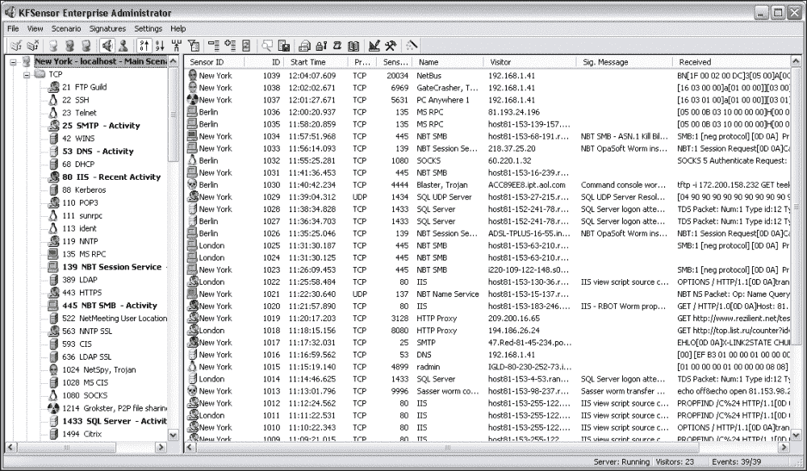

您可以从[下载 30 天试用版 http://www.keyfocus.net/kfsensor/download/](http://www.keyfocus.net/kfsensor/download/) 。

# 岩溶

Karmetasploit 非常像蜜罐，但它关注漏洞和利用客户端。Karmetasploit 是一个伪造的恶意访问点应用程序。当受害者连接到它时，Karmetasploit 将针对客户端启动 Metasploit 框架内的所有漏洞攻击。它还可以捕获登录名和密码。Karmetasploit 界面如下图所示：


在下一个演示中，我们将使用 Karmetasploit 创建一个假 AP。请理解，这些演示仅用于教育目的。在某些地方，广播 Karmetasploit 可能是非法的。在使用 Karmetasploit 之前，请咨询您所在司法管辖区内有资格执业的律师。

让我们开始示范吧！

1.  Open a Terminal and download PwnSTAR from [www.github.com](http://www.github.com):

    ```
    git clone git://github.com/SilverFoxx/PwnSTAR.git

    ```

    以下是输出：

    

2.  Navigate to the `PwnSTAR` directory:

    

3.  Execute `installer.sh` and follow the prompts:

    

    ### 提示

    当询问在哪里安装 PwnSTAR 时，只需按*输入*或键入`/usr/bin`。

4.  Navigate to the `pwnstar` directory `/user/bin`:

    

5.  Enter `y`:

    

6.  Choose option **5) Karmetasploit**:

    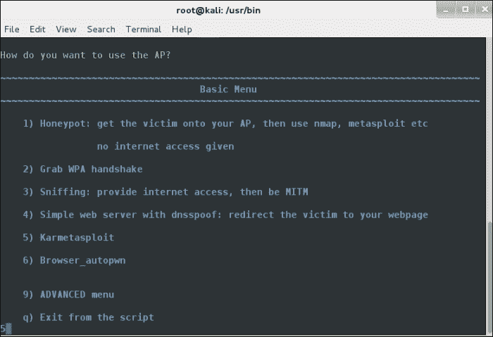

7.  Follow the prompts:

    

    在前面的截图中，您可以看到我们正在提供互联网接入。这样用户就知道他们已连接到互联网；但是，DNS 可以被欺骗，因此 DNS 请求将发送给攻击者而不是 Internet。`wlan0`是无线接入点使用的接口。

8.  Follow the prompts, as shown:

    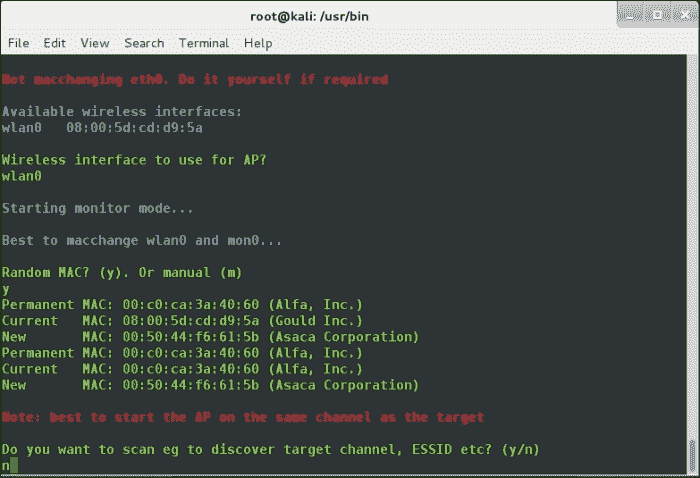

9.  This should take you to the following screen:

    

    在前面的截图中，当询问频道时，您可以输入任何频道号（`1`到`11`。在本演示中，我使用了`6`。

10.  Choose option **3) SoftAP Channel** and enter channel number `6`:

    

11.  Enter the letter `c` to continue and choose option **2) Bullzeye**:

    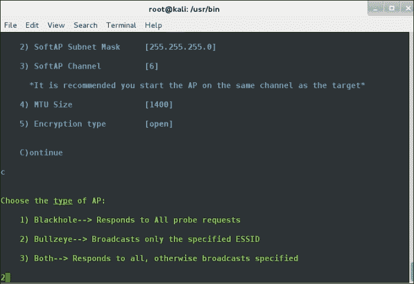

    Bullzeye 仅广播您要分配的 SSID。当用户连接到无线 AP 时，他们将从`eth0`接收互联网接入，因为它正在共享给`wlan0`。

12.  Enter the SSID name that you want to use:

    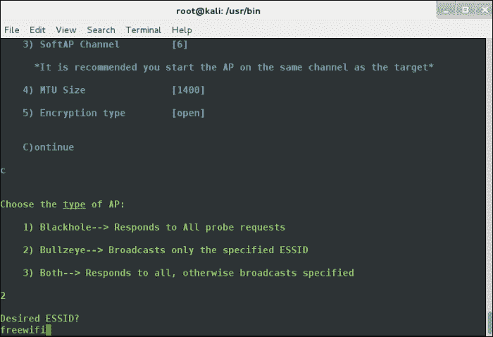

    ### 提示

    如果要求您检查 DHCP 服务器参数，您不需要这样做。DHCP 将自动设置和配置。

13.  If all goes well, Karmetasploit and several other Terminal windows will prompt you for input:

    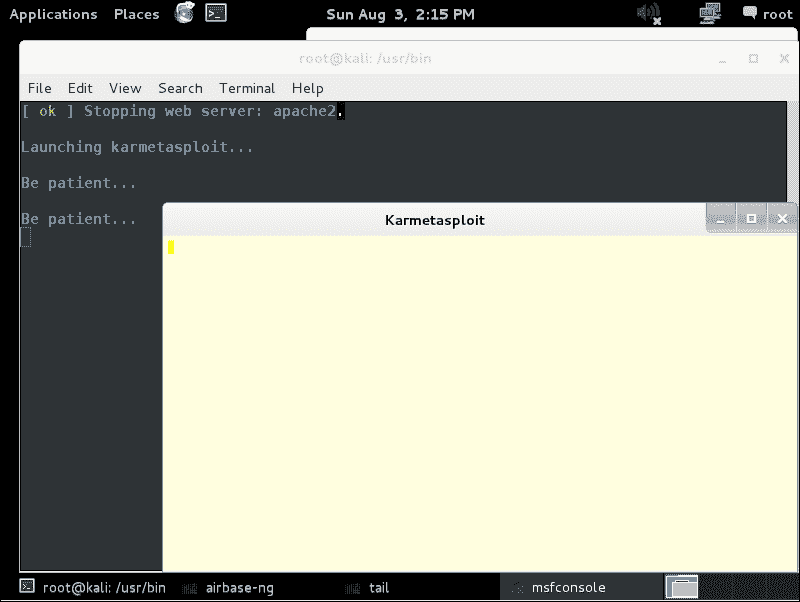

祝贺您已成功安装并运行 Karmetasploit。

# 贾萨格

对贾萨格了解不多的人不多。如果您是这些人中的一员，今天是您的幸运日，因为在本节中，您将了解 Jasager 是什么，以及它为无线渗透测试人员提供了什么。

贾萨格是建立在业力之上的。它被设计为在 OpenWrt 上运行。Jasager 支持大多数无线接入点和 Wi-Fi 网络适配器。它的主要功能是一个显示网络信息的 web 界面，通过 AJAX 和 Lynx 完全控制 Karma 功能，可以轻松执行任务的自动运行脚本，日志记录，以及对基本命令的支持。

WiFi 菠萝标记 5 是所有无线网络审计工具的完美设备。hak5.com 的所有者 Darren Kitchen 专注于制造最实惠的无线设备，扩展无线黑客工具的使用范围。WiFi 菠萝自 2008 年问世以来，一直服务于渗透测试人员、军方和政府、执法部门以及黑客活动者。请务必在[处查看 https://wifipineapple.com](https://wifipineapple.com) 。

在下一个演示中，我将向您展示如何在 WiFi 菠萝上启用 Jasager。你们中没有这样一个工具的人仍然应该遵循，因为了解它是如何工作的以及通过网络执行它有多容易是很重要的。

1.  通过以太网电缆将 WiFi 菠萝直接连接到计算机。
2.  Open your web browser and navigate to `http://172.16.42.1/pineapple`. Sign in as `root`; the password is `pineapplesareyummy`:

    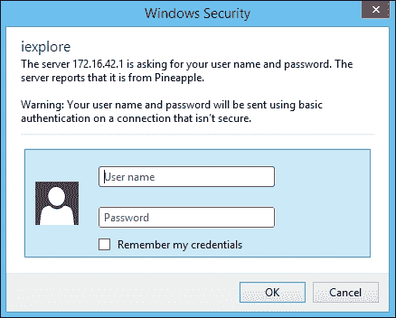

3.  On the left-hand side, you should see a list of services; click on the **Start** button next to **MK4 Karma**:

    

祝贺您已成功启用 Jasager。那么什么是 Jasager？**Jasager**是 Karma 的一个实现，设计用于在 OpenWRT 上运行。使用 Jasager，您可以看到当前连接的客户端及其 MAC 地址、IP 地址和 SSID。您可以自动运行脚本来自动执行关联和 IP 分配任务、记录信息，并利用成熟的命令行界面进行快速轻松的访问。对于企业，如果新客户端连接到网络，您可以使用 Jasager 通知您，然后向新客户端提供一个网站横幅，表明它们正在被监控，禁止任何未经授权的访问。在家里，你可以识别是否有邻居试图窃取你的无线互联网。

# 预防措施

好的，所以你完全知道下一次去酒店可能会很危险，即使每个网页上都有大量的小猫。好消息是，我们仍然有办法保护自己免受这些蜜罐或流氓接入点的攻击。其中一些建议如下：

*   **禁用 Wi-Fi**：关闭 Wi-Fi 是确保安全的最简单方法。如果没有 Wi-Fi，您将降低这些攻击的安全风险。
*   **永远不要连接开放的 Wi-Fi 网络**：免费互联网听起来不错，但如果有人碰巧嗅到了所有的网络流量呢？不要冒险使用开放的 Wi-Fi 网络。
*   **连接到安全 VPN 连接**：如果开放网络是您唯一的访问方式，请始终使用安全 VPN 连接。

# 总结

这是一个伟大的篇章！我们报道了很多东西。让我们花些时间回顾一下你学到的东西。在本章中，您学习了如何捕获未加密的流量，并了解了蜜罐攻击和方法、Karmetasploit、Jasager 和防止威胁。

在下一章中，您将学习捕获加密的网络流量，并了解中间人攻击。