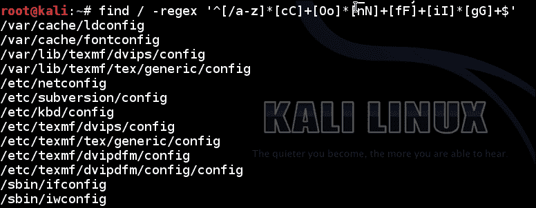
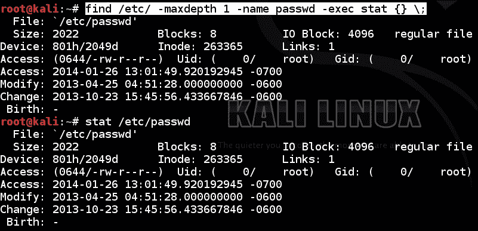
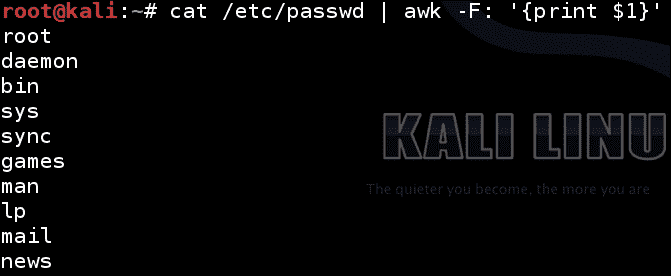

# 一、了解 Bash

**Bourne SHell**（**bash**可以说是现存最重要的软件之一。如果没有 bash shell 的许多实用程序以及它通过以可编程的方式集成和连接系统实用程序（称为**bash 脚本编制**）为用户提供的解决问题的潜力，许多现代世界中非常重要的安全相关问题将非常难以解决。像`grep`、`wget`、`vi`和`awk`这样的实用程序使用户能够进行非常强大的字符串处理、数据挖掘和信息管理。多年来，全世界的系统管理员、利用人员、安全工程师和渗透测试人员都以其解决问题的潜力和有效性宣誓，使他们能够应对日常技术挑战。

为什么要讨论 bashshell？为什么在系统管理员、渗透测试人员和利用人员中如此流行？嗯，可能还有其他原因，但从根本上说，bashshell 是最标准化的，而且对于最流行的操作系统来说，通常是从单个代码库实现的，官方源代码只有一个源代码。这意味着无论承载 bash 实现的操作系统是什么，都可以为 bash 脚本或命令集合保证一定的基本执行行为集。操作系统通常都有独特的**Korn Shell**（**ksh**和其他终端仿真器软件的实现。

bash 所固有的 Linux 或 Unix 环境的唯一缺点（如果有的话）是，对于大多数人来说，尤其是那些习惯于**图形用户界面**（**GUI**的人），学习曲线可能有点陡峭。这主要是因为信息的表示方式。对于新手来说，一般的 Linux/Unix 文化和惯例通常很难理解，这可能是由于缺乏工具提示、提示和丰富的图形交互设计以及用户体验，工程 GUI 通常从中受益。本书，尤其是本章，将介绍一些机智但出色的 Linux/Unix 文化和惯例，以便您能够充分熟悉 bash shell，最终找到自己的方法，并遵循本书后面更高级的主题。

在本书中，将要讨论的 bash 环境或主机操作系统将是 Kali-Linux。Kali Linux 是一个从 Debian 改编而来的发行版，它包含了纯粹专注于技术安全问题解决和测试的实用程序。由于了解如何使用终端与了解操作系统及其各种细微差别密切相关，因此本章和后续章节将介绍一些与 Kali Linux 操作系统、其配置设置和默认行为相关的主题，以使您能够正确使用终端实用程序。

如果您已经是一个经验丰富的“basher”，请跳过本章，继续阅读本书中更注重安全性的主题。

# 从手册页获得帮助

Bash shell 通常附带有一个非常有用的实用工具，名为 manfiles，是手动文件的缩写。这是一个实用程序，它为您提供了一种标准格式，用于记录 Unix/Linux 环境中可用的大多数实用程序、库甚至系统调用的用途和用法。

在以下各节中，我们将经常使用手册文件中使用的约定和描述样式，以便您可以轻松地切换到使用手册页来支持您在以下各节和章节中所学的内容。

使用 man 文件非常简单；您只需从终端发出以下命令：

```
man [SECTION NUMBER] [MAN PAGE NAME]

```

在前面的命令中，`[SECTION NUMBER]`是要引用的手册页节的编号，`[MAN PAGE NAME]`是手册页的名称。通常，它是命令、系统调用或库本身的名称。例如，如果要查找 man 命令本身的手册页，可以从终端执行以下命令：

```
man 1 man

```

在前面的命令中，`1`告诉 man 使用第 1 节，作为该命令后缀的`man`参数是手册页的名称，也是该页专用的命令的名称。

手册页部分根据其自身的规范进行编号。以下是这些数字的分配方式：

1.  **通用命令**：您通常使用此部分查找命令行上使用的命令信息。在本节前面的示例中，我们使用它查找有关 man 文件的信息。
2.  **系统调用**；部分记录了主机操作系统促进的公共系统调用的参数和目的。
3.  **C 库函数**：此部分对于 C 利用人员和使用 C 派生语言（如 Python）的利用人员非常有用。它将为您提供有关参数、定义头文件、行为以及某些基本 C 库函数调用的用途的信息。
4.  **Special files**: This section documents special-purpose files, typically those in the `/dev/` directory, for instance, character devices, pseudo terminals, and so on. Try picking a couple files in the `/dev/` directory of your operating system and executing the following command:

    ```
    man 4 [FILENAME]
    ```

    例如：

    ```
    man 4 pts
    man 4 tty 
    man 4 urandom
    ```

5.  **文件格式和约定**：本节记录了用于构建系统信息的常用文件格式，如日志文件格式、密码文件格式等。通常，任何文件都用于记录由通用操作系统实用程序生成的信息。
6.  **游戏和屏幕保护程序**：此部分包含关于游戏和屏幕保护程序的信息。
7.  **杂项**：本节包含杂项命令等信息。它保留用于记录不属于其他类别的任何内容。
8.  **系统管理命令和守护程序**：本节专门介绍管理命令和系统守护程序信息。

有关这些部分的概要和完整描述，请尝试查看每个部分的简介文件。通过对每个节号执行以下命令，可以访问这些文件：

```
man [SECTION NUMBER] intro

```

我已经在这里记录了所有手册页部分编号及其传统用途。当然，维护这些约定取决于利用人员，但通常您只会对第 1 节感兴趣，如果您要做一些反向工程，第 2、3 和 4 节也会有很大的帮助。

手册页布局已标准化，以包含特定的章节集合。手册页的每个部分都描述了所讨论的命令、系统调用或库的给定属性。以下列表说明了 man 文件中常用部分的用途：

*   **名称**：命令、函数、系统调用或文件格式的名称。
*   **概要**：这是对命令、系统调用、文件格式或您描述的使用规范的正式描述。命令的语法或用法规范的指定方式需要稍微理解才能正确理解。您可能会注意到规范中的大括号，它们不能解释为命令调用的文字部分。事实上，它们表明括号内出现的任何内容都是可选参数。此外，“|”字符表示可以将其前面或后面的符号指定为命令调用的一部分，但不能同时指定这两个符号；将其视为逻辑 OR。
*   **说明**：这是对手册页主题的非正式说明和讨论，详细说明了手册页主题的目的以及更多关于概要部分中提到的选项和可能的参数的信息。
*   **示例**：这是使用手册页主题的示例集合。
*   **另请参见**：这是一个参考文献、网页和其他资源的集合，包含有关讨论主题的更多信息。

有关 Linux 手册页面的更多信息，请参阅本章末尾的*进一步阅读*部分。

# 导航和搜索文件系统

导航和搜索 Linux 文件系统是利用人员、系统管理员和渗透测试人员需要掌握的最基本的技能之一，以便充分发挥其 bash 控制台和实用程序的潜力。要正确掌握这项技能，您需要很好地理解主机操作系统的组织结构，尽管深入讨论 Kali Linux 操作系统的内部工作原理和组织结构有点脱离本书的上下文。

导航文件系统需要使用工具和实用程序的示例集合。以下是这些工具的分类：

<colgroup><col style="text-align: left"> <col style="text-align: left"> <col style="text-align: left"></colgroup> 
| 

命令名

 | 

通用名

 | 

意图

 |
| --- | --- | --- |
| `cd` | 更改目录 | 此更改您当前的工作目录 |
| `ls` | 列表 | 此列出当前工作目录的内容 |
| `pwd` | 打印工作目录 | 此显示当前工作目录 |
| `find` | 发现 | 此基于特定属性的值来定位或验证文件的存在 |

## 导航目录

导航目录通常使用`cd`命令，这可能是最简单的命令之一。您所需要做的就是提供您希望更改到的目录，`cd`将完成其余工作。它还有非常有用的速记，可以加快用户在浏览文件系统时执行的最常见任务。

以下是命令使用规范的内容：

```
cd [ -L | -P ] [directory]

```

在语法规范中，`[directory]`是您希望将当前工作目录更改为的目录，`[-L|-P]`可以是以下任一目录：

*   `-L`: When changing directory, symbolic links should not be respected. The current directory will be changed to include the name of the symbolic link and not its target. This is described in documentation as making the symbolic link logical, since it forces the name of the symbolic link to be treated as logical element in the path being set as the working directory.

    ### 注

    符号链接是文件系统上的结构，允许一个文件或目录纯粹作为对另一个文件的引用。这些链接会影响路径解析的发生方式，因为在某些情况下，当遵循符号链接时，它将允许一条路径将当前目录指向由另一个名称表示的文件，而不是严格按照其名称解析路径名。

*   `-P`：这是`-L`命令的对立面。这指定如果要设置为当前目录的文件是符号链接，则应在将其设置为当前目录之前将其完全解析。这意味着，如果访问符号链接，当前路径将不会反映用于访问该链接的符号链接的名称，当然，除非该链接与其目标具有相同的名称。

以下是`cd`命令的典型用法示例：

```
cd / 

```

前面的命令会将您当前的目录改为根目录，名为`/`；文件系统上承载的所有内容通常都可以从此目录访问。

以下是更多的例子：

*   `cd ~`：此命令用于导航到当前用户的主目录
*   `cd ../`：此命令用于导航到当前目录正上方的目录

在前面的命令中，可以让`cd`在当前目录上方导航任意数量的目录，例如，通过向其提供如下命令：

```
cd ../../../../../

```

以下是可用于导航到不同目录的其他一些命令：

*   `cd .`：此命令用于导航到当前目录
*   `cd –`：此命令用于导航到上一个目录
*   `cd --`：此命令用于导航到倒数第二个目录

要查看您是否确实已将当前工作目录更改为指定的工作目录，您可以调用将打印工作目录的`pwd`命令。`pwd`命令的语法如下：

```
pwd [-L|-P] [--help] [--version]
pwd [--logical | --physical ] 

```

`–L`或`--logical`和`–P`或`--physical`调用选项的用途与`cd`命令中的相同。

## 目录内容列表

仅仅在目录之间移动是不够的。你最终会想找出这些目录中的内容。您可以使用`ls`命令来执行此操作。

以下是根据手册页改编的`ls`命令的使用说明：

```
ls [-aAlbBCdDfFghHiIklLmNopqQrRsStTuvwxXZ1] [FILE/DIRECTORY]

```

前面的命令规范是另一种流行的 Linux/Unix 约定。这是一种简写，用于指定括号中出现的任何字母都可以指定为命令调用的一部分。此外，可以同时指定任意数量的。例如，考虑以下命令：

```
ls –Ham
ls –and
ls –Rotti

```

根据命令规范，它们都是使用`ls`命令的可接受方式。这些是否真的有用取决于每个开关如何影响`ls`命令的行为。您应该记住，某些选项可能会产生相反的效果，或者某些组合可能没有效果，比如在阅读使用说明时的一般说明，例如`ls`的说明。

`[FILE]`或`[DIRECTORY]`参数可以是您希望触发`ls`的任何路径或文件。如果没有任何参数，`ls`将列出当前工作目录的条目。

### 注

**开关**是选项的常用术语，即直接在连字符后面的任何内容，指定为命令调用的一部分。例如，`–l`是一个开关。

以下是一些开关的功能，为了简洁起见，我们只讨论一些最重要的开关。请记住，`ls`命令列出目录内容，因此它的所有选项都将集中于以指定方式组织和呈现给定目录的内容。

以下是命令的一些调用选项：

*   `-a –-all`：显示所有目录条目，不忽略名称中以“.”开头的目录或文件。
*   `-d –directory`：此列出目录项，而不是目录项的内容。这也将迫使`ls`不去引用符号链接。
*   `-h`：此以人类可读的格式打印大小，例如，在适用的情况下，它将以 GB、KB 或 MB 显示文件大小，而不是仅显示字节数。
*   `-i`: This prints the **inode** number of each file.

    ### 注

    inode 或`i-nodes`是分配给文件的数据结构，表示有关其访问权限、访问时间、大小、所有者和文件在实际块设备上的位置的详细信息（托管文件的物理介质）以及其他重要的内务管理细节。

*   `-l`：以长格式列出条目。
*   `-R –-recursive`：此递归列出目录内容。这告诉`ls`嵌套指定路径的所有级别并枚举所有可访问的文件路径，而不是在工作目录作为默认目录列出后停止。
*   `-S`：此列出了按文件大小排序的条目。
*   `-x`：按扩展名字母顺序对条目进行排序，例如，MP3 之后的所有 PDF。

以下是这些选项的一些实例。例如，如果您想说按文件大小对一组文件进行排序，同时显示人类可读的文件大小以及所有访问权限和创建时间（这似乎需要大量工作），您可以运行以下命令：

```
ls –alSh

```

您的输出可能类似于以下屏幕截图：


另一个非常有用的示例是检查系统的登录量。这可以通过查看以下命令的输出来完成：

```
ls –alSh /var/log/auth* 

```

通常，跟踪`/var/log/`目录的内容始终是获取系统上活动的良好概要的好方法。

## 正在搜索文件系统

另一个重要的技巧是能够以紧凑而强大的方式在文件系统上找到资源。其中一种方法是使用恰当命名的`find`命令。以下命令是`find`的工作原理：

```
find [-H] [-L] [-P] [-D debugopts] [-0level] [path…] [expression]

```

通过查看`find`命令上的 man 文件，您可以了解有关该命令的更多信息。这可以通过执行以下命令来完成：

```
man 1 find. 

```

本章前面的*获取手册页*部分讨论了这一点。

接着，前三个开关，即`-H`、`-L`和`–P`，都控制符号链接的处理方式。下面的列表说明了他们的工作：

*   `-H`：这告诉`find`不要跟随符号链接。符号链接将被视为普通文件，不会将其解析为目标。简单地说，如果目录包含符号链接，则符号链接将被视为任何其他文件。这不会影响构成选择条件一部分的符号链接；这些问题将得到解决。
*   `-L`：这强制`find`跟随正在处理的目录中的符号链接。
*   `-P`：这迫使`find`将符号链接视为普通文件。如果在执行过程中遇到符号链接，`find`将检查符号链接本身而不是其目标的属性。

`–D`开关用于允许`find`打印调试信息，如果您需要了解`find`在搜索所需文件时的一些情况。`-0level`控制`find`如何优化测试，并允许您重新排序某些测试。`level`部件可以指定为 0 到 3（含）之间的任意数字。

参数的`[path...]`部分用于指示查找文件的位置。您还可以使用`.`和`..`缩写分别指定当前目录和上一级目录，就像使用`cd`命令一样。

下一个论点，或者更确切地说是一组论点，是一个相当重要的论点：`[expression]`。它由控制以下各项的所有参数组成：

*   **选项**：这说明`find`应该查找什么类型的文件
*   **测试**：这说明如何识别它正在查找的文件
*   **操作**：这告诉`find`一旦找到文件，应该如何处理它们

以下是`find`表达式的结构分解：

```
[expression] := [options][[test][OPERATOR][test][OPERATOR]...][actions]

[options] :=  [-d][-daystart][-depth][-follow][-help]...
[tests] := [-amin n][-atime file][-cmin n][-cnewer file]...
[OPERATOR] := [()][!][-not][-a][-and][-or]...
[actions] := [-delete][-exec command [;|{} +]][-execdir command]...
```

### 注

前面的代码仅作为有关表达式结构的信息，以让您知道哪些选项位于何处。为了简洁起见，省略了每个部分的许多开关。`:=`字符表示左侧的内容由右侧的内容定义。

现在你已经知道了所有的事情，让我们看看这些论点的作用。`find`命令有很多非常强大的选项和操作模式，人们可以毫不夸张地写一本关于`find`本身的书。因此，为了确保你不会因为买了一本关于“命令行黑客”的书而受到冷遇，而只学习`find`——我们将只讨论渗透测试人员、系统管理员和利用人员使用的一些最常见的选项和论据。`find`命令的其余功能可以从 Linux 手册文件中学习。

以下是`find`命令的选项、测试和操作的一些可能参数的摘要。

### 目录遍历选项

以下是您可以与`find`一起使用的一些选项参数：

*   `-maxdepth n`：此规定测试只能应用于当前目录下最多`n`级别的目录中的条目。如果要搜索具有类似结构的目录，此选项非常有用。例如，如果您正在搜索的目录下的每个目录都有一个类似于包含不感兴趣文件的`lib`目录的内容，则可以通过指定此选项跳过所有此类目录。
*   `-mindepth n`：此规定测试只应用于深度至少低于指定路径`n`目录的文件。
*   `-daystart`：这将强制任何`–amin`、`-atime`、`-cmin`、`-ctime`或等效时间相关测试从当天开始使用时间，而不是默认行为的 24 小时前。
*   `-mount`: This forbids `find` from traveling into other filesystems.

    ### 注

    `find`命令允许您使用方便的缩写指定数值参数，以表示与指定时间的“至少”或“最多”类型比较：

*   `+n`：表示指定参数的比较大于或至少大于`n`
*   `-n`：表示指定参数的比较小于或不大于`n`
*   `n`：强制 find 按原样比较`n`，属性必须具有`n`的精确值

### 文件测试选项

测试应用于文件并返回`true`或`false`：被测试的文件具有所需属性或不具有所需属性。还可以提供多个测试，在这种情况下，也可以应用指定的逻辑组合。默认情况下，如果未向组合测试提供布尔值，则假定为逻辑 AND。这意味着两个测试都必须为真，文件才能被*找到*或*报告*。以下是一些文件测试选项：

*   `-amin n`：此指定文件的最后访问时间为*n*分钟前。例如：
    *   `-amin 20`：这意味着文件必须在 20 分钟前被访问
    *   `-amin +35`：表示该文件必须在 35 分钟前被访问
*   `-atime n`：此指定文件应该在访问*n*24*小时前，即*n*天。忽略此数字的任何小数部分。
*   `-mmin n`：此指定该文件在*n*分钟前应该已经修改过。
*   `-mtime n`：此与`–atime`相同，只是与文件修改时间匹配。
*   `-executable | -readable | -writable`：这与任何具有访问权限的文件相匹配，这些权限分别指示该文件是可执行、可读或可写的。
*   `-perm`: This mode specifies that the file group should be name. The `–perm` option offers a myriad of different ways to specify the access mode being tested, here's how it works.

    ### 注

    访问模式位的前缀可以是以下任意一项：

    *   `mode`：表示没有前缀，模式必须完全匹配。
    *   `-mode`：这意味着文件的模式必须至少设置了指定的位。这将使文件与设置的其他位匹配，只要也设置了指定的位。
    *   `/mode`：这意味着必须为文件设置任何指定位。

    模式本身也可以用两种不同的方式指定，即使用字符象征性地表示用户类型和访问模式，或者使用八进制十进制模式指定。

*   `-iname nAmE`：此指定如果忽略案例，则文件的名称应与`nAmE`匹配；换句话说，不区分大小写的名称匹配。
*   `-regex pattern`: This matches the specified pattern as a regular expression against the file's pathname. Your regular expression must describe the entire pathname.

    ### 注

    正则表达式仅仅是描述一组具有指定数量公共属性的字符串的方法。如果要描述字符串，必须能够从头到尾详细描述字符串的所有属性。如果不以某种方式描述单个字符，则正则表达式将不匹配！

    正则表达式本身就是一种语言，例如，你可以编写一个正则表达式来描述正则表达式！这意味着您需要知道如何使用这种语言才能正确使用正则表达式。要了解如何做到这一点，请参阅本章末尾的*进一步阅读*部分。

以下是`–regex`选项用法的几个简单示例：

*   使用以下命令查找直接位于`/etc/`目录下以字母`p`开头并以任何内容结尾的所有文件：

    ```
    find / -regex '^/etc/p[a-z]*$'

    ```

*   Find all the files on the filesystem that are called configuration, ignoring case, and accommodating abbreviations such as `confg`, `cnfg`, and `cnfig` using the following command:

    ```
    find / -regex '^[/a-z_]*[cC]+[Oo]*[nN]+[fF]+[iI]*[gF]+$'

    ```

    有关上一个命令的实际示例，请参见以下屏幕截图：

    

这里使用的正则表达式必须描述整个文件的路径！例如，考虑以下两个正则表达式之间的结果差异：

```
find / -regex '^[/a-z_]*/$' #matches only the / directory
find / -regex '^[/a-z_]*/*$' #matches everything reachable from the / directory!

```

### 提示

**Bash 脚本注释**

任何馈送到 bash 解释器并以散列字符开头的 bash 命令或文本都被视为注释，不会被解释。

### 文件操作选项

以下是您可以与`find`一起使用的一些操作参数：

*   `-delete`: This action forces `find` to delete any file for which the specified test returns `true`. For instance, consider the following command:

    ```
    find / -regex '^/[a-z_\-]*/[Vv][iI][rR][uS]*$' –delete

    ```

    此命令将从根目录中查找并删除任何可达到一个级别的名称，例如“virus”-不区分大小写。

*   `-exec`: This allows you to specify an arbitrary command to execute on all files that match.

    此参数的工作方式是构建一个命令行，该命令行可能会通过对每个结果使用`find`操作的结果传递给某个`exec*`类型的系统调用。`find`命令将使用`–exec`开关后的任何参数作为正在执行的命令的文字参数，并使用`{}`字符的任何实例作为文件名的占位符，直到遇到`;`字符为止。

    例如，把下面的问题看作是 To.T0.论点：

    ```
    find /etc/ -maxdepth 1 -name passwd -exec stat {} \;

    ```

    将要运行的实际命令行类似于以下命令，因为唯一匹配的文件是`/etc/passwd`：

    ```
    stat /etc/passwd

    ```

    有关`stat`和`find –exec`命令的比较，请参见以下屏幕截图：

    

*   `-execdir`：此与`–exec`的工作方式相同，只是它会将指定命令的执行隔离到匹配文件的目录中。如果您希望根据包含特定文件的目录的内容执行命令，那么这非常有用。例如，您可能希望为没有`.vimrc`的用户编辑所有`.bashrc`文件，这是 VIM 文本编辑器的配置脚本。稍后我们将讨论更多关于`.bashrc`代码的内容。
*   `-print0`: This prints the file's full name to standard output. This argument also has the added benefit of terminating filenames with a NULL character, or `0x0` character, so as to allow filenames to contain newlines. It also helps make sure that any program interpreting the output of find will be able to determine the separation between filenames, as they will be strictly separated by NULL characters.

    ### 注

    空字符通常用于标记字符串的结尾。空字符本身在内存级别表示为`0`值，因此编译器和操作系统可以清楚地识别内存中出现的字符串之间的界限。

*   `-ls`：通过执行`ls –dils`列出当前文件，输出打印为标准输出。`–dils`选项确保打印目录条目。如果匹配的文件是一个目录，则会打印 inode，条目将以`ls`命令的长列表格式以及文件大小显示。

您还可以指定几个操作。其余部分请参见`find`命令上的手册文件，您可以使用 man`find`命令访问该文件。

至于在文件系统中搜索文件、目录或其他有趣的东西，基本上就是这样。您需要掌握的下一项基本技能是将输出从一个命令重定向到另一个命令。

# 使用 I/O 重定向

I/O 重定向是 bash 脚本编写中最容易掌握的事情之一。它的简单到知道你想要你的输入去哪里以及它来自哪里。这似乎是一个非常有趣的话题，您可能不明白为什么需要了解这一点，但是如果您真正理解了输出的全部内容，那么重定向输出将是您在命令行上几乎 80%的时间都在做的事情！它本质上是一种允许您将不同的实用程序组合在一起，并让它们在命令行上以紧凑而简单的方式非常有效地工作的工具。例如，您可能希望通过将`nmap`或`tcpdump`的输出输入到另一个文件或程序以进行分析，从而搜索键盘记录器的输出。

## 重定向输出

要将从命令行调用的一个程序的输出重定向到一个文件中，您只需在所述程序的命令行末尾添加一个`>`符号，并使用文件名继续此操作。

例如，使用最新的示例，如果要将`find`命令的输出重定向到名为`writeable-files.txt`之类的文件，可以这样做：

```
find / -writeable > writeable-files.txt 

```

不过，与许多常见的 bash 速记一样，这种 I/O 重定向有一个小细节：通常会有相当多的秘密发生。如果如前所述使用，实际出现在所选文件中的唯一输出（在前一示例中为`writeable-files.txt`）将是实际打印到标准输出文件的输出，该标准输出文件通常被称为文件描述符 0，这是正常输出的默认目标。

### 注

文件描述符是操作系统中的结构，表示对物理存储机制或文件的实际部分的访问。文件描述符只不过是与内核管理的表示打开文件的其他数据结构相关联的数字。每个进程都有自己的“私有”文件描述符集。

无论何时使用文本编辑器打开文件，或者通常对存储在物理介质上的资源执行任何编辑，都会通过系统调用将表示相关文件的文件描述符传递给内核。然后，内核使用这个数字在只有内核应该访问的数据结构中查找有关该文件的其他详细信息。

文件描述符的主要用途是帮助抽象和逻辑隔离与访问存储机制有关的实际进程的细节。毕竟，读取和写入文件对于计算机系统来说是一项非常重要的操作，如果写入文件意味着适应诸如旋转/停止硬盘、解释不同文件系统的组织以及处理读取/写入错误等操作，那么执行许多操作将非常繁琐且容易出错！

如果您拥有 bash shell 的正确访问权限，则可以重定向任何文件描述符的输出或输出！下面是执行此操作的代码：

```
[command line] a>&b > [output file]

```

在前面的命令中，`a`和`b`都是文件描述符。如果未明确设置`a`或`b`，则默认为 1，这是标准输出。

为标准错误文件指定的输出如何？你如何改变方向？事实证明，这也很容易，下面是代码：

```
[command] 2> [output file]

```

正如您在前面的示例中所看到的，我们将重定向符号指定为`2>`，这意味着：

> 将所有内容从文件描述符 1 重定向到名为`writeable-files.txt`的文件。

您还可以组合或绑定两个标准输出文件，即如果有任何有趣的内容打印到标准错误输出，则将输入和输出的输出发送到单个文件。使用以下命令完成此操作：

```
[command line] 2>&1 > [output file]

```

还有一个更简单的缩写，它看起来是这样的：

```
[command line] &> [output file]

```

这意味着：

> 将所有内容从文件描述符 1 重定向到文件描述符 0，然后将所有内容从文件描述符 0 重定向到`[output file]`。

以前的重定向命令都假设指定的文件不存在；如果这样做，则定向的输出将覆盖文件中当前的内容。如果要将文本附加到文件中，您会怎么做？下面的命令显示了它的工作原理：

```
[command line] [&][n] >> [&][m] [filename.txt]

```

与前面一样，`&`、`n`和`m`符号都是可选参数，其工作原理与前面的示例完全相同。

## 重定向输入

如果可以重定向输出，还应该可以使用以下命令重定向输入：

```
[command line] < [input file | command line]

```

其实很简单：如果`>`表示重定向输出，那么`<`表示重定向右操作数的“输出”，从左操作数的角度来看，右操作数是输入。

与输出重定向一样，您还可以使用以下命令控制要包括在重定向中的文件描述符：

```
[command line] <[n] [input file | command line]

```

在前面的命令中，`[n]`是文件描述符编号，与输出重定向一样。以下是一些可以在终端控制台上测试的示例：

*   `keylogs.txt < /dev/`tty``

    前面的命令将写入终端的所有输入重定向到名为`keylogs.txt`的文件中。它通过使用`tty`命令获取与终端控制台关联的当前`tty`设备来实现这一点。

*   `wc –l < /etc/passwd`

    前面的命令将包含所有用户名和其他面向用户帐户的详细信息的`/etc/passwd`文件的输入重定向到`wc`命令，该命令用于计算行数、文件大小和其他文件属性。使用`–l`开关会导致`wc`命令对所有行进行计数，或者更具体地说，对遇到的所有新行字符进行计数，直到到达文件末尾（`EOF`哨兵。

# 使用管道

在本节中，我们一直在讨论的是将输出命令重定向到另一个文件；如何将输出从一个命令重定向到另一个命令？这正是下一节的目的。

### 注

管道是进程间通信机制，在允许将一个进程的输出作为输入导入另一个进程的操作系统中，管道是允许进程彼此通信的机制。换句话说，您可以将一个程序的标准输出转换为另一个程序的标准输入。

事实上，许多管道正是这样工作的：为一个进程复制文件描述符 0，并允许另一个进程对其进行写入。

以下命令显示如何在 bash speak 中使用管道：

```
[command line] | [another command line]

```

请注意，这一次，`|`字符是命令调用的实际部分，如果以这种方式使用，`|`字符在字面上被称为管道。当然，`[command line]`将是您想要调用的命令。管道将第一个命令行的输出作为第二个命令行参数的输入。实际上，您可以指定机器可以容纳的管道数量，这类似于以下语法：

```
[command] | [command] | [command] | ... | [command]

```

以下是几个例子：

*   `cat /etc/passwd | wc –l`
    *   这相当于以下内容：

        ```
         wc –l < /etc/passwd

        ```

    *   以下屏幕截图显示了以前命令的输出：

    

*   使用以下命令计算操作系统`root`目录中的文件数：

    ```
    ls –al / | wc –l

    ```

*   List all available usernames using the following command:

    ```
    cat /etc/passwd | awk –F: '{print $1}'

    ```

    以下屏幕截图显示了上一个命令的输出：

    

*   使用以下命令列出`nmap`扫描中的所有打开的服务：

    ```
    nmap –v scanme.nmap.org | grep –e '^[0-9]*/(udp|tcp)[\ ]*open'

    ```

# 认识格雷普

**全局正则表达式打印**（**grep**实用程序）是所有命令行管理员的常用工具。`grep`实用程序最基本的功能是让用户能够在给定的输入文件或流上运行正则表达式，并打印匹配结果。`grep`的更高级功能允许您指定要打印匹配文本的哪些属性，是否要将输出着色，甚至要打印匹配输出周围的行数。它包含了许多非常有用的特性，一旦掌握了这些特性，它们就成为任何渗透测试人员、利用人员或系统管理员武库中必不可少的一部分。

### 提示

要正确使用`grep`，您至少需要对正则表达式有基本的理解和练习。这里将不完整地介绍正则表达式，但将介绍正则表达式语言的简单示例和基本元素。有关正则表达式及其工作原理的更广泛阅读，请参阅本章末尾的*进一步阅读*部分。

## 正则表达式语言——速成班

正则表达式仅仅是用形式语言理论术语描述使用特殊语言的字符串集合的字符串，任何字符串集合或集合都称为语言。能够运用这种语言让你随心所欲是一项无价的技能。它将帮助您完成许多工作，包括静态代码源代码分析、逆向工程、恶意软件指纹和更大的漏洞评估，以及漏洞利用。

`grep`支持的正则表达式语言中填充了有用的速记，以简化对一组常用字符串的描述，例如，描述由任何十进制数字、任何小写或大写字母字符甚至任何可打印字符组成的字符串。因此，假设任何字符串或字符串集合必须由较小的字符串集合组成，如果您知道如何匹配或描述任何字母字符或任何十进制数，那么您应该能够描述由这些字符类中的字符组成的任何内容。字符类只是由特定字符集合中长度为 1 的字符串组成的语言。

首先，我们需要定义一些“控制”字符。假设您将使用其他字符串来描述字符串，那么需要有一种方法来指定正则表达式中给定字符或子字符串的特殊含义。否则，您所能做的就是逐个字符地将一个字符串与另一个字符串进行比较。您可以按如下方式执行此操作：

*   `^`：必须在行首匹配下面的正则表达式，例如`^this is the start of the line`。
*   `$`：前面的正则表达式必须在行尾匹配，例如`this is the end of the line$`。
*   `[]`：括号中包含字符类或字符列表的描述，匹配的字符串包含指定列表中的字符。某些字符类可以用速记来描述。我们将在本章的其余部分看到其中的一些。
*   `()`：该逻辑上将正则表达式分组在一起。
*   |：这是两个正则表达式的逻辑 OR，例如`([expression]) | ([expression])`。
*   `?`：此与前面的正则表达式至少匹配一次。例如，`keith?`将匹配任何包含“keith”或根本不包含的字符串。
*   `+`：此与前面的正则表达式至少匹配一次。
*   `{n}`：此与前面的正则表达式精确匹配*n*次。
*   `{n,m}`：此与前面的正则表达式至少匹配*n*次，最多匹配`m`次。例如，`[0-9]{0,10}`将匹配任何包含 0 到 10 位数字的十进制数。

以下是一些速记`grep`支持的扩展正则表达式语言的小集合：

*   `[:alnum:]`：此匹配字母数字字符、任何十进制数字或字母字符
*   `[:alpha:]`：此严格匹配字母 a-z
*   `[:digit:]`：此严格匹配十进制数字 0-9
*   `[:punt:]`：将匹配任何标点符号

还有许多其他字符类速记可用；详见`grep`手册页。

正则表达式只是这些控制字符和字符类的集合。例如，只要所有括号、大括号和圆括号都是平衡的，就可以用任何方式组合它们。

现在，您已经了解了正则表达式的一些基本知识，让我们使用以下命令来了解`grep`实用程序的用法规范：

```
grep [options] PATTERN [file list]
[options] := [matcher selection][matching control][output control][file selection][other]
PATTERN := a pattern used to match with content in the file list.
[matcher selection] := [-E|--extended-regexp][-F|--fixed-strings]...
[matching control] := [-e|--regexp][-f|--file][-i|--ignore-case]... 
[output control] := [-c][--count][-L|--files-without-match]...
[file selection] := [-a | --text][--binary-files=TYPE][--exclude]...
[file list] := [file name] [file name] ... [file name]

```

请记住，这只是对命令结构的总结，并没有提到所有可能的选项。有关`grep`实用程序正则表达式语法的更多信息，请参阅本章末尾的*进一步阅读*部分，以及 Perl 正则表达式的手册页，可以通过执行命令`man 3 pcresyntax`来访问该手册页。通过查看 POSIX.2 正则表达式上的手册页，您还可以了解有关正则表达式的更多信息。Kali Linux 可能没有前面命令中提到的手册页。您可以使用命令`man 7 regex`获取 regex 手册页面。

基于此规范，让我们详细了解一些选项。

## 正则表达式匹配器选择选项

调用`grep`的一部分要求您让`grep`知道要使用什么方法将您的模式与文件内容相匹配。这是因为`grep`不仅仅能够运行正则表达式。

以下是匹配器选择的选项：

*   `-E` or `–-extended-regexp`: This interprets the `PATTERN` argument as an extended regular expression

    ### 注

    扩展正则表达式语言现在几乎是每个人都在使用的语言，但情况并非总是如此。早在 Unix 的全盛时期，正则表达式是使用名为**POSIX**（**便携式操作系统接口**）的基本正则表达式语言表示的。几年后，Unix 利用人员向正则表达式语言添加了一些功能，并创建了一个新的标准来表示这种新的、更为简写的语言，称为**扩展正则表达式**（**之前**）语言标准。

*   `-F or –-fixed-strings`: This tells `grep` to interpret `PATTERN` as a list of fixed strings separated by newlines to look for in the given file list

    例如，下面的屏幕截图显示了该命令的输出：

    

*   -`P or –-perl-regexp`：此允许`grep`将`PATTERN`解释为 Perl 正则表达式

## 正则表达式匹配控制选项

以下选项允许您稍微控制如何处理匹配的数据，无论您是要匹配输入中的整字，还是要匹配给定文件中多个模式中的整行或漏斗。

以下是匹配控件的选项：

*   `-e PATTERN` or `–-regexp=PATTERN`: This forces the `PATTERN` argument supplied here to be used as `PATTERN` to match against the input files.

    以下命令是前面选项的用法示例：

    ```
    cat /etc/passwd | grep –e '^root' 

    ```

    前面的示例匹配以单词`root`开头的行。

*   `-f` or `–-file=FILE`: This grabs a list of patterns to use from the supplied file.

    例如，考虑一个包含以下文本的文件：

    ```
    ^root
    ^www
    ^nobody
    ```

    此文件可以与`–f`选项一起使用，如下所示：

    ```
    grep –f patterns.txt < /etc/passwd

    ```

*   `-v`或`–-invert-match`：此反转匹配，即只选择或报告不匹配的文件内容。
*   `-w` or `–-word-regexp`: This report lines from the input files that have whole matching words.

    例如，请参见以下命令的输出：

    ```
    root@kali:~# grep r –w < /etc/passwd

    root@kali:~# grep ro –w < /etc/passwd

    root@kali:~# grep root –w < /etc/passwd
    root:x:0:0:root:/root:/bin/bash

    ```

    正如您从前面的输出以及您自己的一些测试中所看到的，前两次运行并没有完整描述`/etc/passwd`文件的内容。然而，最后一次运行是这样的；所以它是唯一一个真正产生输出的。

*   `-x`或`–-line-regexp`：此报告或打印输入文件中具有整行匹配的行。

## 输出控制选项

`grep`实用程序还允许控制如何报告成功匹配的信息。您还可以指定要报告的匹配项的哪些属性。

以下是一些输出控制选项：

*   `-c`或`–-count`：不报告匹配数据，而是打印匹配数。
*   `-L`或`–-files-without-match`：此仅打印不包含匹配项的文件名。
*   `-l`或`–-files-with-matches`：此仅打印包含匹配项的文件名。
*   `-m`或`–max-count=NUM`：此在`NUM`个匹配数之后停止处理输入。如果输入来自标准输入或使用输入重定向，则在读取`NUM`行后，处理将停止。
*   `-o`或`–only-matching`：此打印输入数据的匹配部分，每个部分在单独的行上。

## 文件选择选项

以下选项允许您指定输入文件的来源，还可以作为一个整体控制输入数据的某些属性。

以下是文件选择的选项：

*   `-a` or `–-text`: This forces binary files to be processed as text. This allows you to operate `grep` much like the strings utility, which returns all the printable strings from a given file with the added benefit of being able to match the strings using regular expressions.

    例如：

    ```
    grep 'printf' –m 1 –color –text `which echo`

    ```

    ### 注

    **哪个命令**

    `which`命令打印所提供参数的规范文件路径。在这里，它出现在 back ticks 中，因此 bash shell 将用该命令替换它生成的值，这实际上意味着`grep`将通过二进制文件运行`echo`命令。

    前一个命令的输出如下图所示：

    

*   `--binary-files=TYPE`：此检查作为输入提供的文件是否为二进制文件。如果是，则将该文件视为指定的`TYPE`。
*   `-D ACTION`或`–-devices=ACTION`：此将输入文件作为设备进行处理，并使用`ACTION`参数从中虹吸输入。默认情况下，`ACTION`被读取。
*   `--exclude=GLOB`：此跳过名称与 GLOB 匹配的任何文件；外卡在配对中是很受欢迎的。
*   `-R`、`–r`或`–-recursive`：此处理当前目录中嵌套目录中所有可访问的文件项。

好吧，就`grep`而言，差不多就是这样。希望你能利用这些选项找到你想要的东西。这需要一点练习和习惯，但一旦掌握，`grep`是一个无价的工具。

# 总结

在本章中，我们了解了 bashshell 的一些基础知识。我们介绍了手册页，这是每个人的重要资源，从经验丰富的系统管理员和内核利用人员到新手渗透测试人员和安全工程师。我们还使用功能强大且高效的方法，使用非常描述性的属性和正则表达式查找某些文件。我们介绍了另一个非常重要的工具`grep`，它允许我们有效地使用正则表达式根据文件内容查找文件，并对其进行详细定位。

下一章将重点介绍如何定制 bash 终端，并启用强大的功能，使您的终端获得更丰富、更方便的信息体验。

# 进一步阅读

作者于 2014 年 4 月 22 日查阅了以下参考文献：

*   Linux 手册页面位于[http://www.tldp.org/manpages/man.html](http://www.tldp.org/manpages/man.html)
*   Linux 联机手册页[http://man7.org/linux/man-pages/index.html](http://man7.org/linux/man-pages/index.html)
*   [中的 15 个实用 Grep 命令示例 http://www.thegeekstuff.com/2009/03/15-practical-unix-grep-command-examples/](http://www.thegeekstuff.com/2009/03/15-practical-unix-grep-command-examples/)
*   在[使用 grep 的示例 http://tldp.org/LDP/Bash-Beginners-Guide/html/sect_04_02.html](http://tldp.org/LDP/Bash-Beginners-Guide/html/sect_04_02.html)
*   [处的正则表达式 http://tldp.org/LDP/Bash-Beginners-Guide/html/sect_04_01.html](http://tldp.org/LDP/Bash-Beginners-Guide/html/sect_04_01.html)
*   Linux 程序员手册，手册 1 简介[http://www.man7.org/linux/man-pages/man1/intro.1.html](http://www.man7.org/linux/man-pages/man1/intro.1.html)
*   Linux 程序员手册，手册 2 简介，网址为[http://www.man7.org/linux/man-pages/man1/intro.2.html](http://www.man7.org/linux/man-pages/man1/intro.2.html)