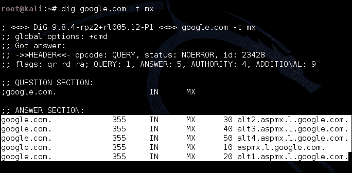
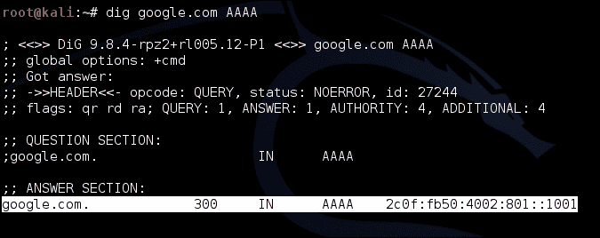

# 第三章网络侦察

现在，您已经掌握了 bashshell 的工作方式，并学习了一些技巧和技巧来有效地使用它，我们可以继续使用 shell 和 Kali-Linux 命令行实用程序来收集有关您在日常工作中所处网络的信息。

在本章中，我们将了解如何使用 Nmap、Whois、Dig 和各种其他网络信息获取工具来了解本地网络或外部网络上主机的安全状况。

在下一节中，我们将介绍一个名为`whois`的工具，该工具有助于查询 Whois 服务器有关组织及其负责的 IP 地址和域的信息。

# 询问谁是服务器

Whois 服务器保存关于某些组织负责或严格关联的 IP 地址、域名和其他网络寻址相关信息的信息。当您请求有关 Whois 记录的信息时，您所做的只是使用一种称为 Whois 的特殊应用程序协议查询 Whois 服务器上托管的数据库。本协议的详细内容参见*进一步阅读*一节。

在渗透测试期间，您可能会得到一个要使用的 IP 地址列表，或者一个解析为 IP 地址的域名。通常，您可能想知道此 IP 属于谁，以及可能托管在同一逻辑网络块上的其他内容；Whois 是发现此类信息的一个很好的工具。

从命令行查询谁是服务器是通过使用名为`whois`的工具完成的，该工具随许多 Linux/Unix 发行版（包括 Kali）一起提供。

当您使用`whois`工具时，可以指定许多选项。在这里，我们将只讨论几个非常有用的问题。想要了解更多关于`whois`工具的信息，请参阅本章*进一步阅读*部分中包含的信息。

Whois 的基本功能是返回与 IP 地址相关联的一组给定属性：这组属性称为**Whois**记录。使用 IP 地址查找记录非常简单，只需启动以下命令：

```
whois [IP address]

```

例如，以下是如何检索其中一个 Google 服务器地址的 Whois 记录：

```
whois 74.125.233.83

```

上一个命令将产生以下输出：


当您运行 Whois 查询或查找时，您面前的称为对象，每个对象都有一组与之相关联的键值对属性。每个对象都有关于负责记录/对象本身的人的信息：这个人被称为维护者。由维护人员决定在描述相关对象时使用哪些属性。有许多可能的属性，这些属性在*进一步阅读*一节中为那些有兴趣了解完整故事的人提供了参考。

除了向 Whois 服务器查询与 IP 地址相关的信息外，您还可能希望查找与给定组织相关的某些信息，或者可能希望查找数据库中提及给定值的所有信息，例如，维护人员或给定电子邮件地址。这样做称为反向查找属性查找。以下命令用于执行此操作：

```
whois –i [attribute name] [value]

```

例如，考虑一下所有由雅虎用户维护的 WHOIS 记录。以下命令显示了如何执行此操作：

```
whois –i mnt-by  YAHOO-MNT 

```

### 提示

您可能想查找一些您最喜欢的 IP 地址范围的维护者名称，并在本例中使用它们。您可能无法获得与以下演示完全相同的结果，因为默认情况下，`Whois`工具可能依赖于特定于您所在国家的 Whois 服务器。

您可能需要从该查询中过滤出 IP 地址。最简单的方法是使用`grep`，如下命令所示：

```
whois –i mnt-by  YAHOO-MNT  | grep inetnum

```

您可能还希望仅过滤出 IP 地址，以便在其他工具中使用，如`Nmap`和`Dig`，我们将在本章的后续章节中介绍。下面是一个小 bash 命令，它将能够执行此操作：

```
whois –i mnt-by YAHOO-MNT | grep inetnum | awk –F\: '{ print $2 }'

```

上一个命令应产生以下输出：


可用于执行反向查询的其他属性如下所示：

*   `-i admin-c [NIC-handle or person]`
*   `-i person [NIC-handle or person]`
*   `-i nsserver [Domain or address prefix or range or a single address]`
*   `-i sub-dom [Domain]`
*   `-i upd-to [email]`
*   `-i local-as [autonomous system number]`

您可以使用其中的一些工具：请参阅*进一步阅读*部分以了解完整列表。

您还可以使用工具`whois`通过以下行查找与给定域名相关的域名：

```
whois [domain name]

```

例如，您可以通过以下方式使用它：

```
whois google.com

```

或者，您可以使用以下命令：

```
whois –d google.com

```

通过在查找中添加一点`grep`和`awk`魔法，您可以过滤出有用的信息，如域名，如下代码所示：

```
whois google.com | grep Server\ Name | awk –F\: '{ print $2 }'
whois –d google.com | grep Server\ Name | awk –F\: '{ print $2 }'

```

我们已经大致介绍了`whois`服务的功能，渗透测试人员和安全工程师可能会发现这些功能很有用。在下一节中，我们将介绍使用 Dig 执行 DNS 查询。

# 询问 DNS 服务器

DNS 服务器的存在是为了在计算机使用的 IP 地址和人们使用的域名之间提供关联。通常，公司和组织使用多个子域，甚至可能对给定的 IP 地址使用多个域名。当然，这意味着 DNS 服务器对于渗透测试人员来说是一个丰富的信息，他们希望定义一个组织的公共足迹并绘制出他/她的攻击面。

## 使用挖掘

我们将在这里使用的第一个命令行工具称为**Dig**。Dig 本质上是一把 DNS 查找瑞士军刀，可以帮助您了解给定域或与 IP 地址相关的域的所有信息。使用 Dig，您将模拟浏览器和其他网络应用程序在与世界各地的 DNS 服务器交互时实际执行的各种查询。有些查询甚至模拟其他 DNS 服务器的行为。让我们看看`dig`是如何工作的，以及我们如何在渗透测试中充分利用它。

使用`dig`最简单的方式是提供一个域名供其查找。以下命令显示了如何执行此操作：

```
dig [domain name]

```

例如，您可以按如下方式为域尝试`google.com`：

```
dig google.com

```

上一个命令将产生以下输出：


上一个屏幕截图中突出显示的输出显示了返回的实际结果，即 Google 的 IP 地址。

您还可以使用以下`type`选项，让`dig`知道您正在查找的记录类型：

```
dig [domain name] [type]

```

例如，如果您正在查找`google.com`的邮件交换记录（MX 记录），您可以向`dig`提供以下选项：

```
dig google.com MX

```

否则，您可以按如下方式使用`–t`选项：

```
dig google.com –t MX

```

如果命令执行正确，您的输出应该类似于以下屏幕截图：



以下是您可以使用`dig`查找的记录类型：

*   `A`：这是地址记录，保存查询域关联的 IP。
*   `AAAA`：这是 IP 版本 6 的地址记录。
*   `CNAME`：这是规范名称记录，返回指定域为规范记录的域名。这就像询问`dig`提供的域是否是另一个域的昵称，或者更准确地说，给定的域名是否使用另一个域的 IP 地址，`dig`返回这些域。
*   `MX`：这是邮件交换记录，列出了作为消息传输代理与提供的域关联的地址。您可以使用它来查找给定域的邮件域。
*   `PTR`：这是指针记录的，通常用于反向 DNS 查找。
*   `SOA`：这是权限/区域记录的开始，它将返回与所提供域的主域服务器“authoritive”相关的记录。
*   `AXFR`：用于权限区域转移，要求给定名称服务器返回与给定域相关的所有记录。现代 DNS 服务器不应远程启用此选项，因为它提供了大量有关泄露漏洞的信息（主要是内部地址泄露），并支持相当有效的拒绝服务攻击。

还有许多其他有趣的记录类型。我在这里列出了最常用的。如果您想了解其他人的情况，请查看本章末尾*进一步阅读*部分中的 RFC。

下面的命令是一些正在运行的记录类型的示例：

```
dig google.com AAAA

```

上一个命令应返回如下屏幕截图所示的结果：



否则，您可以查找`mail.google.com`是其规范名称的域。这是使用以下代码完成的：

```
dig mail.google.com CNAME

```

上一个命令应产生以下输出：


通常，您可能希望跳过 DNS 查询返回的所有详细信息，只返回重要数据，即您请求的地址。`+short`选项允许您执行此操作。它的使用如以下命令所示：

```
dig twitter.com +short 

```

如果将`dig`用于管道和 bash for 循环或其他脚本，则该选项允许`dig`更易于管理，因为它减少了过滤所有其他输出的工作量。例如，您可以将`dig`与`whois`一起使用，如下所示：

```
for ip in `dig www.google.com +short`; do whois $ip; done

```

Dig 还允许使用`–x`选项进行反向 IP 解析。例如，如果要找出与给定 IP 关联的域名，可以使用以下命令：

```
dig –x [IP address]

```

通常，您可能有一个很长的 IP 地址列表，或者您已经通过其他方式（例如使用`whois`）列举了一个列表，并且您希望找出其中哪些映射到 IP 地址。现在，您可以手动启动每个 IP 的`dig`查询。但是，使用一点 bash 脚本和 dig，您可以非常轻松地自动化整个过程。让我们假设您拥有的 IP 位于一个文件中，每个 IP 位于各自独立的行中。您可以启动以下命令来反向查找所有这些文件：

```
for IP in `cat [ip list]`; do echo "[*] $IP -> "`dig –x $IP +short`; done

```

在前面的命令中，`[ip list]`将是包含所述 IP 地址的文件。

这就是`dig`工具和 DNS 协议的基本介绍。我敦促您在*进一步阅读*一节中阅读更多关于 DNS 工作原理的内容。接下来的几节将讨论允许您使用暴力强制和其他开源智能收集从 DNS 服务器恢复记录的工具。提到的两种工具通常被渗透测试人员作为最后手段使用，因为它们对记录进行暴力攻击，并且是挖掘的一种非常积极的替代方法。

## 使用 dnsmap

有时，您可能需要强制执行域名或子域，因为对于给定的主机或网络，如果其他选项（如`dig`和`whois`没有为您提供足够的信息，则这些域名或子域很难枚举。在这样的时代，像`dnsmap`和`dnsenum`这样的工具非常方便。

使用`dnsmap`非常简单。如果您一直遵循我们介绍的其他命令，那么这应该是轻而易举的事。

以下为`dnsmap`的使用说明书：

```
dnsmap [domain] [options]
[domain] := domain name to look up
[options] := [ -w WORDLIST | -r RESULTS-FILE | -c CSV-RESULTS-FILE | -i IP-IGNORE-LIST ]

```

在我们了解这些选项的含义之前，让我们先看看`dnsmap`在其最基本的调用中做了什么，即没有选项：

```
dnsmap [domain]

```

例如，考虑下面对查找 T0 域的查找：


如果在没有参数的情况下调用，`dnsmap`使用自己的内置单词列表来枚举域。这个单词列表可以在`/usr/share/wordlist_TLAs.txt`路径下找到。

以下为`dnsmap`选项：

*   `-w WORDLIST`：此选项接受单词列表作为参数。`dnsmap`将使用此词表枚举可能的子域。
*   `-r RESULTS-FILE`：此选项告诉`dnsmap`在哪里保存其操作结果。可能有数百个枚举的 IP 地址和子域，最好将它们保存在某个地方以便以后处理。
*   `-c CSV-RESULTS-FILE`：此与前面的选项相同，只是结果保存在**公共分离向量**（**CSV**文件）中，该文件是数据库常用的格式。
*   `-i IP-IGNORE-LIST`：此选项接受在查找过程中忽略的 IP 列表，以防它们混淆或给输出带来误报。

`dnsmap`就是这样：不是一个非常复杂的工具，但它总能完成任务！

# 枚举本地网络上的目标

这里将使用名为**网络映射器**（**Nmap**）的工具和另一个名为**Arping**的工具来枚举本地网络上的目标。Nmap 本身是网络评估的事实标准，几乎可以做 Hping、Fping 和 Arping 所能做的任何事情。在许多情况下，尤其是在防火墙评估中，渗透测试人员需要能够微调发送的数据包，并对精确收集的数据执行分析。像 Hping、Fping 和 Arping 这样的工具非常适合于此，因为它们允许渗透测试人员为几乎任何需要的网络协议构造任意数据包。

在下一节中，我们将介绍 ARP 工具，并演示如何使用它来执行基于 ARP 协议的发现。

## 使用 Arping 进行主机发现

ARP 是一个实用程序，允许您手工制作 ARP 或 ICMP 数据包，并将其发送到本地网络上的任意主机。当然，这是枚举活动主机的好方法。它也是一个非常信息驱动的工具，实际上直接将 ICMP 和 ARP 回复打印到屏幕上。

下面的示例将演示 Arping 命令的一些简单用法。首先，在我们介绍一些选项和寻址模式之前，让我们看看简单的 ARP ping 是如何实现的：

```
arping [IP Address]
arping 192.168.10.1

```

以下屏幕截图是您的输出应该是什么样子的，除了返回 MAC 地址和可能使用 IP 地址之外：


如果您收到来自主机的回复，则强烈表明所述主机实际上存在于网络上。当然，由于 ARP 协议缺乏加密强度，因此无法保证这些信息严格真实。对于通过不安全协议进行通信的所有信息，您应该记住这一点。

您可能希望浏览给定子网上的 IP 列表。使用一点 bash 脚本，您可以通过以下方式完成。以下代码将在本书的网站上提供：

```
#!/bin/bash
PREFIX=$1
INTERFACE=$2
for SUBNET in {1..255}
do
  for HOST in {1..255}
  do
    echo "[*] IP : "$PREFIX"."$SUBNET"."$HOST
    arping –c 3 –i $INTERFACE $PREFIX"."$SUBNET"."$HOST 2> /dev/null
  done
done
```

在前面的脚本中，我们使用了`–c`命令来确保只发送三个请求。我们还允许用户指定正在使用的接口，因为 Arping 通常不能很好地自主地查找接口。此外，必须在此处输入本地 IP 地址的前缀。因此，如果您想使用此脚本，请将其保存在一个文件中（在本例中，我们将其称为`arpsweep.sh`），并在使用默认以太网接口时按如下方式调用它：

```
. arpsweep 192.168 eht0 

```

否则，如果您使用默认无线 LAN 接口，则使用以下命令：

```
. arpsweep 192.168 wlan0

```

ARP 的其他选项如下所示：

*   `-c COUNT`：此仅表示发送`COUNT`请求量。
*   `-d`：此发现重复的回复。这个选项是一个很好的监控工具。如果你的网络中有人在欺骗另一台主机的 MAC 地址，它将能够检测到；攻击者通常这样做是为了发起中间人攻击。
*   `-i`：此为接口。不要试图自动找到接口；使用提供的一个。
*   `-p`：此为指定接口开启混杂模式，允许您指定自己以外的 MAC 地址作为源，即 MAC 欺骗。
*   `-r`：此显示原始输出，表示每次回复只显示 MAC 和 IP 地址。

对于寻址模式，选项如下：

*   `-s MAC`: This means use `MAC` as the source MAC address. This option works great if the network or selection of hosts you are enumerating use source MAC filtering by only serving responses to a select number of hosts.

    ### 提示

    在发送任何数据包之前，请尝试运行数据包捕获工具（本书后面将介绍），并尝试了解哪些通信模式是规则的。哪台主机正在使用哪种协议与哪台主机通话以及通话频率。这可能会让你尽可能地跟随网络的自然节奏，并可能完全不受 Snort 和其他 IDS/IPS 工具的影响。

*   `-S IP`：此选项指示使用 IP 作为源 IP 地址，即 IP 欺骗。如果基于主机的防火墙只允许有限数量的 IP 地址与之通信，则此选项非常适合欺骗其中一个允许的 IP 地址。
*   `-t MAC`：此选项指示使用`MAC`作为目标 MAC 地址。
*   `-T IP`：此选项指示使用`IP`作为目标 IP 地址。

就阿平而言，就是这样。我劝你试试出`arping`。当涉及到微调 ICMP 和 ARP 流量时，很少有工具能像 ARP 一样工作。如果你需要一点 ARP 协议的背景知识，我已经在*进一步阅读*部分提供了一些有趣的链接供你查看。

## 使用 Nmap 进行目标枚举

ICMP 有时可能被本地网络上的攻击者滥用，因为就其性质而言，ICMP 的设计不是为了提供安全性，也不是为了考虑任何当前的安全机制。这通常会导致攻击者滥用 ICMP 获取敏感信息或可用于确定或推断网络上主机的敏感详细信息。

首先，让我们使用 ICMP 协议探测主机的响应。Nmap 的 ICMP 探测使用规范类似于以下命令：

```
nmap –sn {OPTOINS}[host address | domain name | CDIR netmask | IP range]

```

以下是一些例子：

```
nmap –sn –v –-reason 192.168.10.0/24
nmap –sn –v –-reason 192.168.10.0-255

```

`–sn`开关告诉 Nmap 使用 ICMP 协议来确定上述范围内的主机是否可以访问，并且它还禁用端口扫描。`-v`表示详细模式，`–-reason`告诉 Nmap 实际打印有关其确定主机某些结果的原因的信息。上一个命令的输出如以下屏幕截图所示：


ICMP 协议是一种网络协议，用于从网络主机请求调试或故障排除信息。

其他主机发现选项包括以下内容：

*   `-PE`：此告知 Nmap 使用 ICMP 回显请求，这是您 ping 主机时发送的数据包。
*   `-PP`：告知 Nmap 使用时间戳请求。响应时间戳请求的主机通常在渗透测试中报告为结果。通常，默认和弱配置的加密库使用系统时间生成加密原语。`-PM`使用 ICMP 网络掩码请求；这些 ICMP 数据包最初是为了让网络工程师可以查询主机的网络配置信息而实现的。下面的命令就是一个例子：

    ```
    nmap –v –reason –PM 192.168.10.0/24

    ```

如果需要使用其他协议来识别目标，Nmap 提供了广泛的功能。以下是其中一些选项：

*   `-PS TCP SYN`**标志扫描**：此选项向主机发送 SYN 数据包，并通过解释响应或缺少响应来确定它们是否实际在网络上。
*   `-PA TCP ACK`**标志扫描**：此选项告知 Nmap 向目标发送 TCP ACK 标志，以确定其是否处于活动状态并响应数据包。网络上的机器通常会尝试严格遵守 TCP 协议标准，并通过发送包含 REST 数据包的数据包来响应设置了 ACK 标志的数据包。
*   `-PO IP`**协议 ping**：此选项通过侦听设置了 REST 标志的 TCP 数据包来枚举目标主机支持的协议，因为活动主机通常会以这种方式响应为协议号设置了任意标识符的无效数据包。

有关 Nmap 中有关主机发现的更多选项，请参阅*进一步阅读*部分中包含的链接。

# 总结

在本章中，我们重点介绍渗透测试人员在安全评估期间收集目标网络信息的基本方法和工具。

本章首先演示了 Whois 工具以及可用于自动化 Whois 工具、进行非常有意义的查找以及将 Whois 的输出与其他有用工具集成的技巧。然后我们继续讨论 DNS 协议，并介绍了 Kali Linux 命令行中可用的工具，这些工具可用于从 DNS 服务器获取有关特定目标的信息。我们具体讨论了`dig`和`dnsmap`。在此之后，我们介绍了如何通过使用网络中常用的轻量级寻址协议来枚举本地网络上的目标。目标枚举部分重点演示如何使用 ARP 和 Nmap 枚举本地目标。

# 进一步阅读

*   [数据库查询参考手册 http://www.ripe.net/ripe/docs/ripe-358](http://www.ripe.net/ripe/docs/ripe-358)
*   在[处挖掘（1）Linux 手册页 http://linux.die.net/man/1/dig](http://linux.die.net/man/1/dig)
*   在[的域名系统（DNS）中存储证书 http://tools.ietf.org/html/rfc4398](http://tools.ietf.org/html/rfc4398)
*   域名–在[的实施和规范 http://www.ietf.org/rfc/rfc1035.txt](http://www.ietf.org/rfc/rfc1035.txt)
*   Nmap 在线图书[http://nmap.org/book/toc.html](http://nmap.org/book/toc.html)