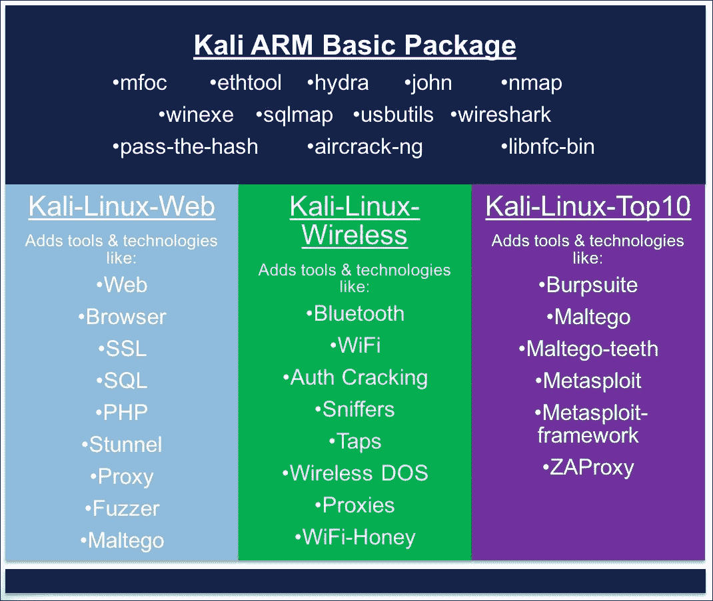
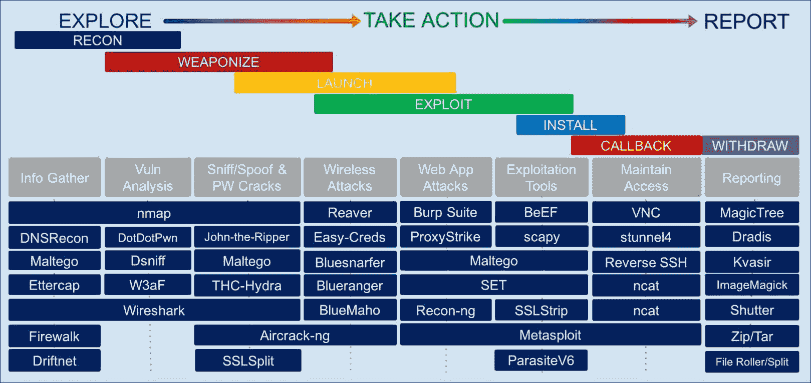
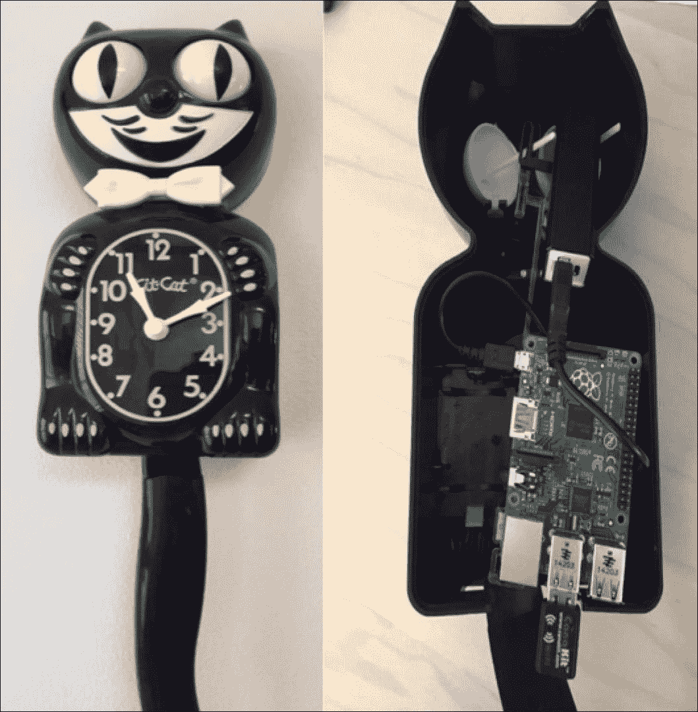

# 三、策划攻击

在本章中，我们开始深入探讨攻击的方法。我们将重点调整最初由洛克希德·马丁公司改编的**网络杀戮链**模型。Kill-Chain 模型是开发销售渗透测试计划的一个很好的模型，因为它是以入侵为中心的。

我们将经历网络杀戮链的多个阶段，以更好地理解该模型及其与我们的攻击思维过程的关系，并开发我们自己的模型版本，称为**渗透测试杀戮链**模型。Kali 安装了大量工具供我们使用，因此我们将这些工具映射到渗透测试杀死链模型，以帮助更好地了解在何处使用哪些工具。因为有太多的工具可用，我们将介绍有线和无线的通用工具，我们将在本书的其余部分讨论这些工具，以及一些我们将添加到我们的武库中的非标准工具。最后，我们将用我们如何最好地定位 Pi 来做最大的好事，或者相反地，做最大的伤害（没有痛苦就没有收获，对吧？）。

### 注

考虑到渗透测试的敏感性和潜在影响，在进行测试之前，我们需要获得各方签署的书面许可。在以后的阶段中，如果没有有效的合同或许可证，则会出现主动利用和安装的情况，这将为您提供不利的证据。

本章涵盖以下主题：

*   渗透试验压井链的阶段
*   准备渗透测试
*   web、有线和无线攻击的常用工具
*   Kali for Pi 中的映射工具到 Kill 链
*   向武器库中添加非标准工具
*   定位 Pi

# 了解网络或入侵杀戮链

杀伤链在国防工业中已经使用多年，用于描述一项活动的各个阶段，并帮助概述每个阶段的作用、我们如何进入这些阶段以及我们如何退出这些阶段。杀死链是迈克尔·波特（Michael Porter）在 20 世纪 80 年代推广的价值链分析的一个改编版，以行动为重点。这些类型的分析或*杀伤链*的擅长之处在于帮助我们理解完成任务、穿透目标网络/系统的过程。洛克希德·马丁公司（Lockheed Martin）通过分析敌方战役和入侵杀死链，提出了入侵游戏中网络杀死链的概念，并撰写了《情报驱动的计算机网络防御》（论文编号*）。（[http://www.lockheedmartin.com/content/dam/lockheed/data/corporate/documents/LM-White-Paper-Intel-Driven-Defense.pdf](http://www.lockheedmartin.com/content/dam/lockheed/data/corporate/documents/LM-White-Paper-Intel-Driven-Defense.pdf)*

为了节省我们一点时间，以下是他们网站上的图片：

为了模拟黑客如何解剖目标并对其采取行动，该模型由七个不同的阶段组成，从左向右移动。

## 侦察

这是该过程的研究阶段。使用公开信息做功课的攻击者工作很容易，因为对于那些能够有效使用搜索引擎的人来说，信息量惊人。甚至在垃圾堆中翻找也是一种有效的方法，就像初步的社会工程一样。在我们的努力中，我们希望给予这一阶段很大的关注，因为我们的客户希望我们尽可能多地披露可用的敏感信息。每一次攻击和威胁都可能利用不同的来源和数据泄漏，因此我们希望尽可能减少潜在来源的暴露。在某些情况下，我们将获得**侦察**数据并被要求跳过，而在另一些情况下，我们将被要求表现得更像黑帽黑客，自己动手。侦察可能是测试中成本最高的阶段，但我们做得越好，成功利用的速度就越快。

## 武器化

一旦攻击者发现了某种可能的攻击方式，他们就开始精心设计攻击，或*利用*漏洞，并根据目标进行调整。鉴于这种情况通常发生在目标网络之外，因此几乎不可能进行检测。我们也将利用这一阶段开始实施侦察衍生的攻击计划，注意客户对各种攻击类型和载体的敏感性，以策划我们的攻击。例如，医疗保健客户可能更容易受到无线中间人攻击和对其连接的医疗设备的攻击。如果我们的工作做得好，我们将向客户展示我们如何在业务中使用所有这些潜在的方法。

## 交付

攻击现在处于活跃状态-我们如何有效地与目标沟通并确保其得到实施？在此阶段，我们看到攻击者使用 web 和电子邮件流量以及物理设备（如 USB 驱动器和外围设备）来交付初始负载。我们应该测试这些潜在的方法，以确保我们暴露了客户环境中的弱点。我们的发现通常会产生更多与培训相关的解决方案，因为这一阶段受最终用户意识的影响最大。

## 剥削

所有的家庭作业和技巧都归结为这一点——攻击会通过黑客发现的漏洞吗？在这个阶段，我们的武器试图在系统、设备或主机上使用相应的漏洞，并建立初始存在状态，作为最终目标，或在机器上删除根访问工具包或相关负载。用户意识也在这里接受测试-主动补丁管理和强化，再加上清晰、简洁、易于理解的报告流程和问题上报，可以在造成任何损害之前关闭我们的入侵。

## 安装

安装是实际恶意软件感染主机的地方。在攻击的这一点上，攻击者（或我们，狡猾的渗透测试人员）将已经利用环境中的漏洞，我们将建立一个滩头阵地。这可能意味着实现权限提升、放置**根访问工具包**（**RAT**、或*获取根目录*），甚至放弃勒索软件的惰性测试版本——这是所有组织最迫切关注的问题之一。

## 指挥控制

攻击者使用 C&C 的方式与我们使用 C&C 进行远距离破坏的方式非常相似，只是在他们的情况下，他们使用 C&C 隐藏勒索软件密钥、直接 DDoS 攻击或通过权限提升或横向移动跳转到环境中的另一台机器。对于许多威胁，此阶段将决定攻击的成败。如果 C&C 能够建立通信，攻击可以继续破坏目标。如果目标环境的防御系统（IP/ID、行为分析工具）能够检测到并对其采取行动，则攻击可能无法实现其目标或传播到环境的其他部分。

## 行动

在这一点上，黑客的攻击在技术上已经成功，但现在是掠夺目标的时候了。攻击者将希望通过其现有的滩头阵地窃取账户信息、财务数据、知识产权和任何感兴趣的东西。他们甚至可能利用这种存在来发动其他攻击或扰乱目标（勒索软件和 DoS 攻击在这里盛行）。作为测试人员，我们可以告诉客户很多关于数据丢失预防和漏洞检测的政策在实践中有多宽松。如果加密、访问限制和分段到位，并且用户遵守适当的存储和传输策略，信息丢失将减少。如果正确配置分段和行为工具，则可以将后续攻击和任何恶意软件的传播降至最低。

# 准备渗透试验

当我们通过[第一章](1.html#ch01 "Chapter 1. Choosing a Pen Test Platform")、*选择笔式测试平台*、[第二章](2.html#page "Chapter 2.  Preparing for Battle")、*备战*时，我们制作了一台精巧、中庸的渗透测试机。Raspberry Pi 3 本身就是一个功能强大的平台——通过我们安装的扩展 SD 卡，我们甚至可以安装完整的 Kali Linux 发行版。这是一个很好的培训选择，但现实世界的渗透测试需求将意味着我们可能会部署多个传感器，并在远处协调我们的测试。在处理更密集的任务的情况下，我们需要接受 Raspberry Pi 3 不能单独完成这项任务。

平台不是唯一的考虑因素。在渗透测试中，我们需要 Pi 做的大部分工作将取决于我们的合同内容、工作范围以及我们可能使用的其他工具来完成这项工作。使用单个 Pi 与 C&C 服务器通信并自行完成大部分工作时，较小的渗透测试范围可能会很好。更大的努力将需要在不同的地方部署多个传感器（Pi 或其他传感器）来组织更复杂的攻击，在这些情况下，繁重的处理工作很可能会集中起来，而为 C&C 服务器使用而过滤原始数据将是至关重要的。在任何情况下，部署多个 Raspberry Pi 传感器不仅提供了一种成本效益高的扩展方式，而且还提供了一种低调、始终存在的方式，使我们能够在舒适的家中随时利用。

目标环境也可能决定我们的 Raspberry Pi 如何对外通信。对于我们的 Pi 来说，在测试期间秘密地使用隧道和封装，锁定连接可能更有意义，而在其他情况下，Pi 可能会以不频繁的间隔（例如间谍的*死点*信息）访问，以更好地掩饰其对目标操作员的存在。

因此，当我们继续阅读本章并进入[第 4 章](4.html#ch04 "Chapter 4.  Explore the Target - Recon and Weaponize")、*探索目标——侦察并武器化*、[第 6 章](6.html#ch06 "Chapter 6.  Finishing the Attack - Report and Withdraw")、*完成攻击——报告并撤回*时，我们将看到如何利用覆盆子 Pi 达到最佳效果（秘密、内部访问）还有 C&C 服务器来完成繁重的工作。我们选择的大多数工具都可以在任何一个位置运行，但我们将尝试展示什么是有意义的。

# 网络、有线和无线攻击的常用工具

[的人们 https://www.kali.org/](https://www.kali.org/) 和攻击性安全（负责 Kali 及其前身 Backtrack Linux 的团队）使 Kali 成为最通用的发行版之一。除了为数量惊人的平台和体系结构提供特色之外，它们还使我们能够简单地根据需要选择完整发行版的子集。ARM 平台（如 Pi）的基本映像包括相当小的应用程序子集，我们可能还需要一些应用程序来实现我们的目标。这些工具子集称为**元包**，帮助我们快速获取软件包及其对作业的依赖关系。与我们的工作更相关的元包可以在下图中看到：

其他元包（GPU、取证、PWTools、VoIP 和 SDR）确实存在，但在我们的渗透测试用例中使用有限。这些工具集更有可能在我们的 C&C 服务器或功能更全面的计算机上登记，用于其他任务，如事件响应、数据恢复和密集型加密解决方案。

Raspberry Pi 3 比原始的 Pi B+更适合处理完整安装，但我们将通过关注合同规定的目标并为工作选择合适的工具来实现最佳性能。

# 将我们的工具映射到渗透测试压井链

当我们进行渗透测试时，我们试图模拟实际入侵者或攻击者用于非法访问或以其他方式破坏目标系统的行为。在本章中，我们将讨论如何规划渗透测试，模仿前面讨论的网络杀戮链，该链通常用于破解黑客如何破坏其目标。出于我们的目的，我们对杀戮链采取了一些自由，并制作了渗透测试版本。在这个版本中，我们尽了最大努力展示了我们在本书中讨论的不同工具如何帮助我们在整个操作过程中获得 Raspberry Pi：

根据渗透测试压井链，了解可能要求我们进行的渗透测试类型对我们很有帮助，因为它们都会影响我们实际要进行的每个阶段的数量。白盒测试指的是我们获得了侦察阶段通常会收集到的所有信息，因此，我们通常会在公开状态下快速移动（不需要隐形）。如果我们以员工或顾问的身份针对新项目的可交付成果进行测试，例如测试新的 web 服务器或访客租户，但没有密集的侦察，甚至可能没有武器化阶段，我们可能会看到这种类型的测试。如果在这里进行侦察，可以通过更开放的方法，如面谈、亲自检查或审计。黑匣子测试更像是伪装和匕首——我们将在事先不知情的情况下进行攻击，因此侦察和武器化阶段至关重要，后续阶段将取决于这些发现。黑盒测试可能是红队或对抗性渗透测试的一部分，通常在没有警告大多数操作员的情况下进行，并有望帮助捕获目标用户和设备的实时响应和行为。灰箱测试，似乎是显而易见的，落在中间的某个地方，因此我们可以对目标和操作团队的不同部分有不同程度的信息和披露。在灰盒测试的情况下，我们可能能够缩小早期阶段的工作范围，仅填写图片。

测试的类型和客户的要求将决定我们实际需要哪些工具。如果我们能够将我们的要求应用于渗透测试压井链，它将帮助我们保持专注和高效。不必要的活动会浪费我们的时间和客户的金钱，但它们也会产生噪音，可能会泄露我们的隐私。如果这是一个黑盒测试，那么被抓到是不好的，原因有两个。一些客户可能会允许它继续，但在那些我们正在进行红队操作（模拟攻击，而不是基于项目的重点测试）的地方，我们的声誉可能会受到影响，我们在这一领域的工作时间不会太长。然而，客户是错过机会的人——他们没有经过真正的测试就离开了约定，结果，他们浪费了资金，离开时没有真正了解他们的安全态势和漏洞。他们甚至可能把我们的失败误认为是一种错误的安全感，这种安全感阻止他们改进架构并继续追求一个安全的环境。

## 武库新增非标工具

尽管 Kali Linux 附带了大量可以通过元软件包安装的安全工具，但在这些软件包之外，我们可能还需要安装一些其他有用的工具来执行本书中介绍的各个阶段。这些工具中的一些可能不是每个任务都需要的，其中一些可能与我们可能已经在使用的其他安全工具类似，但我们想列出我们用于良好起点的工具。所有这些工具都是通过终端在命令行上使用`apt-get`或`wget`安装的。

以下是 Kali 发行版之外的安全/实用工具列表，我们将在本书中安装并讨论这些工具，作为 Raspberry Pi 阿森纳的一部分。它们没有特定的顺序：

*   **xRDP**：xRDP 是一种开源的**远程桌面协议**（**RDP**）服务器，它将接受来自任何 RDP 客户端（如 Microsoft 的远程桌面客户端）的 RDP 连接。
*   **tightVNC**：tightVNC 是一个**虚拟网络计算**（**VNC**）应用程序，允许我们使用 VNC 客户端连接到 Raspberry Pi 到 VNC 服务器，并为我们提供一个可以管理的远程桌面。
*   **响应方**：响应方为**链路本地组播名称解析**（**LLMNR**）、**Netbios 名称服务（NBT-NS**）和 MDNS 毒药，内置多协议流氓认证服务器。
*   **gparted**：gparted 是用于对本地磁盘进行分区的图形工具。
*   **openSSH**：openSSH 允许我们使用 SSH 客户端安全地连接到 Raspberry Pi。
*   **stunnel4**：stunnel 是使用 TLS 的客户端和服务器之间的代理。
*   **squid**：squid 是我们用来测试 stunnel 配置的缓存代理。
*   **漂移网络**：漂移网络是一种用于嗅探各种图像类型的实用工具。音频和 MPEG4 图像并显示在终端上。
*   **sslstrip**：sslstrip 是一种代理 HTTPS 连接并将其作为 HTTP 发送给客户端的工具。这样，可以使用 tcpdump 获取凭证等项，因为它们将以明文形式呈现。
*   **Easy creds**：利用其他安全工具获取凭证。
*   **gedit**：gedit 是基于**GNU 网络对象模型环境**（**GNOME**）的文本编辑器。
*   **proxychains**：这是一个通过代理强制 TCP 连接的工具。
*   **imageMagick**：用于显示、转换和编辑图像的工具。
*   **快门**：快门是一种屏幕截图工具。
*   **zip**：这是一个针对 Linux 的归档工具。
*   **文件滚轴**：文件滚轴是档案管理员。
*   **snort**：snort 是一个开源的网络入侵预防和检测系统（IPS/IDS）。

## 定位 Pi

渗透测试的树莓 Pi 的位置也取决于我们尝试进行的测试类型。如果我们是一名内部评估师或审计师，在白盒渗透测试中测试我们自己的公司网络，那么我们就不必担心有人找到我们的树莓 Pi，从而破坏整个运营。黑盒测试是另一个故事-我们将要仔细考虑风险与利益的覆盆子 PI 内的目标。

请记住，我们这里的主要目标是测试目标网络的部分，以了解其当前安全控制的有效性。我们可以根据这些测试提供或推荐补救计划，帮助客户修复可能存在的任何漏洞/安全漏洞。这样，我们发现的任何问题都可以在我们不信任的人发现并利用这些问题之前得到解决。我们的最终目标是帮助我们的客户保护网络可用性和他们的宝贵信息，无论是**个人识别信息**（**PII**）、信用卡信息还是专有公司机密。我们希望将 Raspberry Pi 定位在网络中最适合我们的测试所要完成的部分。一般而言，这些职位如下：

*   **网络外部**：如果我们从外部开始，我们通常会像一个外部威胁一样进行测试，试图从目标网络的外部进入。在这里，我们将尝试通过边缘安全防御（通过已知的漏洞攻击、弱防火墙规则集等）来访问网络。或者，我们可能试图利用公开的服务或网站来获取宝贵的数据。有时这是一个黑帽子练习，但大多数主要合规实体（如 PCI）都要求在目标环境上进行外部渗透测试，以确保这些易受攻击的服务不公开，并且这些变体可能本质上是白帽子。
*   **网络内部**：白帽测试的一部分可能需要在此处放置，但黑帽测试可能取决于此处的持续存在，将我们的覆盆子 Pi 置于良好的有利位置而不被检测到的挑战可能是巨大的。有时，没有什么可以替代现场的存在，当进入渗透测试杀伤链的某些后期阶段时，有内部人员（树莓皮或转化目标僵尸）发动这些攻击是至关重要的。我们还必须考虑与内幕盒的通信。

### 提示

我们应该确保记录整个测试过程中的所有步骤，包括我们如何决定设备的放置和随后的插入。这将有助于开发我们的报告，并确保我们的客户知道我们在目标环境中的活动位置。

白盒测试位置有时由客户决定，在某些情况下，甚至是环境中的永久固定装置。然而，黑盒测试完全是另一回事。当我们放置树莓 Pi 时，我们需要使用我们在社会工程和隐形方面的所有技能来完成工作并获得所需的有利位置。侦察肯定会帮助我们确定我们需要把树莓皮放在哪里，但也需要帮助我们首先确定如何把它放在那里。显然，在数据中心内拥有一个黄金位置是非常棒的，但物理安全和人员配置很可能会使这成为不可能。因此，我们需要权衡安置的风险和好处，并将这些因素纳入我们的计划。

例如，我们可以将 Pi 插入一个网络插孔，该插孔目前正被一台打印机占用，这确实是一个很棒的地方。也许从来没有人在打印机后面检查过任何东西，所以我们的树莓 Pi 可以在任何人注意到之前插入该端口很长一段时间。如果目标网络使用某种 802.1x、粘性 Mac 或端口配置文件，那么可能有人已经知道我们的设备在网络上。如果那样的话，我们将来可能需要做一些更好的侦察。

如果物理检测是一个大问题，我们总是可以尝试将树莓 Pi 隐藏在一个对象中，例如时钟或接线盒。这种放置方式可以让我们的树莓 Pi 通过无线监听或透明地嗅探并获取所有类型的信息。

下图显示了我们如何在一个时钟内隐藏覆盆子圆周率：

无论位置如何，一旦我们将树莓 Pi 放在我们想要的位置，我们就可以开始收集数据并测试控件，以查看我们可以在何处旋转以及可以看到和捕获什么。

### 提示

在渗透测试期间，我们应小心，不要执行任何会导致机器和/或网络瘫痪的测试，除非目标公司的赞助商明确要求这样做。大多数情况下，此类测试应以非侵入性为目标进行。

# 总结

在本章中，我们使用渗透测试压井链模型讨论了渗透测试的不同阶段。使用这个模型，我们还能够将我们将要使用的一些 Kali Linux 工具映射到渗透测试杀死链中的适当阶段。我们还讨论了这些不同的安全工具，以及在 Kali Linux 上提供的不同类型的元软件包。除了这些工具包之外，我们还讨论了一些附加的安全工具/实用程序，这些工具/实用程序不是这些包的一部分，我们发现它们在各种渗透测试场景中都很有用，并且在本书中使用过。

最后，我们不仅研究了如何准备渗透测试，还研究了如何以及在何处定位树莓 Pi。这是一个非常重要的主题，因为我们测试的成功与否很大程度上取决于传感器的位置。

在[第 4 章](4.html#ch04 "Chapter 4.  Explore the Target - Recon and Weaponize")*探索目标-侦察和武器化*中，我们将通过观察渗透测试杀伤链的侦察和武器化阶段开始深入渗透测试。其中的主题和工具将集中于我们如何确定目标的范围和特征，然后将其转化为行动计划，其中包括针对目标环境中发现的任何软点规划攻击。