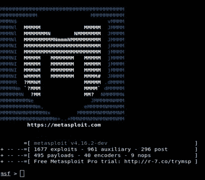
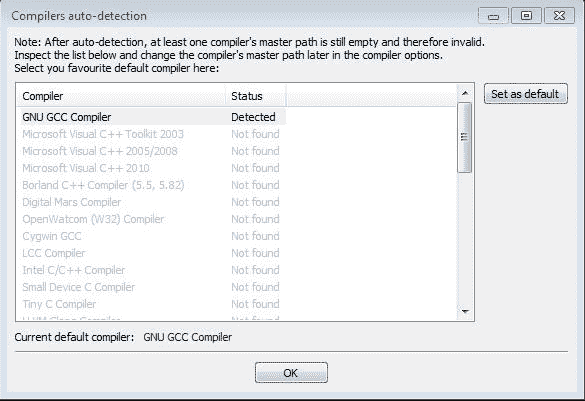
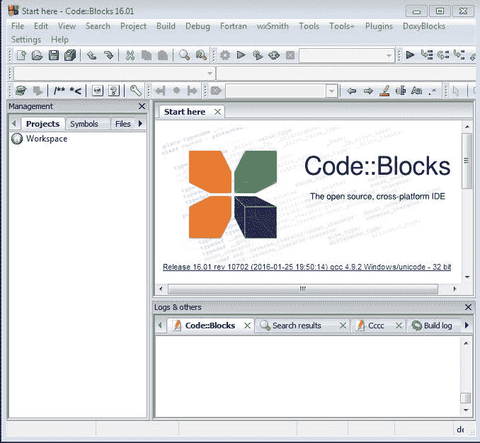
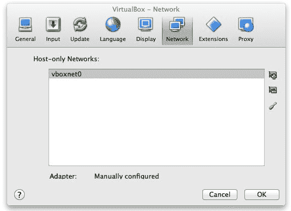

# 二、实验室设置

在本章中，我们将建立一个独立的实验室，用于本书的其余部分。我们将看到如何安装 Metasploit Framework 等工具，以创建Shellcode并利用开发。在研究适用于 Windows 和 Linux 的 Python 编程语言之前，我们还将了解如何为 Microsoft Windows 安装 C 语言 IDE 和编译器。然后，我们将介绍如何安装和熟悉调试器接口

首先，我们需要三台机器。第一个是模拟远程攻击的攻击者，这将是 Linux 操作系统。在这里，我更喜欢 Kali Linux，因为它包含了我们需要的所有工具，同时我们还将安装一些额外的工具。第二个是 Ubuntu14.04LTSx64，第三个是 Windows7x64。

本章涵盖的主题如下：

*   配置攻击者的计算机
*   配置 Linux 受害者计算机
*   配置 Windows 受害者计算机
*   配置 Linux 受害者计算机
*   为程序集 x86 配置 Ubuntu
*   网络

您可以使用 VMware、KVM 或 VirtualBox，但请确保选择仅限主机的网络，因为我们不想将这些易受攻击的计算机暴露给外部世界。

# 配置攻击者的计算机

如前所述，攻击者机器将是我们的主要基地，我更喜欢 Kali Linux，但如果您要使用其他发行版，则必须安装以下软件包：

1.  首先，我们需要确保安装了 C 编译器；使用`gcc -v`命令：


2.  如果没有，只需使用`$ sudo apt-get install gcc`（Debian 发行版）或`$ sudo yum install gcc`（Red Hat 发行版）安装即可。接受并安装`gcc`及其依赖项。
3.  此外，我们将在开发中使用 Python 编程语言。大多数 Linux 发行版默认使用 Python，为了确保安装了 Python，只需使用`$ python -V`或`python`。然后 Python 解释器将启动（点击*Ctrl*+*D*退出）：


4.  对于文本编辑器，我使用`nano`作为 CLI 文本编辑器，`atom`作为 GUI 文本编辑器；`nano`也随大多数 Linux 发行版一起提供。
5.  如果要安装`atom`，请转到[https://github.com/atom/atom/releases/](https://github.com/atom/atom/releases/) ，您将发现测试版和稳定版。然后，为您的系统下载 Atom 软件包`.deb`或`.rpm`，并使用`$ sudo dpkg -i package-name.deb`（Debian 发行版）或`$ sudo rpm -i package-name.rpm`（Red Hat 发行版）进行安装。

这就是 Atom 接口的外观：


我们将在创建Shellcode和开发漏洞时使用 Metasploit 框架。要安装 Metasploit，我建议您通过[使用一体式安装程序 https://github.com/rapid7/metasploit-framework/wiki/Nightly-Installers](https://github.com/rapid7/metasploit-framework/wiki/Nightly-Installers) 。此脚本将安装 Metasploit 及其依赖项（Ruby 和 PostgreSQL）。看下一个示例（在 ARM 上安装 Metasploit，但与 Intel 相同）：

1.  首先，我们使用`curl`命令获取安装程序：

```
 $ curl https://raw.githubusercontent.com/rapid7/
        metasploit-omnibus/master/config/templates/
        metasploit-framework-wrappers/msfupdate.erb > msfinstall
```

2.  然后，我们使用`chmod`命令给它一个适当的权限：

```
 $ chmod 755 msfinstall
```

3.  然后，启动安装程序：

```
 $ ./msfinstall
```

4.  现在，它将开始下载 Metasploit 框架及其依赖项。
5.  要为 Metasploit Framework 创建数据库，只需使用`msfconsole`并按照说明操作即可：

```
 $ msfconsole
```

6.  然后，它将建立一个新的数据库，Metasploit 框架将启动：



7.  当我们要使用汇编程序设计语言时，让我们来看看汇编程序（AutoT0}）和链接器（AuthT1）。

8.  首先，我们需要使用`$ sudo apt-get install nasm`（Debian 发行版）安装`nasm`。根据 NASM 的网站，对于 Red Hat 发行版，您首先需要将此存储库作为`nasm.repo`添加到您的`/etc/yum/yum.repos.d`：

```
[nasm]
name=The Netwide Assembler
baseurl=http://www.nasm.us/pub/nasm/stable/linux/
enabled=1
gpgcheck=0

[nasm-testing]
name=The Netwide Assembler (release candidate builds)
baseurl=http://www.nasm.us/pub/nasm/testing/linux/
enabled=0
gpgcheck=0

[nasm-snapshot]
name=The Netwide Assembler (daily snapshot builds)
baseurl=http://www.nasm.us/pub/nasm/snapshots/latest/linux/
enabled=0
gpgcheck=0
```

9.  然后，使用`$ sudo yum update && sudo yum install nasm`更新并安装`nasm`和`$ nasm -v`以获得 NASM 的版本：


10.  使用命令`$ ld -v`获取链接器的版本：


# 配置 Linux 受害者计算机

这台机器将是 Ubuntu 14.04 x64。您可以从[下载 http://releases.ubuntu.com/14.04/](http://releases.ubuntu.com/14.04/) 。此外，我们还必须遵循前面关于`gcc`、Python 和`nasm`的说明。

现在，让我们安装一个名为 edb debugger 的非常友好的 GUI。您可以点击此页面[https://github.com/eteran/edb-debugger/wiki/Compiling-（Ubuntu）](https://github.com/eteran/edb-debugger/wiki/Compiling-(Ubuntu))或按照下一条指令操作。

首先，使用以下命令安装依赖项：

```
$ sudo apt-get install cmake build-essential libboost-dev libqt5xmlpatterns5-dev qtbase5-dev qt5-default libgraphviz-dev libqt5svg5-dev git
```

然后，克隆并编译 Capstone 3.0.4，如下所示：

```
$ git clone --depth=50 --branch=3.0.4 https://github.com/aquynh/capstone.git
$ pushd capstone
$ ./make.sh
$ sudo ./make.sh install
$ popd
```

然后，克隆并编译 edb 调试器，如下所示：

```
$ git clone --recursive https://github.com/eteran/edb-debugger.git
$ cd edb-debugger
$ mkdir build
$ cd build
$ cmake ..
$ make
```

然后，使用`$ sudo ./edb`命令启动 edb 调试器，打开以下窗口：


如我们所见，edb 调试器有以下四个窗口：

*   “反汇编程序”窗口将机器语言转换为汇编语言
*   “寄存器”窗口包含所有寄存器的所有当前内容
*   数据转储窗口包含当前进程的内存转储
*   堆栈窗口包含当前进程的堆栈内容

现在进入最后一步。出于学习目的，有必要禁用**地址空间布局随机化**（**ASLR**）。这是 Linux 中的一种安全机制，我们稍后将讨论它。

执行`$ echo 0 | sudo tee /proc/sys/kernel/randomize_va_space`命令即可。

此外，我们将在编译完成时使用`gcc`禁用堆栈保护器和 NX，使用：

```
$ gcc -fno-stack-protector -z execstack
```

# 配置 Windows 受害者计算机

在这里，我们将配置一台 Windows 计算机作为受害者计算机，即 Windows 7 x64。

首先，我们需要安装 C 编译器和 IDE，我建议使用*代码：：Blocks*，要安装它，请从[下载二进制文件 http://www.codeblocks.org/downloads/binaries.](http://www.codeblocks.org/downloads/binaries) 在这里，我要安装`codeblocks-16.01mingw-setup.exe`（最新版本）。下载并安装`mingw`版本。

在*代码：：块*的第一次引导时，将弹出一个窗口来配置编译器。选择 GNU GCC 编译器，单击设置为默认值，然后单击确定：



然后，IDE 界面将弹出：



现在我们有了 C 编译器和 IDE。现在，让我们开始安装调试器。

首先，x86 需要*免疫调试器*；从[下载豁免 https://debugger.immunityinc.com/ID_register.py](https://debugger.immunityinc.com/ID_register.py) 。填写此表单，下载，然后使用默认设置安装，它将要求您确认安装 Python。之后，我们需要为名为`mona`的调试器安装一个插件，该调试器由 Corelan 团队[创建 https://www.corelan.be](https://www.corelan.be) 。这是一个很好的插件，可以帮助我们开发。从他们的 GitHub 存储库[下载`mona.py`文件 https://github.com/corelan/mona](https://github.com/corelan/mona) ，然后复制到`C:\Program Files (x86)\Immunity Inc\Immunity Debugger\Immunit\PyCommands`：


这就是免疫调试器的外观，它由四个主要窗口组成，与 edb 调试器中的解释完全相同。

另外，我们现在有了 Python，要确认一下，只需导航到`C:\Python27\`。然后，单击 Python，Python 解释器将弹出：


现在，让我们安装 x64dbg。它也是 Windows x86 和 x64 的调试器，但对于 x86 Windows，没有什么比免疫调试器更好的了。

转到[https://sourceforge.net/projects/x64dbg/files/snapshots/](https://sourceforge.net/projects/x64dbg/files/snapshots/) ，然后下载最新版本。解压后导航至`/release`启动**x96dbg**：


然后，单击 x64dbg：


现在我们来看看 x64dbg 接口，它也包含四个主要窗口，正如 edb 调试器中所解释的：


# 为程序集 x86 配置 Ubuntu

这在本书中不是强制性的，但如果您想尝试 x86 的汇编，它已经包含在内。使用的机器将是 Ubuntu 14.04 x86，您可以从[下载 http://releases.ubuntu.com/14.04/](http://releases.ubuntu.com/14.04/) 。

我们必须按照前面的说明安装 NASM、GCC 和文本编辑器，我将使用 GDB 作为我的调试器。

# 网络

由于我们将运行易受攻击的应用程序，以便在受害者机器上进行漏洞研究并注入Shellcode，因此我们必须在配置每台机器后建立一个安全网络。这是通过使用仅限主机的网络模式来完成的，以确保所有机器都连接在一起，但它们仍将处于脱机状态，并且不会暴露于外部世界。

如果您使用的是 VirtualBox，请转到首选项|网络并设置仅限主机的网络：



然后，设置一个与外部 IP 不冲突的 IP 范围，例如：

*   **IP 地址**：`192.168.100.1`
*   **网络掩码**：`255.255.255.0`

然后，您可以从 DHCP 服务器选项卡激活 DHCP 服务器。

您应该在您的`ifconfig`中看到：

```
$ ifconfig vboxnet0
```

然后，在来宾计算机的适配器上激活此网络（例如，`vboxnet0`）：


如果您使用的是 VMware Workstation，请转到编辑|虚拟网络编辑器：


此外，您还可以确保仅主机网络已启动：

```
$ ifconfig vmnet1
```

然后，从来宾计算机设置中，转到网络适配器，并选择仅主机：与主机共享的专用网络：


# 总结

在本章中，我们安装了三个主要的操作系统：一个是模拟攻击者的机器来尝试远程攻击，第二个是 Ubuntu x64，第三个是 Windows 7，最后两个操作系统是受害者。另外，还有一台额外的机器来尝试组装 x86。

另外，我们在 Linux 中禁用了一些安全机制，只是为了学习，然后我们进行了网络配置。

在下一章中，让我们通过学习汇编来迈出一大步，这将使我们能够编写自己的代码，并使您真正理解计算机是如何执行每一个命令的。