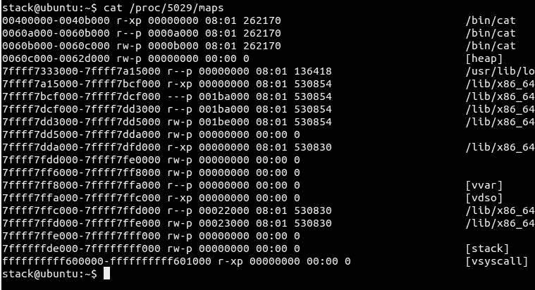
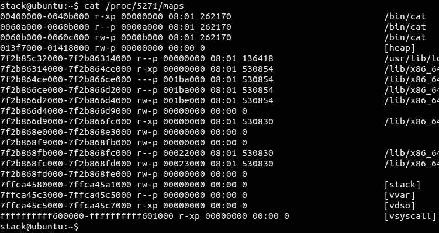
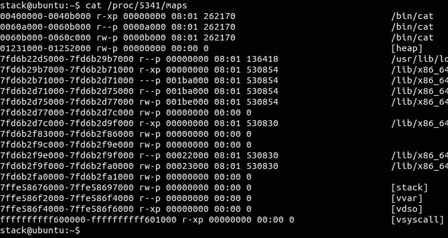
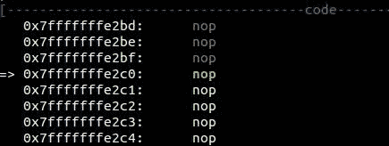

# 十二、检测和预防

最后，到书的最后一章。这里，我们将讨论防止缓冲区溢出攻击的安全机制。让我们将这些机制分为三部分：

*   系统方法
*   编译方法
*   开发人员方法

# 系统方法

在这一部分中，我们将讨论一些系统内核中的内置机制，以防止诸如 ASLR 之类的缓冲区溢出攻击。

**地址空间布局随机化**（**ASLR**）是一种针对溢出攻击的缓解技术，该攻击会随机化内存段，从而防止硬编码攻击。例如，如果我想使用 returntolib 技术，我必须获得函数的地址，这将在攻击中使用。但是，由于内存段的地址是随机的，所以唯一的方法是猜测该位置，是的，我们使用这种技术绕过 NX 保护，而不是绕过 ASLR。

对于安全极客来说，别担心；有很多方法可以绕过 ASLR。让我们来看看 ASLR 是如何工作的。打开 Linux 受害者计算机并确保禁用 ASLR：

```
$ cat /proc/sys/kernel/randomize_va_space
```

在以下屏幕截图中可以看到前面命令的输出：


由于`randomize_va_space`的值为`0`，ASLR 被禁用。如果启用，则将其设置为`0`：

```
$ echo 0 | sudo tee /proc/sys/kernel/randomize_va_space
```

现在，让我们看看任何应用程序的地址布局，例如，

```
$ cat
```

然后，打开另一个终端。现在，我们需要使用以下命令获取此过程的 PID：

```
 $ ps aux | grep cat
```

在以下屏幕截图中可以看到前面命令的输出：


`cat`的 PID 为`5029`。让我们获取此进程的内存布局：

```
$ cat /proc/5029/maps
```

在以下屏幕截图中可以看到前面命令的输出：



现在，让我们使用*Ctrl*+*C*停止`cat`过程，然后再次启动：

```
$ cat
```

然后，从另一个终端窗口运行以下命令：

```
$ ps aux | grep cat
```

在以下屏幕截图中可以看到前面命令的输出：


现在，`cat`的 PID 为`5164`。让我们获取此 PID 的内存布局：

```
$ cat /proc/5164/maps
```

在以下屏幕截图中可以看到前面命令的输出：


查看两个 PID 的内存布局；他们完全一样。所有内容都是在内存中静态分配的，例如库、堆栈和堆。

现在，让我们启用 ASLR 以查看差异：

```
$ echo 2 | sudo tee /proc/sys/kernel/randomize_va_space
```

确保已启用 ASLR：

```
$ cat /proc/sys/kernel/randomize_va_space
```

在以下屏幕截图中可以看到前面命令的输出：


然后，让我们开始任何流程，例如，`cat`：

```
$ cat
```

然后，从另一个终端窗口运行以下命令：

```
$ ps aux | grep cat
```

在以下屏幕截图中可以看到前面命令的输出：


`cat`的 PID 为`5271`。现在，阅读其内存布局：

```
$ cat /proc/5271/maps
```

在以下屏幕截图中可以看到前面命令的输出：



现在，让我们停止`cat`并重新运行它：

```
$ cat
```

然后，让我们捕捉一下`cat`的 PID：

```
$ ps aux | grep cat
```

在以下屏幕截图中可以看到前面命令的输出：


现在，阅读其内存布局：

```
$ cat /proc/5341/maps
```

在以下屏幕截图中可以看到前面命令的输出：



让我们比较两个地址。他们完全不同。堆栈、堆和库现在都是动态分配的，所有地址在每次执行时都是唯一的。

现在进入下一节，即编译器方法，如可执行空间保护和 canary。

# 编译方法

可执行空间保护是一种用于将内存中的某些段标记为不可执行的技术，如堆栈和堆。所以，如果我们甚至成功地注入了一个Shellcode，那么就不可能让这个Shellcode运行。

Linux 中的可执行空间保护称为**非可执行**（**NX**），Windows 中的可执行空间保护称为**数据执行预防**（**DEP**）。

让我们尝试使用[第 6 章](06.html#2D7TI0-5bf3e26315164e77bbeecc4f75207114)*缓冲区溢出攻击*中的示例：

```
#include <stdio.h>
#include <string.h>
#include <stdlib.h>

int copytobuffer(char* input)
{
    char buffer[256];
    strcpy (buffer,input);
    return 0;
}

void main (int argc, char *argv[])
{
    int local_variable = 1;
    copytobuffer(argv[1]);
    exit(0);
}
```

现在，在禁用 NX 的情况下编译它：

```
$ gcc -fno-stack-protector -z execstack nx.c -o nx
```

在 GDB 中打开它：

```
$ gdb ./nx
```

然后，让我们运行此漏洞：

```
#!/usr/bin/python
from struct import *

buffer = ''
buffer += '\x90'*232
buffer += '\x48\x31\xc0\x50\x48\x89\xe2\x48\xbb\x2f\x2f\x62\x69\x6e\x2f\x73\x68\x53\x48\x89\xe7\x50\x57\x48\x89\xe6\x48\x83\xc0\x3b\x0f\x05'
buffer += pack("<Q", 0x7fffffffe2c0)
f = open("input.txt", "w")
f.write(buffer)
```

执行漏洞利用：

```
$ python exploit.py
```

在 GDB 内部，运行以下命令：

```
$ run $(cat input.txt)
```

在以下屏幕截图中可以看到前面命令的输出：


现在，让我们在启用 NX 的情况下尝试相同的漏洞：

```
$ gcc -fno-stack-protector nx.c -o nx
```

然后，在 GDB 中打开它并运行以下命令：

```
$ run $(cat input.txt)
```

在以下屏幕截图中可以看到前面命令的输出：


那么，为什么代码会卡在这个地址？



因为它甚至拒绝从堆栈执行 No 操作（`nop`，因为堆栈现在是不可执行的。

让我们谈谈另一种技术，即堆栈金丝雀或堆栈保护器。堆栈金丝雀用于检测任何试图粉碎堆栈的行为。

当返回值存储在堆栈中时，在存储**返回地址**之前，会写入一个名为**金丝雀**值的值。因此，任何试图执行堆栈溢出攻击的行为都将覆盖**金丝雀**值，这将导致升起一个标志来停止执行，因为有人试图破坏堆栈：


现在，尝试使用前面的示例，但让我们启用堆栈`canary`：

```
$ gcc -z execstack canary.c -o canary
```

然后，让我们在 GDB 中重新运行它并尝试我们的漏洞：

```
$ run $(cat input.txt)
```

在以下屏幕截图中可以看到前面命令的输出：


让我们来看看为什么它失败了：


它试图将原始的金丝雀值与存储的值进行比较，但失败了，因为我们确实用漏洞中的任何内容覆盖了原始值：


正如您所看到的，检测到堆栈崩溃！

# 开发人员方法

现在进入最后一部分，即开发人员方法，任何开发人员都应该尽其所能保护代码免受溢出攻击。我将讨论 C/C++，但概念仍然是一样的。

首先，在使用任何字符串处理函数时，都应该使用安全函数。下表显示了不安全的函数以及使用的替代方法：

| **不安全功能** | **安全功能** |
| `strcpy` | `strlcpy` |
| `strncpy` | `strlcpy` |
| `strcat` | `strlcat` |
| `strncat` | `strlcat` |
| `vsprintf` | `vsnprintf`或`vasprintf` |
| `sprintf` | `snprintf`或`asprintf` |

此外，您应该始终使用`sizeof`函数来计算代码中缓冲区的大小。当涉及到缓冲区大小时，请尝试将其与安全函数混合，使其精确；那么，您的代码现在就安全多了。

# 总结

在本书的最后一章中，我们讨论了操作系统中的一些保护技术，以及 C 编译器中的一些技术，如 GCC。然后，我们继续讨论如何使代码更安全。

这不是结束。有更多的方法可以解决每种保护技术。有了这本书，你就可以继续你的旅程了。继续前进，我保证你会掌握这个领域！