# 一、打磨工具

一个工匠只有在他的工具和工具需要设置和维护时才是好的。在本章中，我们将介绍 Kali Linux 的设置和配置。

有几种方法可以设置 Kali 以执行不同的任务。本章向您介绍最适合您的 Windows hacking 用例的设置，我们用于确保测试结果正确准备和呈现的文档工具，以及使用这些工具所需的 Linux 服务的详细信息。大多数关于 Kali 的书籍都是按照 Kali security desktop 子菜单的顺序设置章节的。我们将所有的设置放在一开始，以减少首次使用 Kali 的用户的困惑，因为在开始使用其他工具之前，必须了解一些事情，例如文档工具。本章标题为*磨锯*的原因是熟练的工匠花费更多的时间准备工具，以加快工作速度。

在 Kali 桌面菜单中，有一个子菜单，**10 大安全工具**，Kali Linux 的创建者认为这些工具是工作安全分析师需要了解的最不可或缺的武器。在本章中，我们将向您展示我们最常用的工具。大多数都在卡利十大菜单中，但不是全部！

Kali Linux 上的许多系统服务与大多数 Linux 服务器上的系统服务相同，但由于有些安全工具使用客户机/服务器模型，因此有些服务需要尽早启动服务器才能成功运行测试。

*   学习像专业人员一样设置 Kali Linux。在设置 Kali Linux 工作站时有很多选择，有些选择比其他选择更有效。
*   一旦安装完成，您需要决定使用什么文档系统来组织和保护您的研究笔记和结果。
*   本章的最后一节是关于如何在 Linux 操作系统上使用安全服务的简短入门。几乎所有的服务都是在命令行（CLI）中启动的，它们的操作语法几乎是一致的。

# 将 Kali Linux 安装到加密 USB 驱动器

安全的网络环境，比如在大多数拥有 IT 部门的组织中存在的网络环境，对安全工程师来说，会带来一些挑战。该公司可能有一份特定的批准申请清单。反病毒应用通常从中心位置进行管理。安全工具被错误地归类为邪恶的黑客工具或恶意软件包。许多公司都有防御性规定，禁止在公司计算硬件上安装任何非 Microsoft Windows 的操作系统。

为了增加挑战，它们禁止公司网络上的非公司资产。您会发现的主要问题是，为 Windows 编写的经济型渗透测试工具非常少，而像**Metasploit**这样有 Windows 版本的少数工具往往会与较低级别的操作系统功能发生冲突。由于大多数公司的笔记本电脑必须在系统上运行防病毒软件，因此您必须在 Metasploit 的目录上执行一些严重的异常巫毒。反病毒软件将隔离 Metasploit 附带的所有病毒。此外，入侵保护软件和本地防火墙规则也会导致问题。这些操作系统功能和安全附加组件旨在防止黑客攻击，而这正是您准备要做的。

### 注

**支付卡行业数字安全标准**（PCI DSS 3.0）要求任何处理支付数据的 Windows 计算机或与任何处理要修补的支付数据的计算机在网络上运行防火墙并安装防病毒软件。此外，许多公司的 IT 安全政策规定，任何最终用户都不能在不受惩罚的情况下禁用防病毒保护。

使用 Windows 机器作为渗透测试机器的另一个问题是，您可能会不时进行外部测试。为了进行适当的外部测试，测试机必须在公共互联网上。在关闭所有安全应用的情况下，将 Windows 计算机挂在公共网络上是不明智的。这样的配置可能会在上网 20 分钟内被蠕虫感染。

那么答案是什么？加载 Kali Linux 的加密可引导 USB 驱动器。在 Kali 的安装屏幕上，有一个选项可以将 Kali 安装到一个 USB 驱动器上，这个选项被称为“持久性”。这使您能够安装到 USB 驱动器，并能够将文件保存到 USB 驱动器，但驱动器未加密。通过在 Linux 机器上安装 USB 驱动器，您的文件就可以在那里获取。这对于试用 Kali 来说很好，但您不希望真正的测试数据在 USB 驱动器上四处浮动。通过在 USB 驱动器上正常完整安装 Kali，可以在磁盘上使用完整的磁盘加密。如果 USB 被破坏或丢失，数据仍然是安全的。

在本章中，我们将把 Kali 安装到 64GB 的 USB 磁盘上。您可以使用较小的，但请记住您将从测试中收集数据，即使在小型网络上，这也可能会产生大量数据。我们几乎每天都进行测试，所以我们使用了 1TB USB 3.0 驱动器。64GB 驱动器对于大多数测试来说都是一个很好的尺寸。

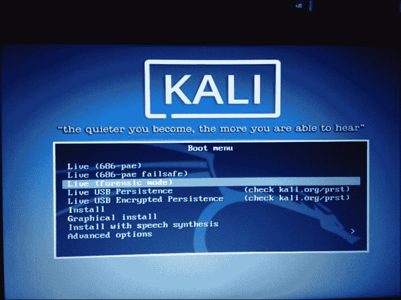

## 安装的先决条件

在本章中，您需要一个 64GB 的拇指驱动器、一份烧录成 DVD 的 Kali 副本以及一台开机时具有 DVD 播放器和 USB 功能的机器。您可以在[下载卡利 http://kali.org](http://kali.org) 并查找下载链接。

## 开机

准备好后，将 DVD 和 USB 驱动器插入机器。

### 注

在给机器通电之前，确保插入 USB*。您希望机器在引导时看到 USB，以便安装程序在安装过程中看到它。*

现在给机器通电，你会看到下面的屏幕。从菜单中选择**图形安装**。如果您使用通过在第六行选择**Install**命令找到的文本安装程序，则此安装也将起作用。

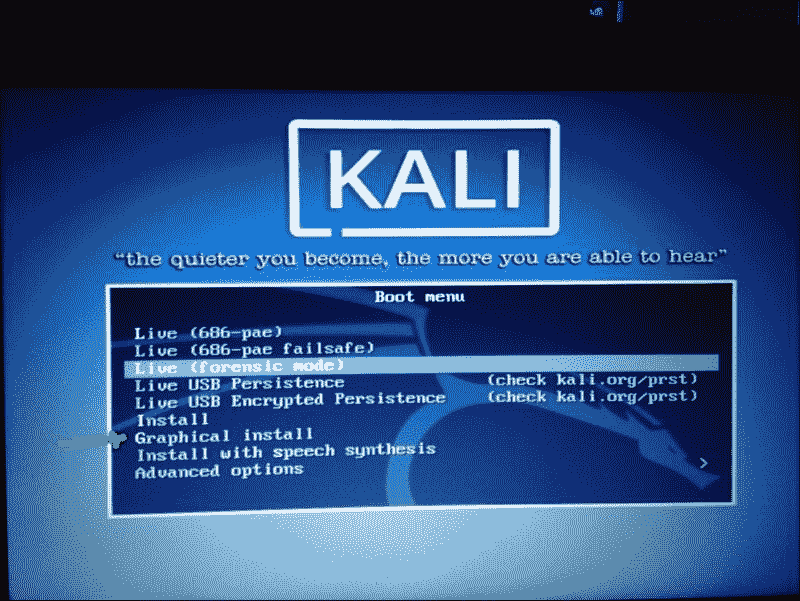

## 安装配置

如果您曾经安装过任何 Linux 发行版，那么安装的第一部分应该非常熟悉。您将看到一系列关于国家、语言和键盘设置的屏幕。根据您选择的区域设置和语言进行设置。通常情况下，安装程序会发现键盘，您可以单击所选的键盘。单击**继续**按钮，在每个页面上继续。

在这些配置之后，您将看到以下窗口，并要求为其提供主机名。给它一个独特的名称，而不是默认名称。这将有助于以后使用保存的数据和截图。如果有几个人在使用 Kali，并且所有的机器都被命名为 Kali，那么可能会混淆数据的确切来源。

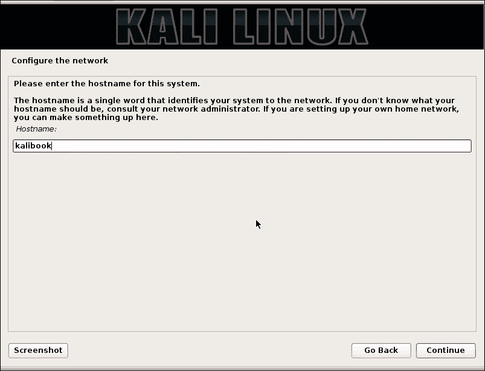

在下一个屏幕中，您将被要求输入域名。使用您或您的公司控制的真实域名。不要使用虚假域名，如`.local`或`.localdomain`。如果您在互联网上做生意，或者即使您是个人，请使用合适的域名。这使得跟踪路由和跟踪数据包更容易。域名很便宜。如果该域名属于您的雇主，并且您不能仅使用他们的域名，请请求一个子域名，如`testing.mycompany.com`。

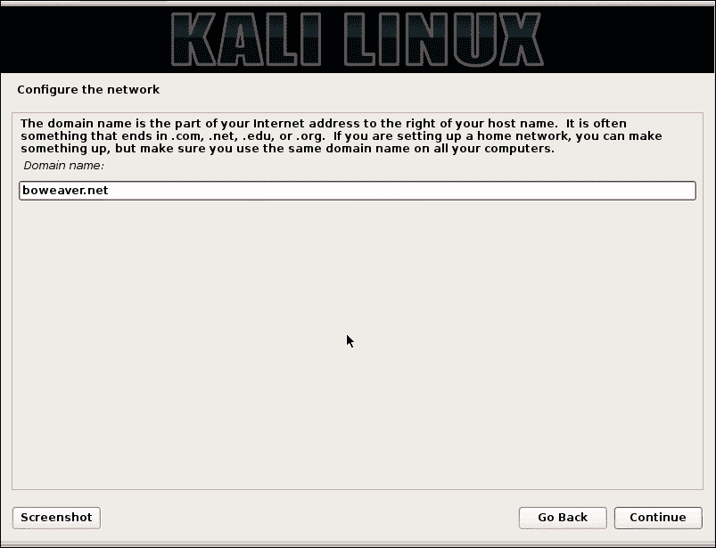

在下一个窗口中，将要求您提供根密码。将此设置为*良好的*密码。密码越长越复杂越好。请记住，经过几次测试后，网络王国的密钥将在此设备上。与测试期间的大多数计算机操作不同，您将使用根帐户而不是普通用户帐户进行测试。您需要能够打开和关闭端口，并完全控制网络堆栈。

### 注

标准的 Kali 安装不会为您提供添加标准用户的机会。如果您将 Kali 安装在笔记本电脑上，并将此笔记本电脑用于测试以外的其他用途，请创建一个标准用户并授予其*sudoer*权限。你永远不想养成使用你的`root`账户浏览万维网和发送电子邮件的习惯。

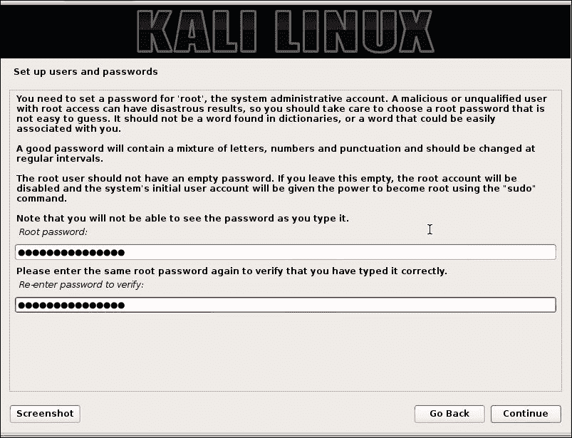

要设置的旁边是时区。通过图形地图上的位置或下拉菜单进行设置，或选择 UTC 偏移量。Kali Linux 上的许多工具都会输出时间戳，这些时间戳提供了法律证据，证明你做了你说你做的事情，当你说你做了的时候。

## 设置驱动器

下一步将设置驱动器，对其进行加密，并对驱动器进行分区。下一个对话框将要求您为此安装选择分区类型。

1.  Pick **Guided – Use entire disk and set up encrypted LVM**. This will fully-encrypt the entire drive, as opposed to just encrypting the `/home` directory.

    

    在下一个窗口中，将要求您选择安装所需的磁盘。

    ### 提示

    警告请小心选择 USB 磁盘，而不是本地驱动器。如果您选择本地驱动器，您将从该驱动器擦除操作系统。注意：在下面的窗口中，您可以看到 USB 驱动器和 VMware 虚拟磁盘。虚拟磁盘是用于此演示的虚拟机的硬盘驱动器。

2.  Pick the USB disk and click on **Continue**.

    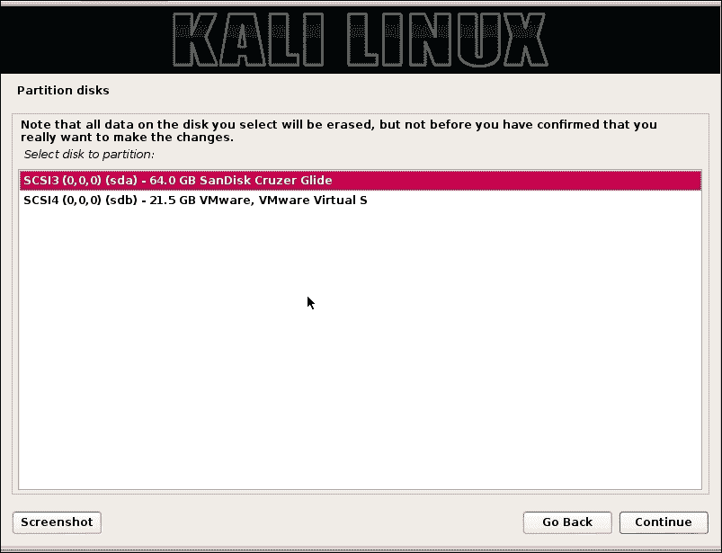

3.  In the next window you will be asked how you want to partition the drive. Just keep the default and click on **Continue**.

    

4.  Next you will be asked to save the partitioning information and this will start the partitioning process. When you click on **Continue**, here all data will be lost on the disk you are installing to. Click on **Yes** and then **Continue**.

    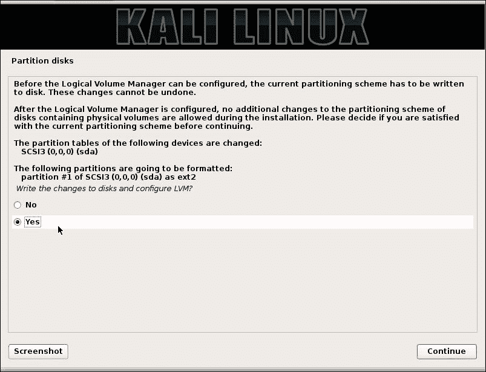

    此将启动磁盘加密和分区过程。首先，驱动器被完全擦除和加密。这需要一段时间。喝杯咖啡，或者出去散散步更好。1TB 驱动器的加密过程大约需要 30 小时。64GB 驱动器大约需要 30 分钟。

    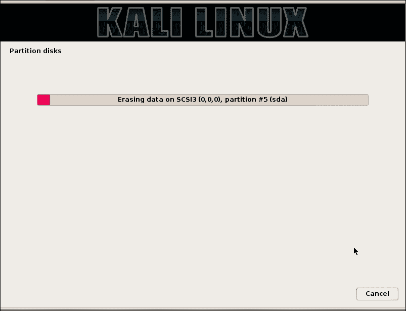

5.  In the next window, you will be asked to give provide a passphrase for the drive encryption. You will use this passphrase when booting up Kali. Note the term **passphrase**.

    ### 提示

    使用很长但容易记住的东西。一首歌、一首诗或一段引文中的一句话！时间越长越好！“玛丽养了一只小羊羔，走到镇上。”即使这句话里没有数字，开膛手约翰也要花一个多月的时间才能解开这个谜团。

    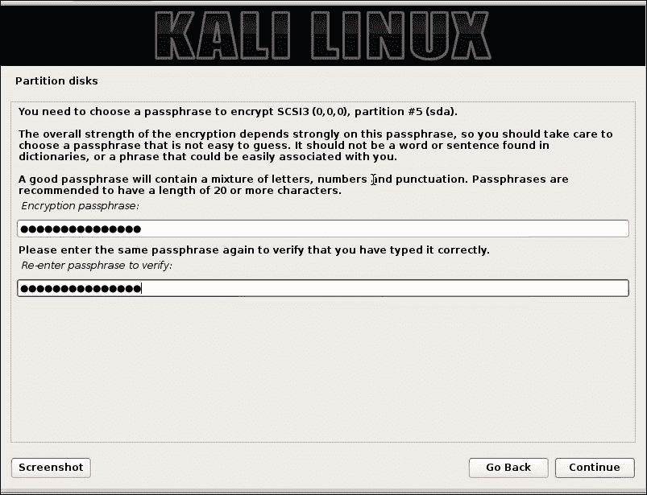

6.  Next you will be asked to confirm these changes. Pick **Finish partitioning and write changes to disk**. And then click **Continue**.

    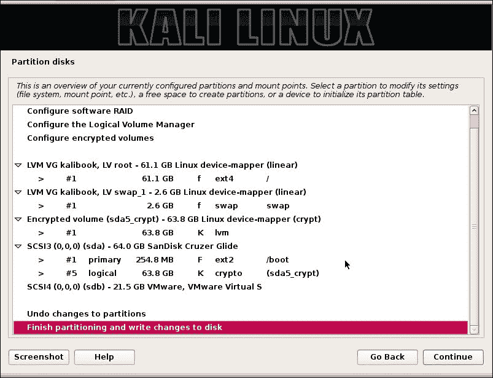

7.  Next, click on the **Yes** radio button and then click on **Continue**.

    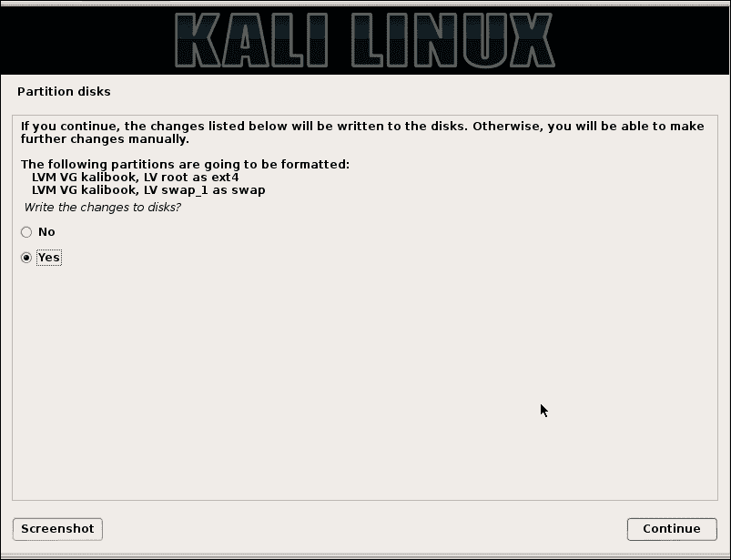

    现在，系统将启动分区过程。

    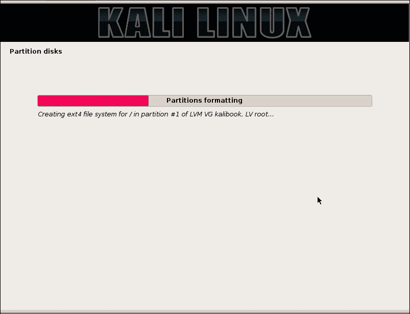

    分区过程完成后，系统安装将开始。

    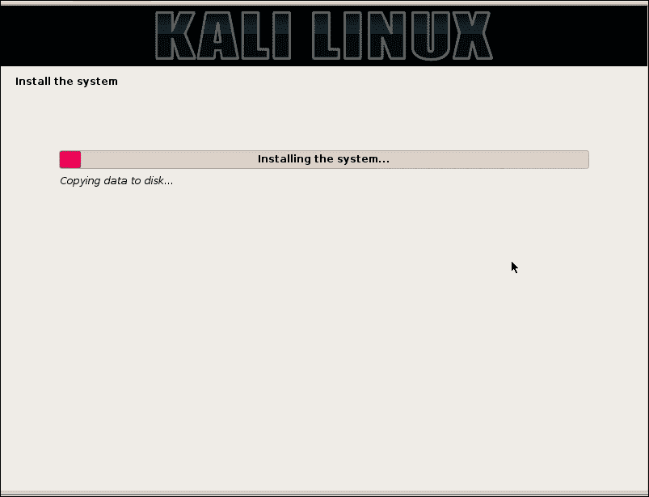

8.  Next you will be asked if you want to use a **Network Mirror**. Click **Yes** on this! This will select repository mirrors close to your location and help speed up your updates later when you update your system.

    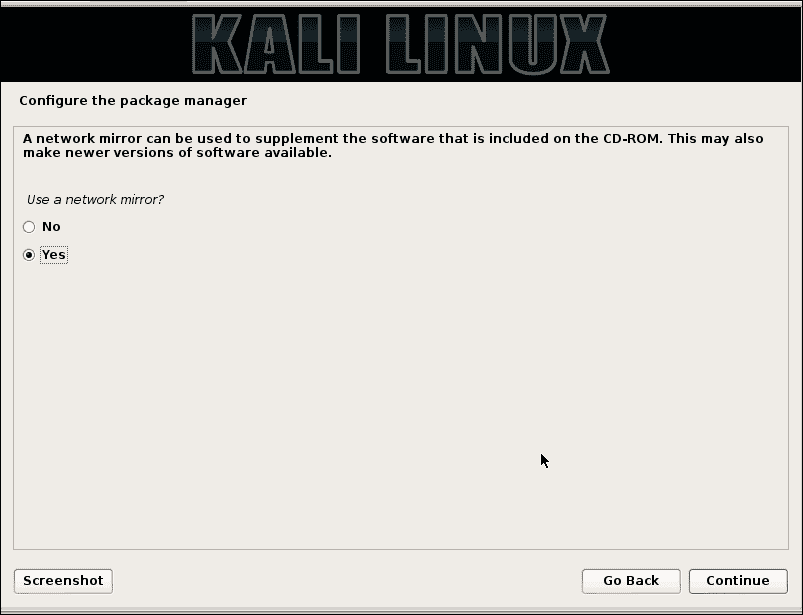

9.  您的安装过程现在将完成，系统将要求您重新启动系统。请确保在重新启动前卸下安装盘。

## 启动新安装的 Kali

现在我们准备点燃卡利。将您的 Kali USB 驱动器插入您的机器并接通电源。在启动过程开始时，您将能够手动选择启动驱动器。具体的击键方式因机器类型和品牌而异。无论您的机器使用什么过程，您都会得到一个可用驱动器的菜单来引导。选择 USB 驱动器并继续。当系统启动时，您将看到一个屏幕，询问您的密码短语。这是我们在安装过程中设置的密码短语。这不是根登录密码。输入密码短语并点击*回车*键。


这将从现在未加密的驱动器启动系统的实际引导过程。系统启动后，将显示以下登录屏幕：

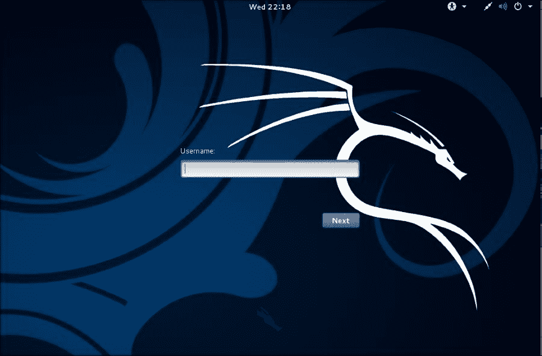

### 提示

**黑客提示**

在进一步讨论之前，我们建议您仅在您拥有测试书面授权的系统或您个人拥有的系统上使用这些工具。根据各种联邦和州法律，在没有测试授权的机器上使用这些工具都是非法的。当你被抓住的时候，你会进监狱的。黑客的刑期往往很长。

获取您公司收到的测试豁免书的个人副本，以允许他们测试客户的网络和系统。本文件应包含测试日期和时间以及待测试的 IP 地址和/或网络。这是您测试的“范围”。此文档是您的“免出狱卡”。没有此文档，请勿进行测试。

现在，让我们登录并继续我们的设置。

1.  点击*输入*键或点击菜单框中的**其他**。然后会给您一个字段，要求输入用户名。输入根并点击*回车*键。然后将提示您输入密码字段。
2.  Enter the root password and hit *Enter*. Your desktop will now load.

    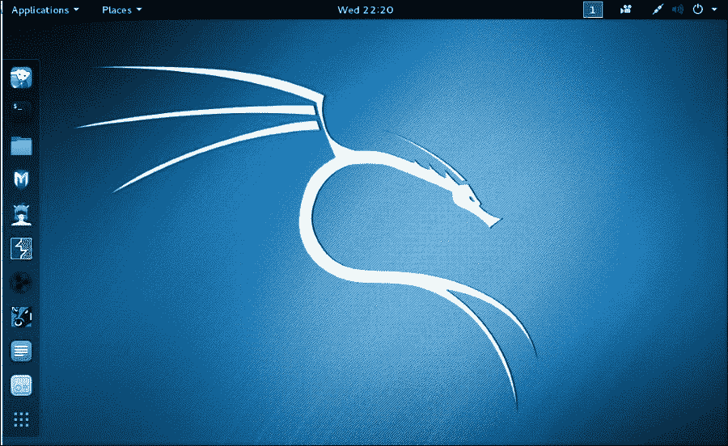

在第一次登录时，请检查以确保所有内容都是最新的。点击左上角菜单栏，弹出终端窗口，进入**应用****附件****终端**。这将打开终端或命令行窗口。键入以下内容：

```
root@kalibook :~#  apt-get update

```

这将刷新更新列表并检查新更新。下次运行：

```
root@kalibook :~#  apt-get -y upgrade

```

当`-y`自动回答“是”升级时，将运行升级过程。系统将运行所有应用的升级。如有必要，请重新启动。

### 提示

**黑客把戏**

这是另一种进入终端窗口并跳过主菜单的方法。按*Alt*+*F2*。这将打开一个带有单个字段的对话框窗口。您可以在该字段中键入任何程序名，它将打开该程序。在这种情况下，在字段中键入`terminal`，然后单击**确定**

# 从 live CD 运行 Kali

在执行取证或恢复任务时，最好从实时磁盘运行 Kali Linux。一些工具，例如**OpenVAS**等根本无法工作，因为它们需要配置并且必须保存文件更新。您不能从 CD 上执行此操作。从 live disk 可以非常灵活地完成的一件事是启动计算机而不向硬盘写入任何内容，这是您在从相关硬盘恢复文件以进行法医调查时需要考虑的一个重要因素。

要从 CD 运行 Kali，只需加载 CD 并从中引导即可。您将看到以下屏幕。注意：从 CD 实时引导有几个选项：

*   从第一个选项启动将加载 Kali，并完成一个工作网络堆栈。您可以使用此选项在网络上运行许多工具。此模式的最佳用途之一是恢复死机。它可能允许您在操作系统驱动器死机后恢复崩溃的机器。不管你用 fsck 和其他磁盘工具做什么，它都不会自动恢复。如果从 live CD 启动，则可以运行 fsck，很可能会使驱动器备份到足以从中复制数据的程度。然后，您可以使用 Kali 将数据从驱动器复制到网络上的另一台机器。
*   从第二个选项引导将在没有运行服务和网络堆栈的情况下引导 Kali。当系统出现问题时，此选项很好。可能是被闪电击中，网络接口卡损坏了。您可以在此模式下执行上述操作并将数据复制到已安装的 USB 驱动器。
*   第三种选择是“法医模式”。当使用此选项引导时，它会尽最大努力在引导时不要触摸机器本身。没有驱动器旋转，并且内存没有像正常启动时那样完全刷新。这允许您从上次引导中捕获旧内存，并允许您在不实际接触数据的情况下对任何驱动器进行取证拷贝。您没有工作的网络堆栈或正在运行的服务。
*   从第四个和第五个选项启动需要将 Kali 安装到 USB 驱动器上，并从 USB 驱动器运行。当您从 USB 启动时，您将看到如下相同的屏幕，但您将选择其中一个选项。对于具有持久性的 USB，请参见所列的链接[http://kali.org/prst](http://kali.org/prst) 为一个优秀的教程。
*   如果您对 Linux 命令行感到满意，您可能需要第六个选项。这是**Debian Ncurses**安装程序。它具有图形安装程序的所有功能，但缺乏图形安装程序的现代流畅外观。您还可以将此安装程序与“完全安装到加密 USB”部分一起使用。步骤都是一样的。
*   **图形安装程序**用于直接安装到硬盘上，在我们的演示中，您也可以使用它对 USB 或闪存驱动器进行完整安装。

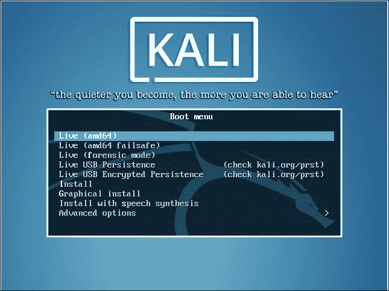

# 安装和配置应用

你需要的大部分东西都预装在 Kali 上。我们发现有一些应用是有用的，但它们并没有随基本安装一起加载。我们还将设置和配置 OpenVAS 以用作漏洞扫描程序。

## Gedit–Gnome 文本编辑器

Kali 在中加入了**Leafpad**作为的默认文本编辑器。这是一个非常轻量级的文本编辑器。Kali 的桌面是基于 Gnome 的，Gnome 文本编辑器**Gedit**是一个更好的编辑器。要安装：

```
root@kalibook :~#  apt-get -y install gedit

```

一旦安装，您将在**附件**下找到它。

## Terminator–用于多任务处理的终端仿真器

这是 Bo 最喜欢的终端应用。您可以将屏幕拆分为多个窗口。当同时运行多个 ssh 会话时，这证明是一个很大的帮助。它还有一个广播功能，您可以在所有窗口中同时运行相同的字符串。


要安装：

```
root@kalibook :~#  apt-get -y install terminator

```

## EtherApe–图形协议分析工具

这是一款很棒的视觉被动/主动网络嗅探工具。它在嗅探 Wi-Fi 网络时非常有效。它可以向您显示服务运行的位置，还可以向您显示用户在哪里进行可疑的 bit torrent 下载以及大多数公司网络上未经批准的其他行为。


# 设置和配置 OpenVAS

侦察就是一切，所以一个好的漏洞扫描器是必要的。Kali 安装了 OpenVAS。使用前必须对其进行配置和更新。幸运的是，Kali 附带了一个有用的脚本来设置这个。这可以在**应用****openvas 初始设置**中找到。单击此按钮将打开一个终端窗口并为您运行脚本。这将为 SSL 设置自签名证书，并下载最新的漏洞文件和相关数据。它还将为系统上的管理员帐户生成密码。

### 提示

请确保保存此密码，因为登录时需要它。您可以在首次登录后进行更改。

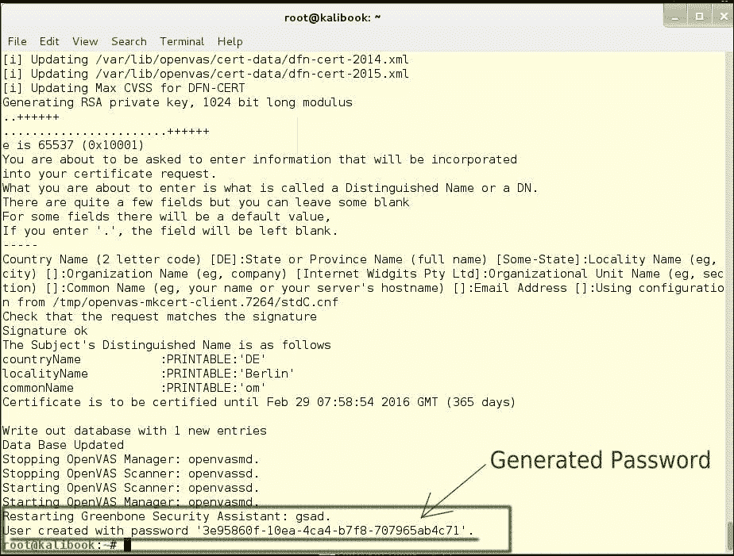

Kali 还附带了一个检查设置脚本，用于检查服务和配置。如果出现问题，它将为您提供有关该问题的有用信息。此脚本可在**应用****卡利 Linux****系统服务****OpenVas****OpenVas 检查设置**中找到。单击此处，终端窗口将打开并运行脚本。

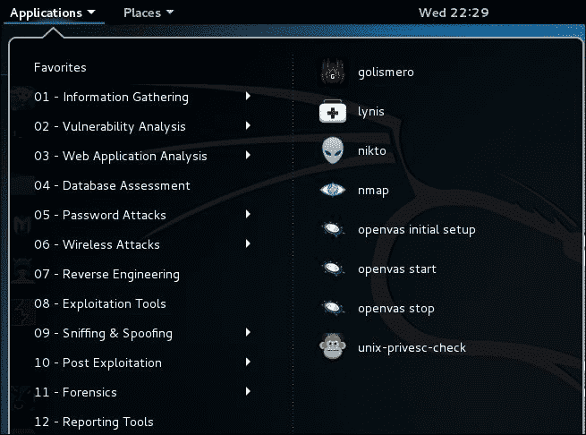

脚本结果如下图所示：

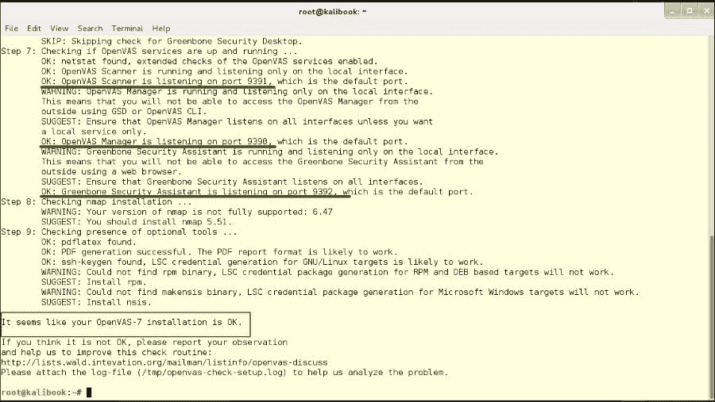

注意检查显示服务的运行端口。检查显示警告，这些服务仅在本地接口上运行。这对你的工作很好。在某些时候，在其他机器上运行 OpenVAS 服务器可能会对您有所帮助，以提高扫描速度。

接下来，我们将登录到 Greenbone web 界面以检查 OpenVAS。打开浏览器并转到`https://localhost:9392.`您将看到自签名证书的安全警告。接受此选项，您将获得以下登录屏幕。

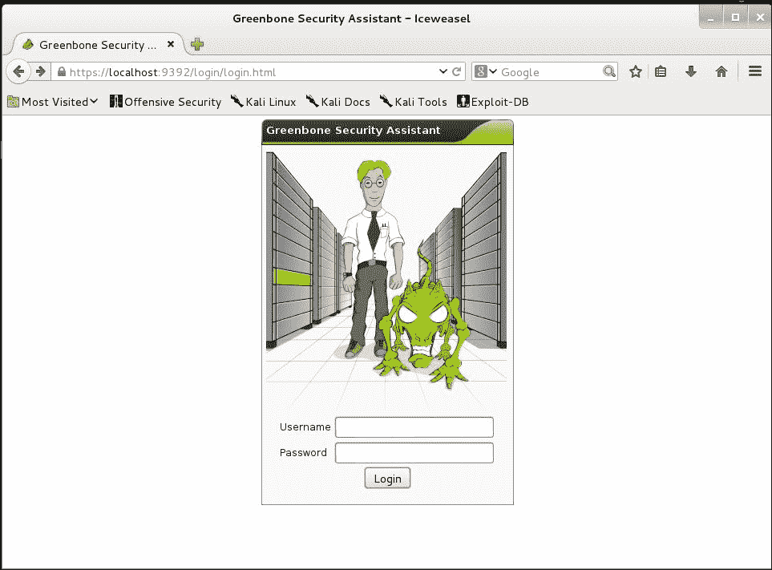

您将使用用户名`admin`和设置过程中生成的非常长且复杂的密码登录。别担心，一旦我们登录，我们将改变这一点。登录后，您将看到以下页面。


现在转到**管理****用户标签**：

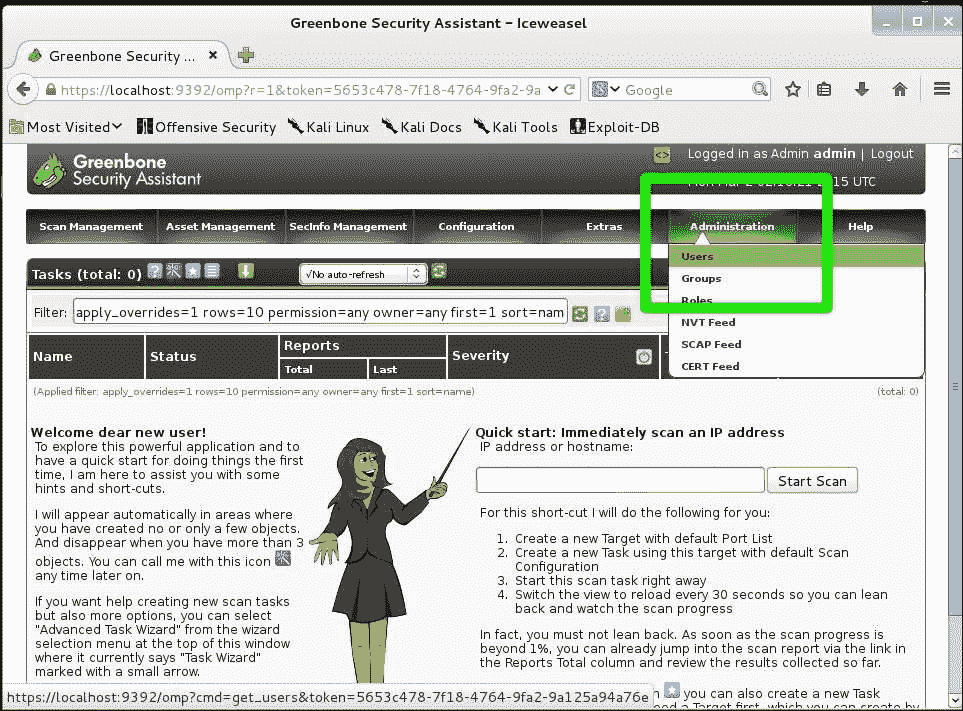

此将带您进入用户管理页面。单击名称`admin`右侧的扳手链接，将打开管理员用户的编辑页面。

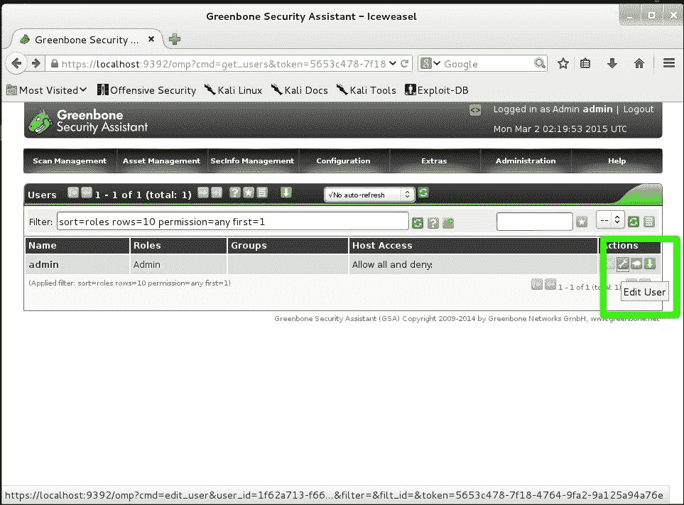

这将带您进入编辑页面。更改 ORT T1 的单选按钮。使用现有值 ORT T2 席到 T3 字段空白字段并添加新密码并点击 ALE T4 保存 SurvivT5 按钮。

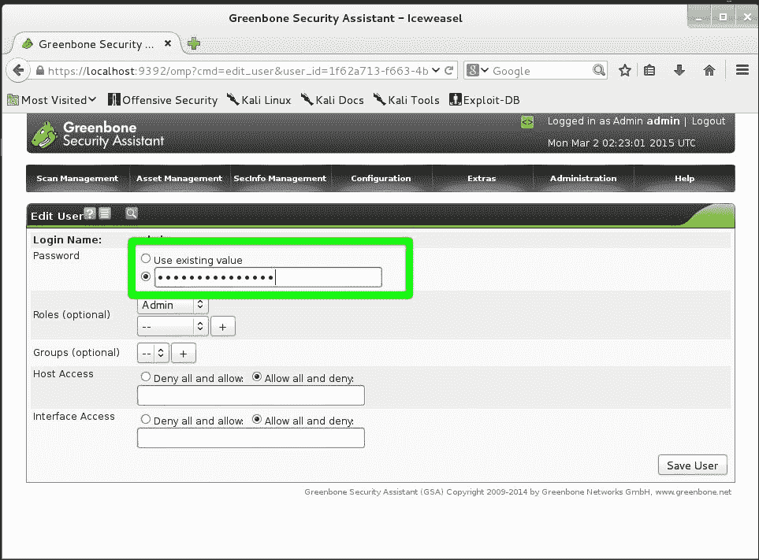

我们已经完成了 OpenVAS 的设置，我们准备做一些真正的工作。

# 报告测试

一份干净、清晰的文件有助于你报告你的工作。我们使用两种文档工具来组织文档：

*   基普诺特
*   德拉迪斯

文档管理器与单纯的文本编辑器或文字处理器略有不同。适当的文件需要有组织的归档结构。当然，Windows 安全分析师可以创建一个文件夹结构，让他们组织文档。它内置于这些文档组织应用中，使用它们可以减少丢失文件夹、意外递归文件夹或丢失调查文档重要部分的可能性。

## KeepNote–独立文档管理器

**KeepNote**是更简单的工具，如果您单独使用就足够了。要查找 KeepNote，请打开**应用**菜单并单击**Kali Linux****录制工具****文档****KeepNote**。下图显示了 KeepNote 设置，类似于记录短测试的方式。

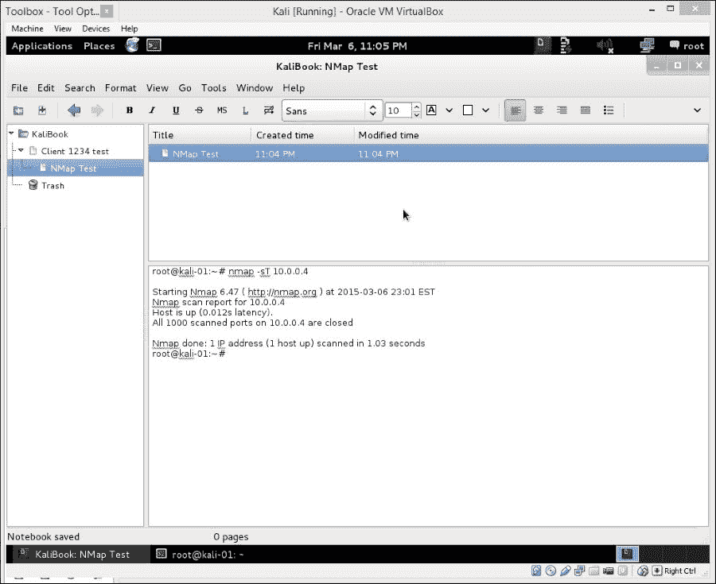

## Dradis–基于 web 的文档管理器

**Dradis**是 web 应用，可用于与团队共享文档。Dradis 的默认 URL 为`https://127.0.0.1:3004`。应用可以托管在远程安全服务器上，这是 Dradis 的最佳功能。以下截图来自[的 http://dradisframework.org](http://dradisframework.org) 。

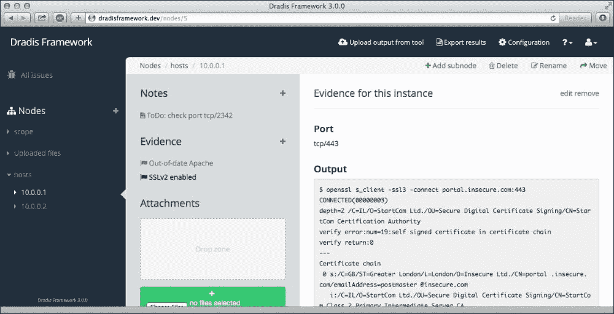

# 在 Kali Linux 上运行服务

当需要时，有项服务需要开启。Windows 和 Linux 中服务的一般用途是在计算机启动时启动它们。大多数管理员很少花时间管理服务，除非出现问题。在 Kali 系统中，当您没有实际执行安全分析任务时，您将倾向于关闭工作站，并且您肯定不希望通过 Internet 访问工作站上的安全工具，如 OpenVAS 或 Metasploit。这意味着您希望在需要时启动它们，在不使用它们时关闭它们。

您可以在**应用**菜单中找到启动和停止 Kali 服务的命令：**Kali Linux****系统服务****Metasploit【社区/Pro】社区【启动】停止】**

使用服务的另一种方法是使用命令行。作为一个例子，考虑 HTTP（ApACE2）。有几种服务选项：

*   Start–启动 Apache web 服务器并显示进程 ID（PID）
*   状态–显示服务器的状态。是吗？它下来了吗？它卡住了吗？
*   重新启动–关闭服务器并在不同的 PID 上重新启动它。如果服务器被卡住或您更改了服务器所依赖的网络进程，请使用此选项。
*   重新加载–重新读取配置。在对配置进行微小更改时使用此选项。
*   Stop – This shuts down the web server.

    

# 探索 Kali Linux 前 10 名及更多

Kali Linux 的创建者有一个工具栏，上面有前 10 个安全工具。我们将向您展示所有这些工具的适当用途：以及其他几种工具：

*   Aircrack ng：用于破解 802.11 WPA-PSA 和 WEP 密钥的加密破解工具。
*   Burpsuite：用于测试 web 应用的集成工具。
*   （THC）Hydra:A 并行登录破解程序。
*   约翰（开膛手）：密码破解工具。
*   马尔蒂戈：一个情报和取证应用。
*   Metasploit 框架：一个非常灵活的安全测试套件。
*   NMap:卓越的网络映射工具。
*   Owasp ZAP：另一个 web 应用测试工具。
*   SqlMap:SQL 注入和数据库接管工具
*   Wireshark：卓越网络协议分析工具。

# 总结

本章向您展示了两种设置 Kali Linux 的方法，以便您可以使用公司发行的 Windows 笔记本电脑或任何其他笔记本电脑，从而使 Kali Linux 获得更好的性能，而不必仅为 Kali 而申请新机器。大多数企业不允许双重启动计算机，在 VM 上运行 Kali 会限制 Kali 安装的资源。此外，本章还向您展示了我们使用的两种报告工具，以及每种工具最有意义的情况。我们第一次向您展示了如何设置 OpenVAS。我们还向您展示了如何在 Kali Linux 上运行服务。最后，我们介绍了我们每天用于在 Windows 网络上执行渗透测试的十大 Kali 安全工具。