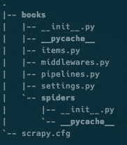
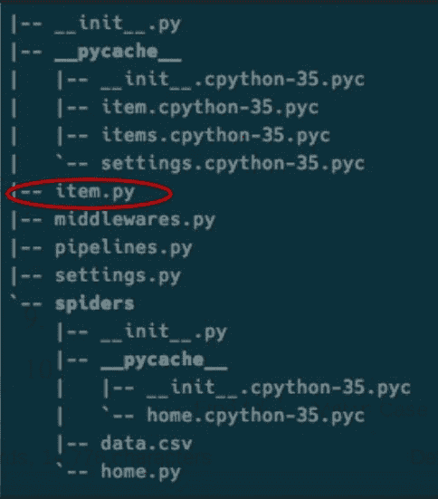
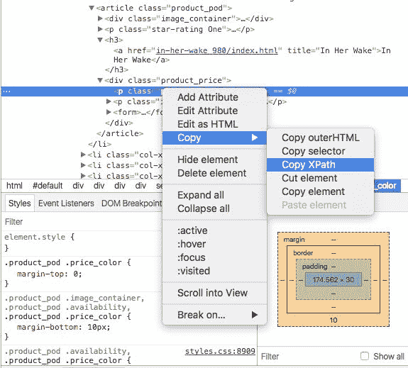
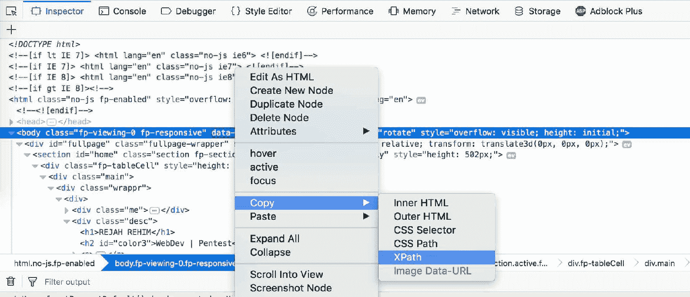
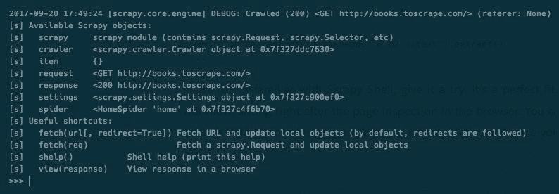

# 五、用 Scrapy 和 BeautifulSoup 爬取

在本章中，我们将介绍以下配方：

*   带刮痕的蜘蛛网
*   刮壳
*   将提取器与 Scrapy 连接
*   使用 Scrapy 登录网站后进行刮削

# 介绍

**Scrapy**是最强大的 Python web 爬行框架之一，它可以帮助实现许多基本功能，从而高效地抓取网页。

# 带刮痕的蜘蛛网

Web 爬行从一个 URL 或要访问的 URL 列表开始，当爬行器获得一个新页面时，它会分析该页面以识别所有超链接，并将这些链接添加到要爬行的 URL 列表中。只要找到新数据，此操作就会递归继续。

网络蜘蛛可以找到新的 URL 并为其编制索引以便爬行或从中下载有用的数据。在下面的配方中，我们将使用 Scrapy 创建一个网络蜘蛛。

# 准备

我们可以从安装 Scrapy 开始。可以通过 Python 的`pip`命令安装：

```
pip install scrapy   
```

确保您具有安装 Scrapy 所需的权限。如果权限出现任何错误，请使用`sudo`命令。

# 怎么做。。。

让我们用 Scrapy 创建一个简单的蜘蛛：

1.  要创建新的 spider 项目，请打开终端并转到 spider 的文件夹：

```
$ mkdir new-spider
$ cd new-spider  
```

2.  然后运行以下命令，创建一个带有`scrapy`的新 spider 项目：

```
$ scrapy startproject books  
```

这将创建一个名为`books`的项目和一些用于创建爬虫的有用文件。现在您有了一个文件夹结构，如以下屏幕截图所示：



3.  现在，我们可以使用以下命令创建爬虫程序：

```
$ scrapy genspider home books.toscrape.com  
```

这将生成名为`home`的爬行器代码，因为我们计划爬行`books.toscrape.com`的主页。现在`spiders`文件夹内的文件夹结构如下：


4.  如您所见，`spiders`文件夹中有一个名为`home.py`的文件。我们可以打开`home.py`并开始编辑它。`home.py`文件将具有以下代码：

```
# -*- coding: utf-8 -*- 
import scrapy 
class HomeSpider(scrapy.Spider): 
    name = 'home' 
    allowed_domains = ['books.toscrape.com'] 
    start_urls = ['http://books.toscrape.com/'] 
    def parse(self, response): 
        pass 
```

`HomeSpider`是`scrapy.spider`的一个子类。名称设置为`home`，这是我们在生成 spider 时提供的。`allowed_domains`属性定义此爬虫程序的授权域，`start_urls`定义爬虫程序开始的 URL。

顾名思义，`parse`方法解析所访问 URL 的内容。

5.  尝试使用以下命令运行 spider：

```
$ scrapy crawl home    
```

6.  现在，我们可以重写 spider 以浏览分页链接：

```
from scrapy.spiders import CrawlSpider, Rule 
from scrapy.linkextractors import LinkExtractor  
class HomeSpider(CrawlSpider): 
    name = 'home' 
    allowed_domains = ['books.toscrape.com'] 
    start_urls = ['http://books.toscrape.com/'] 
    rules = (Rule(LinkExtractor(allow=(), restrict_css=('.next',)), 
             callback="parse_page", 
             follow=True),)  
    def parse_page(self, response): 
        print(response.url) 
```

要浏览多个页面，我们可以使用子类`CrawlSpider`。从`scrapy.spider`导入`CrawlSpider`和`Rule`模块。对于提取链接，我们可以使用`scrapy.linkextractors`中的`LinkExtractor`。

然后我们必须设置`rules`变量，该变量用于设置页面导航规则。这里，我们使用`restrict_css`参数设置`css`类以进入下一页。通过浏览器查看网页，可以找到下一页 URL 的`css`类，如下图所示：


7.  现在，通过使用以下命令运行爬虫程序来检查爬虫程序：

```
$ scrapy crawl home  
```

这将打印蜘蛛解析的所有 URL。

8.  让我们重写脚本以获得书`title`和`price`。为此，我们必须为我们的项创建一个类，因此在`book`项目中，我们将创建另一个名为`item.py`的文件，并定义要提取的项：

```
from scrapy.item import Item, Field 
class BookItem(Item): 
    title = Field() 
    price = Field() 
```

在这里，我们定义了一个新类，其中包含我们希望通过 spider 提取的细节。现在，文件夹结构如下所示：



9.  然后更新`spider/home.py`文件提取数据：

```
from scrapy.spiders import CrawlSpider, Rule 
from scrapy.linkextractors import LinkExtractor 
from books.item import BookItem 
class HomeSpider(CrawlSpider): 
    name = 'home' 
    allowed_domains = ['books.toscrape.com'] 
    start_urls = ['http://books.toscrape.com/'] 
    rules = (Rule(LinkExtractor(allow=(), restrict_css=('.next',)), 
             callback="parse_page", 
             follow=True),) 
    def parse_page(self, response): 
        items = [] 
        books = response.xpath('//ol/li/article') 
        index = 0 
        for book in books: 
            item = BookItem() 
            title = books.xpath('//h3/a/text()')[index].extract() 
            item['title'] = str(title).encode('utf-8').strip() 
            price = books.xpath('//article/div[contains(@class, "product_price")]/p[1]/text()')[index].extract() 
            item['price'] = str(price).encode('utf-8').strip() 
            items.append(item) 
            index += 1 
            yield item 
```

更新`parse_page`方法，从每页中提取`title`和`price`详细信息。要从页面中提取数据，我们必须使用选择器。在这里，我们使用了`xpath`选择器。XPath 是一种常用语法或语言，用于浏览 XML 和 HTML 文档。

在`parse_page`方法中，最初，我们选择了所有文章标签，其中图书详细信息被放置在网站上，并通过每个文章标签进行迭代，以解析图书的标题和价格。

10.  要获取标记的`xpath`选择器，我们可以使用 Google Chrome 浏览器的 XPath 工具，如下所示：



我们可以使用 Firefox Inspector，如下所示：



11.  现在我们可以运行 spider 将数据提取到一个`.csv`文件：

```
$ scrapy crawl home -o book-data.csv -t csv   
```

这将在当前目录中创建一个名为`book-data.csv`的文件，其中包含提取的详细信息。

您可以在[上了解有关 XPath 等选择器的更多信息，以及如何从页面中选择详细信息 https://doc.scrapy.org/en/latest/topics/selectors.html](https://doc.scrapy.org/en/latest/topics/selectors.html) 。

# 刮壳

Scrapy shell 是一个命令行界面，可以帮助调试脚本，而无需运行整个爬虫程序。我们必须提供一个 URL，Scrapy shell 将打开一个接口，与爬行器在其回调中处理的对象进行交互，例如响应对象。

# 怎么做。。。

我们可以简单地使用 Scrapy 的交互式 shell。步骤如下：

1.  打开终端窗口并键入以下命令：

```
$ Scrapy shell http://books.toscrape.com/  
```

加载 Scrapy shell 后，它将打开一个与响应对象交互的界面，如下所示：



2.  我们可以使用此接口调试`response`对象的选择器：

```
>>> response.xpath('//ol/li/article')  
```

这将打印选择器输出。有了它，我们可以创建和测试爬行器的提取规则。

3.  我们还可以从代码中打开 Scrapy shell 以调试提取规则中的错误。为此，我们可以使用`inspect_response`方法：

```
from scrapy.spiders import CrawlSpider, Rule 
from scrapy.linkextractors import LinkExtractor 
from scrapy.shell import inspect_response  
class HomeSpider(CrawlSpider): 
    name = 'home' 
    allowed_domains = ['books.toscrape.com'] 
    start_urls = ['http://books.toscrape.com/'] 
    rules = (Rule(LinkExtractor(allow=(), restrict_css=('.next',)), 
             callback="parse_page", 
             follow=True),)  
    def parse_page(self, response): 
        if len(response.xpath('//ol/li/article')) < 5: 
            title = response.xpath('//h3/a/text()')[0].extract() 
            print(title) 
        else: 
            inspect_response(response, self) 
```

如果条件失败，这将打开一个 shell 接口。在这里，我们导入了`inspect_response`并使用它从代码中调试 spider。

# 带刮屑的链节提取器

正如其名称所示，链接提取器是用于从 Scrapy 响应对象中提取链接的对象。Scrapy 有内置的链接提取器，如`scrapy.linkextractors`。

# 怎么做。。。

让我们用 Scrapy 构建一个简单的链接提取器：

1.  正如我们在上一个配方中所做的那样，我们必须创建另一个蜘蛛来获取所有链接。

在新的`spider`文件中，导入所需的模块：

```
import scrapy 
from scrapy.linkextractor import LinkExtractor 
from scrapy.spiders import Rule, CrawlSpider  
```

2.  创建一个新的`spider`类并初始化变量：

```
class HomeSpider2(CrawlSpider): 
    name = 'home2' 
    allowed_domains = ['books.toscrape.com'] 
    start_urls = ['http://books.toscrape.com/']
```

3.  现在我们必须初始化对 URL 进行爬网的规则：

```
rules = [ 
    Rule( 
        LinkExtractor( 
            canonicalize=True, 
            unique=True 
        ), 
        follow=True, 
        callback="parse_page" 
    ) 
]   
```

该规则命令提取所有唯一和规范化的链接，并指示程序遵循这些链接并使用`parse_page`方法解析它们

4.  现在我们可以使用`start_urls`变量中列出的 URL 列表启动爬行器：

```
def start_requests(self): 
    for url in self.start_urls: 
        yield scrapy.Request(url, callback=self.parse, dont_filter=True)  
```

当打开卡盘进行刮削时，`start_requests()`方法调用一次

5.  现在我们可以编写解析 URL 的方法：

```
def parse_page(self, response): 
    links = LinkExtractor(canonicalize=True, unique=True).extract_links(response) 
        for link in links: 
            is_allowed = False 
            for allowed_domain in self.allowed_domains: 
                if allowed_domain in link.url: 
                    is_allowed = True 
            if is_allowed: 
                print link.url 
```

此方法提取与当前响应相关的所有规范化和唯一链接。它还验证链接 URL 的域是否位于其中一个授权域中。

# 使用 Scrapy 登录网站后进行刮削

有些情况下，我们必须登录网站才能访问我们计划提取的数据。使用 Scrapy，我们可以轻松处理登录表单和 cookie。我们可以利用 Scrapy 的`FormRequest`对象；它将处理登录表单，并尝试使用提供的凭据登录。

# 准备

当我们访问具有身份验证的网站时，我们需要用户名和密码。在 Scrapy 中，我们需要相同的凭据才能登录。因此，我们需要得到一个帐户的网站，我们计划刮。

# 怎么做。。。

下面是我们如何使用 Scrapy 来抓取需要登录的网站：

1.  要使用`FormRequest`对象，我们可以更新`parse_page`方法，如下所示：

```
def parse(self, response): 
    return scrapy.FormRequest.from_response( 
        response, 
        formdata={'username': 'username', 'password': 'password'}, 
        callback=self.parse_after_login 
     ) 
```

这里，response 对象是我们必须填写登录表单的页面的 HTTP 响应。`FormRequest`方法包括我们需要登录的凭证和登录后用来解析页面的`callback`方法。

2.  要在登录后分页，同时保留登录会话，我们可以使用上一个配方中使用的方法。